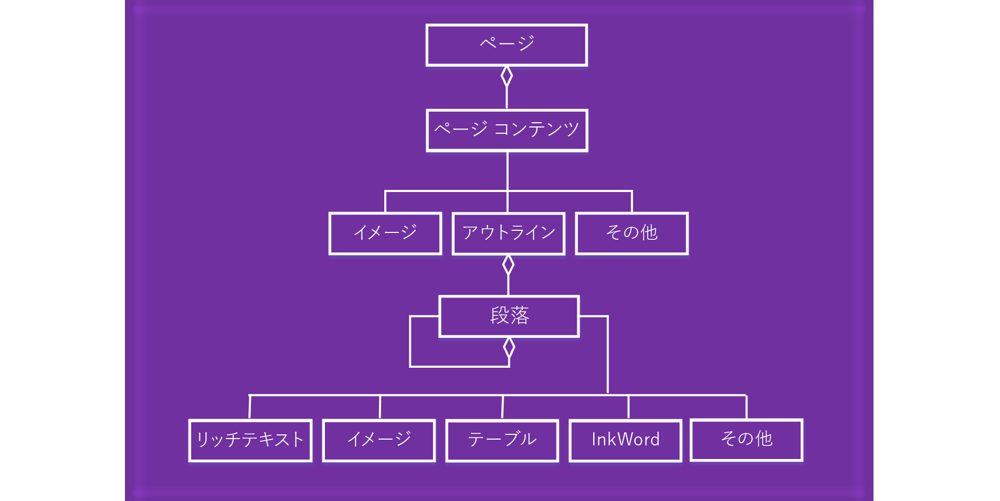

# OneNote ページ コンテンツを使用するWork with OneNote page content 

OneNote アドインの JavaScript API では、ページ コンテンツは次のようなオブジェクト モデルで表されます。In the OneNote add-ins JavaScript API, page content is represented by the following object model.

  

- ページ オブジェクトには、PageContent オブジェクトのコレクションが含まれています。A Page object contains a collection of PageContent objects.
- PageContent オブジェクトには、アウトライン、イメージ、その他のコンテンツ タイプが含まれています。A PageContent object contains a content type of Outline, Image, or Other.
- アウトライン オブジェクトには、Paragraph オブジェクトのコレクションが含まれています。An Outline object contains a collection of Paragraph objects.
- Paragraph オブジェクトには、RichText、Image、Table、Other のコンテンツ タイプが含まれています。A Paragraph object contains a content type of RichText, Image, Table, or Other.

空の OneNote ページを作成するには、次の方法のいずれかを使用します。To create an empty OneNote page, use one of the following methods:

- [Section.addPageSection.addPage](https://docs.microsoft.com/javascript/api/onenote/onenote.section?view=office-js#addpage-title-)
- [Page.insertPageAsSiblingPage.insertPageAsSibling](https://docs.microsoft.com/javascript/api/onenote/onenote.section?view=office-js#insertsectionassibling-location--title-)

その後、次のオブジェクトのメソッドを使用して、Page.addOutline や Outline.appendHtml などのページのコンテンツを操作します。Then use methods in the following objects to work with the page content, such as Page.addOutline and Outline.appendHtml. 

- [ページPage](https://docs.microsoft.com/javascript/api/onenote/onenote.page?view=office-js)
- [アウトラインOutline](https://docs.microsoft.com/javascript/api/onenote/onenote.outline?view=office-js)
- [段落
Paragraph](https://docs.microsoft.com/javascript/api/onenote/onenote.paragraph?view=office-js)

OneNote ページのコンテンツと構造は、HTML で表されます。次に説明するように、ページ コンテンツの作成や更新には、HTML のサブセットだけがサポートされています。The content and structure of a OneNote page are represented by HTML. Only a subset of HTML is supported for creating or updating page content, as described below.

## サポートされている HTMLSupported HTML

ページ コンテンツを作成して更新するために、OneNote アドインの JavaScript API では次の HTML がサポートされています。The OneNote add-in JavaScript API supports the following HTML for creating and updating page content:

- `<html>`, `<body>`, `
`, ``, ` ``<html>`, `<body>`, `
`, ``, ` ` 
- `
`
- ``
- `<a>`
- `<ul>`, `<ol>`, `<li>``<ul>`, `<ol>`, `<li>` 
- `<table>`, `<tr>`, `<td>``<table>`, `<tr>`, `<td>`
- `<h1>` ... `<h6>``<h1>` ... `<h6>`
- `<b>`, `<em>`, `<strong>`, `<i>`, `<u>`, `<del>`, ``, ``, `<cite>``<b>`, `<em>`, `<strong>`, `<i>`, `<u>`, `<del>`, ``, ``, `<cite>`

## ページ コンテンツへのアクセスAccessing page contents

現在アクティブなページの `Page#load` による*ページ コンテンツ*へのアクセスだけが可能です。アクティブなページを変更するには、`navigateToPage($page)` を呼び出します。You are only able to access *Page Content* via `Page#load` for the currently active page. To change the active  page, invoke `navigateToPage($page)`.

タイトルなどのメタデータは、どのページでも照会できます。Metadata such as title can still be queried for any page.

## 関連項目See also

- [OneNote JavaScript API のプログラミングの概要OneNote JavaScript API programming overview](onenote-add-ins-programming-overview.md)
- [OneNote JavaScript API リファレンスOneNote JavaScript API reference](https://docs.microsoft.com/office/dev/add-ins/reference/overview/onenote-add-ins-javascript-reference?view=office-js)
- [Rubric Grader のサンプルRubric Grader sample](https://github.com/OfficeDev/OneNote-Add-in-Rubric-Grader)
- [Office アドイン プラットフォームの概要Office Add-ins platform overview](../overview/office-add-ins.md)
