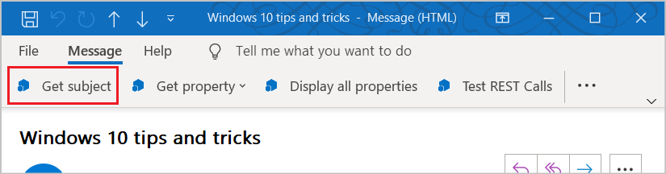

# Outlook のアドイン コマンド

Outlook アドイン コマンドを作成して、ボタンまたはドロップダウン メニューとしてリボンに追加すると、リボンから特定のアドイン操作を開始できるようになり、ユーザーが簡単、直観的、かつ自然にアドインにアクセスできるようになります。アドイン コマンドを採用すれば、シームレスに機能性が向上するので、より魅力的なソリューションを作成することができます。

> [!NOTE]
> アドイン コマンドは、Windows 用 Outlook 2013 以降、Mac 用 Outlook 2016 以降、iPhone 用 Outlook、Android 用 Outlook、Exchange 2016 以降の Outlook on the web、Office 365 の Outlook on the web および Outlook.com でのみ使用できます。
>
> Outlook 2013 でのアドイン コマンドのサポートには、次の 3 つの更新プログラムが必要です。
> - [2016 年 3 月 8 日にリリースされた Outlook 用セキュリティ更新プログラム](https://support.microsoft.com/kb/3114829)
> - [2016 年 3 月 8 日にリリースされた Office 用セキュリティ更新プログラム (KB3114816)](https://support.microsoft.com/help/3114816/march-8,-2016,-update-for-office-2013-kb3114816)
> - [2016 年 3 月 8 日にリリースされた Office 用セキュリティ更新プログラム (KB3114828)](https://support.microsoft.com/help/3114828/march-8,-2016,-update-for-office-2013-kb3114828)
>
> Exchange 2016 のアドイン コマンドのサポートでは、[累積的な更新プログラム 5](https://support.microsoft.com/help/4012106/cumulative-update-5-for-exchange-server-2016) が必要です。

アドイン コマンドは、アクティブ化するアイテムの種類を制限する [ItemHasAttachment、ItemHasKnownEntity、ItemHasRegularExpressionMatch ルール](activation-rules.md) を使用しないアドインに対してのみ使用できます。ただし、[コンテキスト アドイン](contextual-outlook-add-ins.md) は、現在選択されているアイテムがメッセージか予定かに応じて異なるコマンドを表示でき、閲覧シナリオまたは作成シナリオのどちらで表示するかを選択できます。可能な場合はアドイン コマンドを使用するのが [ベスト プラクティス](../concepts/add-in-development-best-practices.md) です。

## アドイン コマンドの作成

アドイン コマンドは、[VersionOverrides](../reference/manifest/versionoverrides.md) 要素のアドイン マニフェストで宣言されます。この要素はマニフェスト スキーマ v1.1 に追加されたもので、下位互換性が保証されています。`VersionOverrides` をサポートしていないクライアントでも、既存のアドインは引き続きアドイン コマンドのないときと変わらずに機能します。

`VersionOverrides` マニフェスト エントリは、アドインについての多くの事柄 (ホスト、リボンに追加するコントロールの種類、テキスト、アイコン、関連する機能など) を指定します。

アドインが、進行状況のインジケーターやエラー メッセージなど、状態更新を提供しなければならない場合、それは[通知 API](/javascript/api/outlook/office.NotificationMessages) を通して行う必要があります。通知の処理を、マニフェストの `FunctionFile` ノードで指定されている別の HTML ファイルに定義する必要もあります。

アドイン コマンドがリボンに合わせて適正に配置されるように、開発者は必要なサイズのアイコンをすべて定義する必要があります。必要とされるアイコンのサイズは、デスクトップの場合には 80 x 80 ピクセル、32 x 32 ピクセル、16 x 16 ピクセルで、モバイルの場合には 48 × 48 ピクセル、32 x 32 ピクセル、25 x 25 ピクセルです。

アドイン コマンドの作成に関する詳細は、「[マニフェストでアドイン コマンドを作成する](../develop/create-addin-commands.md)」を参照してください。

## アドイン コマンドの表示方法

アドイン コマンドは、リボン上にボタンとして表示されます。ユーザーがアドインをインストールすると、アドインのコマンドはボタン グループとして UI に表示されます。これは、リボンの既定のタブまたはカスタム タブのいずれかに表示されます。メッセージの場合、既定のタブは **[ホーム]** タブまたは **[メッセージ]** タブのいずれかです。予定表の場合、既定のタブは **[会議]** タブ、**[個別の会議]** タブ、**[定期的な会議]** タブ、または **[予定]** タブです。モジュール拡張機能の場合、既定のタブはカスタム タブです。既定タブでは、それぞれのアドインは 1 つのリボン グループを持つことができ、1 つのリボン グループに含まれるコマンドの数は 6 個までです。カスタム タブには、アドインのグループを 10 個まで含めることができ、1 つのグループにコマンドが 6 個まで表示されます。アドインに使用できるカスタム タブは 1 つに制限されています。

リボンがいっぱいになると、アドイン コマンドがオーバーフロー メニューに表示されます。 通常、アドインのアドイン コマンドはグループ化されています。

アドインにアドイン コマンドが追加されると、アドイン名は、アプリ バーから削除されます。リボン上のアドイン コマンド ボタンだけが残ります。

### モダン Outlook on the web

Outlook on the web では、アドイン名はオーバーフロー メニューに表示されます。 アドインに複数のアドイン コマンドがある場合、アドイン メニューを展開して、アドイン名のラベルが付いたボタンのグループを表示できます。

## アドイン コマンドの UX シェイプの目的

アドイン コマンドの UX シェイプは、さまざまな機能を実行できるボタンを含むホスト アプリケーションのリボン タブで構成されています。現時点では、次の 3 つの UI シェイプがサポートされています。

- JavaScript 関数を実行するボタン
- 作業ウィンドウを起動するボタン
- 他の 2 種類のボタンについて 1 つ以上を選択肢とするドロップダウン メニューを表示するボタン

### JavaScript 関数の実行

JavaScript 関数を実行するアドイン コマンド ボタンは、操作を開始するためにユーザーが追加の選択をする必要のないシナリオで使用します。追跡や通知、印刷などの操作が該当します。また、ユーザーがサービスからより詳細な情報を取得するシナリオでも使用します。

モジュール拡張機能では、メイン ユーザー インターフェイスのコンテンツを操作する JavaScript 関数をアドイン コマンド ボタンで実行できます。

### 作業ウィンドウの起動

作業ウィンドウを起動するアドイン コマンド ボタンは、ユーザーが長時間アドインとの対話式操作を行う必要があるシナリオで使用します。たとえば、アドインでは設定の変更や多数のフィールドへの入力が必要になることがあります。

垂直作業ウィンドウの既定の幅は 320 px です。垂直作業ウィンドウのサイズは、Outlook エクスプローラーとインスペクターの両方で変更できます。このウィンドウのサイズは、To Do ウィンドウやリスト ビューのサイズを変更するときと同じ方法で変更することができます。

 

このスクリーンショットは、垂直作業ウィンドウの例を示しています。左上隅にアドイン コマンドの名前が付いたウィンドウが開いています。ユーザーは、このウィンドウの使用後に、右上隅の **[X]** ボタンを使用してウィンドウを閉じることができます。既定では、このウィンドウはメッセージを越えて存続しません。アドインは、作業ウィンドウの[ピン留めをサポートする](pinnable-taskpane.md)ことができます。また、新しいメッセージが選択されたときには、イベントを受信できます。作業ウィンドウに表示されるすべての UI 要素は、アドインによって提示されます (アドイン名と閉じるボタンを除く)。

ユーザーが作業ウィンドウを開く別のアドイン コマンドを選択すると、作業ウィンドウは直近に使用されたコマンドに置き換えられます。作業ウィンドウが開いているときにユーザーが、関数を実行するアドイン コマンド ボタンまたはドロップダウン メニューをクリックすると、操作が完了して、作業ウィンドウは開いたままになります。

### ドロップダウン メニュー

ドロップダウン メニュー アドイン コマンドでは、ボタンの静的リストを定義します。メニューには、機能を実行するボタンや作業ウィンドウを開くボタンを自由に組み合わせて含めることができます。サブメニューはサポートされません。

## UI でアドイン コマンドが表示される場所

アドイン コマンドは次の 4 つのシナリオでサポートされています。

### メッセージの閲覧

ユーザーが閲覧ウィンドウまたはポップアウト閲覧フォームの **メッセージ** タブでメッセージを閲覧している間、既定のタブに追加されたアドイン コマンドは **ホーム** タブに表示されます。

### メッセージの作成

ユーザーがメッセージを作成している間は、既定のタブに追加されたアドイン コマンドが **[メッセージ]** タブに表示されます。

### 開催者として予定または会議を作成または表示する

開催者として予定または会議を作成または表示する場合、既定のタブに追加されたアドイン コマンドは、ポップアウト フォームの **[会議]**、**[個別の会議]**、**[定期的な会議]**、または **[予定]** のタブに表示されます。ただし、ユーザーが予定表のアイテムを選択してもポップ アウトを開かなければ、そのアドインのリボン グループはリボンに表示されません。

### 出席者として会議を表示する

出席者として会議を表示する場合、既定のタブに追加されたアドイン コマンドは、ポップアウト フォームの **[会議]**、**[個別の会議]**、または **[定期的な会議]** のタブに表示されます。ただし、ユーザーが予定表のアイテムを選択してもポップ アウトを開かなければ、そのアドインのリボン グループはリボンに表示されません。

### モジュール拡張機能の使用

モジュール拡張機能を使用すると、モジュールのカスタム タブにアドイン コマンドが表示されます。

## 関連項目

- [マニフェストでアドイン コマンドを定義する](../develop/create-addin-commands.md)
- [アドイン コマンド デモの Outlook アドイン](https://github.com/officedev/outlook-add-in-command-demo)
