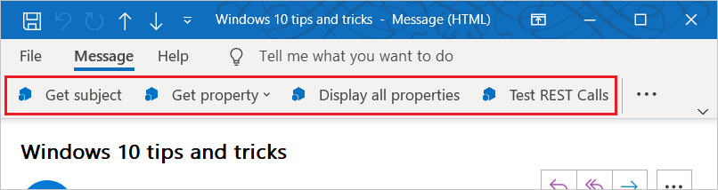

# Outlook のアドイン コマンドAdd-in commands for Outlook

Outlook add-in commands provide ways to initiate specific add-in actions from the ribbon by adding buttons or drop-down menus.Outlook add-in commands provide ways to initiate specific add-in actions from the ribbon by adding buttons or drop-down menus. This lets users access add-ins in a simple, intuitive, and unobtrusive way.This lets users access add-ins in a simple, intuitive, and unobtrusive way. Because they offer increased functionality in a seamless manner, you can use add-in commands to create more engaging solutions.Because they offer increased functionality in a seamless manner, you can use add-in commands to create more engaging solutions.

> [!NOTE]
> アドイン コマンドは、Windows 用 Outlook 2013 以降、Mac 用 Outlook 2016 以降、iOS 用 Outlook、Android 用 Outlook、Exchange 2016 以降の Outlook on the web、Microsoft 365 の Outlook on the web および Outlook.com でのみ使用できます。Add-in commands are available only in Outlook 2013 or later on Windows, Outlook 2016 or later on Mac, Outlook on iOS, Outlook on Android, Outlook on the web for Exchange 2016 or later, and Outlook on the web for Microsoft 365 and Outlook.com.
>
> Outlook 2013 でのアドイン コマンドのサポートには、次の 3 つの更新プログラムが必要です。Support for add-in commands in Outlook 2013 requires three updates:
> - [2016 年 3 月 8 日にリリースされた Outlook 用セキュリティ更新プログラムMarch 8, 2016 security update for Outlook](https://support.microsoft.com/kb/3114829)
> - [2016 年 3 月 8 日にリリースされた Office 用セキュリティ更新プログラム (KB3114816)March 8, 2016 security update for Office (KB3114816)](https://support.microsoft.com/help/3114816/march-8,-2016,-update-for-office-2013-kb3114816)
> - [2016 年 3 月 8 日にリリースされた Office 用セキュリティ更新プログラム (KB3114828)March 8, 2016 security update for Office (KB3114828)](https://support.microsoft.com/help/3114828/march-8,-2016,-update-for-office-2013-kb3114828)
>
> Exchange 2016 のアドイン コマンドのサポートでは、[累積的な更新プログラム 5](https://support.microsoft.com/help/4012106/cumulative-update-5-for-exchange-server-2016) が必要です。Support for add-in commands in Exchange 2016 requires [Cumulative Update 5](https://support.microsoft.com/help/4012106/cumulative-update-5-for-exchange-server-2016).

Add-in commands are only available for add-ins that do not use [ItemHasAttachment, ItemHasKnownEntity, or ItemHasRegularExpressionMatch rules](activation-rules.md) to limit the types of items they activate on.Add-in commands are only available for add-ins that do not use [ItemHasAttachment, ItemHasKnownEntity, or ItemHasRegularExpressionMatch rules](activation-rules.md) to limit the types of items they activate on. However, [contextual add-ins](contextual-outlook-add-ins.md) can present different commands depending on whether the currently selected item is a message or appointment, and can choose to appear in read or compose scenarios.However, [contextual add-ins](contextual-outlook-add-ins.md) can present different commands depending on whether the currently selected item is a message or appointment, and can choose to appear in read or compose scenarios. Using add-in commands if possible is a [best practice](../concepts/add-in-development-best-practices.md).Using add-in commands if possible is a [best practice](../concepts/add-in-development-best-practices.md).

## アドイン コマンドの作成Creating the add-in command

Add-in commands are declared in the add-in manifest in the [VersionOverrides element](../reference/manifest/versionoverrides.md).Add-in commands are declared in the add-in manifest in the [VersionOverrides element](../reference/manifest/versionoverrides.md). This element is an addition to the manifest schema v1.1 that ensures backward compatibility.This element is an addition to the manifest schema v1.1 that ensures backward compatibility. In a client that doesn't support `VersionOverrides`, existing add-ins will continue to function as they did without add-in commands.In a client that doesn't support `VersionOverrides`, existing add-ins will continue to function as they did without add-in commands.

`VersionOverrides` マニフェスト エントリは、アドインについての多くの事柄 (ホスト、リボンに追加するコントロールの種類、テキスト、アイコン、関連する機能など) を指定します。The `VersionOverrides` manifest entries specify many things for the add-in, such as the host, types of controls to add to the ribbon, the text, the icons, and any associated functions.

When an add-in needs to provide status updates, such as progress indicators or error messages, it must do so through the [notification APIs](/javascript/api/outlook/office.notificationmessages).When an add-in needs to provide status updates, such as progress indicators or error messages, it must do so through the [notification APIs](/javascript/api/outlook/office.notificationmessages). The processing for the notifications must also be defined in a separate HTML file that is specified in the `FunctionFile` node of the manifest.The processing for the notifications must also be defined in a separate HTML file that is specified in the `FunctionFile` node of the manifest.

Developers should define icons for all required sizes so that the add-in commands will adjust smoothly along with the ribbon.Developers should define icons for all required sizes so that the add-in commands will adjust smoothly along with the ribbon. The required icon sizes are 80 x 80 pixels, 32 x 32 pixels, and 16 x 16 pixels for desktop, and 48 x 48 pixels, 32 x 32 pixels, and 25 x 25 pixels for mobile.The required icon sizes are 80 x 80 pixels, 32 x 32 pixels, and 16 x 16 pixels for desktop, and 48 x 48 pixels, 32 x 32 pixels, and 25 x 25 pixels for mobile.

## アドイン コマンドの表示方法How do add-in commands appear?

An add-in command appears on the ribbon as a button.An add-in command appears on the ribbon as a button. When a user installs an add-in, its commands appear in the UI as a group of buttons.When a user installs an add-in, its commands appear in the UI as a group of buttons. This can either be on the ribbon's default tab or on a custom tab. For messages, the default is either the **Home** or **Message** tab. For the calendar, the default is the **Meeting**, **Meeting Occurrence**, **Meeting Series**, or **Appointment** tab. For module extensions, the default is a custom tab. On the default tab, each add-in can have one ribbon group with up to 6 commands.This can either be on the ribbon's default tab or on a custom tab. For messages, the default is either the **Home** or **Message** tab. For the calendar, the default is the **Meeting**, **Meeting Occurrence**, **Meeting Series**, or **Appointment** tab. For module extensions, the default is a custom tab. On the default tab, each add-in can have one ribbon group with up to 6 commands. On custom tabs, the add-in can have up to 10 groups, each with 6 commands.On custom tabs, the add-in can have up to 10 groups, each with 6 commands. Add-ins are limited to only one custom tab.Add-ins are limited to only one custom tab.

リボンがいっぱいになると、アドイン コマンドがオーバーフロー メニューに表示されます。As the ribbon gets more crowded, add-in commands will be displayed in the overflow menu. 通常、アドインのアドイン コマンドはグループ化されています。The add-in commands for an add-in are usually grouped together.

When an add-in command is added to an add-in, the add-in name is removed from the app bar.When an add-in command is added to an add-in, the add-in name is removed from the app bar. Only the add-in command button on the ribbon remains.Only the add-in command button on the ribbon remains.

### モダン Outlook on the webModern Outlook on the web

Outlook on the web では、アドイン名はオーバーフロー メニューに表示されます。In Outlook on the web, the add-in name is displayed in an overflow menu. アドインに複数のアドイン コマンドがある場合、アドイン メニューを展開して、アドイン名のラベルが付いたボタンのグループを表示できます。If the add-in has multiple add-in commands, you can expand the add-in menu to see the group of buttons labeled with the add-in name.

## アドイン コマンドの UX シェイプの目的What UX shapes exist for add-in commands?

The UX shape for an add-in command consists of a ribbon tab in the host application that contains buttons that can perform various functions.The UX shape for an add-in command consists of a ribbon tab in the host application that contains buttons that can perform various functions. Currently, three UI shapes are supported:Currently, three UI shapes are supported:

- JavaScript 関数を実行するボタンA button that executes a JavaScript function
- 作業ウィンドウを起動するボタンA button that launches a task pane
- 他の 2 種類のボタンについて 1 つ以上を選択肢とするドロップダウン メニューを表示するボタンA button that shows a drop-down menu with one or more buttons of the other two types

### JavaScript 関数の実行Executing a JavaScript function

Use an add-in command button that executes a JavaScript function for scenarios where the user doesn't need to make any additional selections to initiate the action.Use an add-in command button that executes a JavaScript function for scenarios where the user doesn't need to make any additional selections to initiate the action. This can be for actions such as track, remind me, or print, or scenarios when the user wants more in-depth information from a service.This can be for actions such as track, remind me, or print, or scenarios when the user wants more in-depth information from a service.

モジュール拡張機能では、メイン ユーザー インターフェイスのコンテンツを操作する JavaScript 関数をアドイン コマンド ボタンで実行できます。In module extensions, the add-in command button can execute JavaScript functions that interact with the content in the main user interface.

### 作業ウィンドウの起動Launching a task pane

Use an add-in command button to launch a task pane for scenarios where a user needs to interact with an add-in for a longer period of time.Use an add-in command button to launch a task pane for scenarios where a user needs to interact with an add-in for a longer period of time. For example, the add-in requires changes to settings or the completion of many fields.For example, the add-in requires changes to settings or the completion of many fields.

The default width of the vertical task pane is 320 px.The default width of the vertical task pane is 320 px. The vertical task pane can be resized in both the Outlook Explorer and inspector.The vertical task pane can be resized in both the Outlook Explorer and inspector. The pane can be resized in the same way the to-do pane and list view resize.The pane can be resized in the same way the to-do pane and list view resize.

 

This screenshot shows an example of a vertical task pane.This screenshot shows an example of a vertical task pane. The pane opens with the name of the add-in command in the top left corner.The pane opens with the name of the add-in command in the top left corner. Users can use the **X** button in the upper-right corner of the pane to close the add-in when they are finished using it.Users can use the **X** button in the upper-right corner of the pane to close the add-in when they are finished using it. By default, this pane will not persist across messages.By default, this pane will not persist across messages. Add-ins can [support pinning](pinnable-taskpane.md) for the task pane and receive events when a new message is selected.Add-ins can [support pinning](pinnable-taskpane.md) for the task pane and receive events when a new message is selected. All UI elements rendered in the task pane, aside from the add-in name and the close button, are provided by the add-in.All UI elements rendered in the task pane, aside from the add-in name and the close button, are provided by the add-in.

If a user chooses another add-in command that opens a task pane, the task pane is replaced with the recently used command.If a user chooses another add-in command that opens a task pane, the task pane is replaced with the recently used command. If a user chooses an add-in command button that executes a function, or drop-down menu while the task pane is open, the action will be completed and the task pane will remain open.If a user chooses an add-in command button that executes a function, or drop-down menu while the task pane is open, the action will be completed and the task pane will remain open.

### ドロップダウン メニューDrop-down menu

A drop-down menu add-in command defines a static list of buttons.A drop-down menu add-in command defines a static list of buttons. The buttons within the menu can be any mix of buttons that execute a function or buttons that open a task pane.The buttons within the menu can be any mix of buttons that execute a function or buttons that open a task pane. Submenus are not supported.Submenus are not supported.

## UI でアドイン コマンドが表示される場所Where do add-in commands appear in the UI?

アドイン コマンドは次の 4 つのシナリオでサポートされています。Add-in commands are supported for four scenarios:

### メッセージの閲覧Reading a message

ユーザーが閲覧ウィンドウまたはポップアウト閲覧フォームの **メッセージ** タブでメッセージを閲覧している間、既定のタブに追加されたアドイン コマンドは **ホーム** タブに表示されます。When the user is reading a message in the reading pane or in the **Message** tab for a pop-out read form, add-in commands added to the default tab appear on the **Home** tab.

### メッセージの作成Composing a message

ユーザーがメッセージを作成している間は、既定のタブに追加されたアドイン コマンドが **[メッセージ]** タブに表示されます。When the user is composing a message, add-in commands added to the default tab appear on the **Message** tab.

### 開催者として予定または会議を作成または表示するCreating or viewing an appointment or meeting as the organizer

When creating or viewing an appointment or meeting as the organizer, add-in commands added to the default tab appear on the **Meeting**, **Meeting Occurrence**, **Meeting Series**, or **Appointment** tabs on pop-out forms.When creating or viewing an appointment or meeting as the organizer, add-in commands added to the default tab appear on the **Meeting**, **Meeting Occurrence**, **Meeting Series**, or **Appointment** tabs on pop-out forms. However, if the user selects an item in the calendar but doesn't open the pop-out, the add-in's ribbon group won't be visible in the ribbon.However, if the user selects an item in the calendar but doesn't open the pop-out, the add-in's ribbon group won't be visible in the ribbon.

### 出席者として会議を表示するViewing a meeting as an attendee

When viewing a meeting as an attendee, add-in commands added to the default tab appear on the **Meeting**, **Meeting Occurrence**, or **Meeting Series** tabs on pop-out forms.When viewing a meeting as an attendee, add-in commands added to the default tab appear on the **Meeting**, **Meeting Occurrence**, or **Meeting Series** tabs on pop-out forms. However, if a user selects an item in the calendar but doesn't open the pop-out, the add-in's ribbon group won't be visible in the ribbonHowever, if a user selects an item in the calendar but doesn't open the pop-out, the add-in's ribbon group won't be visible in the ribbon

### モジュール拡張機能の使用Using a module extension

モジュール拡張機能を使用すると、モジュールのカスタム タブにアドイン コマンドが表示されます。When using a module extension, add-in commands appear on the extension's custom tab.

## 関連項目See also

- [アドイン コマンド デモの Outlook アドインAdd-in command demo Outlook add-in](https://github.com/officedev/outlook-add-in-command-demo)
- [Excel、PowerPoint、Word のマニフェストにアドイン コマンドを作成するCreate add-in commands in your manifest for Excel, PowerPoint, and Word](../develop/create-addin-commands.md)
