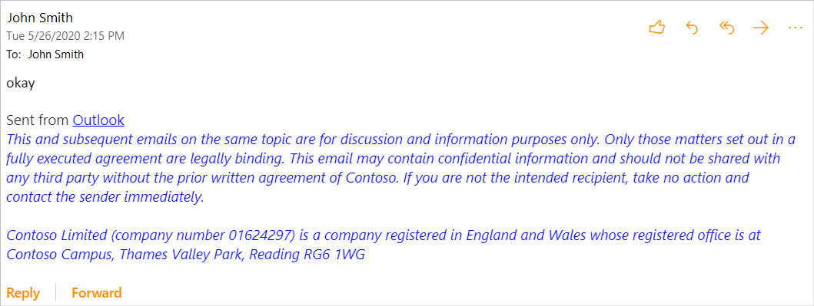

# <a name="implement-append-on-send-in-your-outlook-add-in-preview"></a>Outlook アドインでの追加-送信を実装する (プレビュー)

このチュートリアルを終了すると、メッセージが送信されたときに免責事項を挿入できる Outlook アドインが作成されます。

> [!IMPORTANT]
> この機能は、現在、web 上の Outlook および Microsoft 365 サブスクリプションを使用した Windows の [プレビュー](../reference/objectmodel/preview-requirement-set/outlook-requirement-set-preview.md) でサポートされています。 詳細については、この記事の「 [投稿の追加機能をプレビューする方法」を](#how-to-preview-the-append-on-send-feature) 参照してください。
>
> プレビュー機能は予告なしに変更される可能性があるため、運用アドインでは使用しないでください。

## <a name="how-to-preview-the-append-on-send-feature"></a>投稿の追加機能をプレビューする方法

投稿の追加機能をお試しください。 GitHub を通じてフィードバックを提供することによって、自分のシナリオと改善方法をお知らせください (このページの最後にある **フィードバック** セクションを参照してください)。

この機能をプレビューするには:

- CDN の **ベータ版** ライブラリを参照し https://appsforoffice.microsoft.com/lib/beta/hosted/office.js) ます (。 TypeScript のコンパイルおよび IntelliSense 用の [型定義ファイル](https://appsforoffice.microsoft.com/lib/beta/hosted/office.d.ts) は、CDN と、定義 [された](https://raw.githubusercontent.com/DefinitelyTyped/DefinitelyTyped/master/types/office-js-preview/index.d.ts)定義ファイルにあります。 これらの種類は、でインストールでき `npm install --save-dev @types/office-js-preview` ます。
- Windows の場合、より新しい Office ビルドにアクセスするには、 [Office Insider プログラム](https://insider.office.com) に参加する必要がある場合があります。
- Outlook on the web の場合は、 [Microsoft 365 テナントで対象となるリリースを構成](/microsoft-365/admin/manage/release-options-in-office-365?view=o365-worldwide#set-up-the-release-option-in-the-admin-center)します。

## <a name="set-up-your-environment"></a>環境を設定する

Outlook の [クイックスタート](../quickstarts/outlook-quickstart.md?tabs=yeomangenerator) に記入します。このアドインプロジェクトは、Office アドイン用の [アプリ] ジェネレーターを使用して作成されます。

## <a name="configure-the-manifest"></a>マニフェストを構成する

アドインでの追加/送信機能を有効にするには、 `AppendOnSend` [extendedpermissions](../reference/manifest/extendedpermissions.md)のコレクションにアクセス許可を含める必要があります。

このシナリオでは、[操作の `action` **実行** ] ボタンを選択するときに関数を実行する代わりに、関数を実行し `appendOnSend` ます。

1. コードエディターで、[クイックスタート] プロジェクトを開きます。

1. プロジェクトのルートにある **manifest.xml** ファイルを開きます。

1. `<VersionOverrides>`ノード全体 (open タグと close タグを含む) を選択し、次の XML に置き換えます。

    ```XML
    <VersionOverrides xmlns="http://schemas.microsoft.com/office/mailappversionoverrides" xsi:type="VersionOverridesV1_0">
      <VersionOverrides xmlns="http://schemas.microsoft.com/office/mailappversionoverrides/1.1" xsi:type="VersionOverridesV1_1">
        <Requirements>
          <bt:Sets DefaultMinVersion="1.3">
            <bt:Set Name="Mailbox" />
          </bt:Sets>
        </Requirements>
        <Hosts>
          <Host xsi:type="MailHost">
            <DesktopFormFactor>
              <FunctionFile resid="Commands.Url" />
              <ExtensionPoint xsi:type="MessageComposeCommandSurface">
                <OfficeTab id="TabDefault">
                  <Group id="msgComposeGroup">
                    <Label resid="GroupLabel" />
                    <Control xsi:type="Button" id="msgComposeOpenPaneButton">
                      <Label resid="TaskpaneButton.Label" />
                      <Supertip>
                        <Title resid="TaskpaneButton.Label" />
                        <Description resid="TaskpaneButton.Tooltip" />
                      </Supertip>
                      <Icon>
                        <bt:Image size="16" resid="Icon.16x16" />
                        <bt:Image size="32" resid="Icon.32x32" />
                        <bt:Image size="80" resid="Icon.80x80" />
                      </Icon>
                      <Action xsi:type="ShowTaskpane">
                        <SourceLocation resid="Taskpane.Url" />
                      </Action>
                    </Control>
                    <Control xsi:type="Button" id="ActionButton">
                      <Label resid="ActionButton.Label"/>
                      <Supertip>
                        <Title resid="ActionButton.Label"/>
                        <Description resid="ActionButton.Tooltip"/>
                      </Supertip>
                      <Icon>
                        <bt:Image size="16" resid="Icon.16x16"/>
                        <bt:Image size="32" resid="Icon.32x32"/>
                        <bt:Image size="80" resid="Icon.80x80"/>
                      </Icon>
                      <Action xsi:type="ExecuteFunction">
                        <FunctionName>appendDisclaimerOnSend</FunctionName>
                      </Action>
                    </Control>
                  </Group>
                </OfficeTab>
              </ExtensionPoint>

              <!-- Configure AppointmentOrganizerCommandSurface extension point to support
              append on sending a new appointment. -->

            </DesktopFormFactor>
          </Host>
        </Hosts>
        <Resources>
          <bt:Images>
            <bt:Image id="Icon.16x16" DefaultValue="https://localhost:3000/assets/icon-16.png"/>
            <bt:Image id="Icon.32x32" DefaultValue="https://localhost:3000/assets/icon-32.png"/>
            <bt:Image id="Icon.80x80" DefaultValue="https://localhost:3000/assets/icon-80.png"/>
          </bt:Images>
          <bt:Urls>
            <bt:Url id="Commands.Url" DefaultValue="https://localhost:3000/commands.html" />
            <bt:Url id="Taskpane.Url" DefaultValue="https://localhost:3000/taskpane.html" />
            <bt:Url id="WebViewRuntime.Url" DefaultValue="https://localhost:3000/commands.html" />
            <bt:Url id="JSRuntime.Url" DefaultValue="https://localhost:3000/runtime.js" />
          </bt:Urls>
          <bt:ShortStrings>
            <bt:String id="GroupLabel" DefaultValue="Contoso Add-in"/>
            <bt:String id="TaskpaneButton.Label" DefaultValue="Show Taskpane"/>
            <bt:String id="ActionButton.Label" DefaultValue="Perform an action"/>
          </bt:ShortStrings>
          <bt:LongStrings>
            <bt:String id="TaskpaneButton.Tooltip" DefaultValue="Opens a pane displaying all available properties."/>
            <bt:String id="ActionButton.Tooltip" DefaultValue="Perform an action when clicked."/>
          </bt:LongStrings>
        </Resources>
        <ExtendedPermissions>
          <ExtendedPermission>AppendOnSend</ExtendedPermission>
        </ExtendedPermissions>
      </VersionOverrides>
    </VersionOverrides>
    ```

> [!TIP]
> Outlook アドインのマニフェストの詳細については、「 [outlook アドインのマニフェスト](manifests.md)」を参照してください。

## <a name="implement-append-on-send-handling"></a>追加オン送信処理を実装する

次に、送信イベントに追加を実装します。

> [!IMPORTANT]
> アドインが[を使用し `ItemSend` て送信イベント処理](outlook-on-send-addins.md)を実装する場合、 `AppendOnSendAsync` オンプレ送信ハンドラーで呼び出しを行うと、このシナリオがサポートされていないため、エラーが返されます。

このシナリオでは、ユーザーが送信するときに、免責事項をアイテムに追加することを実装します。

1. 同じクイックスタートプロジェクトから、コードエディターで **/src/commands/commands.js** を開きます。

1. 関数の後 `action` に、次の JavaScript 関数を挿入します。

    ```js
    function appendDisclaimerOnSend(event) {
      var appendText =
        '<p style = "color:blue"> <i>This and subsequent emails on the same topic are for discussion and information purposes only. Only those matters set out in a fully executed agreement are legally binding. This email may contain confidential information and should not be shared with any third party without the prior written agreement of Contoso. If you are not the intended recipient, take no action and contact the sender immediately.<br><br>Contoso Limited (company number 01624297) is a company registered in England and Wales whose registered office is at Contoso Campus, Thames Valley Park, Reading RG6 1WG</i></p>';  
      /**
        *************************************************************
         Ideal Usage - Call the getBodyType API. Use the coercionType
         it returns as the parameter value below.
        *************************************************************
      */
      Office.context.mailbox.item.body.appendOnSendAsync(
        appendText,
        {
          coercionType: Office.CoercionType.Html
        },
        function(asyncResult) {
          console.log(asyncResult);
        }
      );

      event.completed();
    }
    ```

1. ファイルの末尾に、次のステートメントを追加します。

    ```js
    g.appendDisclaimerOnSend = appendDisclaimerOnSend;
    ```

## <a name="try-it-out"></a>試してみる

1. プロジェクトのルート ディレクトリから次のコマンドを実行します。 このコマンドを実行すると、ローカル web サーバーがまだ実行されていない場合は起動します。

    ```command&nbsp;line
    npm start
    ```

1. 「 [テスト用に Outlook アドインをサイドロード](sideload-outlook-add-ins-for-testing.md)する」の手順に従います。

1. 新しいメッセージを作成し、[ **宛先** ] 行に自分を追加します。

1. リボンまたはオーバーフローメニューから、[ **アクションを実行する**] を選択します。

1. メッセージを送信し、 **受信トレイ** または **送信済みアイテム** フォルダーから開いて、追加の免責事項を表示します。

    

## <a name="see-also"></a>関連項目

[Outlook アドインのマニフェスト](manifests.md)
