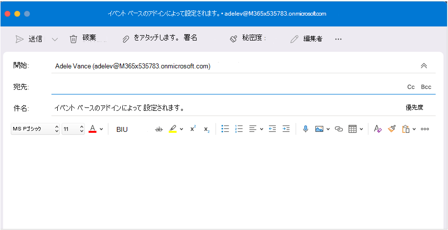

# <a name="configure-your-outlook-add-in-for-event-based-activation"></a>イベント ベースのアクティブ化のためにOutlook アドインを構成する

イベント ベースのアクティブ化機能がない場合、ユーザーはタスクを完了するためにアドインを明示的に起動する必要があります。 この機能を使用すると、アドインは特定のイベントに基づいてタスクを実行できます。特に、すべての項目に適用される操作に対して実行できます。 作業ウィンドウと UI レス機能と統合することもできます。

このチュートリアルの終わりまでに、新しい項目が作成され、件名が設定されるたびに実行されるアドインが作成されます。

> [!NOTE]
> この機能のサポートは [、要件セット 1.10](/javascript/api/requirement-sets/outlook/requirement-set-1.10/outlook-requirement-set-1.10) で導入されました。 この要件セットをサポートする [クライアントおよびプラットフォーム](/javascript/api/requirement-sets/outlook/outlook-api-requirement-sets#requirement-sets-supported-by-exchange-servers-and-outlook-clients) を参照してください。

## <a name="supported-events"></a>サポートされるイベント

次の表に、現在使用可能なイベントと、各イベントでサポートされているクライアントを示します。 イベントが発生すると、ハンドラーは、イベントの種類に固有の詳細を含む可能性があるオブジェクトを受け取ります `event` 。 **[説明]** 列には、該当する場合に関連するオブジェクトへのリンクが含まれます。

> [!IMPORTANT]
> プレビュー段階のイベントは、次の表に示すように、Microsoft 365 サブスクリプションとサポートされているクライアントの限定されたセットでのみ使用できます。 クライアント構成の詳細については、この記事で [プレビューする方法に関する記事を](#how-to-preview) 参照してください。 プレビュー イベントは、運用環境のアドインでは使用しないでください。

|イベント|説明|最小要件セットとサポートされているクライアント|
|---|---|---|
|`OnNewMessageCompose`|新しいメッセージを作成する場合 (返信、全員への返信、転送を含む)、編集時には行われません (下書きなど)。|[1.10](/javascript/api/requirement-sets/outlook/requirement-set-1.10/outlook-requirement-set-1.10)<br><br>- Windows <sup>1</sup><br>- Web ブラウザー<br>- 新しい Mac UI プレビュー|
|`OnNewAppointmentOrganizer`|新しい予定を作成するが、既存の予定を編集する場合は作成しません。|[1.10](/javascript/api/requirement-sets/outlook/requirement-set-1.10/outlook-requirement-set-1.10)<br><br>- Windows <sup>1</sup><br>- Web ブラウザー<br>- 新しい Mac UI プレビュー|
|`OnMessageAttachmentsChanged`|メッセージの作成中に添付ファイルを追加または削除する場合。<br><br>イベント固有のデータ オブジェクト: [AttachmentsChangedEventArgs](/javascript/api/outlook/office.attachmentschangedeventargs?view=outlook-js-1.11&preserve-view=true)|[1.11](/javascript/api/requirement-sets/outlook/requirement-set-1.11/outlook-requirement-set-1.11)<br><br>- Windows <sup>1</sup><br>- Web ブラウザー|
|`OnAppointmentAttachmentsChanged`|予定の作成中に添付ファイルを追加または削除する場合。<br><br>イベント固有のデータ オブジェクト: [AttachmentsChangedEventArgs](/javascript/api/outlook/office.attachmentschangedeventargs?view=outlook-js-1.11&preserve-view=true)|[1.11](/javascript/api/requirement-sets/outlook/requirement-set-1.11/outlook-requirement-set-1.11)<br><br>- Windows <sup>1</sup><br>- Web ブラウザー|
|`OnMessageRecipientsChanged`|メッセージの作成中に受信者を追加または削除する場合。<br><br>イベント固有のデータ オブジェクト: [RecipientsChangedEventArgs](/javascript/api/outlook/office.recipientschangedeventargs?view=outlook-js-1.11&preserve-view=true)|[1.11](/javascript/api/requirement-sets/outlook/requirement-set-1.11/outlook-requirement-set-1.11)<br><br>- Windows <sup>1</sup><br>- Web ブラウザー|
|`OnAppointmentAttendeesChanged`|予定の作成中に出席者を追加または削除する場合。<br><br>イベント固有のデータ オブジェクト: [RecipientsChangedEventArgs](/javascript/api/outlook/office.recipientschangedeventargs?view=outlook-js-1.11&preserve-view=true)|[1.11](/javascript/api/requirement-sets/outlook/requirement-set-1.11/outlook-requirement-set-1.11)<br><br>- Windows <sup>1</sup><br>- Web ブラウザー|
|`OnAppointmentTimeChanged`|予定の作成中に日付/時刻を変更する場合。<br><br>イベント固有のデータ オブジェクト: [AppointmentTimeChangedEventArgs](/javascript/api/outlook/office.appointmenttimechangedeventargs?view=outlook-js-1.11&preserve-view=true)|[1.11](/javascript/api/requirement-sets/outlook/requirement-set-1.11/outlook-requirement-set-1.11)<br><br>- Windows <sup>1</sup><br>- Web ブラウザー|
|`OnAppointmentRecurrenceChanged`|予定の作成中に繰り返しの詳細を追加、変更、または削除する場合。 日付/時刻が変更されると、 `OnAppointmentTimeChanged` イベントも発生します。<br><br>イベント固有のデータ オブジェクト: [RecurrenceChangedEventArgs](/javascript/api/outlook/office.recurrencechangedeventargs?view=outlook-js-1.11&preserve-view=true)|[1.11](/javascript/api/requirement-sets/outlook/requirement-set-1.11/outlook-requirement-set-1.11)<br><br>- Windows <sup>1</sup><br>- Web ブラウザー|
|`OnInfoBarDismissClicked`|メッセージまたは予定アイテムの作成中に通知を閉じる場合。 通知を追加したアドインのみが通知されます。<br><br>イベント固有のデータ オブジェクト: [InfobarClickedEventArgs](/javascript/api/outlook/office.infobarclickedeventargs?view=outlook-js-1.11&preserve-view=true)|[1.11](/javascript/api/requirement-sets/outlook/requirement-set-1.11/outlook-requirement-set-1.11)<br><br>- Windows <sup>1</sup><br>- Web ブラウザー|
|`OnMessageSend`|メッセージ アイテムを送信する場合。 詳細については、 [スマート アラートのチュートリアル](smart-alerts-onmessagesend-walkthrough.md)を参照してください。|[プレビュー](/javascript/api/requirement-sets/outlook/preview-requirement-set/outlook-requirement-set-preview)<br><br>- Windows <sup>1</sup>|
|`OnAppointmentSend`|予定アイテムを送信する場合。 詳細については、 [スマート アラートのチュートリアル](smart-alerts-onmessagesend-walkthrough.md)を参照してください。|[プレビュー](/javascript/api/requirement-sets/outlook/preview-requirement-set/outlook-requirement-set-preview)<br><br>- Windows <sup>1</sup>|

> [!NOTE]
> Windows上のOutlookの <sup>1</sup> つのイベント ベースのアドインでは、Windows 10 バージョン 1809 (ビルド 17763.2989) 以降を実行する必要があります。

### <a name="how-to-preview"></a>プレビューする方法

プレビュー段階のイベントを試してみることをお勧めします。 GitHubを通じてフィードバックを提供することで、お客様のシナリオと改善方法をお知らせください (このページの最後の **「フィードバック」** セクションを参照)。

利用可能な場合は、次のイベントをプレビューします。

- Outlook on the webの場合:
  - [Microsoft 365 テナントでターゲット リリースを構成します。](/microsoft-365/admin/manage/release-options-in-office-365?view=o365-worldwide&preserve-view=true#set-up-the-release-option-in-the-admin-center)
  - CDNの **ベータ** ライブラリ (https://appsforoffice.microsoft.com/lib/beta/hosted/office.js). TypeScript コンパイルおよび IntelliSense の [型定義ファイル](https://appsforoffice.microsoft.com/lib/beta/hosted/office.d.ts)は CDN で見つかり、[DefinitelyTyped](https://raw.githubusercontent.com/DefinitelyTyped/DefinitelyTyped/master/types/office-js-preview/index.d.ts) にあります。 これらの型は、`npm install --save-dev @types/office-js-preview` を使用してインストールできます。
- 新しい Mac UI プレビューのOutlookの場合:
  - 最小必要なビルドは 16.54 (21101001) です。 [Office Insider プログラム](https://insider.office.com/join/Mac)に参加し、ベータ 版ビルドにアクセスするための **ベータ チャネル** Office選択します。
- WindowsのOutlookの場合:
  - 必要な最小ビルドは 16.0.14511.10000 です。 [Office Insider プログラム](https://insider.office.com/join/windows)に参加し、ベータ 版ビルドにアクセスするための **ベータ チャネル** Office選択します。

## <a name="set-up-your-environment"></a>環境を設定する

Office アドイン用の Yeoman ジェネレーターを使用してアドイン プロジェクトを作成するOutlook[クイック スタート](../quickstarts/outlook-quickstart.md?tabs=yeomangenerator)を完了します。

## <a name="configure-the-manifest"></a>マニフェストを構成する

アドインのイベント ベースのアクティブ化を有効にするには、マニフェストのノードで [Runtimes](/javascript/api/manifest/runtimes) 要素と [LaunchEvent](/javascript/api/manifest/extensionpoint#launchevent) 拡張ポイントを構成する `VersionOverridesV1_1` 必要があります。 現時点では、 `DesktopFormFactor` サポートされているフォーム ファクターは唯一です。

1. コード エディターで、クイック スタート プロジェクトを開きます。

1. プロジェクトのルートにある **manifest.xml** ファイルを開きます。

1. ノード全体 `<VersionOverrides>` (開いているタグと閉じるタグを含む) を選択し、次の XML に置き換えてから、変更を保存します。

```XML
<VersionOverrides xmlns="http://schemas.microsoft.com/office/mailappversionoverrides" xsi:type="VersionOverridesV1_0">
  <VersionOverrides xmlns="http://schemas.microsoft.com/office/mailappversionoverrides/1.1" xsi:type="VersionOverridesV1_1">
    <Requirements>
      <bt:Sets DefaultMinVersion="1.3">
        <bt:Set Name="Mailbox" />
      </bt:Sets>
    </Requirements>
    <Hosts>
      <Host xsi:type="MailHost">
        <!-- Event-based activation happens in a lightweight runtime.-->
        <Runtimes>
          <!-- HTML file including reference to or inline JavaScript event handlers.
               This is used by Outlook on the web and Outlook on the new Mac UI preview. -->
          <Runtime resid="WebViewRuntime.Url">
            <!-- JavaScript file containing event handlers. This is used by Outlook Desktop. -->
            <Override type="javascript" resid="JSRuntime.Url"/>
          </Runtime>
        </Runtimes>
        <DesktopFormFactor>
          <FunctionFile resid="Commands.Url" />
          <ExtensionPoint xsi:type="MessageReadCommandSurface">
            <OfficeTab id="TabDefault">
              <Group id="msgReadGroup">
                <Label resid="GroupLabel" />
                <Control xsi:type="Button" id="msgReadOpenPaneButton">
                  <Label resid="TaskpaneButton.Label" />
                  <Supertip>
                    <Title resid="TaskpaneButton.Label" />
                    <Description resid="TaskpaneButton.Tooltip" />
                  </Supertip>
                  <Icon>
                    <bt:Image size="16" resid="Icon.16x16" />
                    <bt:Image size="32" resid="Icon.32x32" />
                    <bt:Image size="80" resid="Icon.80x80" />
                  </Icon>
                  <Action xsi:type="ShowTaskpane">
                    <SourceLocation resid="Taskpane.Url" />
                  </Action>
                </Control>
                <Control xsi:type="Button" id="ActionButton">
                  <Label resid="ActionButton.Label"/>
                  <Supertip>
                    <Title resid="ActionButton.Label"/>
                    <Description resid="ActionButton.Tooltip"/>
                  </Supertip>
                  <Icon>
                    <bt:Image size="16" resid="Icon.16x16"/>
                    <bt:Image size="32" resid="Icon.32x32"/>
                    <bt:Image size="80" resid="Icon.80x80"/>
                  </Icon>
                  <Action xsi:type="ExecuteFunction">
                    <FunctionName>action</FunctionName>
                  </Action>
                </Control>
              </Group>
            </OfficeTab>
          </ExtensionPoint>

          <!-- Can configure other command surface extension points for add-in command support. -->

          <!-- Enable launching the add-in on the included events. -->
          <ExtensionPoint xsi:type="LaunchEvent">
            <LaunchEvents>
              <LaunchEvent Type="OnNewMessageCompose" FunctionName="onMessageComposeHandler"/>
              <LaunchEvent Type="OnNewAppointmentOrganizer" FunctionName="onAppointmentComposeHandler"/>
              
              <!-- Other available events (currently released) -->
              <!--
              <LaunchEvent Type="OnMessageAttachmentsChanged" FunctionName="onMessageAttachmentsChangedHandler" />
              <LaunchEvent Type="OnAppointmentAttachmentsChanged" FunctionName="onAppointmentAttachmentsChangedHandler" />
              <LaunchEvent Type="OnMessageRecipientsChanged" FunctionName="onMessageRecipientsChangedHandler" />
              <LaunchEvent Type="OnAppointmentAttendeesChanged" FunctionName="onAppointmentAttendeesChangedHandler" />
              <LaunchEvent Type="OnAppointmentTimeChanged" FunctionName="onAppointmentTimeChangedHandler" />
              <LaunchEvent Type="OnAppointmentRecurrenceChanged" FunctionName="onAppointmentRecurrenceChangedHandler" />
              <LaunchEvent Type="OnInfoBarDismissClicked" FunctionName="onInfobarDismissClickedHandler" />
              -->

              <!-- Other available events (currently in preview) -->
              <!--
              <LaunchEvent Type="OnMessageSend" FunctionName="onMessageSendHandler" SendMode="PromptUser" />
              <LaunchEvent Type="OnAppointmentSend" FunctionName="onAppointmentSendHandler" SendMode="PromptUser" />
              -->
            </LaunchEvents>
            <!-- Identifies the runtime to be used (also referenced by the Runtime element). -->
            <SourceLocation resid="WebViewRuntime.Url"/>
          </ExtensionPoint>
        </DesktopFormFactor>
      </Host>
    </Hosts>
    <Resources>
      <bt:Images>
        <bt:Image id="Icon.16x16" DefaultValue="https://localhost:3000/assets/icon-16.png"/>
        <bt:Image id="Icon.32x32" DefaultValue="https://localhost:3000/assets/icon-32.png"/>
        <bt:Image id="Icon.80x80" DefaultValue="https://localhost:3000/assets/icon-80.png"/>
      </bt:Images>
      <bt:Urls>
        <bt:Url id="Commands.Url" DefaultValue="https://localhost:3000/commands.html" />
        <bt:Url id="Taskpane.Url" DefaultValue="https://localhost:3000/taskpane.html" />
        <bt:Url id="WebViewRuntime.Url" DefaultValue="https://localhost:3000/commands.html" />
        <!-- Entry needed for Outlook Desktop. -->
        <bt:Url id="JSRuntime.Url" DefaultValue="https://localhost:3000/launchevent.js" />
      </bt:Urls>
      <bt:ShortStrings>
        <bt:String id="GroupLabel" DefaultValue="Contoso Add-in"/>
        <bt:String id="TaskpaneButton.Label" DefaultValue="Show Taskpane"/>
        <bt:String id="ActionButton.Label" DefaultValue="Perform an action"/>
      </bt:ShortStrings>
      <bt:LongStrings>
        <bt:String id="TaskpaneButton.Tooltip" DefaultValue="Opens a pane displaying all available properties."/>
        <bt:String id="ActionButton.Tooltip" DefaultValue="Perform an action when clicked."/>
      </bt:LongStrings>
    </Resources>
  </VersionOverrides>
</VersionOverrides>
```

WindowsのOutlookは JavaScript ファイルを使用しますが、Outlook on the webおよび新しい Mac UI プレビューでは、同じ JavaScript ファイルを参照できる HTML ファイルが使用されます。 Outlook プラットフォームは最終的に、Outlook クライアントに基づいて HTML または JavaScript を使用するかどうかを決定するため、マニフェストのノードで`Resources`これらの両方のファイルへの参照を指定する必要があります。 そのため、イベント処理を構成するには、要素内の HTML の場所を `Runtime` 指定し、その `Override` 子要素で HTML によってインライン化または参照される JavaScript ファイルの場所を指定します。

> [!TIP]
> Outlook アドインのマニフェストの詳細については、[アドイン マニフェストのOutlook](manifests.md)を参照してください。

## <a name="implement-event-handling"></a>イベント処理を実装する

選択したイベントの処理を実装する必要があります。

このシナリオでは、新しい項目を作成するための処理を追加します。

1. 同じクイック スタート プロジェクトから、**./src** ディレクトリの下に **launchevent** という名前の新しいフォルダーを作成します。

1. **./src/launchevent** フォルダーに、launchevent.jsという名前の新しいファイル **を** 作成します。

1. コード エディターで **./src/launchevent/launchevent.js** ファイルを開き、次の JavaScript コードを追加します。

    ```js
    /*
    * Copyright (c) Microsoft Corporation. All rights reserved. Licensed under the MIT license.
    * See LICENSE in the project root for license information.
    */

    function onMessageComposeHandler(event) {
      setSubject(event);
    }
    function onAppointmentComposeHandler(event) {
      setSubject(event);
    }
    function setSubject(event) {
      Office.context.mailbox.item.subject.setAsync(
        "Set by an event-based add-in!",
        {
          "asyncContext": event
        },
        function (asyncResult) {
          // Handle success or error.
          if (asyncResult.status !== Office.AsyncResultStatus.Succeeded) {
            console.error("Failed to set subject: " + JSON.stringify(asyncResult.error));
          }

          // Call event.completed() after all work is done.
          asyncResult.asyncContext.completed();
        });
    }

    // 1st parameter: FunctionName of LaunchEvent in the manifest; 2nd parameter: Its implementation in this .js file.
    Office.actions.associate("onMessageComposeHandler", onMessageComposeHandler);
    Office.actions.associate("onAppointmentComposeHandler", onAppointmentComposeHandler);
    ```

1. 変更内容を保存します。

> [!IMPORTANT]
> Windows: 現時点では、イベント ベースのアクティブ化の処理を実装する JavaScript ファイルではインポートはサポートされていません。

## <a name="update-the-commands-html-file"></a>コマンド HTML ファイルを更新する

1. **./src/commands** フォルダーで、**commands.html** を開きます。

1. 終了 **ヘッド** タグ (`<\head>`) の直前に、イベント処理 JavaScript コードを含めるスクリプト エントリを追加します。

    ```html
    <script type="text/javascript" src="../launchevent/launchevent.js"></script>
    ```

1. 変更内容を保存します。

## <a name="update-webpack-config-settings"></a>Webpackの機能設定を更新する

1. プロジェクトのルート ディレクトリにある **webpack.config.js** ファイルを開き、次の手順を実行します。

1. オブジェクト内の `plugins` 配列を `config` 見つけて、配列の先頭にこの新しいオブジェクトを追加します。

    ```js
    new CopyWebpackPlugin({
      patterns: [
        {
          from: "./src/launchevent/launchevent.js",
          to: "launchevent.js",
        },
      ],
    }),
    ```

1. 変更内容を保存します。

## <a name="try-it-out"></a>試してみる

1. プロジェクトのルート ディレクトリで次のコマンドを実行します。 実行 `npm start`すると、ローカル Web サーバーが起動し (まだ実行されていない場合)、アドインはサイドロードされます。

    ```command&nbsp;line
    npm run build
    ```
    ```command&nbsp;line
    npm start
    ```

    > [!NOTE]
    > アドインが自動的にサイドロードされなかった場合は、[テスト用の Sideload Outlook アドインの](../outlook/sideload-outlook-add-ins-for-testing.md#sideload-manually)手順に従ってアドインを手動でサイドロードOutlookします。

1. Outlook on the web で新しいメッセージを作成します。

    

1. 新しい Mac UI プレビューのOutlookで、新しいメッセージを作成します。

    

1. WindowsのOutlookで、新しいメッセージを作成します。

    

## <a name="debug"></a>デバッグ

アドインで起動イベント処理を変更するときは、次の点に注意する必要があります。

- マニフェストを更新した場合は、 [アドインを削除](sideload-outlook-add-ins-for-testing.md#remove-a-sideloaded-add-in)してから、もう一度サイドロードします。 WindowsでOutlookを使用している場合は、閉じてから再度開きます。
- マニフェスト以外のファイルに変更を加えた場合は、WindowsでOutlookを閉じてもう一度開くか、Outlook on the web実行されているブラウザー タブを更新します。

独自の機能を実装するときに、コードのデバッグが必要になる場合があります。 イベント ベースのアドイン のアクティブ化をデバッグする方法のガイダンスについては、「[イベント ベースのOutlook アドインをデバッグ](debug-autolaunch.md)する」を参照してください。

この機能のランタイム ログは、Windowsでも使用できます。 詳細については、「 [ランタイム ログを使用してアドインをデバッグ](../testing/runtime-logging.md#runtime-logging-on-windows)する」を参照してください。

[!INCLUDE [Loopback exemption note](../includes/outlook-loopback-exemption.md)]

## <a name="deploy-to-users"></a>ユーザーにデプロイする

Microsoft 365 管理センターを介してマニフェストをアップロードすることで、イベント ベースのアドインをデプロイできます。 管理ポータルで、ナビゲーション ウィンドウの **[設定**] セクションを展開し、[**統合アプリ**] を選択します。 **[統合アプリ**] ページで、**アップロードカスタム アプリ アクションを** 選択します。

![アップロードのカスタム アプリ アクションを含む、Microsoft 365 管理センターの [統合アプリ] ページのスクリーンショット。](../images/outlook-deploy-event-based-add-ins.png)

AppSource とアプリ内Office Microsoft Store: イベント ベースのアドインをデプロイしたり、既存のアドインを更新してイベント ベースのアクティブ化機能を含めたりする機能は、近日中に利用できる必要があります。

> [!IMPORTANT]
> イベント ベースのアドインは、管理者が管理するデプロイのみに制限されます。 現時点では、ユーザーは AppSource またはアプリ内Office Microsoft Storeからイベント ベースのアドインを取得できません。 詳細については、[イベント ベースのOutlook アドインの AppSource リスト オプション](autolaunch-store-options.md)を参照してください。

## <a name="event-based-activation-behavior-and-limitations"></a>イベント ベースのアクティブ化の動作と制限事項

アドインの起動イベント ハンドラーは、実行時間が短く、軽量であり、可能な限り非インバシブであることが予想されます。 アクティブ化後、アドインは約 300 秒以内にタイムアウトし、イベント ベースのアドインの実行に許容される最大時間です。アドインで起動イベントの処理が完了したことを知らせるには、メソッドを呼び出 `event.completed` すハンドラーを関連付けておく必要があります。 (ステートメントの後に `event.completed` 含まれるコードは、実行が保証されないことに注意してください)。アドインが処理するイベントがトリガーされるたびに、アドインが再アクティブ化され、関連付けられているイベント ハンドラーが実行され、タイムアウト ウィンドウがリセットされます。 アドインはタイムアウト後に終了するか、ユーザーが作成ウィンドウを閉じたり、アイテムを送信したりします。

ユーザーが同じイベントにサブスクライブした複数のアドインを持っている場合、Outlook プラットフォームは特定の順序でアドインを起動します。 現在、アクティブに実行できるイベント ベースのアドインは 5 つだけです。

ユーザーは、アドインの実行を開始した現在のメール アイテムの切り替えや移動を行うことができます。 起動されたアドインは、バックグラウンドで操作を完了します。

インポートは、Windows クライアントでイベント ベースのアクティブ化の処理を実装する JavaScript ファイルではサポートされていません。

UI を変更または変更する一部のOffice.js API は、イベント ベースのアドインでは許可されません。ブロックされた API を次に示します。

- 下 :`Office.context.auth`
  - `getAccessToken`
  - `getAccessTokenAsync`
    > [!NOTE]
    > `OfficeRuntime.auth` はサポートされています。 詳細については、「[イベント ベースのアクティブ化を使用するOutlook アドインでシングル サインオン (SSO) を有効にする](use-sso-in-event-based-activation.md)」を参照してください。
- 下 :`Office.context.mailbox`
  - `displayAppointmentForm`
  - `displayMessageForm`
  - `displayNewAppointmentForm`
  - `displayNewMessageForm`
- 下 :`Office.context.mailbox.item`
  - `close`
- 下 :`Office.context.ui`
  - `displayDialogAsync`
  - `messageParent`

### <a name="requesting-external-data"></a>外部データの要求

外部データを要求するには、 [Fetch](https://developer.mozilla.org/docs/Web/API/Fetch_API) などの API を使用するか、サーバーとの対話に HTTP 要求を発行する標準 Web API [である XmlHttpRequest (XHR)](https://developer.mozilla.org/docs/Web/API/XMLHttpRequest) を使用します。

XmlHttpRequests を作成するときは、 [同じ配信元ポリシー](https://developer.mozilla.org/docs/Web/Security/Same-origin_policy) と単純な [CORS](https://www.w3.org/TR/cors/) が必要な場合は、追加のセキュリティ対策を使用する必要があることに注意してください。

単純な CORS 実装では Cookie を使用できず、単純なメソッド (GET、HEAD、POST) のみをサポートします。 単純な CORS はフィールド名`Accept`、 `Accept-Language`、`Content-Language`の簡単なヘッダーを受け入れます。 コンテンツ タイプ`application/x-www-form-urlencoded`が `Content-Type` 、`text/plain`、または `multipart/form-data`.

完全な CORS サポートは近日公開予定です。

## <a name="see-also"></a>関連項目

- [Outlook アドインのマニフェスト](manifests.md)
- [イベント ベースのアドインをデバッグする方法](debug-autolaunch.md)
- [イベント ベースのOutlook アドインの AppSource 一覧表示オプション](autolaunch-store-options.md)
- [スマート アラートと OnMessageSend のチュートリアル](smart-alerts-onmessagesend-walkthrough.md)
- アドインのコード サンプルをOfficeします。
  - [Outlookイベント ベースのアクティブ化を使用して添付ファイルを暗号化し、会議出席依頼の出席者を処理し、予定の日付/時刻の変更に対応する](https://github.com/OfficeDev/Office-Add-in-samples/tree/main/Samples/outlook-encrypt-attachments)
  - [Outlook イベントベースのアクティブ化を使用して署名を設定する](https://github.com/OfficeDev/Office-Add-in-samples/tree/main/Samples/outlook-set-signature)
  - [Outlook イベントベースのアクティブ化を使用して、外部受信者をタグ付けする](https://github.com/OfficeDev/Office-Add-in-samples/tree/main/Samples/outlook-tag-external)
  - [スマート アラートOutlook使用する](https://github.com/OfficeDev/Office-Add-in-samples/tree/main/Samples/outlook-check-item-categories)
