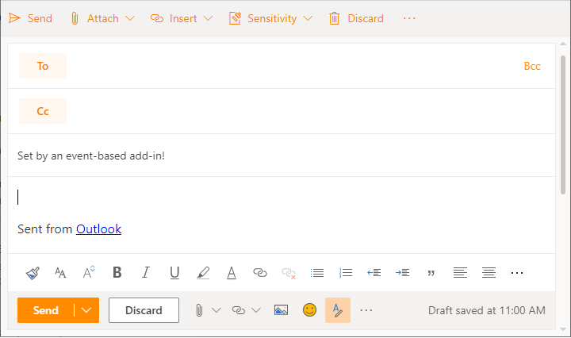
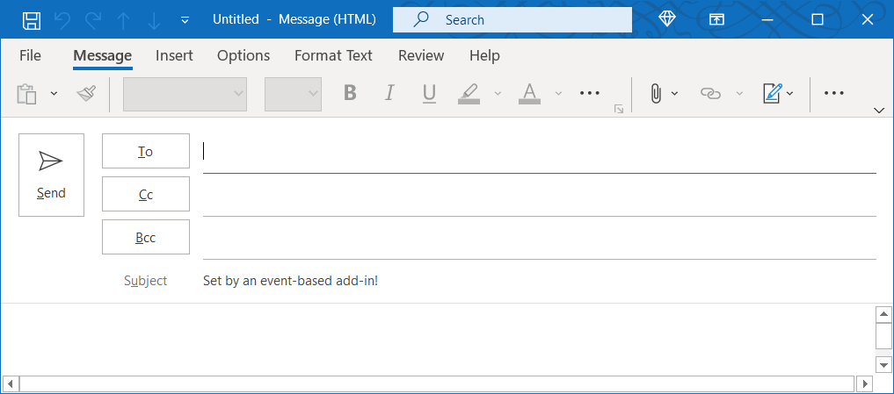

# <a name="configure-your-outlook-add-in-for-event-based-activation"></a>イベント ベースのOutlook用にアドインを構成する

イベント ベースのアクティブ化機能がない場合、ユーザーはタスクを完了するためにアドインを明示的に起動する必要があります。 この機能を使用すると、特定のイベントに基づいて、特にすべてのアイテムに適用される操作に基づいてタスクを実行できます。 作業ウィンドウや UI レス機能と統合することもできます。

このチュートリアルの最後には、新しいアイテムが作成され、件名が設定されるたびに実行されるアドインがあります。

> [!NOTE]
> この機能のサポートは、要件セット [1.10 で導入されました](../reference/objectmodel/requirement-set-1.10/outlook-requirement-set-1.10.md)。 この要件セットをサポートする [クライアントおよびプラットフォーム](../reference/requirement-sets/outlook-api-requirement-sets.md#requirement-sets-supported-by-exchange-servers-and-outlook-clients) を参照してください。

## <a name="supported-events"></a>サポートされるイベント

現時点では、次のイベントは Web および web サイトWindows。 また、イベントが発生すると、ハンドラーはイベントの種類に固有の詳細を含む可能性のある `event` オブジェクトを受け取ります。 次の表で、[ **イベント固有の JSON] 列** には、該当する関連オブジェクトへのリンクが含まれています。

> [!IMPORTANT]
> プレビュー中のイベントは、Microsoft 365のサブスクリプションとOutlook on the webでのみWindows。 詳細については、「この記事 [でプレビューする方法」](#how-to-preview) を参照してください。 プレビュー イベントは、実稼働アドインでは使用できません。

|イベント|説明|イベント固有の JSON|最小要件セット|
|---|---|---|---|
|`OnNewMessageCompose`|新しいメッセージを作成する場合 (返信、すべて返信、転送を含む) が、下書きなど編集時には作成されません。|該当なし|[1.10](../reference/objectmodel/requirement-set-1.10/outlook-requirement-set-1.10.md)|
|`OnNewAppointmentOrganizer`|既存の予定の編集ではなく、新しい予定を作成する場合。|該当なし|[1.10](../reference/objectmodel/requirement-set-1.10/outlook-requirement-set-1.10.md)|
|`OnMessageAttachmentsChanged`|メッセージの作成中に添付ファイルを追加または削除する場合。|[AttachmentsChangedEventArgs](/javascript/api/outlook/office.attachmentschangedeventargs?view=outlook-js-preview&preserve-view=true)|[プレビュー](../reference/objectmodel/preview-requirement-set/outlook-requirement-set-preview.md)|
|`OnAppointmentAttachmentsChanged`|予定の作成中に添付ファイルを追加または削除する場合。|[AttachmentsChangedEventArgs](/javascript/api/outlook/office.attachmentschangedeventargs?view=outlook-js-preview&preserve-view=true)|[プレビュー](../reference/objectmodel/preview-requirement-set/outlook-requirement-set-preview.md)|
|`OnMessageRecipientsChanged`|メッセージの作成中に受信者を追加または削除する場合。|[RecipientsChangedEventArgs](/javascript/api/outlook/office.recipientschangedeventargs?view=outlook-js-preview&preserve-view=true)|[プレビュー](../reference/objectmodel/preview-requirement-set/outlook-requirement-set-preview.md)|
|`OnAppointmentAttendeesChanged`|予定の作成中に出席者を追加または削除する場合。|[RecipientsChangedEventArgs](/javascript/api/outlook/office.recipientschangedeventargs?view=outlook-js-preview&preserve-view=true)|[プレビュー](../reference/objectmodel/preview-requirement-set/outlook-requirement-set-preview.md)|
|`OnAppointmentTimeChanged`|予定の作成中に日付/時刻を変更する場合。|[AppointmentTimeChangedEventArgs](/javascript/api/outlook/office.appointmenttimechangedeventargs?view=outlook-js-preview&preserve-view=true)|[プレビュー](../reference/objectmodel/preview-requirement-set/outlook-requirement-set-preview.md)|
|`OnAppointmentRecurrenceChanged`|予定の作成中に定期的な詳細を追加、変更、または削除する場合。 日付/時刻が変更された場合、 `OnAppointmentTimeChanged` イベントも発生します。|[RecurrenceChangedEventArgs](/javascript/api/outlook/office.recurrencechangedeventargs?view=outlook-js-preview&preserve-view=true)|[プレビュー](../reference/objectmodel/preview-requirement-set/outlook-requirement-set-preview.md)|
|`OnInfoBarDismissClicked`|メッセージまたは予定アイテムの作成中に通知を却下する場合。 通知を追加したアドインだけが通知されます。|[InfobarClickedEventArgs](/javascript/api/outlook/office.infobarclickedeventargs?view=outlook-js-preview&preserve-view=true)|[プレビュー](../reference/objectmodel/preview-requirement-set/outlook-requirement-set-preview.md)|

### <a name="how-to-preview"></a>プレビューする方法

プレビューで今すぐイベントを試してみてください。 このページの最後にある「フィードバック」セクションをGitHubフィードバックを提供することで、お客様のシナリオと改善方法をお知らせします。

これらのイベントをプレビューするには、次の手順を実行します。

- 次のOutlook on the web。
  - [ターゲット リリースをテナントにMicrosoft 365します](/microsoft-365/admin/manage/release-options-in-office-365?view=o365-worldwide&preserve-view=true#set-up-the-release-option-in-the-admin-center)。
  - ()**の** ベータ ライブラリを参照 https://appsforoffice.microsoft.com/lib/beta/hosted/office.js) CDN。 TypeScript[のコンパイル](https://appsforoffice.microsoft.com/lib/beta/hosted/office.d.ts)と定義の種類定義ファイルは、IntelliSenseと[DefinitelyTyped](https://raw.githubusercontent.com/DefinitelyTyped/DefinitelyTyped/master/types/office-js-preview/index.d.ts)にあるCDNです。 これらの種類は、 を使用してインストールできます `npm install --save-dev @types/office-js-preview` 。
- [OutlookのWindows:
  - 必要な最小ビルドは 16.0.14026.20000 です。 ベータ版[ビルドOfficeアクセスするには、Insider](https://insider.office.com)プログラムOffice参加します。
  - レジストリを構成します。 Outlookから読み込む代わりに、製品版とベータ版Office.jsのローカル コピーが含CDN。 既定では、API のローカル実稼働コピーが参照されます。 JavaScript API のローカル ベータ コピーに切り替Outlook、このレジストリ エントリを追加する必要があります。それ以外の場合は、ベータ版 API が見つからない場合があります。
    1. レジストリ キーを作成します `HKEY_CURRENT_USER\SOFTWARE\Microsoft\Office\16.0\Outlook\Options\WebExt\Developer` 。
    1. という名前のエントリを `EnableBetaAPIsInJavaScript` 追加し、値をに設定します `1` 。 レジストリは次の図のようになります。

        

## <a name="set-up-your-environment"></a>環境を設定する

クイック スタート[Outlook](../quickstarts/outlook-quickstart.md?tabs=yeomangenerator)完了し、Yeoman ジェネレーターを使用してアドイン プロジェクトを作成し、Office作成します。

## <a name="configure-the-manifest"></a>マニフェストを構成する

アドインのイベント ベースのアクティブ化を有効にするには、マニフェストのノードで [Runtimes](../reference/manifest/runtimes.md) 要素と [LaunchEvent](../reference/manifest/extensionpoint.md#launchevent) 拡張ポイント `VersionOverridesV1_1` を構成する必要があります。 今のところ、 `DesktopFormFactor` サポートされている唯一のフォーム ファクターです。

1. コード エディターで、クイック スタート プロジェクトを開きます。

1. プロジェクトの **manifest.xml** にあるファイルを開きます。

1. ノード全体 (開くタグと閉じるタグを含む) を選択し、次の XML に置き換え `<VersionOverrides>` 、変更を保存します。

```XML
<VersionOverrides xmlns="http://schemas.microsoft.com/office/mailappversionoverrides" xsi:type="VersionOverridesV1_0">
  <VersionOverrides xmlns="http://schemas.microsoft.com/office/mailappversionoverrides/1.1" xsi:type="VersionOverridesV1_1">
    <Requirements>
      <bt:Sets DefaultMinVersion="1.3">
        <bt:Set Name="Mailbox" />
      </bt:Sets>
    </Requirements>
    <Hosts>
      <Host xsi:type="MailHost">
        <!-- Event-based activation happens in a lightweight runtime.-->
        <Runtimes>
          <!-- HTML file including reference to or inline JavaScript event handlers.
               This is used by Outlook on the web. -->
          <Runtime resid="WebViewRuntime.Url">
            <!-- JavaScript file containing event handlers. This is used by Outlook Desktop. -->
            <Override type="javascript" resid="JSRuntime.Url"/>
          </Runtime>
        </Runtimes>
        <DesktopFormFactor>
          <FunctionFile resid="Commands.Url" />
          <ExtensionPoint xsi:type="MessageReadCommandSurface">
            <OfficeTab id="TabDefault">
              <Group id="msgReadGroup">
                <Label resid="GroupLabel" />
                <Control xsi:type="Button" id="msgReadOpenPaneButton">
                  <Label resid="TaskpaneButton.Label" />
                  <Supertip>
                    <Title resid="TaskpaneButton.Label" />
                    <Description resid="TaskpaneButton.Tooltip" />
                  </Supertip>
                  <Icon>
                    <bt:Image size="16" resid="Icon.16x16" />
                    <bt:Image size="32" resid="Icon.32x32" />
                    <bt:Image size="80" resid="Icon.80x80" />
                  </Icon>
                  <Action xsi:type="ShowTaskpane">
                    <SourceLocation resid="Taskpane.Url" />
                  </Action>
                </Control>
                <Control xsi:type="Button" id="ActionButton">
                  <Label resid="ActionButton.Label"/>
                  <Supertip>
                    <Title resid="ActionButton.Label"/>
                    <Description resid="ActionButton.Tooltip"/>
                  </Supertip>
                  <Icon>
                    <bt:Image size="16" resid="Icon.16x16"/>
                    <bt:Image size="32" resid="Icon.32x32"/>
                    <bt:Image size="80" resid="Icon.80x80"/>
                  </Icon>
                  <Action xsi:type="ExecuteFunction">
                    <FunctionName>action</FunctionName>
                  </Action>
                </Control>
              </Group>
            </OfficeTab>
          </ExtensionPoint>

          <!-- Can configure other command surface extension points for add-in command support. -->

          <!-- Enable launching the add-in on the included events. -->
          <ExtensionPoint xsi:type="LaunchEvent">
            <LaunchEvents>
              <LaunchEvent Type="OnNewMessageCompose" FunctionName="onMessageComposeHandler"/>
              <LaunchEvent Type="OnNewAppointmentOrganizer" FunctionName="onAppointmentComposeHandler"/>
              <LaunchEvent Type="OnMessageAttachmentsChanged" FunctionName="onMessageAttachmentsChangedHandler" />
              <LaunchEvent Type="OnAppointmentAttachmentsChanged" FunctionName="onAppointmentAttachmentsChangedHandler" />
              <LaunchEvent Type="OnMessageRecipientsChanged" FunctionName="onMessageRecipientsChangedHandler" />
              <LaunchEvent Type="OnAppointmentAttendeesChanged" FunctionName="onAppointmentAttendeesChangedHandler" />
              <LaunchEvent Type="OnAppointmentTimeChanged" FunctionName="onAppointmentTimeChangedHandler" />
              <LaunchEvent Type="OnAppointmentRecurrenceChanged" FunctionName="onAppointmentRecurrenceChangedHandler" />
              <LaunchEvent Type="OnInfoBarDismissClicked" FunctionName="onInfobarDismissClickedHandler" />
            </LaunchEvents>
            <!-- Identifies the runtime to be used (also referenced by the Runtime element). -->
            <SourceLocation resid="WebViewRuntime.Url"/>
          </ExtensionPoint>
        </DesktopFormFactor>
      </Host>
    </Hosts>
    <Resources>
      <bt:Images>
        <bt:Image id="Icon.16x16" DefaultValue="https://localhost:3000/assets/icon-16.png"/>
        <bt:Image id="Icon.32x32" DefaultValue="https://localhost:3000/assets/icon-32.png"/>
        <bt:Image id="Icon.80x80" DefaultValue="https://localhost:3000/assets/icon-80.png"/>
      </bt:Images>
      <bt:Urls>
        <bt:Url id="Commands.Url" DefaultValue="https://localhost:3000/commands.html" />
        <bt:Url id="Taskpane.Url" DefaultValue="https://localhost:3000/taskpane.html" />
        <bt:Url id="WebViewRuntime.Url" DefaultValue="https://localhost:3000/commands.html" />
        <!-- Entry needed for Outlook Desktop. -->
        <bt:Url id="JSRuntime.Url" DefaultValue="https://localhost:3000/src/commands/commands.js" />
      </bt:Urls>
      <bt:ShortStrings>
        <bt:String id="GroupLabel" DefaultValue="Contoso Add-in"/>
        <bt:String id="TaskpaneButton.Label" DefaultValue="Show Taskpane"/>
        <bt:String id="ActionButton.Label" DefaultValue="Perform an action"/>
      </bt:ShortStrings>
      <bt:LongStrings>
        <bt:String id="TaskpaneButton.Tooltip" DefaultValue="Opens a pane displaying all available properties."/>
        <bt:String id="ActionButton.Tooltip" DefaultValue="Perform an action when clicked."/>
      </bt:LongStrings>
    </Resources>
  </VersionOverrides>
</VersionOverrides>
```

OutlookはWindows JavaScript ファイルを使用しますが、Outlook on the web同じ JavaScript ファイルを参照できる HTML ファイルを使用します。 Outlook プラットフォームは最終的に、Outlook クライアントに基づいて HTML または JavaScript を使用するかどうかを決定するために、マニフェストのノードでこれらの両方のファイル `Resources` への参照を提供する必要があります。 そのため、イベント処理を構成するには、要素内の HTML の場所を指定し、その子要素で HTML によってインライン化または参照される JavaScript ファイルの場所 `Runtime` `Override` を指定します。

> [!TIP]
> アドインのマニフェストのOutlook詳細については、「Outlook[マニフェスト」を参照してください](manifests.md)。

## <a name="implement-event-handling"></a>イベント処理の実装

選択したイベントの処理を実装する必要があります。

このシナリオでは、新しいアイテムを作成する処理を追加します。

1. 同じクイック スタート プロジェクトで、コード エディター **で ./src/commands/commands.js** ファイルを開きます。

1. 関数の `action` 後に、次の JavaScript 関数を挿入します。

    ```js
    function onMessageComposeHandler(event) {
      setSubject(event);
    }
    function onAppointmentComposeHandler(event) {
      setSubject(event);
    }
    function setSubject(event) {
      Office.context.mailbox.item.subject.setAsync(
        "Set by an event-based add-in!",
        {
          "asyncContext" : event
        },
        function (asyncResult) {
          // Handle success or error.
          if (asyncResult.status !== Office.AsyncResultStatus.Succeeded) {
            console.error("Failed to set subject: " + JSON.stringify(asyncResult.error));
          }
    
          // Call event.completed() after all work is done.
          asyncResult.asyncContext.completed();
        });
    }
    ```

1. ファイルの末尾に次の JavaScript コードを追加します。

    ```js
    // 1st parameter: FunctionName of LaunchEvent in the manifest; 2nd parameter: Its implementation in this .js file.
    Office.actions.associate("onMessageComposeHandler", onMessageComposeHandler);
    Office.actions.associate("onAppointmentComposeHandler", onAppointmentComposeHandler);
    ```

1. 変更内容を保存します。

> [!IMPORTANT]
> Windows: 現在、イベント ベースのアクティブ化の処理を実装する JavaScript ファイルではインポートはサポートされていません。

## <a name="try-it-out"></a>試してみる

1. プロジェクトのルート ディレクトリから次のコマンドを実行します。 このコマンドを実行すると、ローカル Web サーバーが (まだ実行されていない場合) 起動し、アドインがサイドロードされます。

    ```command&nbsp;line
    npm start
    ```

    > [!NOTE]
    > アドインが自動的にサイドロードされていない場合は、サイドロード[Outlook](../outlook/sideload-outlook-add-ins-for-testing.md#sideload-manually)アドインの手順に従ってテストを行い、Outlook でアドインを手動でサイドロードします。

1. Outlook on the web で新しいメッセージを作成します。

    

1. [Outlook] でWindows新しいメッセージを作成します。

    

    > [!NOTE]
    > localhost からアドインを実行している場合は、"申し訳ありませんが *、{your-add-in-name-here}* にアクセスできませんでした。 ネットワーク接続が確立されている必要があります。 問題が解決しない場合は、後でもう一度お試しください。ループバックの除外を有効にする必要がある場合があります。
    >
    > 1. Outlook を終了します。
    > 1. タスク マネージャー **を開** き、タスク **msoadfsb.exeが** 実行されていないか確認します。
    > 1. 次のコマンドを実行します。
    >
    >    ```command&nbsp;line
    >    call %SystemRoot%\System32\CheckNetIsolation.exe LoopbackExempt -a -n=1_http___localhost_300004ACA5EC-D79A-43EA-AB47-E50E47DD96FC
    >    ```
    >
    > 1. Outlook を再起動します。

## <a name="debug"></a>デバッグ

アドインで起動イベント処理に変更を加える場合は、次の点に注意する必要があります。

- マニフェストを更新した場合は、 [アドインを](sideload-outlook-add-ins-for-testing.md#remove-a-sideloaded-add-in) 削除してから、もう一度サイドロードします。
- マニフェスト以外のファイルに変更を加えた場合は、OutlookでWindowsを閉じて再び開Outlook on the web。

独自の機能を実装する場合は、コードのデバッグが必要な場合があります。 イベント ベースのアドインのアクティブ化をデバッグする方法のガイダンスについては、「Debug [your event-based Outlook アドイン」を参照してください](debug-autolaunch.md)。

ランタイム ログは、この機能に対して、Windows。 詳細については、「ランタイム ログを [使用してアドインをデバッグする」を参照してください](../testing/runtime-logging.md#runtime-logging-on-windows)。

## <a name="deploy-to-users"></a>ユーザーへの展開

イベント ベースのアドインを展開するには、イベント ベースのアドインを使用してマニフェストをアップロードMicrosoft 365 管理センター。 管理ポータルで、ナビゲーション ウィンドウで [設定] セクションを展開し、[統合アプリ]**を選択します**。 [統合アプリ **] ページで**、[カスタム アプリ] アップロード **を選択** します。


AppSource とアプリ内 Office ストア: イベント ベースのアドインを展開したり、イベント ベースのアクティブ化機能を含める既存のアドインを更新したりする機能は、すぐに利用できる必要があります。

> [!IMPORTANT]
> イベント ベースのアドインは、管理者が管理する展開にのみ制限されます。 今のところ、ユーザーは AppSource またはアプリ内アドインからイベント ベースのアドインを取得Officeできます。 詳細については、「AppSource リスト オプション」を参照して、イベント ベースのOutlook[を参照してください](autolaunch-store-options.md)。

## <a name="event-based-activation-behavior-and-limitations"></a>イベント ベースのアクティブ化の動作と制限

アドイン起動イベント ハンドラーは、実行時間が短く、軽量で、可能な限り非インバシブである必要があります。 アクティブ化後、アドインはイベント ベースのアドインを実行できる最大時間である約 300 秒以内にタイム アウトします。アドインが起動イベントの処理を完了したというメッセージを表示するには、関連付けられたハンドラーにメソッドを呼び出す必要 `event.completed` があります。 (ステートメントの後に含まれる `event.completed` コードは、実行が保証されない点に注意してください)。アドインが処理するイベントがトリガーされるごとに、アドインが再アクティブ化され、関連付けられたイベント ハンドラーが実行され、タイムアウト ウィンドウがリセットされます。 アドインは、タイム アウト後に終了するか、ユーザーが作成ウィンドウを閉じるか、アイテムを送信します。

ユーザーが同じイベントにサブスクライブしている複数のアドインがある場合、Outlook プラットフォームは特定の順序でアドインを起動します。 現在、アクティブに実行できるイベント ベースのアドインは 5 つのみです。

ユーザーは、アドインの実行を開始した現在のメール アイテムから切り替えまたは移動できます。 起動されたアドインは、バックグラウンドで操作を終了します。

JavaScript ファイルでは、イベント ベースのアクティブ化の処理をクライアントで実装する場合、インポートはWindowsされません。

UI Office.js変更する API の一部は、イベント ベースのアドインでは使用できない場合があります。ブロックされている API を次に示します。

- [ `OfficeRuntime.auth` : ] の下
  - `getAccessToken`(Windowsのみ)
- [ `Office.context.auth` : ] の下
  - `getAccessToken`
  - `getAccessTokenAsync`
- [ `Office.context.mailbox` : ] の下
  - `displayAppointmentForm`
  - `displayMessageForm`
  - `displayNewAppointmentForm`
  - `displayNewMessageForm`
- [ `Office.context.mailbox.item` : ] の下
  - `close`
- [ `Office.context.ui` : ] の下
  - `displayDialogAsync`
  - `messageParent`

### <a name="requesting-external-data"></a>外部データの要求

外部データを要求するには [、Fetch](https://developer.mozilla.org/docs/Web/API/Fetch_API) のような API を使用するか、サーバーを操作するための HTTP 要求を発行する標準 Web API [である XmlHttpRequest (XHR)](https://developer.mozilla.org/docs/Web/API/XMLHttpRequest)を使用します。

XmlHttpRequests を作成する場合は、追加のセキュリティ対策を使用する必要があります。同じオリジン ポリシーと単純な CORS[が](https://developer.mozilla.org/docs/Web/Security/Same-origin_policy)[必要です](https://www.w3.org/TR/cors/)。

単純な CORS 実装では Cookie を使用できません。単純なメソッド (GET、HEAD、POST) のみをサポートします。 単純な CORS はフィールド名`Accept`、 `Accept-Language`、`Content-Language`の簡単なヘッダーを受け入れます。 コンテンツ タイプが 、 である場合は、単純な CORS でヘッダー `Content-Type` `application/x-www-form-urlencoded` `text/plain` を使用できます `multipart/form-data` 。

CORS の完全なサポートは近日公開予定です。

## <a name="see-also"></a>関連項目

- [Outlook アドインのマニフェスト](manifests.md)
- [イベント ベースのアドインをデバッグする方法](debug-autolaunch.md)
- [イベント ベースのアドインの AppSource Outlookオプション](autolaunch-store-options.md)
- PnP サンプル:
  - [イベント Outlookアクティブ化を使用して署名を設定する](https://github.com/OfficeDev/PnP-OfficeAddins/tree/main/Samples/outlook-set-signature)
  - [イベント ベースOutlookを使用して外部受信者にタグを付け](https://github.com/OfficeDev/PnP-OfficeAddins/tree/main/Samples/outlook-tag-external)
