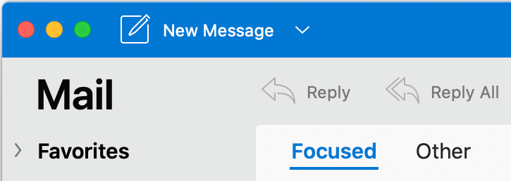

# Mac Outlookのアドイン サポートをOutlook他のクライアントとOutlookする

Outlook on the web、Windows、iOS、Android などの他のクライアントと同様に、mac の Outlook で Outlook アドインを作成して実行できます。クライアントごとに JavaScript をカスタマイズする必要があります。 次の表に示す領域を除き、通常、アドインから JavaScript API Office呼び出しは同じ方法で動作します。

詳細については、「[Outlook 2013 プレビューでのテスト用メール アプリの展開とインストール](testing-and-tips.md)」を参照してください。

新しい UI サポートの詳細については、「新しい Mac UI でのアドインの[サポート」Outlookを参照してください](#add-in-support-in-outlook-on-new-mac-ui-preview)。

| 分野 | Outlook on the web、Windows、モバイル デバイス | Outlook on Mac |
|:-----|:-----|:-----|
| サポート対象バージョンの office.js および Office アドインのマニフェスト スキーマ | Office.js および スキーマ v1.1 のすべての API。 | Office.js および スキーマ v1.1 のすべての API。  **注**: Mac Outlookでは、16.35.308 以降のビルドだけが会議の保存をサポートします。 それ以外の場合、 `saveAsync` 作成モードで会議から呼び出された場合、メソッドは失敗します。 回避策については、「[Office JS API を使用して Outlook for Mac で会議を下書きとして保存できない](https://support.microsoft.com/help/4505745)」を参照してください。 |
| 定期的な予定系列のインスタンス | <ul><li>定期的な系列のマスター予定または予定インスタンスのアイテム ID および他のプロパティを取得できます。</li><li>[mailbox.displayAppointmentForm](../reference/objectmodel/preview-requirement-set/office.context.mailbox.md#methods) を使用して、定期的な系列のインスタンスまたはマスターを表示できます。</li></ul> | <ul><li>マスター予定のアイテム ID と他のプロパティを取得できますが、定期的な系列のインスタンスのアイテム ID とプロパティは取得できません。</li><li>定期的な系列のマスター予定を表示できます。アイテム ID がない場合、定期的な系列のインスタンスは表示できません。</li></ul> |
| 予定出席者の受信者の種類 | [EmailAddressDetails.recipientType](/javascript/api/outlook/office.emailaddressdetails#recipientType) を使用して、出席者の受信者の種類を特定できます。 | `EmailAddressDetails.recipientType` は予定出席者には `undefined` を返します。 |
| クライアント アプリケーションのバージョン文字列 | [diagnostics.hostVersion](/javascript/api/outlook/office.diagnostics#hostVersion)によって返されるバージョン文字列の形式は、実際のクライアントの種類によって異なります。 例:<ul><li>OutlookのWindows:`15.0.4454.1002`</li><li>Outlook on the web:`15.0.918.2`</li></ul> |Mac 上のバージョンで返されるバージョン `Diagnostics.hostVersion` Outlook例を示します。`15.0 (140325)` |
| アイテムのカスタム プロパティ | ネットワークが使用できなくなっても、アドインはキャッシュに入っているカスタム プロパティに引き続きアクセスできます。 | Mac Outlookはカスタム プロパティをキャッシュしないので、ネットワークがダウンした場合、アドインはカスタム プロパティにアクセスできない可能性があります。 |
| 添付ファイルの詳細 | [AttachmentDetails](/javascript/api/outlook/office.attachmentdetails)オブジェクトのコンテンツ タイプと添付ファイル名は、クライアントの種類によって異なります。<ul><li>`AttachmentDetails.contentType` の JSON 例: `"contentType": "image/x-png"`。 </li><li>`AttachmentDetails.name` にはファイル名拡張子は含まれません。たとえば、添付ファイルが「RE: Summer activity」という件名のメッセージの場合、添付ファイル名を表す JSON オブジェクトは `"name": "RE: Summer activity"` になります。</li></ul> | <ul><li>`AttachmentDetails.contentType` の JSON 例: `"contentType" "image/png"`</li><li>`AttachmentDetails.name` には、ファイル名拡張子が必ず含まれます。メール アイテムの添付ファイルの拡張子は .eml で、予定の拡張子は .ics です。添付ファイルが「RE: Summer activity」という件名の電子メールである場合、その添付ファイル名を表す JSON オブジェクトは `"name": "RE: Summer activity.eml"` になります。
**注**: アドインを介するなど、ファイルがプログラムによって拡張子なしで添付される場合、`AttachmentDetails.name` にはファイル名の一部として拡張子は含まれません。
</li></ul> |
| `dateTimeCreated` と `dateTimeModified` のプロパティでタイム ゾーンを表す文字列 |例: `Thu Mar 13 2014 14:09:11 GMT+0800 (China Standard Time)` | 例: `Thu Mar 13 2014 14:09:11 GMT+0800 (CST)` |
| `dateTimeCreated` と `dateTimeModified` の時間精度 | 次に示すコードをアドインで使用している場合、最大の精度はミリ秒単位になります。 `JSON.stringify(Office.context.mailbox.item, null, 4);`| 精度は最大で秒単位となります。 |

## 新しい Mac UI でのOutlookのサポート (プレビュー)

Outlookは、要件セット 1.8 まで、新しい Mac UI (プレビュー) でサポートされています。 ただし、次の要件セットと機能 **はまだ** サポートされていません。

- API 要件セット 1.9 と 1.10

バージョン 16.38.506 からOutlook Mac UI のプレビューを行って下さい。 試し方の詳細については、「Outlook for Mac - Insider Fast ビルドのリリース ノート」[を参照してください](https://support.microsoft.com/office/d6347358-5613-433e-a49e-a9a0e8e0462a)。

次のように、どの UI バージョンをオンにしているのか確認できます。

**現在の UI**

**新しい UI (プレビュー)**

