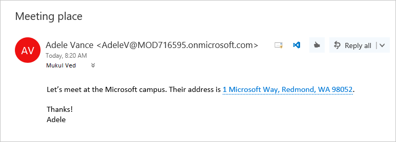

# <a name="contextual-outlook-add-ins"></a><span data-ttu-id="48eab-103">コンテキスト Outlook アドイン</span><span class="sxs-lookup"><span data-stu-id="48eab-103">Contextual Outlook add-ins</span></span>

<span data-ttu-id="48eab-p101">コンテキスト アドインは、メッセージ内のテキストまたは予定に基づいてアクティブになる Outlook アドインです。コンテキスト アドインを使用すると、ユーザーはメッセージ自体から移動しなくてもそのメッセージに関連したタスクを開始できます。それにより、操作が簡単になると同時にユーザー エクスペリエンスが豊かになります。</span><span class="sxs-lookup"><span data-stu-id="48eab-p101">Contextual add-ins are Outlook add-ins that activate based on text in a message or appointment. By using contextual add-ins, a user can initiate tasks related to a message without leaving the message itself, which results in an easier and richer user experience.</span></span>

<span data-ttu-id="48eab-106">次に、コンテキスト アドインの例を示します。</span><span class="sxs-lookup"><span data-stu-id="48eab-106">The following are examples of contextual add-ins:</span></span>

- <span data-ttu-id="48eab-107">住所を選択すると、その場所の地図が開きます。</span><span class="sxs-lookup"><span data-stu-id="48eab-107">Choosing an address to open a map of the location.</span></span>
- <span data-ttu-id="48eab-108">文字列をクリックすると、会議提案アドインが開きます。</span><span class="sxs-lookup"><span data-stu-id="48eab-108">Choosing a string that opens a meeting suggestion add-in.</span></span>
- <span data-ttu-id="48eab-109">電話番号を選択すると、連絡先に追加されます。</span><span class="sxs-lookup"><span data-stu-id="48eab-109">Choosing a phone number to add to your contacts.</span></span>


> [!NOTE]
> <span data-ttu-id="48eab-110">現在、Android および iOS 用の Outlook では、コンテキスト アドインをご利用いただけません。</span><span class="sxs-lookup"><span data-stu-id="48eab-110">Contextual add-ins are not currently available in Outlook on Android and iOS.</span></span> <span data-ttu-id="48eab-111">今後、この機能が使用可能になる予定です。</span><span class="sxs-lookup"><span data-stu-id="48eab-111">This functionality will be made available in the future.</span></span>
>
> <span data-ttu-id="48eab-112">この機能のサポートは、要件セット 1.6 に導入されました。</span><span class="sxs-lookup"><span data-stu-id="48eab-112">Support for this feature was introduced in requirement set 1.6.</span></span> <span data-ttu-id="48eab-113">この要件セットをサポートする [クライアントおよびプラットフォーム](../reference/requirement-sets/outlook-api-requirement-sets.md#requirement-sets-supported-by-exchange-servers-and-outlook-clients) を参照してください。</span><span class="sxs-lookup"><span data-stu-id="48eab-113">See [clients and platforms](../reference/requirement-sets/outlook-api-requirement-sets.md#requirement-sets-supported-by-exchange-servers-and-outlook-clients) that support this requirement set.</span></span>

## <a name="how-to-make-a-contextual-add-in"></a><span data-ttu-id="48eab-114">コンテキスト アドインの作成方法</span><span class="sxs-lookup"><span data-stu-id="48eab-114">How to make a contextual add-in</span></span>

<span data-ttu-id="48eab-115">コンテキスト アドインのマニフェストには、`xsi:type` 属性が `DetectedEntity` に設定されている [ExtensionPoint](../reference/manifest/extensionpoint.md) 要素が含まれている必要があります。</span><span class="sxs-lookup"><span data-stu-id="48eab-115">A contextual add-in's manifest must include an [ExtensionPoint](../reference/manifest/extensionpoint.md) element with an `xsi:type` attribute set to `DetectedEntity`.</span></span> <span data-ttu-id="48eab-116">**ExtensionPoint** 要素内で、アドインはアクティブ化できるエンティティまたは正規表現を指定します。</span><span class="sxs-lookup"><span data-stu-id="48eab-116">Within the **ExtensionPoint** element, the add-in specifies the entities or regular expression that can activate it.</span></span> <span data-ttu-id="48eab-117">エンティティを指定する場合、そのエンティティは [Entities](/javascript/api/outlook/office.entities) オブジェクトのどのプロパティであってもかまいません。</span><span class="sxs-lookup"><span data-stu-id="48eab-117">If an entity is specified, the entity can be any of the properties in the [Entities](/javascript/api/outlook/office.entities) object.</span></span>

<span data-ttu-id="48eab-118">そのため、アドイン マニフェストには、ルールの種類 **ItemHasKnownEntity** または **ItemHasRegularExpressionMatch** が含まれている必要があります。</span><span class="sxs-lookup"><span data-stu-id="48eab-118">Thus, the add-in manifest must contain a rule of type **ItemHasKnownEntity** or **ItemHasRegularExpressionMatch**.</span></span> <span data-ttu-id="48eab-119">次の例では、検出された電話番号のエンティティを含むメッセージに対してアドインをアクティブにする方法を示します。</span><span class="sxs-lookup"><span data-stu-id="48eab-119">The following example shows how to specify that an add-in should activate on messages with a detected entity that is a phone number:</span></span>

```XML
<ExtensionPoint xsi:type="DetectedEntity">
  <Label resid="contextLabel" />
  <SourceLocation resid="detectedEntityURL" />
  <Rule xsi:type="RuleCollection" Mode="And">
    <Rule xsi:type="ItemIs" ItemType="Message" />
    <Rule xsi:type="ItemHasKnownEntity" EntityType="PhoneNumber" Highlight="all" />
  </Rule>
</ExtensionPoint>
```

<span data-ttu-id="48eab-120">コンテキスト アドインをアカウントに関連付けると、強調表示された状態のエンティティまたは正規表現をユーザーがクリックするとコンテキスト アプリが自動的に起動します。</span><span class="sxs-lookup"><span data-stu-id="48eab-120">After a contextual add-in is associated with an account, it will automatically start when the user clicks a highlighted entity or regular expression.</span></span> <span data-ttu-id="48eab-121">Outlook アドインでの正規表現について詳しくは、「[正規表現アクティブ化ルールを使用して Outlook アドインを表示する](use-regular-expressions-to-show-an-outlook-add-in.md)」を参照してください。</span><span class="sxs-lookup"><span data-stu-id="48eab-121">For more information about regular expressions for Outlook add-ins, see [Use regular expression activation rules to show an Outlook add-in](use-regular-expressions-to-show-an-outlook-add-in.md).</span></span>

<span data-ttu-id="48eab-122">コンテキスト アドインには、次のいくつかの制限があります。</span><span class="sxs-lookup"><span data-stu-id="48eab-122">There are several restrictions on contextual add-ins:</span></span>

- <span data-ttu-id="48eab-123">コンテキスト アドインを含めることができるのは読み取りアドインのみです (作成アドインは不可)。</span><span class="sxs-lookup"><span data-stu-id="48eab-123">A contextual add-in can only exist in read add-ins (not compose add-ins).</span></span>
- <span data-ttu-id="48eab-124">強調表示されたエンティティの色は指定できません。</span><span class="sxs-lookup"><span data-stu-id="48eab-124">You cannot specify the color of the highlighted entity.</span></span>
- <span data-ttu-id="48eab-125">強調表示されていないエンティティは、コンテキスト アドインをカード内で起動することはありません。</span><span class="sxs-lookup"><span data-stu-id="48eab-125">An entity that is not highlighted will not launch a contextual add-in in a card.</span></span>

<span data-ttu-id="48eab-126">強調表示されていないエンティティまたは正規表現はコンテキスト アドインを起動しないため、アドイン マニフェストには `Highlight` 属性が `all` に設定された `Rule` 要素を少なくとも 1 つは含んでいる必要があります。</span><span class="sxs-lookup"><span data-stu-id="48eab-126">Because an entity or regular expression that is not highlighted will not launch a contextual add-in, add-ins must include at least one `Rule` element with the `Highlight` attribute set to `all`.</span></span>

> [!NOTE]
> <span data-ttu-id="48eab-p107">注: `EmailAddress` と `Url` のエンティティ型は強調表示をサポートしていないため、コンテキスト アドインの起動に使用することはできません。ただし、追加のアクティブ化条件として、`RuleCollection` ルール型と組み合わせることはできます。</span><span class="sxs-lookup"><span data-stu-id="48eab-p107">The `EmailAddress` and `Url` entity types do not support highlighting, so they cannot be used to launch a contextual add-in. They can however be combined in a `RuleCollection` rule type as an additional activation criteria.</span></span>

## <a name="how-to-launch-a-contextual-add-in"></a><span data-ttu-id="48eab-129">コンテキスト アドインの起動方法</span><span class="sxs-lookup"><span data-stu-id="48eab-129">How to launch a contextual add-in</span></span>

<span data-ttu-id="48eab-p108">ユーザーは、既知のエンティティまたは開発者の正規表現のどちらかで、テキストを通じてコンテキスト アドインを起動します。通常、ユーザーはエンティティが強調表示されていることでコンテキスト アドインを特定します。次の例は、メッセージ内の強調表示の様子を示しています。このエンティティ (住所) は、青色と下線 (青色の点線) で示されています。ユーザーは、強調表示されたエンティティをクリックすることでコンテキスト アドインを起動します。</span><span class="sxs-lookup"><span data-stu-id="48eab-p108">A user launches a contextual add-in through text, either a known entity or a developer's regular expression. Typically, a user identifies a contextual add-in because the entity is highlighted. The following example shows how highlighting appears in a message. Here the entity (an address) is colored blue and underlined with a dotted blue line. A user launches the contextual add-in by clicking the highlighted entity.</span></span> 

<span data-ttu-id="48eab-135">**強調表示されているエンティティ (住所) が含まれるテキストの例**</span><span class="sxs-lookup"><span data-stu-id="48eab-135">**Example of text with highlighted entity (an address)**</span></span>


    
<span data-ttu-id="48eab-137">1 つのメッセージ内に複数のエンティティまたはコンテキスト アドインが存在する場合、ユーザー操作の規則がいくつかあります。</span><span class="sxs-lookup"><span data-stu-id="48eab-137">When there are multiple entities or contextual add-ins in a message, there are a few user interaction rules:</span></span>

- <span data-ttu-id="48eab-138">エンティティが複数ある場合、ユーザーは対象のアドインを起動するために異なるエンティティをクリックする必要があります。</span><span class="sxs-lookup"><span data-stu-id="48eab-138">If there are multiple entities, the user has to click a different entity to launch the add-in for it.</span></span>
- <span data-ttu-id="48eab-139">エンティティが複数のアドインをアクティブにする場合、各アドインは新しいタブを開きます。ユーザーはタブを切り替えて、アドイン間の変更をします。たとえば、名前とアドレスは、電話のアドインとマップをトリガーするかもしれません。</span><span class="sxs-lookup"><span data-stu-id="48eab-139">If an entity activates multiple add-ins, each add-in opens a new tab. The user switches between tabs to change between add-ins. For example, a name and address might trigger a phone add-in and a map.</span></span>
- <span data-ttu-id="48eab-p109">1 つの文字列に複数のアドインをアクティブにする複数のエンティティが含まれる場合、文字列全体が強調表示され、その文字列をクリックすると、その文字列に関連付けられているすべてのアドインが別々のタブに表示されます。たとえば、レストランで会議を行う提案を説明する文字列によって、会議提案アドインとレストラン評価アドインをアクティブにできます。</span><span class="sxs-lookup"><span data-stu-id="48eab-p109">If a single string contains multiple entities that activate multiple add-ins, the entire string is highlighted, and clicking the string shows all add-ins relevant to the string on separate tabs. For example, a string that describes a proposed meeting at a restaurant might activate the Suggested Meeting add-in and a restaurant rating add-in.</span></span>

## <a name="how-a-contextual-add-in-displays"></a><span data-ttu-id="48eab-142">コンテキスト アドインの表示方法</span><span class="sxs-lookup"><span data-stu-id="48eab-142">How a contextual add-in displays</span></span>

<span data-ttu-id="48eab-p110">アクティブ化されたコンテキスト アドインは、カード (エンティティの近くに現れる別ウィンドウ) で表示されます。通常、このカードはエンティティの下側に、できるだけ中央揃えになるように表示されます。エンティティの下側に十分な空間がない場合、カードはエンティティの上側に配置されます。次のスクリーンショットは、強調表示されたエンティティと、その下側のカード内でアクティブ化されたアドイン (Bing 地図) を示しています。</span><span class="sxs-lookup"><span data-stu-id="48eab-p110">An activated contextual add-in appears in a card, which is a separate window near the entity. The card will normally appear below the entity and centered with respect to the entity as much as possible. If there is not enough room below the entity, the card is placed above it. The following screenshot shows the highlighted entity, and below it, an activated add-in (Bing Maps) in a card.</span></span>

<span data-ttu-id="48eab-147">**カードに表示されるアドインの例**</span><span class="sxs-lookup"><span data-stu-id="48eab-147">**Example of an add-in displayed in a card**</span></span>


<span data-ttu-id="48eab-149">カードを閉じてアドインを終了するには、カードの外側で任意の場所をクリックします。</span><span class="sxs-lookup"><span data-stu-id="48eab-149">To close the card and the add-in, a user clicks anywhere outside of the card.</span></span>

## <a name="current-contextual-add-ins"></a><span data-ttu-id="48eab-150">現在のコンテキスト アドイン</span><span class="sxs-lookup"><span data-stu-id="48eab-150">Current contextual add-ins</span></span>

<span data-ttu-id="48eab-151">以下のコンテキスト アドインが、Outlook アドインと一緒に既定でインストールされます。</span><span class="sxs-lookup"><span data-stu-id="48eab-151">The following contextual add-ins are installed by default for users with Outlook add-ins:</span></span>

- <span data-ttu-id="48eab-152">Bing 地図</span><span class="sxs-lookup"><span data-stu-id="48eab-152">Bing Maps</span></span> 
- <span data-ttu-id="48eab-153">会議の候補</span><span class="sxs-lookup"><span data-stu-id="48eab-153">Suggested Meetings</span></span>

## <a name="see-also"></a><span data-ttu-id="48eab-154">関連項目</span><span class="sxs-lookup"><span data-stu-id="48eab-154">See also</span></span>

- <span data-ttu-id="48eab-155">[Outlook アドイン: Contoso 社の注文番号](https://github.com/OfficeDev/Outlook-Add-In-Contextual-Regex) (正規表現の一致に基づいてアクティブ化されるコンテキスト アドインのサンプル)</span><span class="sxs-lookup"><span data-stu-id="48eab-155">[Outlook add-in: Contoso Order Number](https://github.com/OfficeDev/Outlook-Add-In-Contextual-Regex) (sample contextual add-in that activates based on a regular expression match)</span></span>
- [<span data-ttu-id="48eab-156">初めて Outlook アドインを記述する</span><span class="sxs-lookup"><span data-stu-id="48eab-156">Write your first Outlook add-in</span></span>](../quickstarts/outlook-quickstart.md)
- [<span data-ttu-id="48eab-157">正規表現アクティブ化ルールを使用して Outlook アドインを表示する</span><span class="sxs-lookup"><span data-stu-id="48eab-157">Use regular expression activation rules to show an Outlook add-in</span></span>](use-regular-expressions-to-show-an-outlook-add-in.md)
- [<span data-ttu-id="48eab-158">Entities オブジェクト</span><span class="sxs-lookup"><span data-stu-id="48eab-158">Entities object</span></span>](/javascript/api/outlook/office.entities)
