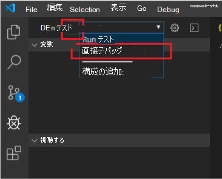

# <a name="debug-your-event-based-outlook-add-in"></a>イベント ベースの Outlook アドインをデバッグする

この記事では、アドインに [イベント ベースのアクティブ化](autolaunch.md) を実装する際のデバッグ ガイダンスを提供します。 イベント ベースのアクティブ化機能は [要件セット 1.10](/javascript/api/requirement-sets/outlook/requirement-set-1.10/outlook-requirement-set-1.10) で導入され、後続の要件セットで追加のイベントを使用できるようになりました。 詳細については、「 [サポートされているイベント](autolaunch.md#supported-events)」を参照してください。

> [!IMPORTANT]
> このデバッグ機能は、Microsoft 365 サブスクリプションを使用する Outlook on Windows でのみサポートされます。

この記事では、デバッグを有効にする主要な段階について説明します。

- [デバッグ用にアドインをマークする](#mark-your-add-in-for-debugging)
- [Visual Studio Code を構成する](#configure-visual-studio-code)
- [Visual Studio Code をアタッチする](#attach-visual-studio-code)
- [Debug](#debug)

Office アドイン用 Yeoman Generator を使用してアドイン プロジェクトを作成した場合 (たとえば、 [イベント ベースのアクティブ化チュートリアル](autolaunch.md)を実行するなど)、この記事全体で **[Create with Yeoman ジェネレーター** ] オプションに従います。 それ以外の場合は、 **その他** の手順に従います。 Visual Studio Code は、少なくともバージョン 1.56.1 である必要があります。

## <a name="mark-your-add-in-for-debugging"></a>デバッグ用にアドインをマークする

1. レジストリ キーを設定します `HKEY_CURRENT_USER\SOFTWARE\Microsoft\Office\16.0\Wef\Developer\[Add-in ID]\UseDirectDebugger`。 `[Add-in ID]`**\<Id\>** はアドイン マニフェスト内です。

    **Yeoman ジェネレーターで作成**: コマンド ライン ウィンドウで、アドイン フォルダーのルートに移動し、次のコマンドを実行します。

    ```command&nbsp;line
    npm start
    ```

    このコマンドは、コードをビルドしてローカル サーバーを起動するだけでなく、このアドイン`1`のレジストリ キーを `UseDirectDebugger` .

    **その他**: 下にレジストリ キー`HKEY_CURRENT_USER\SOFTWARE\Microsoft\Office\16.0\WEF\Developer\[Add-in ID]\`を`UseDirectDebugger`追加します。 **\<Id\>** アドイン マニフェストから置き換えます`[Add-in ID]`。 レジストリ キー `1`を .

    [!include[Developer registry key](../includes/developer-registry-key.md)]

1. Outlook を起動するか、既に開いている場合は再起動します。
1. 新しいメッセージまたは予定を作成します。 [デバッグ イベント ベースのハンドラー] ダイアログ ボックスが表示されます。 ダイアログをまだ操作 *しないでください* 。

    ![Windows の [デバッグ イベント ベースのハンドラー] ダイアログ。](../images/outlook-win-autolaunch-debug-dialog.png)

## <a name="configure-visual-studio-code"></a>Visual Studio Code を構成する

### <a name="created-with-yeoman-generator"></a>Yeoman ジェネレーターを使用して作成

1. コマンド ライン ウィンドウに戻り、Visual Studio Code を開きます。

    ```command&nbsp;line
    code .
    ```

1. Visual Studio Code で **、./.vscode/launch.json** ファイルを開き、構成の一覧に次の抜粋を追加します。 変更内容を保存します。

    ```json
    {
      "name": "Direct Debugging",
      "type": "node",
      "request": "attach",
      "port": 9229,
      "protocol": "inspector",
      "timeout": 600000,
      "trace": true
    }
    ```

### <a name="other"></a>その他

1. **[デバッグ**] という名前の新しいフォルダーを作成します (**デスクトップ** フォルダーなど)。
1. Visual Studio Code を開きます。
1. **[ファイル** > **を開くフォルダー] に** 移動し、作成したフォルダーに移動し、[**フォルダーの選択] を選択します**。
1. アクティビティ バーで、[ **実行とデバッグ** ] (Ctrl + Shift + D) を選択します。

    ![アクティビティ バーの [実行とデバッグ] アイコン。](../images/vs-code-debug.png)

1. **launch.json ファイルの作成リンクを選択します**。

    ![Visual Studio Code で launch.json ファイルを作成するための [実行とデバッグ] オプションの下にあるリンク。](../images/vs-code-create-launch.json.png)

1. [ **環境の選択]** ドロップダウンで、[ **エッジ: 起動** ] を選択して launch.json ファイルを作成します。
1. 構成の一覧に次の抜粋を追加します。 変更内容を保存します。

    ```json
    {
      "name": "Direct Debugging",
      "type": "node",
      "request": "attach",
      "port": 9229,
      "protocol": "inspector",
      "timeout": 600000,
      "trace": true
    }
    ```

## <a name="attach-visual-studio-code"></a>Visual Studio Code をアタッチする

1. アドインの **bundle.js** を見つけるには、Windows エクスプローラーで次のフォルダーを開き、アドイン (マニフェストにあります) を検索します **\<Id\>** 。

    ```text
    %LOCALAPPDATA%\Microsoft\Office\16.0\Wef
    ```

    この ID のプレフィックスが付いたフォルダーを開き、その完全なパスをコピーします。 Visual Studio Code で、そのフォルダーから **bundle.js** を開きます。 ファイル パスのパターンは次のようになります。

    `%LOCALAPPDATA%\Microsoft\Office\16.0\Wef\{[Outlook profile GUID]}\[encoding]\Javascript\[Add-in ID]_[Add-in Version]_[locale]\bundle.js`

1. デバッガーを停止するbundle.jsにブレークポイントを配置します。
1. **[デバッグ**] ドロップダウンで [**ダイレクト デバッグ**] を選択し、[**デバッグの開始**] アイコンを選択します。

    

## <a name="debug"></a>デバッグ

1. デバッガーがアタッチされていることを確認したら、Outlook に戻り、[ **デバッグ イベント ベースのハンドラー** ] ダイアログで [OK] を選択 **します** 。

1. Visual Studio Code でブレークポイントにヒットし、イベント ベースのアクティブ化コードをデバッグできるようになりました。

## <a name="stop-debugging"></a>デバッグの停止

現在の Outlook デスクトップ セッションの残りの部分のデバッグを停止するには、[ **デバッグ イベント ベースのハンドラー** ] ダイアログで [ **キャンセル**] を選択します。 デバッグを再度有効にするには、Outlook デスクトップを再起動します。

**イベント ベースのハンドラーのデバッグ** ダイアログがポップアップ表示されないようにし、後続の Outlook セッションのデバッグを停止するには、関連付けられているレジストリ キーを削除するか、その値を次のように`0`設定します`HKEY_CURRENT_USER\SOFTWARE\Microsoft\Office\16.0\Wef\Developer\[Add-in ID]\UseDirectDebugger`。

## <a name="see-also"></a>関連項目

- [イベント ベースのアクティブ化のために Outlook アドインを構成する](autolaunch.md)
- [ランタイム ログを使用してアドインをデバッグする](../testing/runtime-logging.md#runtime-logging-on-windows)
