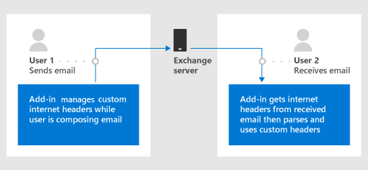

# <a name="get-and-set-internet-headers-on-a-message-in-an-outlook-add-in"></a>アドイン内のメッセージのインターネット ヘッダーを取得Outlook設定する

## <a name="background"></a>背景

アドインの開発Outlook一般的な要件は、アドインに関連付けられているカスタム プロパティを異なるレベルに格納する方法です。 現時点では、カスタム プロパティはアイテムまたはメールボックス レベルで格納されます。

- アイテム レベル - 特定のアイテムに適用されるプロパティの場合は [、CustomProperties オブジェクトを使用](/javascript/api/outlook/office.customproperties) します。 たとえば、電子メールを送信したユーザーに関連付けられた顧客コードを保存します。
- メールボックス レベル - ユーザーのメールボックス内のすべてのメール アイテムに適用されるプロパティの場合は [、RoamingSettings オブジェクトを使用](/javascript/api/outlook/office.roamingsettings) します。 たとえば、ユーザーの好みを保存して、特定のスケールで温度を表示します。

両方の種類のプロパティは、アイテムが Exchange サーバーから離れる後は保持されないので、電子メール受信者はアイテムに設定されたプロパティを取得できません。 したがって、開発者は、これらの設定や他の MIME プロパティにアクセスして、読み取りシナリオの向上を可能にしません。

EWS 要求を介してインターネット ヘッダーを設定する方法は用意されているが、EWS 要求を行うシナリオによっては機能しない場合があります。 たとえば、デスクトップ上の作成モードOutlook、アイテム ID はキャッシュ モード  `saveAsync`   では同期されません。

> [!TIP]
> これらの[オプションの使用の詳細](metadata-for-an-outlook-add-in.md)については、「Get and set add-in metadata for an Outlookアドイン」を参照してください。

## <a name="purpose-of-the-internet-headers-api"></a>インターネット ヘッダー API の目的

要件セット [1.8](../reference/objectmodel/requirement-set-1.8/outlook-requirement-set-1.8.md)で導入されたインターネット ヘッダー API を使用すると、開発者は次の機能を使用できます。

- すべてのクライアントに送信された後に保持される電子メールExchangeスタンプします。
- メールがメールの読み取りシナリオですべてのクライアントに送信Exchange後に保持された電子メールに関する情報を読み取る。
- メールの MIME ヘッダー全体にアクセスします。



## <a name="set-internet-headers-while-composing-a-message"></a>メッセージの作成中にインターネット ヘッダーを設定する

[item.internetHeaders](/javascript/api/outlook/office.messagecompose#internetHeaders)プロパティを使用して、現在のメッセージに配置するカスタム インターネット ヘッダーを作成モードで管理してみてください。

### <a name="set-get-and-remove-custom-headers-example"></a>カスタム ヘッダーの設定、取得、および削除の例

次の例は、カスタム ヘッダーを設定、取得、および削除する方法を示しています。

```js
// Set custom internet headers.
function setCustomHeaders() {
  Office.context.mailbox.item.internetHeaders.setAsync(
    { "x-preferred-fruit": "orange", "x-preferred-vegetable": "broccoli", "x-best-vegetable": "spinach" },
    setCallback
  );
}

function setCallback(asyncResult) {
  if (asyncResult.status === Office.AsyncResultStatus.Succeeded) {
    console.log("Successfully set headers");
  } else {
    console.log("Error setting headers: " + JSON.stringify(asyncResult.error));
  }
}

// Get custom internet headers.
function getSelectedCustomHeaders() {
  Office.context.mailbox.item.internetHeaders.getAsync(
    ["x-preferred-fruit", "x-preferred-vegetable", "x-best-vegetable", "x-nonexistent-header"],
    getCallback
  );
}

function getCallback(asyncResult) {
  if (asyncResult.status === Office.AsyncResultStatus.Succeeded) {
    console.log("Selected headers: " + JSON.stringify(asyncResult.value));
  } else {
    console.log("Error getting selected headers: " + JSON.stringify(asyncResult.error));
  }
}

// Remove custom internet headers.
function removeSelectedCustomHeaders() {
  Office.context.mailbox.item.internetHeaders.removeAsync(
    ["x-best-vegetable", "x-nonexistent-header"],
    removeCallback);
}

function removeCallback(asyncResult) {
  if (asyncResult.status === Office.AsyncResultStatus.Succeeded) {
    console.log("Successfully removed selected headers");
  } else {
    console.log("Error removing selected headers: " + JSON.stringify(asyncResult.error));
  }
}

setCustomHeaders();
getSelectedCustomHeaders();
removeSelectedCustomHeaders();
getSelectedCustomHeaders();

/* Sample output:
Successfully set headers
Selected headers: {"x-best-vegetable":"spinach","x-preferred-fruit":"orange","x-preferred-vegetable":"broccoli"}
Successfully removed selected headers
Selected headers: {"x-preferred-fruit":"orange","x-preferred-vegetable":"broccoli"}
*/
```

## <a name="get-internet-headers-while-reading-a-message"></a>メッセージの読み取り中にインターネット ヘッダーを取得する

[item.getAllInternetHeadersAsync](/javascript/api/outlook/office.messageread#getAllInternetHeadersAsync_options__callback_)を呼び出して、現在のメッセージのインターネット ヘッダーを読み取りモードで取得してみてください。

### <a name="get-sender-preferences-from-current-mime-headers-example"></a>現在の MIME ヘッダーから送信者の基本設定を取得する例

前のセクションの例を基に、次のコードは、現在のメールの MIME ヘッダーから送信者の設定を取得する方法を示しています。

```js
Office.context.mailbox.item.getAllInternetHeadersAsync(getCallback);

function getCallback(asyncResult) {
  if (asyncResult.status === Office.AsyncResultStatus.Succeeded) {
    console.log("Sender's preferred fruit: " + asyncResult.value.match(/x-preferred-fruit:.*/gim)[0].slice(19));
    console.log("Sender's preferred vegetable: " + asyncResult.value.match(/x-preferred-vegetable:.*/gim)[0].slice(23));
  } else {
    console.log("Error getting preferences from header: " + JSON.stringify(asyncResult.error));
  }
}

/* Sample output:
Sender's preferred fruit: orange
Sender's preferred vegetable: broccoli
*/
```

> [!IMPORTANT]
> このサンプルは、単純なケースに対して機能します。 より複雑な情報の取得 (たとえば [、RFC 2822](https://tools.ietf.org/html/rfc2822)で説明されている複数インスタンスヘッダーや折りたたまれた値) については、適切な MIME 解析ライブラリを使用してみてください。

## <a name="recommended-practices"></a>推奨プラクティス

現在、インターネット ヘッダーはユーザーのメールボックス上の有限のリソースです。 クォータが使い果たされた場合、そのメールボックスにこれ以上インターネット ヘッダーを作成することはできません。これにより、この機能に依存するクライアントからの予期しない動作が発生する可能性があります。

アドインでインターネット ヘッダーを作成する場合は、次のガイドラインを適用します。

- 必要なヘッダーの最小数を作成します。
- ヘッダーに名前を付け、後で値を再利用して更新できます。 そのため、ヘッダーの名前付けは変数の方法 (たとえば、ユーザー入力、タイムスタンプなどに基づく) で避けます。

## <a name="see-also"></a>関連項目

- [Outlook アドインのアドイン メタデータを取得および設定する](metadata-for-an-outlook-add-in.md)
