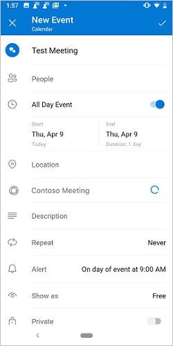

# <a name="create-an-outlook-mobile-add-in-for-an-online-meeting-provider"></a><span data-ttu-id="516f3-103">オンライン会議プロバイダー用の Outlook モバイルアドインを作成する</span><span class="sxs-lookup"><span data-stu-id="516f3-103">Create an Outlook mobile add-in for an online-meeting provider</span></span>

<span data-ttu-id="516f3-104">オンライン会議の設定は、Outlook ユーザーにとって中心的な操作であり、Outlook mobile[を使用して Teams 会議を](/microsoftteams/teams-add-in-for-outlook)簡単に作成できます。</span><span class="sxs-lookup"><span data-stu-id="516f3-104">Setting up an online meeting is a core experience for an Outlook user, and it's easy to [create a Teams meeting with Outlook](/microsoftteams/teams-add-in-for-outlook) mobile.</span></span> <span data-ttu-id="516f3-105">ただし、Microsoft 以外のサービスを使用して Outlook でオンライン会議を作成するのは煩雑な場合があります。</span><span class="sxs-lookup"><span data-stu-id="516f3-105">However, creating an online meeting in Outlook with a non-Microsoft service can be cumbersome.</span></span> <span data-ttu-id="516f3-106">この機能を実装することにより、サービスプロバイダーは、Outlook アドインユーザーに対してオンライン会議の作成環境を合理化することができます。</span><span class="sxs-lookup"><span data-stu-id="516f3-106">By implementing this feature, service providers can streamline the online meeting creation experience for their Outlook add-in users.</span></span>

> [!IMPORTANT]
> <span data-ttu-id="516f3-107">この機能は、Office 365 サブスクリプションを使用した Android でのみサポートされています。</span><span class="sxs-lookup"><span data-stu-id="516f3-107">This feature is only supported on Android with an Office 365 subscription.</span></span>

<span data-ttu-id="516f3-108">この記事では、ユーザーがオンライン会議サービスを使用して会議を整理し、会議に参加できるようにするために Outlook モバイルアドインをセットアップする方法について説明します。</span><span class="sxs-lookup"><span data-stu-id="516f3-108">In this article, you'll learn how to set up your Outlook mobile add-in to enable users to organize and join a meeting using your online-meeting service.</span></span> <span data-ttu-id="516f3-109">この記事全体で、架空のオンライン会議サービスプロバイダーである "Contoso" を使用します。</span><span class="sxs-lookup"><span data-stu-id="516f3-109">Throughout this article, we'll be using a fictional online-meeting service provider, "Contoso".</span></span>

## <a name="configure-the-manifest"></a><span data-ttu-id="516f3-110">マニフェストを構成する</span><span class="sxs-lookup"><span data-stu-id="516f3-110">Configure the manifest</span></span>

<span data-ttu-id="516f3-111">ユーザーがアドインを使用してオンライン会議を作成できるようにするには、 `MobileOnlineMeetingCommandSurface` マニフェストで親要素の下に拡張点を構成する必要があり `MobileFormFactor` ます。</span><span class="sxs-lookup"><span data-stu-id="516f3-111">To enable users to create online meetings with your add-in, you must configure the `MobileOnlineMeetingCommandSurface` extension point in the manifest under the parent element `MobileFormFactor`.</span></span> <span data-ttu-id="516f3-112">その他のフォームファクターはサポートされていません。</span><span class="sxs-lookup"><span data-stu-id="516f3-112">Other form factors are not supported.</span></span>

<span data-ttu-id="516f3-113">次の例は、要素と拡張点を含むマニフェストからの抜粋を示して `MobileFormFactor` `MobileOnlineMeetingCommandSurface` います。</span><span class="sxs-lookup"><span data-stu-id="516f3-113">The following example shows an excerpt from the manifest that includes the `MobileFormFactor` element and `MobileOnlineMeetingCommandSurface` extension point.</span></span>

> [!TIP]
> <span data-ttu-id="516f3-114">Outlook アドインのマニフェストの詳細については、「outlook[アドインのマニフェスト](manifests.md)」および「 [outlook Mobile のアドインコマンドのサポートを追加](add-mobile-support.md)する」を参照してください。</span><span class="sxs-lookup"><span data-stu-id="516f3-114">To learn more about manifests for Outlook add-ins, see [Outlook add-in manifests](manifests.md) and [Add support for add-in commands for Outlook Mobile](add-mobile-support.md).</span></span>

```xml
...
<VersionOverrides xmlns="http://schemas.microsoft.com/office/mailappversionoverrides" xsi:type="VersionOverridesV1_0">
  <VersionOverrides xmlns="http://schemas.microsoft.com/office/mailappversionoverrides/1.1" xsi:type="VersionOverridesV1_1">
    ...
    <Hosts>
      <Host xsi:type="MailHost">
        <MobileFormFactor>
          <FunctionFile resid="residMobileFuncUrl" />
          <ExtensionPoint xsi:type="MobileOnlineMeetingCommandSurface">
            <!-- Configure selected extension point. -->
            <Control xsi:type="MobileButton" id="onlineMeetingFunctionButton">
              <Label resid="residUILessButton0Name" />
              <Icon>
                <bt:Image resid="UiLessIcon" size="25" scale="1" />
                <bt:Image resid="UiLessIcon" size="25" scale="2" />
                <bt:Image resid="UiLessIcon" size="25" scale="3" />
                <bt:Image resid="UiLessIcon" size="32" scale="1" />
                <bt:Image resid="UiLessIcon" size="32" scale="2" />
                <bt:Image resid="UiLessIcon" size="32" scale="3" />
                <bt:Image resid="UiLessIcon" size="48" scale="1" />
                <bt:Image resid="UiLessIcon" size="48" scale="2" />
                <bt:Image resid="UiLessIcon" size="48" scale="3" />
              </Icon>
              <Action xsi:type="ExecuteFunction">
                <FunctionName>insertContosoMeeting</FunctionName>
              </Action>
            </Control>
          </ExtensionPoint>
        </MobileFormFactor>
      </Host>
    </Hosts>
    ...
  </VersionOverrides>
</VersionOverrides>
...
```

## <a name="implement-adding-online-meeting-details"></a><span data-ttu-id="516f3-115">オンライン会議の詳細の追加を実装する</span><span class="sxs-lookup"><span data-stu-id="516f3-115">Implement adding online meeting details</span></span>

<span data-ttu-id="516f3-116">このセクションでは、アドインスクリプトでユーザーの会議を更新してオンライン会議の詳細を含める方法について説明します。</span><span class="sxs-lookup"><span data-stu-id="516f3-116">In this section, learn how your add-in script can update a user's meeting to include online meeting details.</span></span>

<span data-ttu-id="516f3-117">次の例は、オンライン会議の詳細を作成する方法を示しています。</span><span class="sxs-lookup"><span data-stu-id="516f3-117">The following example shows how you construct online meeting details.</span></span> <span data-ttu-id="516f3-118">ここでは、サービスから会議開催者の ID とその他の詳細を取得する方法については説明しません。</span><span class="sxs-lookup"><span data-stu-id="516f3-118">Not shown is how to get the meeting organizer's ID and other details from your service.</span></span>

```js
const newBody = '<br>' +
    '<a href="https://contoso.com/meeting?id=123456789" target="_blank">Join Contoso meeting</a>' +
    '<br><br>' +
    'Phone Dial-in: +1(123)456-7890' +
    '<br><br>' +
    'Meeting ID: 123 456 789' +
    '<br><br>' +
    'Want to test your video connection?' +
    '<br><br>' +
    '<a href="https://contoso.com/testmeeting" target="_blank">Join test meeting</a>' +
    '<br><br>';
```

<span data-ttu-id="516f3-119">次の例は、マニフェストで参照される UI を使用しない関数を定義して、 `insertContosoMeeting` オンライン会議の詳細で会議の本文を更新する方法を示しています。</span><span class="sxs-lookup"><span data-stu-id="516f3-119">The following example shows how to define a UI-less function named `insertContosoMeeting` referenced in the manifest to update the meeting body with the online meeting details.</span></span>

```js
var mailboxItem;

// Office is ready.
Office.onReady(function () {
        mailboxItem = Office.context.mailbox.item;
    }
);

function insertContosoMeeting(event) {
    // Get HTML body from the client.
    mailboxItem.body.getAsync("html",
        { asyncContext: event },
        function (getBodyResult) {
            if (getBodyResult.status === Office.AsyncResultStatus.Succeeded) {
                updateBody(getBodyResult.asyncContext, getBodyResult.value);
            } else {
                console.error("Failed to get HTML body.");
                getBodyResult.asyncContext.completed({ allowEvent: false });
            }
        }
    );
}
```

<span data-ttu-id="516f3-120">次の例は、 `updateBody` 前の例で使用した、会議の現在の本文にオンライン会議の詳細を追加する、サポート関数の実装を示しています。</span><span class="sxs-lookup"><span data-stu-id="516f3-120">The following example shows an implementation of the supporting function `updateBody` used in the previous example that appends the online meeting details to the current body of the meeting.</span></span>

```js
function updateBody(event, existingBody) {
    // Append new body to the existing body.
    mailboxItem.body.setAsync(existingBody + newBody,
        { asyncContext: event, coercionType: "html" },
        function (setBodyResult) {
            if (setBodyResult.status === Office.AsyncResultStatus.Succeeded) {
                setBodyResult.asyncContext.completed({ allowEvent: true });
            } else {
                console.error("Failed to set HTML body.");
                setBodyResult.asyncContext.completed({ allowEvent: false });
            }
        }
    );
}
```

## <a name="testing-and-validation"></a><span data-ttu-id="516f3-121">テストと検証</span><span class="sxs-lookup"><span data-stu-id="516f3-121">Testing and validation</span></span>

<span data-ttu-id="516f3-122">通常のガイダンスに従って、[アドインをテストし、検証](testing-and-tips.md)します。</span><span class="sxs-lookup"><span data-stu-id="516f3-122">Follow the usual guidance to [test and validate your add-in](testing-and-tips.md).</span></span> <span data-ttu-id="516f3-123">Outlook on the web、Windows、または Mac で[サイド](sideload-outlook-add-ins-for-testing.md)ロード後に、android モバイルデバイスで outlook を再起動します (現時点でサポートされている唯一のクライアントは android です)。</span><span class="sxs-lookup"><span data-stu-id="516f3-123">After [sideloading](sideload-outlook-add-ins-for-testing.md) in Outlook on the web, Windows, or Mac, restart Outlook on your Android mobile device (Android is the only supported client for now).</span></span> <span data-ttu-id="516f3-124">次に、新しい会議画面で、Microsoft Teams または Skype のトグルが自分のものに置き換えられていることを確認します。</span><span class="sxs-lookup"><span data-stu-id="516f3-124">Then, on a new meeting screen, verify that the Microsoft Teams or Skype toggle is replaced with your own.</span></span>

### <a name="create-meeting-ui"></a><span data-ttu-id="516f3-125">会議 UI を作成する</span><span class="sxs-lookup"><span data-stu-id="516f3-125">Create meeting UI</span></span>

<span data-ttu-id="516f3-126">会議の開催者として、会議を作成するときに次の3つの画像のような画面が表示されます。</span><span class="sxs-lookup"><span data-stu-id="516f3-126">As a meeting organizer, you should see screens similar to the following three images when you create a meeting.</span></span>

<span data-ttu-id="516f3-127">android の[ ![ [会議を作成する] 画面](../images/outlook-android-create-online-meeting-off.png)](../images/outlook-android-create-online-meeting-off-expanded.png#lightbox)のスクリーンショット-contoso-contoso の[ ](../images/outlook-android-create-online-meeting-load-expanded.png#lightbox)会議を作成する] 画面のスクリーンショットを非表示にする-contoso の会議[ ](../images/outlook-android-create-online-meeting-on-expanded.png#lightbox)</span><span class="sxs-lookup"><span data-stu-id="516f3-127">[](../images/outlook-android-create-online-meeting-off-expanded.png#lightbox) [](../images/outlook-android-create-online-meeting-load-expanded.png#lightbox) [](../images/outlook-android-create-online-meeting-on-expanded.png#lightbox)</span></span>

### <a name="join-meeting-ui"></a><span data-ttu-id="516f3-128">ミーティング UI への参加</span><span class="sxs-lookup"><span data-stu-id="516f3-128">Join meeting UI</span></span>

<span data-ttu-id="516f3-129">会議の出席者として、会議を表示するときに次のような画面が表示されます。</span><span class="sxs-lookup"><span data-stu-id="516f3-129">As a meeting attendee, you should see a screen similar to the following image when you view the meeting.</span></span>

<span data-ttu-id="516f3-130">[](../images/outlook-android-join-online-meeting-view-1-expanded.png#lightbox)</span><span class="sxs-lookup"><span data-stu-id="516f3-130">[](../images/outlook-android-join-online-meeting-view-1-expanded.png#lightbox)</span></span>

## <a name="available-apis"></a><span data-ttu-id="516f3-131">利用可能な Api</span><span class="sxs-lookup"><span data-stu-id="516f3-131">Available APIs</span></span>

<span data-ttu-id="516f3-132">この機能では、次の Api を使用できます。</span><span class="sxs-lookup"><span data-stu-id="516f3-132">The following APIs are available for this feature.</span></span>

- <span data-ttu-id="516f3-133">予定の開催者 Api</span><span class="sxs-lookup"><span data-stu-id="516f3-133">Appointment Organizer APIs</span></span>
  - <span data-ttu-id="516f3-134">[Office. アイテムの件名](/javascript/api/outlook/office.appointmentcompose?view=outlook-js-preview#subject)([subject](/javascript/api/outlook/office.subject?view=outlook-js-preview))</span><span class="sxs-lookup"><span data-stu-id="516f3-134">[Office.context.mailbox.item.subject](/javascript/api/outlook/office.appointmentcompose?view=outlook-js-preview#subject) ([Subject](/javascript/api/outlook/office.subject?view=outlook-js-preview))</span></span>
  - <span data-ttu-id="516f3-135">。[開始](/javascript/api/outlook/office.appointmentcompose?view=outlook-js-preview#start)(時刻) ([時間](/javascript/api/outlook/office.time?view=outlook-js-preview))</span><span class="sxs-lookup"><span data-stu-id="516f3-135">[Office.context.mailbox.item.start](/javascript/api/outlook/office.appointmentcompose?view=outlook-js-preview#start) ([Time](/javascript/api/outlook/office.time?view=outlook-js-preview))</span></span>
  - <span data-ttu-id="516f3-136">(時刻)-[終了](/javascript/api/outlook/office.appointmentcompose?view=outlook-js-preview#end)([時間](/javascript/api/outlook/office.time?view=outlook-js-preview))</span><span class="sxs-lookup"><span data-stu-id="516f3-136">[Office.context.mailbox.item.end](/javascript/api/outlook/office.appointmentcompose?view=outlook-js-preview#end) ([Time](/javascript/api/outlook/office.time?view=outlook-js-preview))</span></span>
  - <span data-ttu-id="516f3-137">[Office. メールボックス. アイテムの場所](/javascript/api/outlook/office.appointmentcompose?view=outlook-js-preview#location)([場所](/javascript/api/outlook/office.location?view=outlook-js-preview))</span><span class="sxs-lookup"><span data-stu-id="516f3-137">[Office.context.mailbox.item.location](/javascript/api/outlook/office.appointmentcompose?view=outlook-js-preview#location) ([Location](/javascript/api/outlook/office.location?view=outlook-js-preview))</span></span>
  - <span data-ttu-id="516f3-138">[Office.](/javascript/api/outlook/office.appointmentcompose?view=outlook-js-preview#optionalattendees) -任意の出席者 ([受信者](/javascript/api/outlook/office.recipients?view=outlook-js-preview))</span><span class="sxs-lookup"><span data-stu-id="516f3-138">[Office.context.mailbox.item.optionalAttendees](/javascript/api/outlook/office.appointmentcompose?view=outlook-js-preview#optionalattendees) ([Recipients](/javascript/api/outlook/office.recipients?view=outlook-js-preview))</span></span>
  - <span data-ttu-id="516f3-139">[Office.](/javascript/api/outlook/office.appointmentcompose?view=outlook-js-preview#requiredattendees) ....../の内容 ([受信者](/javascript/api/outlook/office.recipients?view=outlook-js-preview))</span><span class="sxs-lookup"><span data-stu-id="516f3-139">[Office.context.mailbox.item.requiredAttendees](/javascript/api/outlook/office.appointmentcompose?view=outlook-js-preview#requiredattendees) ([Recipients](/javascript/api/outlook/office.recipients?view=outlook-js-preview))</span></span>
  - <span data-ttu-id="516f3-140">[GetAsync](/javascript/api/outlook/office.body?view=outlook-js-preview#getasync-coerciontype--options--callback-)(body, [Body, setasync](/javascript/api/outlook/office.body?view=outlook-js-preview#setasync-data--options--callback-)) (添付[コンテンツ](/javascript/api/outlook/office.appointmentcompose?view=outlook-js-preview#body)の添付)</span><span class="sxs-lookup"><span data-stu-id="516f3-140">[Office.context.mailbox.item.body](/javascript/api/outlook/office.appointmentcompose?view=outlook-js-preview#body) ([Body.getAsync](/javascript/api/outlook/office.body?view=outlook-js-preview#getasync-coerciontype--options--callback-), [Body.setAsync](/javascript/api/outlook/office.body?view=outlook-js-preview#setasync-data--options--callback-))</span></span>
  - <span data-ttu-id="516f3-141">[CustomProperties (](/javascript/api/outlook/office.customproperties?view=outlook-js-preview)) のようにし[ます。](/javascript/api/outlook/office.appointmentcompose?view=outlook-js-preview#loadcustompropertiesasync-callback--usercontext-)</span><span class="sxs-lookup"><span data-stu-id="516f3-141">[Office.context.mailbox.item.loadCustomPropertiesAsync](/javascript/api/outlook/office.appointmentcompose?view=outlook-js-preview#loadcustompropertiesasync-callback--usercontext-) ([CustomProperties](/javascript/api/outlook/office.customproperties?view=outlook-js-preview))</span></span>
  - <span data-ttu-id="516f3-142">[RoamingSettings](../reference/objectmodel/preview-requirement-set/office.context.md?view=outlook-js-preview#roamingsettings-roamingsettings) ([roamingSettings](/javascript/api/outlook/office.roamingsettings?view=outlook-js-preview))</span><span class="sxs-lookup"><span data-stu-id="516f3-142">[Office.context.roamingSettings](../reference/objectmodel/preview-requirement-set/office.context.md?view=outlook-js-preview#roamingsettings-roamingsettings) ([RoamingSettings](/javascript/api/outlook/office.roamingsettings?view=outlook-js-preview))</span></span>
- <span data-ttu-id="516f3-143">認証フローを処理する</span><span class="sxs-lookup"><span data-stu-id="516f3-143">Handle auth flow</span></span>
  - [<span data-ttu-id="516f3-144">ダイアログ API</span><span class="sxs-lookup"><span data-stu-id="516f3-144">Dialog APIs</span></span>](../develop/dialog-api-in-office-add-ins.md)

## <a name="restrictions"></a><span data-ttu-id="516f3-145">制限</span><span class="sxs-lookup"><span data-stu-id="516f3-145">Restrictions</span></span>

<span data-ttu-id="516f3-146">いくつかの制限が適用されます。</span><span class="sxs-lookup"><span data-stu-id="516f3-146">Several restrictions apply.</span></span>

- <span data-ttu-id="516f3-147">オンライン会議サービスプロバイダーにのみ適用されます。</span><span class="sxs-lookup"><span data-stu-id="516f3-147">Applicable only to online-meeting service providers.</span></span>
- <span data-ttu-id="516f3-148">現時点では、Android はサポートされている唯一のクライアントです。</span><span class="sxs-lookup"><span data-stu-id="516f3-148">At present, Android is the only supported client.</span></span> <span data-ttu-id="516f3-149">IOS でのサポートは近日に予定されています。</span><span class="sxs-lookup"><span data-stu-id="516f3-149">Support on iOS is coming soon.</span></span>
- <span data-ttu-id="516f3-150">既定の Teams または Skype オプションを置き換えて、管理者によってインストールされたアドインのみが会議の作成画面に表示されます。</span><span class="sxs-lookup"><span data-stu-id="516f3-150">Only admin-installed add-ins will appear on the meeting compose screen, replacing the default Teams or Skype option.</span></span> <span data-ttu-id="516f3-151">ユーザーがインストールしたアドインはアクティブ化されません。</span><span class="sxs-lookup"><span data-stu-id="516f3-151">User-installed add-ins won't activate.</span></span>
- <span data-ttu-id="516f3-152">アドインアイコンは、16進コード `#919191` または[その他の色の形式](https://convertingcolors.com/hex-color-919191.html)の同等機能を使用したグレースケールである必要があります。</span><span class="sxs-lookup"><span data-stu-id="516f3-152">The add-in icon should be in grayscale using hex code `#919191` or its equivalent in [other color formats](https://convertingcolors.com/hex-color-919191.html).</span></span>
- <span data-ttu-id="516f3-153">予定の開催者 (新規作成) モードでは、UI レスコマンドは1つだけサポートされています。</span><span class="sxs-lookup"><span data-stu-id="516f3-153">Only one UI-less command is supported in Appointment Organizer (compose) mode.</span></span>

## <a name="see-also"></a><span data-ttu-id="516f3-154">関連項目</span><span class="sxs-lookup"><span data-stu-id="516f3-154">See also</span></span>

- [<span data-ttu-id="516f3-155">Outlook Mobile のアドイン</span><span class="sxs-lookup"><span data-stu-id="516f3-155">Add-ins for Outlook Mobile</span></span>](outlook-mobile-addins.md)
- [<span data-ttu-id="516f3-156">Outlook Mobile のアドイン コマンドのサポートを追加する</span><span class="sxs-lookup"><span data-stu-id="516f3-156">Add support for add-in commands for Outlook Mobile</span></span>](add-mobile-support.md)
