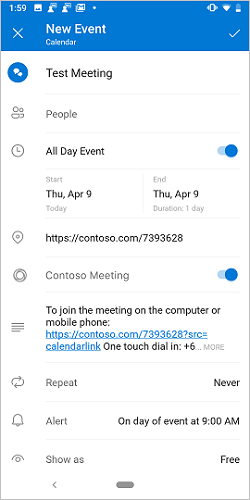
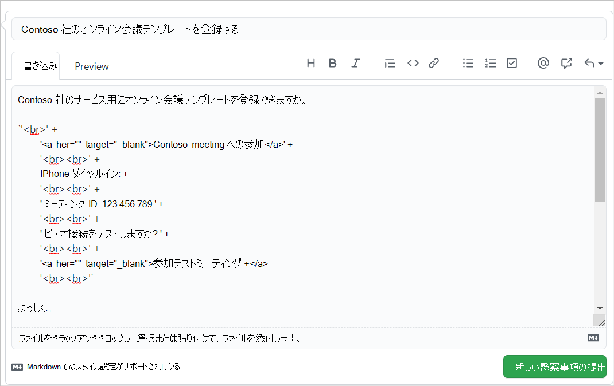

# <a name="create-an-outlook-mobile-add-in-for-an-online-meeting-provider"></a>オンライン会議プロバイダーのOutlookモバイル アドインを作成する

オンライン会議の設定は、Outlook ユーザーのコア エクスペリエンスであり、Outlook モバイル[を使用してTeams会議を簡単に作成](/microsoftteams/teams-add-in-for-outlook)できます。 ただし、Microsoft 以外のサービスを使用してOutlookでオンライン会議を作成するのは面倒な場合があります。 この機能を実装することで、サービス プロバイダーは、Outlook アドイン ユーザーのオンライン会議作成エクスペリエンスを合理化できます。

> [!IMPORTANT]
> この機能は、Microsoft 365 サブスクリプションを持つ Android および iOS でのみサポートされます。

この記事では、ユーザーがオンライン会議サービスを使用して会議を整理して参加できるように、Outlook モバイル アドインを設定する方法について説明します。 この記事では、架空のオンライン会議サービス プロバイダー "Contoso" を使用します。

## <a name="set-up-your-environment"></a>環境を設定する

Office アドイン用の Yeoman ジェネレーターを使用してアドイン プロジェクトを作成するOutlook[クイック スタート](../quickstarts/outlook-quickstart.md?tabs=yeomangenerator)を完了します。

## <a name="configure-the-manifest"></a>マニフェストを構成する

ユーザーがアドインを使用してオンライン会議を作成できるようにするには、親要素`MobileFormFactor`の下のマニフェストで [MobileOnlineMeetingCommandSurface 拡張機能ポイント](/javascript/api/manifest/extensionpoint#mobileonlinemeetingcommandsurface)を構成する必要があります。 その他のフォーム ファクターはサポートされていません。

1. コード エディターで、クイック スタート プロジェクトを開きます。

1. プロジェクトのルートにある **manifest.xml** ファイルを開きます。

1. ノード全体 `<VersionOverrides>` (開いているタグと閉じるタグを含む) を選択し、次の XML に置き換えます。

```xml
<VersionOverrides xmlns="http://schemas.microsoft.com/office/mailappversionoverrides" xsi:type="VersionOverridesV1_0">
  <VersionOverrides xmlns="http://schemas.microsoft.com/office/mailappversionoverrides/1.1" xsi:type="VersionOverridesV1_1">
    <Description resid="residDescription"></Description>
    <Requirements>
      <bt:Sets>
        <bt:Set Name="Mailbox" MinVersion="1.3"/>
      </bt:Sets>
    </Requirements>
    <Hosts>
      <Host xsi:type="MailHost">
        <DesktopFormFactor>
          <FunctionFile resid="residFunctionFile"/>
          <ExtensionPoint xsi:type="AppointmentOrganizerCommandSurface">
            <OfficeTab id="TabDefault">
              <Group id="apptComposeGroup">
                <Label resid="residDescription"/>
                <Control xsi:type="Button" id="insertMeetingButton">
                  <Label resid="residLabel"/>
                  <Supertip>
                    <Title resid="residLabel"/>
                    <Description resid="residTooltip"/>
                  </Supertip>
                  <Icon>
                    <bt:Image size="16" resid="icon-16"/>
                    <bt:Image size="32" resid="icon-32"/>
                    <bt:Image size="64" resid="icon-64"/>
                    <bt:Image size="80" resid="icon-80"/>
                  </Icon>
                  <Action xsi:type="ExecuteFunction">
                    <FunctionName>insertContosoMeeting</FunctionName>
                  </Action>
                </Control>
              </Group>
            </OfficeTab>
          </ExtensionPoint>
        </DesktopFormFactor>

        <MobileFormFactor>
          <FunctionFile resid="residFunctionFile"/>
          <ExtensionPoint xsi:type="MobileOnlineMeetingCommandSurface">
            <Control xsi:type="MobileButton" id="insertMeetingButton">
              <Label resid="residLabel"/>
              <Icon>
                <bt:Image size="25" scale="1" resid="icon-16"/>
                <bt:Image size="25" scale="2" resid="icon-16"/>
                <bt:Image size="25" scale="3" resid="icon-16"/>

                <bt:Image size="32" scale="1" resid="icon-32"/>
                <bt:Image size="32" scale="2" resid="icon-32"/>
                <bt:Image size="32" scale="3" resid="icon-32"/>

                <bt:Image size="48" scale="1" resid="icon-48"/>
                <bt:Image size="48" scale="2" resid="icon-48"/>
                <bt:Image size="48" scale="3" resid="icon-48"/>
              </Icon>
              <Action xsi:type="ExecuteFunction">
                <FunctionName>insertContosoMeeting</FunctionName>
              </Action>
            </Control>
          </ExtensionPoint>
        </MobileFormFactor>
      </Host>
    </Hosts>
    <Resources>
      <bt:Images>
        <bt:Image id="icon-16" DefaultValue="https://contoso.com/assets/icon-16.png"/>
        <bt:Image id="icon-32" DefaultValue="https://contoso.com/assets/icon-32.png"/>
        <bt:Image id="icon-48" DefaultValue="https://contoso.com/assets/icon-48.png"/>
        <bt:Image id="icon-64" DefaultValue="https://contoso.com/assets/icon-64.png"/>
        <bt:Image id="icon-80" DefaultValue="https://contoso.com/assets/icon-80.png"/>
      </bt:Images>
      <bt:Urls>
        <bt:Url id="residFunctionFile" DefaultValue="https://contoso.com/commands.html"/>
      </bt:Urls>
      <bt:ShortStrings>
        <bt:String id="residDescription" DefaultValue="Contoso meeting"/>
        <bt:String id="residLabel" DefaultValue="Add a contoso meeting"/>
      </bt:ShortStrings>
      <bt:LongStrings>
        <bt:String id="residTooltip" DefaultValue="Add a contoso meeting to this appointment."/>
      </bt:LongStrings>
    </Resources>
  </VersionOverrides>
</VersionOverrides>
```

> [!TIP]
> Outlook アドインのマニフェストの詳細については、「[Outlook アドイン マニフェスト](manifests.md)」と「[Outlook Mobile のアドイン コマンドのサポートの追加](add-mobile-support.md)」を参照してください。

## <a name="implement-adding-online-meeting-details"></a>オンライン会議の詳細の追加を実装する

このセクションでは、アドイン スクリプトでユーザーの会議を更新して、オンライン会議の詳細を含める方法について説明します。

1. 同じクイック スタート プロジェクトから、コード エディターで **ファイル ./src/commands/commands.js** を開きます。

1. **commands.js** ファイルの内容全体を次の JavaScript に置き換えます。

    ```js
    // 1. How to construct online meeting details.
    // Not shown: How to get the meeting organizer's ID and other details from your service.
    const newBody = '<br>' +
        '<a href="https://contoso.com/meeting?id=123456789" target="_blank">Join Contoso meeting</a>' +
        '<br><br>' +
        'Phone Dial-in: +1(123)456-7890' +
        '<br><br>' +
        'Meeting ID: 123 456 789' +
        '<br><br>' +
        'Want to test your video connection?' +
        '<br><br>' +
        '<a href="https://contoso.com/testmeeting" target="_blank">Join test meeting</a>' +
        '<br><br>';

    var mailboxItem;

    // Office is ready.
    Office.onReady(function () {
            mailboxItem = Office.context.mailbox.item;
        }
    );

    // 2. How to define and register a UI-less function named `insertContosoMeeting` (referenced in the manifest)
    //    to update the meeting body with the online meeting details.
    function insertContosoMeeting(event) {
        // Get HTML body from the client.
        mailboxItem.body.getAsync("html",
            { asyncContext: event },
            function (getBodyResult) {
                if (getBodyResult.status === Office.AsyncResultStatus.Succeeded) {
                    updateBody(getBodyResult.asyncContext, getBodyResult.value);
                } else {
                    console.error("Failed to get HTML body.");
                    getBodyResult.asyncContext.completed({ allowEvent: false });
                }
            }
        );
    }
    // Register the function.
    Office.actions.associate("insertContosoMeeting", insertContosoMeeting);

    // 3. How to implement a supporting function `updateBody`
    //    that appends the online meeting details to the current body of the meeting.
    function updateBody(event, existingBody) {
        // Append new body to the existing body.
        mailboxItem.body.setAsync(existingBody + newBody,
            { asyncContext: event, coercionType: "html" },
            function (setBodyResult) {
                if (setBodyResult.status === Office.AsyncResultStatus.Succeeded) {
                    setBodyResult.asyncContext.completed({ allowEvent: true });
                } else {
                    console.error("Failed to set HTML body.");
                    setBodyResult.asyncContext.completed({ allowEvent: false });
                }
            }
        );
    }
    ```

## <a name="testing-and-validation"></a>テストと検証

アドインを [テストして検証するには、通常のガイダンスに](testing-and-tips.md)従います。 Outlook on the web、Windows、Mac で[サイドローディング](sideload-outlook-add-ins-for-testing.md)した後、Android または iOS モバイル デバイスでOutlookを再起動します。 次に、新しい会議画面で、Microsoft TeamsまたはSkypeの切り替えが自分のトグルに置き換えられていることを確認します。

### <a name="create-meeting-ui"></a>会議 UI を作成する

会議の開催者として、会議を作成すると、次の 3 つの画像のような画面が表示されます。

[![Android の [会議の作成] 画面 - Contoso はオフに切り替えます。](../images/outlook-android-create-online-meeting-off.png)](../images/outlook-android-create-online-meeting-off-expanded.png#lightbox) [![Android の [会議の作成] 画面 - Contoso の切り替えを読み込みます。](../images/outlook-android-create-online-meeting-load.png)](../images/outlook-android-create-online-meeting-load-expanded.png#lightbox) [](../images/outlook-android-create-online-meeting-on-expanded.png#lightbox)

### <a name="join-meeting-ui"></a>会議に参加する UI

会議出席者として、会議を表示すると、次の図のような画面が表示されます。

[![Android の [参加会議] 画面のスクリーンショット。](../images/outlook-android-join-online-meeting-view-1.png)](../images/outlook-android-join-online-meeting-view-1-expanded.png#lightbox)

> [!IMPORTANT]
> **[参加**] リンクが表示されない場合は、サービスのオンライン会議テンプレートがサーバーに登録されていない可能性があります。 詳細については、「 [オンライン会議テンプレートの登録](#register-your-online-meeting-template) 」セクションを参照してください。

## <a name="register-your-online-meeting-template"></a>オンライン会議テンプレートを登録する

サービスのオンライン会議テンプレートを登録する場合は、詳細に関するGitHubの問題を作成できます。 その後、登録タイムラインを調整するためにお客様に連絡します。

1. この記事の最後にある **[フィードバック]** セクションに移動します。
1. **[このページ**] リンクを押します。
1. 新しい問題の **タイトル** を "サービスのオンライン会議テンプレートを登録する" に設定し、サービス名に `my-service` 置き換えます。
1. 問題本文で、この記事の「[オンライン会議の詳細の追加を実装](#implement-adding-online-meeting-details)する」セクションの`newBody`変数で設定した文字列に文字列 "[フィードバックを入力してください]" を置き換えます。
1. [ **新しい問題の送信]** をクリックします。



## <a name="available-apis"></a>使用可能な API

この機能では、次の API を使用できます。

- 予定オーガナイザー API
  - [Office.context.mailbox.item.body](/javascript/api/outlook/office.appointmentcompose?view=outlook-js-preview&preserve-view=true#outlook-office-appointmentcompose-body-member) ([Body.getAsync](/javascript/api/outlook/office.body?view=outlook-js-preview&preserve-view=true#outlook-office-body-getasync-member(1)), [Body.setAsync](/javascript/api/outlook/office.body?view=outlook-js-preview&preserve-view=true#outlook-office-body-setasync-member(1)))
  - [Office.context.mailbox.item.end](/javascript/api/outlook/office.appointmentcompose?view=outlook-js-preview&preserve-view=true#outlook-office-appointmentcompose-end-member) ([Time](/javascript/api/outlook/office.time?view=outlook-js-preview&preserve-view=true))
  - [Office.context.mailbox.item.loadCustomPropertiesAsync](/javascript/api/outlook/office.appointmentcompose?view=outlook-js-preview&preserve-view=true#outlook-office-appointmentcompose-loadcustompropertiesasync-member(1)) ([CustomProperties](/javascript/api/outlook/office.customproperties?view=outlook-js-preview&preserve-view=true))
  - [Office.context.mailbox.item.location](/javascript/api/outlook/office.appointmentcompose?view=outlook-js-preview&preserve-view=true#outlook-office-appointmentcompose-location-member) ([場所](/javascript/api/outlook/office.location?view=outlook-js-preview&preserve-view=true))
  - [Office.context.mailbox.item.optionalAttendees](/javascript/api/outlook/office.appointmentcompose?view=outlook-js-preview&preserve-view=true#outlook-office-appointmentcompose-optionalattendees-member) ([受信者](/javascript/api/outlook/office.recipients?view=outlook-js-preview&preserve-view=true))
  - [Office.context.mailbox.item.requiredAttendees](/javascript/api/outlook/office.appointmentcompose?view=outlook-js-preview&preserve-view=true#outlook-office-appointmentcompose-requiredattendees-member) ([受信者](/javascript/api/outlook/office.recipients?view=outlook-js-preview&preserve-view=true))
  - [Office.context.mailbox.item.start](/javascript/api/outlook/office.appointmentcompose?view=outlook-js-preview&preserve-view=true#outlook-office-appointmentcompose-start-member) ([Time](/javascript/api/outlook/office.time?view=outlook-js-preview&preserve-view=true))
  - [Office.context.mailbox.item.subject](/javascript/api/outlook/office.appointmentcompose?view=outlook-js-preview&preserve-view=true#outlook-office-appointmentcompose-subject-member) ([件名](/javascript/api/outlook/office.subject?view=outlook-js-preview&preserve-view=true))
  - [Office.context.RoamingSettings](/javascript/api/requirement-sets/outlook/preview-requirement-set/office.context?view=outlook-js-preview&preserve-view=true#roamingsettings-roamingsettings) ([RoamingSettings](/javascript/api/outlook/office.roamingsettings?view=outlook-js-preview&preserve-view=true))
- 認証フローを処理する
  - [ダイアログ API](../develop/dialog-api-in-office-add-ins.md)

## <a name="restrictions"></a>制限

いくつかの制限が適用されます。

- オンライン会議サービス プロバイダーにのみ適用されます。
- 管理者がインストールしたアドインのみが会議の作成画面に表示され、既定のTeamsまたはSkypeオプションが置き換えられます。 ユーザーがインストールしたアドインはアクティブ化されません。
- アドイン アイコンは、16 進コード `#919191` を使用するか、 [他の色形式](https://convertingcolors.com/hex-color-919191.html)で同等の色を使用してグレースケールにする必要があります。
- 予定オーガナイザー (compose) モードでは、UI レス コマンドは 1 つだけサポートされます。
- アドインは、1 分間のタイムアウト期間内に、予定フォームの会議の詳細を更新する必要があります。 ただし、認証用に開かれたアドインがダイアログ ボックスに費やされた時間は、タイムアウト期間から除外されます。

## <a name="see-also"></a>関連項目

- [Outlook Mobile のアドイン](outlook-mobile-addins.md)
- [Outlook Mobile のアドイン コマンドのサポートを追加する](add-mobile-support.md)
