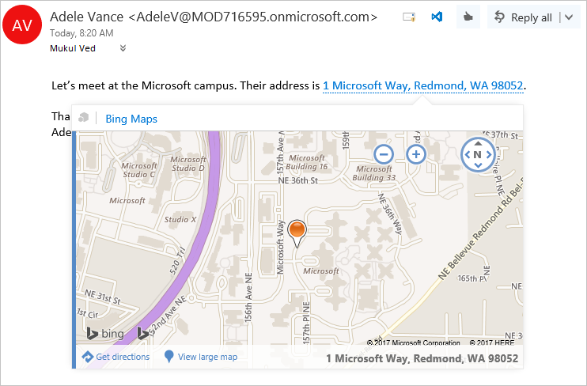

# Outlook アドインの概要Outlook add-ins overview

Outlook アドインとは、Microsoft の Web ベース プラットフォームを使用して Outlook に組み込まれるサードパーティ製の統合機能です。Outlook add-ins are integrations built by third parties into Outlook by using our web-based platform. Outlook アドインには次の 3 つの主な側面があります。Outlook add-ins have three key aspects:

- Windows と Mac 用のデスクトップ Outlook、Web 版 (Microsoft 365 と Outlook.com)、モバイル版すべてで機能する同じアドインとビジネス ロジック。The same add-in and business logic works across desktop (Outlook on Windows and Mac), web (Microsoft 365 and Outlook.com), and mobile.
- Outlook アドインは、マニフェスト (アドインが Outlook に統合する方法 (ボタンや作業ウィンドウなど) を説明する)、および JavaScript/HTML のコード (アドインの UI とビジネス ロジックを構成する) で構成される。Outlook add-ins consist of a manifest, which describes how the add-in integrates into Outlook (for example, a button or a task pane), and JavaScript/HTML code, which makes up the UI and business logic of the add-in.
- Outlook アドインは、[AppSource](https://appsource.microsoft.com) から入手するか、エンドユーザーまたは管理者が[サイドロード](sideload-outlook-add-ins-for-testing.md)することができます。Outlook add-ins can be acquired from [AppSource](https://appsource.microsoft.com) or [sideloaded](sideload-outlook-add-ins-for-testing.md) by end-users or administrators.

Outlook アドインは、Windows 版 Outlook 固有の統合機能として以前から存在した COM アドインや VSTO アドインとは異なります。Outlook add-ins are different from COM or VSTO add-ins, which are older integrations specific to Outlook running on Windows. COM アドインとは違い、Outlook アドインのコードがユーザーのデバイスまたは Outlook クライアントに物理的にインストールされることはありません。Unlike COM add-ins, Outlook add-ins don't have any code physically installed on the user's device or Outlook client. Outlook のアドインの場合、Outlook はマニフェストを読み取り UI で指定したコントロールをフックした後に、HTML と JavaScript を読み込みます。For an Outlook add-in, Outlook reads the manifest and hooks up the specified controls in the UI, and then loads the JavaScript and HTML. この Web コンポーネントは、サンドボックス内のブラウザーのコンテキストですべて実行されます。The web components all run in the context of a browser in a sandbox.

アドインをサポートしている Outlook アイテムには、メール メッセージ、会議出席依頼、会議出席依頼の返信、会議の取り消し、予定などがあります。The Outlook items that support add-ins include email messages, meeting requests, responses and cancellations, and appointments. それぞれの Outlook アドインにより、アイテムの種類、ユーザーがアイテムの読み取りや作成を行うかどうかなど、使用できるコンテキストが定義されます。Each Outlook add-in defines the context in which it is available, including the types of items and if the user is reading or composing an item.

[!INCLUDE [publish policies note](../includes/note-publish-policies.md)]

## 拡張点Extension points

拡張点は、アドインが Outlook と統合する方法です。これを行う方法は以下のとおりです。Extension points are the ways that add-ins integrate with Outlook. The following are the ways this can be done:

- アドインは、メッセージと予定のコマンド サーフェスに表示されるボタンを宣言できます。詳細は、「 [Outlook のアドイン コマンド](add-in-commands-for-outlook.md)」をご覧ください。Add-ins can declare buttons that appear in command surfaces across messages and appointments. For more information, see [Add-in commands for Outlook](add-in-commands-for-outlook.md).

    **リボン上の [コマンド] ボタンがあるアドイン****An add-in with command buttons on the ribbon**

    

- アドインは、メッセージおよび予定内の正規表現に一致するものや検出されたエンティティのリンクをオフにすることができます。 詳細は、「 [コンテキスト Outlook アドイン](contextual-outlook-add-ins.md)」をご覧ください。Add-ins can link off regular expression matches or detected entities in messages and appointments. For more information, see [Contextual Outlook add-ins](contextual-outlook-add-ins.md).

    **強調表示されたエンティティ (アドレス) 用のコンテキスト アドイン****A contextual add-in for a highlighted entity (an address)**

    

## アドインで使用可能なメールボックス アイテムMailbox items available to add-ins

Outlook アドインは、作成中や読み取り中にメッセージや予定で使用することができますが、他のアイテムの種類では使用できません。新規作成フォームまたは閲覧フォームで現在のメッセージ アイテムが次のいずれかの場合、Outlook はアドインをアクティブ化しません。Outlook add-ins are available on messages or appointments while composing or reading, but not other item types. Outlook does not activate add-ins if the current message item, in a compose or read form, is one of the following:

- Information Rights Management (IRM) によって保護されているか、または保護のためにその他の方法で暗号化されている場合。デジタル署名はこれらいずれかのメカニズムに依存しているため、デジタル署名されたメッセージはその一例です。Protected by Information Rights Management (IRM) or encrypted in other ways for protection. A digitally signed message is an example since digital signing relies on one of these mechanisms.

  > [!IMPORTANT]
  > - アドインは、Microsoft 365 サブスクリプションに関連付けられている Outlook のデジタル署名付きメッセージでライセンス認証を行います。Add-ins activate on digitally signed messages in Outlook associated with a Microsoft 365 subscription. Windows では、このサポートはビルド 8711.1000 で導入されました。On Windows, this support was introduced with build 8711.1000.
  >
  > - Windows の Outlook ビルド 13229.10000 から、IRM で保護されたアイテムに対してアドインをアクティブ化できるようになりました。Starting with Outlook build 13229.10000 on Windows, add-ins can now activate on items protected by IRM. この機能のプレビューの詳細については、「[Information Rights Management (IRM) で保護されているアイテムのアドインのアクティブ化](../reference/objectmodel/preview-requirement-set/outlook-requirement-set-preview.md#add-in-activation-on-items-protected-by-information-rights-management-irm)」を参照してください。For more information about this feature in preview, see [Add-in activation on items protected by Information Rights Management (IRM)](../reference/objectmodel/preview-requirement-set/outlook-requirement-set-preview.md#add-in-activation-on-items-protected-by-information-rights-management-irm).

- メッセージ クラスが IPM.Report.\* である配信レポートまたは通知 (配信レポート、配信不能レポート (NDR)、開封通知、未開封通知、遅延通知など)。A delivery report or notification that has the message class IPM.Report.\*, including delivery and Non-Delivery Report (NDR) reports, and read, non-read, and delay notifications.

- 下書きであるか (送信者が割り当てられていない)、Outlook の [下書き] フォルダーにある場合。A draft (does not have a sender assigned to it), or in the Outlook Drafts folder.

- 別のメッセージに添付される .msg または .eml ファイルの場合。A .msg or .eml file which is an attachment to another message.

- .msg または .eml ファイルがファイル システムから開かれた場合。A .msg or .eml file opened from the file system.

- 共有メールボックス内、別のユーザーのメールボックス内、アーカイブ メールボックス内、パブリック フォルダー内。In a shared mailbox, in another user's mailbox, in an archive mailbox, or in a public folder.

- カスタム フォームを使用する場合。Using a custom form.

既知のエンティティの文字列照合に基づいてアクティブ化されるアドインを除いて、通常、Outlook は [送信済みアイテム] フォルダーのアイテムに対して閲覧フォーム内でアドインをアクティブ化できます。In general, Outlook can activate add-ins in read form for items in the Sent Items folder, with the exception of add-ins that activate based on string matches of well-known entities. この理由の詳細は、[Outlook アイテム内の文字列を既知のエンティティとして照合する](match-strings-in-an-item-as-well-known-entities.md)の「既知のエンティティに対するサポート」をご覧ください。For more information about the reasons behind this, see "Support for well-known entities" in [Match strings in an Outlook item as well-known entities](match-strings-in-an-item-as-well-known-entities.md).

## サポートされるクライアントSupported clients

Outlook アドインは、Windows 用 Outlook 2013 以降、Mac 用 Outlook 2016 以降、オンプレミスの Exchange 2013 用 Outlook on the web 以降の各バージョン、iOS 用 Outlook、Android 用 Outlook、および Outlook on the web と Outlook.com でサポートされています。Outlook add-ins are supported in Outlook 2013 or later on Windows, Outlook 2016 or later on Mac, Outlook on the web for Exchange 2013 on-premises and later versions, Outlook on iOS, Outlook on Android, and Outlook on the web and Outlook.com. 最新の機能すべてが、すべての[クライアント](../reference/requirement-sets/outlook-api-requirement-sets.md#requirement-sets-supported-by-exchange-servers-and-outlook-clients)で同時にサポートされているわけではありません。Not all of the newest features are supported in all [clients](../reference/requirement-sets/outlook-api-requirement-sets.md#requirement-sets-supported-by-exchange-servers-and-outlook-clients) at the same time. これらの機能が各アプリケーションでサポートされる可能性の有無については、該当する機能に関する記事や API リファレンスを参照してください。Please refer to articles and API references for those features to see which applications they may or may not be supported in.

## Outlook アドインの作成を開始するGet started building Outlook add-ins

Outlook アドインの作成を開始するには、次の操作を行います。To get started building Outlook add-ins, try the following.

- [クイックスタート](../quickstarts/outlook-quickstart.md) - 簡単な作業ウィンドウを作成します。[Quick start](../quickstarts/outlook-quickstart.md) - Build a simple task pane.
- [チュートリアル](../tutorials/outlook-tutorial.md) - 新しいメッセージに GitHub gist を挿入するアドインを作成する方法について説明します。[Tutorial](../tutorials/outlook-tutorial.md) - Learn how to create an add-in that inserts GitHub gists into a new message.

## 関連項目See also

- [Office アドイン開発のベスト プラクティスBest practices for developing Office Add-ins](../concepts/add-in-development-best-practices.md)
- [Office アドインの設計ガイドラインDesign guidelines for Office Add-ins](../design/add-in-design.md)
- [Office および SharePoint アドインのライセンスを付与するLicense your Office and SharePoint Add-ins](/office/dev/store/license-your-add-ins)
- [Office アドインを発行するPublish your Office Add-in](../publish/publish.md)
- [AppSource と Office 内でソリューションを使用できるようにするMake your solutions available in AppSource and within Office](/office/dev/store/submit-to-the-office-store)
