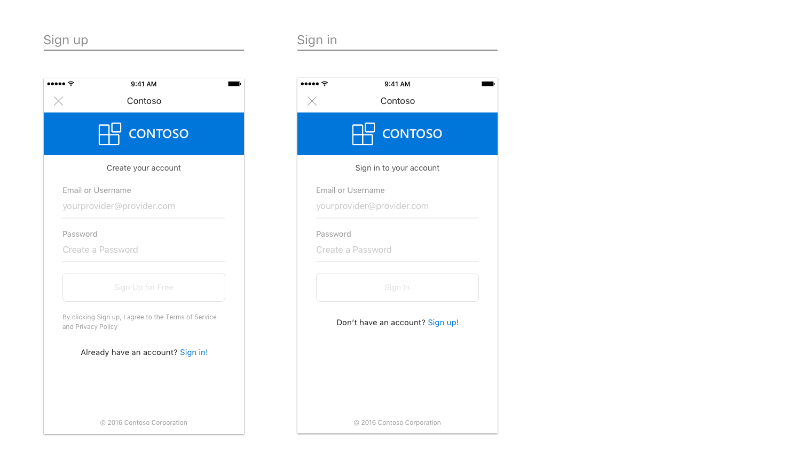
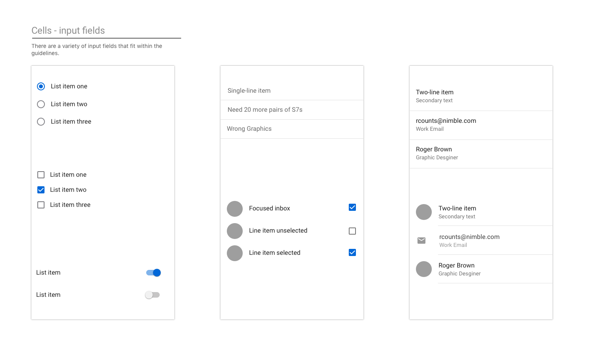
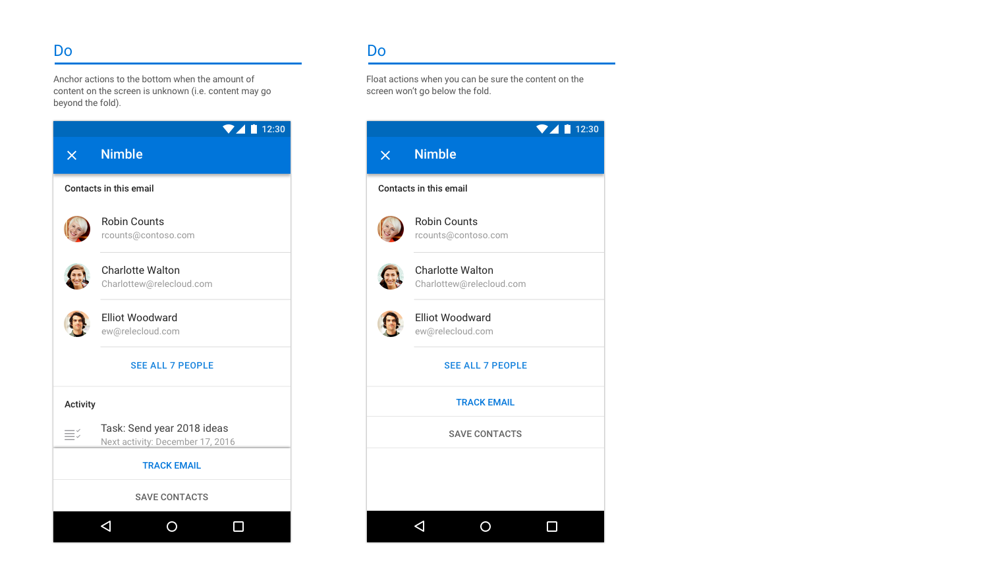
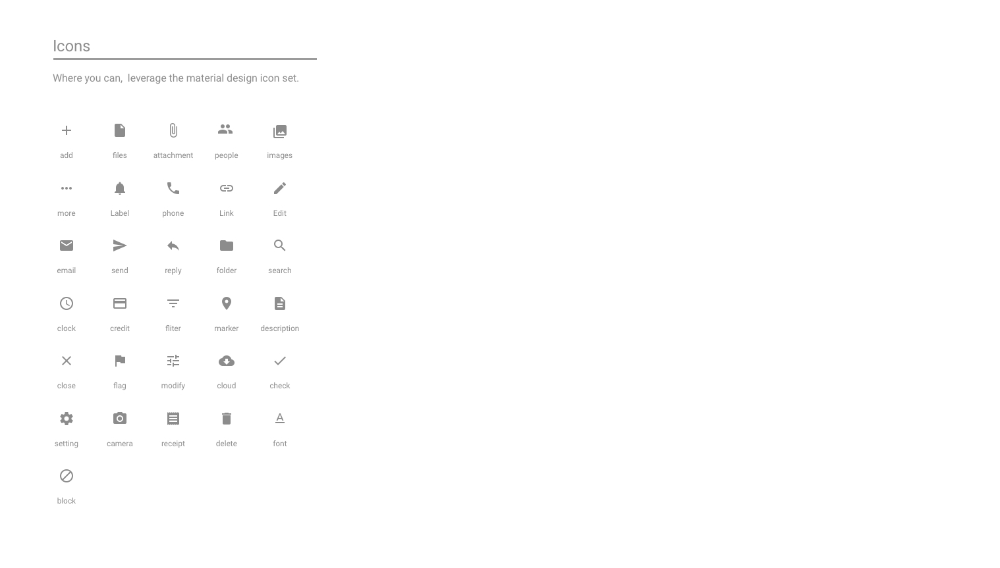
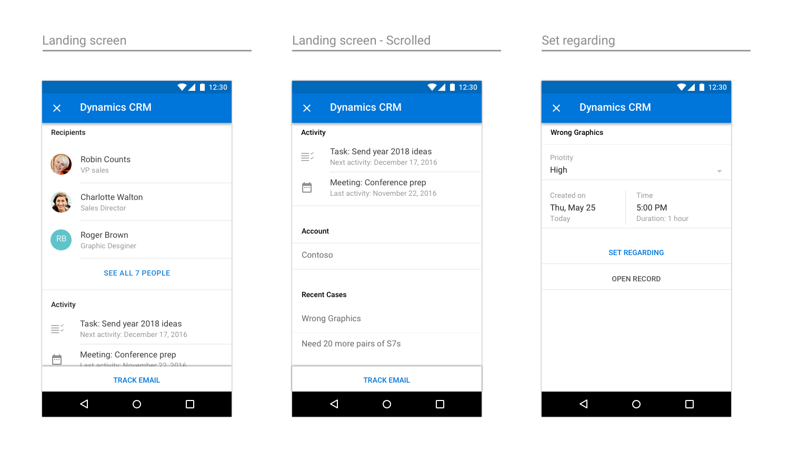

# Outlook アドインの設計ガイドラインOutlook add-in design guidelines

アドインは、パートナーが、コア機能セットを超えて Outlook の機能を拡張する優れた手段になります。アドインを使用すると、ユーザーは受信トレイから移動することなく、サード パーティのエクスペリエンス、タスク、コンテンツを利用できます。Outlook アドインを一度インストールすると、あらゆるプラットフォームとデバイスで使用できます。Add-ins are a great way for partners to extend the functionality of Outlook beyond our core feature set. Add-ins enable users to access third-party experiences, tasks, and content without needing to leave their inbox. Once installed, Outlook add-ins are available on every platform and device.  

以下に示す基本ガイドラインは、Windows、Web、iOS、Mac、Android 上の Outlook にアプリを最適な方法で取り込むための魅力的なアドインを設計、作成するのに役立ちます。The following high-level guidelines will help you design and build a compelling add-in, which brings the best of your app right into Outlook&mdash;on Windows, Web, iOS, Mac, and Android.

## 原則Principles

1. **いくつかの主要なタスクに重点を置き、それらのタスクを適切に実行できるようにする****Focus on a few key tasks; do them well**

   最適な設計が施されたアドインは、ユーザーが簡単に使用でき、目的が明確で、実際の価値をユーザーに提供します。アドインは Outlook 内で実行されるため、この原則にはより重点が置かれています。Outlook は生産性アプリで、ユーザーが作業する場所となります。The best designed add-ins are simple to use, focused, and provide real value to users. Because your add-in will run inside of Outlook, there is additional emphasis placed on this principle. Outlook is a productivity app&mdash;it's where people go to get things done.

   Microsoft が提供するエクスペリエンスを拡張することになるため、Outlook 内において自然な仕方で調和するシナリオにすることが重要となります。一般的なユース ケースについて、電子メールや予定表を使用する際に最もメリットが多いものを注意深く検討します。You will be an extension of our experience and it is important to make sure the scenarios you enable feel like a natural fit inside of Outlook. Think carefully about which of your common use cases will benefit the most from having hooks to them from within our email and calendaring experiences.

   1 つのアドインで、アプリが実行するすべての処理を行おうとしないでください。Outlook コンテンツにおいて最も頻繁に使用し、適切なアクションであることに重点を置く必要があります。アクションのきっかけとなる事柄についてよく考えて、作業ウィンドウが開くときにユーザーが実行すべき事柄を明確にしてください。An add-in should not attempt to do everything your app does. The focus should be on the most frequently used, and appropriate, actions in the context of Outlook content. Think about your call to action and make it clear what the user should do when your task pane opens.

2. **可能な限りネイティブであると感じるようにする****Make it feel as native as possible**

   アドインは、Outlook を実行するプラットフォームにネイティブなパターンを使用して設計する必要があります。そのためには、各プラットフォームで定められている相互作用および視覚に関するガイドラインに従って実装してください。Outlook には独自のガイドラインがあり、それを考慮に入れることも重要です。独自のエクスペリエンス、プラットフォーム、Outlook の 3 つを適切に組み合わせたアドインが、適切に設計されたアドインと言えます。Your add-in should be designed using patterns native to the platform that Outlook is running on. To achieve this, be sure to respect and implement the interaction and visual guidelines set forth by each platform. Outlook has its own guidelines and those are also important to consider. A well-designed add-in will be an appropriate blend of your experience, the platform, and Outlook.

   これは、アドインを Outlook on iOS で実行するときと Outlook on Android で実行するときでは視覚的に異なっている必要があるということです。スタイルの 1 例として「[Framework7](https://framework7.io/)」をご覧になってみてください。This does mean that your add-in will have to visually be different when it runs in Outlook on iOS versus Android. We recommend taking a look at [Framework7](https://framework7.io/) as one option to help you with styling.

3. **楽しく使用できるようにし、詳細な点に気を配る****Make it enjoyable to use and get the details right**

   機能的および視覚的に魅力的な製品は使用していて楽しいものです。すべての相互作用と視覚上の詳細を注意深く考慮してエクスペリエンスを作り上げると、優れたアドインを実現できます。特定のタスクを実行するために必要な手順を明確にし、関連付ける必要があります。すべてのアクションを 1、2 回のクリックだけで実行できるようにすることをお勧めします。People enjoy using products that are both functionally and visually appealing. You can help ensure the success of your add-in by crafting an experience where you've carefully considered every interaction and visual detail. The necessary steps to complete a task must be clear and relevant. Ideally, no action should be further than a click or two away. 
   
   ユーザーが特定のアクションを行うために、実行中の操作を中断することがないようにしてください。Try not to take a user out of context to complete an action. ユーザーは、アドインを簡単に出入りし、作業に戻ることができる必要があります。A user should easily be able to get in and out of your add-in and back to whatever she was doing before. アドインによって、多くの時間が奪われるのではなく、コア機能を拡張することが目的です。An add-in is not meant to be a destination to spend a lot of time in&mdash;it is an enhancement to our core functionality. 適切に設計されたアドインを使用すると、ユーザーの生産性を向上するという目標を達成できます。If done properly, your add-in will help us deliver on the goal of making people more productive.

4. **賢明な方法でブランド化する****Brand wisely**

   ブランド化には大きな価値があり、ユーザーに固有のエクスペリエンスを提供することは重要だと感じています。We value great branding, and we know it is important to provide users with your unique experience. とはいえ、優れたアドインを設計するために最適なのは、さり気ない方法でブランド要素を取り入れて直感的なエクスぺリンスを作り上げる方法です。対照的に、執拗に押しつけがましい方法でブランド要素を表示すると、邪魔されずにシステム内を移動しようとするユーザーの気を散らすことになるだけです。But we feel the best way to ensure your add-in's success is to build an intuitive experience that subtly incorporates elements of your brand versus displaying persistent or obtrusive brand elements that only distract a user from moving through your system in an unencumbered manner. 
    
   ブランドを取り込むための有意義で優れた方法は、ブランドの色、アイコン、音声を使用するというものです (ただし、推奨されるプラットフォーム パターンやユーザー補助機能の要件と競合しないことが前提です)。A good way to incorporate your brand in a meaningful way is through the use of your brand colors, icons, and voice&mdash;assuming these don't conflict with the preferred platform patterns or accessibility requirements. ブランドに注意を向けるよりも、コンテンツやタスクを完了することに重点を置いてください。Strive to keep the focus on content and task completion, not brand attention. 
    
   > [!NOTE]
   >  iOS または Android 上のアドイン内に広告が表示されないようにする必要があります。Ads should not be shown within add-ins on iOS or Android.

## 設計パターンDesign patterns

> [!NOTE]
> 前述の原則はすべてのエンドポイントおよびプラットフォームに適用されますが、以下のパターンと例は iOS プラットフォームのモバイル アドインに固有です。While the above principles apply to all endpoints/platforms, the following patterns and examples are specific to mobile add-ins on the iOS platform.

適切に設計されたアドインを作成できるよう、Outlook Mobile 環境内で動作する iOS モバイル パターンを含む[テンプレート](../design/ux-design-pattern-templates.md)を準備しています。これらの固有のパターンを使用すると、iOS プラットフォームと Outlook Mobile の両方においてネイティブに感じるアドインを作成できます。以下に、これらのパターンの詳細について説明します。これですべてというわけではなく、ライブラリの開始に過ぎません。今後も、これらのアドインに含めるその他のパラダイム パターンを見つけて、作成する予定です。To help you create a well-designed add-in, we have [templates](../design/ux-design-pattern-templates.md) that contain iOS mobile patterns that work within the Outlook Mobile environment. Leveraging these specific patterns will help ensure your add-in feels native to both the iOS platform and Outlook Mobile. These patterns are also detailed below. While not exhaustive, this is the start of a library that we will continue to build upon as we uncover additional paradigms partners wish to include in their add-ins.  

### 概要Overview

標準的なアドインは、次のコンポーネントで構成されます。A typical add-in is made up of the following components.

### 読み込み中Loading

ユーザーがアドインをタップしたら、できるだけ早く UX が表示される必要があります。遅延がある場合、進行状況バーやアクティビティ インジケータを使用します。所要時間が分かる場合には進行状況バーを使用し、分からない場合にはアクティビティ インジケータを使用します。When a user taps on your add-in, the UX should display as quickly as possible. If there is any delay, use a progress bar or activity indicator. A progress bar should be used when the amount of time is determinable and an activity indicator should be used when the amount of time is indeterminable.

**iOS でのページの読み込みの例****An example of loading pages on iOS**

**Android でのページの読み込みの例****An example of loading pages on Android**

### サインイン/サインアップSign in/Sign up

サインイン (およびサインアップ) フローを簡単で使用しやすいものにします。Make your sign in (and sign up) flow straightforward and simple to use.

**iOS のサインイン ページとサインアップ ページの例****An example sign in and sign up page on iOS**

**Android のサインイン ページの例****An example sign in page on Android**

### ブランド バーBrand bar

アドインの最初の画面には、ブランドの構成要素を含める必要があります。ブランド バーは、企業の存在を認識するように設計されているため、ユーザーに背景を説明する際にも役立ちます。ナビゲーション バーには会社/ブランドの名前が含まれているため、後続のページのブランド バーには繰り返して含める必要がありません。The first screen of your add-in should include your branding element. Designed for recognition, the brand bar also helps set context for the user. Because the navigation bar contains the name of your company/brand, it's unnecessary to repeat the brand bar on subsequent pages.

**iOS でのブランド化の例****An example of branding on iOS**

**Android でのブランド化の例****An example of branding on Android**

### 余白Margins

Outlook iOS に合わせるため、モバイルの余白を両側でそれぞれ 15 ピクセル (画面の 8%) に設定します。Outlook Android の場合は、モバイルの余白を両側でそれぞれ 16 ピクセルに設定します。Mobile margins should be set to 15px (8% of screen) for each side, to align with Outlook iOS and 16px for each side to align with Outlook Android.

### 文字体裁Typography

文字体裁の使用法は Outlook iOS に合わせ、スキャンできるようにシンプルにします。Typography usage is aligned to Outlook iOS and is kept simple for scannability.

**iOS の文字体裁****Typography on iOS**

**Android の文字体裁****Typography on Android**

### カラー パレットColor palette

Outlook iOS における色の使用法は明確ではありません。合わせるには、ブランド バーでのみ固有の色を使用して、その他の色の使用に関しては操作とエラーの状態に応じてローカライズするようお願いいたします。Color usage is subtle in Outlook iOS.  To align, we ask that usage of color is localized to actions and error states, with only the brand bar using a unique color.

### セルCells

ナビゲーション バーを使用してページにラベルを付けることはできないため、セクション タイトルを使用してページにラベルを付けます。Since the navigation bar cannot be used to label a page, use section titles to label pages.

**iOS のセルの例****Examples of cells on iOS**

* * *

* * *

* * *

**Android のセルの例****Examples of cells on Android**

* * *

* * *

* * *

### アクションActions

アプリでさまざまなアクションを処理する場合も、アドインで実行する最も重要なアクションについて考慮し、それらに注意を集中します。Even if your app handles a multitude of actions, think about the most important ones you want your add-in to perform, and concentrate on those.

**iOS でのアクションの例****Examples of actions on iOS**

* * *

**Android でのアクションの例****Examples of actions on Android**

* * *

### ボタンButtons

ボタンは、その後に他の UX 要素がある場合に使用します (一方、アクションは画面上における最後の要素です)。Buttons are used when there are other UX elements below (vs. actions, where the action is the last element on the screen).

**iOS のボタンの例****Examples of buttons on iOS**

**Android のボタンの例****Examples of buttons on Android**

### タブTabs

タブを使用すると、コンテンツを整理できます。Tabs can aid in content organization.

**iOS のタブの例****Examples of tabs on iOS**

**Android のタブの例****Examples of tabs on Android**

### アイコンIcons

アイコンに関しては、可能な場合には Outlook iOS の現行デザインに従ってください。当社の標準的なサイズと色を使用します。Icons should follow the current Outlook iOS design when possible. Use our standard size and color.

**iOS のアイコンの例****Examples of icons on iOS**

**Android のアイコンの例****Examples of icons on Android**

## エンド ツー エンドの例End-to-end examples

v1 Outlook Mobile アドインを発表して以降、アドインを作成したパートナーと緊密に連携してきました。Outlook Mobile におけるアドインの効果性を示すため、当社のデザイナーは、当社のガイドラインとパターンを使用して、各アドインのエンド ツー エンド フローをまとめました。For our v1 Outlook Mobile Add-ins launch, we worked closely with our partners who were building add-ins. As a way to showcase the potential of their add-ins on Outlook Mobile, our designer put together end-to-end flows for each add-in, leveraging our guidelines and patterns.

> [!IMPORTANT]
> 次に示す例は、アドインの相互作用と視覚上の設計を行うための理想的な方法を強調するためのもので、出荷バージョンのアドインの機能セットと正確に一致しない場合があります。These examples are meant to highlight the ideal way to approach both the interaction and visual design of an add-in and may not match the exact feature sets in the shipped versions of the add-ins. 

### GIPHYGIPHY

**iOS での GIPHY の例****An example of GIPHY on iOS**

**Android での GIPHY の例****An example of GIPHY on Android**

### NimbleNimble

**iOS での Nimble の例****An example of Nimble on iOS**

**Android での Nimble の例****An example of Nimble on Android**

### TrelloTrello

**iOS での Trello の例****An example of Trello on iOS**

* * *

* * *

**Android での Trello の例****An example of Trello on Android**

* * *

### Dynamics CRMDynamics CRM

**iOS での Dynamics CRM の例****An example of Dynamics CRM on iOS**

**Android での Dynamics CRM の例****An example of Dynamics CRM on Android**

