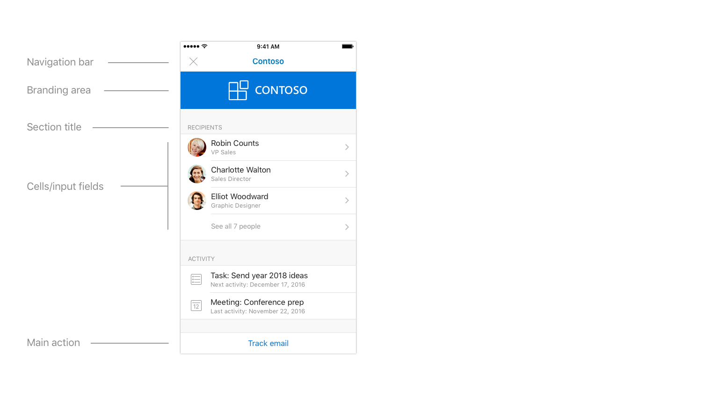
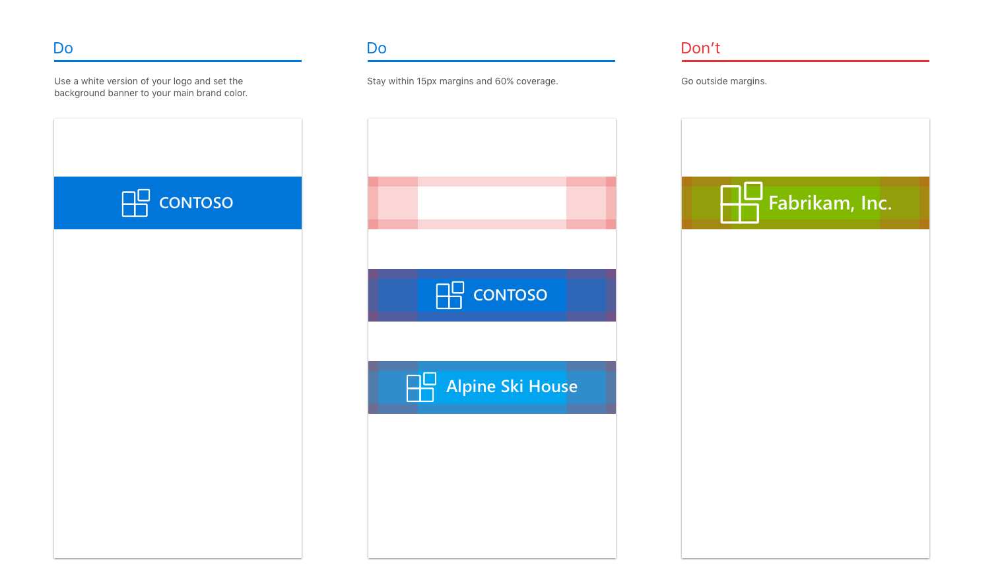
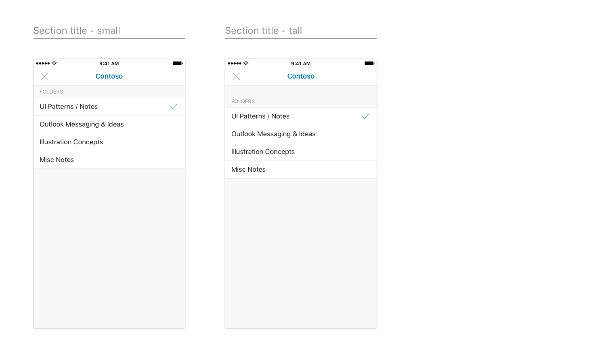
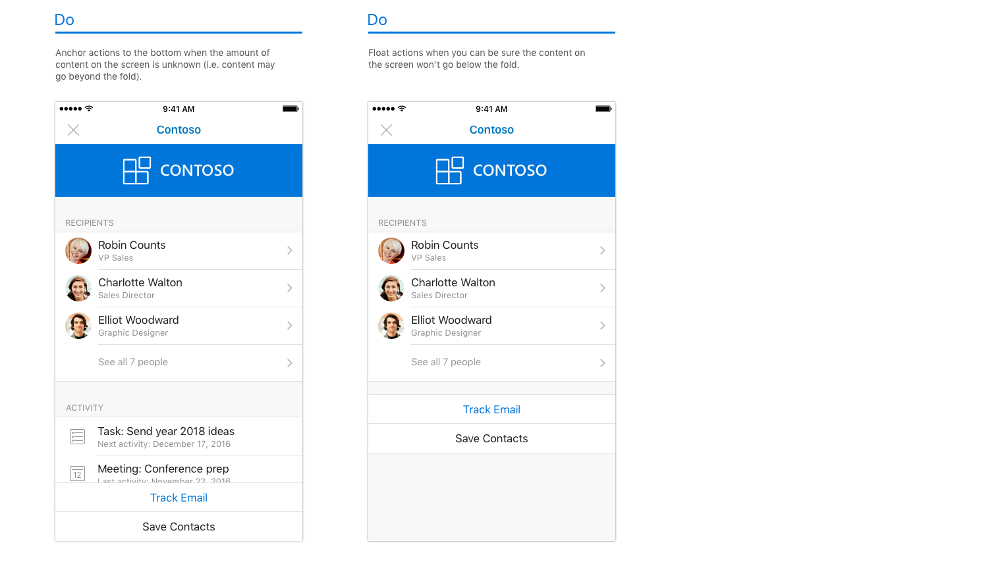
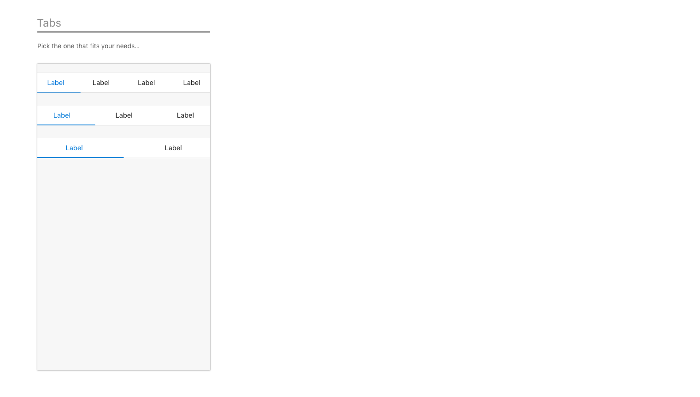

# Outlook アドインの設計ガイドライン

アドインは、パートナーが、コア機能セットを超えて Outlook の機能を拡張する優れた手段になります。アドインを使用すると、ユーザーは受信トレイから移動することなく、外部のエクスペリエンス、タスク、コンテンツを利用できます。Outlook アドインを一度インストールすると、あらゆるプラットフォームとデバイスで使用できます。  

以下に示す基本ガイドラインは、Windows、Web、iOS、Mac、Android 上の Outlook にアプリを最適な方法で取り込むための魅力的なアドインを設計、作成するのに役立ちます。

## 原則

1. **いくつかの主要なタスクに重点を置き、それらのタスクを適切に実行できるようにする**

   最適な設計が施されたアドインは、ユーザーが簡単に使用でき、目的が明確で、実際の価値をユーザーに提供します。アドインは Outlook 内で実行されるため、この原則にはより重点が置かれています。Outlook は生産性アプリで、ユーザーが作業する場所となります。

   Microsoft が提供するエクスペリエンスを拡張することになるため、Outlook 内において自然な仕方で調和するシナリオにすることが重要となります。一般的なユース ケースについて、電子メールや予定表を使用する際に最もメリットが多いものを注意深く検討します。

   1 つのアドインで、アプリが実行するすべての処理を行おうとしないでください。Outlook コンテンツにおいて最も頻繁に使用し、適切なアクションであることに重点を置く必要があります。アクションのきっかけとなる事柄についてよく考えて、作業ウィンドウが開くときにユーザーが実行すべき事柄を明確にしてください。

2. **可能な限りネイティブであると感じるようにする**

   アドインは、Outlook を実行するプラットフォームにネイティブなパターンを使用して設計する必要があります。そのためには、各プラットフォームで定められている相互作用および視覚に関するガイドラインに従って実装してください。Outlook には独自のガイドラインがあり、それを考慮に入れることも重要です。独自のエクスペリエンス、プラットフォーム、Outlook の 3 つを適切に組み合わせたアドインが、適切に設計されたアドインと言えます。

   これは、アドインを Outlook の iOS 版と Android 版で実行するときでは視覚的に異なっている必要があるということです。 

3. **楽しく使用できるようにし、詳細な点に気を配る**

   機能的および視覚的に魅力的な製品は使用していて楽しいものです。すべての相互作用と視覚上の詳細を注意深く考慮してエクスペリエンスを作り上げると、優れたアドインを実現できます。特定のタスクを実行するために必要な手順を明確にし、関連付ける必要があります。すべてのアクションを 1、2 回のクリックだけで実行できるようにすることをお勧めします。 
   
   ユーザーが実行中の操作を中断せずにアクションを完了するようにしてください。ユーザーは、アドインに簡単に出入りでき、以前の作業に戻ることができる必要があります。アドインは、多くの時間が奪われるのではなく、&mdash;コア機能を拡張することが目的です。適切に設計されたアドインを使用すると、ユーザーの生産性を向上するという目標を達成できます。

4. **賢明な方法でブランド化する**

   ブランド化には大きな価値があり、ユーザーに固有のエクスペリエンスを提供することは重要だと感じています。とはいえ、優れたアドインを設計するために最適なのは、さり気ない方法でブランド要素を取り入れて直感的なエクスぺリンスを作り上げる方法です。対照的に、執拗に押しつけがましい方法でブランド要素を表示すると、邪魔されずにシステム内を移動しようとするユーザーの気を散らすことになるだけです。 
    
   ブランドを取り込むための有意義で優れた方法は、ブランドの色、アイコン、音声を使用するというものです&mdash;ただし、推奨されるプラットフォーム パターンやユーザー補助機能の要件と競合しないことが前提です。ブランドに注意を向けるよりも、コンテンツやタスクを完了することに重点を置いてください。 
    
   > [!NOTE]
   >  iOS または Android 上のアドイン内に広告が表示されないようにする必要があります。

## 設計パターン

> [!NOTE]
> 前述の原則はすべてのエンドポイントおよびプラットフォームに適用されますが、以下のパターンと例は iOS プラットフォームのモバイル アドインに固有です。

適切に設計されたアドインを作成できるよう、Outlook Mobile 環境内で動作する iOS モバイル パターンを含む[テンプレート](../design/ux-design-pattern-templates.md)を準備しています。これらの固有のパターンを使用すると、iOS プラットフォームと Outlook Mobile の両方においてネイティブに感じるアドインを作成できます。以下に、これらのパターンの詳細について説明します。これですべてというわけではなく、ライブラリの開始に過ぎません。今後も、これらのアドインに含めるその他のパラダイム パターンを見つけて、作成する予定です。  

### 概要

標準的なアドインは、次のコンポーネントで構成されます。

### 読み込み中

ユーザーがアドインをタップしたら、できるだけ早く UX が表示される必要があります。遅延がある場合、進行状況バーやアクティビティ インジケータを使用します。所要時間が分かる場合には進行状況バーを使用し、分からない場合にはアクティビティ インジケータを使用します。

**iOS でのページの読み込みの例**

**Android でのページの読み込みの例**

### サインイン/サインアップ

サインイン (およびサインアップ) フローを簡単で使用しやすいものにします。

**iOS のサインイン ページとサインアップ ページの例**

**Android のサインイン ページの例**

### ブランド バー

アドインの最初の画面には、ブランドの構成要素を含める必要があります。ブランド バーは、企業の存在を認識するように設計されているため、ユーザーに背景を説明する際にも役立ちます。ナビゲーション バーには会社/ブランドの名前が含まれているため、後続のページのブランド バーには繰り返して含める必要がありません。

**iOS でのブランド化の例**

**Android でのブランド化の例**

### 余白

Outlook iOS に合わせるため、モバイルの余白を両側でそれぞれ 15 ピクセル (画面の 8%) に設定します。Outlook Android の場合は、モバイルの余白を両側でそれぞれ 16 ピクセルに設定します。

### 文字体裁

文字体裁の使用法は Outlook iOS に合わせ、スキャンできるようにシンプルにします。

**iOS の文字体裁**

**Android の文字体裁**

### カラー パレット

Outlook iOS における色の使用法は明確ではありません。合わせるには、ブランド バーでのみ固有の色を使用して、その他の色の使用に関しては操作とエラーの状態に応じてローカライズするようお願いいたします。

### セル

ナビゲーション バーを使用してページにラベルを付けることはできないため、セクション タイトルを使用してページにラベルを付けます。

**iOS のセルの例**

* * *

* * *

* * *

**Android のセルの例**

* * *

* * *

* * *

### アクション

アプリでさまざまなアクションを処理する場合も、アドインで実行する最も重要なアクションについて考慮し、それらに注意を集中します。

**iOS でのアクションの例**

* * *

**Android でのアクションの例**

* * *

### ボタン

ボタンは、その後に他の UX 要素がある場合に使用します (一方、アクションは画面上における最後の要素です)。

**iOS のボタンの例**

**Android のボタンの例**

### タブ

タブを使用すると、コンテンツを整理できます。

**iOS のタブの例**

**Android のタブの例**

### アイコン

アイコンに関しては、可能な場合には Outlook iOS の現行デザインに従ってください。当社の標準的なサイズと色を使用します。

**iOS のアイコンの例**

**Android のアイコンの例**

## エンド ツー エンドの例

v1 Outlook Mobile アドインを発表して以降、アドインを作成したパートナーと緊密に連携してきました。Outlook Mobile におけるアドインの効果性を示すため、当社のデザイナーは、当社のガイドラインとパターンを使用して、各アドインのエンド ツー エンド フローをまとめました。

> [!IMPORTANT]
> 次に示す例は、アドインの相互作用と視覚上の設計を行うための理想的な方法を強調するためのもので、出荷バージョンのアドインの機能セットと正確に一致しない場合があります。 

### GIPHY

**iOS での GIPHY の例**

**Android での GIPHY の例**

### Nimble

**iOS での Nimble の例**

**Android での Nimble の例**

### Trello

**iOS での Trello の例**

* * *

* * *

**Android での Trello の例**

* * *

### Dynamics CRM

**iOS での Dynamics CRM の例**

**Android での Dynamics CRM の例**

