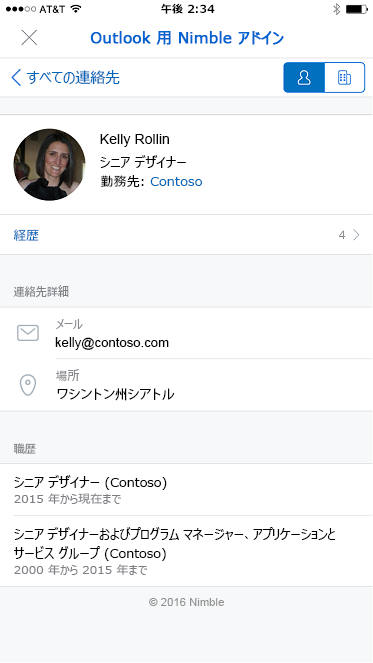
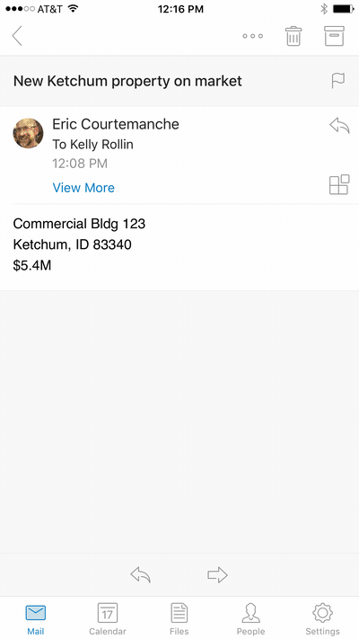
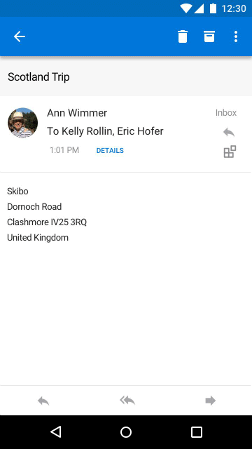

# Outlook Mobile のアドイン

現時点で、アドインは他の Outlook エンドポイントで利用できるものと同じ API を使用して Outlook Mobile で動作します。Outlook 用のアドインを作成済みの場合、簡単に Outlook Mobile で動作するようにできます。

Outlook モバイル アドインは、すべての Microsoft 365 ビジネス アカウントと Outlook.com アカウントでサポートされています。 ただし、現在、Gmail アカウントではサポートを利用できません。

**Outlook on iOS の作業ウィンドウの例**

 

**Outlook on Android の作業ウィンドウの例**

## モバイルにおける違い

- モバイル用の設計において、小さいサイズと迅速な操作性が課題となります。お客様に高品質のエクスペリエンスを提供するため、モバイル サポートを宣言するアドインに対して厳格な検証条件を定めています。AppSource で承認を得るには、この条件を満たす必要があります。
  - アドインは [UI ガイドライン](outlook-addin-design.md)に準拠 **していなければなりません**。
  - アドインのシナリオは、[モバイルに対して適切](#what-makes-a-good-scenario-for-mobile-add-ins)である **必要** があります。

- 一般に、現時点では、メッセージ読み取りモードのみがサポートされています。 つまり、マニフェストの `MobileMessageReadCommandSurface` モバイル セクションで宣言する必要がある唯一の [ExtensionPoint](/javascript/api/manifest/extensionpoint#mobilemessagereadcommandsurface) です。 ただし、いくつかの例外があります。
  1. 予定開催者モードは、 [MobileOnlineMeetingCommandSurface 拡張ポイント](/javascript/api/manifest/extensionpoint#mobileonlinemeetingcommandsurface)を宣言するオンライン会議プロバイダー統合アドインでサポートされています。 このシナリオの詳細については、 [オンライン会議プロバイダーの Outlook モバイル アドインの作成](online-meeting.md) に関する記事を参照してください。
  1. 予定出席者モードは、メモと顧客関係管理 (CRM) アプリケーションのプロバイダーによって作成された統合アドインでサポートされます。 このようなアドインは、代わりに [MobileLogEventAppointmentAttendee 拡張ポイント](/javascript/api/manifest/extensionpoint#mobilelogeventappointmentattendee)を宣言する必要があります。 このシナリオの詳細については、 [Outlook モバイル アドインの外部アプリケーションに対する予定ノートのログ](mobile-log-appointments.md) 記録に関する記事を参照してください。

- [makeEwsRequestAsync](/javascript/api/requirement-sets/outlook/preview-requirement-set/office.context.mailbox#methods) API はモバイルではサポートされていません。モバイル アプリは REST API を使用して、サーバーと通信します。アプリのバックエンドで Exchange サーバーと接続する必要がある場合、コールバック トークンを使用して REST API 呼び出しを行うことができます。詳しくは、「[Outlook アドインからの Outlook REST API の使用](use-rest-api.md)」をご覧ください。

- マニフェストで [MobileFormFactor](/javascript/api/manifest/mobileformfactor) を使用してストアにアドインを送信する場合、iOS のアドインに関する当社の開発者補遺に同意し、確認のため Apple の開発者 ID を送信しなければなりません。

- 最後に、マニフェストで `MobileFormFactor` を宣言し、適切な種類の[コントロール](/javascript/api/manifest/control)と[アイコンのサイズ](/javascript/api/manifest/icon)を含める必要があります。

## モバイル アドインに対して優れたシナリオにするには

電話での Outlook セッションの平均の長さは PC よりも短いことを忘れないでください。つまり、アドインを高速にする必要があります。さらに、シナリオでは、ユーザーの電子メール フローに出入りし、中断せずに続行できるようにする必要もあります。

Outlook Mobile に対して適切なシナリオの例を次に示します。

- アドインを使用すると、貴重な情報を Outlook に伝えることができるため、ユーザーは電子メールをトリアージし、適切に対応できます。例: ユーザーが顧客情報を確認し、適切な情報を共有するための CRM アドイン。

- アドインが、追跡システム、共同作業システム、または類似するシステムに情報を保存して、ユーザーの電子メール コンテンツに価値を追加します。例: ユーザーが電子メールを、プロジェクト進捗管理用にタスク項目に変換したり、サポート チーム用にヘルプ チケットに変換したりするアドイン。

**iOS で電子メール メッセージから Trello カードを作成するユーザーの操作の例**

 

**Android で電子メール メッセージから Trello カードを作成するユーザーの操作の例**

## モバイル上でのアドインのテスト

Outlook Mobile でアドインをテストするには、まずアドインを Microsoft 365 または Web、Windows、または Mac 上の Outlook.com アカウントに [サイドロード](sideload-outlook-add-ins-for-testing.md) します。 マニフェストが適切に書式設定されて含まれている `MobileFormFactor` か、モバイル上の Outlook クライアントに読み込まれないことを確認します。

アドインが動作することを確認したら、携帯電話やタブレットなど、別のサイズの画面でテストします。コンストラストやフォント サイズ、色、さらには VoiceOver (iOS) または TalkBack (Android) などのスクリーン リーダーが使用できることなど、アクセシビリティのガイドラインに従っていることも確認してください。

使い慣れているツールがない可能性があるため、モバイルでのトラブルシューティングは難しい場合があります。 ただし、iOS でのトラブルシューティングの 1 つのオプションは、Fiddler を使用することです ( [iOS デバイスでの使用に関するこのチュートリアルを](https://www.telerik.com/blogs/using-fiddler-with-apple-ios-devices)参照してください)。

> [!NOTE]
> iPhone および Android スマートフォンの最新のOutlook on the webは、Outlook アドインのテストに必要または利用できなくなりました。さらに、アドインは、Outlook on Android、iOS、およびオンプレミスの Exchange アカウントを使用した最新のモバイル Web ではサポートされていません。 一部の iOS デバイスでは、従来のOutlook on the webでオンプレミスの Exchange アカウントを使用する場合でもアドインがサポートされます。 サポートされているブラウザーの詳細については、「[Office アドインを実行するための要件](../concepts/requirements-for-running-office-add-ins.md#client-requirements-non-windows-smartphone-and-tablet)」を参照してください。

## 次の手順

方法はこちら: 

- [モバイル サポートをアドインのマニフェストに追加する](add-mobile-support.md)。
- [アドインで優れたモバイル エクスペリエンスを設計する](outlook-addin-design.md)。
- アドインから[アクセス トークンを取得し、Outlook REST API を呼び出す](use-rest-api.md)。
