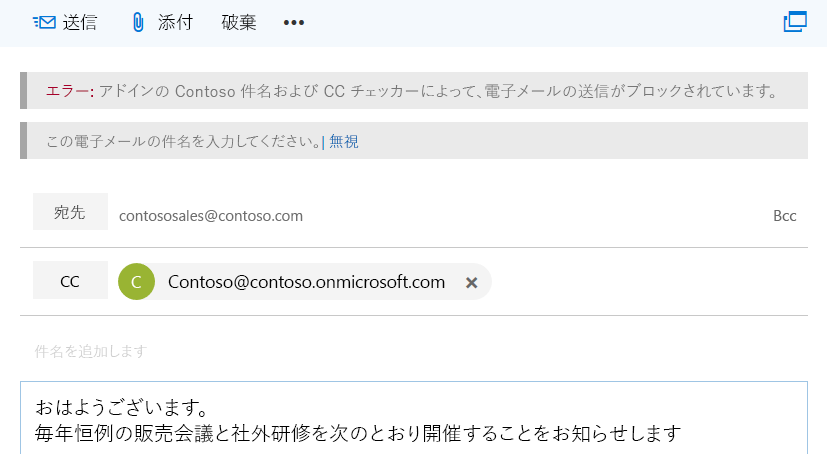
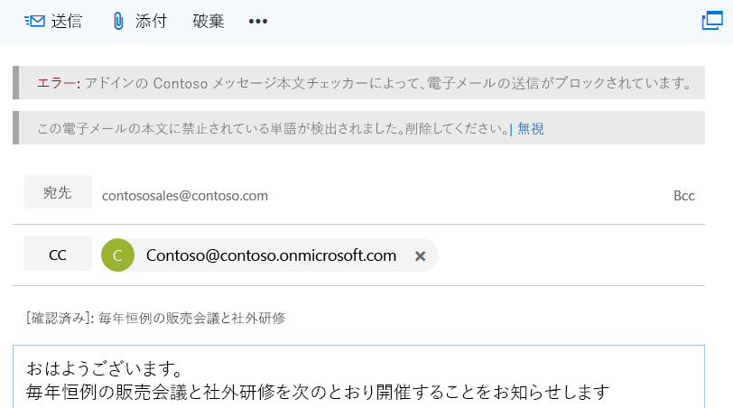

# <a name="on-send-feature-for-outlook-add-ins"></a>Outlook アドインの送信時機能

Outlook アドインの送信時機能は、メッセージまたは会議アイテムを処理する方法、またはユーザーが特定のアクションを実行できないようにする方法を提供し、送信時にアドインが特定のプロパティを設定できるようにします。たとえば、送信時機能を使用すると次のことが可能です。

- ユーザーが機密情報を送信したり、件名を空白にしたままにしないようにする。  
- 特定の受信者をメッセージの CC 行または会議の任意の受信者行に追加する。

送信時の機能は、`ItemSend` イベントの種類によってトリガーされ、UI はありません。

送信時機能に関連する制限事項の詳細については、この記事で後述する「[制限事項](#limitations)」を参照してください。

## <a name="supported-clients-and-platforms"></a>サポートされているクライアントとプラットフォーム

次の表は、必要最小限の累積更新プログラム (該当する場合) など、送信時機能でサポートされているクライアントとサーバーの組み合わせを示しています。 除外された組み合わせはサポートされていません。

| クライアント | Exchange Online | Exchange 2016 オンプレミス<br>(累積的な更新プログラム 6 以降) | Exchange 2019 オンプレミス<br>(累積的な更新プログラム 1 以降) |
|---|:---:|:---:|:---:|
|Windows:<br>バージョン 1910 (ビルド 12130.20272) 以降|はい|はい|はい|
|Mac：<br>ビルド 16.47 以降|はい|はい|はい|
|Web ブラウザー:<br>モダン Outlook UI|あり|該当なし|該当なし|
|Web ブラウザー:<br>クラシック Outlook UI|該当なし|はい|はい|

> [!NOTE]
> 送信時機能は、要件セット 1.8 で正式にリリースされました (詳細については [、現在のサーバーとクライアントのサポート](/javascript/api/requirement-sets/outlook/outlook-api-requirement-sets#requirement-sets-supported-by-exchange-servers-and-outlook-clients) を参照してください)。 ただし、この機能のサポート マトリックスは要件セットのスーパーセットであることに注意してください。

> [!IMPORTANT]
> [AppSource](https://appsource.microsoft.com) では、送信時機能を使用するアドインは許可されません。

## <a name="how-does-the-on-send-feature-work"></a>送信時機能のしくみ

送信時機能を使用して、`ItemSend` 同期イベントを統合する Outlook アドインをビルドできます。 このイベントは、ユーザーが [**送信**] ボタン (または、既存の会議の場合は [**変更内容を送信**] ボタン) を押していることを検出し、検証が失敗した場合はアイテムの送信をブロックするために使用できます。 たとえば、ユーザーがメッセージ送信イベントをトリガーすると、送信時機能を使用する Outlook アドインでは次のことが可能です。

- 電子メール メッセージの内容を読み取り、検証します。
- メッセージに件名行が含まれていることを確認します。
- あらかじめ決められた受信者を設定します。

送信イベントがトリガーされたときにOutlookクライアント側で検証が行われ、アドインがタイムアウトするまでに最大 5 分かかります。検証に失敗すると、アイテムの送信がブロックされ、ユーザーにアクションの実行を求めるエラー メッセージが情報バーに表示されます。

> [!NOTE]
> Outlook on the webでは、Outlook ブラウザー タブ内で構成されているメッセージで送信中の機能がトリガーされると、検証やその他の処理を完了するために、アイテムが独自のブラウザー ウィンドウまたはタブにポップアップ表示されます。

次のスクリーンショットは、送信者に件名を追加するように通知する情報バーを示しています。



次のスクリーンショットは、送信者に禁止された単語が見つかったことを通知する情報バーを示しています。



## <a name="limitations"></a>制限事項

現在、送信時機能には次の制限事項があります。

- **送信時の追加** 機能 &ndash; 送信ハンドラーで [item.body.AppendOnSendAsync](/javascript/api/outlook/office.body?view=outlook-js-1.9&preserve-view=true#outlook-office-body-appendonsendasync-member(1)) を呼び出すと、エラーが返されます。
- **AppSource** &ndash; 送信時機能を使用する Outlook アドインは AppSource の検証で失敗するため、[AppSource](https://appsource.microsoft.com) に発行することはできません。 送信時機能を使用するアドインは、管理者が展開する必要があります。
- **マニフェスト** &ndash; 1 つのアドインに対して 1 つの `ItemSend` イベントのみがサポートされています。 マニフェストに 2 つ以上の `ItemSend` イベントがある場合、マニフェストの検証は失敗します。
- **パフォーマンス** &ndash; アドインをホストする Web サーバーへの複数回のラウンドトリップは、アドインのパフォーマンスに影響する可能性があります。複数のメッセージ ベースまたは会議ベースの操作が必要なアドインを作成する場合は、パフォーマンスへの影響を考慮してください。
- **後で送信** (Mac のみ) &ndash; 送信時アドインがある場合、**後で送信** 機能は使用できません。

また、イベントの完了後にアイテムを閉じるのが自動的に行われるので、送信時イベント ハンドラーを呼び出 `item.close()` すのはお勧めしません。

### <a name="mailbox-typemode-limitations"></a>メールボックスの種類とモードの制限事項

送信時機能は Outlook on the web、Windows、Mac のユーザー メールボックスでのみサポートされます。 Outlook アドインの概要ページの [メールボックス[アイテム](outlook-add-ins-overview.md#mailbox-items-available-to-add-ins)] セクションで説明されているようにアドインがアクティブ化されない状況に加えて、この機能は現在、オフライン モードでサポートされていません。このモードは使用できます。

Outlook アドインがアクティブ化されない場合、送信時アドインは実行されず、メッセージが送信されます。

ただし、送信中の機能が有効で使用可能で、メールボックスのシナリオがサポートされていない場合、Outlook送信は許可されません。

## <a name="multiple-on-send-add-ins"></a>複数の送信時アドイン

複数の送信時アドインをインストールすると、アドインは API の `getAppManifestCall` または `getExtensibilityContext` から受信した順序で実行されます。 最初のアドインが送信を許可している場合、2 番目のアドインは最初のアドインが送信をブロックするように変更できます。 ただし、インストールされているすべてのアドインが送信を許可している場合、最初のアドインは再度実行されません。

たとえば、アドイン 1 とアドイン 2 は両方とも送信時機能を使用しているとします。 最初にアドイン 1 がインストールされ、アドイン 2 は 2 番目にインストールされます。 アドイン 1 は、アドインが送信を許可する条件として、Fabrikam という単語がメッセージに表示されることを確認します。  ただし、アドイン 2 は Fabrikam という単語のすべての出現箇所を削除します。 メッセージは、Fabrikam のすべてのインスタンスが削除されて送信されます (アドイン 1 とアドイン 2 のインストール順序のため)。

## <a name="deploy-outlook-add-ins-that-use-on-send"></a>送信時機能を使用する Outlook アドインを展開する

管理者には送信時機能を使用する Outlook アドインを展開することをお勧めします。 管理者は、送信時アドインを必ず次のようにする必要があります。

- 作成項目が (電子メール、新規作成、返信、転送のために) 開かれるたびに常に存在する。
- ユーザーが閉じたり無効にしたりできない。

## <a name="install-outlook-add-ins-that-use-on-send"></a>送信時機能を使用する Outlook アドインをインストールする

Outlook の送信時機能では、送信イベントの種類に対してアドインが構成されている必要があります。 構成するプラットフォームを選択します。

### <a name="web-browser---classic-outlook"></a>[Web ブラウザー - クラシック Outlook](#tab/classic)

送信時機能を使用する Outlook on the web (クラシック) のアドインは、*OnSendAddinsEnabled* フラグが **true** に設定された Outlook on the web メールボックス ポリシーが割り当てられているユーザーに対して実行されます。

新しいアドインをインストールするには、次の Exchange Online PowerShell コマンドレットを実行します。

```powershell
$Data=Get-Content -Path '.\Contoso Message Body Checker.xml' -Encoding Byte –ReadCount 0
```

```powershell
New-App -OrganizationApp -FileData $Data -DefaultStateForUser Enabled
```

> [!NOTE]
> リモート PowerShell を使用して Exchange Online に接続する方法については、「[Exchange Online PowerShell への接続](/powershell/exchange/exchange-online/connect-to-exchange-online-powershell/connect-to-exchange-online-powershell)」を参照してください。

#### <a name="enable-the-on-send-feature"></a>送信時機能を有効にする

既定では、送信時機能は無効になっています。 管理者は、Exchange Online PowerShell コマンドレットを実行して、送信時機能を有効にできます。

すべてのユーザーに対して送信時アドインを有効にするには、次のようにします。

1. 新しい Outlook on the web のメールボックス ポリシーを作成します。

   ```powershell
    New-OWAMailboxPolicy OWAOnSendAddinAllUserPolicy
   ```

    > [!NOTE]
    > 管理者は既存のポリシーを使用できますが、送信時機能は特定のメールボックスの種類でのみサポートされています。 サポートされていないメールボックスは、Outlook on the web では既定で送信がブロックされます。

2. 送信時機能を有効にする

   ```powershell
    Get-OWAMailboxPolicy OWAOnSendAddinAllUserPolicy | Set-OWAMailboxPolicy –OnSendAddinsEnabled:$true
   ```

3. ポリシーをユーザーに割り当てます。

   ```powershell
    Get-User -Filter {RecipientTypeDetails -eq 'UserMailbox'}|Set-CASMailbox -OwaMailboxPolicy OWAOnSendAddinAllUserPolicy
   ```

#### <a name="enable-the-on-send-feature-for-a-group-of-users"></a>ユーザーのグループに対する送信時機能を有効にする

ユーザーの特定のグループに対して送信時機能を有効にするための手順は次のとおりです。  この例では、管理者は、財務担当ユーザーの環境 (財務担当ユーザーが財務部門にいる) の Outlook on the web 送信時アドイン機能のみを有効にする必要があります。

1. グループ用の新しい Outlook on the web のメールボックス ポリシーを作成します。

   ```powershell
    New-OWAMailboxPolicy FinanceOWAPolicy
   ```

   > [!NOTE]
   > 管理者は既存のポリシーを使用できますが、送信時機能は特定のメールボックスの種類でのみサポートされています (詳細については、この記事で前述した「[メールボックスの種類の制限事項](#multiple-on-send-add-ins)」を参照してください)。 サポートされていないメールボックスは、Outlook on the web では既定で送信がブロックされます。

2. 送信時機能を有効にする

   ```powershell
    Get-OWAMailboxPolicy FinanceOWAPolicy | Set-OWAMailboxPolicy –OnSendAddinsEnabled:$true
   ```

3. ポリシーをユーザーに割り当てます。

   ```powershell
    $targetUsers = Get-Group 'Finance'|select -ExpandProperty members
    $targetUsers | Get-User -Filter {RecipientTypeDetails -eq 'UserMailbox'}|Set-CASMailbox -OwaMailboxPolicy FinanceOWAPolicy
   ```

> [!NOTE]
> ポリシーが有効になるまで最大 60 分待つか、インターネット インフォメーション サービス (IIS) を再起動します。 ポリシーが有効になると、グループの送信時機能が有効になります。

#### <a name="disable-the-on-send-feature"></a>送信時機能を無効にする

ユーザーに対して送信時機能を無効にする、またはフラグを有効にしていない Outlook on the web のメールボックス ポリシーを割り当てるには、次のコマンドレットを実行します。 この例では、メールボックス ポリシーは *ContosoCorpOWAPolicy* です。

```powershell
Get-CASMailbox joe@contoso.com | Set-CASMailbox –OWAMailboxPolicy "ContosoCorpOWAPolicy"
```

> [!NOTE]
> **Set-OwaMailboxPolicy** コマンドレットを使用して、既存の Outlook on the web メールボックス ポリシーを構成する方法の詳細については、「[Set-OwaMailboxPolicy](/powershell/module/exchange/client-access/Set-OwaMailboxPolicy)」を参照してください。

特定の Outlook on the web のメールボックス ポリシーが割り当てられているすべてのユーザーに対して送信時機能を無効にするには、次のコマンドレットを実行します。

```powershell
Get-OWAMailboxPolicy OWAOnSendAddinAllUserPolicy | Set-OWAMailboxPolicy –OnSendAddinsEnabled:$false
```

### <a name="web-browser---modern-outlook"></a>[Web ブラウザー - モダン Outlook](#tab/modern)

送信時機能を使用する Outlook on the web (モダン) のアドインは、インストールされているすべてのユーザーに対して実行されます。 ただし、ユーザーがコンプライアンス標準を満たすために送信時アドインを実行する必要がある場合は、メールボックス ポリシーに *OnSendAddinsEnabled* フラグを設定して `true` 、アドインが送信時に処理中にアイテムを編集できないようにする必要があります。

新しいアドインをインストールするには、次の Exchange Online PowerShell コマンドレットを実行します。

```powershell
$Data=Get-Content -Path '.\Contoso Message Body Checker.xml' -Encoding Byte –ReadCount 0
```

```powershell
New-App -OrganizationApp -FileData $Data -DefaultStateForUser Enabled
```

> [!NOTE]
> リモート PowerShell を使用して Exchange Online に接続する方法については、「[Exchange Online PowerShell への接続](/powershell/exchange/exchange-online/connect-to-exchange-online-powershell/connect-to-exchange-online-powershell)」を参照してください。

#### <a name="enable-the-on-send-flag"></a>送信フラグを有効にする

管理者は、Exchange Online PowerShell コマンドレットを実行することで、送信時のコンプライアンスを適用できます。

すべてのユーザーに対して、送信中のアドインの処理中に編集を禁止します。

1. 新しい Outlook on the web のメールボックス ポリシーを作成します。

   ```powershell
    New-OWAMailboxPolicy OWAOnSendAddinAllUserPolicy
   ```

    > [!NOTE]
    > 管理者は既存のポリシーを使用できますが、送信時機能は特定のメールボックスの種類でのみサポートされています。 サポートされていないメールボックスは、Outlook on the web では既定で送信がブロックされます。

2. 送信時にコンプライアンスを適用します。

   ```powershell
    Get-OWAMailboxPolicy OWAOnSendAddinAllUserPolicy | Set-OWAMailboxPolicy –OnSendAddinsEnabled:$true
   ```

3. ポリシーをユーザーに割り当てます。

   ```powershell
    Get-User -Filter {RecipientTypeDetails -eq 'UserMailbox'}|Set-CASMailbox -OwaMailboxPolicy OWAOnSendAddinAllUserPolicy
   ```

#### <a name="turn-on-the-on-send-flag-for-a-group-of-users"></a>ユーザーのグループの送信時フラグをオンにする

特定のユーザー グループに対して送信時コンプライアンスを適用するには、次の手順を実行します。 この例では、管理者は、財務担当ユーザーの環境 (財務担当ユーザーが財務部門にいる) の Outlook on the web 送信時アドイン ポリシーのみを有効にする必要があります。

1. グループ用の新しい Outlook on the web のメールボックス ポリシーを作成します。

   ```powershell
    New-OWAMailboxPolicy FinanceOWAPolicy
   ```

   > [!NOTE]
   > 管理者は既存のポリシーを使用できますが、送信時機能は特定のメールボックスの種類でのみサポートされています (詳細については、この記事で前述した「[メールボックスの種類の制限事項](#multiple-on-send-add-ins)」を参照してください)。 サポートされていないメールボックスは、Outlook on the web では既定で送信がブロックされます。

2. 送信時にコンプライアンスを適用します。

   ```powershell
    Get-OWAMailboxPolicy FinanceOWAPolicy | Set-OWAMailboxPolicy –OnSendAddinsEnabled:$true
   ```

3. ポリシーをユーザーに割り当てます。

   ```powershell
    $targetUsers = Get-Group 'Finance'|select -ExpandProperty members
    $targetUsers | Get-User -Filter {RecipientTypeDetails -eq 'UserMailbox'}|Set-CASMailbox -OwaMailboxPolicy FinanceOWAPolicy
   ```

> [!NOTE]
> ポリシーが有効になるまで最大 60 分待つか、インターネット インフォメーション サービス (IIS) を再起動します。 ポリシーが有効になると、グループに対して送信時のコンプライアンスが適用されます。

#### <a name="turn-off-the-on-send-flag"></a>送信時フラグをオフにする

ユーザーの送信時コンプライアンスの適用を無効にするには、次のコマンドレットを実行してフラグが有効になっていないOutlook on the web メールボックス ポリシーを割り当てます。 この例では、メールボックス ポリシーは *ContosoCorpOWAPolicy* です。

```powershell
Get-CASMailbox joe@contoso.com | Set-CASMailbox –OWAMailboxPolicy "ContosoCorpOWAPolicy"
```

> [!NOTE]
> **Set-OwaMailboxPolicy** コマンドレットを使用して、既存の Outlook on the web メールボックス ポリシーを構成する方法の詳細については、「[Set-OwaMailboxPolicy](/powershell/module/exchange/client-access/Set-OwaMailboxPolicy)」を参照してください。

特定のOutlook on the webメールボックス ポリシーが割り当てられているすべてのユーザーに対して送信時コンプライアンスの適用を無効にするには、次のコマンドレットを実行します。

```powershell
Get-OWAMailboxPolicy OWAOnSendAddinAllUserPolicy | Set-OWAMailboxPolicy –OnSendAddinsEnabled:$false
```

### <a name="windows"></a>[Windows](#tab/windows)

送信時機能を使用する Outlook on Windows のアドインは、インストールされているすべてのユーザーに対して実行されます。 ただし、ユーザーがコンプライアンス標準を満たすためにアドインを実行する必要がある場合は、該当する各コンピューターで **Web アドインを読み込むことができない場合は、グループ ポリシーの [ブロック送信****] を [有効]** に設定する必要があります。

メールボックス ポリシーを設定するには、管理者は [管理用テンプレート ツール](https://www.microsoft.com/download/details.aspx?id=49030)をダウンロードし、ローカル グループ ポリシー エディター **gpedit.msc** を実行して最新の管理用テンプレートにアクセスできます。

> [!NOTE]
> 以前のバージョンの管理用テンプレート ツールでは、ポリシー名は **Web 拡張機能を読み込むことができない場合に送信を無効に** しました。 必要に応じて、後の手順でこの名前を置き換えます。

#### <a name="what-the-policy-does"></a>ポリシーの内容

コンプライアンスのために、管理者は、最新の送信時アドインを実行できるようになるまでユーザーがメッセージまたは会議アイテムを送信できないようにする必要があります。 管理者は、すべてのアドインがExchangeから更新され、各メッセージまたは会議アイテムが送信時に予想されるルールと規制を満たしていることを確認するために使用できるように、Web アドインを **読み込むことができない場合** にグループ ポリシーの送信をブロックする必要があります。

|ポリシーの状態|結果|
|---|---|
|無効|送信中のメッセージまたは会議アイテムに対して、現在ダウンロードされている送信時アドインのマニフェスト (必ずしも最新バージョンとは限りません) が実行されます。 これが既定の状態/動作です。|
|Enabled|送信中のアドインの最新のマニフェストがExchangeからダウンロードされると、アドインは送信されるメッセージまたは会議アイテムで実行されます。 それ以外の場合、送信はブロックされます。|

#### <a name="manage-the-on-send-policy"></a>送信時ポリシーを管理する

既定では、送信時ポリシーは無効になっています。 管理者は、ユーザーのグループ ポリシー設定 [ **Web アドインを読み込むことができない場合に送信をブロック** する] が **[有効]** に設定されていることを確認することで、送信ポリシーを有効にすることができます。 ユーザーのポリシーを無効にするには、管理者が [**無効**] に設定する必要があります。 このポリシー設定を管理するには、次の操作を行います。

1. 最新の[管理用テンプレートツール](https://www.microsoft.com/download/details.aspx?id=49030)をダウンロードします。
1. ローカル グループ ポリシー エディター (**gpedit.msc**) を開きます。
1. **User** **ConfigurationAdministrative** >  **TemplatesMicrosoft**  >  Outlook 2016  > **SecurityTrust** >  Center に移動 **します**。
1. **[Web アドインが読み込むことができない場合に送信をブロック** する] 設定を選択します。
1. リンクを開いてポリシー設定を編集します。
1. [**Web アドインが読み込むことができない場合に送信をブロック** する] ダイアログ ウィンドウで、必要に応じて [**有効]** または **[無効]** を選択し、[**OK] または [適用] を** 選択して更新を有効にします。

### <a name="mac"></a>[Mac](#tab/unix)

送信時機能を使用する Outlook on Mac のアドインは、インストールされているすべてのユーザーに対して実行されます。 ただし、コンプライアンス基準を満たすためにアドインを実行する必要がある場合は、ユーザーの各マシンで次のメールボックス ポリシーを適用する必要があります。 この設定またはキーは、CFPreferences と互換性があります。つまり、Jamf Pro などの Mac のエンタープライズ管理ソフトウェアを使用して設定することができます。

||値|
|:---|:---|
|**ドメイン**|com.microsoft.outlook|
|**キー**|OnSendAddinsWaitForLoad|
|**DataType**|Boolean|
|**指定可能な値**|false (既定)<br>true|
|**可用性**|16.27|
|**コメント**|このキーは、送信時メールボックス ポリシーを作成します。|

#### <a name="what-the-setting-does"></a>設定内容

コンプライアンスのために、管理者は、最新の送信時アドインを実行できるようになるまでユーザーがメッセージまたは会議アイテムを送信できないようにする必要があります。 管理者は、キー **OnSendAddinsWaitForLoad** を有効にして、すべてのアドインが Exchange から更新されるようにして、各メッセージまたは会議アイテムが予想されるルールおよび規制を送信時に満たしていることを確認します。

|キーの状態|結果|
|---|---|
|false|送信中のメッセージまたは会議アイテムに対して、現在ダウンロードされている送信時アドインのマニフェスト (必ずしも最新バージョンとは限りません) が実行されます。 これは既定の状態/動作です。|
|true|送信中のアドインの最新のマニフェストがExchangeからダウンロードされると、アドインは送信されるメッセージまたは会議アイテムで実行されます。 それ以外の場合、送信はブロックされ、[ **送信]** ボタンは無効になります。|

---

## <a name="on-send-feature-scenarios"></a>送信時機能のシナリオ

送信時機能を使用するアドインのサポートされているシナリオとサポートされていないシナリオは、次のとおりです。

### <a name="user-mailbox-has-the-on-send-add-in-feature-enabled-but-no-add-ins-are-installed"></a>ユーザー メールボックスで送信時アドイン機能が有効になっているが、アドインはインストールされていない

このシナリオでは、ユーザーはアドインを実行せずにメッセージと会議アイテムを送信できます。

### <a name="user-mailbox-has-the-on-send-add-in-feature-enabled-and-add-ins-that-supports-on-send-are-installed-and-enabled"></a>ユーザー メールボックスで送信時アドイン機能が有効になっており、送信時機能をサポートするアドインがインストールされ、有効になっている

アドインは送信イベント中に実行され、ユーザーによる送信を許可またはブロックします。

### <a name="mailbox-delegation-where-mailbox-1-has-full-access-permissions-to-mailbox-2"></a>メールボックス 1 がメールボックス 2 への完全なアクセス許可を持つ、メールボックスの委任

#### <a name="web-browser-classic-outlook"></a>Web ブラウザー (クラシック Outlook)

|シナリオ|メールボックス 1 の送信時機能|メールボックス 2 の送信時機能|Outlook web のセッション (クラシック)|結果|サポートの有無|
|:------------|:------------|:--------------------------|:---------|:-------------|:-------------|
|1|有効|有効|新しいセッション|メールボックス 1 は、メールボックス 2 からのメッセージまたは会議アイテムを送信できません。|現在サポートされていません。回避策として、シナリオ 3 を使用します。|
|2|無効|有効|新しいセッション|メールボックス 1 は、メールボックス 2 からのメッセージまたは会議アイテムを送信できません。|現在サポートされていません。回避策として、シナリオ 3 を使用します。|
|3|有効|有効|同じセッション|メールボックス 1 に割り当てられている送信時アドインが送信時に実行されます。|サポートされています。|
|4|有効|無効|新しいセッション|送信時アドインは実行されません。メッセージまたは会議アイテムは送信されます。|サポートされています。|

#### <a name="web-browser-modern-outlook-windows-mac"></a>Web ブラウザー (モダン Outlook)、Windows、Mac

強制的に送信するには、管理者は両方のメールボックスでポリシーが有効になっていることを確認する必要があります。 アドインでの代理アクセスをサポートする方法については、「 [共有フォルダーと共有メールボックスを有効にするシナリオ」を](delegate-access.md)参照してください。

### <a name="user-mailbox-with-on-send-add-in-featurepolicy-enabled-add-ins-that-support-on-send-are-installed-and-enabled-and-offline-mode-is-enabled"></a>ユーザー メールボックスで送信時アドイン機能/ポリシーが有効になっており、送信時機能をサポートするアドインがインストールされ、有効であり、オフライン モードが有効になっている

送信時アドインは、ユーザー、アドイン バックエンド、および Exchange のオンライン状態に従って実行されます。

#### <a name="users-state"></a>ユーザーの状態

ユーザーがオンラインの場合、送信中に送信時アドインが実行されます。 ユーザーがオフラインの場合、送信中に送信時アドインは実行されず、メッセージまたは会議アイテムは送信されません。

#### <a name="add-in-backends-state"></a>アドイン バックエンドの状態

送信時アドインは、バックエンドがオンラインで接続可能な場合に実行されます。 バックエンドがオフラインの場合、送信は無効です。

#### <a name="exchanges-state"></a>Exchange の状態

Exchange サーバーがオンラインでアクセスできる場合、送信中に送信時アドインが実行されます。 送信時アドインが Exchange に接続できない場合、および該当するポリシーまたはコマンドレットが有効になっている場合、送信は無効です。

> [!NOTE]
> オフライン状態の Mac では [**送信**] ボタン (または、既存の会議の場合は [**変更内容を送信**] ボタン) が無効になっており、ユーザーがオフラインの場合、組織が送信を許可していないという通知が表示されます。

### <a name="user-can-edit-item-while-on-send-add-ins-are-working-on-it"></a>ユーザーは、送信中のアドインの作業中にアイテムを編集できます

送信時アドインがアイテムを処理している間、ユーザーは不適切なテキストや添付ファイルなどを追加してアイテムを編集できます。 アドインが送信時に処理中にユーザーがアイテムを編集できないようにする場合は、ダイアログを使用して回避策を実装できます。 この回避策は、Outlook on the web (クラシック)、Windows、Mac で使用できます。

> [!IMPORTANT]
> モダン Outlook on the web: アドインが送信時に処理中にユーザーがアイテムを編集できないようにするには、この記事の「On-send を使用する`true`[アドインのインストール Outlook」](outlook-on-send-addins.md?tabs=modern#install-outlook-add-ins-that-use-on-send)セクションで説明したように *、OnSendAddinsEnabled* フラグを設定する必要があります。

送信時ハンドラーで次の処理を行います。

1. [displayDialogAsync](/javascript/api/office/office.ui?view=outlook-js-preview&preserve-view=true#office-office-ui-displaydialogasync-member(1)) を呼び出してダイアログを開き、マウスクリックとキーストロークが無効になるようにします。

    > [!IMPORTANT]
    > クラシック Outlook on the webでこの動作を取得するには、呼び出しのパラメーターで [displayInIframe プロパティ](/javascript/api/office/office.dialogoptions?view=outlook-js-preview&preserve-view=true#office-office-dialogoptions-displayiniframe-member)を`options`設定する`true``displayDialogAsync`必要があります。

1. アイテムの処理を実装します。
1. ダイアログを閉じます。 また、ユーザーがダイアログを閉じた場合の処理も行います。

## <a name="code-examples"></a>コード例

次のコード例は、単純な送信時アドインを作成する方法を示しています。 これらの例を基にしたコード サンプルをダウンロードするには、「[Outlook-Add-in-On-Send](https://github.com/OfficeDev/Outlook-Add-in-On-Send)」を参照してください。

> [!TIP]
> 送信イベントと共にダイアログを使用する場合は、イベントを完了する前に必ずダイアログを閉じてください。

### <a name="manifest-version-override-and-event"></a>マニフェスト、バージョンのオーバーライド、イベント

[Outlook-Add-in-On-Send](https://github.com/OfficeDev/Outlook-Add-in-On-Send) コード サンプルには、2 つのマニフェストが含まれています。

- `Contoso Message Body Checker.xml` &ndash; 制限された単語または機密情報についてメッセージの本文を送信時に確認する方法を示します。  

- `Contoso Subject and CC Checker.xml` &ndash; CC 行に受信者を追加し、送信時にメッセージに件名が含まれていることを確認する方法を示します。  

`Contoso Message Body Checker.xml` マニフェスト ファイルには、`ItemSend` イベントで呼び出す必要がある関数ファイルと関数名を含めます。 操作は同期的に実行されます。

```xml
<Hosts>
    <Host xsi:type="MailHost">
        <DesktopFormFactor>
            <!-- The functionfile and function name to call on message send.  -->
            <!-- In this case, the function validateBody will be called within the JavaScript code referenced in residUILessFunctionFileUrl. -->
            <FunctionFile resid="residUILessFunctionFileUrl" />
            <ExtensionPoint xsi:type="Events">
                <Event Type="ItemSend" FunctionExecution="synchronous" FunctionName="validateBody" />
            </ExtensionPoint>
        </DesktopFormFactor>
    </Host>
</Hosts>
```

> [!IMPORTANT]
> Visual Studio 2019 を使用して送信時アドインを開発している場合は、次のような検証警告が表示されることがあります。"これは無効な xsi:type ''http://schemas.microsoft.com/office/mailappversionoverrides/1.1:Eventsです。これを回避するには、[この警告に関するブログ](https://theofficecontext.com/2018/11/29/visual-studio-2017-this-is-an-invalid-xsitype-mailappversionoverrides-1-1event/)でGitHubの要として提供されているMailAppVersionOverridesV1_1.xsd の新しいバージョンが必要になります。

`Contoso Subject and CC Checker.xml` マニフェスト ファイルの場合、次の例では、メッセージ送信イベントで呼び出す関数ファイルと関数名を示します。

```xml
<Hosts>
    <Host xsi:type="MailHost">
        <DesktopFormFactor>
            <!-- The functionfile and function name to call on message send.  -->
            <!-- In this case the function validateSubjectAndCC will be called within the JavaScript code referenced in residUILessFunctionFileUrl. -->
            <FunctionFile resid="residUILessFunctionFileUrl" />
            <ExtensionPoint xsi:type="Events">
                <Event Type="ItemSend" FunctionExecution="synchronous" FunctionName="validateSubjectAndCC" />
            </ExtensionPoint>
        </DesktopFormFactor>
    </Host>
</Hosts>
```

送信時 API には `VersionOverrides v1_1` が必要です。 マニフェストに `VersionOverrides` ノードを追加する方法を次に示します。

```xml
 <VersionOverrides xmlns="http://schemas.microsoft.com/office/mailappversionoverrides" xsi:type="VersionOverridesV1_0">
     <!-- On-send requires VersionOverridesV1_1 -->
     <VersionOverrides xmlns="http://schemas.microsoft.com/office/mailappversionoverrides/1.1" xsi:type="VersionOverridesV1_1">
         ...
     </VersionOverrides>
</VersionOverrides>
```

> [!NOTE]
> 詳細については、以下を参照してください。
>
> - [Outlook アドインのマニフェスト](manifests.md)
> - [Office アドインの XML マニフェスト](../develop/add-in-manifests.md)


### <a name="event-and-item-objects-and-bodygetasync-and-bodysetasync-methods"></a>`Event` オブジェクト、`item` オブジェクトと、`body.getAsync` メソッド、`body.setAsync` メソッドを理解する

現在選択されているメッセージまたは会議アイテム (この例では、新しく作成されたメッセージ) にアクセスするには、`Office.context.mailbox.item` 名前空間を使用します。 `ItemSend` イベントは、送信時機能によってマニフェストで指定された関数に自動的に渡されます &mdash; この例では `validateBody` 関数です。

```js
var mailboxItem;

Office.initialize = function (reason) {
    mailboxItem = Office.context.mailbox.item;
}

// Entry point for Contoso Message Body Checker add-in before send is allowed.
// <param name="event">ItemSend event is automatically passed by on-send code to the function specified in the manifest.</param>
function validateBody(event) {
    mailboxItem.body.getAsync("html", { asyncContext: event }, checkBodyOnlyOnSendCallBack);
}
```

`validateBody` 関数は、指定した形式 (HTML) の現在の本文を取得し、コールバック メソッドでのアクセスにコードが必要とする `ItemSend` イベント オブジェクトを渡します。 `getAsync` メソッドに加え、`Body` オブジェクトは本文を指定したテキストに置き換えるために使用できる `setAsync` メソッドも提供します。

> [!NOTE]
> 詳細については、「[Event オブジェクト](/javascript/api/office/office.addincommands.event)」と「[Body.getAsync](/javascript/api/outlook/office.body#outlook-office-body-getasync-member(1))」を参照してください。
  

### <a name="notificationmessages-object-and-eventcompleted-method"></a>`NotificationMessages` オブジェクトと `event.completed` メソッド

`checkBodyOnlyOnSendCallBack` 関数は、正規表現を使用して、禁止された単語がメッセージの本文に含まれているかどうかを決定します。 制限されている単語の配列に対する一致が検出された場合、電子メールの送信をブロックし、情報バーを使用して送信者に通知します。 これを実行するには、`Item` オブジェクトの `notificationMessages` プロパティを使用して、`NotificationMessages` オブジェクトを返します。 その後、次の例に示すように、`addAsync` メソッドを呼び出して通知をアイテムに追加します。

```js
// Determine whether the body contains a specific set of blocked words. If it contains the blocked words, block email from being sent. Otherwise allow sending.
// <param name="asyncResult">ItemSend event passed from the calling function.</param>
function checkBodyOnlyOnSendCallBack(asyncResult) {
    var listOfBlockedWords = new Array("blockedword", "blockedword1", "blockedword2");
    var wordExpression = listOfBlockedWords.join('|');

    // \b to perform a "whole words only" search using a regular expression in the form of \bword\b.
    // i to perform case-insensitive search.
    var regexCheck = new RegExp('\\b(' + wordExpression + ')\\b', 'i');
    var checkBody = regexCheck.test(asyncResult.value);

    if (checkBody) {
        mailboxItem.notificationMessages.addAsync('NoSend', { type: 'errorMessage', message: 'Blocked words have been found in the body of this email. Please remove them.' });
        // Block send.
        asyncResult.asyncContext.completed({ allowEvent: false });
    }

    // Allow send.
    asyncResult.asyncContext.completed({ allowEvent: true });
}
```

メソッドのパラメーターを次に `addAsync` 示します。

- `NoSend` &ndash; 通知メッセージを参照するための開発者が指定したキーである文字列。 これを使用して後でこのメッセージを変更できます。 キーは 32 文字を超えることはできません。
- `type` &ndash; JSON オブジェクト パラメーターのプロパティの 1 つ。 メッセージの種類を表します。種類は [Office.MailboxEnums.ItemNotificationMessageType](/javascript/api/outlook/office.mailboxenums.itemnotificationmessagetype) 列挙型の値に対応しています。 使用可能な値は、進行状況のインジケーター、情報メッセージ、エラー メッセージです。 この例では、`type` はエラー メッセージです。  
- `message` &ndash; JSON オブジェクト パラメーターのプロパティの 1 つ。 この例では、`message` は通知メッセージのテキストです。

アドインが送信操作によってトリガーされた `ItemSend` イベントの処理を完了したことを通知するには、`event.completed({allowEvent:Boolean})` メソッドを呼び出します。 `allowEvent` プロパティは Boolean です。 `true` に設定されている場合、送信が許可されます。 `false` に設定されている場合、電子メール メッセージの送信がブロックされます。

> [!NOTE]
> 詳細については、「[notificationMessages](/javascript/api/requirement-sets/outlook/preview-requirement-set/office.context.mailbox.item#properties)」と「[completed](/javascript/api/office/office.addincommands.event)」を参照してください。

### <a name="replaceasync-removeasync-and-getallasync-methods"></a>`replaceAsync` メソッド、`removeAsync` メソッド、および`getAllAsync`メソッド

`addAsync` メソッドに加え、`NotificationMessages` オブジェクトは本文を指定したテキストに置き換えるために使用できる `replaceAsync`、`removeAsync`、および `getAllAsync` の各メソッドも提供します。  このコード サンプルでは、これらのメソッドは使用されません。  詳細については、「[NotificationMessages](/javascript/api/outlook/office.notificationmessages)」を参照してください。


### <a name="subject-and-cc-checker-code"></a>件名および CC のチェッカー コード

次のコード例では、CC 行に受信者を追加し、送信時にメッセージに件名が含まれていることを確認する方法を示します。 この例では、送信時機能を使用して、電子メールの送信を許可または禁止します。  

```js
// Invoke by Contoso Subject and CC Checker add-in before send is allowed.
// <param name="event">ItemSend event is automatically passed by on-send code to the function specified in the manifest.</param>
function validateSubjectAndCC(event) {
    shouldChangeSubjectOnSend(event);
}

// Determine whether the subject should be changed. If it is already changed, allow send. Otherwise change it.
// <param name="event">ItemSend event passed from the calling function.</param>
function shouldChangeSubjectOnSend(event) {
    mailboxItem.subject.getAsync(
        { asyncContext: event },
        function (asyncResult) {
            addCCOnSend(asyncResult.asyncContext);
            //console.log(asyncResult.value);
            // Match string.
            var checkSubject = (new RegExp(/\[Checked\]/)).test(asyncResult.value)
            // Add [Checked]: to subject line.
            subject = '[Checked]: ' + asyncResult.value;

            // Determine whether a string is blank, null, or undefined.
            // If yes, block send and display information bar to notify sender to add a subject.
            if (asyncResult.value === null || (/^\s*$/).test(asyncResult.value)) {
                mailboxItem.notificationMessages.addAsync('NoSend', { type: 'errorMessage', message: 'Please enter a subject for this email.' });
                asyncResult.asyncContext.completed({ allowEvent: false });
            }
            else {
                // If can't find a [Checked]: string match in subject, call subjectOnSendChange function.
                if (!checkSubject) {
                    subjectOnSendChange(subject, asyncResult.asyncContext);
                    //console.log(checkSubject);
                }
                else {
                    // Allow send.
                    asyncResult.asyncContext.completed({ allowEvent: true });
                }
            }
        });
}

// Add a CC to the email. In this example, CC contoso@contoso.onmicrosoft.com
// <param name="event">ItemSend event passed from calling function</param>
function addCCOnSend(event) {
    mailboxItem.cc.setAsync(['Contoso@contoso.onmicrosoft.com'], { asyncContext: event });
}

// Determine whether the subject should be changed. If it is already changed, allow send, otherwise change it.
// <param name="subject">Subject to set.</param>
// <param name="event">ItemSend event passed from the calling function.</param>
function subjectOnSendChange(subject, event) {
    mailboxItem.subject.setAsync(
        subject,
        { asyncContext: event },
        function (asyncResult) {
            if (asyncResult.status == Office.AsyncResultStatus.Failed) {
                mailboxItem.notificationMessages.addAsync('NoSend', { type: 'errorMessage', message: 'Unable to set the subject.' });

                // Block send.
                asyncResult.asyncContext.completed({ allowEvent: false });
            }
            else {
                // Allow send.
                asyncResult.asyncContext.completed({ allowEvent: true });
            }
        });
}
```

CC 行に受信者を追加して、送信時にメッセージに件名が含まれていることを確認する方法、および使用可能な API を表示する方法の詳細については、「[Outlook-Add-in-On-Send サンプル](https://github.com/OfficeDev/Outlook-Add-in-On-Send)」を参照してください。コードには詳細なコメントが付けられています。

## <a name="debug-outlook-add-ins-that-use-on-send"></a>送信時Outlook使用するアドインをデバッグする

送信時アドインをデバッグする方法については、「[UI レス Outlook アドインのデバッグ](debug-ui-less.md)」を参照してください。

## <a name="see-also"></a>関連項目

- [Outlook アドインのアーキテクチャと機能の概要](outlook-add-ins-overview.md)
- [アドイン コマンド デモの Outlook アドイン](https://github.com/OfficeDev/outlook-add-in-command-demo)
