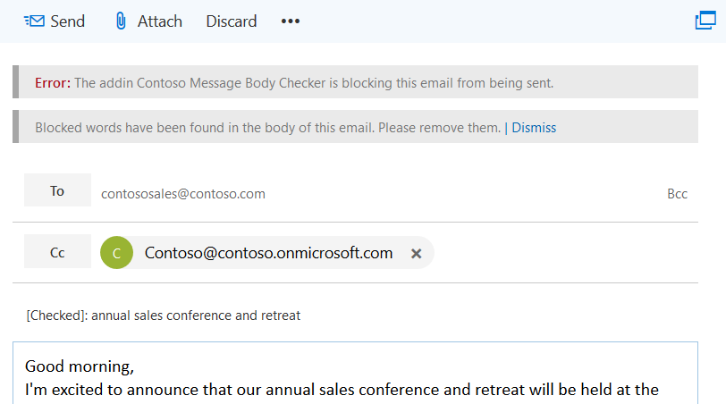

# <a name="on-send-feature-for-outlook-add-ins"></a>Outlook アドインの送信時機能

Outlook アドインの送信時機能を使用すると、メッセージや会議アイテムを処理したり、特定のアクションからユーザーをブロックしたり、アドインが送信時に特定のプロパティを設定したりできます。

> [!NOTE]
> 送信時機能は、Office アドイン用 [の Teams マニフェスト (プレビュー)](../develop/json-manifest-overview.md) を使用するアドインではサポートされていません。 [イベント ベースのアクティブ化](autolaunch.md)を使用し、**OnMessageSend イベントまたは OnAppointmentSend** イベントまたはその両方のハンドラーを実装することで、同様 **の効果を** 実現します。

たとえば、送信時機能を使用して、次の手順を実行します。

- ユーザーが機密情報を送信したり、件名を空白にしたままにしないようにする。  
- 特定の受信者をメッセージの CC 行または会議の任意の受信者行に追加する。

送信時の機能は、`ItemSend` イベントの種類によってトリガーされ、UI はありません。

送信時機能に関連する制限事項の詳細については、この記事で後述する「[制限事項](#limitations)」を参照してください。

> [!NOTE]
> [スマート アラート](smart-alerts-onmessagesend-walkthrough.md) は、送信時機能の新しいバージョンです。 [要件セット 1.12](/javascript/api/requirement-sets/outlook/requirement-set-1.12/outlook-requirement-set-1.12) でリリースされ、 イベントと `OnAppointmentSend` イベントが`OnMessageSend`導入されました。 送信時の機能と同様に、スマート アラートを使用すると、メール アイテムが送信される前に特定の条件が満たされていることをアドインで確認できます。 スマート アラートは、送信時の機能とは次のように区別されます。
>
> - 必須の条件ではなくオプションの推奨事項をユーザーに提供する場合は、 [送信モード](/javascript/api/manifest/launchevent#available-sendmode-options) オプションが提供されます。
> - マニフェストの **SendMode** プロパティが または `PromptUser` オプションに設定されている場合、アドインを AppSource に`SoftBlock`発行できます。 イベント ベースのアドインの公開の詳細については、イベントベースの Outlook アドイン [の AppSource 登録情報オプションに関するページを](autolaunch-store-options.md)参照してください。
>
> スマート アラートと送信時機能の違いの詳細については、「スマート アラートと送信時 [機能の違い](smart-alerts-onmessagesend-walkthrough.md#differences-between-smart-alerts-and-the-on-send-feature)」を参照してください。 [チュートリアルを完了して、スマート アラートを試](smart-alerts-onmessagesend-walkthrough.md)してみることをお勧めします。

## <a name="supported-clients-and-platforms"></a>サポートされているクライアントとプラットフォーム

次の表は、送信時の機能でサポートされているクライアントとサーバーの組み合わせを示しています。該当する場合は、最低限必要な累積的な更新プログラムも含まれます。 除外された組み合わせはサポートされていません。

| Client | Exchange Online | Exchange 2016 オンプレミス<br>(累積的な更新プログラム 6 以降) | Exchange 2019 オンプレミス<br>(累積的な更新プログラム 1 以降) |
|---|:---:|:---:|:---:|
|Windows:<br>バージョン 1910 (ビルド 12130.20272) 以降|はい|はい|はい|
|Mac：<br>ビルド 16.47 以降|はい|はい|はい|
|Web ブラウザー:<br>モダン Outlook UI|はい|該当なし|該当なし|
|Web ブラウザー:<br>クラシック Outlook UI|対象外|あり|はい|

> [!NOTE]
> 送信時機能は、要件セット 1.8 で正式にリリースされました (詳細については [、現在のサーバーとクライアントのサポート](/javascript/api/requirement-sets/outlook/outlook-api-requirement-sets#requirement-sets-supported-by-exchange-servers-and-outlook-clients) を参照してください)。 ただし、この機能のサポート マトリックスは要件セットのスーパーセットであることに注意してください。

> [!IMPORTANT]
> 送信時機能を使用するアドインは、 [AppSource](https://appsource.microsoft.com) では許可されません。

## <a name="how-does-the-on-send-feature-work"></a>送信時機能のしくみ

送信時機能を使用して、`ItemSend` 同期イベントを統合する Outlook アドインをビルドできます。 このイベントは、ユーザーが [**送信**] ボタン (または、既存の会議の場合は [**変更内容を送信**] ボタン) を押していることを検出し、検証が失敗した場合はアイテムの送信をブロックするために使用できます。 たとえば、ユーザーがメッセージ送信イベントをトリガーすると、送信時機能を使用する Outlook アドインでは次のことが可能です。

- 電子メール メッセージの内容を読み取って検証します。
- メッセージに件名行が含まれていることを確認します。
- 所定の受信者を設定します。

送信イベントがトリガーされると、Outlook のクライアント側で検証が行われ、アドインがタイムアウトになるまでに最大 5 分かかります。検証が失敗した場合、アイテムの送信はブロックされ、ユーザーにアクションを実行するように求めるエラー メッセージが情報バーに表示されます。

> [!NOTE]
> Outlook on the webでは、Outlook ブラウザー タブ内で構成されているメッセージで送信時機能がトリガーされると、検証やその他の処理を完了するために、アイテムが独自のブラウザー ウィンドウまたはタブにポップアウトされます。

次のスクリーンショットは、送信者に件名を追加するように通知する情報バーを示しています。


次のスクリーンショットは、送信者に禁止された単語が見つかったことを通知する情報バーを示しています。



## <a name="limitations"></a>制限事項

現在、送信時機能には次の制限事項があります。

- **送信時の追加** 機能 &ndash; 送信時ハンドラーで [item.body.AppendOnSendAsync](/javascript/api/outlook/office.body?view=outlook-js-1.9&preserve-view=true#outlook-office-body-appendonsendasync-member(1)) を呼び出すと、エラーが返されます。
- **AppSource** &ndash; 送信時機能を使用する Outlook アドインは AppSource の検証で失敗するため、[AppSource](https://appsource.microsoft.com) に発行することはできません。 送信時機能を使用するアドインは、管理者が展開する必要があります。 アドインを AppSource に発行するオプションを使用する場合は、代わりにスマート アラート (送信時機能の新しいバージョン) を使用することを検討してください。 スマート アラートとこれらのアドインを展開する方法の詳細については、「イベント ベースの Outlook アドインの Outlook アドインと [AppSource 登録情報オプション](autolaunch-store-options.md)[でスマート アラートと OnMessageSend イベントと OnAppointmentSend イベントを使用](smart-alerts-onmessagesend-walkthrough.md)する」を参照してください。
  
  > [!IMPORTANT]
  > を実行 `npm run validate` して [アドインのマニフェストを検証](../testing/troubleshoot-manifest.md)すると、"ItemSend イベントを含むメールボックス アドインが無効です" というエラーが表示されます。 メールボックス アドイン マニフェストには、許可されていない VersionOverrides の ItemSend イベントが含まれています。 このメッセージは、このバージョンの送信時機能に必要なイベントを `ItemSend` 使用するアドインを AppSource に発行できないために表示されます。 他の検証エラーが見つからない場合でも、アドインをサイドロードして実行できます。

- **マニフェスト** &ndash; 1 つのアドインに対して 1 つの `ItemSend` イベントのみがサポートされています。 マニフェストに 2 つ以上の `ItemSend` イベントがある場合、マニフェストの検証は失敗します。
- **Performance** &ndash; Multiple roundtrips to the web server that hosts the add-in can affect the performance of the add-in. Consider the effects on performance when you create add-ins that require multiple message- or meeting-based operations.
- **後で送信** (Mac のみ) &ndash; 送信時アドインがある場合、**後で送信** 機能は使用できません。

また、イベントが完了した後にアイテムを自動的に閉じる必要があるため、送信時のイベント ハンドラーで を呼び出 `item.close()` すのはお勧めしません。

### <a name="mailbox-typemode-limitations"></a>メールボックスの種類とモードの制限事項

送信時機能は Outlook on the web、Windows、Mac のユーザー メールボックスでのみサポートされます。 Outlook アドインの概要ページの 「アドインで [使用できるメールボックスアイテム](outlook-add-ins-overview.md#mailbox-items-available-to-add-ins) 」セクションで説明されているようにアドインがアクティブ化されない状況に加えて、この機能は現在、そのモードが使用可能なオフライン モードではサポートされていません。

Outlook アドインがアクティブ化されない場合、送信時アドインは実行されないため、メッセージが送信されます。

ただし、送信中の機能が有効で使用可能で、メールボックスのシナリオがサポートされていない場合、Outlook は送信を許可しません。

## <a name="multiple-on-send-add-ins"></a>複数の送信時アドイン

複数の送信時アドインをインストールすると、アドインは API の `getAppManifestCall` または `getExtensibilityContext` から受信した順序で実行されます。 最初のアドインが送信を許可している場合、2 番目のアドインは最初のアドインが送信をブロックするように変更できます。 ただし、インストールされているすべてのアドインが送信を許可している場合、最初のアドインは再度実行されません。

たとえば、アドイン 1 とアドイン 2 は両方とも送信時機能を使用しているとします。 最初にアドイン 1 がインストールされ、アドイン 2 は 2 番目にインストールされます。 アドイン 1 は、アドインが送信を許可する条件として、Fabrikam という単語がメッセージに表示されることを確認します。  ただし、アドイン 2 は Fabrikam という単語のすべての出現箇所を削除します。 メッセージは、Fabrikam のすべてのインスタンスが削除されて送信されます (アドイン 1 とアドイン 2 のインストール順序のため)。

## <a name="deploy-outlook-add-ins-that-use-on-send"></a>送信時機能を使用する Outlook アドインを展開する

管理者には送信時機能を使用する Outlook アドインを展開することをお勧めします。 管理者は、送信時アドインを必ず次のようにする必要があります。

- 作成項目が (電子メール、新規作成、返信、転送のために) 開かれるたびに常に存在する。
- ユーザーが閉じたり無効にしたりできない。

## <a name="install-outlook-add-ins-that-use-on-send"></a>送信時機能を使用する Outlook アドインをインストールする

Outlook の送信時機能では、送信イベントの種類に対してアドインが構成されている必要があります。 構成するプラットフォームを選択します。

### <a name="web-browser---classic-outlook"></a>[Web ブラウザー - クラシック Outlook](#tab/classic)

送信時機能を使用するOutlook on the web (クラシック) のアドインは、*OnSendAddinsEnabled* フラグが に設定されているOutlook on the web メールボックス ポリシーが割り当てられているユーザーに対して`true`実行されます。

新しいアドインをインストールするには、次の Exchange Online PowerShell コマンドレットを実行します。

```powershell
$Data=Get-Content -Path '.\Contoso Message Body Checker.xml' -Encoding Byte –ReadCount 0
```

```powershell
New-App -OrganizationApp -FileData $Data -DefaultStateForUser Enabled
```

> [!NOTE]
> リモート PowerShell を使用して Exchange Online に接続する方法については、「[Exchange Online PowerShell への接続](/powershell/exchange/exchange-online/connect-to-exchange-online-powershell/connect-to-exchange-online-powershell)」を参照してください。

#### <a name="enable-the-on-send-feature"></a>送信時機能を有効にする

既定では、送信時機能は無効になっています。 管理者は、Exchange Online PowerShell コマンドレットを実行して、送信時機能を有効にできます。

すべてのユーザーに対して送信時アドインを有効にするには、次のようにします。

1. 新しい Outlook on the web のメールボックス ポリシーを作成します。

   ```powershell
    New-OWAMailboxPolicy OWAOnSendAddinAllUserPolicy
   ```

    > [!NOTE]
    > 管理者は既存のポリシーを使用できますが、送信時機能は特定のメールボックスの種類でのみサポートされています。 サポートされていないメールボックスは、Outlook on the web では既定で送信がブロックされます。

1. 送信時機能を有効にする

   ```powershell
    Get-OWAMailboxPolicy OWAOnSendAddinAllUserPolicy | Set-OWAMailboxPolicy –OnSendAddinsEnabled:$true
   ```

1. ポリシーをユーザーに割り当てます。

   ```powershell
    Get-User -Filter {RecipientTypeDetails -eq 'UserMailbox'}|Set-CASMailbox -OwaMailboxPolicy OWAOnSendAddinAllUserPolicy
   ```

#### <a name="enable-the-on-send-feature-for-a-group-of-users"></a>ユーザーのグループに対する送信時機能を有効にする

ユーザーの特定のグループに対して送信時機能を有効にするための手順は次のとおりです。  この例では、管理者は、財務担当ユーザーの環境 (財務担当ユーザーが財務部門にいる) の Outlook on the web 送信時アドイン機能のみを有効にする必要があります。

1. グループ用の新しい Outlook on the web のメールボックス ポリシーを作成します。

   ```powershell
    New-OWAMailboxPolicy FinanceOWAPolicy
   ```

   > [!NOTE]
   > 管理者は既存のポリシーを使用できますが、送信時機能は特定のメールボックスの種類でのみサポートされています (詳細については、この記事で前述した「[メールボックスの種類の制限事項](#multiple-on-send-add-ins)」を参照してください)。 サポートされていないメールボックスは、Outlook on the web では既定で送信がブロックされます。

1. 送信時機能を有効にする

   ```powershell
    Get-OWAMailboxPolicy FinanceOWAPolicy | Set-OWAMailboxPolicy –OnSendAddinsEnabled:$true
   ```

1. ポリシーをユーザーに割り当てます。

   ```powershell
    $targetUsers = Get-Group 'Finance'|select -ExpandProperty members
    $targetUsers | Get-User -Filter {RecipientTypeDetails -eq 'UserMailbox'}|Set-CASMailbox -OwaMailboxPolicy FinanceOWAPolicy
   ```

> [!NOTE]
> ポリシーが有効になるまで最大 60 分待つか、インターネット インフォメーション サービス (IIS) を再起動します。 ポリシーが有効になると、グループの送信時機能が有効になります。

#### <a name="disable-the-on-send-feature"></a>送信時機能を無効にする

ユーザーに対して送信時機能を無効にする、またはフラグを有効にしていない Outlook on the web のメールボックス ポリシーを割り当てるには、次のコマンドレットを実行します。 この例では、メールボックス ポリシーは *ContosoCorpOWAPolicy* です。

```powershell
Get-CASMailbox joe@contoso.com | Set-CASMailbox –OWAMailboxPolicy "ContosoCorpOWAPolicy"
```

> [!NOTE]
> **Set-OwaMailboxPolicy** コマンドレットを使用して、既存の Outlook on the web メールボックス ポリシーを構成する方法の詳細については、「[Set-OwaMailboxPolicy](/powershell/module/exchange/client-access/Set-OwaMailboxPolicy)」を参照してください。

特定の Outlook on the web のメールボックス ポリシーが割り当てられているすべてのユーザーに対して送信時機能を無効にするには、次のコマンドレットを実行します。

```powershell
Get-OWAMailboxPolicy OWAOnSendAddinAllUserPolicy | Set-OWAMailboxPolicy –OnSendAddinsEnabled:$false
```

### <a name="web-browser---modern-outlook"></a>[Web ブラウザー - モダン Outlook](#tab/modern)

送信時機能を使用する Outlook on the web (モダン) のアドインは、インストールされているすべてのユーザーに対して実行されます。 ただし、コンプライアンス標準を満たすためにユーザーが送信時アドインを実行する必要がある場合、メールボックス ポリシーには *OnSendAddinsEnabled* フラグを に `true` 設定して、アドインが送信時に処理中にアイテムの編集を許可されないようにする必要があります。

新しいアドインをインストールするには、次の Exchange Online PowerShell コマンドレットを実行します。

```powershell
$Data=Get-Content -Path '.\Contoso Message Body Checker.xml' -Encoding Byte –ReadCount 0
```

```powershell
New-App -OrganizationApp -FileData $Data -DefaultStateForUser Enabled
```

> [!NOTE]
> リモート PowerShell を使用して Exchange Online に接続する方法については、「[Exchange Online PowerShell への接続](/powershell/exchange/exchange-online/connect-to-exchange-online-powershell/connect-to-exchange-online-powershell)」を参照してください。

#### <a name="enable-the-on-send-flag"></a>送信時フラグを有効にする

管理者は、Exchange Online PowerShell コマンドレットを実行することで、送信時のコンプライアンスを適用できます。

すべてのユーザーに対して、送信時アドインの処理中に編集を禁止するには、次の手順を実行します。

1. 新しい Outlook on the web のメールボックス ポリシーを作成します。

   ```powershell
    New-OWAMailboxPolicy OWAOnSendAddinAllUserPolicy
   ```

    > [!NOTE]
    > 管理者は既存のポリシーを使用できますが、送信時機能は特定のメールボックスの種類でのみサポートされています。 サポートされていないメールボックスは、Outlook on the web では既定で送信がブロックされます。

1. 送信時にコンプライアンスを適用します。

   ```powershell
    Get-OWAMailboxPolicy OWAOnSendAddinAllUserPolicy | Set-OWAMailboxPolicy –OnSendAddinsEnabled:$true
   ```

1. ポリシーをユーザーに割り当てます。

   ```powershell
    Get-User -Filter {RecipientTypeDetails -eq 'UserMailbox'}|Set-CASMailbox -OwaMailboxPolicy OWAOnSendAddinAllUserPolicy
   ```

#### <a name="turn-on-the-on-send-flag-for-a-group-of-users"></a>ユーザーのグループの送信時フラグを有効にする

特定のユーザー グループに対して送信時コンプライアンスを適用するには、次の手順を実行します。 この例では、管理者は、財務担当ユーザーの環境 (財務担当ユーザーが財務部門にいる) の Outlook on the web 送信時アドイン ポリシーのみを有効にする必要があります。

1. グループ用の新しい Outlook on the web のメールボックス ポリシーを作成します。

   ```powershell
    New-OWAMailboxPolicy FinanceOWAPolicy
   ```

   > [!NOTE]
   > 管理者は既存のポリシーを使用できますが、送信時機能は特定のメールボックスの種類でのみサポートされています (詳細については、この記事で前述した「[メールボックスの種類の制限事項](#multiple-on-send-add-ins)」を参照してください)。 サポートされていないメールボックスは、Outlook on the web では既定で送信がブロックされます。

1. 送信時にコンプライアンスを適用します。

   ```powershell
    Get-OWAMailboxPolicy FinanceOWAPolicy | Set-OWAMailboxPolicy –OnSendAddinsEnabled:$true
   ```

1. ポリシーをユーザーに割り当てます。

   ```powershell
    $targetUsers = Get-Group 'Finance'|select -ExpandProperty members
    $targetUsers | Get-User -Filter {RecipientTypeDetails -eq 'UserMailbox'}|Set-CASMailbox -OwaMailboxPolicy FinanceOWAPolicy
   ```

> [!NOTE]
> ポリシーが有効になるまで最大 60 分待つか、インターネット インフォメーション サービス (IIS) を再起動します。 ポリシーが有効になると、送信時のコンプライアンスがグループに適用されます。

#### <a name="turn-off-the-on-send-flag"></a>送信時フラグをオフにする

ユーザーのオン送信コンプライアンスの適用を無効にするには、次のコマンドレットを実行して、フラグが有効になっていないOutlook on the webメールボックス ポリシーを割り当てます。 この例では、メールボックス ポリシーは *ContosoCorpOWAPolicy* です。

```powershell
Get-CASMailbox joe@contoso.com | Set-CASMailbox –OWAMailboxPolicy "ContosoCorpOWAPolicy"
```

> [!NOTE]
> **Set-OwaMailboxPolicy** コマンドレットを使用して、既存の Outlook on the web メールボックス ポリシーを構成する方法の詳細については、「[Set-OwaMailboxPolicy](/powershell/module/exchange/client-access/Set-OwaMailboxPolicy)」を参照してください。

特定のOutlook on the web メールボックス ポリシーが割り当てられているすべてのユーザーに対してオン送信コンプライアンスの適用をオフにするには、次のコマンドレットを実行します。

```powershell
Get-OWAMailboxPolicy OWAOnSendAddinAllUserPolicy | Set-OWAMailboxPolicy –OnSendAddinsEnabled:$false
```

### <a name="windows"></a>[Windows](#tab/windows)

送信時機能を使用する Outlook on Windows のアドインは、インストールされているすべてのユーザーに対して実行されます。 ただし、ユーザーがコンプライアンス標準を満たすためにアドインを実行する必要がある場合は、グループ ポリシー [ **Web アドインを読み込めなかったときに送信をブロック** する] を、該当する各コンピューターで **[有効]** に設定する必要があります。

メールボックス ポリシーを設定するには、管理者は [管理用テンプレート ツール](https://www.microsoft.com/download/details.aspx?id=49030)をダウンロードし、ローカル نهج المجموعة エディター **gpedit.msc** を実行して、最新の管理用テンプレートにアクセスできます。

> [!NOTE]
> 以前のバージョンの管理用テンプレート ツールでは、ポリシー名は [ **Web 拡張機能を読み込めなかったときに送信を無効にする]** でした。 必要に応じて、後の手順でこの名前に置き換えます。

#### <a name="what-the-policy-does"></a>ポリシーの内容

コンプライアンスのために、管理者は、最新の送信時アドインを実行できるようになるまでユーザーがメッセージまたは会議アイテムを送信できないようにする必要があります。 管理者は、すべてのアドインが Exchange から更新され、各メッセージまたは会議アイテムが送信時に予想されるルールと規制を満たしていることを確認できるように、Web アドインを **読み込めないように** 、グループ ポリシー [送信をブロックする] を有効にする必要があります。

|ポリシーの状態|結果|
|---|---|
|無効|送信中のアドイン (必ずしも最新バージョンではない) の現在ダウンロードされているマニフェストは、送信中のメッセージまたは会議アイテムに対して実行されます。 これは既定の状態/動作です。|
|Enabled|送信時アドインの最新のマニフェストが Exchange からダウンロードされると、送信中のメッセージまたは会議アイテムに対してアドインが実行されます。 それ以外の場合、送信はブロックされます。|

#### <a name="manage-the-on-send-policy"></a>送信時ポリシーを管理する

既定では、送信時ポリシーは無効になっています。 管理者は、ユーザーのグループ ポリシー設定 [ **Web アドインを読み込めなかったときに送信をブロック** する] が **[有効]** に設定されていることを確認することで、送信時ポリシーを有効にすることができます。 ユーザーのポリシーを無効にするには、管理者が [**無効**] に設定する必要があります。 このポリシー設定を管理するには、次の操作を行います。

1. 最新の[管理用テンプレートツール](https://www.microsoft.com/download/details.aspx?id=49030)をダウンロードします。
1. ローカル نهج المجموعة エディター (**gpedit.msc**) を開きます。
1. **[ユーザー構成** > **] [管理用テンプレート]**  > **[Microsoft Outlook 2016****セキュリティ** > **セキュリティ センター**] の順に > 移動します。
1. [ **Web アドインが読み込めなかったときに送信をブロックする** ] 設定を選択します。
1. リンクを開いてポリシー設定を編集します。
1. [ **Web アドインが読み込めなかったときに送信をブロック** する] ダイアログ ウィンドウで、[ **有効]** または **[無効** ] を選択し、[ **OK]** または [ **適用** ] を選択して更新プログラムを有効にします。

### <a name="mac"></a>[Mac](#tab/unix)

送信時機能を使用する Outlook on Mac のアドインは、インストールされているすべてのユーザーに対して実行されます。 ただし、コンプライアンス基準を満たすためにアドインを実行する必要がある場合は、ユーザーの各マシンで次のメールボックス ポリシーを適用する必要があります。 この設定またはキーは、CFPreferences と互換性があります。つまり、Jamf Pro などの Mac のエンタープライズ管理ソフトウェアを使用して設定することができます。

||値|
|:---|:---|
|**ドメイン**|com.microsoft.outlook|
|**キー**|OnSendAddinsWaitForLoad|
|**DataType**|Boolean|
|**指定可能な値**|false (既定)<br>true|
|**可用性**|16.27|
|**コメント**|このキーは、送信時メールボックス ポリシーを作成します。|

#### <a name="what-the-setting-does"></a>設定内容

コンプライアンスのために、管理者は、最新の送信時アドインを実行できるようになるまでユーザーがメッセージまたは会議アイテムを送信できないようにする必要があります。 管理者は、キー **OnSendAddinsWaitForLoad** を有効にして、すべてのアドインが Exchange から更新されるようにして、各メッセージまたは会議アイテムが予想されるルールおよび規制を送信時に満たしていることを確認します。

|キーの状態|結果|
|---|---|
|false|送信中のアドイン (必ずしも最新バージョンではない) の現在ダウンロードされているマニフェストは、送信中のメッセージまたは会議アイテムに対して実行されます。 これは既定の状態/動作です。|
|true|送信時アドインの最新のマニフェストが Exchange からダウンロードされると、送信中のメッセージまたは会議アイテムに対してアドインが実行されます。 それ以外の場合、送信はブロックされ、[ **送信** ] ボタンが無効になります。|

---

## <a name="on-send-feature-scenarios"></a>送信時機能のシナリオ

送信時機能を使用するアドインのサポートされているシナリオとサポートされていないシナリオは、次のとおりです。

### <a name="event-handlers-are-dynamically-defined"></a>イベント ハンドラーは動的に定義されます

アドインのイベント ハンドラーは、時刻`Office.initialize``Office.onReady()`または呼び出しで定義する必要があります (詳細については、「[Outlook アドインの起動](../develop/loading-the-dom-and-runtime-environment.md#startup-of-an-outlook-add-in)」および「[Office アドインを初期化](../develop/initialize-add-in.md)する」を参照してください)。 初期化中にハンドラー コードが特定の状況によって動的に定義されている場合は、完全に定義されたハンドラーを呼び出すスタブ関数を作成する必要があります。 スタブ関数は、マニフェストの **\<Event\>** 要素の `FunctionName` 属性で参照する必要があります。 この回避策により、ハンドラーが定義され、1 回 `Office.initialize` または `Office.onReady()` 実行して参照する準備が整います。

アドインの初期化後にハンドラーが定義されていない場合、送信者はメール アイテムの情報バーを介して "コールバック関数に到達できません" と通知されます。

### <a name="user-mailbox-has-the-on-send-add-in-feature-enabled-but-no-add-ins-are-installed"></a>ユーザー メールボックスで送信時アドイン機能が有効になっているが、アドインはインストールされていない

このシナリオでは、ユーザーはアドインを実行せずにメッセージと会議アイテムを送信できます。

### <a name="user-mailbox-has-the-on-send-add-in-feature-enabled-and-add-ins-that-supports-on-send-are-installed-and-enabled"></a>ユーザー メールボックスで送信時アドイン機能が有効になっており、送信時機能をサポートするアドインがインストールされ、有効になっている

アドインは送信イベント中に実行され、ユーザーによる送信を許可またはブロックします。

### <a name="mailbox-delegation-where-mailbox-1-has-full-access-permissions-to-mailbox-2"></a>メールボックス 1 がメールボックス 2 への完全なアクセス許可を持つ、メールボックスの委任

#### <a name="web-browser-classic-outlook"></a>Web ブラウザー (クラシック Outlook)

|シナリオ|メールボックス 1 の送信時機能|メールボックス 2 の送信時機能|Outlook web のセッション (クラシック)|結果|サポートの有無|
|:------------|:------------|:--------------------------|:---------|:-------------|:-------------|
|1|有効|有効|新しいセッション|メールボックス 1 は、メールボックス 2 からのメッセージまたは会議アイテムを送信できません。|Not currently supported. As a workaround, use scenario 3.|
|2|無効|有効|新しいセッション|メールボックス 1 は、メールボックス 2 からのメッセージまたは会議アイテムを送信できません。|Not currently supported. As a workaround, use scenario 3.|
|3|有効|有効|同じセッション|メールボックス 1 に割り当てられている送信時アドインが送信時に実行されます。|サポートされています。|
|4|有効|無効|新しいセッション|送信時アドインは実行されません。メッセージまたは会議アイテムは送信されます。|サポートされています。|

#### <a name="web-browser-modern-outlook-windows-mac"></a>Web ブラウザー (モダン Outlook)、Windows、Mac

強制的に送信するには、管理者は両方のメールボックスでポリシーが有効になっていることを確認する必要があります。 アドインで委任アクセスをサポートする方法については、「 [共有フォルダーと共有メールボックスのシナリオを有効にする](delegate-access.md)」を参照してください。

### <a name="user-mailbox-with-on-send-add-in-featurepolicy-enabled-add-ins-that-support-on-send-are-installed-and-enabled-and-offline-mode-is-enabled"></a>ユーザー メールボックスで送信時アドイン機能/ポリシーが有効になっており、送信時機能をサポートするアドインがインストールされ、有効であり、オフライン モードが有効になっている

送信時アドインは、ユーザー、アドイン バックエンド、および Exchange のオンライン状態に従って実行されます。

#### <a name="users-state"></a>ユーザーの状態

ユーザーがオンラインの場合、送信中に送信時アドインが実行されます。 ユーザーがオフラインの場合、送信中に送信時アドインは実行されず、メッセージまたは会議アイテムは送信されません。

#### <a name="add-in-backends-state"></a>アドイン バックエンドの状態

送信時アドインは、バックエンドがオンラインで接続可能な場合に実行されます。 バックエンドがオフラインの場合、送信は無効です。

#### <a name="exchanges-state"></a>Exchange の状態

Exchange サーバーがオンラインでアクセスできる場合、送信中に送信時アドインが実行されます。 送信時アドインが Exchange に接続できない場合、および該当するポリシーまたはコマンドレットが有効になっている場合、送信は無効です。

> [!NOTE]
> オフライン状態の Mac では [**送信**] ボタン (または、既存の会議の場合は [**変更内容を送信**] ボタン) が無効になっており、ユーザーがオフラインの場合、組織が送信を許可していないという通知が表示されます。

### <a name="user-can-edit-item-while-on-send-add-ins-are-working-on-it"></a>ユーザーは、オンセンド アドインの作業中にアイテムを編集できます

送信時アドインがアイテムを処理している間、ユーザーは不適切なテキストや添付ファイルなどを追加してアイテムを編集できます。 アドインの送信処理中にユーザーがアイテムを編集できないようにする場合は、ダイアログを使用して回避策を実装できます。 この回避策は、Outlook on the web (クラシック)、Windows、Mac で使用できます。

> [!IMPORTANT]
> 最新のOutlook on the web: アドインが送信時に処理中にユーザーがアイテムを編集できないようにするには、この記事の「送信時に [使用する Outlook アドインをインストール](outlook-on-send-addins.md?tabs=modern#install-outlook-add-ins-that-use-on-send)する」セクションの説明に従って、*OnSendAddinsEnabled* フラグを に`true`設定する必要があります。

送信時ハンドラーで、次の手順を実行します。

1. [displayDialogAsync](/javascript/api/office/office.ui?view=outlook-js-preview&preserve-view=true#office-office-ui-displaydialogasync-member(1)) を呼び出して、マウスのクリックとキーストロークが無効になるようにダイアログを開きます。

    > [!IMPORTANT]
    > クラシック Outlook on the webでこの動作を取得するには、呼び出しのパラメーターで [displayInIframe プロパティ](/javascript/api/office/office.dialogoptions?view=outlook-js-preview&preserve-view=true#office-office-dialogoptions-displayiniframe-member)を `options` に`true`設定する`displayDialogAsync`必要があります。

1. 項目の処理を実装します。
1. ダイアログを閉じます。 また、ユーザーがダイアログを閉じるとどうなるかを処理します。

## <a name="code-examples"></a>コード例

次のコード例は、単純な送信時アドインを作成する方法を示しています。 これらの例を基にしたコード サンプルをダウンロードするには、「[Outlook-Add-in-On-Send](https://github.com/OfficeDev/Outlook-Add-in-On-Send)」を参照してください。

> [!TIP]
> 送信時イベントでダイアログを使用する場合は、イベントを完了する前にダイアログを閉じておきます。

### <a name="manifest-version-override-and-event"></a>マニフェスト、バージョンのオーバーライド、イベント

[Outlook-Add-in-On-Send](https://github.com/OfficeDev/Outlook-Add-in-On-Send) コード サンプルには、2 つのマニフェストが含まれています。

- `Contoso Message Body Checker.xml` &ndash; 制限された単語または機密情報についてメッセージの本文を送信時に確認する方法を示します。  

- `Contoso Subject and CC Checker.xml` &ndash; CC 行に受信者を追加し、送信時にメッセージに件名が含まれていることを確認する方法を示します。  

`Contoso Message Body Checker.xml` マニフェスト ファイルには、`ItemSend` イベントで呼び出す必要がある関数ファイルと関数名を含めます。 操作は同期的に実行されます。

```xml
<Hosts>
    <Host xsi:type="MailHost">
        <DesktopFormFactor>
            <!-- The functionfile and function name to call on message send.  -->
            <!-- In this case, the function validateBody will be called within the JavaScript code referenced in residUILessFunctionFileUrl. -->
            <FunctionFile resid="residUILessFunctionFileUrl" />
            <ExtensionPoint xsi:type="Events">
                <Event Type="ItemSend" FunctionExecution="synchronous" FunctionName="validateBody" />
            </ExtensionPoint>
        </DesktopFormFactor>
    </Host>
</Hosts>
```

> [!IMPORTANT]
> Visual Studio 2019 を使用して送信時アドインを開発している場合は、「これは無効な xsi:type ''http://schemas.microsoft.com/office/mailappversionoverrides/1.1:Events」のような検証警告を受け取ることがあります。これを回避するには、 [この警告に関するブログ](https://theofficecontext.com/2018/11/29/visual-studio-2017-this-is-an-invalid-xsitype-mailappversionoverrides-1-1event/)の GitHub gist として提供されている新しいバージョンの MailAppVersionOverridesV1_1.xsd が必要です。

`Contoso Subject and CC Checker.xml` マニフェスト ファイルの場合、次の例では、メッセージ送信イベントで呼び出す関数ファイルと関数名を示します。

```xml
<Hosts>
    <Host xsi:type="MailHost">
        <DesktopFormFactor>
            <!-- The functionfile and function name to call on message send.  -->
            <!-- In this case the function validateSubjectAndCC will be called within the JavaScript code referenced in residUILessFunctionFileUrl. -->
            <FunctionFile resid="residUILessFunctionFileUrl" />
            <ExtensionPoint xsi:type="Events">
                <Event Type="ItemSend" FunctionExecution="synchronous" FunctionName="validateSubjectAndCC" />
            </ExtensionPoint>
        </DesktopFormFactor>
    </Host>
</Hosts>
```

送信時 API には `VersionOverrides v1_1` が必要です。 マニフェストに `VersionOverrides` ノードを追加する方法を次に示します。

```xml
 <VersionOverrides xmlns="http://schemas.microsoft.com/office/mailappversionoverrides" xsi:type="VersionOverridesV1_0">
     <!-- On-send requires VersionOverridesV1_1 -->
     <VersionOverrides xmlns="http://schemas.microsoft.com/office/mailappversionoverrides/1.1" xsi:type="VersionOverridesV1_1">
         ...
     </VersionOverrides>
</VersionOverrides>
```

> [!NOTE]
> 詳細については、以下を参照してください。
>
> - [Outlook アドインのマニフェスト](manifests.md)
> - [Office アドインの XML マニフェスト](../develop/add-in-manifests.md)

### <a name="event-and-item-objects-and-bodygetasync-and-bodysetasync-methods"></a>`Event` オブジェクト、`item` オブジェクトと、`body.getAsync` メソッド、`body.setAsync` メソッドを理解する

現在選択されているメッセージまたは会議アイテム (この例では、新しく作成されたメッセージ) にアクセスするには、`Office.context.mailbox.item` 名前空間を使用します。 `ItemSend` イベントは、送信時機能によってマニフェストで指定された関数に自動的に渡されます &mdash; この例では `validateBody` 関数です。

```js
let mailboxItem;

Office.initialize = function (reason) {
    mailboxItem = Office.context.mailbox.item;
}

// Entry point for Contoso Message Body Checker add-in before send is allowed.
// <param name="event">ItemSend event is automatically passed by on-send code to the function specified in the manifest.</param>
function validateBody(event) {
    mailboxItem.body.getAsync("html", { asyncContext: event }, checkBodyOnlyOnSendCallBack);
}
```

関数は `validateBody` 、指定した形式 (HTML) で現在の本文を取得し、コールバック関数でコードがアクセスするイベント オブジェクトを渡 `ItemSend` します。 `getAsync` メソッドに加え、`Body` オブジェクトは本文を指定したテキストに置き換えるために使用できる `setAsync` メソッドも提供します。

> [!NOTE]
> 詳細については、「[Event オブジェクト](/javascript/api/office/office.addincommands.event)」と「[Body.getAsync](/javascript/api/outlook/office.body#outlook-office-body-getasync-member(1))」を参照してください。
  
### <a name="notificationmessages-object-and-eventcompleted-method"></a>`NotificationMessages` オブジェクトと `event.completed` メソッド

`checkBodyOnlyOnSendCallBack` 関数は、正規表現を使用して、禁止された単語がメッセージの本文に含まれているかどうかを決定します。 制限されている単語の配列に対する一致が検出された場合、電子メールの送信をブロックし、情報バーを使用して送信者に通知します。 これを実行するには、`Item` オブジェクトの `notificationMessages` プロパティを使用して、`NotificationMessages` オブジェクトを返します。 その後、次の例に示すように、`addAsync` メソッドを呼び出して通知をアイテムに追加します。

```js
// Determine whether the body contains a specific set of blocked words. If it contains the blocked words, block email from being sent. Otherwise allow sending.
// <param name="asyncResult">ItemSend event passed from the calling function.</param>
function checkBodyOnlyOnSendCallBack(asyncResult) {
    const listOfBlockedWords = new Array("blockedword", "blockedword1", "blockedword2");
    const wordExpression = listOfBlockedWords.join('|');

    // \b to perform a "whole words only" search using a regular expression in the form of \bword\b.
    // i to perform case-insensitive search.
    const regexCheck = new RegExp('\\b(' + wordExpression + ')\\b', 'i');
    const checkBody = regexCheck.test(asyncResult.value);

    if (checkBody) {
        mailboxItem.notificationMessages.addAsync('NoSend', { type: 'errorMessage', message: 'Blocked words have been found in the body of this email. Please remove them.' });
        // Block send.
        asyncResult.asyncContext.completed({ allowEvent: false });
    }

    // Allow send.
    asyncResult.asyncContext.completed({ allowEvent: true });
}
```

メソッドのパラメーターを次に示 `addAsync` します。

- `NoSend` &ndash; 通知メッセージを参照するための開発者が指定したキーである文字列。 これを使用して後でこのメッセージを変更できます。 キーを 32 文字以下にすることはできません。
- `type` &ndash; JSON オブジェクト パラメーターのプロパティの 1 つ。 メッセージの種類を表します。種類は [Office.MailboxEnums.ItemNotificationMessageType](/javascript/api/outlook/office.mailboxenums.itemnotificationmessagetype) 列挙型の値に対応しています。 使用可能な値は、進行状況のインジケーター、情報メッセージ、エラー メッセージです。 この例では、`type` はエラー メッセージです。  
- `message` &ndash; JSON オブジェクト パラメーターのプロパティの 1 つ。 この例では、`message` は通知メッセージのテキストです。

アドインが送信操作によってトリガーされた `ItemSend` イベントの処理を完了したことを通知するには、`event.completed({allowEvent:Boolean})` メソッドを呼び出します。 `allowEvent` プロパティは Boolean です。 `true` に設定されている場合、送信が許可されます。 `false` に設定されている場合、電子メール メッセージの送信がブロックされます。

> [!NOTE]
> 詳細については、「[notificationMessages](/javascript/api/requirement-sets/outlook/preview-requirement-set/office.context.mailbox.item#properties)」と「[completed](/javascript/api/office/office.addincommands.event)」を参照してください。

### <a name="replaceasync-removeasync-and-getallasync-methods"></a>`replaceAsync` メソッド、`removeAsync` メソッド、および`getAllAsync`メソッド

`addAsync` メソッドに加え、`NotificationMessages` オブジェクトは本文を指定したテキストに置き換えるために使用できる `replaceAsync`、`removeAsync`、および `getAllAsync` の各メソッドも提供します。  このコード サンプルでは、これらのメソッドは使用されません。  詳細については、「[NotificationMessages](/javascript/api/outlook/office.notificationmessages)」を参照してください。

### <a name="subject-and-cc-checker-code"></a>件名および CC のチェッカー コード

次のコード例では、CC 行に受信者を追加し、送信時にメッセージに件名が含まれていることを確認する方法を示します。 この例では、送信時機能を使用して、電子メールの送信を許可または禁止します。  

```js
// Invoke by Contoso Subject and CC Checker add-in before send is allowed.
// <param name="event">ItemSend event is automatically passed by on-send code to the function specified in the manifest.</param>
function validateSubjectAndCC(event) {
    shouldChangeSubjectOnSend(event);
}

// Determine whether the subject should be changed. If it is already changed, allow send. Otherwise change it.
// <param name="event">ItemSend event passed from the calling function.</param>
function shouldChangeSubjectOnSend(event) {
    mailboxItem.subject.getAsync(
        { asyncContext: event },
        function (asyncResult) {
            addCCOnSend(asyncResult.asyncContext);
            //console.log(asyncResult.value);
            // Match string.
            const checkSubject = (new RegExp(/\[Checked\]/)).test(asyncResult.value)
            // Add [Checked]: to subject line.
            subject = '[Checked]: ' + asyncResult.value;

            // Determine whether a string is blank, null, or undefined.
            // If yes, block send and display information bar to notify sender to add a subject.
            if (asyncResult.value === null || (/^\s*$/).test(asyncResult.value)) {
                mailboxItem.notificationMessages.addAsync('NoSend', { type: 'errorMessage', message: 'Please enter a subject for this email.' });
                asyncResult.asyncContext.completed({ allowEvent: false });
            }
            else {
                // If can't find a [Checked]: string match in subject, call subjectOnSendChange function.
                if (!checkSubject) {
                    subjectOnSendChange(subject, asyncResult.asyncContext);
                    //console.log(checkSubject);
                }
                else {
                    // Allow send.
                    asyncResult.asyncContext.completed({ allowEvent: true });
                }
            }
        });
}

// Add a CC to the email. In this example, CC contoso@contoso.onmicrosoft.com
// <param name="event">ItemSend event passed from calling function</param>
function addCCOnSend(event) {
    mailboxItem.cc.setAsync(['Contoso@contoso.onmicrosoft.com'], { asyncContext: event });
}

// Determine whether the subject should be changed. If it is already changed, allow send, otherwise change it.
// <param name="subject">Subject to set.</param>
// <param name="event">ItemSend event passed from the calling function.</param>
function subjectOnSendChange(subject, event) {
    mailboxItem.subject.setAsync(
        subject,
        { asyncContext: event },
        function (asyncResult) {
            if (asyncResult.status == Office.AsyncResultStatus.Failed) {
                mailboxItem.notificationMessages.addAsync('NoSend', { type: 'errorMessage', message: 'Unable to set the subject.' });

                // Block send.
                asyncResult.asyncContext.completed({ allowEvent: false });
            }
            else {
                // Allow send.
                asyncResult.asyncContext.completed({ allowEvent: true });
            }
        });
}
```

To learn more about how to add a recipient to the CC line and verify that the email message includes a subject line on send, and to see the APIs you can use, see the [Outlook-Add-in-On-Send sample](https://github.com/OfficeDev/Outlook-Add-in-On-Send). The code is well commented.

## <a name="debug-outlook-add-ins-that-use-on-send"></a>送信時に使用する Outlook アドインをデバッグする

送信時アドインをデバッグする手順については、「Outlook アドインでの [関数コマンドのデバッグ](debug-ui-less.md)」を参照してください。

> [!TIP]
> ユーザーがアドインを実行し、アドインのイベント ハンドラーが動的に定義されたときにエラー "コールバック関数に到達できません" が表示される場合は、回避策としてスタブ関数を作成する必要があります。 詳細については、「 [イベント ハンドラーが動的に定義される](#event-handlers-are-dynamically-defined) 」を参照してください。

## <a name="see-also"></a>関連項目

- [Outlook アドインのアーキテクチャと機能の概要](outlook-add-ins-overview.md)
- [アドイン コマンド デモの Outlook アドイン](https://github.com/OfficeDev/outlook-add-in-command-demo)
