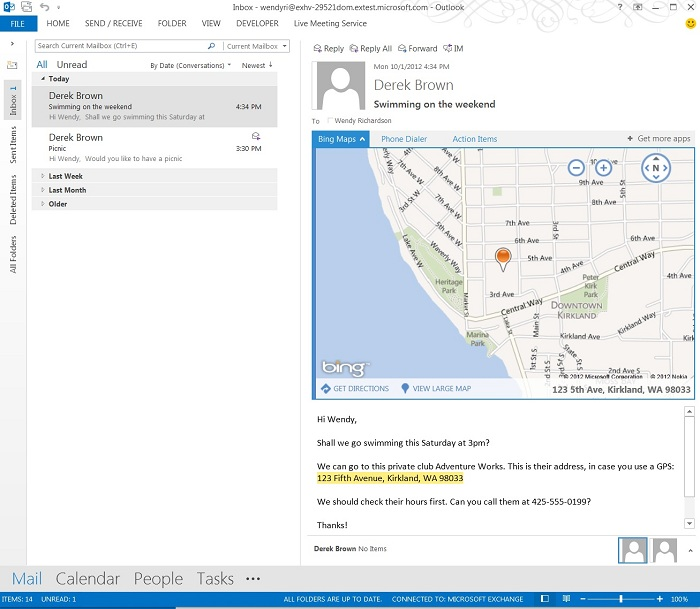

# 閲覧フォーム用の Outlook アドインを作成するCreate Outlook add-ins for read forms

閲覧アドインは、Outlook の閲覧ウィンドウか閲覧インスペクター内でアクティブ化される Outlook アドインです。閲覧アドインは、作成アドイン (ユーザーがメッセージや予定を作成しているときにアクティブ化される Outlook アドイン) とは違って、次のユーザー シナリオで使用できます。Read add-ins are Outlook add-ins that are activated in the Reading Pane or read inspector in Outlook. Unlike compose add-ins (Outlook add-ins that are activated when a user is creating a message or appointment), read add-ins are available when users: 

- 電子メール メッセージ、会議出席依頼、会議の返信、または会議の取り消しの表示。View an email message, meeting request, meeting response, or meeting cancellation.

   > [!NOTE]
   > Outlook が閲覧フォームでアドインをアクティブ化しないメッセージの種類があります。これには、別のメッセージの添付ファイルになっているアイテムと、Outlook の [下書き] フォルダー内にあるアイテム、あるいは他の方法で暗号化または保護されているアイテムが含まれます。Outlook doesn't activate add-ins in read form for certain types of messages, including items that are attachments to another message, items in the Outlook Drafts folder, or items that are encrypted or protected in other ways.
    
- ユーザーが出席者になっている会議アイテムの表示。View a meeting item in which the user is an attendee.
    
- ユーザーが会議の開催者になっている会議アイテムの表示 (Outlook 2013 および Exchange 2013 の RTM リリースのみ)View a meeting item in which the user is the organizer (RTM release of Outlook 2013 and Exchange 2013 only).
    
   > [!NOTE]
   > Office 2013 SP1 のリリースより、ユーザーが開催する会議アイテムを表示する場合、作成アドインのみをアクティブ化して使用することができます。閲覧アドインは、このシナリオでは使用できなくなります。Starting in the Office 2013 SP1 release, if the user is viewing a meeting item that the user has organized, only compose add-ins can activate and be available. Read add-ins are no longer available in this scenario.

これらの各閲覧シナリオで、アクティブ化の条件が満たされていると Outlook でアドインがアクティブ化されるので、ユーザーはアクティブ化されたアドインを閲覧ウィンドウか閲覧インスペクター内のアドイン バーで選択して開くことができます。以下の図は、ユーザーが住所を含むメッセージを閲覧するとアクティブ化されて開かれる **[Bing マップ]** アドインを示しています。In each of these read scenarios, Outlook activates add-ins when their activation conditions are fulfilled, and users can choose and open activated add-ins in the add-in bar in the Reading Pane or read inspector. The following figure shows the **Bing Maps** add-in activated and opened as the user is reading a message that contains a geographic address.

**選択されている住所を含んだ Outlook メッセージに対してアクティブ化されている [Bing 地図] アドインが表示されたアドイン ウィンドウ****The add-in pane showing the Bing Maps add-in in action for the selected Outlook message that contains an address**

## 閲覧モードで使用できるアドインの種類Types of add-ins available in read mode

閲覧アドインでは、以下のいずれの種類の組み合わせも可能です。Read add-ins can be any combination of the following types.

- [Outlook のアドイン コマンドAdd-in commands for Outlook](add-in-commands-for-outlook.md)   
- [Outlook コンテキスト アドインContextual Outlook add-ins](contextual-outlook-add-ins.md)
    

## 閲覧アドインで使用できる API 機能API features available to read add-ins

- 閲覧フォームでアドインをアクティブ化することについては、「[マニフェストでのアクティブ化ルールの指定](activation-rules.md#specify-activation-rules-in-a-manifest)」の表 1 を参照してください。For activating add-ins in read forms: see Table 1 in [Specify activation rules in a manifest](activation-rules.md#specify-activation-rules-in-a-manifest).    
- [正規表現アクティブ化ルールを使用して Outlook アドインを表示するUse regular expression activation rules to show an Outlook add-in](use-regular-expressions-to-show-an-outlook-add-in.md)    
- [Outlook アイテム内の文字列を既知のエンティティとして照合するMatch strings in an Outlook item as well-known entities](match-strings-in-an-item-as-well-known-entities.md)    
- [Outlook アイテムからエンティティ文字列を抽出するExtract entity strings from an Outlook item](extract-entity-strings-from-an-item.md)   
- [サーバーから Outlook アイテムの添付ファイルを取得するGet attachments of an Outlook item from the server](get-attachments-of-an-outlook-item.md)
    

## 関連項目See also

- [初めて Outlook アドインを記述するWrite your first Outlook add-in](../quickstarts/outlook-quickstart.md)
