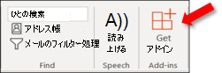

# テスト用に Outlook アドインをサイドロードする

サイドロードを使用すると、最初にアドイン カタログに置かなくても、テスト用に Outlook アドインをインストールすることができます。

> [!IMPORTANT]
> Outlook アドインがモバイルをサポートしている場合は、web、Windows、または Mac の Outlook クライアントに関するこの記事の指示に従ってマニフェストをサイドロードし、「[Outlook Mobile](outlook-mobile-addins.md#testing-your-add-ins-on-mobile) 用アドイン」の「モバイル でアドインをテストする」の記事のガイダンスに従います。

## サイドロードが自動的に実行される

Office アドイン用の [Yeoman](../develop/yeoman-generator-overview.md) ジェネレーターを使用して Outlook アドインを作成した場合は、サイドローディングは Windows のコマンド ラインを使用して行うのが最善です。 これにより、1 つのコマンドでサポートされているすべてのデバイスでツールとサイドロードを利用できます。

1. このWindowsコマンド プロンプトを開き、Yeoman が生成したアドイン プロジェクトのルート ディレクトリに移動します。 コマンド`npm start`を実行します。

1. ユーザー Outlookは、デスクトップ コンピューター上のOutlookに自動的にサイドロードされます。 アドインをサイドロードしようとして、マニフェスト ファイルの名前と場所を一覧に表示するダイアログが表示されます。 [ **OK] を** 選択し、マニフェストを登録します。

    > [!IMPORTANT]
    > マニフェストにエラーが含まれているか、マニフェストへのパスが無効な場合は、エラー メッセージが表示されます。

1. マニフェストにエラーが含まれているのにパスが有効な場合、アドインはサイドロードされ、デスクトップとアプリの両方でOutlook on the web。 また、サポートされているすべてのデバイスにインストールされます。

## サイドロードを手動で実行する

前のセクションで説明したコマンド ラインから自動的にサイドロードすることを強く推奨しますが、Outlook アドインを Outlook クライアントに基づいて手動でサイドロードすることもできます。

### Outlook on the web

新しいバージョンまたはクラシック バージョンを使用Outlook on the webアドインをサイドローディングするプロセスは異なります。

- メールボックスのツールバーが次の図のような場合、「[新しい Outlook on the web のアドインをサイドロードする](#new-outlook-on-the-web)」を参照してください。

    

- メールボックスのツールバーが次の図のような場合、「[従来の Outlook on the web のアドインをサイドロードする](#classic-outlook-on-the-web)」を参照してください。

    

> [!NOTE]
> 組織のメールボックスのツールバーにロゴが含まれている場合、上の図に示されるものと表示が少し異なる場合があります。

#### 新しいOutlook on the web

1. [[Outlook on the web]](https://outlook.office.com) に進みます。

1. 新しいメッセージを作成します。

1. 新しいメッセージの下部で [**...**] を選択し、表示されるメニューから [**アドインを取得**] を選択します。

    ![[アドインの取得] オプションが強調表示Outlook on the web新しいウィンドウの [メッセージ作成] ウィンドウが表示されます。](../images/outlook-on-the-web-new-get-add-ins.png)

1. [**Outlook のアドイン**] ダイアログ ボックスで、[**個人用アドイン**] を選択します。

    ![[自分のアドイン] Outlookを選択した新しいOutlook on the webダイアログ ボックスのアドイン。](../images/outlook-on-the-web-new-my-add-ins.png)

1. ダイアログ ボックスの下部にある [**カスタム アドイン**] セクションに移動します。 [**カスタム アドインを追加**] リンクを選択し、[**ファイルから追加**] を選択します。

    ![[ファイルから追加] オプションをポイントするアドインのスクリーンショットを管理します。](../images/outlook-sideload-desktop-add-from-file.png)

1. カスタム アドインのマニフェスト ファイルを探してインストールします。インストール中にすべてのプロンプトを受け入れます。

#### クラシック Outlook on the web

1. [[Outlook on the web]](https://outlook.office.com) に進みます。

1. ツールバー右上のセクションにあるギア アイコンを選択し、[**アドインの管理**] を選択します。

    

1. **アドインの管理** ページで、**[アドイン]** を選択してから、**[個人用アドイン]** を選択します。

    ![Outlook on the web[マイ アドイン] が選択されている場合は、[ストア] ダイアログボックスを開きます。](../images/outlook-sideload-store-select-add-ins.png)

1. ダイアログ ボックスの下部にある [**カスタム アドイン**] セクションに移動します。 [**カスタム アドインを追加**] リンクを選択し、[**ファイルから追加**] を選択します。

    ![[ファイルから追加] オプションをポイントするアドインのスクリーンショットを管理します。](../images/outlook-sideload-desktop-add-from-file.png)

1. カスタム アドインのマニフェスト ファイルを探してインストールします。インストール中にすべてのプロンプトを受け入れます。

### Outlookの設定

#### Outlook 2016または Mac のWindows以降

1. [Outlook 2016または Mac で、Windows以降を開きます。

1. リボンで [**アドインを取得**] ボタンを選択します。

    # [Windows](#tab/windows)

    

    # [Mac](#tab/mac)

    ![Outlookアドインの取得] ボタンをポイントする Mac リボンをクリックします。](../images/outlook-sideload-mac-classic.png)

    ---

    > [!IMPORTANT]
    > バージョンの [アドインの取得]  ボタンが表示Outlook、次のいずれかの操作を行います。
    >
    > # [Windows](#tab/windows)
    >
    > - リボン レイアウトを簡略化リボンに構成した場合は、リボンから省略記号ボタン (`...`) を選択し、[アドインの取得 **] を選択します**。
    >
    >   ![Outlook省略Windowsアドインの取得] ボタンをポイントする方法について確認します。](../images/outlook-sideload-simplified-ribbon.png)
    >
    > - 使用可能な **場合は** 、リボンの [ストア] ボタンを選択します。
    >
    > - [ファイル] **メニューを** 選択し、[情報] タブの [アドインの管理] ボタンを選択して、[アドイン] ダイアログボックスを開Outlook on the web。 Web エクスペリエンスの詳細については、前のセクションの「アドインをサイドロードする」を参照[Outlook on the web。](#outlook-on-the-web)
    >
    > # [Mac](#tab/mac)
    >
    > - リボンから省略記号ボタン (`...`) を選択し、[アドインの取得 **] を選択します**。
    >
    >   ![Outlook省略記号ボタンから [アドインの取得] ボタンをポイントする Mac 上のボタンをクリックします。](../images/outlook-sideload-deskop-mac.png)
    >
    > - 使用可能な **場合は** 、リボンの [ストア] ボタンを選択します。
    >
    > ---

1. ダイアログの上部にタブがある場合は、[アドイン] **タブが選択** されている必要があります。 [ **個人用アドイン**] を選びます。

    ![Outlook 2016[マイ アドイン] が選択されている場合は、[ストア] ダイアログボックスを開きます。](../images/outlook-sideload-store-select-add-ins.png)

1. ダイアログ ボックスの下部にある **[カスタム アドイン]** セクションに移動します。 **[カスタム アドインを追加]** リンクを選択し、**[ファイルから追加]** を選択します。

    ![[ファイルから追加] オプションをポイントするスクリーンショットを保存します。](../images/outlook-sideload-desktop-add-from-file.png)

1. カスタム アドインのマニフェスト ファイルを探してインストールします。インストール中にすべてのプロンプトを受け入れます。

#### Windows 用 Outlook 2013

1. 2013 Outlook 2013 を開Windows。

1. [ファイル **] メニューを** 選択し、[情報] タブの [アドインの管理] ボタンを選択しますOutlookブラウザーで Web バージョンが開きます。

1. [アドインの[サイドロード]](#outlook-on-the-web) セクションの手順に従って、Outlook on the webのバージョンに従Outlook on the web。

## サイドロードされたアドインを削除する

すべてのバージョンの Outlook では、サイドロードされたアドインを削除するキーは、インストールされているアドインを一覧表示する [マイ アドイン] ダイアログです。アドインの省略記号 (`...`) を選択し、[削除] を選択 **します**。

Outlook クライアントの [マイ アドイン] ダイアログ ボックスに移動するには、この記事の前のセクションで手動サイドローディングの最後の手順を使用します。

サイドロードされたアドインを Outlook から削除するには、この記事で説明した手順を使用して、インストールされているアドインを一覧表示するダイアログ ボックスの [カスタム アドイン] セクションでアドインを検索します。アドインの省略記号 (`...`) を選択し、[削除] を選択 **して特定の** アドインを削除します。 ダイアログを閉じます。

## 関連項目

- [Outlook Mobile のアドイン](outlook-mobile-addins.md)