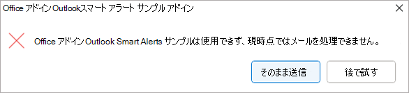
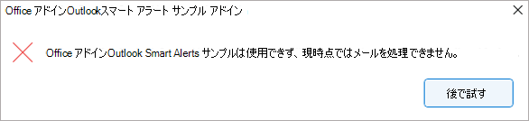
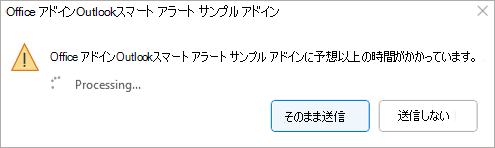
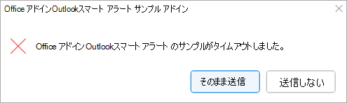

# <a name="use-smart-alerts-and-the-onmessagesend-and-onappointmentsend-events-in-your-outlook-add-in-preview"></a>Outlook アドインでスマート アラートと OnMessageSend イベントと OnAppointmentSend イベントを使用する (プレビュー)

イベント`OnMessageSend`と`OnAppointmentSend`スマート アラートを利用すると、ユーザーがメッセージまたは予定で **[送信**] を選択した後にロジックを実行Outlookできます。 イベント ハンドラーを使用すると、ユーザーが送信される前にメールや会議の招待を改善する機会をユーザーに提供できます。

次のチュートリアルでは、このイベントを使用します `OnMessageSend` 。 このチュートリアルの最後には、メッセージが送信されるたびに実行されるアドインがあり、ユーザーが電子メールで言及したドキュメントまたは画像を追加するのを忘れたかどうかを確認します。

> [!IMPORTANT]
> イベントと`OnAppointmentSend`イベントは`OnMessageSend`、WindowsのOutlookのMicrosoft 365 サブスクリプションでのみプレビューで利用できます。 詳細については、「 [プレビューする方法」を](autolaunch.md#how-to-preview)参照してください。 プレビュー イベントは、運用環境のアドインでは使用しないでください。

## <a name="prerequisites"></a>前提条件

イベントは `OnMessageSend` 、イベント ベースのアクティブ化機能を使用して使用できます。 この機能を使用するようにアドインを構成する方法については、使用可能なその他のイベントの使用、このイベントのプレビューの構成、アドインのデバッグなどを行う方法については、「[イベント ベースのアクティブ化のためにOutlook アドインを構成する](autolaunch.md)」を参照してください。

## <a name="set-up-your-environment"></a>環境を設定する

[Outlookクイック スタート](../quickstarts/outlook-quickstart.md?tabs=yeomangenerator)を完了します。これにより、Office アドイン用の Yeoman ジェネレーターを使用してアドイン プロジェクトが作成されます。

## <a name="configure-the-manifest"></a>マニフェストを構成する

1. コード エディターで、クイック スタート プロジェクトを開きます。

1. プロジェクトのルートにある **manifest.xml** ファイルを開きます。

1. **VersionOverrides** ノード全体 (オープン タグとクローズ タグを含む) を選択し、次の XML に置き換えてから、変更を保存します。

```XML
<VersionOverrides xmlns="http://schemas.microsoft.com/office/mailappversionoverrides" xsi:type="VersionOverridesV1_0">
  <VersionOverrides xmlns="http://schemas.microsoft.com/office/mailappversionoverrides/1.1" xsi:type="VersionOverridesV1_1">
    <Requirements>
      <bt:Sets DefaultMinVersion="1.3">
        <bt:Set Name="Mailbox" />
      </bt:Sets>
    </Requirements>
    <Hosts>
      <Host xsi:type="MailHost">
        <!-- Event-based activation happens in a lightweight runtime.-->
        <Runtimes>
          <!-- HTML file including reference to or inline JavaScript event handlers.
               This is used by Outlook on the web and on the new Mac UI. -->
          <Runtime resid="WebViewRuntime.Url">
            <!-- JavaScript file containing event handlers. This is used by Outlook Desktop. -->
            <Override type="javascript" resid="JSRuntime.Url"/>
          </Runtime>
        </Runtimes>
        <DesktopFormFactor>
          <FunctionFile resid="Commands.Url" />
          <ExtensionPoint xsi:type="MessageReadCommandSurface">
            <OfficeTab id="TabDefault">
              <Group id="msgReadGroup">
                <Label resid="GroupLabel" />
                <Control xsi:type="Button" id="msgReadOpenPaneButton">
                  <Label resid="TaskpaneButton.Label" />
                  <Supertip>
                    <Title resid="TaskpaneButton.Label" />
                    <Description resid="TaskpaneButton.Tooltip" />
                  </Supertip>
                  <Icon>
                    <bt:Image size="16" resid="Icon.16x16" />
                    <bt:Image size="32" resid="Icon.32x32" />
                    <bt:Image size="80" resid="Icon.80x80" />
                  </Icon>
                  <Action xsi:type="ShowTaskpane">
                    <SourceLocation resid="Taskpane.Url" />
                  </Action>
                </Control>
                <Control xsi:type="Button" id="ActionButton">
                  <Label resid="ActionButton.Label"/>
                  <Supertip>
                    <Title resid="ActionButton.Label"/>
                    <Description resid="ActionButton.Tooltip"/>
                  </Supertip>
                  <Icon>
                    <bt:Image size="16" resid="Icon.16x16"/>
                    <bt:Image size="32" resid="Icon.32x32"/>
                    <bt:Image size="80" resid="Icon.80x80"/>
                  </Icon>
                  <Action xsi:type="ExecuteFunction">
                    <FunctionName>action</FunctionName>
                  </Action>
                </Control>
              </Group>
            </OfficeTab>
          </ExtensionPoint>

          <!-- Can configure other command surface extension points for add-in command support. -->

          <!-- Enable launching the add-in on the included event. -->
          <ExtensionPoint xsi:type="LaunchEvent">
            <LaunchEvents>
              <LaunchEvent Type="OnMessageSend" FunctionName="onMessageSendHandler" SendMode="PromptUser" />
            </LaunchEvents>
            <!-- Identifies the runtime to be used (also referenced by the Runtime element). -->
            <SourceLocation resid="WebViewRuntime.Url"/>
          </ExtensionPoint>
        </DesktopFormFactor>
      </Host>
    </Hosts>
    <Resources>
      <bt:Images>
        <bt:Image id="Icon.16x16" DefaultValue="https://localhost:3000/assets/icon-16.png"/>
        <bt:Image id="Icon.32x32" DefaultValue="https://localhost:3000/assets/icon-32.png"/>
        <bt:Image id="Icon.80x80" DefaultValue="https://localhost:3000/assets/icon-80.png"/>
      </bt:Images>
      <bt:Urls>
        <bt:Url id="Commands.Url" DefaultValue="https://localhost:3000/commands.html" />
        <bt:Url id="Taskpane.Url" DefaultValue="https://localhost:3000/taskpane.html" />
        <bt:Url id="WebViewRuntime.Url" DefaultValue="https://localhost:3000/commands.html" />
        <!-- Entry needed for Outlook Desktop. -->
        <bt:Url id="JSRuntime.Url" DefaultValue="https://localhost:3000/launchevent.js" />
      </bt:Urls>
      <bt:ShortStrings>
        <bt:String id="GroupLabel" DefaultValue="Contoso Add-in"/>
        <bt:String id="TaskpaneButton.Label" DefaultValue="Show Taskpane"/>
        <bt:String id="ActionButton.Label" DefaultValue="Perform an action"/>
      </bt:ShortStrings>
      <bt:LongStrings>
        <bt:String id="TaskpaneButton.Tooltip" DefaultValue="Opens a pane displaying all available properties."/>
        <bt:String id="ActionButton.Tooltip" DefaultValue="Perform an action when clicked."/>
      </bt:LongStrings>
    </Resources>
  </VersionOverrides>
</VersionOverrides>
```

> [!TIP]
>
> - イベントで`OnMessageSend``OnAppointmentSend`使用できる **SendMode** オプションについては、「[使用可能な SendMode オプション](/javascript/api/manifest/launchevent#available-sendmode-options-preview)」を参照してください。
> - Outlook アドインのマニフェストの詳細については、[アドイン マニフェストのOutlook](manifests.md)を参照してください。

## <a name="implement-event-handling"></a>イベント処理を実装する

選択したイベントの処理を実装する必要があります。

このシナリオでは、メッセージを送信するための処理を追加します。 アドインは、メッセージ内の特定のキーワードを確認します。 これらのキーワードのいずれかが見つかった場合は、添付ファイルがあるかどうかを確認します。 添付ファイルがない場合は、不足している可能性がある添付ファイルを追加することをお勧めします。

1. 同じクイック スタート プロジェクトから、**./src** ディレクトリの下に **launchevent** という名前の新しいフォルダーを作成します。

1. **./src/launchevent** フォルダーに、launchevent.jsという名前の新しいファイル **を** 作成します。

1. コード エディターで **./src/launchevent/launchevent.js** ファイルを開き、次の JavaScript コードを追加します。

    ```js
    /*
    * Copyright (c) Microsoft Corporation. All rights reserved. Licensed under the MIT license.
    * See LICENSE in the project root for license information.
    */

    function onMessageSendHandler(event) {
      Office.context.mailbox.item.body.getAsync(
        "text",
        { asyncContext: event },
        getBodyCallback
      );
    }

    function getBodyCallback(asyncResult){
      let event = asyncResult.asyncContext;
      let body = "";
      if (asyncResult.status !== Office.AsyncResultStatus.Failed && asyncResult.value !== undefined) {
        body = asyncResult.value;
      } else {
        let message = "Failed to get body text";
        console.error(message);
        event.completed({ allowEvent: false, errorMessage: message });
        return;
      }

      let matches = hasMatches(body);
      if (matches) {
        Office.context.mailbox.item.getAttachmentsAsync(
          { asyncContext: event },
          getAttachmentsCallback);
      } else {
        event.completed({ allowEvent: true });
      }
    }

    function hasMatches(body) {
      if (body == null || body == "") {
        return false;
      }

      const arrayOfTerms = ["send", "picture", "document", "attachment"];
      for (let index = 0; index < arrayOfTerms.length; index++) {
        const term = arrayOfTerms[index].trim();
        const regex = RegExp(term, 'i');
        if (regex.test(body)) {
          return true;
        }
      }

      return false;
    }

    function getAttachmentsCallback(asyncResult) {
      let event = asyncResult.asyncContext;
      if (asyncResult.value.length > 0) {
        for (let i = 0; i < asyncResult.value.length; i++) {
          if (asyncResult.value[i].isInline == false) {
            event.completed({ allowEvent: true });
            return;
          }
        }

        event.completed({ allowEvent: false, errorMessage: "Looks like you forgot to include an attachment?" });
      } else {
        event.completed({ allowEvent: false, errorMessage: "Looks like you're forgetting to include an attachment?" });
      }
    }

    // 1st parameter: FunctionName of LaunchEvent in the manifest; 2nd parameter: Its implementation in this .js file.
    Office.actions.associate("onMessageSendHandler", onMessageSendHandler);
    ```

1. 変更内容を保存します。

## <a name="update-webpack-config-settings"></a>Webpackの機能設定を更新する

1. プロジェクトのルート ディレクトリにある **webpack.config.js** ファイルを開き、次の手順を実行します。

1. オブジェクト内の `plugins` 配列を `config` 見つけて、この新しいオブジェクトを配列の先頭に追加します。

    ```js
    new CopyWebpackPlugin({
      patterns: [
        {
          from: "./src/launchevent/launchevent.js",
          to: "launchevent.js",
        },
      ],
    }),
    ```

1. 変更内容を保存します。

## <a name="try-it-out"></a>試してみる

1. プロジェクトのルート ディレクトリで次のコマンドを実行します。 実行 `npm start`すると、ローカル Web サーバーが起動し (まだ実行されていない場合)、アドインはサイドロードされます。

    ```command&nbsp;line
    npm run build
    ```

    ```command&nbsp;line
    npm start
    ```

    > [!NOTE]
    > アドインが自動的にサイドロードされなかった場合は、[テスト用の Sideload Outlook アドインの](../outlook/sideload-outlook-add-ins-for-testing.md#sideload-manually)手順に従ってアドインを手動でサイドロードOutlookします。

1. WindowsのOutlookで、新しいメッセージを作成し、件名を設定します。 本文に、"ねえ、犬のこの写真を確認してください"などのテキストを追加します。
1. メッセージを送信します。 添付ファイルを追加するための推奨事項がダイアログに表示されます。

    

1. 添付ファイルを追加してから、メッセージをもう一度送信します。 今回は警告は表示されません。

## <a name="smart-alerts-feature-behavior-and-scenarios"></a>スマート アラート機能の動作とシナリオ

**SendMode** オプションの説明と、使用するタイミングに関する推奨事項については、「[使用可能な SendMode オプション](/javascript/api/manifest/launchevent)」を参照してください。 次に、特定のシナリオに対する機能の動作について説明します。

### <a name="add-in-is-unavailable"></a>アドインは使用できません

メッセージまたは予定の送信中にアドインを使用できない場合 (アドインの読み込みを妨げるエラーが発生するなど)、ユーザーに警告が表示されます。 ユーザーが使用できるオプションは、アドインに適用される **SendMode** オプションによって異なります。

このオプションを`SoftBlock`使用する`PromptUser`場合、ユーザーは [**Send Anyway]** を選択してアドインをチェックせずにアイテムを送信するか、[後で **試す**] を選択して、アドインが再び使用可能になったときにアイテムを確認できるようにします。



このオプションが `Block` 使用されている場合、ユーザーはアドインが使用可能になるまでアイテムを送信できません。



### <a name="long-running-add-in-operations"></a>実行時間の長いアドイン操作

アドインが 5 秒を超えて実行され、5 分未満の場合は、メッセージまたは予定の処理にアドインが予想以上に時間がかかっていることがユーザーに通知されます。

このオプションを `PromptUser` 使用する場合、ユーザーは **[送信方法** ] を選択して、アドインがチェックを完了せずにアイテムを送信できます。 または、ユーザーは [ **送信しない** ] を選択して、アドインの処理を停止することもできます。



ただし、または`Block`オプションを使用する`SoftBlock`場合、アドインの処理が完了するまで、ユーザーはアイテムを送信できません。


`OnMessageSend` アドイン `OnAppointmentSend` は、実行時間が短く軽量である必要があります。 実行時間の長い操作ダイアログを回避するには、他のイベントを使用して、または`OnAppointmentSend`イベントがアクティブ化される前に条件付きチェックを`OnMessageSend`処理します。 たとえば、ユーザーがすべてのメッセージまたは予定の添付ファイルを暗号化する必要がある場合は、そのイベントを`OnAppointmentAttachmentsChanged`使用して`OnMessageAttachmentsChanged`チェックを実行することを検討してください。

### <a name="add-in-timed-out"></a>アドインがタイムアウトしました

アドインが 5 分以上実行されると、タイムアウトになります。このオプションを `PromptUser` 使用する場合、ユーザーは **[送信方法** ] を選択して、アドインがチェックを完了せずにアイテムを送信できます。 または、ユーザーは **[送信しない**] を選択できます。



または`Block`オプションが`SoftBlock`使用されている場合、ユーザーはアドインがチェックを完了するまでアイテムを送信できません。 ユーザーは、アドインを再アクティブ化するためにアイテムをもう一度送信する必要があります。


## <a name="limitations"></a>制限事項

`OnMessageSend`イベントと`OnAppointmentSend`イベントはイベント ベースのアクティブ化機能によってサポートされるため、これらのイベントの結果としてアクティブ化されるアドインにも同じ機能制限が適用されます。 これらの制限事項の説明については、 [イベント ベースのアクティブ化の動作と制限事項に関するセクションを](autolaunch.md#event-based-activation-behavior-and-limitations)参照してください。

これらの制約に加えて、マニフェストで宣言できるインスタンスと`OnAppointmentSend`イベントはそれぞれ `OnMessageSend` 1 つだけです。 複数 `OnMessageSend` のイベントが `OnAppointmentSend` 必要な場合は、個別のマニフェストまたはアドインでそれぞれを宣言する必要があります。

event.completed メソッドの [errorMessage プロパティ](/javascript/api/office/office.addincommands.eventcompletedoptions) を使用して、アドイン シナリオに合わせてスマート アラート ダイアログ メッセージを変更できますが、次をカスタマイズすることはできません。

- ダイアログのタイトル バー。 アドインの名前は常にそこに表示されます。
- メッセージの形式。 たとえば、テキストのフォント サイズと色を変更したり、箇条書きを挿入したりすることはできません。
- ダイアログ オプション。 たとえば、[ **送信] オプション** と **[送信しない** ] オプションは固定され、選択した [SendMode オプション](/javascript/api/manifest/launchevent) に依存します。
- イベント ベースのアクティブ化処理と進行状況の情報ダイアログ。 たとえば、タイムアウトと実行時間の長い操作ダイアログに表示されるテキストとオプションは変更できません。

## <a name="see-also"></a>関連項目

- [Outlook アドインのマニフェスト](manifests.md)
- [イベント ベースのアクティブ化のためにOutlook アドインを構成する](autolaunch.md)
- [イベント ベースのアドインをデバッグする方法](debug-autolaunch.md)
- [イベント ベースのOutlook アドインの AppSource 一覧表示オプション](autolaunch-store-options.md)
- [Office アドインのコード サンプル: スマート アラートOutlook使用する](https://github.com/OfficeDev/Office-Add-in-samples/tree/main/Samples/outlook-check-item-categories)
