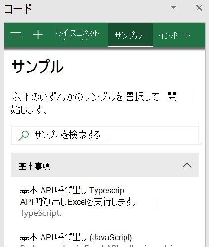
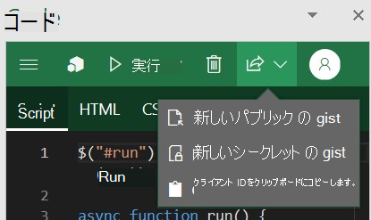
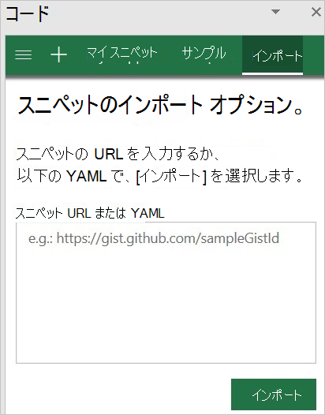

# Script Lab を使用して Office JavaScript API を探索する

AppSource から無料で入手できる [Script Lab](https://appsource.microsoft.com/product/office/WA104380862) および [Outlook 用 Script Lab](https://appsource.microsoft.com/product/office/WA200001603) アドインを使用すると、Excel や Outlook などの Office プログラムでの作業中に Office JavaScript API を調査できます。 Script Lab は、独自のアドインで必要な機能のプロトタイプを作成して検証するときに、開発ツールキットに追加する便利なツールです。

## Script Lab とは

Script Lab は、Excel、Outlook、Word、PowerPoint で Office JavaScript API を使用して Office アドインを開発する方法を学習したい人のためのツールです。 IntelliSense を提供しているので、何が利用できるのかを見ることができ、Visual Studio Code で使用されているのと同じフレームワークである Monaco フレームワークの上に構築されています。 Script Lab では、サンプルのライブラリにアクセスして、簡単に機能を試すことができます。また、独自のコードの開始点としてサンプルを使用することもできます。 Script Lab を使用して、プレビュー API を試すこともできます。

いかがでしたか? この 1 分間のビデオを見て、Script Lab の動作を確認します。

## 主な機能

Script Lab には、Office JavaScript API およびプロトタイプ アドインの機能の調査に役立つ機能が多数用意されています。

### サンプルの確認

API を使用してタスクを完了する方法を示す組み込みのサンプル スニペットのコレクションを使用してすぐに開始できます。 サンプルを実行すると、作業ウィンドウまたはドキュメントですばやく結果を表示したり、API のしくみをサンプルで確認して学んだり、独自のアドインのプロトタイプにサンプルを使用したりもできます。

### コードとスタイル

Office JS API を呼び出す JavaScript または TypeScript コードに加えて、各スニペットには、作業ウィンドウのコンテンツを定義する HTML マークアップと、作業ウィンドウの外観を定義する CSS も含まれています。 HTML マークアップと CSS をカスタマイズして、独自のアドインの作業ウィンドウ デザインのプロトタイプを作成する際に、要素の配置とスタイル設定を試すことができます。

> [!TIP]
> スニペット内でプレビュー API を呼び出すには、スニペットのライブラリを更新して、ベータ コンテンツ ネットワーク (CDN) (`https://appsforoffice.microsoft.com/lib/beta/hosted/office.js`) とプレビューの種類の定義 `@types/office-js-preview` を使用する必要があります。 また、一部のプレビュー API は、[Office Insider プログラム](https://insider.office.com)にサインアップして、Insider ビルドの Office を実行している場合にのみアクセスできます。

### スニペットの保存と共有

既定では、Script Lab で開いたスニペットはブラウザーのキャッシュに保存されます。 スニペットを完全に保存するには、そのスニペットを [GitHub の Gist](https://gist.github.com) にエクスポートします。 自分専用にスニペットを保存するには、秘密の Gist を作成するか、他のユーザーと共有する予定がある場合はパブリックの Gist を作成します。

### スニペットのインポート

スニペット YAML が保存されているパブリック [ GitHub の Gist ](https://gist.github.com) に URL を指定するか、スニペットの完全な YAML を貼り付けて、スニペットを Script Lab にインポートできます。 この機能は、GitHub の Gist にスニペットを公開するか、スニペットの YAML を提供すると、他のユーザーがスニペットを自分と共有しているシナリオで役立ちます。

## サポートされるクライアント

Script Lab は、次のクライアント上の Excel、Word、PowerPoint でサポートされています。

- Microsoft 365 Office サブスクリプション
- Mac での Office 2016 以降
- Office on the web

Outlook 用 Script Lab は、次のクライアントで使用できます。

- Microsoft 365 Office サブスクリプション
- Mac 用 Outlook 2016 以降
- Chrome、Microsoft Edge、または Safari ブラウザーを使用している場合の Outlook on the web

Outlook 用 Script Lab の詳細については、関連する[ブログの投稿](https://developer.microsoft.com/outlook/blogs/script-lab-now-supports-outlook/)を参照してください。

> [!IMPORTANT]
> Script Lab は、Internet Explorer を使ってアドインをホストするプラットフォームと Office バージョンの組み合わせで動作しなくなりました。これには、Office 2019 までの 1 回限りの購入の Office のバージョンが含まれます。詳細については、「[Office アドインによって使用されるブラウザー](../concepts/browsers-used-by-office-web-add-ins.md)」を参照してください。

## 次の手順

Excel、Word、または PowerPoint で Script Lab を使用するには、AppSource から [Script Lab アドイン](https://appsource.microsoft.com/product/office/WA104380862)をインストールします。

Outlook 用 Script Lab を使用するには、AppSource から [Outlook 用 Script Lab のアドイン](https://appsource.microsoft.com/product/office/wa200001603)をインストールします。

新しいスニペットを [office-js-snippets](https://github.com/OfficeDev/office-js-snippets#office-js-snippets) GitHub リポジトリに投稿し、Script Lab のサンプル ライブラリを拡張してください。

最初の Office アドインを作成する準備ができたら、[Excel](../quickstarts/excel-quickstart-jquery.md)、[Outlook](../quickstarts/outlook-quickstart.md)、[Word](../quickstarts/word-quickstart.md)、[OneNote ](../quickstarts/onenote-quickstart.md)、[PowerPoint](../quickstarts/powerpoint-quickstart.md)、または [Project](../quickstarts/project-quickstart.md) のクイック スタートを試してください。

## 関連項目

- [Excel、Word、または Powerpoint 用 Script Lab を取得する](https://appsource.microsoft.com/product/office/WA104380862)
- [Outlook 用 Script Lab を取得する](https://appsource.microsoft.com/product/office/wa200001603)
- [Script Lab の詳細情報](https://github.com/OfficeDev/script-lab#script-lab-a-microsoft-garage-project)
- [Microsoft 365 開発者プログラムに参加する](https://developer.microsoft.com/office/dev-program)
- [Office アドインを開発する](../develop/develop-overview.md)
- [Microsoft 365 開発者プログラムについて](https://developer.microsoft.com/microsoft-365/dev-program)
