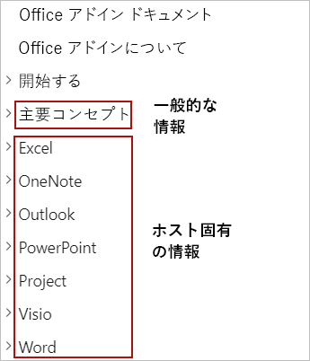

# <a name="building-office-add-ins"></a><span data-ttu-id="83ed5-103">Office アドインの構築</span><span class="sxs-lookup"><span data-stu-id="83ed5-103">Building Office Add-ins</span></span>

> [!TIP]
> <span data-ttu-id="83ed5-104">この記事を読む前に、「[Office Add-ins platform overview (Office アドイン プラットフォームの概要)](office-add-ins.md)」をご覧ください。</span><span class="sxs-lookup"><span data-stu-id="83ed5-104">Please review [Office Add-ins platform overview](office-add-ins.md) before reading this article.</span></span>

<span data-ttu-id="83ed5-105">Office アドインは、Office アプリケーションの UI と機能を拡張し、Office ドキュメント内のコンテンツを操作します。</span><span class="sxs-lookup"><span data-stu-id="83ed5-105">Office Add-ins extend the UI and functionality of Office applications and interact with content in Office documents.</span></span> <span data-ttu-id="83ed5-106">Word、Excel、PowerPoint、OneNote、Project、Outlook の拡張と操作を行うアドインの構築には、一般的な Web テクノロジを使用します。</span><span class="sxs-lookup"><span data-stu-id="83ed5-106">You'll use familiar web technologies to create Office Add-ins that extend and interact with Word, Excel, PowerPoint, OneNote, Project, or Outlook.</span></span> <span data-ttu-id="83ed5-107">構築するアドインは、Windows、Mac、iPad やブラウザー上など、複数のプラットフォーム上の Office で実行できます。</span><span class="sxs-lookup"><span data-stu-id="83ed5-107">The add-ins you build can run in Office across multiple platforms, including Windows, Mac, iPad, and in a browser.</span></span> <span data-ttu-id="83ed5-108">この記事では、Office アドイン開発の概要を説明します。</span><span class="sxs-lookup"><span data-stu-id="83ed5-108">This article provides an introduction to developing Office Add-ins.</span></span>

## <a name="creating-an-office-add-in"></a><span data-ttu-id="83ed5-109">Office アドインの作成</span><span class="sxs-lookup"><span data-stu-id="83ed5-109">Creating an Office Add-in</span></span> 

<span data-ttu-id="83ed5-110">Office アドイン用の Yeoman ジェネレーターまたは Visual Studio を使用して Office アドインを作成することができます。</span><span class="sxs-lookup"><span data-stu-id="83ed5-110">You can create an Office Add-in by using the Yeoman generator for Office Add-ins or Visual Studio.</span></span>

### <a name="yeoman-generator-for-office-add-ins"></a><span data-ttu-id="83ed5-111">Office アドイン用の Yeoman ジェネレーター</span><span class="sxs-lookup"><span data-stu-id="83ed5-111">Yeoman generator for Office Add-ins</span></span>

<span data-ttu-id="83ed5-112">[Office アドイン用の Yeoman ジェネレーター](https://github.com/officedev/generator-office)を使用することで、Visual Studio Code やその他のエディターで管理することができる、Node.js Office アドイン プロジェクトを作成できます。</span><span class="sxs-lookup"><span data-stu-id="83ed5-112">The [Yeoman generator for Office Add-ins](https://github.com/officedev/generator-office) can be used to create a Node.js Office Add-in project that can be managed with Visual Studio Code or any other editor.</span></span> <span data-ttu-id="83ed5-113">ジェネレーターでは、次のいずれのホスト用の Office アドインも作成できます。</span><span class="sxs-lookup"><span data-stu-id="83ed5-113">The generator can create Office Add-ins for any of the following:</span></span>

- <span data-ttu-id="83ed5-114">Excel</span><span class="sxs-lookup"><span data-stu-id="83ed5-114">Excel</span></span>
- <span data-ttu-id="83ed5-115">OneNote</span><span class="sxs-lookup"><span data-stu-id="83ed5-115">OneNote</span></span>
- <span data-ttu-id="83ed5-116">Outlook</span><span class="sxs-lookup"><span data-stu-id="83ed5-116">Outlook</span></span>
- <span data-ttu-id="83ed5-117">PowerPoint</span><span class="sxs-lookup"><span data-stu-id="83ed5-117">PowerPoint</span></span>
- <span data-ttu-id="83ed5-118">Project</span><span class="sxs-lookup"><span data-stu-id="83ed5-118">Project</span></span>
- <span data-ttu-id="83ed5-119">Word</span><span class="sxs-lookup"><span data-stu-id="83ed5-119">Word</span></span>
- <span data-ttu-id="83ed5-120">Excel のカスタム関数</span><span class="sxs-lookup"><span data-stu-id="83ed5-120">Excel custom functions</span></span>

<span data-ttu-id="83ed5-121">プロジェクトを作成するのに、HTML、CSS、および JavaScript を使用するのか、Angular または React を使用するのかを選択できます。</span><span class="sxs-lookup"><span data-stu-id="83ed5-121">You can choose to create the project using HTML, CSS and JavaScript, or using Angular or React.</span></span> <span data-ttu-id="83ed5-122">いずれのフレームワークを選択した場合も、JavaScript と Typescript の間から選択することができます。</span><span class="sxs-lookup"><span data-stu-id="83ed5-122">For whichever framework you choose, you can choose between JavaScript and Typescript as well.</span></span> <span data-ttu-id="83ed5-123">Yeoman ジェネレーターを使用してアドインを作成する方法については、「[Visual Studio Code を使用して Office アドインを開発する](../develop/develop-add-ins-vscode.md)」を参照してください。</span><span class="sxs-lookup"><span data-stu-id="83ed5-123">For more information about creating add-ins with the Yeoman generator, see [Develop Office Add-ins with Visual Studio Code](../develop/develop-add-ins-vscode.md).</span></span>

### <a name="visual-studio"></a><span data-ttu-id="83ed5-124">Visual Studio</span><span class="sxs-lookup"><span data-stu-id="83ed5-124">Visual Studio</span></span>

<span data-ttu-id="83ed5-125">Visual Studio は、Excel、Outlook、Word、および PowerPoint 用の Office アドインの作成に使用できます。</span><span class="sxs-lookup"><span data-stu-id="83ed5-125">Visual Studio can be used to create Office Add-ins for Excel, Outlook, Word, and PowerPoint.</span></span> <span data-ttu-id="83ed5-126">Office アドイン プロジェクトは Visual Studio ソリューションの一部として作成され、HTML、CSS、および JavaScript が使用されます。</span><span class="sxs-lookup"><span data-stu-id="83ed5-126">An Office Add-in project gets created as part of a Visual Studio solution and uses HTML, CSS, and JavaScript.</span></span> <span data-ttu-id="83ed5-127">Visual Studio を使用してアドインを作成する方法については、「[Visual Studio を使用して Office アドインを開発する](../develop/develop-add-ins-visual-studio.md)」を参照してください。</span><span class="sxs-lookup"><span data-stu-id="83ed5-127">For more information about creating add-ins with Visual Studio, see [Develop Office Add-ins with Visual Studio](../develop/develop-add-ins-visual-studio.md).</span></span>

[!include[Yeoman vs Visual Studio comparision](../includes/yeoman-generator-recommendation.md)]

## <a name="exploring-apis-with-script-lab"></a><span data-ttu-id="83ed5-128">Script Lab を使用して API を調べる</span><span class="sxs-lookup"><span data-stu-id="83ed5-128">Exploring APIs with Script Lab</span></span>

<span data-ttu-id="83ed5-129">Script Lab は、Excel や Word などの Office プログラムでの作業中に Office JavaScript API を調査し、コード スニペットを実行できるようにするアドインです。</span><span class="sxs-lookup"><span data-stu-id="83ed5-129">Script Lab is an add-in that enables you to explore the Office JavaScript API and run code snippets while you're working in an Office program such as Excel or Word.</span></span> <span data-ttu-id="83ed5-130">これは、[AppSource](https://appsource.microsoft.com/product/office/WA104380862) から無料で利用でき、アドインで必要な機能のプロトタイプを作成したり検証したりする場合に、開発ツールキットに含めておくと便利なツールです。</span><span class="sxs-lookup"><span data-stu-id="83ed5-130">It's available for free via [AppSource](https://appsource.microsoft.com/product/office/WA104380862) and is a useful tool to include in your development toolkit as you prototype and verify the functionality you want in your add-in.</span></span> <span data-ttu-id="83ed5-131">Script Lab では、組み込みのサンプルのライブラリにアクセスして、簡単に API を試すことができます。また、独自のコードの開始点としてサンプルを使用することもできます。</span><span class="sxs-lookup"><span data-stu-id="83ed5-131">In Script Lab, you can access a library of built-in samples to quickly try out APIs or even use a sample as the starting point for your own code.</span></span> 

<span data-ttu-id="83ed5-132">次の 1 分間のビデオで、Script Lab の実際の動作をご覧ください。</span><span class="sxs-lookup"><span data-stu-id="83ed5-132">The following one-minute video shows Script Lab in action.</span></span>

<span data-ttu-id="83ed5-133">[](https://aka.ms/scriptlabvideo)</span><span class="sxs-lookup"><span data-stu-id="83ed5-133">[](https://aka.ms/scriptlabvideo)</span></span>

<span data-ttu-id="83ed5-134">Script Lab の詳細については、「[Script Lab を使用して Office JavaScript API を調べる](../overview/explore-with-script-lab.md)」を参照してください。</span><span class="sxs-lookup"><span data-stu-id="83ed5-134">For more information about Script Lab, see [Explore Office JavaScript APIs using Script Lab](../overview/explore-with-script-lab.md).</span></span>

## <a name="extending-the-office-ui"></a><span data-ttu-id="83ed5-135">Office UI の拡張</span><span class="sxs-lookup"><span data-stu-id="83ed5-135">Extending the Office UI</span></span>

<span data-ttu-id="83ed5-136">Office アドインは、作業ウィンドウ、コンテンツ アドイン、ダイアログ ボックスなど、アドイン コマンドや HTML コンテナーを使用 Office UI を拡張することができます。</span><span class="sxs-lookup"><span data-stu-id="83ed5-136">An Office Add-in can extend the Office UI by using add-in commands and HTML containers such as task panes, content add-ins, or dialog boxes.</span></span>

- <span data-ttu-id="83ed5-137">[アドイン コマンド](../design/add-in-commands.md) を使用すると、Office の既定のリボンにカスタム タブ、ボタン、メニューを追加したり、ユーザーが Office ドキュメント内のテキストまたは Excel 内のオブジェクトを右クリックした際に表示される既定のコンテキスト メニューを拡張したりすることができます。</span><span class="sxs-lookup"><span data-stu-id="83ed5-137">[Add-in commands](../design/add-in-commands.md) can be used to add custom tabs, buttons, and menus to the default ribbon in Office, or to extend the default context menu that appears when users right-click text in an Office document or an object in Excel.</span></span> <span data-ttu-id="83ed5-138">ユーザーがアドイン コマンドを選択すると、アドイン コマンドで指定されているタスク (JavaScript コードの実行、作業ウィンドウを開く、ダイアログ ボックスの起動など) が実行されます。</span><span class="sxs-lookup"><span data-stu-id="83ed5-138">When users select an add-in command, they initiate the task that the add-in command specifies, such as running JavaScript code, opening a task pane, or launching a dialog box.</span></span>

- <span data-ttu-id="83ed5-139">[作業ウィンドウ](../design/task-pane-add-ins.md)、[コンテンツ アドイン](../design/content-add-ins.md)、[ダイアログ ボックス](../design/dialog-boxes.md)などの HTML コンテナーを使用すると、カスタム UI を表示させたり Office アプリケーション内で追加機能を表示させたりすることができます。</span><span class="sxs-lookup"><span data-stu-id="83ed5-139">HTML containers like [task panes](../design/task-pane-add-ins.md), [content add-ins](../design/content-add-ins.md), and [dialog boxes](../design/dialog-boxes.md) can be used to display custom UI and expose additional functionality within an Office application.</span></span> <span data-ttu-id="83ed5-140">各作業ウィンドウ、コンテンツ アドイン、またはダイアログ ボックスのコンテンツと機能は、指定した Web ページに由来します。</span><span class="sxs-lookup"><span data-stu-id="83ed5-140">The content and functionality of each task pane, content add-in, or dialog box derives from a web page that you specify.</span></span> <span data-ttu-id="83ed5-141">これらの Web ページでは、Office JavaScript API を使用することで、アドインが実行されている Office ドキュメントのコンテンツを操作できます。また、外部 Web サービスの呼び出しやユーザー認証の要求など、Web ページが一般的に行うその他の機能も実行できます。</span><span class="sxs-lookup"><span data-stu-id="83ed5-141">Those web pages can use the Office JavaScript API to interact with content in the Office document where the add-in is running, and can also do other things that web pages typically do, like call external web services, facilitate user authentication, and more.</span></span>

<span data-ttu-id="83ed5-142">次の図では、リボン上に表示されるアドイン コマンド、ドキュメント右側に表示される作業ウィンドウ、およびドキュメント上に表示されるダイアログ ボックスまたはコンテンツ アドインを示しています。</span><span class="sxs-lookup"><span data-stu-id="83ed5-142">The following image shows an add-in command in the ribbon, a task pane to the right of the document, and a dialog box or content add-in over the document.</span></span>


<span data-ttu-id="83ed5-144">Office UI の拡張に関する詳細については、「[Office アドイン用の Office UI 要素](../design/interface-elements.md)」を参照してください。</span><span class="sxs-lookup"><span data-stu-id="83ed5-144">For more information about extending the Office UI, see [Office UI elements for Office Add-ins](../design/interface-elements.md).</span></span>

## <a name="core-development-concepts"></a><span data-ttu-id="83ed5-145">開発の中心概念</span><span class="sxs-lookup"><span data-stu-id="83ed5-145">Core development concepts</span></span> 

<span data-ttu-id="83ed5-146">Office アドインは、2 つの部分から構成されます。</span><span class="sxs-lookup"><span data-stu-id="83ed5-146">An Office Add-in consists of two parts:</span></span>

- <span data-ttu-id="83ed5-147">アドインの設定と機能を定義るアドイン マニフェスト (XML ファイル)。</span><span class="sxs-lookup"><span data-stu-id="83ed5-147">The add-in manifest (an XML file) that defines the settings and capabilities of the add-in.</span></span>

- <span data-ttu-id="83ed5-148">作業ウィンドウ、コンテンツ アドイン、ダイアログ ボックスなど、アドインの UI と機能を定義する Web アプリケーション。</span><span class="sxs-lookup"><span data-stu-id="83ed5-148">The web application that defines the UI and functionality of add-in components such as task panes, content add-ins, and dialog boxes.</span></span>

<span data-ttu-id="83ed5-149">Web アプリケーションでは、Office JavaScript API を使用することで、アドインが実行されている Office ドキュメント内のコンテンツを操作します。</span><span class="sxs-lookup"><span data-stu-id="83ed5-149">The web application uses the Office JavaScript API to interact with content in the Office document where the add-in is running.</span></span> <span data-ttu-id="83ed5-150">アドインは、外部 Web サービスの呼び出しやユーザー認証の要求など、Web ページが一般的に行うその他の機能も実行することができます。</span><span class="sxs-lookup"><span data-stu-id="83ed5-150">Your add-in can also do other things that web applications typically do, like call external web services, facilitate user authentication, and more.</span></span>

### <a name="defining-an-add-ins-settings-and-capabilities"></a><span data-ttu-id="83ed5-151">アドインの設定と機能を定義する</span><span class="sxs-lookup"><span data-stu-id="83ed5-151">Defining an add-in's settings and capabilities</span></span>

<span data-ttu-id="83ed5-152">Office アドインのマニフェスト (XML ファイル) は、アドインの設定と機能を定義します。</span><span class="sxs-lookup"><span data-stu-id="83ed5-152">An Office Add-in's manifest (an XML file) defines the settings and capabilities of the add-in.</span></span> <span data-ttu-id="83ed5-153">次のような要素を定義するには、マニフェストを構成します。</span><span class="sxs-lookup"><span data-stu-id="83ed5-153">You'll configure the manifest to specify things such as:</span></span>

- <span data-ttu-id="83ed5-154">アドインを説明するメタデータ (ID、バージョン、説明、表示名、既定のロケールなど)。</span><span class="sxs-lookup"><span data-stu-id="83ed5-154">Metadata that describes the add-in (for example, ID, version, description, display name, default locale).</span></span>
- <span data-ttu-id="83ed5-155">アドインが実行される Office アプリケーション。</span><span class="sxs-lookup"><span data-stu-id="83ed5-155">Office applications where the add-in will run.</span></span>
- <span data-ttu-id="83ed5-156">アドインに必要なアクセス許可。</span><span class="sxs-lookup"><span data-stu-id="83ed5-156">Permissions that the add-in requires.</span></span>
- <span data-ttu-id="83ed5-157">アドインによって作成されるカスタム UI (カスタム タブ、リボンのボタンなど) などの統合も含めた、アドインの Office との統合方法。</span><span class="sxs-lookup"><span data-stu-id="83ed5-157">How the add-in integrates with Office, including any custom UI that the add-in creates (for example, custom tabs, ribbon buttons).</span></span>
- <span data-ttu-id="83ed5-158">ブランドおよびコマンドの図像としてアドインで使用される画像の場所。</span><span class="sxs-lookup"><span data-stu-id="83ed5-158">Location of images that the add-in uses for branding and command iconography.</span></span>
- <span data-ttu-id="83ed5-159">アドインの寸法 (例: コンテンツ アドインの寸法、Outlook アドインに対して要求される高さなど)。</span><span class="sxs-lookup"><span data-stu-id="83ed5-159">Dimensions of the add-in (for example, dimensions for content add-ins, requested height for Outlook add-ins).</span></span>
- <span data-ttu-id="83ed5-160">メッセージや予定のコンテキストでアドインをアクティブにさせるタイミングを指定するルール (Outlook アドインのみ)。</span><span class="sxs-lookup"><span data-stu-id="83ed5-160">Rules that specify when the add-in activates in the context of a message or appointment (for Outlook add-ins only).</span></span>

<span data-ttu-id="83ed5-161">マニフェストの詳細については、「[Office アドインの XML マニフェスト](add-in-manifests.md)」を参照してください。</span><span class="sxs-lookup"><span data-stu-id="83ed5-161">For detailed information about the manifest, see [Office Add-ins XML manifest](add-in-manifests.md).</span></span>

### <a name="interacting-with-content-in-an-office-document"></a><span data-ttu-id="83ed5-162">Office ドキュメント内のコンテンツを操作する</span><span class="sxs-lookup"><span data-stu-id="83ed5-162">Interacting with content in an Office document</span></span>

<span data-ttu-id="83ed5-163">Office アドインでは、Office JavaScript API を使用することで、アドインが実行されている Office ドキュメント内のコンテンツを操作できます。</span><span class="sxs-lookup"><span data-stu-id="83ed5-163">An Office Add-in can use the Office JavaScript APIs to interact with content in the Office document where the add-in is running.</span></span> 

#### <a name="accessing-the-office-javascript-library"></a><span data-ttu-id="83ed5-164">Office JavaScript API へのアクセス</span><span class="sxs-lookup"><span data-stu-id="83ed5-164">Accessing the Office JavaScript library</span></span>

<span data-ttu-id="83ed5-165">Office JavaScript ライブラリには、`https://appsforoffice.microsoft.com/lib/1/hosted/Office.js` にある Office JS コンテンツ配信ネットワーク (CDN) を経由してアクセスできます。</span><span class="sxs-lookup"><span data-stu-id="83ed5-165">The Office JavaScript library can be accessed via the Office JS content delivery network (CDN) at: `https://appsforoffice.microsoft.com/lib/1/hosted/Office.js`.</span></span> <span data-ttu-id="83ed5-166">アドインの Web ページで Office JavaScript API を使用するには、ページの `<head>` タグにある `<script>` タグに含まれている CDN を参照する必要があります。</span><span class="sxs-lookup"><span data-stu-id="83ed5-166">To use Office JavaScript APIs within any of your add-in's web pages, you must reference the CDN in a `<script>` tag in the `<head>` tag of the page.</span></span>

```html
<head>
    ...
    <script src="https://appsforoffice.microsoft.com/lib/1/hosted/Office.js" type="text/javascript"></script>
</head>
```

> [!NOTE]
> <span data-ttu-id="83ed5-167">プレビュー API を使用するには、CDN (https://appsforoffice.microsoft.com/lib/beta/hosted/office.js) にある Office JavaScript ライブラリのプレビュー バージョンを参照します。</span><span class="sxs-lookup"><span data-stu-id="83ed5-167">To use preview APIs, reference the preview version of the Office JavaScript library on the CDN: https://appsforoffice.microsoft.com/lib/beta/hosted/office.js.</span></span>

<span data-ttu-id="83ed5-168">IntelliSense の入手方法など、Office JavaScript ライブラリにアクセスする方法の詳細については、「[JavaScript API for Office ライブラリをそのコンテンツ配信ネットワーク (CDN) から参照する](../develop/referencing-the-javascript-api-for-office-library-from-its-cdn.md)」をご覧ください。</span><span class="sxs-lookup"><span data-stu-id="83ed5-168">For more information about accessing the Office JavaScript library, including how to get IntelliSense, see [Referencing the JavaScript API for Office library from its content delivery network (CDN)](../develop/referencing-the-javascript-api-for-office-library-from-its-cdn.md).</span></span>

#### <a name="api-models"></a><span data-ttu-id="83ed5-169">API モデル</span><span class="sxs-lookup"><span data-stu-id="83ed5-169">API models</span></span>

<span data-ttu-id="83ed5-170">Office JavaScript API には、2 つの異なるモデルがあります。</span><span class="sxs-lookup"><span data-stu-id="83ed5-170">The Office JavaScript APIs include two distinct models:</span></span>

- <span data-ttu-id="83ed5-171">**ホスト固有** API では、特定の Office アプリケーションにネイティブなオブジェクトを操作するために使用できる、厳密に型指定されたオブジェクトが提供されます。</span><span class="sxs-lookup"><span data-stu-id="83ed5-171">**Host-specific** APIs provide strongly-typed objects that can be used to interact with objects that are native to a specific Office application.</span></span> <span data-ttu-id="83ed5-172">たとえば、Excel JavaScript API を使用して、ワークシート、範囲、テーブル、グラフなどにアクセスすることができます。</span><span class="sxs-lookup"><span data-stu-id="83ed5-172">For example, you can use the Excel JavaScript APIs to access worksheets, ranges, tables, charts, and more.</span></span> <span data-ttu-id="83ed5-173">ホスト固有API は現在、[Excel](../reference/overview/excel-add-ins-reference-overview.md)、[Word](../reference/overview/word-add-ins-reference-overview.md)、および [OneNote](../reference/overview/onenote-add-ins-javascript-reference.md) 用に使用できます。</span><span class="sxs-lookup"><span data-stu-id="83ed5-173">Host-specific APIs are currently available for [Excel](../reference/overview/excel-add-ins-reference-overview.md), [Word](../reference/overview/word-add-ins-reference-overview.md), and [OneNote](../reference/overview/onenote-add-ins-javascript-reference.md).</span></span> <span data-ttu-id="83ed5-174">この API モデルでは [Promise](https://developer.mozilla.org/docs/Web/JavaScript/Reference/Global_Objects/Promise) が使用され、Office ホストに送信する各要求で複数の操作を指定することが可能です。</span><span class="sxs-lookup"><span data-stu-id="83ed5-174">This API model uses [promises](https://developer.mozilla.org/docs/Web/JavaScript/Reference/Global_Objects/Promise) and allows you to specify multiple operations in each request you send to the Office host.</span></span> <span data-ttu-id="83ed5-175">この方法によるバッチ操作を行うと、Office on the web アプリケーションのパフォーマンスが大幅に向上します。</span><span class="sxs-lookup"><span data-stu-id="83ed5-175">Batching operations in this manner can significantly improve add-in performance in Office on the web applications.</span></span> <span data-ttu-id="83ed5-176">ホスト固有の API は Office 2016 で導入されました。Office 2013 の操作には使用できません。</span><span class="sxs-lookup"><span data-stu-id="83ed5-176">Host-specific APIs were introduced with Office 2016 and cannot be used to interact with Office 2013.</span></span>

- <span data-ttu-id="83ed5-177">**共通 API** を使用すると、複数の種類の Office アプリケーション間で共通の UI、ダイアログ、クライアント設定などの機能にアクセスすることができます。</span><span class="sxs-lookup"><span data-stu-id="83ed5-177">**Common** APIs can be used to access features such as UI, dialogs, and client settings that are common across multiple types of Office applications.</span></span> <span data-ttu-id="83ed5-178">この API モデルでは [Callback](https://developer.mozilla.org/docs/Glossary/Callback_function) が使用され、Office ホストに送信する各要求で指定できる操作は、1 つのみです。</span><span class="sxs-lookup"><span data-stu-id="83ed5-178">This API model uses [callbacks](https://developer.mozilla.org/docs/Glossary/Callback_function), where you can only specify one operation in each request you send to the Office host.</span></span> <span data-ttu-id="83ed5-179">共通 API は Office 2013 で導入されました。Office 2013 以降の操作に使用できます。</span><span class="sxs-lookup"><span data-stu-id="83ed5-179">Common APIs were introduced with Office 2013 and can be used to interact with Office 2013 or later.</span></span> <span data-ttu-id="83ed5-180">Outlook と PowerPoint を操作するための API を含む、共通 API オブジェクト モデルの詳細については、「[共通 JavaScript API オブジェクト モデル](../develop/office-javascript-api-object-model.md)」を参照してください。</span><span class="sxs-lookup"><span data-stu-id="83ed5-180">For details about the Common API object model, which includes APIs for interacting with Outlook and PowerPoint, see [Common JavaScript API object model](../develop/office-javascript-api-object-model.md).</span></span>

> [!NOTE]
> <span data-ttu-id="83ed5-181">Excel のカスタム関数の場合は、計算の実行を優先する独自のランタイム内で実行されるため、少し異なるプログラミング モデルが使用されます。</span><span class="sxs-lookup"><span data-stu-id="83ed5-181">Excel Custom functions run within a unique runtime that prioritizes execution of calculations, and therefore uses a slightly different programming model.</span></span> <span data-ttu-id="83ed5-182">詳細については、「[カスタム関数のアーキテクチャ](../excel/custom-functions-architecture.md)」を参照してください。</span><span class="sxs-lookup"><span data-stu-id="83ed5-182">For details, see [Custom functions architecture](../excel/custom-functions-architecture.md).</span></span>

<span data-ttu-id="83ed5-183">Office JavaScript API の詳細については、「[JavaScript API for Office について」](../develop/understanding-the-javascript-api-for-office.md)を参照してください。</span><span class="sxs-lookup"><span data-stu-id="83ed5-183">For additional information about the Office JavaScript APIs, see [Understanding the JavaScript API for Office](../develop/understanding-the-javascript-api-for-office.md).</span></span>

#### <a name="api-requirement-sets"></a><span data-ttu-id="83ed5-184">API 要件セット</span><span class="sxs-lookup"><span data-stu-id="83ed5-184">API requirement sets</span></span>

<span data-ttu-id="83ed5-185">[要件セット](../develop/office-versions-and-requirement-sets.md)は、API メンバーの名前付きグループです。</span><span class="sxs-lookup"><span data-stu-id="83ed5-185">[Requirement sets](../develop/office-versions-and-requirement-sets.md) are named groups of API members.</span></span> <span data-ttu-id="83ed5-186">要件セットは、`ExcelApi 1.7` 要件セット (Excel でのみ使用可能な API のセット) などのように Office ホストに固有の場合もあれば、`DialogApi 1.1` 要求セット (ダイアログ API がサポートされているすべての Office アプリケーションで使用できる API セット) などのように複数のホストで共通の場合もあります。</span><span class="sxs-lookup"><span data-stu-id="83ed5-186">Requirement sets can be specific to Office hosts, such as the `ExcelApi 1.7` requirement set (a set of APIs that can only be used in Excel), or common to multiple hosts, such as the `DialogApi 1.1` requirement set (a set of APIs that can be used in any Office application that supports the Dialog API).</span></span>

<span data-ttu-id="83ed5-187">アドインは、要求セットを使用することで、アドインが使用する必要がある API メンバーが Office ホストでサポートされているかどうかを判別できます。</span><span class="sxs-lookup"><span data-stu-id="83ed5-187">Your add-in can use requirement sets to determine whether the Office host supports the API members that it needs to use.</span></span> <span data-ttu-id="83ed5-188">詳細については、「[Office ホストと API 要件を指定する](../develop/specify-office-hosts-and-api-requirements.md)」を参照してください。</span><span class="sxs-lookup"><span data-stu-id="83ed5-188">For more information about this, see [Specify Office hosts and API requirements](../develop/specify-office-hosts-and-api-requirements.md).</span></span>

<span data-ttu-id="83ed5-189">要件セットのサポートは、Office ホスト、バージョン、プラットフォームごとに異なります。</span><span class="sxs-lookup"><span data-stu-id="83ed5-189">Requirement set support varies by Office host, version, and platform.</span></span> <span data-ttu-id="83ed5-190">各 Office アプリケーションでサポートされているプラットフォーム、要求セット、および共通 API の詳細については、「[Office アドイン ホストとプラットフォームの可用性](office-add-in-availability.md)」を参照してください。</span><span class="sxs-lookup"><span data-stu-id="83ed5-190">For detailed information about the platforms, requirement sets, and Common APIs that each Office application supports, see [Office Add-in host and platform availability](office-add-in-availability.md).</span></span>

## <a name="testing-and-debugging-an-office-add-in"></a><span data-ttu-id="83ed5-191">Office アドインのテストとデバッグ</span><span class="sxs-lookup"><span data-stu-id="83ed5-191">Testing and debugging an Office Add-in</span></span>

<span data-ttu-id="83ed5-192">アドインの開発中は、_サイドロード_という手法を使用してアドインをローカルでテストできます。</span><span class="sxs-lookup"><span data-stu-id="83ed5-192">As you develop your add-in, you can test it locally by using a technique known as _sideloading_.</span></span> <span data-ttu-id="83ed5-193">アドインをサイドロードする手順はプラットフォームによって異なり、一部のケースでは、製品ごとに異なります。</span><span class="sxs-lookup"><span data-stu-id="83ed5-193">The procedure for sideloading an add-in varies by platform, and in some cases, by product as well.</span></span> <span data-ttu-id="83ed5-194">同様に、アドインのデバッグ手順も、プラットフォームや製品によって異なります。</span><span class="sxs-lookup"><span data-stu-id="83ed5-194">Likewise, the procedure for debugging an add-in can also vary by platform and product.</span></span> <span data-ttu-id="83ed5-195">テストとデバッグの詳細については、「[Office アドインのテストとデバッグ](../testing/test-debug-office-add-ins.md)」を参照してください。</span><span class="sxs-lookup"><span data-stu-id="83ed5-195">For more information about testing and debugging, see [Test and debug Office Add-ins](../testing/test-debug-office-add-ins.md).</span></span>

## <a name="publishing-an-office-add-in"></a><span data-ttu-id="83ed5-196">Office アドインの公開</span><span class="sxs-lookup"><span data-stu-id="83ed5-196">Publishing an Office Add-in</span></span>

<span data-ttu-id="83ed5-197">アドインを他のユーザーと共有する準備ができたら、目的に一番合った展開方法を使用してアドインを共有します。</span><span class="sxs-lookup"><span data-stu-id="83ed5-197">When you're ready to share your add-in with others, you'll do so by using the deployment method that best meets your objectives.</span></span> <span data-ttu-id="83ed5-198">たとえば、組織内のユーザーにアドインを展開する場合は、一元展開を使用するか、アドインを SharePoint アプリ カタログで公開することをお勧めします。</span><span class="sxs-lookup"><span data-stu-id="83ed5-198">For example, to deploy an add-in to users within your organization, you might use centralized deployment or publish the add-in to a SharePoint app catalog.</span></span> <span data-ttu-id="83ed5-199">すべてのユーザーが入手できるようにアドインを一般公開する場合は、アドインを AppSource で公開できます。</span><span class="sxs-lookup"><span data-stu-id="83ed5-199">If you want to share your add-in publicly for anyone to obtain, you can publish the add-in to AppSource.</span></span> <span data-ttu-id="83ed5-200">公開の詳細については、「[Office アドインの展開と公開](../publish/publish.md)」を参照してください。</span><span class="sxs-lookup"><span data-stu-id="83ed5-200">For more information about publishing, see [Deploy and publish Office Add-ins](../publish/publish.md).</span></span>

## <a name="next-steps"></a><span data-ttu-id="83ed5-201">次のステップ</span><span class="sxs-lookup"><span data-stu-id="83ed5-201">Next steps</span></span>

<span data-ttu-id="83ed5-202">この記事では、Office アドインの異なる作成方法を説明し、Office JavaScript API の調査とアドイン機能のプロトタイプ作成における効果的なツールとして Script Lab を紹介し、Office アドインの開発、テスト、および公開に関する重要な概念の説明を行いました。</span><span class="sxs-lookup"><span data-stu-id="83ed5-202">This article has outlined the different ways to create Office Add-ins, introduced Script Lab as a valuable tool for exploring Office JavaScript APIs and prototyping add-in functionality, and described important Office Add-ins development, testing, and publishing concepts.</span></span> <span data-ttu-id="83ed5-203">初歩的な情報の説明は以上になります。Office アドインにの行程を先に進むには、 次の手順を実行してください。</span><span class="sxs-lookup"><span data-stu-id="83ed5-203">Now that you've explored this introductory information, consider continuing your Office Add-ins journey along the following paths.</span></span>

### <a name="create-an-office-add-in"></a><span data-ttu-id="83ed5-204">Office アドインを作成する</span><span class="sxs-lookup"><span data-stu-id="83ed5-204">Create an Office add-in</span></span>

<span data-ttu-id="83ed5-205">[5 分間のクイック スタート](../index.md)を完了することで、Excel、OneNote、Outlook、PowerPoint、Project、または Word 用の基本的なアドインを簡単に作成することができます。</span><span class="sxs-lookup"><span data-stu-id="83ed5-205">You can quickly create a basic add-in for Excel, OneNote, Outlook, PowerPoint, Project, or Word by completing a [5-minute quick start](../index.md).</span></span> <span data-ttu-id="83ed5-206">以前にクイック スタートを完了している場合で、より複雑なアドインを作成したい場合は、[チュートリアル](../index.md)を試してみてください。</span><span class="sxs-lookup"><span data-stu-id="83ed5-206">If you've previously completed a quick start and want to create a slightly more complex add-in, you should try the [tutorial](../index.md).</span></span>

### <a name="explore-the-apis-with-script-lab"></a><span data-ttu-id="83ed5-207">Script Lab を使用して API を調べる</span><span class="sxs-lookup"><span data-stu-id="83ed5-207">Explore the APIs with Script Lab</span></span>

<span data-ttu-id="83ed5-208">Office JavaScript API でどのような機能が提供されているかを把握するには、[Script Lab](explore-with-script-lab.md) に組み込まれているサンプルのライブラリを参照してください。</span><span class="sxs-lookup"><span data-stu-id="83ed5-208">Explore the library of built-in samples in [Script Lab](explore-with-script-lab.md) to get a sense for the capabilities of the Office JavaScript APIs.</span></span>

### <a name="learn-more"></a><span data-ttu-id="83ed5-209">詳細情報</span><span class="sxs-lookup"><span data-stu-id="83ed5-209">Learn more</span></span>

<span data-ttu-id="83ed5-210">Office アドインの開発、テスト、公開の詳細については、このドキュメントを参照してください。</span><span class="sxs-lookup"><span data-stu-id="83ed5-210">Learn more about developing, testing, and publishing Office Add-ins by exploring this documentation.</span></span>

> [!TIP]
> <span data-ttu-id="83ed5-211">どのようなアドインを構築する場合でも、このドキュメントの 「[中心概念](core-concepts-office-add-ins.md)」セクションに記載する情報に加え、構築するアドインの種類に対応するホスト固有のセクション (たとえば、[Excel](../excel/index.md)) に記載する情報を使用してください。</span><span class="sxs-lookup"><span data-stu-id="83ed5-211">For any add-in that you build, you'll use information in the [Core concepts](core-concepts-office-add-ins.md) section of this documentation, along with information in the host-specific section that corresponds to the type of add-in you're building (for example, [Excel](../excel/index.md)).</span></span>
>
> 

## <a name="see-also"></a><span data-ttu-id="83ed5-213">関連項目</span><span class="sxs-lookup"><span data-stu-id="83ed5-213">See also</span></span> 

- [<span data-ttu-id="83ed5-214">Office アドイン プラットフォームの概要</span><span class="sxs-lookup"><span data-stu-id="83ed5-214">Office Add-ins platform overview</span></span>](office-add-ins.md)
- [<span data-ttu-id="83ed5-215">Office アドインの中心概念</span><span class="sxs-lookup"><span data-stu-id="83ed5-215">Core concepts for Office Add-ins</span></span>](../overview/core-concepts-office-add-ins.md)
- [<span data-ttu-id="83ed5-216">Office アドインを開発する</span><span class="sxs-lookup"><span data-stu-id="83ed5-216">Develop Office Add-ins</span></span>](../develop/develop-overview.md)
- [<span data-ttu-id="83ed5-217">Visual Studio Code を使用して Office アドインを開発する</span><span class="sxs-lookup"><span data-stu-id="83ed5-217">Develop Office Add-ins with Visual Studio Code</span></span>](../develop/develop-add-ins-vscode.md)
- [<span data-ttu-id="83ed5-218">Visual Studio を使用して Office アドインを開発する</span><span class="sxs-lookup"><span data-stu-id="83ed5-218">Develop Office Add-ins with Visual Studio</span></span>](../develop/develop-add-ins-visual-studio.md)
- [<span data-ttu-id="83ed5-219">Office アドインを設計する</span><span class="sxs-lookup"><span data-stu-id="83ed5-219">Design Office Add-ins</span></span>](../design/add-in-design.md)
- [<span data-ttu-id="83ed5-220">Office アドインのテストとデバッグ</span><span class="sxs-lookup"><span data-stu-id="83ed5-220">Test and debug Office Add-ins</span></span>](../testing/test-debug-office-add-ins.md)
- [<span data-ttu-id="83ed5-221">Office アドインの公開</span><span class="sxs-lookup"><span data-stu-id="83ed5-221">Publish Office Add-ins</span></span>](../publish/publish.md)