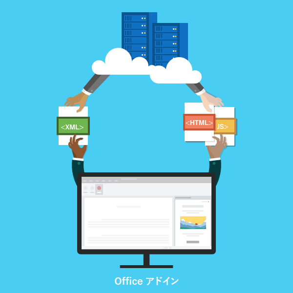

# Office アドイン プラットフォームの概要Office Add-ins platform overview

Office アドインのプラットフォームを使用すると、Office アプリケーションを拡張し、Office ドキュメント内のコンテンツと対話するソリューションを構築できます。Office アドインで、HTML、CSS、および JavaScript などの一般的な Web テクノロジを使用し、Word、Excel、PowerPoint、OneNote、Project、および Outlook を拡張して対話操作することができます。Office for Windows、Office Online、Office for Mac、および Office for iPad を含む複数のプラットフォームにわたって Office ソリューションを実行できます。You can use the Office Add-ins platform to build solutions that extend Office applications and interact with content in Office documents. With Office Add-ins, you can use familiar web technologies such as HTML, CSS, and JavaScript to extend and interact with Word, Excel, PowerPoint, OneNote, Project, and Outlook. Your solution can run in Office across multiple platforms, including Office for Windows, Office Online, Office for the Mac, and Office for the iPad.

Office アドインでは、ブラウザー内で Web ページが実行できる操作のほとんどすべてを実行できます。Office アドイン プラットフォームを使用して、次のことができます。Office Add-ins can do almost anything a webpage can do inside a browser. Use the Office Add-ins platform to:

-  **Office クライアントに新しい機能を追加する** - Office に外部データを取り込む、Office ドキュメントを自動化する、サード パーティの機能を Office クライアントで公開する、などがあります。たとえば、Microsoft Graph API を使用して、生産性の向上につながるデータに接続します。**Add new functionality to Office clients** - Bring external data into Office, automate Office documents, expose third-party functionality in Office clients, and more. For example, use Microsoft Graph API to connect to data that drives productivity.

-  **Office ドキュメントに埋め込み可能な充実した対話型のオブジェクトを新しく作成する** - マップやグラフ、ユーザーが自分の Excel スプレッドシートや PowerPoint プレゼンテーションに追加できる対話型の視覚化などを埋め込みます。**Create new rich, interactive objects that can be embedded in Office documents** - Embed maps, charts, and interactive visualizations that users can add to their own Excel spreadsheets and PowerPoint presentations.

## Office アドインが COM アドインおよび VSTO アドインと異なる点How are Office Add-ins different from COM and VSTO add-ins?

COM または VSTO アドインは、Office for Windows 上でのみ実行する以前の Office 統合ソリューションです。COM アドインとは異なり、Office アドインにはユーザーのデバイスまたは Office クライアントで実行されるコードは含まれません。Office アドインの場合、ホスト アプリケーション (たとえば Excel) がアドインのマニフェストを読み取り、アドインのカスタム リボン ボタンと UI のメニュー コマンドをフックします。これは必要に応じて、サンド ボックスのブラウザーのコンテキストで実行されるアドインの JavaScript と HTML を読み込みます。COM or VSTO add-ins are earlier Office integration solutions that run only on Office for Windows. Unlike COM add-ins, Office Add-ins don't involve code that runs on the user's device or in the Office client. For an Office Add-in, the host application, for example Excel, reads the add-in manifest and hooks up the add-in’s custom ribbon buttons and menu commands in the UI. When needed, it loads the add-in's JavaScript and HTML code, which executes in the context of a browser in a sandbox.

Office アドインは、VBA、COM、または VSTO を使用して作成されたアドインと比較して、次のような利点があります。Office Add-ins provide the following advantages over add-ins built using VBA, COM, or VSTO:

- クロスプラットフォーム サポート。Office アドインは、Windows 用、Mac 用、iOS 用の Office と、Office Online で実行できます。Cross-platform support. Office Add-ins run in Office for Windows, Mac, iOS, and Office Online.

- 一元展開と配布。管理者は、組織全体に Office アドインを一元的に展開できます。Centralized deployment and distribution. Admins can deploy Office Add-ins centrally across an organization.

- AppSource を経由した簡単なアクセス。AppSource に提出することで、広範な対象ユーザーにソリューションを公開できます。Easy access via AppSource. You can make your solution available to a broad audience by submitting it to AppSource.

- 標準の Web テクノロジに基づいている。任意のライブラリを使用して、Office アドインを構築することができます。Based on standard web technology. You can use any library you like to build Office Add-ins.

## Office アドインのコンポーネントComponents of an Office Add-in

Office アドインには、2 つの基本的なコンポーネントが含まれています。XML マニフェスト ファイルと独自の Web アプリケーションです。マニフェストは、アドインを Office クライアントと統合する方法など、さまざまな設定を定義します。Web アプリケーションは Web サーバーか、Microsoft Azure などの Web ホスティング サービスでホストされる必要があります。An Office Add-in includes two basic components: an XML manifest file, and your own web application. The manifest defines various settings, including how your add-in integrates with Office clients. Your web application needs to be hosted on a web server, or web hosting service, such as Microsoft Azure.

*図 1. アドインのマニフェスト (XML) + Web ページ (HTML, JS) = Office アドイン**Figure 1. Add-in manifest (XML) + webpage (HTML, JS) = an Office Add-in*

### マニフェストManifest

マニフェストは、次のようなアドインの設定と機能を指定する XML ファイルです。The manifest is an XML file that specifies settings and capabilities of the add-in, such as:

- アドインの表示名、説明、ID、バージョン、および既定のロケール。The add-in's display name, description, ID, version, and default locale.

- Office とアドインを統合する方法。How the add-in integrates with Office.  

- アドインのアクセス許可レベルとデータ アクセスの要件。The permission level and data access requirements for the add-in.

### Web アプリケーションWeb app

最も基本的な Office アドインは、Office アプリケーション内に表示される静的な HTML ページで構成されますが、Office ドキュメントやその他のどんなインターネット リソースとも対話を行いません。ただし、Office ドキュメントと対話するエクスペリエンスを作成する、または、ユーザーが Office ホスト アプリケーションからオンライン リソースと対話できるようにするには、ホスティング プロバイダーがサポートする任意のクライアント側とサーバー側のテクノロジ (ASP.NET、PHP、または Node.js など) を使用できます。Office クライアントとドキュメントとの対話を行うには、Office.js JavaScript API を使用します。The most basic Office Add-in consists of a static HTML page that is displayed inside an Office application, but that doesn't interact with either the Office document or any other Internet resource. However, to create an experience that interacts with Office documents or allows the user to interact with online resources from an Office host application, you can use any technologies, both client and server side, that your hosting provider supports (such as ASP.NET, PHP, or Node.js). To interact with Office clients and documents, you use the Office.js JavaScript APIs.

*図 2. Hello World Office アドインのコンポーネント**Figure 2. Components of a Hello World Office Add-in*

## Office クライアントの拡張と、Office クライアントとの対話Extending and interacting with Office clients

Office アドインは、Office ホスト アプリケーション内で次を実行できます。Office Add-ins can do the following within an Office host application:

-  機能の拡張 (任意の Office アプリケーション)Extend functionality (any Office application)

-  新しいオブジェクトの作成 (Excel または PowerPoint)Create new objects (Excel or PowerPoint)
 
### Office 機能の拡張Extend Office functionality

次の方法で、Office アプリケーションに新しい機能を追加できます。You can add new functionality to Office applications via the following:  

-  カスタム リボン ボタンとメニュー コマンド ("アドイン コマンド" と総称されます)Custom ribbon buttons and menu commands (collectively called “add-in commands”)

-  挿入可能な作業ウィンドウInsertable task panes

カスタムの UI と作業ウィンドウは、アドイン マニフェストで指定されます。Custom UI and task panes are specified in the add-in manifest.  

#### カスタム ボタンとメニュー コマンドCustom buttons and menu commands  

デスクトップ版 Office for Windows と Office Online のリボンにカスタム リボン ボタンおよびメニュー項目を追加できます。これにより、ユーザーは、Office アプリケーションから直接アドインに簡単にアクセスできます。コマンド ボタンは、カスタム HTML を使用して作業ウィンドウを表示したり、JavaScript 関数を実行したりするなど、さまざまなアクションを起動できます。You can add custom ribbon buttons and menu items to the ribbon in Office for Windows Desktop and Office Online. This makes it easy for users to access your add-in directly from their Office application. Command buttons can launch different actions such as showing a task pane with custom HTML or executing a JavaScript function.  

*図 3. リボンにあるアドイン コマンド**Figure 3. Add-in commands in the ribbon*

#### 作業ウィンドウTask panes  

ユーザーがソリューションと対話できるようにするために、アドイン コマンドに加えて、作業ウィンドウを使用できます。アドイン コマンド (Office 2013 および Office for iPad) をサポートしていないクライアントは、アドインを作業ウィンドウとして実行します。ユーザーは **[挿入]** タブの **[アドイン]** ボタンを使用して、作業ウィンドウのアドインを起動します。You can use task panes in addition to add-in commands to enable users to interact with your solution. Clients that do not support add-in commands (Office 2013 and Office for iPad) run your add-in as a task pane. Users launch task pane add-ins via the **My Add-ins** button on the **Insert** tab. 

*図 4. 作業ウィンドウ**Figure 4. Task pane*

### Outlook の機能を拡張するExtend Outlook functionality

Outlook アドインは Office のリボンを拡張したり、コンテキストに応じて表示または作成時に Outlook アイテムの隣に表示したりすることもできます。ユーザーが受信した項目を表示するか、返信または新しい項目を作成している場合には、電子メールメッセージ、会議出席依頼、会議の返信、会議の取り消し、または予定を操作できます。Outlook add-ins can extend the Office ribbon and also display contextually next to an Outlook item when you're viewing or composing it. They can work with an email message, meeting request, meeting response, meeting cancellation, or appointment when a user is viewing a received item or replying or creating a new item. 

Outlook アドインでは、アドレスや追跡 ID などのアイテムからコンテキスト情報にアクセスし、そのデータを使用してサーバー上の追加情報や Web サービスから魅力的なユーザー エクスペリエンスを作成することができます。Outlook アドインはほとんどの場合、Outlook、Outlook for Mac、Outlook Web App、デバイス用 Outlook Web App などのさまざまなサポートしているホスト アプリケーションで変更なしで実行でき、デスクトップ、Web、およびタブレットとモバイル デバイスでシームレスな操作を提供します。Outlook add-ins can access contextual information from the item, such as an address or tracking ID, and then use that data to access additional information on the server and from web services to create compelling user experiences. In most cases, an Outlook add-in runs without modification on the various supporting host applications, including Outlook, Outlook for Mac, Outlook Web App, and Outlook Web App for devices, to provide a seamless experience on the desktop, web, and tablet and mobile devices. 

Outlook アドインの概要については、「[Outlook アドインの概要](/outlook/add-ins/)」を参照してください。For an overview of Outlook add-ins, see [Outlook add-ins overview](/outlook/add-ins/).

### Office ドキュメント内に新しいオブジェクトを作成するCreate new objects in Office documents

Excel および PowerPoint のドキュメント内に、コンテンツ アドインと呼ばれる Web ベースのオブジェクトを埋め込むことができます。コンテンツ アドインにより、ユーザーは充実した Web ベースのデータの可視化、埋め込まれたメディア (YouTube ビデオ プレーヤーや画像ギャラリーなど)、およびその他の外部コンテンツを統合できます。You can embed web-based objects called content add-ins within Excel and PowerPoint documents. With content add-ins, you can integrate rich, web-based data visualizations, media (such as a YouTube video player or a picture gallery), and other external content.

*図 5. コンテンツ アドイン**Figure 5. Content add-in*

## Office JavaScript APIOffice JavaScript APIs

Office JavaScript API には、アドインを構築したり、Office のコンテンツおよび Web サービスと対話したりするためのオブジェクトとメンバーが含まれています。Excel、Outlook、Word、PowerPoint、OneNote、Project には、共通のオブジェクト モデルがあり、共有されています。Excel および Word には、さらに多くのホスト固有のオブジェクト モデルが用意されています。これらの API では、特定のホストのアドイン作成を容易にする段落やブックなど、既知のオブジェクトへのアクセスを提供します。The Office JavaScript APIs contain objects and members for building add-ins and interacting with Office content and web services. There is a common object model that is shared by Excel, Outlook, Word, PowerPoint, OneNote and Project. There are also more extensive host-specific object models for Excel and Word. These APIs provide access to well-known objects such as paragraphs and workbooks, which makes it easier to create an add-in for a specific host.  

## 次の手順Next steps

Office アドインの構築を開始する方法の詳細については、「[5 分クイック スタート](/office/dev/add-ins/)」をお試しください。To learn more about how to start building your Office Add-in, try out our [5-minute Quick Starts](/office/dev/add-ins/). Visual Studio またはその他の任意のエディターを使用すると、すぐにアドインの構築を開始できます。You can start building add-ins right away using Visual Studio or any other editor. 

効果的で魅力的なユーザー エクスペリエンスを作成するソリューションの計画を始めるには、Office アドインの[設計のガイドライン](../design/add-in-design.md)と[ベスト プラクティス](../concepts/add-in-development-best-practices.md)の理解を深めてください。To start planning solutions that create effective and compelling user experiences, get familiar with the [design guidelines](../design/add-in-design.md) and [best practices](../concepts/add-in-development-best-practices.md) for Office Add-ins.    

## 関連項目See also

- [Office アドインのサンプルOffice Add-in samples](https://developer.microsoft.com/office/gallery/?filterBy=Samples)
- [JavaScript API for Office についてUnderstanding the JavaScript API for Office](../develop/understanding-the-javascript-api-for-office.md)
- [Office アドインのホストとプラットフォームの可用性Office Add-in host and platform availability](../overview/office-add-in-availability.md)
