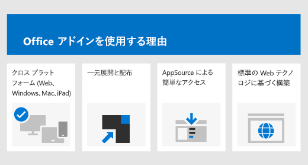

# Office アドイン プラットフォームの概要

Office アドイン プラットフォームを使用すると、Office アプリケーションを拡張して、Office ドキュメント内のコンテンツを対話方式で操作するソリューションを構築できます。Office アドインでは、HTML、CSS、および JavaScript などの一般的な Web テクノロジを使用することで、Word、Excel、PowerPoint、OneNote、Project、および Outlook を拡張して対話できるようになります。Windows、Mac、iPad、およびブラウザーを含む複数のプラットフォームにわたって Office ソリューションを実行できます。

Office アドインでは、ブラウザー内で Web ページが実行できる操作のほとんどすべてを実行できます。Office アドイン プラットフォームを使用して、次のことができます。

-  **Office クライアントに新しい機能を追加する** - Office に外部データを取り込む、Office ドキュメントを自動化する、サード パーティの機能を Office クライアントで公開する、などがあります。たとえば、Microsoft Graph API を使用して、生産性の向上につながるデータに接続します。

-  **Office ドキュメントに埋め込み可能な充実した対話型のオブジェクトを新しく作成する** - マップやグラフ、ユーザーが自分の Excel スプレッドシートや PowerPoint プレゼンテーションに追加できる対話型の視覚化などを埋め込みます。

## Office アドインが COM アドインおよび VSTO アドインと異なる点

COM または VSTO アドインは、Windows の Office でのみ実行する以前の Office 統合ソリューションです。COM アドインとは異なり、Office アドインにはユーザーのデバイスまたは Office クライアントで実行されるコードは含まれません。Office アドインの場合、アプリケーション (たとえば Excel) がアドインのマニフェストを読み取り、アドインのカスタム リボン ボタンと UI のメニュー コマンドをフックします。これは必要に応じて、サンドボックスのブラウザーのコンテキストで実行されるアドインの JavaScript と HTML を読み込みます。

Office アドインは、VBA、COM、または VSTO を使用して作成されたアドインと比較して、次のような利点があります。

- クロスプラットフォーム サポート。Office アドインは、Office on the web、Windows、Mac、および iPad で実行できます。

- 一元展開と配布。管理者は、組織全体に Office アドインを一元的に展開できます。

- AppSource を経由した簡単なアクセス。AppSource に提出することで、広範な対象ユーザーにソリューションを公開できます。

- 標準の Web テクノロジに基づいている。任意のライブラリを使用して、Office アドインを構築することができます。

## Office アドインのコンポーネント

Office アドインには、2 つの基本的なコンポーネントが含まれています。XML マニフェスト ファイルと独自の Web アプリケーションです。マニフェストは、アドインを Office クライアントと統合する方法など、さまざまな設定を定義します。Web アプリケーションは Web サーバーか、Microsoft Azure などの Web ホスティング サービスでホストされる必要があります。

### マニフェスト

マニフェストは、次のようなアドインの設定と機能を指定する XML ファイルです。

- アドインの表示名、説明、ID、バージョン、および既定のロケール。

- Office とアドインを統合する方法。  

- アドインのアクセス許可レベルとデータ アクセスの要件。

### Web アプリケーション

最も基本的な Office アドインは、Office アプリケーション内に表示される静的な HTML ページで構成されますが、Office ドキュメントやその他のどんなインターネット リソースとも対話を行いません。ただし、Office ドキュメントと対話するエクスペリエンスを作成する、または、ユーザーが Office クライアント アプリケーションからオンライン リソースと対話できるようにするには、ホスティング プロバイダーがサポートする任意のクライアント側とサーバー側のテクノロジ (ASP.NET、PHP、または Node.js など) を使用できます。Office クライアントとドキュメントとの対話を行うには、Office.js JavaScript API を使用します。

*図 2. Hello World Office アドインのコンポーネント*

## Office クライアントの拡張と、Office クライアントとの対話

Office アドインは、Office クライアント アプリケーション内で次を実行できます:

-  機能の拡張 (任意の Office アプリケーション)

-  新しいオブジェクトの作成 (Excel または PowerPoint)
 
### Office 機能の拡張

次の方法で、Office アプリケーションに新しい機能を追加できます。  

-  カスタム リボン ボタンとメニュー コマンド ("アドイン コマンド" と総称されます)

-  挿入可能な作業ウィンドウ

カスタムの UI と作業ウィンドウは、アドイン マニフェストで指定されます。  

#### カスタム ボタンとメニュー コマンド  

カスタムのリボン ボタンとメニュー項目は、Office on the web および Windows のリボンに追加できます。これにより、ユーザーは、Office アプリケーションからアドインに簡単に直接アクセスできます。コマンド ボタンでは、カスタム HTML による作業ウィンドウを表示したり、JavaScript 関数を実行したりするなど、さまざまなアクションを起動できます。  

*図 3. リボンにあるアドイン コマンド*

#### 作業ウィンドウ  

ユーザーはアドイン コマンドに加えて、作業ウィンドウを使用してソリューションの対話式操作を実行できます。アドイン コマンド (Office 2013 および Office on iPad) をサポートしていないクライアントは、アドインを作業ウィンドウとして実行します。ユーザーは **[挿入]** タブの **[アドイン]** ボタンを使用して、作業ウィンドウのアドインを起動します。

*図 4. 作業ウィンドウ*

### Outlook の機能を拡張する

Outlook アプリ アドインは Office のリボンを拡張したり、コンテキストに応じて表示または作成時に Outlook アイテムの隣に表示したりすることもできます。ユーザーが受信した項目を表示するか、返信または新しい項目を作成している場合には、電子メールメッセージ、会議出席依頼、会議の返信、会議の取り消し、または予定を操作できます。 

Outlook アドインでは、アイテムのコンテキスト情報 (アドレスや追跡 ID など) にアクセスし、そのデータを使用してサーバー上または Web サービスの追加情報にアクセスして、魅力的なユーザー エクスペリエンスを作成できます。ほとんどの場合、Outlook アドインはデスクトップ、Web、タブレットおよびモバイル デバイスに変更なしでシームレスなエクスペリエンスを提供する Outlook アプリケーションで実行できます。

Outlook アドインの概要については、「[Outlook アドインの概要](../outlook/outlook-add-ins-overview.md)」を参照してください。

### Office ドキュメント内に新しいオブジェクトを作成する

Excel および PowerPoint のドキュメント内に、コンテンツ アドインと呼ばれる Web ベースのオブジェクトを埋め込むことができます。コンテンツ アドインにより、ユーザーは充実した Web ベースのデータの可視化、埋め込まれたメディア (YouTube ビデオ プレーヤーや画像ギャラリーなど)、およびその他の外部コンテンツを統合できます。

*図 5. コンテンツ アドイン*

## Office JavaScript API

Office JavaScript API には、アドインを構築したり、Office のコンテンツおよび Web サービスと対話したりするためのオブジェクトとメンバーが含まれています。Excel、Outlook、Word、PowerPoint、OneNote、Project には、共通のオブジェクト モデルがあり、共有されています。Excel および Word には、さらに多くのアプリケーション固有のオブジェクト モデルが用意されています。これらの API では、特定のアプリケーションのアドイン作成を容易にする段落やブックなど、既知のオブジェクトへのアクセスを提供します。

## 次の手順

Office アドインの開発の詳細については、「[Office アドインを開発する](../develop/develop-overview.md)」を参照してください。

## 関連項目

- [Office アドインの中心概念](../overview/core-concepts-office-add-ins.md)
- [Office アドインを開発する](../develop/develop-overview.md)
- [Office アドインを設計する](../design/add-in-design.md)
- [Office アドインのテストとデバッグ](../testing/test-debug-office-add-ins.md)
- [Office アドインを発行する](../publish/publish.md)
- [Microsoft 365 開発者プログラムについて](https://developer.microsoft.com/microsoft-365/dev-program)