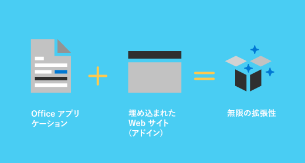

# Office アドイン プラットフォームの概要Office Add-ins platform overview

You can use the Office Add-ins platform to build solutions that extend Office applications and interact with content in Office documents.You can use the Office Add-ins platform to build solutions that extend Office applications and interact with content in Office documents. With Office Add-ins, you can use familiar web technologies such as HTML, CSS, and JavaScript to extend and interact with Word, Excel, PowerPoint, OneNote, Project, and Outlook.With Office Add-ins, you can use familiar web technologies such as HTML, CSS, and JavaScript to extend and interact with Word, Excel, PowerPoint, OneNote, Project, and Outlook. Your solution can run in Office across multiple platforms, including Windows, Mac, iPad, and in a browser.Your solution can run in Office across multiple platforms, including Windows, Mac, iPad, and in a browser.

Office Add-ins can do almost anything a webpage can do inside a browser.Office Add-ins can do almost anything a webpage can do inside a browser. Use the Office Add-ins platform to:Use the Office Add-ins platform to:

-  **Add new functionality to Office clients** - Bring external data into Office, automate Office documents, expose third-party functionality in Office clients, and more.**Add new functionality to Office clients** - Bring external data into Office, automate Office documents, expose third-party functionality in Office clients, and more. For example, use Microsoft Graph API to connect to data that drives productivity.For example, use Microsoft Graph API to connect to data that drives productivity.

-  **Office ドキュメントに埋め込み可能な充実した対話型のオブジェクトを新しく作成する** - マップやグラフ、ユーザーが自分の Excel スプレッドシートや PowerPoint プレゼンテーションに追加できる対話型の視覚化などを埋め込みます。**Create new rich, interactive objects that can be embedded in Office documents** - Embed maps, charts, and interactive visualizations that users can add to their own Excel spreadsheets and PowerPoint presentations.

## Office アドインが COM アドインおよび VSTO アドインと異なる点How are Office Add-ins different from COM and VSTO add-ins?

COM or VSTO add-ins are earlier Office integration solutions that run only on Office on Windows.COM or VSTO add-ins are earlier Office integration solutions that run only on Office on Windows. Unlike COM add-ins, Office Add-ins don't involve code that runs on the user's device or in the Office client.Unlike COM add-ins, Office Add-ins don't involve code that runs on the user's device or in the Office client. For an Office Add-in, the host application, for example Excel, reads the add-in manifest and hooks up the add-in’s custom ribbon buttons and menu commands in the UI.For an Office Add-in, the host application, for example Excel, reads the add-in manifest and hooks up the add-in’s custom ribbon buttons and menu commands in the UI. When needed, it loads the add-in's JavaScript and HTML code, which executes in the context of a browser in a sandbox.When needed, it loads the add-in's JavaScript and HTML code, which executes in the context of a browser in a sandbox.

Office アドインは、VBA、COM、または VSTO を使用して作成されたアドインと比較して、次のような利点があります。Office Add-ins provide the following advantages over add-ins built using VBA, COM, or VSTO:

- Cross-platform support.Cross-platform support. Office Add-ins run in Office on the web, Windows, Mac, and iPad.Office Add-ins run in Office on the web, Windows, Mac, and iPad.

- Centralized deployment and distribution.Centralized deployment and distribution. Admins can deploy Office Add-ins centrally across an organization.Admins can deploy Office Add-ins centrally across an organization.

- Easy access via AppSource.Easy access via AppSource. You can make your solution available to a broad audience by submitting it to AppSource.You can make your solution available to a broad audience by submitting it to AppSource.

- Based on standard web technology.Based on standard web technology. You can use any library you like to build Office Add-ins.You can use any library you like to build Office Add-ins.

## Office アドインのコンポーネントComponents of an Office Add-in

An Office Add-in includes two basic components: an XML manifest file, and your own web application.An Office Add-in includes two basic components: an XML manifest file, and your own web application. The manifest defines various settings, including how your add-in integrates with Office clients.The manifest defines various settings, including how your add-in integrates with Office clients. Your web application needs to be hosted on a web server, or web hosting service, such as Microsoft Azure.Your web application needs to be hosted on a web server, or web hosting service, such as Microsoft Azure.

### マニフェストManifest

マニフェストは、次のようなアドインの設定と機能を指定する XML ファイルです。The manifest is an XML file that specifies settings and capabilities of the add-in, such as:

- アドインの表示名、説明、ID、バージョン、および既定のロケール。The add-in's display name, description, ID, version, and default locale.

- Office とアドインを統合する方法。How the add-in integrates with Office.  

- アドインのアクセス許可レベルとデータ アクセスの要件。The permission level and data access requirements for the add-in.

### Web アプリケーションWeb app

The most basic Office Add-in consists of a static HTML page that is displayed inside an Office application, but that doesn't interact with either the Office document or any other Internet resource.The most basic Office Add-in consists of a static HTML page that is displayed inside an Office application, but that doesn't interact with either the Office document or any other Internet resource. However, to create an experience that interacts with Office documents or allows the user to interact with online resources from an Office host application, you can use any technologies, both client and server side, that your hosting provider supports (such as ASP.NET, PHP, or Node.js).However, to create an experience that interacts with Office documents or allows the user to interact with online resources from an Office host application, you can use any technologies, both client and server side, that your hosting provider supports (such as ASP.NET, PHP, or Node.js). To interact with Office clients and documents, you use the Office.js JavaScript APIs.To interact with Office clients and documents, you use the Office.js JavaScript APIs.

*図 2. Hello World Office アドインのコンポーネント**Figure 2. Components of a Hello World Office Add-in*

## Office クライアントの拡張と、Office クライアントとの対話Extending and interacting with Office clients

Office アドインは、Office ホスト アプリケーション内で次を実行できます。Office Add-ins can do the following within an Office host application:

-  機能の拡張 (任意の Office アプリケーション)Extend functionality (any Office application)

-  新しいオブジェクトの作成 (Excel または PowerPoint)Create new objects (Excel or PowerPoint)
 
### Office 機能の拡張Extend Office functionality

次の方法で、Office アプリケーションに新しい機能を追加できます。You can add new functionality to Office applications via the following:  

-  カスタム リボン ボタンとメニュー コマンド ("アドイン コマンド" と総称されます)Custom ribbon buttons and menu commands (collectively called “add-in commands”)

-  挿入可能な作業ウィンドウInsertable task panes

カスタムの UI と作業ウィンドウは、アドイン マニフェストで指定されます。Custom UI and task panes are specified in the add-in manifest.  

#### カスタム ボタンとメニュー コマンドCustom buttons and menu commands  

You can add custom ribbon buttons and menu items to the ribbon in Office on the web and Windows.You can add custom ribbon buttons and menu items to the ribbon in Office on the web and Windows. This makes it easy for users to access your add-in directly from their Office application.This makes it easy for users to access your add-in directly from their Office application. Command buttons can launch different actions such as showing a task pane with custom HTML or executing a JavaScript function.Command buttons can launch different actions such as showing a task pane with custom HTML or executing a JavaScript function.  

*図 3. リボンにあるアドイン コマンド**Figure 3. Add-in commands in the ribbon*

#### 作業ウィンドウTask panes  

You can use task panes in addition to add-in commands to enable users to interact with your solution.You can use task panes in addition to add-in commands to enable users to interact with your solution. Clients that do not support add-in commands (Office 2013 and Office on iPad) run your add-in as a task pane.Clients that do not support add-in commands (Office 2013 and Office on iPad) run your add-in as a task pane. Users launch task pane add-ins via the **My Add-ins** button on the **Insert** tab.Users launch task pane add-ins via the **My Add-ins** button on the **Insert** tab.

*図 4. 作業ウィンドウ**Figure 4. Task pane*

### Outlook の機能を拡張するExtend Outlook functionality

Outlook add-ins can extend the Office app ribbon and also display contextually next to an Outlook item when you're viewing or composing it.Outlook add-ins can extend the Office app ribbon and also display contextually next to an Outlook item when you're viewing or composing it. They can work with an email message, meeting request, meeting response, meeting cancellation, or appointment when a user is viewing a received item or replying or creating a new item.They can work with an email message, meeting request, meeting response, meeting cancellation, or appointment when a user is viewing a received item or replying or creating a new item. 

Outlook add-ins can access contextual information from the item, such as an address or tracking ID, and then use that data to access additional information on the server and from web services to create compelling user experiences.Outlook add-ins can access contextual information from the item, such as an address or tracking ID, and then use that data to access additional information on the server and from web services to create compelling user experiences. In most cases, an Outlook add-in runs without modification in the Outlook host application to provide a seamless experience on the desktop, web, and tablet and mobile devices.In most cases, an Outlook add-in runs without modification in the Outlook host application to provide a seamless experience on the desktop, web, and tablet and mobile devices.

Outlook アドインの概要については、「[Outlook アドインの概要](../outlook/outlook-add-ins-overview.md)」を参照してください。For an overview of Outlook add-ins, see [Outlook add-ins overview](../outlook/outlook-add-ins-overview.md).

### Office ドキュメント内に新しいオブジェクトを作成するCreate new objects in Office documents

You can embed web-based objects called content add-ins within Excel and PowerPoint documents.You can embed web-based objects called content add-ins within Excel and PowerPoint documents. With content add-ins, you can integrate rich, web-based data visualizations, media (such as a YouTube video player or a picture gallery), and other external content.With content add-ins, you can integrate rich, web-based data visualizations, media (such as a YouTube video player or a picture gallery), and other external content.

*図 5. コンテンツ アドイン**Figure 5. Content add-in*

## Office JavaScript APIOffice JavaScript APIs

The Office JavaScript APIs contain objects and members for building add-ins and interacting with Office content and web services.The Office JavaScript APIs contain objects and members for building add-ins and interacting with Office content and web services. There is a common object model that is shared by Excel, Outlook, Word, PowerPoint, OneNote and Project.There is a common object model that is shared by Excel, Outlook, Word, PowerPoint, OneNote and Project. There are also more extensive host-specific object models for Excel and Word.There are also more extensive host-specific object models for Excel and Word. These APIs provide access to well-known objects such as paragraphs and workbooks, which makes it easier to create an add-in for a specific host.These APIs provide access to well-known objects such as paragraphs and workbooks, which makes it easier to create an add-in for a specific host.  

## 次のステップNext steps

Office アドインの開発の詳細については、「[Office アドインを構築する](../overview/office-add-ins-fundamentals.md)」を参照してください。For a more detailed introduction to developing Office Add-ins, see [Building Office Add-ins](../overview/office-add-ins-fundamentals.md).

## 関連項目See also

- [Office アドインを構築するBuilding Office Add-ins](../overview/office-add-ins-fundamentals.md)
- [Office アドインの中心概念Core concepts for Office Add-ins](../overview/core-concepts-office-add-ins.md)
- [Office アドインを開発するDevelop Office Add-ins](../develop/develop-overview.md)
- [Office アドインを設計するDesign Office Add-ins](../design/add-in-design.md)
- [Office アドインのテストとデバッグTest and debug Office Add-ins](../testing/test-debug-office-add-ins.md)
- [Office アドインを発行するPublish Office Add-ins](../publish/publish.md)
