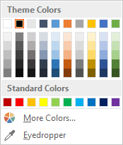
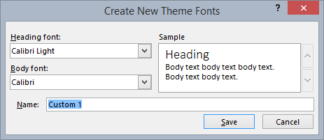

# <a name="use-document-themes-in-your-powerpoint-add-ins"></a><span data-ttu-id="33c5f-102">PowerPoint アドインでドキュメントのテーマを使用する</span><span class="sxs-lookup"><span data-stu-id="33c5f-102">Use document themes in your PowerPoint add-ins</span></span>

<span data-ttu-id="33c5f-p101">[Office テーマ](https://support.office.com/Article/What-is-a-theme--7528ccc2-4327-4692-8bf5-9b5a3f2a5ef5)の一部は表示が調整されたフォントと色のセットで構成されており、このセットをプレゼンテーション、文書、ワークシート、電子メールに適用できます。PowerPoint でプレゼンテーションのテーマを適用したりカスタマイズしたりするには、リボンの **[デザイン]** タブの **[テーマ]** グループと **[バリエーション]** グループを使います。PowerPoint は既定の **Office テーマ**の新しい空白のプレゼンテーションを割り当てますが、**[デザイン]** タブ上の使用できる他のテーマを選択したり、Office.com から追加のテーマをダウンロードしたり、独自のテーマを作成してカスタマイズしたりできます。</span><span class="sxs-lookup"><span data-stu-id="33c5f-p101">An [Office theme](https://support.office.com/Article/What-is-a-theme--7528ccc2-4327-4692-8bf5-9b5a3f2a5ef5) consists, in part, of a visually coordinated set of fonts and colors that you can apply to presentations, documents, worksheets, and emails. To apply or customize the theme of a presentation in PowerPoint, you use the **Themes** and **Variants** groups on **Design** tab of the ribbon. PowerPoint assigns a new blank presentation with the default **Office Theme**, but you can choose other themes available on the **Design** tab, download additional themes from Office.com, or create and customize your own theme.</span></span>

<span data-ttu-id="33c5f-106">OfficeThemes.css を使用すると、次の 2 つの方法でアドインを PowerPoint に合わせて設計できます。</span><span class="sxs-lookup"><span data-stu-id="33c5f-106">Using OfficeThemes.css, helps you design add-ins that are coordinated with PowerPoint in two ways:</span></span>

- <span data-ttu-id="33c5f-p102">**PowerPoint 用のコンテンツ アドイン**。OfficeThemes.css の文書テーマ クラスを使用して、コンテンツ アドインの挿入先のプレゼンテーションのテーマと一致するフォントと色を指定します。このフォントと色は、ユーザーがプレゼンテーションのテーマを変更したりカスタマイズしたりすると動的に更新されます。</span><span class="sxs-lookup"><span data-stu-id="33c5f-p102">**In content add-ins for PowerPoint**. Use the document theme classes of OfficeThemes.css to specify fonts and colors that match the theme of the presentation your content add-in is inserted into - and those fonts and colors will dynamically update if a user changes or customizes the presentation's theme.</span></span>
    
- <span data-ttu-id="33c5f-p103">**PowerPoint 用の作業ウィンドウ アドイン**。OfficeThemes.css の Office UI テーマ クラスを使用して、この UI で使用されているフォントと背景の色を指定し、作業ウィンドウ アドインが組み込み作業ウィンドウの色と一致するようにします。この色は、ユーザーが Office UI テーマを変更すると動的に更新されます。</span><span class="sxs-lookup"><span data-stu-id="33c5f-p103">**In task pane add-ins for PowerPoint**. Use the Office UI theme classes of OfficeThemes.css to specify the same fonts and background colors used in the UI so that your task pane add-ins will match the colors of built-in task panes - and those colors will dynamically update if a user changes the Office UI theme.</span></span>

### <a name="document-theme-colors"></a><span data-ttu-id="33c5f-111">文書のテーマの色</span><span class="sxs-lookup"><span data-stu-id="33c5f-111">Document theme colors</span></span>

<span data-ttu-id="33c5f-p104">すべての Office 文書のテーマには 12 色が定義されています。これらのうち 10 色は、色選択を使ってプレゼンテーション内のフォントや背景などの色を設定するときに利用できます。</span><span class="sxs-lookup"><span data-stu-id="33c5f-p104">Every Office document theme defines 12 colors. Ten of these colors are available when you set font, background, and other color settings in a presentation with the color picker.</span></span>



<span data-ttu-id="33c5f-115">PowerPoint の12色のテーマのフルセットを表示またはカスタマイズするには、[**デザイン**] タブの [**バリエーション**] グループで、[**その他**] ドロップダウンをクリックし、 **[色の** > **カスタマイズ**] を選択して、[**新しいテーマの色の作成**] ダイアログボックスを表示します。</span><span class="sxs-lookup"><span data-stu-id="33c5f-115">To view or customize the full set of 12 theme colors in PowerPoint, in the **Variants** group on the **Design** tab, click the **More** drop-down - then select **Colors** > **Customize Colors** to display the **Create New Theme Colors** dialog box.</span></span>


<span data-ttu-id="33c5f-p105">最初の 4 色はテキストと背景用です。テキストを明るい色で作成すると常に暗い色より読みやすくなり、テキストを暗い色で作成すると常に明るい色より読みやすくなります。続く 6 色は、4 つの背景になる色の上に常に表示されるアクセントです。最後の 2 色は、ハイパーリンクと表示済みハイパーリンクの色です。</span><span class="sxs-lookup"><span data-stu-id="33c5f-p105">The first four colors are for text and backgrounds. Text that is created with the light colors will always be legible over the dark colors, and text that is created with dark colors will always be legible over the light colors. The next six are accent colors that are always visible over the four potential background colors. The last two colors are for hyperlinks and followed hyperlinks.</span></span>

### <a name="document-theme-fonts"></a><span data-ttu-id="33c5f-121">文書のテーマのフォント</span><span class="sxs-lookup"><span data-stu-id="33c5f-121">Document theme fonts</span></span>

<span data-ttu-id="33c5f-122">すべての Office 文書のテーマには 2 つのフォント (見出し用と本文テキスト用) も定義されています。</span><span class="sxs-lookup"><span data-stu-id="33c5f-122">Every Office document theme also defines two fonts -- one for headings and one for body text.</span></span> <span data-ttu-id="33c5f-123">PowerPoint はこれらのフォントを使用して自動的にテキスト スタイルを構成します。</span><span class="sxs-lookup"><span data-stu-id="33c5f-123">PowerPoint uses these fonts to construct automatic text styles.</span></span> <span data-ttu-id="33c5f-124">また、テキストと**ワードアート**の**クイック スタイル** ギャラリーでも同じフォントが使用されます。</span><span class="sxs-lookup"><span data-stu-id="33c5f-124">In addition, **Quick Styles** galleries for text and **WordArt** use these same theme fonts.</span></span> <span data-ttu-id="33c5f-125">これらの 2 つのフォントは、フォント ピッカーを使用してフォントを選択するときに、最初の 2 つの選択項目として利用できます。</span><span class="sxs-lookup"><span data-stu-id="33c5f-125">These two fonts are available as the first two selections when you select fonts with the font picker.</span></span>


<span data-ttu-id="33c5f-127">PowerPoint でテーマのフォントを表示またはカスタマイズするには、[**デザイン**] タブの [**バリエーション**] グループで、[**その他** **] をクリック** > し、[フォントの**カスタマイズ**] を選択して [**新しいテーマのフォントの作成**] ダイアログボックスを表示します。</span><span class="sxs-lookup"><span data-stu-id="33c5f-127">To view or customize theme fonts in PowerPoint, in the **Variants** group on the **Design** tab, click the **More** drop-down - then select **Fonts** > **Customize Fonts** to display the **Create New Theme Fonts** dialog box.</span></span>



### <a name="office-ui-theme-fonts-and-colors"></a><span data-ttu-id="33c5f-129">Office の UI のテーマのフォントと色</span><span class="sxs-lookup"><span data-stu-id="33c5f-129">Office UI theme fonts and colors</span></span>

<span data-ttu-id="33c5f-130">Office also lets you choose between several predefined themes that specify some of the colors and fonts used in the UI of all Office applications.</span><span class="sxs-lookup"><span data-stu-id="33c5f-130">Office also lets you choose between several predefined themes that specify some of the colors and fonts used in the UI of all Office applications.</span></span> <span data-ttu-id="33c5f-131">これを行うには、**ファイル** > **アカウント** > の**office テーマ**ドロップダウンを使用します (任意の office アプリケーションから)。</span><span class="sxs-lookup"><span data-stu-id="33c5f-131">To do that, you use the **File** > **Account** > **Office Theme** drop-down (from any Office application).</span></span>


<span data-ttu-id="33c5f-p108">OfficeThemes.css には PowerPoint 用の作業ウィンドウ アドインで使用できるクラスが含まれており、両者が使用するフォントと色は同じになります。したがって、組み込み作業ウィンドウの外観と一致する作業ウィンドウ アドインを設計できます。</span><span class="sxs-lookup"><span data-stu-id="33c5f-p108">OfficeThemes.css includes classes that you can use in your task pane add-ins for PowerPoint so they will use these same fonts and colors. This lets you design your task pane add-ins that match the appearance of built-in task panes.</span></span>

## <a name="using-officethemescss"></a><span data-ttu-id="33c5f-135">OfficeThemes.css を使用する</span><span class="sxs-lookup"><span data-stu-id="33c5f-135">Using OfficeThemes.css</span></span>

<span data-ttu-id="33c5f-p109">OfficeThemes.css ファイルと PowerPoint 用のコンテンツ アドインを併用すると、アドイン の外観を、一緒に実行するプレゼンテーションに適用されているテーマに合わせて調整できます。OfficeThemes.css ファイルと PowerPoint 用の作業ウィンドウ アドインを併用すると、Office UI のフォントと色に合わせて アドイン を調整できます。</span><span class="sxs-lookup"><span data-stu-id="33c5f-p109">Using the OfficeThemes.css file with your content add-ins for PowerPoint lets you coordinate the appearance of your add-in with the theme applied to the presentation it's running with. Using the OfficeThemes.css file with your task pane add-ins for PowerPoint lets you coordinate the appearance of your add-in with the fonts and colors of the Office UI.</span></span>

### <a name="adding-the-officethemescss-file-to-your-project"></a><span data-ttu-id="33c5f-138">OfficeThemes.css ファイルをプロジェクトに追加する</span><span class="sxs-lookup"><span data-stu-id="33c5f-138">Adding the OfficeThemes.css file to your project</span></span>

<span data-ttu-id="33c5f-139">OfficeThemes.css ファイルを アドイン プロジェクトに追加して、このファイルを参照するには、次の手順に従います。</span><span class="sxs-lookup"><span data-stu-id="33c5f-139">Use the following steps to add and reference the OfficeThemes.css file to your add-in project.</span></span>

#### <a name="to-add-officethemescss-to-your-visual-studio-project"></a><span data-ttu-id="33c5f-140">OfficeThemes.css を Visual Studio プロジェクトに追加するには</span><span class="sxs-lookup"><span data-stu-id="33c5f-140">To add OfficeThemes.css to your Visual Studio project</span></span>

> [!NOTE]
> <span data-ttu-id="33c5f-141">この手順は、Visual Studio 2015 にのみ適用されます。</span><span class="sxs-lookup"><span data-stu-id="33c5f-141">The steps in this procedure only apply to Visual Studio 2015.</span></span> <span data-ttu-id="33c5f-142">Visual Studio 2019 を使用している場合は、作成した新しい PowerPoint アドインプロジェクトに対して OfficeThemes ファイルが自動的に作成されます。</span><span class="sxs-lookup"><span data-stu-id="33c5f-142">If you are using Visual Studio 2019, the OfficeThemes.css file is created automatically for any new PowerPoint add-in projects that you create.</span></span>

1. <span data-ttu-id="33c5f-143">**ソリューション エクスプローラー**で、_**project_name**_**Web** プロジェクト内の [**コンテンツ**] フォルダーを右クリックし、[**追加**] を選択してから、[**スタイル シート**] を選択します。</span><span class="sxs-lookup"><span data-stu-id="33c5f-143">In **Solution Explorer**, right-click the **Content** folder in the _**project_name**_**Web** project, choose **Add**, and then select **Style Sheet**.</span></span>
    
2. <span data-ttu-id="33c5f-144">新しいスタイル シートに **OfficeThemes** という名前を付けます。</span><span class="sxs-lookup"><span data-stu-id="33c5f-144">Name the new style sheet **OfficeThemes**.</span></span>
    
   > [!IMPORTANT]
   > <span data-ttu-id="33c5f-145">スタイル シートの名前は OfficeThemes と指定する必要があります。そうでない場合、ユーザーがテーマを変更した際にアドインのフォントと色を動的に更新する機能が動作しません。</span><span class="sxs-lookup"><span data-stu-id="33c5f-145">The style sheet must be named OfficeThemes, or the feature that dynamically updates add-in fonts and colors when a user changes the theme won't work.</span></span>
   
3. <span data-ttu-id="33c5f-146">ファイル内の既定の **body** クラス (`body {}`) を削除し、次の CSS コードをコピーしてファイルに貼り付けます。</span><span class="sxs-lookup"><span data-stu-id="33c5f-146">Delete the default **body** class (`body {}`) in the file, and copy and paste the following CSS code into the file.</span></span>
    
    ```css
    /* The following classes describe the common theme information for office documents */ 

    /* Basic Font and Background Colors for text */ 
    .office-docTheme-primary-fontColor { color:#000000; } 
    .office-docTheme-primary-bgColor { background-color:#ffffff; } 
    .office-docTheme-secondary-fontColor { color: #000000; } 
    .office-docTheme-secondary-bgColor { background-color: #ffffff; } 

    /* Accent color definitions for fonts */ 
    .office-contentAccent1-color { color:#5b9bd5; } 
    .office-contentAccent2-color { color:#ed7d31; } 
    .office-contentAccent3-color { color:#a5a5a5; } 
    .office-contentAccent4-color { color:#ffc000; } 
    .office-contentAccent5-color { color:#4472c4; } 
    .office-contentAccent6-color { color:#70ad47; } 

    /* Accent color for backgrounds */ 
    .office-contentAccent1-bgColor { background-color:#5b9bd5; } 
    .office-contentAccent2-bgColor { background-color:#ed7d31; } 
    .office-contentAccent3-bgColor { background-color:#a5a5a5; } 
    .office-contentAccent4-bgColor { background-color:#ffc000; } 
    .office-contentAccent5-bgColor { background-color:#4472c4; } 
    .office-contentAccent6-bgColor { background-color:#70ad47; } 

    /* Accent color for borders */ 
    .office-contentAccent1-borderColor { border-color:#5b9bd5; } 
    .office-contentAccent2-borderColor { border-color:#ed7d31; } 
    .office-contentAccent3-borderColor { border-color:#a5a5a5; } 
    .office-contentAccent4-borderColor { border-color:#ffc000; } 
    .office-contentAccent5-borderColor { border-color:#4472c4; } 
    .office-contentAccent6-borderColor { border-color:#70ad47; } 

    /* links */ 
    .office-a { color: #0563c1; } 
    .office-a:visited { color: #954f72; } 

    /* Body Fonts */ 
    .office-bodyFont-eastAsian { } /* East Asian name of the Font */ 
    .office-bodyFont-latin { font-family:"Calibri"; } /* Latin name of the Font */ 
    .office-bodyFont-script { } /* Script name of the Font */ 
    .office-bodyFont-localized { font-family:"Calibri"; } /* Localized name of the Font. Corresponds to the default font of the culture currently used in Office.*/ 

    /* Headers Font */ 
    .office-headerFont-eastAsian { } 
    .office-headerFont-latin { font-family:"Calibri Light"; } 
    .office-headerFont-script { } 
    .office-headerFont-localized { font-family:"Calibri Light"; } 

    /* The following classes define font and background colors for Office UI themes. These classes should only be used in task pane add-ins */ 

    /* Basic Font and Background Colors for PPT */ 
    .office-officeTheme-primary-fontColor { color:#b83b1d; } 
    .office-officeTheme-primary-bgColor { background-color:#dedede; } 
    .office-officeTheme-secondary-fontColor { color:#262626; } 
    .office-officeTheme-secondary-bgColor { background-color:#ffffff; }
    ```
4. <span data-ttu-id="33c5f-147">Visual Studio 以外のツールを使用して アドイン を作成している場合は、手順 3 の CSS コードをテキスト ファイルにコピーし、OfficeThemes.css としてファイルを保存したことを確認してください。</span><span class="sxs-lookup"><span data-stu-id="33c5f-147">If you are using a tool other than Visual Studio to create your add-in, copy the CSS code from step 3 into a text file, making sure to save the file as OfficeThemes.css.</span></span>   

### <a name="referencing-officethemescss-in-your-add-ins-html-pages"></a><span data-ttu-id="33c5f-148">アドインの HTML ページ内で OfficeThemes.css を参照する</span><span class="sxs-lookup"><span data-stu-id="33c5f-148">Referencing OfficeThemes.css in your add-in's HTML pages</span></span>

<span data-ttu-id="33c5f-149">アドイン プロジェクト内で OfficeThemes.css ファイルを使用するには、OfficeThemes.css ファイルを参照する `<link>` タグを、アドインの UI を実装する Web ページ (.html, .aspx, .php ファイルなど) の `<head>` タグ内に、以下の形式で追加します。</span><span class="sxs-lookup"><span data-stu-id="33c5f-149">To use the OfficeThemes.css file in your add-in project, add a `<link>` tag that references the OfficeThemes.css file inside the `<head>` tag of the web pages (such as an .html, .aspx, or .php file) that implement the UI of your add-in in this format:</span></span>

```HTML
<link href="<local_path_to_OfficeThemes.css>" rel="stylesheet" type="text/css" />
```

<span data-ttu-id="33c5f-150">Visual Studio でこの作業を行うには、次の手順に従ってください。</span><span class="sxs-lookup"><span data-stu-id="33c5f-150">To do this in Visual Studio, follow these steps.</span></span>

#### <a name="to-reference-officethemescss-in-your-add-in-for-powerpoint"></a><span data-ttu-id="33c5f-151">PowerPoint 用アドイン内で OfficeThemes.css を参照するには</span><span class="sxs-lookup"><span data-stu-id="33c5f-151">To reference OfficeThemes.css in your add-in for PowerPoint</span></span>

1. <span data-ttu-id="33c5f-152">[**新規プロジェクトの作成**] を選択します。</span><span class="sxs-lookup"><span data-stu-id="33c5f-152">Choose **Create a new project**.</span></span>

2. <span data-ttu-id="33c5f-153">検索ボックスを使用して、**アドイン**と入力します。</span><span class="sxs-lookup"><span data-stu-id="33c5f-153">Using the search box, enter **add-in**.</span></span> <span data-ttu-id="33c5f-154">[**PowerPoint Web アドイン**] を選択し、[**次へ**] を選択します。</span><span class="sxs-lookup"><span data-stu-id="33c5f-154">Choose **PowerPoint Web Add-in**, then select **Next**.</span></span>

3. <span data-ttu-id="33c5f-155">プロジェクトに名前を付けて、[**作成**] を選択します。</span><span class="sxs-lookup"><span data-stu-id="33c5f-155">Name your project and select **Create**.</span></span>

3. <span data-ttu-id="33c5f-156">**[Office アドインの作成]** ダイアログ ウィンドウで、**[新機能を PowerPoint に追加する]** を選択してから、**[完了]** を選択してプロジェクトを作成します。</span><span class="sxs-lookup"><span data-stu-id="33c5f-156">In the **Create Office Add-in** dialog window, choose **Add new functionalities to PowerPoint**, and then choose **Finish** to create the project.</span></span>

4. <span data-ttu-id="33c5f-p112">Visual Studio によってソリューションとその 2 つのプロジェクトが作成され、**ソリューション エクスプローラー**に表示されます。**Home.html** ファイルが Visual Studio で開かれます。</span><span class="sxs-lookup"><span data-stu-id="33c5f-p112">Visual Studio creates a solution and its two projects appear in **Solution Explorer**. The **Home.html** file opens in Visual Studio.</span></span>

5. <span data-ttu-id="33c5f-159">アドインの UI を実装する HTML ページ (既定のテンプレート内の Home.html など) で、OfficeThemes.css ファイルを参照する次の `<link>` タグを `<head>` タグに追加します。</span><span class="sxs-lookup"><span data-stu-id="33c5f-159">In the HTML pages that implement the UI of your add-in, such as Home.html in the default template, add the following `<link>` tag inside the `<head>` tag that references the OfficeThemes.css file:</span></span>
    
    ```HTML
    <link href="../../Content/OfficeThemes.css" rel="stylesheet" type="text/css" />
    ```

<span data-ttu-id="33c5f-160">Visual Studio 以外のツールでアドインを作成している場合は、アドインに展開する OfficeThemes.css のコピーへの相対パスを指定して、同じ形式の `<link>` タグを追加してください。</span><span class="sxs-lookup"><span data-stu-id="33c5f-160">If you are creating your add-in with a tool other than Visual Studio, add a `<link>` tag with the same format specifying a relative path to the copy of OfficeThemes.css that will be deployed with your add-in.</span></span>

### <a name="using-officethemescss-document-theme-classes-in-your-content-add-ins-html-page"></a><span data-ttu-id="33c5f-161">コンテンツ アドインの HTML ページで OfficeThemes.css 文書テーマ クラスを使用する</span><span class="sxs-lookup"><span data-stu-id="33c5f-161">Using OfficeThemes.css document theme classes in your content add-in's HTML page</span></span>

<span data-ttu-id="33c5f-p113">OfficeTheme.css 文書テーマ クラスを使用するコンテンツ アドイン 内の HTML の簡単な例を以下に示します。文書のテーマで使用される 12 色と 2 つのフォントに対応する OfficeThemes.css クラスの詳細については、「 [コンテンツ アドインのテーマ クラス](#theme-classes-for-content-add-ins)」を参照してください。</span><span class="sxs-lookup"><span data-stu-id="33c5f-p113">The following shows a simple example of HTML in a content add-in that uses the OfficeTheme.css document theme classes. For details about the OfficeThemes.css classes that correspond to the 12 colors and 2 fonts used in a document theme, see [Theme classes for content add-ins](#theme-classes-for-content-add-ins).</span></span>

```HTML
<body>
    <div id="themeSample" class="office-docTheme-primary-fontColor ">
        <h1 class="office-headerFont-latin">Hello world!</h1> 
        <h1 class="office-headerFont-latin office-contentAccent1-bgColor">Hello world!</h1> 
        <h1 class="office-headerFont-latin office-contentAccent2-bgColor">Hello world!</h1> 
        <h1 class="office-headerFont-latin office-contentAccent3-bgColor">Hello world!</h1> 
        <h1 class="office-headerFont-latin office-contentAccent4-bgColor">Hello world!</h1> 
        <h1 class="office-headerFont-latin office-contentAccent5-bgColor">Hello world!</h1> 
        <h1 class="office-headerFont-latin office-contentAccent6-bgColor">Hello world!</h1> 
        <p class="office-bodyFont-latin office-docTheme-secondary-fontColor">Hello world!</p> 
    </div>
</body>
```

<span data-ttu-id="33c5f-164">実行時に、既定の**Office テーマ**を使用するプレゼンテーションにコンテンツアドインを挿入すると、次のように表示されます。</span><span class="sxs-lookup"><span data-stu-id="33c5f-164">At runtime, when inserted into a presentation that uses the default **Office Theme**, the content add-in is rendered like this.</span></span>


<span data-ttu-id="33c5f-p114">別のテーマを使用するようにプレゼンテーションを変更するか、プレゼンテーションのテーマをカスタマイズすると、OfficeThemes.css クラスで指定されたフォントと色は、プレゼンテーションのテーマのフォントと色に対応するように動的に更新されます。前述の例と同じ HTML を使用すると、アドインの挿入先のプレゼンテーションで**ファセット**のテーマが使用され、アドインは次のように表示されます。</span><span class="sxs-lookup"><span data-stu-id="33c5f-p114">If you change the presentation to use another theme or customize the presentation's theme, the fonts and colors specified with OfficeThemes.css classes will dynamically update to correspond to the fonts and colors of the presentation's theme. Using the same HTML example as above, if the presentation the add-in is inserted into uses the **Facet** theme, the add-in rendering will look like this.</span></span>


### <a name="using-officethemescss-office-ui-theme-classes-in-your-task-pane-add-ins-html-page"></a><span data-ttu-id="33c5f-169">作業ウィンドウ アドインの HTML ページで OfficeThemes.css Office UI テーマ クラスを使用する</span><span class="sxs-lookup"><span data-stu-id="33c5f-169">Using OfficeThemes.css Office UI theme classes in your task pane add-in's HTML page</span></span>

<span data-ttu-id="33c5f-170">ユーザーは、文書のテーマに加えて、すべての Office アプリケーションの Office ユーザー インターフェイスの配色をカスタマイズできます。そのためには、[**ファイル**]  >  [**アカウント**]  >  [**Office テーマ**] ドロップ ダウン ボックスを使用します。</span><span class="sxs-lookup"><span data-stu-id="33c5f-170">In addition to the document theme, users can customize the color scheme of the Office user interface for all Office applications using the **File** > **Account** > **Office Theme** drop-down box.</span></span>

<span data-ttu-id="33c5f-p115">OfficeTheme.css クラスを使用してフォントの色と背景色を指定する作業ウィンドウ アドイン 内の HTML の簡単な例を次に示します。Office UI テーマのフォントと色に対応する OfficeThemes.css クラスの詳細については、「[作業ウィンドウ アドインのテーマ クラス](#theme-classes-for-task-pane-add-ins)」を参照してください。</span><span class="sxs-lookup"><span data-stu-id="33c5f-p115">The following shows a simple example of HTML in a task pane add-in that uses OfficeTheme.css classes to specify font color and background color. For details about the OfficeThemes.css classes that correspond to fonts and colors of the Office UI theme, see [Theme classes for task pane add-ins](#theme-classes-for-task-pane-add-ins).</span></span>

```HTML
<body> 
    <div id="content-header" class="office-officeTheme-primary-fontColor office-officeTheme-primary-bgColor"> 
        <div class="padding">
            <h1>Welcome</h1>
        </div> 
    </div> 
    <div id="content-main" class="office-officeTheme-secondary-fontColor office-officeTheme-secondary-bgColor"> 
        <div class="padding"> 
            <p>Add home screen content here.</p> 
            <p>For example:</p> 
            <button id="get-data-from-selection">Get data from selection</button> 
            <p><a target="_blank" class="office-a" href="https://go.microsoft.com/fwlink/?LinkId=276812">Find more samples online...</a></p>
        </div>
    </div>
</body> 
```

<br/>

<span data-ttu-id="33c5f-173">PowerPoint で [**ファイル**]  >  [**アカウント**]  >  [**Office テーマ**] を [**白**] に設定して実行すると、作業ウィンドウ アドインは次のように表示されます。</span><span class="sxs-lookup"><span data-stu-id="33c5f-173">When running in PowerPoint with **File** > **Account** > **Office Theme** set to **White**, the task pane add-in is rendered like this.</span></span>


<br/>

<span data-ttu-id="33c5f-175">**[Office テーマ]** を **[濃い灰色]** に変更すると、OfficeThemes.css クラスで指定されたフォントと色は動的に更新されて次のように表示されます。</span><span class="sxs-lookup"><span data-stu-id="33c5f-175">If you change **OfficeTheme** to **Dark Gray**, the fonts and colors specified with OfficeThemes.css classes will dynamically update to render like this.</span></span>


<br/>

## <a name="officethemecss-classes"></a><span data-ttu-id="33c5f-177">OfficeTheme.css のクラス</span><span class="sxs-lookup"><span data-stu-id="33c5f-177">OfficeTheme.css classes</span></span>

<span data-ttu-id="33c5f-178">OfficeThemes.css には、PowerPoint 用のコンテンツ アドインおよび作業ウィンドウ アドインと併用できる 2 つのクラスのセットが含まれています。</span><span class="sxs-lookup"><span data-stu-id="33c5f-178">The OfficeThemes.css file contains two sets of classes you can use with your content and task pane add-ins for PowerPoint.</span></span>

### <a name="theme-classes-for-content-add-ins"></a><span data-ttu-id="33c5f-179">コンテンツ アドインのテーマ クラス</span><span class="sxs-lookup"><span data-stu-id="33c5f-179">Theme classes for content add-ins</span></span>

<span data-ttu-id="33c5f-p116">OfficeThemes.css ファイルには、文書テーマで使用される 2 つのフォントと 12 色に対応するクラスがあります。これらのクラスの適切な使用法は、PowerPoint 用のコンテンツ アドインと併用して、アドインのフォントと色が挿入先のプレゼンテーションに合わせて調整されるようにすることです。</span><span class="sxs-lookup"><span data-stu-id="33c5f-p116">The OfficeThemes.css file provides classes that correspond to the 2 fonts and 12 colors used in a document theme. These classes are appropriate to use with content add-ins for PowerPoint so that your add-in's fonts and colors will be coordinated with the presentation it's inserted into.</span></span>

#### <a name="theme-fonts-for-content-add-ins"></a><span data-ttu-id="33c5f-182">コンテンツのアドインのテーマのフォント</span><span class="sxs-lookup"><span data-stu-id="33c5f-182">Theme fonts for content add-ins</span></span>

|<span data-ttu-id="33c5f-183">**クラス**</span><span class="sxs-lookup"><span data-stu-id="33c5f-183">**Class**</span></span>|<span data-ttu-id="33c5f-184">**説明**</span><span class="sxs-lookup"><span data-stu-id="33c5f-184">**Description**</span></span>|
|:-----|:-----|
| `office-bodyFont-eastAsian`|<span data-ttu-id="33c5f-185">本文のフォントの東アジア言語の名前。</span><span class="sxs-lookup"><span data-stu-id="33c5f-185">East Asian name of the body font.</span></span>|
| `office-bodyFont-latin`|<span data-ttu-id="33c5f-p117">本文のフォントのラテン文字の名前。既定は「Calabri」です。</span><span class="sxs-lookup"><span data-stu-id="33c5f-p117">Latin name of the body font. Default "Calabri"</span></span>|
| `office-bodyFont-script`|<span data-ttu-id="33c5f-188">本文のフォントのスクリプト名。</span><span class="sxs-lookup"><span data-stu-id="33c5f-188">Script name of the body font.</span></span>|
| `office-bodyFont-localized`|<span data-ttu-id="33c5f-p118">本文のフォントのローカライズされた名前。Office で現在使用されているカルチャに従って既定のフォント名を指定します。</span><span class="sxs-lookup"><span data-stu-id="33c5f-p118">Localized name of the body font. Specifies the default font name according to the culture currently used in Office.</span></span>|
| `office-headerFont-eastAsian`|<span data-ttu-id="33c5f-191">ヘッダーのフォントの東アジア言語の名前。</span><span class="sxs-lookup"><span data-stu-id="33c5f-191">East Asian name of the headers font.</span></span>|
| `office-headerFont-latin`|<span data-ttu-id="33c5f-p119">ヘッダーのフォントのラテン文字の名前。既定は「Calabri Light」です。</span><span class="sxs-lookup"><span data-stu-id="33c5f-p119">Latin name of the headers font. Default "Calabri Light"</span></span>|
| `office-headerFont-script`|<span data-ttu-id="33c5f-194">ヘッダーのフォントのスクリプト名。</span><span class="sxs-lookup"><span data-stu-id="33c5f-194">Script name of the headers font.</span></span>|
| `office-headerFont-localized`|<span data-ttu-id="33c5f-p120">ヘッダーのフォントのローカライズされた名前。Office で現在使用されているカルチャに従って既定のフォント名を指定します。</span><span class="sxs-lookup"><span data-stu-id="33c5f-p120">Localized name of the headers font. Specifies the default font name according to the culture currently used in Office.</span></span>|

<br/>

#### <a name="theme-colors-for-content-add-ins"></a><span data-ttu-id="33c5f-197">コンテンツのアドインのテーマの色</span><span class="sxs-lookup"><span data-stu-id="33c5f-197">Theme colors for content add-ins</span></span>

|<span data-ttu-id="33c5f-198">**クラス**</span><span class="sxs-lookup"><span data-stu-id="33c5f-198">**Class**</span></span>|<span data-ttu-id="33c5f-199">**説明**</span><span class="sxs-lookup"><span data-stu-id="33c5f-199">**Description**</span></span>|
|:-----|:-----|
| `office-docTheme-primary-fontColor`|<span data-ttu-id="33c5f-p121">第 1 フォントの色。既定は #000000 です。</span><span class="sxs-lookup"><span data-stu-id="33c5f-p121">Primary font color. Default #000000</span></span>|
| `office-docTheme-primary-bgColor`|<span data-ttu-id="33c5f-p122">第 1 フォントの背景色。既定は #FFFFFF です。</span><span class="sxs-lookup"><span data-stu-id="33c5f-p122">Primary font background color. Default #FFFFFF</span></span>|
| `office-docTheme-secondary-fontColor`|<span data-ttu-id="33c5f-p123">第 2 フォントの色。既定は #000000 です。</span><span class="sxs-lookup"><span data-stu-id="33c5f-p123">Secondary font color. Default #000000</span></span>|
| `office-docTheme-secondary-bgColor`|<span data-ttu-id="33c5f-p124">第 2 フォントの背景色。既定は #FFFFFF です。</span><span class="sxs-lookup"><span data-stu-id="33c5f-p124">Secondary font background color. Default #FFFFFF</span></span>|
| `office-contentAccent1-color`|<span data-ttu-id="33c5f-p125">フォントのアクセント 1。既定は #5B9BD5 です。</span><span class="sxs-lookup"><span data-stu-id="33c5f-p125">Font accent color 1. Default #5B9BD5</span></span>|
| `office-contentAccent2-color`|<span data-ttu-id="33c5f-p126">フォントのアクセント 2。既定は #ED7D31 です。</span><span class="sxs-lookup"><span data-stu-id="33c5f-p126">Font accent color 2. Default #ED7D31</span></span>|
| `office-contentAccent3-color`|<span data-ttu-id="33c5f-p127">フォントのアクセント 3。既定は #A5A5A5 です。</span><span class="sxs-lookup"><span data-stu-id="33c5f-p127">Font accent color 3. Default #A5A5A5</span></span>|
| `office-contentAccent4-color`|<span data-ttu-id="33c5f-p128">フォントのアクセント 4。既定は #FFC000 です。</span><span class="sxs-lookup"><span data-stu-id="33c5f-p128">Font accent color 4. Default #FFC000</span></span>|
| `office-contentAccent5-color`|<span data-ttu-id="33c5f-p129">フォントのアクセント 5。既定は #4472C4 です。</span><span class="sxs-lookup"><span data-stu-id="33c5f-p129">Font accent color 5. Default #4472C4</span></span>|
| `office-contentAccent6-color`|<span data-ttu-id="33c5f-p130">フォントのアクセント 6。既定は #70AD47 です。</span><span class="sxs-lookup"><span data-stu-id="33c5f-p130">Font accent color 6. Default #70AD47</span></span>|
| `office-contentAccent1-bgColor`|<span data-ttu-id="33c5f-p131">背景のアクセント 1。既定は #5B9BD5 です。</span><span class="sxs-lookup"><span data-stu-id="33c5f-p131">Background accent color 1. Default #5B9BD5</span></span>|
| `office-contentAccent2-bgColor`|<span data-ttu-id="33c5f-p132">背景のアクセント 2。既定は #ED7D31 です。</span><span class="sxs-lookup"><span data-stu-id="33c5f-p132">Background accent color 2. Default #ED7D31</span></span>|
| `office-contentAccent3-bgColor`|<span data-ttu-id="33c5f-p133">背景のアクセント 3。既定は #A5A5A5 です。</span><span class="sxs-lookup"><span data-stu-id="33c5f-p133">Background accent color 3. Default #A5A5A5</span></span>|
| `office-contentAccent4-bgColor`|<span data-ttu-id="33c5f-p134">背景のアクセント 4。既定は #FFC000 です。</span><span class="sxs-lookup"><span data-stu-id="33c5f-p134">Background accent color 4. Default #FFC000</span></span>|
| `office-contentAccent5-bgColor`|<span data-ttu-id="33c5f-p135">背景のアクセント 5。既定は #4472C4 です。</span><span class="sxs-lookup"><span data-stu-id="33c5f-p135">Background accent color 5. Default #4472C4</span></span>|
| `office-contentAccent6-bgColor`|<span data-ttu-id="33c5f-p136">背景のアクセント 6。既定は #70AD47 です。</span><span class="sxs-lookup"><span data-stu-id="33c5f-p136">Background accent color 6. Default #70AD47</span></span>|
| `office-contentAccent1-borderColor`|<span data-ttu-id="33c5f-p137">境界線のアクセント 1。既定は #5B9BD5 です。</span><span class="sxs-lookup"><span data-stu-id="33c5f-p137">Border accent color 1. Default #5B9BD5</span></span>|
| `office-contentAccent2-borderColor`|<span data-ttu-id="33c5f-p138">境界線のアクセント 2。既定は #ED7D31 です。</span><span class="sxs-lookup"><span data-stu-id="33c5f-p138">Border accent color 2. Default #ED7D31</span></span>|
| `office-contentAccent3-borderColor`|<span data-ttu-id="33c5f-p139">境界線のアクセント 3。既定は #A5A5A5 です。</span><span class="sxs-lookup"><span data-stu-id="33c5f-p139">Border accent color 3. Default #A5A5A5</span></span>|
| `office-contentAccent4-borderColor`|<span data-ttu-id="33c5f-p140">境界線のアクセント 4。既定は #FFC000 です。</span><span class="sxs-lookup"><span data-stu-id="33c5f-p140">Border accent color 4. Default #FFC000</span></span>|
| `office-contentAccent5-borderColor`|<span data-ttu-id="33c5f-p141">境界線のアクセント 5。既定は #4472C4 です。</span><span class="sxs-lookup"><span data-stu-id="33c5f-p141">Border accent color 5. Default #4472C4</span></span>|
| `office-contentAccent6-borderColor`|<span data-ttu-id="33c5f-p142">境界線のアクセント 6。既定は #70AD47 です。</span><span class="sxs-lookup"><span data-stu-id="33c5f-p142">Border accent color 6. Default #70AD47</span></span>|
| `office-a`|<span data-ttu-id="33c5f-p143">ハイパーリンクの色。既定は #0563C1 です。</span><span class="sxs-lookup"><span data-stu-id="33c5f-p143">Hyperlink color. Default #0563C1</span></span>|
| `office-a:visited`|<span data-ttu-id="33c5f-p144">表示済みのハイパーリンクの色。既定は #954F72 です。</span><span class="sxs-lookup"><span data-stu-id="33c5f-p144">Followed hyperlink color. Default #954F72</span></span>|

<br/>

<span data-ttu-id="33c5f-248">次のスクリーンショットは、既定の Office テーマの使用時に アドイン テキストに割り当てられるテーマの色のクラスすべて (2 つのハイパーリンクの色を除く) の例を示しています。</span><span class="sxs-lookup"><span data-stu-id="33c5f-248">The following screenshot shows examples of all of the theme color classes (except for the two hyperlink colors) assigned to add-in text when using the default Office theme.</span></span>


### <a name="theme-classes-for-task-pane-add-ins"></a><span data-ttu-id="33c5f-250">作業ウィンドウ アドインのテーマ クラス</span><span class="sxs-lookup"><span data-stu-id="33c5f-250">Theme classes for task pane add-ins</span></span>

<span data-ttu-id="33c5f-p145">OfficeThemes.css ファイルには、Office アプリケーション UI テーマで使用されるフォントと背景に割り当てられた 4 色に対応するクラスがあります。これらのクラスの適切な使用法は、PowerPoint 用の作業ウィンドウ アドインと併用して、アドインの色が Office 内の他の組み込み作業ウィンドウに合わせて調整されるようにすることです。</span><span class="sxs-lookup"><span data-stu-id="33c5f-p145">The OfficeThemes.css file provides classes that correspond to the 4 colors assigned to fonts and backgrounds used by the Office application UI theme. These classes are appropriate to use with task add-ins for PowerPoint so that your add-in's colors will be coordinated with the other built-in task panes in Office.</span></span>

#### <a name="theme-font-and-background-colors-for-task-pane-add-ins"></a><span data-ttu-id="33c5f-253">作業ウィンドウ アドインのテーマのフォントと背景色</span><span class="sxs-lookup"><span data-stu-id="33c5f-253">Theme font and background colors for task pane add-ins</span></span>

|<span data-ttu-id="33c5f-254">**クラス**</span><span class="sxs-lookup"><span data-stu-id="33c5f-254">**Class**</span></span>|<span data-ttu-id="33c5f-255">**説明**</span><span class="sxs-lookup"><span data-stu-id="33c5f-255">**Description**</span></span>|
|:-----|:-----|
| `office-officeTheme-primary-fontColor`|<span data-ttu-id="33c5f-p146">第 1 フォントの色。既定は # B83B1D です。</span><span class="sxs-lookup"><span data-stu-id="33c5f-p146">Primary font color. Default #B83B1D</span></span>|
| `office-officeTheme-primary-bgColor`|<span data-ttu-id="33c5f-p147">第 1 背景色。既定は #DEDEDE です。</span><span class="sxs-lookup"><span data-stu-id="33c5f-p147">Primary background color. Default #DEDEDE</span></span>|
| `office-officeTheme-secondary-fontColor`|<span data-ttu-id="33c5f-p148">第 2 フォントの色。既定は 262626 です。</span><span class="sxs-lookup"><span data-stu-id="33c5f-p148">Secondary font color. Default #262626</span></span>|
| `office-officeTheme-secondary-bgColor`|<span data-ttu-id="33c5f-p149">第 2 背景色。既定は #FFFFFF です。</span><span class="sxs-lookup"><span data-stu-id="33c5f-p149">Secondary background color. Default #FFFFFF</span></span>|

## <a name="see-also"></a><span data-ttu-id="33c5f-264">関連項目</span><span class="sxs-lookup"><span data-stu-id="33c5f-264">See also</span></span>

- [<span data-ttu-id="33c5f-265">PowerPoint 用のコンテンツ アドインと作業ウィンドウ アドインを作成する</span><span class="sxs-lookup"><span data-stu-id="33c5f-265">Create content and task pane add-ins for PowerPoint</span></span>](../powerpoint/powerpoint-add-ins.md)
