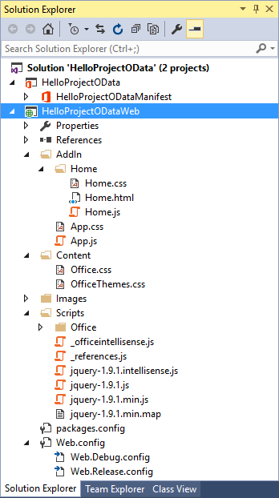

# <a name="create-a-project-add-in-that-uses-rest-with-an-on-premises-project-server-odata-service"></a>社内の Project Server OData サービスで REST を使用する Project アドインを作成する

この記事では、アクティブなプロジェクトのコストと作業のデータを現在の Project Web App インスタンスの全プロジェクトの平均と比較する Project Professional 2013 用の作業ウィンドウ アドインを作成する方法を説明します。 アドインでは、jQuery ライブラリと共に REST を使用して、Project Server 2013 の **ProjectData** OData レポート サービスにアクセスします。

この記事のコードは、Microsoft Corporation の Saurabh Sanghvi と Arvind Iyer が開発したサンプルに基づいています。

## <a name="prerequisites"></a>前提条件

Project Server 2013 のオンプレミス インストールで、Project Web App インスタンスの **ProjectData** サービスを読み取る Project 作業ウィンドウ アドインを作成するための前提条件を次に示します。

- 使用するローカルの開発用コンピューターに最新のサービス パックと Windows 更新プログラムをインストールしてあることを確認します。オペレーティング システムは、Windows 7、Windows 8、Windows Server 2008、Windows Server 2012 のいずれでもかまいません。

- Project Web App との接続には Project Professional 2013が必要です。 Visual Studio で **F5** デバッグを有効にするには、開発用コンピューターに Project Professional 2013 がインストールされている必要があります。

    > [!NOTE]
    > Project Standard 2013 では作業ウィンドウ アドインをホストすることもできますが、Project Web Appにサインインすることはできません。

- Office Developer Tools for Visual Studio を備えた Visual Studio 2015 には、Office アドインと SharePoint アドインの作成用のテンプレートが含まれています。最新バージョンの Office Developer Tools がインストールされていることを確認してください。 _Office アドインと SharePoint のダウンロード_ の「 [ツール](https://developer.microsoft.com/office/docs) 」セクションを参照してください。

- この記事の手順とコード例は、ローカル ドメイン内の Project Server 2013 の **ProjectData** サービスにアクセスします。 この記事の jQuery メソッドは、Web 上の Project では機能しません。

    **ProjectData** サービスに開発用コンピューターからアクセス可能であることを確認します。

### <a name="procedure-1-verify-that-the-projectdata-service-is-accessible"></a>手順 1. ProjectData サービスにアクセス可能であることを確認する

1. ブラウザーで REST クエリの XML データを直接表示できるようにするには、フィードの読み取りビューをオフにします。 Internet Explorer でこれを行う方法については、 [Project レポート データのクエリ OData フィード](/previous-versions/office/project-odata/jj163048(v=office.15))の手順 1 の手順 4 を参照してください。

2. ブラウザーを使用して **ProjectData** サービスにクエリを実行します。 **http://ServerName /ProjectServerName /_api/ProjectData**。 たとえば、Project Web App インスタンスの場合、ブラウザーに`http://MyServer/pwa`次の結果が表示されます。

    ```xml
    <?xml version="1.0" encoding="utf-8"?>
        <service xml:base="http://myserver/pwa/_api/ProjectData/"
        xmlns="https://www.w3.org/2007/app"
        xmlns:atom="https://www.w3.org/2005/Atom">
        <workspace>
            <atom:title>Default</atom:title>
            <collection href="Projects">
                <atom:title>Projects</atom:title>
            </collection>
            <collection href="ProjectBaselines">
                <atom:title>ProjectBaselines</atom:title>
            </collection>
            <!-- ... and 33 more collection elements -->
        </workspace>
        </service>
    ```

3. 結果を確認するためにネットワーク資格情報の入力が必要になることもあります。ブラウザーでアクセスが拒否されことを示すメッセージ (エラー 403) が表示された場合は、その Project Web App インスタンスに対するログオンのアクセス許可を与えられていないか、管理者のサポートを必要とするネットワーク上の問題が発生しています。

## <a name="use-visual-studio-to-create-a-task-pane-add-in-for-project"></a>Visual Studio を使用して Project の作業ウィンドウ アドインを作成する

Office Developer Tools for Visual Studio には、Project 2013 用の作業ウィンドウ アドインのためのテンプレートが含まれています。 **HelloProjectOData** という名前のソリューションを作成する場合、ソリューションには次の 2 つの Visual Studio プロジェクトが含まれます。

- アドイン プロジェクトは、ソリューションの名前を受け取ります。 アドインの XML マニフェスト ファイルが含まれ、.NET Framework 4.5 を対象とします。 手順 3 では、 **HelloProjectOData** アドインのマニフェストを変更する手順を示します。

- Web プロジェクトの名前は **HelloProjectODataWeb です**。 作業ウィンドウには、Web コンテンツの Web ページ、JavaScript ファイル、CSS ファイル、画像、参照ファイル、構成ファイルが含まれます。 Web プロジェクトは、.NET Framework 4 を対象とします。 手順 4 と手順 5 では、Web プロジェクト内のファイルを変更して **HelloProjectOData** アドインの機能を作成する方法を示します。

### <a name="procedure-2-create-the-helloprojectodata-add-in-for-project"></a>手順 2. Project 用 HelloProjectOData アドインを作成する

1. Visual Studio 2015 を管理者として実行し、スタート ページで **[新しいプロジェクト** ] を選択します。

2. [**新しいプロジェクト**] ダイアログ ボックスで、[**テンプレート**]、[**Visual C#**]、および **[Office/SharePoint**] ノードを展開し、[**Office アドイン**] を選択します。中央のウィンドウの上部にあるターゲット フレームワークドロップダウン リストで **.NET Framework 4.5.2** を選択し、**Office アドイン** を選択します (次のスクリーンショットを参照)。

3. これらの Visual Studio プロジェクトを両方とも同じディレクトリに配置するには、[**ソリューションのディレクトリを作成**] を選択し、目的の場所を参照します。

4. **[名前]** フィールドに「HelloProjectOData」と入力し、[OK] を選択 **します**。

    *図 1.Office アドインを作成する*

    

5. [**アドインの種類の選択**] ダイアログ ボックスで、[**作業ウィンドウ**] を選択して、[**次へ**] を選択します (次のスクリーンショットを参照)。

    *図 2. 作成するアドインの種類の選択*

    

6. [**ホスト アプリケーションの選択**] ダイアログ ボックスで、[**Project**] 以外のすべてのチェック ボックスをオフにし (次のスクリーンショットを参照)、[**完了**] をクリックします。

    *図 3. ホスト アプリケーションの選択*

    ![唯一のホスト アプリケーションとして [Project] を選択します。](../images/create-office-add-in.png)

    Visual Studio では、 **HelloProjectOdata** プロジェクトと **HelloProjectODataWeb** プロジェクトが作成されます。

[**AddIn**] フォルダー (次のスクリーンショットを参照) には、カスタム CSS スタイルの App.css ファイルが含まれています。 **ホーム** サブフォルダー内の、Home.html ファイルには、CSS ファイル、アドインを使用している JavaScript ファイル、およびアドインの HTML5 コンテンツへの参照が含まれています。 また、Home.js ファイルは、カスタムの JavaScript コード用です。 **Scripts** フォルダーには、jQuery ライブラリのファイルが含まれています。 **Office** サブフォルダーには、office.js や project-15.js などの JavaScript ライブラリ、および Office アドインでの標準の文字列用の言語ライブラリが含まれています。**コンテンツ** フォルダーで Office.css ファイルには、Office のアドインのすべてに使用する既定のスタイルが含まれます。

*図 4.ソリューション エクスプローラーで既定の Web プロジェクト ファイルを表示する*



**HelloProjectOData** プロジェクトのマニフェストは、HelloProjectOData.xml ファイルです。 必要に応じてマニフェストを編集して、アドインの説明、アイコンへの参照、追加言語の情報、その他の設定を追加できます。 手順 3 では、アドインの表示名と説明を変更し、アイコンを追加します。

マニフェストについて詳しくは、「[Office アドインの XML マニフェスト](../develop/add-in-manifests.md)」と「[Office アドインのマニフェスト向けのスキーマ リファレンス (v1.1)](../develop/add-in-manifests.md#see-also)」をご覧ください。

### <a name="procedure-3-modify-the-add-in-manifest"></a>手順 3. アドイン マニフェストを変更する

1. Visual Studio で、HelloProjectOData.xml ファイルを開きます。

2. 既定の表示名は、Visual Studio プロジェクトの名前です ("HelloProjectOData")。 たとえば、要素の既定値を **\<DisplayName\>** "Hello ProjectData" に変更します。

3. 既定の説明も "HelloProjectOData" です。たとえば、Description 要素の既定値を "Test REST queries of the ProjectData service" に変更します。

4. リボンの [**プロジェクト**] タブの [**Office アドイン**] ドロップダウン リストに表示するアイコンを追加します。 Visual Studio ソリューションにアイコン ファイルを追加することも、アイコンの URL を使用することもできます。 

次の手順では、Visual Studio ソリューションにアイコン ファイルを追加する方法を示します。

1. **ソリューション エクスプローラー** で、Images という名前のフォルダーに移動します。

2. **Office アドイン** ドロップダウン リストに表示するには、アイコンは 32 x 32 ピクセルである必要があります。 たとえば、Project 2013 SDK をインストールしてから、**[Images]** フォルダーを選択し、SDK から次のファイルを追加します。`\Samples\Apps\HelloProjectOData\HelloProjectODataWeb\Images\NewIcon.png`。

    または、独自の 32 x 32 アイコンを使用します。または、次の画像をNewIcon.pngという名前のファイルにコピーし、そのファイルをフォルダーに  `HelloProjectODataWeb\Images` 追加します。

    

3. HelloProjectOData.xml マニフェストで、要素の下に要素を **\<IconUrl\>****\<Description\>** 追加します。ここで、アイコン URL の値は、32x32 アイコン ファイルへの相対パスです。 たとえば、次の行を追加します `<IconUrl DefaultValue="~remoteAppUrl/Images/NewIcon.png" />`。 HelloProjectOData.xml マニフェスト ファイルに次のものが含まれるようになりました ( **\<Id\>** 値は異なります)。

    ```XML
    <?xml version="1.0" encoding="UTF-8"?>
    <OfficeApp xmlns="http://schemas.microsoft.com/office/appforoffice/1.1"
            xmlns:xsi="http://www.w3.org/2001/XMLSchema-instance" xsi:type="TaskPaneApp">
        <!--IMPORTANT! Id must be unique for each add-in. If you copy this manifest ensure that you change this id to your own GUID. -->
        <Id>c512df8d-a1c5-4d74-8a34-d30f6bbcbd82</Id>
        <Version>1.0</Version>
        <ProviderName> [Provider name]</ProviderName>
        <DefaultLocale>en-US</DefaultLocale>
        <DisplayName DefaultValue="Hello ProjectData" />
        <Description DefaultValue="Test REST queries of the ProjectData service"/>
        <IconUrl DefaultValue="~remoteAppUrl/Images/NewIcon.png" />
        <SupportUrl DefaultValue="[Insert the URL of a page that provides support information for the app]" />
        <Hosts>
            <Host Name="Project" />
        </Hosts>
        <DefaultSettings>
            <SourceLocation DefaultValue="~remoteAppUrl/AddIn/Home/Home.html" />
        </DefaultSettings>
        <Permissions>ReadWriteDocument</Permissions>
    </OfficeApp>
    ```

## <a name="create-the-html-content-for-the-helloprojectodata-add-in"></a>HelloProjectOData アドインの HTML コンテンツを作成する

**HelloProjectOData** アドインは、デバッグとエラー出力を含むサンプルです。運用環境での使用を目的としたものではありません。 Before you start coding the HTML content, design the UI and user experience for the add-in, and outline the JavaScript functions that interact with the HTML code. 詳細については、「 [Office アドインの設計ガイドライン](../design/add-in-design.md)」を参照してください。

作業ウィンドウの上部にアドインの表示名が表示されます。これはマニフェスト内の要素の **\<DisplayName\>** 値です。 HelloProjectOData.html ファイルの **body** 要素には、次のような他の UI 要素が含まれています。

- サブタイトルは、**ODATA REST QUERY** など、操作の一般的な機能または種類を表します。

- **[ProjectData エンドポイントの取得**] ボタンは、関数を`setOdataUrl`呼び出して **ProjectData** サービスのエンドポイントを取得し、テキスト ボックスに表示します。 Project が Project Web App と接続されていない場合、アドインはエラー ハンドラーを呼び出して、ポップアップ エラー メッセージを表示します。

- アドインが有効な OData エンドポイントを取得するまで、[ **すべてのプロジェクトの比較]** ボタンは無効になります。 ボタンを選択すると、関数が `retrieveOData` 呼び出されます。この関数は、REST クエリを使用して **ProjectData** サービスからプロジェクトのコストと作業データを取得します。

- テーブルには、プロジェクト コスト、実績コスト、作業、および達成率の平均値が表示されます。このテーブルでは、現在アクティブなプロジェクトの値と平均値との比較も行われます。現在の値が全プロジェクトの平均値より大きい場合は、その値が赤で表示されます。現在の値が平均値より小さい場合は、その値が緑で表示されます。現在の値がない場合は、青の **NA** が表示されます。

    この関数は `retrieveOData` 、テーブルの `parseODataResult` 値を計算して表示する関数を呼び出します。

    > [!NOTE]
    > この例では、アクティブなプロジェクトのコストと作業のデータは発行された値から導出されます。 Project で値を変更した場合、 **ProjectData** サービスは、プロジェクトが発行されるまで変更されません。

### <a name="procedure-4-create-the-html-content"></a>手順 4. HTML コンテンツを作成する

1. Home.html ファイルの **ヘッド** 要素に、アドインで使用する CSS ファイルの **追加のリンク** 要素を追加します。 Visual Studio プロジェクト テンプレートには、カスタム CSS スタイルに使用できる App.css ファイルのリンクが含まれています。

2. アドインで使用する JavaScript ライブラリ用 **のスクリプト要素** を追加します。 プロジェクト テンプレートには、スクリプト フォルダー内の jQuery - _[version]_.js、office.js、MicrosoftAjax.js ファイルのリンク **が** 含まれています。

    > [!NOTE]
    > アドインを展開する前に、office.js の参照と jQuery の参照をコンテンツ配信ネットワーク (CDN) の参照に変更してください。CDN の参照は最新のバージョンと高いパフォーマンスを提供します。

    **HelloProjectOData** アドインでは、ポップアップ メッセージにエラーが表示されるSurfaceErrors.js ファイルも使用されます。 [テキスト エディターを使用して Project 2013 の最初の作業ウィンドウ アドインを作成](../project/create-your-first-task-pane-add-in-for-project-by-using-a-text-editor.md)するの _[堅牢なプログラミング_] セクションからコードをコピーし、**HelloProjectODataWeb** プロジェクトの **Scripts\Office** フォルダーにSurfaceErrors.js ファイルを追加できます。

    次に、 **ヘッド** 要素の更新された HTML コードと、SurfaceErrors.js ファイルの追加行を示します。

    ```HTML
    <!DOCTYPE html>
    <html>
    <head>
    <meta charset="UTF-8" />
    <meta http-equiv="X-UA-Compatible" content="IE=Edge" />
    <title>Test ProjectData Service</title>

    <link rel="stylesheet" type="text/css" href="../Content/Office.css" />

    <!-- Add your CSS styles to the following file. -->
    <link rel="stylesheet" type="text/css" href="../Content/App.css" />

    <!-- Use the CDN reference to the mini-version of jQuery when deploying your add-in. -->
    <!--<script src="http://ajax.aspnetcdn.com/ajax/jquery/jquery-1.9.0.min.js"></script> -->
    <script src="../Scripts/jquery-1.7.1.js"></script>

    <!-- Use the CDN reference to office.js when deploying your add-in. -->
    <!--<script src="https://appsforoffice.microsoft.com/lib/1/hosted/office.js"></script>-->

    <!-- Use the local script references for Office.js to enable offline debugging -->
    <script src="../Scripts/Office/1.0/MicrosoftAjax.js"></script>
    <script src="../Scripts/Office/1.0/Office.js"></script>

    <!-- Add your JavaScript to the following files. -->
    <script src="../Scripts/HelloProjectOData.js"></script>
    <script src="../Scripts/SurfaceErrors.js"></script>
    </head>
    <body>
    <!-- See the code in Step 3. -->
    </body>
    </html>
    ```

3. **body** 要素で、テンプレートから既存のコードを削除し、ユーザー インターフェイスのコードを追加します。 要素にデータを入れるか、要素を jQuery ステートメントで操作する場合、その要素に一意の **id** 属性が含まれている必要があります。 次のコードでは、jQuery 関数が使用する **ボタン**、**スパン**、**および td** (テーブル セル定義) 要素の **ID** 属性が太字で表示されます。

   次の HTML は、グラフィックス イメージ (会社のロゴなど) を追加します。 任意のロゴを使用するか、Project 2013 SDK ダウンロードからNewLogo.png ファイルをコピーしてから **、ソリューション エクスプローラー** を使用してファイルをフォルダーに`HelloProjectODataWeb\Images`追加できます。

    ```HTML
    <body>
        <div id="SectionContent">
        <div id="odataQueries">
            ODATA REST QUERY
        </div>
        <div id="odataInfo">
            <button class="button-wide" onclick="setOdataUrl()">Get ProjectData Endpoint</button>
            <br /><br />
            <span class="rest" id="projectDataEndPoint">Endpoint of the 
                <strong>ProjectData</strong> service</span>
            <br />
        </div>
        <div id="compareProjectData">
            <button class="button-wide" disabled="disabled" id="compareProjects"
            onclick="retrieveOData()">Compare All Projects</button>
            <br />
        </div>
        </div>
        <div id="corpInfo">
            <table class="infoTable" aria-readonly="True" style="width: 100%;">
                <tr>
                    <td class="heading_leftCol"></td>
                    <td class="heading_midCol"><strong>Average</strong></td>
                    <td class="heading_rightCol"><strong>Current</strong></td>
                </tr>
                <tr>
                    <td class="row_leftCol"><strong>Project Cost</strong></td>
                    <td class="row_midCol" id="AverageProjectCost">&amp;nbsp;</td>
                    <td class="row_rightCol" id="CurrentProjectCost">&amp;nbsp;</td>
                </tr>
                <tr>
                    <td class="row_leftCol"><strong>Project Actual Cost</strong></td>
                    <td class="row_midCol" id="AverageProjectActualCost">&amp;nbsp;</td>
                    <td class="row_rightCol" id="CurrentProjectActualCost">&amp;nbsp;</td>
                </tr>
                <tr>
                    <td class="row_leftCol"><strong>Project Work</strong></td>
                    <td class="row_midCol" id="AverageProjectWork">&amp;nbsp;</td>
                    <td class="row_rightCol" id="CurrentProjectWork">&amp;nbsp;</td>
                </tr>
                <tr>
                    <td class="row_leftCol"><strong>Project % Complete</strong></td>
                    <td class="row_midCol" id="AverageProjectPercentComplete">&amp;nbsp;</td>
                    <td class="row_rightCol" id="CurrentProjectPercentComplete">&amp;nbsp;</td>
                </tr>
            </table>
        </div>
        
        <br />
        <textarea id="odataText" rows="12" cols="40"></textarea>
    </body>
    ```

## <a name="create-the-javascript-code-for-the-add-in"></a>アドインの JavaScript コードを作成する

プロジェクト作業ウィンドウ アドインのテンプレートには、一般的な Office 2013 アドインのドキュメント内のデータの基本的な取得および設定アクションを示すように設計された既定の初期化コードが含まれています。 Project 2013 はアクティブなプロジェクトに書き込むアクションをサポートしていないため、 **HelloProjectOData** アドインではメソッドを `getSelectedDataAsync` 使用しないため、関数内 `Office.initialize` のスクリプトを削除し、既定の `setData` HelloProjectOData.js ファイルで関数と `getData` 関数を削除できます。

JavaScript には、REST クエリ用のグローバル定数と、いくつかの関数で使用されるグローバル変数が含まれています。 **[ProjectData エンドポイントの取得**] ボタンは、グローバル変数を`setOdataUrl`初期化し、Project がProject Web Appに接続されているかどうかを判断する関数を呼び出します。

HelloProjectOData.js ファイルの残りの部分には 2 つの関数が含まれます。 `retrieveOData` この関数は、ユーザーが **[すべてのプロジェクトの比較**] を選択したときに呼び出され `parseODataResult` 、関数は平均を計算し、色と単位に書式設定された値を比較テーブルに設定します。

### <a name="procedure-5-create-the-javascript-code"></a>手順 5. JavaScript コードを作成する

1. 既定のHelloProjectOData.js ファイル内のすべてのコードを削除し、グローバル変数と `**`Office.initialize' 関数を追加します。 すべて大文字の変数名は、それらが定数であることを示しており、それらは後で **_pwa** 変数と共に使用されて、この例の REST クエリが作成されます。

    ```js
    var PROJDATA = "/_api/ProjectData";
    var PROJQUERY = "/Projects?";
    var QUERY_FILTER = "$filter=ProjectName ne 'Timesheet Administrative Work Items'";
    var QUERY_SELECT1 = "&amp;$select=ProjectId, ProjectName";
    var QUERY_SELECT2 = ", ProjectCost, ProjectWork, ProjectPercentCompleted, ProjectActualCost";
    var _pwa;           // URL of Project Web App.
    var _projectUid;    // GUID of the active project.
    var _docUrl;        // Path of the project document.
    var _odataUrl = ""; // URL of the OData service: http[s]://ServerName /ProjectServerName /_api/ProjectData

    // The initialize function is required for all add-ins.
    Office.initialize = function (reason) {
        // Checks for the DOM to load using the jQuery ready function.
        $(document).ready(function () {
            // After the DOM is loaded, app-specific code can run.
        });
    }
    ```

2. 関数と関連関数を追加 `setOdataUrl` します。 この関数は `setOdataUrl` 、グローバル変数を呼び出 `getProjectGuid` して `getDocumentUrl` 初期化します。 [getProjectFieldAsync メソッド](/javascript/api/office/office.document)では、_コールバック_ パラメーターの匿名関数により、jQuery ライブラリのメソッドを使用`removeAttr`して **[すべてのプロジェクトの比較]** ボタンが有効になり、**ProjectData** サービスの URL が表示されます。 Project が Project Web App と接続されていない場合、この関数はエラーをスローし、それによってポップアップ エラー メッセージが表示されます。 SurfaceErrors.js ファイルには、メソッドが `throwError` 含まれています。

   > [!NOTE]
   > Visual Studio を Project Server コンピューター上で実行する場合、**F5** デバッグを使用するには、**_pwa** グローバル変数を初期化する行の後にあるコードのコメントを解除します。 Project Server コンピューターでデバッグするときに jQuery `ajax` メソッドを使用できるようにするには、PWA URL の `localhost` 値を設定する必要があります。リモート コンピューターで Visual Studio を実行する場合、  `localhost` URL は必要ありません。 Before you deploy the add-in, comment out that code.

    ```js
    function setOdataUrl() {
        Office.context.document.getProjectFieldAsync(
            Office.ProjectProjectFields.ProjectServerUrl,
            function (asyncResult) {
                if (asyncResult.status == Office.AsyncResultStatus.Succeeded) {
                    _pwa = String(asyncResult.value.fieldValue);

                    // If you debug with Visual Studio on a local Project Server computer, 
                    // uncomment the following lines to use the localhost URL.
                    //var localhost = location.host.split(":", 1);
                    //var pwaStartPosition = _pwa.lastIndexOf("/");
                    //var pwaLength = _pwa.length - pwaStartPosition;
                    //var pwaName = _pwa.substr(pwaStartPosition, pwaLength);
                    //_pwa = location.protocol + "//" + localhost + pwaName;

                    if (_pwa.substring(0, 4) == "http") {
                        _odataUrl = _pwa + PROJDATA;
                        $("#compareProjects").removeAttr("disabled");
                        getProjectGuid();
                    }
                    else {
                        _odataUrl = "No connection!";
                        throwError(_odataUrl, "You are not connected to Project Web App.");
                    }
                    getDocumentUrl();
                    $("#projectDataEndPoint").text(_odataUrl);
                }
                else {
                    throwError(asyncResult.error.name, asyncResult.error.message);
                }
            }
        );
    }

    // Get the GUID of the active project.
    function getProjectGuid() {
        Office.context.document.getProjectFieldAsync(
            Office.ProjectProjectFields.GUID,
            function (asyncResult) {
                if (asyncResult.status == Office.AsyncResultStatus.Succeeded) {
                    _projectUid = asyncResult.value.fieldValue;
                }
                else {
                    throwError(asyncResult.error.name, asyncResult.error.message);
                }
            }
        );
    }

    // Get the path of the project in Project web app, which is in the form <>\ProjectName .
    function getDocumentUrl() {
        _docUrl = "Document path:\r\n" + Office.context.document.url;
    }
    ```

3. REST クエリの値を `retrieveOData` 連結し、jQuery で関数を `ajax` 呼び出して **ProjectData** サービスから要求されたデータを取得する関数を追加します。 **support.cors** 変数を使用すると、関数とのクロスオリジン リソース共有 (CORS) が`ajax`可能になります。 **support.cors** ステートメントが見つからないか **、false** に設定されている場合、`ajax`この関数は **トランスポート エラーなし** を返します。

   > [!NOTE]
   > 次に示すコードは、Project Server 2013 のオンプレミスのインストールで動作します。Project on the web の場合は、トークン ベースの認証に OAuth を使用できます。詳細については、「[Office アドインにおける同一生成元ポリシーの制限への対処](../develop/addressing-same-origin-policy-limitations.md)」を参照してください。

   `ajax`呼び出しでは、_headers_ パラメーターまたは _beforeSend_ パラメーターのいずれかを使用できます。 _完全な_ パラメーターは匿名関数であるため、`retrieveOData`. _完全な_ パラメーターの関数は、コントロールに結果を`odataText`表示し、JSON 応答を`parseODataResult`解析して表示するメソッドも呼び出します。 _error_ パラメーターは名前付き`getProjectDataErrorHandler`関数を指定します。この関数は、エラー メッセージをコントロールに`odataText`書き込み、メソッドを`throwError`使用してポップアップ メッセージを表示します。

    ```js
    // Functions to get and parse the Project Server reporting data./

    // Get data about all projects on Project Server,
    // by using a REST query with the ajax method in jQuery.
    function retrieveOData() {
        var restUrl = _odataUrl + PROJQUERY + QUERY_FILTER + QUERY_SELECT1 + QUERY_SELECT2;
        var accept = "application/json; odata=verbose";
        accept.toLocaleLowerCase();

        // Enable cross-origin scripting (required by jQuery 1.5 and later).
        // This does not work with Project on the web.
        $.support.cors = true;

        $.ajax({
            url: restUrl,
            type: "GET",
            contentType: "application/json",
            data: "",      // Empty string for the optional data.
            //headers: { "Accept": accept },
            beforeSend: function (xhr) {
                xhr.setRequestHeader("ACCEPT", accept);
            },
            complete: function (xhr, textStatus) {
                // Create a message to display in the text box.
                var message = "\r\ntextStatus: " + textStatus +
                    "\r\nContentType: " + xhr.getResponseHeader("Content-Type") +
                    "\r\nStatus: " + xhr.status +
                    "\r\nResponseText:\r\n" + xhr.responseText;

                // xhr.responseText is the result from an XmlHttpRequest, which
                // contains the JSON response from the OData service.
                parseODataResult(xhr.responseText, _projectUid);

                // Write the document name, response header, status, and JSON to the odataText control.
                $("#odataText").text(_docUrl);
                $("#odataText").append("\r\nREST query:\r\n" + restUrl);
                $("#odataText").append(message);

                if (xhr.status != 200 &amp;&amp; xhr.status != 1223 &amp;&amp; xhr.status != 201) {
                    $("#odataInfo").append("<div>" + htmlEncode(restUrl) + "</div>");
                }
            },
            error: getProjectDataErrorHandler
        });
    }

    function getProjectDataErrorHandler(data, errorCode, errorMessage) {
        $("#odataText").text("Error code: " + errorCode + "\r\nError message: \r\n"
        + errorMessage);
        throwError(errorCode, errorMessage);
    }
    ```

4. `parseODataResult` OData サービスからの JSON 応答を逆シリアル化して処理するメソッドを追加します。 このメソッドは`parseODataResult`、コストと作業データの平均値を小数点以下 1 桁または 2 桁の精度で計算し、正しい色で値を書式設定し、単位 (**$****、hrs**、または **%**) を追加して、指定されたテーブル セルに値を表示します。

   アクティブなプロジェクトの GUID が値と一致する `ProjectId` 場合、 `myProjectIndex` 変数はプロジェクト インデックスに設定されます。 アクティブなプロジェクトが Project Server で発行されたことを示す場合 `myProjectIndex` 、 `parseODataResult` メソッドは、そのプロジェクトのコストと作業データを書式設定して表示します。 アクティブなプロジェクトが発行されていない場合は、アクティブなプロジェクトの値は青い **NA** と表示されます。

    ```js
    // Calculate the average values of actual cost, cost, work, and percent complete
    // for all projects, and compare with the values for the current project.
    function parseODataResult(oDataResult, currentProjectGuid) {
        // Deserialize the JSON string into a JavaScript object.
        var res = Sys.Serialization.JavaScriptSerializer.deserialize(oDataResult);
        var len = res.d.results.length;
        var projActualCost = 0;
        var projCost = 0;
        var projWork = 0;
        var projPercentCompleted = 0;
        var myProjectIndex = -1;
        for (i = 0; i < len; i++) {
            // If the current project GUID matches the GUID from the OData query,  
            // store the project index.
            if (currentProjectGuid.toLocaleLowerCase() == res.d.results[i].ProjectId) {
                myProjectIndex = i;
            }
            projCost += Number(res.d.results[i].ProjectCost);
            projWork += Number(res.d.results[i].ProjectWork);
            projActualCost += Number(res.d.results[i].ProjectActualCost);
            projPercentCompleted += Number(res.d.results[i].ProjectPercentCompleted);
        }
        var avgProjCost = projCost / len;
        var avgProjWork = projWork / len;
        var avgProjActualCost = projActualCost / len;
        var avgProjPercentCompleted = projPercentCompleted / len;

        // Round off cost to two decimal places, and round off other values to one decimal place.
        avgProjCost = avgProjCost.toFixed(2);
        avgProjWork = avgProjWork.toFixed(1);
        avgProjActualCost = avgProjActualCost.toFixed(2);
        avgProjPercentCompleted = avgProjPercentCompleted.toFixed(1);

        // Display averages in the table, with the correct units.
        document.getElementById("AverageProjectCost").innerHTML = "$"
            + avgProjCost;
        document.getElementById("AverageProjectActualCost").innerHTML
            = "$" + avgProjActualCost;
        document.getElementById("AverageProjectWork").innerHTML
            = avgProjWork + " hrs";
        document.getElementById("AverageProjectPercentComplete").innerHTML
            = avgProjPercentCompleted + "%";

        // Calculate and display values for the current project.
        if (myProjectIndex != -1) {
            var myProjCost = Number(res.d.results[myProjectIndex].ProjectCost);
            var myProjWork = Number(res.d.results[myProjectIndex].ProjectWork);
            var myProjActualCost = Number(res.d.results[myProjectIndex].ProjectActualCost);
            var myProjPercentCompleted =
            Number(res.d.results[myProjectIndex].ProjectPercentCompleted);

            myProjCost = myProjCost.toFixed(2);
            myProjWork = myProjWork.toFixed(1);
            myProjActualCost = myProjActualCost.toFixed(2);
            myProjPercentCompleted = myProjPercentCompleted.toFixed(1);

            document.getElementById("CurrentProjectCost").innerHTML = "$" + myProjCost;

            if (Number(myProjCost) <= Number(avgProjCost)) {
                document.getElementById("CurrentProjectCost").style.color = "green"
            }
            else {
                document.getElementById("CurrentProjectCost").style.color = "red"
            }

            document.getElementById("CurrentProjectActualCost").innerHTML = "$" + myProjActualCost;

            if (Number(myProjActualCost) <= Number(avgProjActualCost)) {
                document.getElementById("CurrentProjectActualCost").style.color = "green"
            }
            else {
                document.getElementById("CurrentProjectActualCost").style.color = "red"
            }

            document.getElementById("CurrentProjectWork").innerHTML = myProjWork + " hrs";

            if (Number(myProjWork) <= Number(avgProjWork)) {
                document.getElementById("CurrentProjectWork").style.color = "red"
            }
            else {
                document.getElementById("CurrentProjectWork").style.color = "green"
            }

            document.getElementById("CurrentProjectPercentComplete").innerHTML = myProjPercentCompleted + "%";

            if (Number(myProjPercentCompleted) <= Number(avgProjPercentCompleted)) {
                document.getElementById("CurrentProjectPercentComplete").style.color = "red"
            }
            else {
                document.getElementById("CurrentProjectPercentComplete").style.color = "green"
            }
        }
        else {
            document.getElementById("CurrentProjectCost").innerHTML = "NA";
            document.getElementById("CurrentProjectCost").style.color = "blue"

            document.getElementById("CurrentProjectActualCost").innerHTML = "NA";
            document.getElementById("CurrentProjectActualCost").style.color = "blue"

            document.getElementById("CurrentProjectWork").innerHTML = "NA";
            document.getElementById("CurrentProjectWork").style.color = "blue"

            document.getElementById("CurrentProjectPercentComplete").innerHTML = "NA";
            document.getElementById("CurrentProjectPercentComplete").style.color = "blue"
        }
    }
    ```

## <a name="test-the-helloprojectodata-add-in"></a>HelloProjectOData アドインをテストする

Visual Studio 2015 で **HelloProjectOData** アドインをテストしてデバッグするには、開発用コンピューターに 2013 Project Professionalインストールする必要があります。 他のテスト シナリオを有効にするには、Project がローカル コンピューター上のファイルに対して開くか、Project Web App と接続するかを選択できることを確認してください。 たとえば、次の手順を実行します。

1. [ **ファイル** ] タブの [Backstage] ビューで [ **情報** ] タブを選択し、[ **アカウントの管理**] を選択します。

2. **[Project Web アプリ アカウント**] ダイアログ ボックスの [**使用可能なアカウント**] ボックスの一覧には、ローカル **コンピューター** アカウントに加えて、複数のProject Web App アカウントを含めることができます。 [ **開始時**] セクションで、[ **アカウントを選択する**] を選択します。

3. Project を閉じます。それにより、Visual Studio でアドインのデバッグ用に Project 起動できるようになります。

基本的なテストでは、次のことを行う必要があります。

- アドインを Visual Studio から実行し、コストと作業のデータが含まれている Project Web App から発行済みのプロジェクトを開きます。 アドインに **ProjectData** エンドポイントが表示され、コストと作業データがテーブルに正しく表示されることを確認します。 **odataText** コントロール内の出力により、REST クエリとその他の情報を確認できます。

- アドインを再び実行し、Project の起動時に [**ログイン**] ダイアログ ボックスでローカル コンピューターのプロファイルを選択します。 ローカル .mpp ファイルを開き、アドインをテストします。 **ProjectData** エンドポイントを取得しようとしたときに、アドインがエラー メッセージを表示することを確認します。

- アドインを再び実行し、コストと作業のデータのタスクを持つプロジェクトを作成します。 そのプロジェクトを Project Web App に保存することはできますが、発行はしないでください。 アドインが Project Server からのデータを表示するものの、現在のプロジェクトについては **NA** であることを確認します。

### <a name="procedure-6-test-the-add-in"></a>手順 6. アドインをテストする

1. Project Professional 2013 を実行し、Project Web App と接続してから、テスト プロジェクトを作成します。ローカル リソースまたはエンタープライズ リソースにタスクを割り当て、いくつかのタスクに対して達成率のさまざまな値を設定してから、そのプロジェクトを発行します。Project を終了します。それにより、Visual Studio がアドインのデバッグ用に Project を起動できるようになります。

2. Visual Studio で **F5** キーを押します。 Project Web App にログオンし、前のステップで作成したプロジェクトを開きます。 このとき、読み取り専用モードで開くことも、編集モードで開くこともできます。

3. リボンの [ **PROJECT** ] タブの **[Office アドイン** ] ドロップダウン リストで、 **Hello ProjectData** を選択します (図 5 を参照)。 [ **すべてのプロジェクトを比較**] ボタンが無効化されるはずです。

    *図 5.HelloProjectOData アドインを開始する*

    

4. [**ProjectData 概要**] 作業ウィンドウで、[**ProjectData エンドポイントを取得**] を選択します。 **projectDataEndPoint** 行には **ProjectData** サービスの URL が表示され、[**すべてのプロジェクトの比較]** ボタンを有効にする必要があります (図 6 を参照)。

5. [**すべてのプロジェクトを比較**] を選択します。 アドインは、**ProjectData** サービスからデータを取得している間、一時停止する可能性がありますが、その後、書式化された平均値と現在値をテーブルに表示します。

    *図 6.REST クエリの結果を表示する*

    

6. テキスト ボックス内の出力を調べます。 ドキュメント パス、REST クエリ、状態情報、および **ajax** と **parseODataResult** の呼び出しからの JSON 結果を表示する必要があります。 出力は、次のような`projCost += Number(res.d.results[i].ProjectCost);`メソッドのコードを`parseODataResult`理解し、作成し、デバッグするのに役立ちます。

    次に、Project Web App インスタンス内の 3 つのプロジェクトについて、テキストに改行とスペースを追加した出力の例を示します。

    ```json
    Document path: <>\WinProj test1

    REST query:
    http://sphvm-37189/pwa/_api/ProjectData/Projects?$filter=ProjectName ne 'Timesheet Administrative Work Items'
        &amp;$select=ProjectId, ProjectName, ProjectCost, ProjectWork, ProjectPercentCompleted, ProjectActualCost

    textStatus: success
    ContentType: application/json;odata=verbose;charset=utf-8
    Status: 200

    ResponseText:
    {"d":{"results":[
    {"__metadata":
        {"id":"http://sphvm-37189/pwa/_api/ProjectData/Projects(guid'ce3d0d65-3904-e211-96cd-00155d157123')",
        "uri":"http://sphvm-37189/pwa/_api/ProjectData/Projects(guid'ce3d0d65-3904-e211-96cd-00155d157123')",
        "type":"ReportingData.Project"},
        "ProjectId":"ce3d0d65-3904-e211-96cd-00155d157123",
        "ProjectActualCost":"0.000000",
        "ProjectCost":"0.000000",
        "ProjectName":"Task list created in PWA",
        "ProjectPercentCompleted":0,
        "ProjectWork":"16.000000"},
    {"__metadata":
        {"id":"http://sphvm-37189/pwa/_api/ProjectData/Projects(guid'c31023fc-1404-e211-86b2-3c075433b7bd')",
        "uri":"http://sphvm-37189/pwa/_api/ProjectData/Projects(guid'c31023fc-1404-e211-86b2-3c075433b7bd')",
        "type":"ReportingData.Project"},
        "ProjectId":"c31023fc-1404-e211-86b2-3c075433b7bd",
        "ProjectActualCost":"700.000000",
        "ProjectCost":"2400.000000",
        "ProjectName":"WinProj test 2",
        "ProjectPercentCompleted":29,
        "ProjectWork":"48.000000"},
    {"__metadata":
        {"id":"http://sphvm-37189/pwa/_api/ProjectData/Projects(guid'dc81fbb2-b801-e211-9d2a-3c075433b7bd')",
        "uri":"http://sphvm-37189/pwa/_api/ProjectData/Projects(guid'dc81fbb2-b801-e211-9d2a-3c075433b7bd')",
        "type":"ReportingData.Project"},
        "ProjectId":"dc81fbb2-b801-e211-9d2a-3c075433b7bd",
        "ProjectActualCost":"1900.000000",
        "ProjectCost":"5200.000000",
        "ProjectName":"WinProj test1",
        "ProjectPercentCompleted":37,
        "ProjectWork":"104.000000"}
    ]}}
    ```

7. デバッグを停止し (**Shift + F5** キーを押す)、**F5** キーを再び押して、Project の新しいインスタンスを実行します。 [ **ログイン**] ダイアログ ボックスで、Project Web App ではなく、ローカル  **コンピューター** のプロファイルを選択します。 ローカル プロジェクト .mpp ファイルを作成するか開き、[ **ProjectData 概要**] 作業ウィンドウを開き、[ **ProjectData エンドポイントを取得**] を選択します。 アドインに **[接続なし]** が表示されます。 エラー (図 7 を参照)、 **[すべてのプロジェクトの比較]** ボタンは引き続き無効にする必要があります。

   *図 7.Project Web アプリ接続なしでアドインを使用する*

   

8. デバッグを停止してから、**F5** キーを再び押します。 Project Web App にログオンし、コストと作業のデータが含まれるプロジェクトを作成します。 このプロジェクトを保存することはできますが、発行しないでください。

   **Hello ProjectData** 作業ウィンドウで、[**すべてのプロジェクトの比較**] を選択すると、[**現在**] 列のフィールドに青い **NA が** 表示されます (図 8 を参照)。

   *図 8.非公開のプロジェクトを他のプロジェクトと比較する*

   

アドインがこれまでのテストで正常に動作しているとしても、実行する必要のあるテストはまだあります。 たとえば、次のことを行います。

- Project Web App からタスクのコストと作業のデータがないプロジェクトを開きます。 [**現在**] 列のフィールドには 0 の値が表示されるはずです。

- タスクがないプロジェクトをテストします。

- アドインに変更を加えて発行した場合は、発行したアドインで再び同様のテストを実行する必要があります。その他の考慮事項については、「[次のステップ](#next-steps)」を参照してください。

> [!NOTE]
> **ProjectData** サービスの 1 つのクエリで返すことができるデータの量には制限があります。データの量はエンティティによって異なります。 たとえば、エンティティ セットの `Projects` 既定の制限はクエリあたり 100 プロジェクトですが `Risks` 、エンティティ セットの既定の制限は 200 です。 For a production installation, the code in the **HelloProjectOData** example should be modified to enable queries of more than 100 projects. For more information, see [Next steps](#next-steps) and [Querying OData feeds for Project reporting data](/previous-versions/office/project-odata/jj163048(v=office.15)).

## <a name="example-code-for-the-helloprojectodata-add-in"></a>HelloProjectOData アドインのコード例

### <a name="helloprojectodatahtml-file"></a>HelloProjectOData.html ファイル

次のコードは、**HelloProjectODataWeb** プロジェクトの `Pages\HelloProjectOData.html` ファイルに収められています。

```HTML
<!DOCTYPE html>
<html>
    <head>
        <meta charset="UTF-8" />
        <meta http-equiv="X-UA-Compatible" content="IE=Edge" />
        <title>Test ProjectData Service</title>

        <link rel="stylesheet" type="text/css" href="../Content/Office.css" />

        <!-- Add your CSS styles to the following file. -->
        <link rel="stylesheet" type="text/css" href="../Content/App.css" />

        <!-- Use the CDN reference to the mini-version of jQuery when deploying your add-in. -->
        <!--<script src="http://ajax.aspnetcdn.com/ajax/jquery/jquery-1.9.0.min.js"></script> -->
        <script src="../Scripts/jquery-1.7.1.js"></script>

        <!-- Use the CDN reference to Office.js when deploying your add-in -->
        <!--<script src="https://appsforoffice.microsoft.com/lib/1/hosted/office.js"></script>-->

        <!-- Use the local script references for Office.js to enable offline debugging -->
        <script src="../Scripts/Office/1.0/MicrosoftAjax.js"></script>
        <script src="../Scripts/Office/1.0/Office.js"></script>

        <!-- Add your JavaScript to the following files. -->
        <script src="../Scripts/HelloProjectOData.js"></script>
        <script src="../Scripts/SurfaceErrors.js"></script>
    </head>
    <body>
        <div id="SectionContent">
        <div id="odataQueries">
            ODATA REST QUERY
        </div>
        <div id="odataInfo">
            <button class="button-wide" onclick="setOdataUrl()">Get ProjectData Endpoint</button>
            <br />
            <br />
            <span class="rest" id="projectDataEndPoint">Endpoint of the 
            <strong>ProjectData</strong> service</span>
            <br />
        </div>
        <div id="compareProjectData">
            <button class="button-wide" disabled="disabled" id="compareProjects"
            onclick="retrieveOData()">
            Compare All Projects</button>
            <br />
        </div>
        </div>
        <div id="corpInfo">
        <table class="infoTable" aria-readonly="True" style="width: 100%;">
            <tr>
            <td class="heading_leftCol"></td>
            <td class="heading_midCol"><strong>Average</strong></td>
            <td class="heading_rightCol"><strong>Current</strong></td>
            </tr>
            <tr>
            <td class="row_leftCol"><strong>Project Cost</strong></td>
            <td class="row_midCol" id="AverageProjectCost">&amp;nbsp;</td>
            <td class="row_rightCol" id="CurrentProjectCost">&amp;nbsp;</td>
            </tr>
            <tr>
            <td class="row_leftCol"><strong>Project Actual Cost</strong></td>
            <td class="row_midCol" id="AverageProjectActualCost">&amp;nbsp;</td>
            <td class="row_rightCol" id="CurrentProjectActualCost">&amp;nbsp;</td>
            </tr>
            <tr>
            <td class="row_leftCol"><strong>Project Work</strong></td>
            <td class="row_midCol" id="AverageProjectWork">&amp;nbsp;</td>
            <td class="row_rightCol" id="CurrentProjectWork">&amp;nbsp;</td>
            </tr>
            <tr>
            <td class="row_leftCol"><strong>Project % Complete</strong></td>
            <td class="row_midCol" id="AverageProjectPercentComplete">&amp;nbsp;</td>
            <td class="row_rightCol" id="CurrentProjectPercentComplete">&amp;nbsp;</td>
            </tr>
        </table>
        </div>
        
        <br />
        <textarea id="odataText" rows="12" cols="40"></textarea>
    </body>
</html>
```

### <a name="helloprojectodatajs-file"></a>HelloProjectOData.js ファイル

次のコードは、**HelloProjectODataWeb** プロジェクトの `Scripts\Office\HelloProjectOData.js` ファイルに収められています。

```js
/* File: HelloProjectOData.js
* JavaScript functions for the HelloProjectOData example task pane app.
* October 2, 2012
*/

var PROJDATA = "/_api/ProjectData";
var PROJQUERY = "/Projects?";
var QUERY_FILTER = "$filter=ProjectName ne 'Timesheet Administrative Work Items'";
var QUERY_SELECT1 = "&amp;$select=ProjectId, ProjectName";
var QUERY_SELECT2 = ", ProjectCost, ProjectWork, ProjectPercentCompleted, ProjectActualCost";
var _pwa;           // URL of Project Web App.
var _projectUid;    // GUID of the active project.
var _docUrl;        // Path of the project document.
var _odataUrl = ""; // URL of the OData service: http[s]://ServerName /ProjectServerName /_api/ProjectData

// The initialize function is required for all add-ins.
Office.initialize = function (reason) {
    // Checks for the DOM to load using the jQuery ready function.
    $(document).ready(function () {
        // After the DOM is loaded, app-specific code can run.
    });
}

// Set the global variables, enable the Compare All Projects button,
// and display the URL of the ProjectData service.
// Display an error if Project is not connected with Project Web App.
function setOdataUrl() {
    Office.context.document.getProjectFieldAsync(
        Office.ProjectProjectFields.ProjectServerUrl,
        function (asyncResult) {
            if (asyncResult.status == Office.AsyncResultStatus.Succeeded) {
                _pwa = String(asyncResult.value.fieldValue);

                // If you debug with Visual Studio on a local Project Server computer,
                // uncomment the following lines to use the localhost URL.
                //var localhost = location.host.split(":", 1);
                //var pwaStartPosition = _pwa.lastIndexOf("/");
                //var pwaLength = _pwa.length - pwaStartPosition;
                //var pwaName = _pwa.substr(pwaStartPosition, pwaLength);
                //_pwa = location.protocol + "//" + localhost + pwaName;

                if (_pwa.substring(0, 4) == "http") {
                    _odataUrl = _pwa + PROJDATA;
                    $("#compareProjects").removeAttr("disabled");
                    getProjectGuid();
                }
                else {
                    _odataUrl = "No connection!";
                    throwError(_odataUrl, "You are not connected to Project Web App.");
                }
                getDocumentUrl();
                $("#projectDataEndPoint").text(_odataUrl);
            }
            else {
                throwError(asyncResult.error.name, asyncResult.error.message);
            }
        }
    );
}

// Get the GUID of the active project.
function getProjectGuid() {
    Office.context.document.getProjectFieldAsync(
        Office.ProjectProjectFields.GUID,
        function (asyncResult) {
            if (asyncResult.status == Office.AsyncResultStatus.Succeeded) {
                _projectUid = asyncResult.value.fieldValue;
            }
            else {
                throwError(asyncResult.error.name, asyncResult.error.message);
            }
        }
    );
}

// Get the path of the project in Project web app, which is in the form <>\ProjectName .
function getDocumentUrl() {
    _docUrl = "Document path:\r\n" + Office.context.document.url;
}

//  Functions to get and parse the Project Server reporting data./

// Get data about all projects on Project Server,
// by using a REST query with the ajax method in jQuery.
function retrieveOData() {
    var restUrl = _odataUrl + PROJQUERY + QUERY_FILTER + QUERY_SELECT1 + QUERY_SELECT2;
    var accept = "application/json; odata=verbose";
    accept.toLocaleLowerCase();

    // Enable cross-origin scripting (required by jQuery 1.5 and later).
    // This does not work with Project on the web.
    $.support.cors = true;

    $.ajax({
        url: restUrl,
        type: "GET",
        contentType: "application/json",
        data: "",      // Empty string for the optional data.
        //headers: { "Accept": accept },
        beforeSend: function (xhr) {
            xhr.setRequestHeader("ACCEPT", accept);
        },
        complete: function (xhr, textStatus) {
            // Create a message to display in the text box.
            var message = "\r\ntextStatus: " + textStatus +
                "\r\nContentType: " + xhr.getResponseHeader("Content-Type") +
                "\r\nStatus: " + xhr.status +
                "\r\nResponseText:\r\n" + xhr.responseText;

            // xhr.responseText is the result from an XmlHttpRequest, which 
            // contains the JSON response from the OData service.
            parseODataResult(xhr.responseText, _projectUid);

            // Write the document name, response header, status, and JSON to the odataText control.
            $("#odataText").text(_docUrl);
            $("#odataText").append("\r\nREST query:\r\n" + restUrl);
            $("#odataText").append(message);

            if (xhr.status != 200 &amp;&amp; xhr.status != 1223 &amp;&amp; xhr.status != 201) {
                $("#odataInfo").append("<div>" + htmlEncode(restUrl) + "</div>");
            }
        },
        error: getProjectDataErrorHandler
    });
}

function getProjectDataErrorHandler(data, errorCode, errorMessage) {
    $("#odataText").text("Error code: " + errorCode + "\r\nError message: \r\n"
        + errorMessage);
    throwError(errorCode, errorMessage);
}

// Calculate the average values of actual cost, cost, work, and percent complete
// for all projects, and compare with the values for the current project.
function parseODataResult(oDataResult, currentProjectGuid) {
    // Deserialize the JSON string into a JavaScript object.
    var res = Sys.Serialization.JavaScriptSerializer.deserialize(oDataResult);
    var len = res.d.results.length;
    var projActualCost = 0;
    var projCost = 0;
    var projWork = 0;
    var projPercentCompleted = 0;
    var myProjectIndex = -1;

    for (i = 0; i < len; i++) {
        // If the current project GUID matches the GUID from the OData query,  
        // then store the project index.
        if (currentProjectGuid.toLocaleLowerCase() == res.d.results[i].ProjectId) {
            myProjectIndex = i;
        }
        projCost += Number(res.d.results[i].ProjectCost);
        projWork += Number(res.d.results[i].ProjectWork);
        projActualCost += Number(res.d.results[i].ProjectActualCost);
        projPercentCompleted += Number(res.d.results[i].ProjectPercentCompleted);

    }
    var avgProjCost = projCost / len;
    var avgProjWork = projWork / len;
    var avgProjActualCost = projActualCost / len;
    var avgProjPercentCompleted = projPercentCompleted / len;

    // Round off cost to two decimal places, and round off other values to one decimal place.
    avgProjCost = avgProjCost.toFixed(2);
    avgProjWork = avgProjWork.toFixed(1);
    avgProjActualCost = avgProjActualCost.toFixed(2);
    avgProjPercentCompleted = avgProjPercentCompleted.toFixed(1);

    // Display averages in the table, with the correct units. 
    document.getElementById("AverageProjectCost").innerHTML = "$"
        + avgProjCost;
    document.getElementById("AverageProjectActualCost").innerHTML
        = "$" + avgProjActualCost;
    document.getElementById("AverageProjectWork").innerHTML
        = avgProjWork + " hrs";
    document.getElementById("AverageProjectPercentComplete").innerHTML
        = avgProjPercentCompleted + "%";

    // Calculate and display values for the current project.
    if (myProjectIndex != -1) {

        var myProjCost = Number(res.d.results[myProjectIndex].ProjectCost);
        var myProjWork = Number(res.d.results[myProjectIndex].ProjectWork);
        var myProjActualCost = Number(res.d.results[myProjectIndex].ProjectActualCost);
        var myProjPercentCompleted = Number(res.d.results[myProjectIndex].ProjectPercentCompleted);

        myProjCost = myProjCost.toFixed(2);
        myProjWork = myProjWork.toFixed(1);
        myProjActualCost = myProjActualCost.toFixed(2);
        myProjPercentCompleted = myProjPercentCompleted.toFixed(1);

        document.getElementById("CurrentProjectCost").innerHTML = "$" + myProjCost;

        if (Number(myProjCost) <= Number(avgProjCost)) {
            document.getElementById("CurrentProjectCost").style.color = "green"
        }
        else {
            document.getElementById("CurrentProjectCost").style.color = "red"
        }

        document.getElementById("CurrentProjectActualCost").innerHTML = "$" + myProjActualCost;

        if (Number(myProjActualCost) <= Number(avgProjActualCost)) {
            document.getElementById("CurrentProjectActualCost").style.color = "green"
        }
        else {
            document.getElementById("CurrentProjectActualCost").style.color = "red"
        }

        document.getElementById("CurrentProjectWork").innerHTML = myProjWork + " hrs";

        if (Number(myProjWork) <= Number(avgProjWork)) {
            document.getElementById("CurrentProjectWork").style.color = "red"
        }
        else {
            document.getElementById("CurrentProjectWork").style.color = "green"
        }

        document.getElementById("CurrentProjectPercentComplete").innerHTML = myProjPercentCompleted + "%";

        if (Number(myProjPercentCompleted) <= Number(avgProjPercentCompleted)) {
            document.getElementById("CurrentProjectPercentComplete").style.color = "red"
        }
        else {
            document.getElementById("CurrentProjectPercentComplete").style.color = "green"
        }
    }
    else {    // The current project is not published.
        document.getElementById("CurrentProjectCost").innerHTML = "NA";
        document.getElementById("CurrentProjectCost").style.color = "blue"

        document.getElementById("CurrentProjectActualCost").innerHTML = "NA";
        document.getElementById("CurrentProjectActualCost").style.color = "blue"

        document.getElementById("CurrentProjectWork").innerHTML = "NA";
        document.getElementById("CurrentProjectWork").style.color = "blue"

        document.getElementById("CurrentProjectPercentComplete").innerHTML = "NA";
        document.getElementById("CurrentProjectPercentComplete").style.color = "blue"
    }
}
```

### <a name="appcss-file"></a>App.css ファイル

次のコードは、**HelloProjectODataWeb** プロジェクトの `Content\App.css` ファイルに収められています。

```css
/*
*  File: App.css for the HelloProjectOData app.
*  Updated: 10/2/2012
*/

body
{
    font-size: 11pt;
}
h1
{
    font-size: 22pt;
}
h2
{
    font-size: 16pt;
}

/******************************************************************
Code label class
******************************************************************/

.rest 
{
    font-family: 'Courier New';
    font-size: 0.9em;
}

/******************************************************************
Button classes
******************************************************************/

.button-wide {
    width: 210px;
    margin-top: 2px;
}
.button-narrow 
{
    width: 80px;
    margin-top: 2px;
}

/******************************************************************
Table styles
******************************************************************/

.infoTable
{
    text-align: center; 
    vertical-align: middle
}
.heading_leftCol
{
    width: 20px;
    height: 20px;
}
.heading_midCol
{
    width: 100px;
    height: 20px;
    font-size: medium; 
    font-weight: bold; 
}
.heading_rightCol
{
    width: 101px;
    height: 20px;
    font-size: medium;
    font-weight: bold;
}
.row_leftCol
{
    width: 20px;
    font-size: small;
    font-weight: bold;
}
.row_midCol
{
    width: 100px;
}
.row_rightCol
{
    width: 101px;
}
.logo
{
    width: 135px;
    height: 53px;
}
```

### <a name="surfaceerrorsjs-file"></a>SurfaceErrors.js ファイル

SurfaceErrors.js ファイルのコードは、「[テキスト エディターを使用して Project 2013 用の作業ウィンドウ アドインを初めて作成する](../project/create-your-first-task-pane-add-in-for-project-by-using-a-text-editor.md)」の「_堅牢なプログラミング_」セクションからコピーできます。

## <a name="next-steps"></a>次の手順

**HelloProjectOData** が AppSource で販売される運用アドインであったり、SharePoint アプリ カタログで配布されたりする場合は、設計が異なります。 たとえば、テキスト ボックスのデバッグ出力や、**ProjectData** エンドポイントを取得するためのボタンはおそらくありません。 また、100 を超えるプロジェクトを持つProject Web Appインスタンスを処理するために関数を書き直`retireveOData`す必要もあります。

このアドインには、追加のエラー チェックと、エッジ ケースをキャッチして説明または表示するためのロジックを組み込む必要があります。たとえば、Project Web App インスタンスに、平均期間が 5 日で平均コストが $2400 になる 1000 個のプロジェクトがあって、期間が 20 日より長いのはアクティブ プロジェクトだけだとすると、コストと作業の比較は歪んだものになるでしょう。それは頻度グラフで示すことができます。期間を表示したり、同じような長さのプロジェクトを比較したり、同じ部門または異なる部門のプロジェクトを比較したりするオプションを追加するとよいでしょう。あるいは、表示するフィールドのリストからユーザーが選択できるような方法を追加することもできます。

**ProjectData** サービスの他のクエリの場合、クエリ文字列の長さに制限があります。これは、クエリが親コレクションから子コレクション内のオブジェクトに対して実行できるステップの数に影響します。 たとえば、**Projects** から **Tasks** へ、そしてタスク アイテムへという 2 ステップのクエリはうまく動作しますが、**Projects** から、**Tasks**、**Assignments** を経て、割り当てアイテムへという 3 ステップのクエリになると、URL の既定の最大長を超える可能性があります。 詳細については、「 [Project レポート データの OData フィードのクエリ」を](/previous-versions/office/project-odata/jj163048(v=office.15))参照してください。

運用環境で使用するために **HelloProjectOData** アドインを変更する場合は、次の手順を実行します。

- HelloProjectOData.html ファイルで、パフォーマンスを向上させるために、office.js の参照をローカル プロジェクトから CDN の参照に変更します。

    ```HTML
    <script src="https://appsforoffice.microsoft.com/lib/1/hosted/office.js"></script>
    ```

- 関数を `retrieveOData` 書き換えて、100 を超えるプロジェクトのクエリを有効にします。 たとえば、`~/ProjectData/Projects()/$count` クエリでプロジェクトの数を取得し、プロジェクト データの REST クエリで _$skip_ 操作と _$top_ 操作を使います。 ループの中で複数のクエリを実行し、各クエリからのデータを平均化します。 プロジェクト データの各クエリは、次の形式になります。

  `~/ProjectData/Projects()?skip= [numSkipped]&amp;$top=100&amp;$filter=[filter]&amp;$select=[field1,field2, ???????]`

  詳細については、「 [REST エンドポイントを使用した OData システム クエリ オプション」を参照してください](/previous-versions/dynamicscrm-2015/developers-guide/gg309461(v=crm.7))。 You can also use the [Set-SPProjectOdataConfiguration](/powershell/module/sharepoint-server/Set-SPProjectOdataConfiguration?view=sharepoint-ps&preserve-view=true) command in Windows PowerShell to override the default page size for a query of the **Projects** entity set (or any of the 33 entity sets). See [ProjectData - Project OData service reference](/previous-versions/office/project-odata/jj163015(v=office.15)).

- アドインを展開するには、「[Office アドインを発行する](../publish/publish.md)」を参照してください。

## <a name="see-also"></a>関連項目

- [Project 用の作業ウィンドウ アドイン](project-add-ins.md)
- [テキスト エディターを使用して Project 2013 用の作業ウィンドウ アドインを初めて作成する](create-your-first-task-pane-add-in-for-project-by-using-a-text-editor.md)
- [ProjectData - Project OData サービス リファレンス](/previous-versions/office/project-odata/jj163015(v=office.15))
- [Office アドインの XML マニフェスト](../develop/add-in-manifests.md)
- [Office アドインを発行する](../publish/publish.md)
