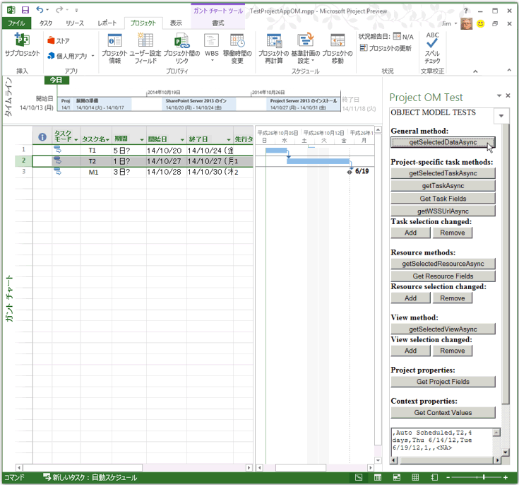

# <a name="create-your-first-task-pane-add-in-for-microsoft-project-by-using-a-text-editor"></a><span data-ttu-id="02a27-102">テキスト エディターを使用して Microsoft Project 用の作業ウィンドウ アドインを初めて作成する</span><span class="sxs-lookup"><span data-stu-id="02a27-102">Create your first task pane add-in for Microsoft Project by using a text editor</span></span>

<span data-ttu-id="02a27-103">Office アドイン用の Yeoman ジェネレーターを使用して Project Standard 2013、Project Professional 2013、または新しいバージョン用の作業ウィンドウ アドインを作成することができます。この記事では、ファイル共有上の HTML ファイルを指し示す XML マニフェストを使用するシンプルなアドインを作成する方法について説明します。</span><span class="sxs-lookup"><span data-stu-id="02a27-103">You can create a task pane add-in for Project Standard 2013, Project Professional 2013, or later verions using the Yeoman generator for Office Add-ins. This article describes how to create a simple add-in that uses an XML manifest that points to an HTML file on a file share.</span></span> <span data-ttu-id="02a27-104">Project OM テストのサンプル アドインは、アドインでオブジェクト モデルを使用する JavaScript 関数をテストします。Project で [**セキュリティ センター**] を使用してマニフェスト ファイルが含まれるファイル共有を登録すると、リボンの [**Project**] タブから作業ウィンドウ アドインを開くことができます。</span><span class="sxs-lookup"><span data-stu-id="02a27-104">The Project OM Test sample add-in tests some JavaScript functions that use the object model for add-ins. After you use the  **Trust Center** in Project to register the file share that contains the manifest file, you can open the task pane add-in from the **Project** tab on the ribbon.</span></span> <span data-ttu-id="02a27-105">(この記事のシンプルなコードは、Microsoft Corporation の Arvind Iyer によるテスト アプリケーションに基づいています。)</span><span class="sxs-lookup"><span data-stu-id="02a27-105">(The sample code in this article is based on a test application by Arvind Iyer, Microsoft Corporation.)</span></span>

<span data-ttu-id="02a27-106">Project では、他の Microsoft Office クライアントで使われるものと同じアドイン マニフェスト スキーマが使用され、JavaScript API の多くも同じものが使用されます。</span><span class="sxs-lookup"><span data-stu-id="02a27-106">Project uses the same add-in manifest schema that other Microsoft Office clients use, and much of the same JavaScript API.</span></span> <span data-ttu-id="02a27-107">この記事に記載されているアドインの完全なコードは、Project 2013 SDK ダウンロードのサブディレクトリ `Samples\Apps` で提供されています。</span><span class="sxs-lookup"><span data-stu-id="02a27-107">The complete code for the add-in that is described in this article is available in the  `Samples\Apps` subdirectory of the Project 2013 SDK download.</span></span>

<span data-ttu-id="02a27-108">Project OM Test サンプル アドインは、タスクの GUID と、アプリケーションおよびアクティブなプロジェクトのプロパティを取得できます。</span><span class="sxs-lookup"><span data-stu-id="02a27-108">The Project OM Test sample add-in can get the GUID of a task and properties of the application and the active project.</span></span> <span data-ttu-id="02a27-109">Project Professional 2013 で SharePoint ライブラリ内にあるプロジェクトを開くと、このアドインでは、そのプロジェクトの URL を表示できます。</span><span class="sxs-lookup"><span data-stu-id="02a27-109">If Project Professional 2013 opens a project that is in a SharePoint library, the add-in can show the URL of the project.</span></span> 

<span data-ttu-id="02a27-p104">[Project 2013 SDK のダウンロード](https://www.microsoft.com/download/details.aspx?id=30435%20)には完全なソース コードが含まれています。Project2013SDK.msi に含まれる SDK を展開してインストールしたら、`\Samples\Apps\Copy_to_AppManifests_FileShare` サブディレクトリにマニフェスト ファイルがあり、`\Samples\Apps\Copy_to_AppSource_FileShare` サブディレクトリにソース コードがあることを確認します。</span><span class="sxs-lookup"><span data-stu-id="02a27-p104">The [Project 2013 SDK download](https://www.microsoft.com/download/details.aspx?id=30435%20) includes the complete source code. When you extract and install the SDK and samples that are in the Project2013SDK.msi file, see the `\Samples\Apps\Copy_to_AppManifests_FileShare` subdirectory for the manifest file and the `\Samples\Apps\Copy_to_AppSource_FileShare` subdirectory for the source code.</span></span> 

<span data-ttu-id="02a27-112">サンプルの JSOMCall.html では、インクルードされる office.js ファイルと project-15.js ファイル内の JavaScript 関数を使用しています。</span><span class="sxs-lookup"><span data-stu-id="02a27-112">The JSOMCall.html sample uses JavaScript functions in the office.js file and project-15.js file, which are included.</span></span> <span data-ttu-id="02a27-113">これらの関数は、対応するデバッグ ファイル (office.debug.js と project-15.debug.js) を使用して検証できます。</span><span class="sxs-lookup"><span data-stu-id="02a27-113">You can use the corresponding debug files (office.debug.js and project-15.debug.js) to examine the functions.</span></span>

<span data-ttu-id="02a27-114">Office アドインでの JavaScript の使用の概要については、「[JavaScript API for Office について](../develop/understanding-the-javascript-api-for-office.md)」を参照してください。</span><span class="sxs-lookup"><span data-stu-id="02a27-114">For an introduction to using JavaScript in Office Add-ins, see [Understanding the JavaScript API for Office](../develop/understanding-the-javascript-api-for-office.md).</span></span>

## <a name="procedure-1-to-create-the-add-in-manifest-file"></a><span data-ttu-id="02a27-p106">手順 1. アドイン マニフェスト ファイルを作成するには</span><span class="sxs-lookup"><span data-stu-id="02a27-p106">Procedure 1. To create the add-in manifest file</span></span>

<span data-ttu-id="02a27-p107">ローカル ディレクトリに XML ファイルを作成します。この XML ファイルには、**OfficeApp** 要素と子要素が含まれます。これらの要素については、「[Office アドインの XML マニフェスト](../develop/add-in-manifests.md)」を参照してください。たとえば、次の XML を含む JSOM_SimpleOMCalls.xml というファイルを作成します (**Id** 要素の GUID 値を変更します)。</span><span class="sxs-lookup"><span data-stu-id="02a27-p107">Create an XML file in a local directory. The XML file includes the **OfficeApp** element and child elements, which are described in the [Office Add-ins XML manifest](../develop/add-in-manifests.md). For example, create a file named JSOM_SimpleOMCalls.xml that contains the following XML (change the GUID value of the **Id** element).</span></span>
    
```XML
<?xml version="1.0" encoding="utf-8"?>
   <OfficeApp xmlns="http://schemas.microsoft.com/office/appforoffice/1.1" 
              xmlns:xsi="https://www.w3.org/2001/XMLSchema-instance" 
              xsi:type="TaskPaneApp">
     <Id>93A26520-9414-492F-994B-4983A1C7A607</Id>
     <Version>15.0</Version>
     <ProviderName>Microsoft</ProviderName>
     <DefaultLocale>en-us</DefaultLocale>
     <DisplayName DefaultValue="Project OM Test">
       <Override Locale="fr-fr" Value="Le Project OM Test"/>
     </DisplayName>
     <Description DefaultValue="Test the task pane add-in object model for Project - English (US)">
       <Override Locale="fr-fr" Value="Test the task pane add-in object model for Project - French (France)"/>
     </Description>
     <Hosts>
       <Host Name="Project"/>
       <Host Name="Workbook"/>
       <Host Name="Document"/>
     </Hosts>
    <DefaultSettings>
       <SourceLocation DefaultValue="\\ServerName\AppSource\JSOMCall.html">
         <Override Locale="fr-fr" Value="\\ServerName\AppSource\JSOMCall.html"/>
       </SourceLocation>
     </DefaultSettings>
     <Permissions>ReadWriteDocument</Permissions>
     <IconUrl DefaultValue="http://officeimg.vo.msecnd.net/_layouts/images/general/office_logo.jpg">
       <Override Locale="fr-fr" Value="http://officeimg.vo.msecnd.net/_layouts/images/general/office_logo.jpg"/>
     </IconUrl>
     <AllowSnapshot>true</AllowSnapshot>
   </OfficeApp>
```

<span data-ttu-id="02a27-p108">Project の場合は、**OfficeApp** 要素に `xsi:type="TaskPaneApp"` 属性値が含まれている必要があります。**Id** 要素は GUID です。**SourceLocation** 値はファイル共有パスであるか、アドインの HTML ソース ファイルまたは作業ウィンドウで実行される Web アプリケーションの SharePoint URL である必要があります。マニフェスト ファイル内のその他の要素については、「[Project 用の作業ウィンドウ アドイン](../project/project-add-ins.md)」を参照してください。</span><span class="sxs-lookup"><span data-stu-id="02a27-p108">For Project, the **OfficeApp** element must include the `xsi:type="TaskPaneApp"` attribute value. The **Id** element is a GUID. The **SourceLocation** value must be a file share path or a SharePoint URL for the add-in HTML source file or the web application that runs in the task pane. For an explanation of the other elements in manifest file, see [Task pane add-ins for Project](../project/project-add-ins.md).</span></span>
    
<span data-ttu-id="02a27-p109">手順 2. では、JSOM_SimpleOMCalls.xml マニフェストが Project テスト アドインのために指定する HTML ファイルの作成方法を示します。この HTML 内で指定されているボタンは、関連する JavaScript 関数を呼び出します。JavaScript 関数は、この HTML ファイル内に追加したり、別の .js ファイル内に配置したりできます。</span><span class="sxs-lookup"><span data-stu-id="02a27-p109">Procedure 2 shows how to create the HTML file that the JSOM_SimpleOMCalls.xml manifest specifies for the Project test add-in. Buttons that are specified in the HTML file call related JavaScript functions. You can add the JavaScript functions within the HTML file, or put them in a separate .js file.</span></span>

## <a name="procedure-2-to-create-the-source-files-for-the-project-om-test-add-in"></a><span data-ttu-id="02a27-p110">手順 2. Project OM Test アドインのソース ファイルを作成するには</span><span class="sxs-lookup"><span data-stu-id="02a27-p110">Procedure 2. To create the source files for the Project OM Test add-in</span></span>

1. <span data-ttu-id="02a27-129">JSOM_SimpleOMCalls.xml マニフェスト内の **SourceLocation** 要素で指定されている名前の HTML ファイルを作成します。</span><span class="sxs-lookup"><span data-stu-id="02a27-129">Create an HTML file with a name that is specified by the **SourceLocation** element in the JSOM_SimpleOMCalls.xml manifest.</span></span> 

   <span data-ttu-id="02a27-130">たとえば、`C:\Project\AppSource`ディレクトリで theJSOMCall.html ファイルを作成します。</span><span class="sxs-lookup"><span data-stu-id="02a27-130">For example, create theJSOMCall.html file in the `C:\Project\AppSource` directory.</span></span> <span data-ttu-id="02a27-131">単純なテキスト エディターソースを使用してソース ファイルを作成することはできますが、特定のドキュメントの種類 (HTML や JavaScript など) を取り扱え、他の編集機能も備わった Visual Studio コードなどのツールを使用する方が簡単です。</span><span class="sxs-lookup"><span data-stu-id="02a27-131">Although you can use a simple text editor to create the source files, it is easier to use a tool such as Visual Studio code, which works with specific document types (such as HTML and JavaScript) and has other editing aids.</span></span> <span data-ttu-id="02a27-132">「[Project 用の作業ウィンドウ アドイン](../project/project-add-ins.md)」で説明されている Bing Search の例をまだ行っていない場合は、マニフェストが指定する `\\ServerName\AppSource` ファイル共有を作成する方法が手順 3 で示されています。　</span><span class="sxs-lookup"><span data-stu-id="02a27-132">If you have not already done the Bing Search example that is described in [Task pane add-ins for Project](../project/project-add-ins.md), Procedure 3 shows how to create the `\\ServerName\AppSource` file share that the manifest specifies.</span></span>
    
   <span data-ttu-id="02a27-133">Microsoft Office 2013 アプリケーションの JSOMCall.html ファイルは、AJAX 機能に対しては共通の MicrosoftAjax.js ファイルを使用し、アドイン機能に対しては Office.js ファイルを使用します。</span><span class="sxs-lookup"><span data-stu-id="02a27-133">The JSOMCall.html file uses the common MicrosoftAjax.js file for AJAX functionality and the Office.js file for the add-in functionality in Microsoft Office 2013 applications.</span></span>

    ```HTML
    <!DOCTYPE html>
    <html>
        <head>
            <title>Project OM Sample Code</title>
            <meta http-equiv="X-UA-Compatible" content="IE=Edge" />
            <script type="text/javascript" src="MicrosoftAjax.js"></script>

            <!-- Use the CDN reference to office.js when deploying your add-in. -->
            <!-- <script src="https://appsforoffice.microsoft.com/lib/1/hosted/Office.js"></script> -->
            <script type="text/javascript" src="Office.js"></script>
            <script type="text/javascript" src="JSOM_Sample.js"></script>
        </head>
        <body>
            <div id="Common_JSOM_API">
                OBJECT MODEL TESTS
            </div>

            <textarea id="text" rows="6" cols="25">This is the text result.</textarea>
        </body>
    </html>
    ```

   <span data-ttu-id="02a27-134">**textarea** 要素は、JavaScript 関数の結果を表示するテキスト ボックスを指定しています。</span><span class="sxs-lookup"><span data-stu-id="02a27-134">The **textarea** element specifies a text box that shows results of the JavaScript functions.</span></span>
    
   > [!NOTE]
   > <span data-ttu-id="02a27-135">Project OM Test サンプルを実行するには、Project 2013 SDK ダウンロードに含まれるファイル (Office.js、Project-15.js、および MicrosoftAjax.js) を JSOMCall.html ファイルと同じディレクトリにコピーします。</span><span class="sxs-lookup"><span data-stu-id="02a27-135">For the Project OM Test sample to work, copy the following files from the Project 2013 SDK download to the same directory as the JSOMCall.html file: Office.js, Project-15.js, and MicrosoftAjax.js.</span></span>

   <span data-ttu-id="02a27-p112">手順 2. では、Project OM Test サンプル アドインが使用する特定の関数のために JSOM Sample.js というファイルを追加します。この後の手順では、JavaScript 関数を呼び出すボタン用にその他の HTML 要素を追加します。</span><span class="sxs-lookup"><span data-stu-id="02a27-p112">Step 2 adds the JSOM_Sample.js file for specific functions that the Project OM Test sample add-in uses. In later steps, you will add other HTML elements for buttons that call JavaScript functions.</span></span>
    
2. <span data-ttu-id="02a27-138">JSOM_Sample.js という名前の JavaScript ファイルを、JSOMCall.html ファイルと同じディレクトリ内に作成します。</span><span class="sxs-lookup"><span data-stu-id="02a27-138">Create a JavaScript file named JSOM_Sample.js in the same directory as the JSOMCall.html file.</span></span> 

   <span data-ttu-id="02a27-p113">次のコードでは、Office.js ファイル内の関数を使用して、アプリケーションのコンテキストとドキュメント情報を取得します。**text** オブジェクトは、HTML ファイル内にある **textarea** コントロールの ID です。</span><span class="sxs-lookup"><span data-stu-id="02a27-p113">The following code gets the application context and document information by using functions in the Office.js file. The **text** object is the ID of the **textarea** control in the HTML file.</span></span>
    
   <span data-ttu-id="02a27-p114">**\_projDoc** 変数は、**ProjectDocument** オブジェクトで初期化されます。コードには、いくつかの簡単なエラー処理関数と、アプリケーション コンテキストおよびプロジェクト ドキュメント コンテキストのプロパティを取得する **getContextValues** 関数が含まれています。Project の JavaScript オブジェクト モデルの詳細については、「[JavaScript API for Office](https://docs.microsoft.com/office/dev/add-ins/reference/javascript-api-for-office)」を参照してください。</span><span class="sxs-lookup"><span data-stu-id="02a27-p114">The **\_projDoc** variable is initialized with a **ProjectDocument** object. The code includes some simple error handling functions, and the **getContextValues** function that gets application context and project document context properties. For more information about the JavaScript object model for Project, see [JavaScript API for Office](https://docs.microsoft.com/office/dev/add-ins/reference/javascript-api-for-office).</span></span>

    ```javascript
    /*
    * JavaScript functions for the Project OM Test example app
    * in the Project 2013 SDK.
    */

    var _projDoc;
    var _app;
    var taskGuid;
    var resourceGuid;

    // The initialize function is required for all add-ins.
    Office.initialize = function (reason) {
        // Checks for the DOM to load using the jQuery ready function.
        $(document).ready(function () {
            // After the DOM is loaded, app-specific code can run.
            _projDoc = Office.context.document;
            _app = Office.context;
        });
    }

    function logError(errorText) {
        text.value = "Error in " + errorText;
    }

    function logEventError(erroneousEvent) {
        logError("event " + erroneousEvent);
    }

    function logMethodError(methodName, errorName, errorMessage) {
        logError(methodName + " method.\nError name: " + errorName + "\nMessage: " + errorMessage);
    }

    // . . . Add other JavaScript functions here.

    function getContextValues() {
        getDocumentUrl();
        getDocumentMode();
        getApplicationContentLanguage();
        getApplicationDisplayLanguage();
    }

    function getDocumentUrl() {
        text.value ="Document URL:\n" +_projDoc.url;
    }

    function getDocumentMode() {
        var docMode = _projDoc.mode;
        text.value = text.value + "\n\nDocument mode: " + docMode;
    }

    function getApplicationContentLanguage() {
        text.value = text.value + "\nApp language: " + _app.contentLanguage;
    }

    function getApplicationDisplayLanguage() {
        text.value = text.value + "\nDisplay language: " + _app.displayLanguage;
    }
    ```

   <span data-ttu-id="02a27-p115">Office.debug.js ファイル内の関数については、「[JavaScript API for Office](https://docs.microsoft.com/office/dev/add-ins/reference/javascript-api-for-office)」を参照してください。たとえば、**getDocumentUrl** 関数は、開かれているプロジェクトの URL またはファイル パスを取得します。</span><span class="sxs-lookup"><span data-stu-id="02a27-p115">For information about the functions in the Office.debug.js file, see [JavaScript API for Office](https://docs.microsoft.com/office/dev/add-ins/reference/javascript-api-for-office). For example, the **getDocumentUrl** function gets the URL or file path of the open project.</span></span>
    
3. <span data-ttu-id="02a27-146">Office.js および Project-15.js 内の非同期関数を呼び出して選択されているデータを取得する JavaScript 関数を追加します。</span><span class="sxs-lookup"><span data-stu-id="02a27-146">Add JavaScript functions that call asynchronous functions in Office.js and Project-15.js to get selected data:</span></span>
    
   - <span data-ttu-id="02a27-p116">たとえば、**getSelectedDataAsync** は、選択されているデータの書式設定されていないテキストを取得する、Office.js 内の汎用関数です。詳細については、「[AsyncResult オブジェクト](https://docs.microsoft.com/javascript/api/office/office.asyncresult)」を参照してください。</span><span class="sxs-lookup"><span data-stu-id="02a27-p116">For example, **getSelectedDataAsync** is a general function in Office.js that gets unformatted text for the selected data. For more information, see [AsyncResult object](https://docs.microsoft.com/javascript/api/office/office.asyncresult).</span></span>
    
   - <span data-ttu-id="02a27-p117">Project-15.js 内の **getSelectedTaskAsync** 関数は、選択されているタスクの GUID を取得します。同様に、**getSelectedResourceAsync** 関数は、選択されているリソースの GUID を取得します。タスクまたはリソースが選択されていない状態でこれらの関数を呼び出すと、未定義のエラーが発生します。</span><span class="sxs-lookup"><span data-stu-id="02a27-p117">The **getSelectedTaskAsync** function in Project-15.js gets the GUID of the selected task. Similarly, the **getSelectedResourceAsync** function gets the GUID of the selected resource. If you call those functions when a task or a resource is not selected, the functions show an undefined error.</span></span>
    
   - <span data-ttu-id="02a27-p118">**getTaskAsync** 関数は、タスク名と、割り当てられているリソースの名前を取得します。タスクが同期された SharePoint タスク リストである場合、**getTaskAsync** は SharePoint リスト内のタスク ID を取得します。それ以外の場合は、SharePoint タスク ID が 0 になります。</span><span class="sxs-lookup"><span data-stu-id="02a27-p118">The **getTaskAsync** function gets the task name and the names of the assigned resources. If the task is in a synchronized SharePoint task list, **getTaskAsync** gets the task ID in the SharePoint list; otherwise, the SharePoint task ID is 0.</span></span>
    
     > [!NOTE]
     > <span data-ttu-id="02a27-p119">サンプル コードには、デモ用にバグが含まれています。**taskGuid** が未定義の場合、**getTaskAsync** 関数はエラーによって終了します。有効なタスク GUID を取得した後に異なるタスクを選択した場合、**getTaskAsync** 関数は、**getSelectedTaskAsync** 関数によって操作された直近のタスクのデータを取得します。</span><span class="sxs-lookup"><span data-stu-id="02a27-p119">For demonstration purposes, the example code includes a bug. If  **taskGuid** is undefined, the **getTaskAsync** function errors off. If you get a valid task GUID and then select a different task, the **getTaskAsync** function gets data for the most recent task that was operated on by the **getSelectedTaskAsync** function.</span></span>
  
   - <span data-ttu-id="02a27-p120">**getTaskFields**、**getResourceFields**、および **getProjectFields** は、それぞれ **getTaskFieldAsync**、**getResourceFieldAsync**、または **getProjectFieldAsync** を複数回呼び出して、タスクまたはリソースの指定フィールドを取得するローカル関数です。project-15.debug.js ファイルには、サポートされるフィールドが **ProjectTaskFields** 列挙型と **ProjectResourceFields** 列挙型で示されています。</span><span class="sxs-lookup"><span data-stu-id="02a27-p120">**getTaskFields**, **getResourceFields**, and **getProjectFields** are local functions that call **getTaskFieldAsync**, **getResourceFieldAsync**, or **getProjectFieldAsync** multiple times to get specified fields of a task or a resource. In the project-15.debug.js file, the **ProjectTaskFields** enumeration and the **ProjectResourceFields** enumeration show which fields are supported.</span></span>
    
   - <span data-ttu-id="02a27-159">**getSelectedViewAsync** 関数は、ビューの種類 (project-15.debug.js 内の **ProjectViewTypes** 列挙型で定義されています) とビューの名前を取得します。</span><span class="sxs-lookup"><span data-stu-id="02a27-159">The **getSelectedViewAsync** function gets the type of view (defined in the **ProjectViewTypes** enumeration in project-15.debug.js) and the name of the view.</span></span>
    
   - <span data-ttu-id="02a27-p121">プロジェクトが SharePoint タスク リストと同期されている場合、 **getWSSUrlAsync** 関数はそのタスク リストの URL と名前を取得します。プロジェクトが SharePoint タスク リストと同期されていない場合、 **getWSSUrlAsync** 関数はエラーによって終了します。</span><span class="sxs-lookup"><span data-stu-id="02a27-p121">If the project is synchronized with a SharePoint tasks list, the  **getWSSUrlAsync** function gets the URL and the name of the tasks list. If the project is not synchronized with a SharePoint tasks list, the **getWSSUrlAsync** function errors off.</span></span>
    
     > [!NOTE]
     > <span data-ttu-id="02a27-162">タスク リストの SharePoint URL と名前を取得するには、**getProjectFieldAsync** 関数に [ProjectProjectFields](https://docs.microsoft.com/javascript/api/office/office.projectprojectfields) 列挙型の定数 **WSSUrl** と **WSSList** を使用することをお勧めします。</span><span class="sxs-lookup"><span data-stu-id="02a27-162">To get the SharePoint URL and name of the tasks list, we recommend that you use the  **getProjectFieldAsync** function with the **WSSUrl** and **WSSList** constants in the [ProjectProjectFields](https://docs.microsoft.com/javascript/api/office/office.projectprojectfields) enumeration.</span></span>

   <span data-ttu-id="02a27-p122">次のコードの各関数には、`function (asyncResult)` によって指定されている匿名関数が含まれます。これは、非同期の結果を取得するコールバックです。匿名関数の代わりに、複雑なアドインの保守に役立つ名前付き関数を使用できます。</span><span class="sxs-lookup"><span data-stu-id="02a27-p122">Each of the functions in the following code includes an anonymous function that is specified by  `function (asyncResult)`, which is a callback that gets the asynchronous result. Instead of anonymous functions, you could use named functions, which can help with maintainability of complex add-ins.</span></span>

    ```javascript
    // Get the data in the selected cells of the grid in the active view.
    function getSelectedDataAsync() {
        _projDoc.getSelectedDataAsync(
            Office.CoercionType.Text,
            { ValueFormat: "Formatted" },
            function (asyncResult) {
                if (asyncResult.status == Office.AsyncResultStatus.Succeeded)
                    text.value = asyncResult.value;
                else
                    logMethodError("getSelectedDataAsync", asyncResult.error.name,
                                   asyncResult.error.message);
            }
        );
    }

    // Get the GUID of the selected task.
    function getSelectedTaskAsync() {
        _projDoc.getSelectedTaskAsync(function (asyncResult) {
            if (asyncResult.status == Office.AsyncResultStatus.Succeeded) {
                text.value = asyncResult.value;
                taskGuid = asyncResult.value;
            }
            else {
                logMethodError("getSelectedTaskAsync", asyncResult.error.name,
                                   asyncResult.error.message);
            }
        });
    }

    // Get the GUID of the selected resource.
    function getSelectedResourceAsync() {
        _projDoc.getSelectedResourceAsync(function (asyncResult) {
            if (asyncResult.status == Office.AsyncResultStatus.Succeeded) {
                text.value = asyncResult.value;
                resourceGuid = asyncResult.value;
            }
            else {
                logMethodError("getSelectedResourceAsync", asyncResult.error.name,
                                   asyncResult.error.message);
            }
        });
    }

    // Get data for the specified task.
    function getTaskAsync() {
        if (taskGuid != undefined) {
            _projDoc.getTaskAsync(
                taskGuid,
                function (asyncResult) {
                    if (asyncResult.status === Office.AsyncResultStatus.Failed) {
                        logMethodError("getTaskAsync", asyncResult.error.name,
                                   asyncResult.error.message);
                    } else {
                        var taskInfo = asyncResult.value;
                        var taskOutput = "Task name: " + taskInfo.taskName +
                                         "\nGUID: " + taskGuid +
                                         "\nWSS Id: " + taskInfo.wssTaskId +
                                         "\nResourceNames: " + taskInfo.resourceNames;
                        text.value = taskOutput;
                    }
                }
            );
        } else {
            text.value = 'Task GUID not valid:\n' + taskGuid;
        } 
    }

    // Get additional data for task fields.
    function getTaskFields() {
        text.value = "";

        _projDoc. getTaskFieldAsync(taskGuid, Office.ProjectTaskFields.Name,
            function (asyncResult) {
                if (asyncResult.status == Office.AsyncResultStatus.Succeeded) {
                    text.value = text.value + "Name: "
                        + asyncResult.value.fieldValue + "\n";
                }
                else {
                    logMethodError("getTaskFieldAsync", asyncResult.error.name,
                                   asyncResult.error.message);
                }
            }
        );

        _projDoc.getTaskFieldAsync(taskGuid, Office.ProjectTaskFields.ID,
            function (asyncResult) {
                if (asyncResult.status == Office.AsyncResultStatus.Succeeded) {
                    text.value = text.value + "ID: "
                        + asyncResult.value.fieldValue + "\n";
                }
                else {
                    logMethodError("getTaskFieldAsync", asyncResult.error.name,
                                   asyncResult.error.message);
                }
            }
        );

        _projDoc.getTaskFieldAsync(taskGuid, Office.ProjectTaskFields.Start,
            function (asyncResult) {
                if (asyncResult.status == Office.AsyncResultStatus.Succeeded) {
                    text.value = text.value + "Start: "
                        + asyncResult.value.fieldValue + "\n";
                }
                else {
                    logMethodError("getTaskFieldAsync", asyncResult.error.name,
                                   asyncResult.error.message);
                }
            }
        );

        _projDoc.getTaskFieldAsync(taskGuid, Office.ProjectTaskFields.Duration,
            function (asyncResult) {
                if (asyncResult.status == Office.AsyncResultStatus.Succeeded) {
                    text.value = text.value + "Duration: "
                        + asyncResult.value.fieldValue + "\n";
                }
                else {
                    logMethodError("getTaskFieldAsync", asyncResult.error.name,
                                   asyncResult.error.message);
                }
            }
        );

        _projDoc.getTaskFieldAsync(taskGuid, Office.ProjectTaskFields.Priority,
            function (asyncResult) {
                if (asyncResult.status == Office.AsyncResultStatus.Succeeded) {
                    text.value = text.value + "Priority: "
                        + asyncResult.value.fieldValue + "\n";
                }
                else {
                    logMethodError("getTaskFieldAsync", asyncResult.error.name,
                                   asyncResult.error.message);
                }
            }
        );

        _projDoc.getTaskFieldAsync(taskGuid, Office.ProjectTaskFields.Notes,
            function (asyncResult) {
                if (asyncResult.status == Office.AsyncResultStatus.Succeeded) {
                    text.value = text.value + "Notes: "
                        + asyncResult.value.fieldValue + "\n";
                }
                else {
                    logMethodError("getTaskFieldAsync", asyncResult.error.name,
                                   asyncResult.error.message);
                }
            }
        ); 
    }

    // Get data for the specified resource fields.
    function getResourceFields() {
        text.value = "";

        _projDoc.getResourceFieldAsync(resourceGuid, Office.ProjectResourceFields.Name,
            function (asyncResult) {
                if (asyncResult.status == Office.AsyncResultStatus.Succeeded) {
                    text.value = text.value + "Resource name: " + asyncResult.value.fieldValue + "\n";
                }
                else {
                    logMethodError("getResourceFieldAsync", asyncResult.error.name,
                                   asyncResult.error.message);
                }
            }
        );

        _projDoc.getResourceFieldAsync(resourceGuid, Office.ProjectResourceFields.Cost,
            function (asyncResult) {
                if (asyncResult.status == Office.AsyncResultStatus.Succeeded) {
                    text.value = text.value + "Cost: " + asyncResult.value.fieldValue + "\n";
                }
                else {
                    logMethodError("getResourceFieldAsync", asyncResult.error.name,
                                   asyncResult.error.message);
                }
            }
        );

        _projDoc.getResourceFieldAsync(resourceGuid, Office.ProjectResourceFields.StandardRate,
            function (asyncResult) {
                if (asyncResult.status == Office.AsyncResultStatus.Succeeded) {
                    text.value = text.value + "Standard Rate: " + asyncResult.value.fieldValue + "\n";
                }
                else {
                    logMethodError("getResourceFieldAsync", asyncResult.error.name, asyncResult.error.message);
                }
            }
        );

        _projDoc.getResourceFieldAsync(resourceGuid, Office.ProjectResourceFields.ActualCost,
            function (asyncResult) {
                if (asyncResult.status == Office.AsyncResultStatus.Succeeded) {
                    text.value = text.value + "Actual Cost: " + asyncResult.value.fieldValue + "\n";
                }
                else {
                    logMethodError("getResourceFieldAsync", asyncResult.error.name, asyncResult.error.message);
                }
            }
        );

        _projDoc.getResourceFieldAsync(resourceGuid, Office.ProjectResourceFields.ActualWork,
            function (asyncResult) {
                if (asyncResult.status == Office.AsyncResultStatus.Succeeded) {
                    text.value = text.value + "Actual Work: " + asyncResult.value.fieldValue + "\n";
                }
                else {
                    logMethodError("getResourceFieldAsync", asyncResult.error.name,
                                   asyncResult.error.message);
                }
            }
        );

        _projDoc.getResourceFieldAsync(resourceGuid, Office.ProjectResourceFields.Units,
            function (asyncResult) {
                if (asyncResult.status == Office.AsyncResultStatus.Succeeded) {
                    text.value = text.value + "Units: " + asyncResult.value.fieldValue + "\n";
                }
                else {
                    logMethodError("getResourceFieldAsync", asyncResult.error.name,
                                   asyncResult.error.message);
                }
            }
        );
    }

    // Get the URL and list name of the synchronized SharePoint task list.
    // Recommended: use getProjectField instead.
    function getWSSUrlAsync() {
        _projDoc.getWSSUrlAsync(function (asyncResult) {
            if (asyncResult.status == Office.AsyncResultStatus.Succeeded) {
                text.value = "SharePoint URL:\n" + asyncResult.value.serverUrl
                    + "\nList name: " + asyncResult.value.listName;
            }
            else {
                logMethodError("getWSSUrlAsync", asyncResult.error.name, asyncResult.error.message);
            }
        });
    }

    // Get the type and name of the selected view.
    function getSelectedViewAsync() {
        _projDoc.getSelectedViewAsync(function (asyncResult) {
            text.value = "View type: " + asyncResult.value.viewType
                + "\nName: " + asyncResult.value.viewName;
        });
    }

    // Get information about the active project.
    function getProjectFields() {
        text.value = "";

        _projDoc.getProjectFieldAsync(Office.ProjectProjectFields.GUID,
            function (asyncResult) {
                if (asyncResult.status == Office.AsyncResultStatus.Succeeded) {
                    text.value = text.value + "Project GUID: " + asyncResult.value.fieldValue + "\n";
                }
                else {
                    logMethodError("getProjectFieldAsync", asyncResult.error.name, asyncResult.error.message);
                }
            }
        );

        _projDoc.getProjectFieldAsync(Office.ProjectProjectFields.Start,
            function (asyncResult) {
                if (asyncResult.status == Office.AsyncResultStatus.Succeeded) {
                    text.value = text.value + "\nStart: " + asyncResult.value.fieldValue + "\n";
                }
                else {
                    logMethodError("getProjectFieldAsync", asyncResult.error.name, asyncResult.error.message);
                }
            }
        );

        _projDoc.getProjectFieldAsync(Office.ProjectProjectFields.Finish,
            function (asyncResult) {
                if (asyncResult.status == Office.AsyncResultStatus.Succeeded) {
                    text.value = text.value + "\nFinish: " + asyncResult.value.fieldValue + "\n";
                }
                else {
                    logMethodError("getProject " + errorText);
                }
            }
        );

        _projDoc.getProjectFieldAsync(Office.ProjectProjectFields.CurrencyDigits,
            function (asyncResult) {
                if (asyncResult.status == Office.AsyncResultStatus.Succeeded) {
                    text.value = text.value + "\nCurrency digits: " + asyncResult.value.fieldValue + "\n";
                }
                else {
                    logMethodError("getProjectFieldAsync", asyncResult.error.name, asyncResult.error.message);
                }
            }
        );

        _projDoc.getProjectFieldAsync(Office.ProjectProjectFields.CurrencySymbol,
            function (asyncResult) {
                if (asyncResult.status == Office.AsyncResultStatus.Succeeded) {
                    text.value = text.value + "Currency symbol: " + asyncResult.value.fieldValue + "\n";
                }
                else {
                    logMethodError("getProjectFieldAsync", asyncResult.error.name, asyncResult.error.message);
                }
            }
        );

        _projDoc.getProjectFieldAsync(Office.ProjectProjectFields.CurrencySymbolPosition,
            function (asyncResult) {
                if (asyncResult.status == Office.AsyncResultStatus.Succeeded) {
                    text.value = text.value + "\nSymbol position: " + asyncResult.value.fieldValue + "\n";
                }
                else {
                    logMethodError("getProjectFieldAsync", asyncResult.error.name, asyncResult.error.message);
                }
            }
        );

        _projDoc.getProjectFieldAsync(Office.ProjectProjectFields.ProjectServerUrl,
            function (asyncResult) {
                if (asyncResult.status == Office.AsyncResultStatus.Succeeded) {
                    text.value = text.value + "\nProject web app URL:\n  " + asyncResult.value.fieldValue + "\n";
                }
                else {
                    logMethodError("getProjectFieldAsync", asyncResult.error.name, asyncResult.error.message);
                }
            }
        );

        _projDoc.getProjectFieldAsync(Office.ProjectProjectFields.WSSUrl,
            function (asyncResult) {
                if (asyncResult.status == Office.AsyncResultStatus.Succeeded) {
                    text.value = text.value + "\nSharePoint URL:\n  " + asyncResult.value.fieldValue + "\n";
                }
                else {
                    logMethodError("getProjectFieldAsync", asyncResult.error.name, asyncResult.error.message);
                }
            }
        );

        _projDoc.getProjectFieldAsync(Office.ProjectProjectFields.WSSList,
            function (asyncResult) {
                if (asyncResult.status == Office.AsyncResultStatus.Succeeded) {
                    text.value = text.value + "\nSharePoint list: " + asyncResult.value.fieldValue + "\n";
                }
                else {
                    logMethodError("getProjectFieldAsync", asyncResult.error.name, asyncResult.error.message);
                }
            }
        );
    }
    ```

4. <span data-ttu-id="02a27-p123">JavaScript イベント ハンドラーのコールバックと関数を追加して、タスク選択、リソース選択、およびビュー選択の変更に関するイベント ハンドラーの登録と登録解除を行います。**manageEventHandlerAsync** 関数は、_operation_ パラメーターに応じて、指定されたイベント ハンドラーを追加または削除します。この操作は **addHandlerAsync** または **removeHandlerAsync** のどちらかになります。</span><span class="sxs-lookup"><span data-stu-id="02a27-p123">Add JavaScript event handler callbacks and functions to register the task selection, resource selection, and view selection change event handlers and to unregister the event handlers. The **manageEventHandlerAsync** function adds or removes the specified event handler, depending on the _operation_ parameter. The operation can be **addHandlerAsync** or **removeHandlerAsync**.</span></span>
    
   <span data-ttu-id="02a27-168">**manageTaskEventHandler**、**manageResourceEventHandler**、**manageViewEventHandler** の各関数は、_docMethod_ パラメーターの指定に応じて、イベント ハンドラーを追加または削除できます。</span><span class="sxs-lookup"><span data-stu-id="02a27-168">The **manageTaskEventHandler**, **manageResourceEventHandler**, and **manageViewEventHandler** functions can add or remove an event handler, as specified by the _docMethod_ parameter.</span></span>

    ```javascript
    // Task selection changed event handler.
    function onTaskSelectionChanged(eventArgs) {
        text.value = "In task selection change event handler";
    }

    // Resource selection changed event handler.
    function onResourceSelectionChanged(eventArgs) {
        text.value = "In Resource selection changed event handler";
    }

    // View selection changed event handler.
    function onViewSelectionChanged(eventArgs) {
        text.value = "In View selection changed event handler";
    }

    // Add or remove the specified event handler.
    function manageEventHandlerAsync(eventType, handler, operation, onComplete) {
        _projDoc[operation]   //The operation is addHandlerAsync or removeHandlerAsync.
        (
            eventType,
            handler,
            function (asyncResult) {
                if (onComplete) {
                    onComplete(asyncResult, operation);
                } else {
                    var message = "Operation: " + operation;
                    message = message + "\nStatus: " + asyncResult.status + "\n";
                    text.value = message;
                }
            }
        );
    }

    // Write the asyncResult status from the manageEventHandlerAsync function (optional). 
    function onComplete(asyncResult, operation) {
        var message = "In onComplete function for " + operation;
        message = message + "\nStatus: " + asyncResult.status;
        text.value = message;
    }

    // Add or remove a task selection changed event handler.
    function manageTaskEventHandler(docMethod) {
        manageEventHandlerAsync(
            Office.EventType.TaskSelectionChanged,      // The task selection changed event.
            onTaskSelectionChanged,                     // The event handler.
            docMethod,                // The Office.Document method to add or remove an event handler.
            onComplete                // Manages the successful asyncResult data (optional).
        );
    }

    // Add or remove a resource selection changed event handler.
    function manageResourceEventHandler(docMethod) {
        manageEventHandlerAsync(
            Office.EventType.ResourceSelectionChanged,  // The resource selection changed event.
            onResourceSelectionChanged,                 // The event handler.
            docMethod,                // The Office.Document method to add or remove an event handler.
            onComplete                // Manages the successful asyncResult data (optional).
        );
    }

    // Add or remove a view selection changed event handler.
    function manageViewEventHandler(docMethod) {
        manageEventHandlerAsync(
            Office.EventType.ViewSelectionChanged,      // The view selection changed event.
            onViewSelectionChanged,                     // The event handler.
            docMethod,                // The Office.Document method to add or remove an event handler.
            onComplete                // Manages the successful asyncResult data (optional).
        );
    }
    ```

5. <span data-ttu-id="02a27-p124">この HTML ドキュメントの本文に、テストのために JavaScript 関数を呼び出すボタンを追加します。たとえば、共通の JSOM API の  **div** 要素には、汎用の **getSelectedDataAsync** 関数を呼び出す入力ボタンを追加します。</span><span class="sxs-lookup"><span data-stu-id="02a27-p124">For the body of the HTML document, add buttons that call the JavaScript functions for testing. For example, in the  **div** element for the common JSOM API, add an input button that calls the general **getSelectedDataAsync** function.</span></span>
    
    ```HTML
    <body>
        <div id="Common_JSOM_API">
        OBJECT MODEL TESTS
        <br /><br />       
        <strong>General function:</strong>
        <br />
        <input id="Button5" class="button-wide" type="button" onclick="getSelectedDataAsync()" 
            value="getSelectedDataAsync" />
        </div>
        <!--  more code . . .  -->
    ```

6. <span data-ttu-id="02a27-171">プロジェクト特有のタスク関数用のボタンと **TaskSelectionChanged** イベント用のボタンを備えた **div** セクションを追加します。</span><span class="sxs-lookup"><span data-stu-id="02a27-171">Add a **div** section with buttons for project-specific task functions and for the **TaskSelectionChanged** event.</span></span>
    
    ```HTML
    <div id="ProjectSpecificTask">
      <br />
      <strong>Project-specific task methods:</strong><br />
      <button class="button-wide" onclick="getSelectedTaskAsync()">getSelectedTaskAsync</button><br />
      <button class="button-wide" onclick="getTaskAsync()">getTaskAsync</button><br />
      <button class="button-wide" onclick="getTaskFields()">Get Task Fields</button><br />
      <button class="button-wide" onclick="getWSSUrlAsync()">getWSSUrlAsync</button>
      <strong>Task selection changed:</strong>
      <button class="button-narrow" onclick="manageTaskEventHandler('addHandlerAsync')">Add</button>
      <button class="button-narrow" onclick="manageTaskEventHandler('removeHandlerAsync')">Remove</button>         
    </div>
    ```

7. <span data-ttu-id="02a27-172">リソースに関するメソッドやイベント、ビューに関するメソッドやイベント、プロジェクトのプロパティ、およびコンテキストのプロパティのための各ボタンを備えた **div** セクションを追加します。</span><span class="sxs-lookup"><span data-stu-id="02a27-172">Add  **div** sections with buttons for the resource methods and events, view methods and events, project properties, and context properties</span></span>
    
    ```HTML
    <div id="ResourceMethods">
      <br />
      <strong>Resource methods:</strong>
      <button class="button-wide" onclick="getSelectedResourceAsync()">getSelectedResourceAsync</button><br />
      <button class="button-wide" onclick="getResourceFields()">Get Resource Fields</button><br />
      <strong>Resource selection changed:</strong>
      <button class="button-narrow" onclick="manageResourceEventHandler('addHandlerAsync')">Add</button>
      <button class="button-narrow" onclick="manageResourceEventHandler('removeHandlerAsync')">Remove</button>
    </div>
    <div id="ViewMethods">
      <br />
      <strong>View method:</strong>
      <button class="button-wide" onclick="getSelectedViewAsync()">getSelectedViewAsync</button><br />
      <strong>View selection changed:</strong>
      <button class="button-narrow" onclick="manageViewEventHandler('addHandlerAsync')">Add</button>
      <button class="button-narrow" onclick="manageViewEventHandler('removeHandlerAsync')">Remove</button>         
    </div>
    <div id="ProjectMethods">
      <br />
      <strong>Project properties:</strong>
      <button class="button-wide" onclick="getProjectFields()">Get Project Fields</button><br />
    </div>
    <div id="ContextVariables">
      <br />
      <strong>Context properties:</strong>
      <button class="button-wide" onclick="getContextValues()">Get Context Values</button>
    </div>
    ```

8. <span data-ttu-id="02a27-p125">ボタンの要素の書式設定を行うために、CSS の  **style** 要素を追加します。たとえば、 **head** 要素の子要素として次の要素を追加します。</span><span class="sxs-lookup"><span data-stu-id="02a27-p125">To format the button elements, add a CSS  **style** element. For example, add the following as a child of the **head** element.</span></span>
    
    ```HTML
    <style type="text/css">
        .button-wide
        {
            width: 210px;
            margin-top: 2px;
        }
        .button-narrow
        {
            width: 80px;
            margin-top: 2px;
        }
    </style>
    ```

<span data-ttu-id="02a27-175">手順 3. では、Project OM Test アドインの機能をインストールして使用する方法を示します。</span><span class="sxs-lookup"><span data-stu-id="02a27-175">Procedure 3 shows how to install and use the Project OM Test add-in features.</span></span>

## <a name="procedure-3-to-install-and-use-the-project-om-test-add-in"></a><span data-ttu-id="02a27-p126">手順 3. Project OM Test アドインをインストールして使用するには</span><span class="sxs-lookup"><span data-stu-id="02a27-p126">Procedure 3. To install and use the Project OM Test add-in</span></span>

1. <span data-ttu-id="02a27-p127">JSOM SimpleOMCalls.xml マニフェストが含まれているディレクトリに対するファイル共有を作成します。ファイル共有は、ローカル コンピューター上、またはネットワーク上のアクセス可能なリモート コンピューター上に作成できます。たとえば、このマニフェストがローカル コンピューター上の  `C:\Project\AppManifests` ディレクトリ内にある場合は、次のコマンドを実行します。</span><span class="sxs-lookup"><span data-stu-id="02a27-p127">Create a file share for the directory that contains the JSOM_SimpleOMCalls.xml manifest. You can create the file share on the local computer or on a remote computer that is accessible on the network. For example, if the manifest is in the  `C:\Project\AppManifests` directory on the local computer, run the following command:</span></span>
    
    `Net share AppManifests=C:\Project\AppManifests`
    
2. <span data-ttu-id="02a27-p128">Project OM Test アドインの HTML および JavaScript ファイルが含まれるディレクトリに対するファイル共有を作成します。このファイル共有パスは、JSOM SimpleOMCalls.xml マニフェストで指定されているパスに一致するようにしてください。たとえば、このファイルがローカル コンピューター上の  `C:\Project\AppSource` ディレクトリにある場合は、次のコマンドを実行します。</span><span class="sxs-lookup"><span data-stu-id="02a27-p128">Create a file share for the directory that contains the HTML and JavaScript files for the Project OM Test add-in. Ensure the file share path matches the path that is specified in the JSOM_SimpleOMCalls.xml manifest. For example, if the files are in the  `C:\Project\AppSource` directory on the local computer, run the following command:</span></span>
    
    `net share AppSource=C:\Project\AppSource`

3. <span data-ttu-id="02a27-184">Project で、**[Project のオプション]** ダイアログ ボックスを開き、**[セキュリティ センター**]、**[セキュリティ センターの設定]** の順に選択します。</span><span class="sxs-lookup"><span data-stu-id="02a27-184">In Project, open the **Project Options** dialog box, choose **Trust Center**, and then choose  **Trust Center Settings**.</span></span>
    
   <span data-ttu-id="02a27-185">アドインの登録手順および追加情報については、「[Project 用の作業ウィンドウ アドイン](../project/project-add-ins.md)」を参照してください。</span><span class="sxs-lookup"><span data-stu-id="02a27-185">The procedure for registering an add-in is also described in [Task pane add-ins for Project](../project/project-add-ins.md), with additional information.</span></span>
    
4. <span data-ttu-id="02a27-186">**[セキュリティ センター]** ダイアログ ボックスの左側のウィンドウで、**[信頼されているアドイン カタログ]** を選択します。</span><span class="sxs-lookup"><span data-stu-id="02a27-186">In the **Trust Center** dialog box, in the left pane, choose **Trusted Add-in Catalogs**.</span></span>
    
5. <span data-ttu-id="02a27-p129">既に `\\ServerName\AppManifests` というパスを Bing Search アドイン用に追加している場合は、この手順をスキップしてください。それ以外の場合は、**[信頼されているアドイン カタログ]** ウィンドウの **[カタログの URL]** テキスト ボックスに `\\ServerName\AppManifests` パスを追加し、**[カタログの追加]** を選択して、このネットワーク共有を既定のソースとして有効にしてから (図 1 を参照)、**[OK]** を選択します。</span><span class="sxs-lookup"><span data-stu-id="02a27-p129">If you have already added the `\\ServerName\AppManifests` path for the Bing Search add-in, skip this step. Otherwise, in the **Trusted Add-in Catalogs** pane, add the `\\ServerName\AppManifests` path in the **Catalog Url** text box, choose **Add catalog**, enable the network share as a default source (see Figure 1), and then choose  **OK**.</span></span>
    
   <span data-ttu-id="02a27-189">*図 1. アドイン マニフェスト用のネットワーク ファイル共有の追加*</span><span class="sxs-lookup"><span data-stu-id="02a27-189">*Figure 1. Adding a network file share for add-in manifests*</span></span>

   

6. <span data-ttu-id="02a27-p130">新しいアドインを追加するか、ソース コードを変更したら、Project を再起動します。[ **プロジェクト**] リボンで、[ **Office アドイン**] ドロップダウン メニューの [ **すべて表示**] を選択します。[ **アドインの挿入**] ダイアログ ボックスで、[ **共有フォルダー**] を選択し (図 2 を参照)、 [ **Project OM Test**]、[ **挿入**] の順に選択します。Project OM Test アドインが作業ウィンドウ内で起動します。</span><span class="sxs-lookup"><span data-stu-id="02a27-p130">After you add new add-ins, or change the source code, restart Project. On the  **PROJECT** ribbon, choose the **Office Add-ins** drop-down menu, and then choose **See All**. In the  **Insert Add-in** dialog box, choose **SHARED FOLDER** (see Figure 2), select **Project OM Test**, and then choose  **Insert**. The Project OM Test add-in starts in a task pane.</span></span>
    
   <span data-ttu-id="02a27-195">*図 2. ファイル共有上にある Project OM Test アドインの開始*</span><span class="sxs-lookup"><span data-stu-id="02a27-195">*Figure 2. Starting the Project OM Test add-in that is on a file share*</span></span>

   

7. <span data-ttu-id="02a27-p131">Project で、少なくとも 2 つのタスクを備えた単純なプロジェクトを作成して保存します。たとえば、T1 とT2 というタスク、およびM1 というマイルストーンを作成し、タスクの期間と先行タスクを図 3 のように設定します。リボンの [ **プロジェクト**] タブを選択し、タスク T2 の行全体を選択して、作業ウィンドウの [ **getSelectedDataAsync**] ボタンを選択します。図 3 に、 **Project OM Test** アドインのテキスト ボックス内で選択されているデータを示します。</span><span class="sxs-lookup"><span data-stu-id="02a27-p131">In Project, create and save a simple project that has at least two tasks. For example, create tasks named T1, T2, and a milestone named M1, and then set the task durations and predecessors to be similar to those in Figure 3. Choose the  **PROJECT** tab on the ribbon, select the entire row for task T2, and then choose the **getSelectedDataAsync** button in the task pane. Figure 3 shows the data that is selected in the text box of the **Project OM Test** add-in.</span></span>
    
   <span data-ttu-id="02a27-201">*図 3. Project OM Test アドインの使用*</span><span class="sxs-lookup"><span data-stu-id="02a27-201">*Figure 3. Using the Project OM Test add-in*</span></span>

   

8. <span data-ttu-id="02a27-p132">最初のタスクの [ **期間**] 列内にあるセルを選択し、 **Project OM Test** アドイン内の [ **getSelectedDataAsync**] ボタンを選択します。 **getSelectedDataAsync** 関数により、テキスト ボックスの値が `2 days` を示すように設定されます。</span><span class="sxs-lookup"><span data-stu-id="02a27-p132">Select the cell in the  **Duration** column for the first task, and then choose the **getSelectedDataAsync** button in the **Project OM Test** add-in. The **getSelectedDataAsync** function sets the text box value to show `2 days`.</span></span> 
    
9. <span data-ttu-id="02a27-p133">3 つのタスクすべての [ **期間**] セル (3 つ) を選択します。 **getSelectedDataAsync** 関数により、各行で選択されたセルのセミコロン区切りテキスト値が返されます (例: `2 days;4 days;0 days`)。</span><span class="sxs-lookup"><span data-stu-id="02a27-p133">Select the three  **Duration** cells for all three tasks. The **getSelectedDataAsync** function returns semicolon-separated text values for cells selected in different rows, for example, `2 days;4 days;0 days`.</span></span>
    
   <span data-ttu-id="02a27-p134">**getSelectedDataAsync** 関数は、行内の選択されたセルに対してコンマ区切りのテキスト値を返します。たとえば、図 3 では、タスク T2 の行全体が選択されます。**getSelectedDataAsync** を選択すると、テキスト ボックスには "`,Auto Scheduled,T2,4 days,Thu 6/14/12,Tue 6/19/12,1,,<NA>`" と表示されます。</span><span class="sxs-lookup"><span data-stu-id="02a27-p134">The  **getSelectedDataAsync** function returns comma-separated text values for cells selected within a row. For example in Figure 3, the entire row for task T2 is selected. When you choose **getSelectedDataAsync**, the text box shows the following:  `,Auto Scheduled,T2,4 days,Thu 6/14/12,Tue 6/19/12,1,,<NA>`</span></span>
    
   <span data-ttu-id="02a27-p135">**[状況説明マーク]** 列と **[リソース名]** 列はどちらも空なので、テキスト配列ではこれらの列に空の値が表示されます。**[新しい列の追加]** セルの値は [`<NA>`] です。</span><span class="sxs-lookup"><span data-stu-id="02a27-p135">The  **Indicators** column and the **Resource Names** column are both empty, so the text array shows empty values for those columns. The `<NA>` value is for the **Add New Column** cell.</span></span>
    
10. <span data-ttu-id="02a27-p136">タスク T2 の行の任意のセル、またはタスク T2 の行全体を選択し、[ **getSelectedTaskAsync**] を選択します。テキスト ボックスにタスクの GUID 値が表示されます (例:  `{25D3E03B-9A7D-E111-92FC-00155D3BA208}`)。この値は、プロジェクトによって  **Project OM Test** アドインのグローバル変数 **taskGuid** に格納されます。</span><span class="sxs-lookup"><span data-stu-id="02a27-p136">Select any cell in the row for task T2, or the entire row for task T2, and then choose  **getSelectedTaskAsync**. The text box shows the task GUID value, for example,  `{25D3E03B-9A7D-E111-92FC-00155D3BA208}`. Project stores that value in the global  **taskGuid** variable of the **Project OM Test** add-in.</span></span>
    
11. <span data-ttu-id="02a27-p137">**getTaskAsync** を選択します。**taskGuid** 変数にタスク T2 の GUID が格納されている場合、テキスト ボックスにはタスク情報が表示されます。**ResourceNames** 値は空です。</span><span class="sxs-lookup"><span data-stu-id="02a27-p137">Select **getTaskAsync**. If the **taskGuid** variable contains the GUID for task T2, the text box displays the task information. The **ResourceNames** value is empty.</span></span>
    
    <span data-ttu-id="02a27-p138">2 つのローカル リソース R1 と R2 を作成し、それぞれを 50% でタスク T2 に割り当てて、**getTaskAsync** を再び選択します。テキスト ボックスの結果にはリソース情報が含まれます。結果が同期された SharePoint タスク リスト内にある場合は、SharePoint のタスク ID も結果に含まれます。</span><span class="sxs-lookup"><span data-stu-id="02a27-p138">Create two local resources R1 andR2, assign them to task T2 at 50% each, and choose  **getTaskAsync** again. The results in the text box include the resource information. If the task is in a synchronized SharePoint task list, the results also include the SharePoint task ID.</span></span>
    
    - <span data-ttu-id="02a27-221">タスク名: `T2`</span><span class="sxs-lookup"><span data-stu-id="02a27-221">Task name: `T2`</span></span>
    - <span data-ttu-id="02a27-222">GUID: `{25D3E03B-9A7D-E111-92FC-00155D3BA208}`</span><span class="sxs-lookup"><span data-stu-id="02a27-222">GUID: `{25D3E03B-9A7D-E111-92FC-00155D3BA208}`</span></span>
    - <span data-ttu-id="02a27-223">WSS Id: `0`</span><span class="sxs-lookup"><span data-stu-id="02a27-223">WSS Id: `0`</span></span>
    - <span data-ttu-id="02a27-224">ResourceNames: `R1[50%],R2[50%]`</span><span class="sxs-lookup"><span data-stu-id="02a27-224">ResourceNames: `R1[50%],R2[50%]`</span></span>

12. <span data-ttu-id="02a27-p139">**[タスク フィールドの取得]** ボタンを選択します。**getTaskFields** 関数により、**getTaskfieldAsync** 関数の呼び出しが複数回行われ、タスク名、インデックス、開始日、期間、優先度、およびタスク ノートが取得されます。</span><span class="sxs-lookup"><span data-stu-id="02a27-p139">Select the **Get Task Fields** button. The **getTaskFields** function calls the **getTaskfieldAsync** function multiple times for the task name, index, start date, duration, priority, and task notes.</span></span>

    - <span data-ttu-id="02a27-227">名前: `T2`</span><span class="sxs-lookup"><span data-stu-id="02a27-227">Name: `T2`</span></span>
    - <span data-ttu-id="02a27-228">ID: `2`</span><span class="sxs-lookup"><span data-stu-id="02a27-228">ID: `2`</span></span>
    - <span data-ttu-id="02a27-229">開始: `Thu 6/14/12`</span><span class="sxs-lookup"><span data-stu-id="02a27-229">Start: `Thu 6/14/12`</span></span>
    - <span data-ttu-id="02a27-230">期間: `4d`</span><span class="sxs-lookup"><span data-stu-id="02a27-230">Duration: `4d`</span></span>
    - <span data-ttu-id="02a27-231">優先度: `500`</span><span class="sxs-lookup"><span data-stu-id="02a27-231">Priority: `500`</span></span>
    - <span data-ttu-id="02a27-232">ノート: これは、タスク T2 のノートです。</span><span class="sxs-lookup"><span data-stu-id="02a27-232">Notes: This is a note for task T2.</span></span> <span data-ttu-id="02a27-233">単なるテスト ノートです。</span><span class="sxs-lookup"><span data-stu-id="02a27-233">It is only a test note.</span></span> <span data-ttu-id="02a27-234">実際のノートの場合は、実際の情報になります。</span><span class="sxs-lookup"><span data-stu-id="02a27-234">If it had been a real note, there would be some real information.</span></span>

13. <span data-ttu-id="02a27-p141">**[getWSSUrlAsync]** ボタンを選択します。プロジェクトが次の種類のどちらかであれば、タスク リストの URL と名前が結果に表示されます。</span><span class="sxs-lookup"><span data-stu-id="02a27-p141">Select the **getWSSUrlAsync** button. If the project is one of the following kinds, the results show the task list URL and name.</span></span>
    
    - <span data-ttu-id="02a27-237">Project Server にインポートされた SharePoint タスク リスト</span><span class="sxs-lookup"><span data-stu-id="02a27-237">A SharePoint task list that was imported to Project Server.</span></span>
    - <span data-ttu-id="02a27-238">Project Professional にインポートされ、SharePoint に (Project Server を使用せずに) 保存された SharePoint タスク リスト</span><span class="sxs-lookup"><span data-stu-id="02a27-238">A SharePoint task list that was imported to Project Professional, and then saved back in SharePoint (not using Project Server).</span></span>
    
    > [!NOTE]
    > <span data-ttu-id="02a27-239">Project Professional が Windows Server コンピューターにインストールされていて、プロジェクトを SharePoint に保存できる場合は、**サーバー マネージャー**を使用して**デスクトップ エクスペリエンス**機能を追加できます。</span><span class="sxs-lookup"><span data-stu-id="02a27-239">If Project Professional is installed on a Windows Server computer, to be able to save the project back to SharePoint, you can use the  **Server Manager** to add the **Desktop Experience** feature.</span></span>

    <span data-ttu-id="02a27-240">プロジェクトがローカル プロジェクトの場合、または Project Server によって管理されているプロジェクトを Project Professional で開いた場合、**getWSSUrlAsync** メソッドは未定義エラーを表示します。</span><span class="sxs-lookup"><span data-stu-id="02a27-240">If the project is a local project, or if you use Project Professional to open a project that is managed by Project Server, the  **getWSSUrlAsync** method shows an undefined error.</span></span>

    - <span data-ttu-id="02a27-241">SharePoint URL: `http://ServerName`</span><span class="sxs-lookup"><span data-stu-id="02a27-241">SharePoint URL: `http://ServerName`</span></span>
    - <span data-ttu-id="02a27-242">リスト名: `Test task list`</span><span class="sxs-lookup"><span data-stu-id="02a27-242">List name: `Test task list`</span></span>
    

14. <span data-ttu-id="02a27-p142">**[TaskSelectionChanged イベント]** セクションの **[追加]** ボタンを選択します。このボタンを選択すると、**manageTaskEventHandler** 関数の呼び出しにより、タスク選択の変更イベントが登録され、"`In onComplete function for addHandlerAsync Status: succeeded`" が返されてテキスト ボックス内に表示されます。別のタスクを選択すると、テキスト ボックスには "`In task selection changed event handler`" と表示されます。これは、タスク選択の変更イベントに対するコールバック関数の出力です。**[削除]** ボタンを選択して、イベント ハンドラーの登録を解除します。</span><span class="sxs-lookup"><span data-stu-id="02a27-p142">Select the **Add** button in the **TaskSelectionChanged event** section, which calls the **manageTaskEventHandler** function to register a task selection changed event and returns `In onComplete function for addHandlerAsync Status: succeeded` in the text box. Select a different task; the text box shows `In task selection changed event handler`, which is the output of the callback function for the task selection changed event. Choose the  **Remove** button to unregister the event handler.</span></span>
    
15. <span data-ttu-id="02a27-p143">リソースに関するメソッドを使用するには、最初に [ **リソース シート**]、[ **リソース配分状況**]、[ **リソース フォーム**] などのビューを選択し、次にそのビュー内でリソースを選択します。[ **getSelectedResourceAsync**] を選択して  **resourceGuid** 変数を初期化し、[ **リソース フィールドの取得**] を選択して、 **getResourceFieldAsync** の複数回の呼び出しによってリソースのプロパティを取得します。また、リソース選択変更のイベント ハンドラーを追加または削除することもできます。</span><span class="sxs-lookup"><span data-stu-id="02a27-p143">To use the resource methods, first select a view such as  **Resource Sheet**,  **Resource Usage**, or  **Resource Form**, and then select a resource in that view. Choose  **getSelectedResourceAsync** to initialize the **resourceGuid** variable, and then choose **Get Resource Fields** to call **getResourceFieldAsync** multiple times for the resource properties. You can also add or remove the resource selection changed event handler.</span></span>
    
    - <span data-ttu-id="02a27-249">リソース名: `R1`</span><span class="sxs-lookup"><span data-stu-id="02a27-249">Resource name: `R1`</span></span>
    - <span data-ttu-id="02a27-250">原価: `$800.00`</span><span class="sxs-lookup"><span data-stu-id="02a27-250">Cost: `$800.00`</span></span>
    - <span data-ttu-id="02a27-251">標準単価: `$50.00/h`</span><span class="sxs-lookup"><span data-stu-id="02a27-251">Standard Rate: `$50.00/h`</span></span>
    - <span data-ttu-id="02a27-252">実績コスト: `$0.00`</span><span class="sxs-lookup"><span data-stu-id="02a27-252">Actual Cost: `$0.00`</span></span>
    - <span data-ttu-id="02a27-253">実績作業時間 : `0h`</span><span class="sxs-lookup"><span data-stu-id="02a27-253">Actual Work: `0h`</span></span>
    - <span data-ttu-id="02a27-254">単位: `100%`</span><span class="sxs-lookup"><span data-stu-id="02a27-254">Units: `100%`</span></span>

16. <span data-ttu-id="02a27-p144">**[getSelectedViewAsync]** を選択して、アクティブなビューの種類と名前を表示します。また、ビュー選択変更のイベント ハンドラーを追加または削除することもできます。たとえば、**[リソース フォーム]** がアクティブなビューである場合、**getSelectedViewAsync** 関数は、テキスト ボックスに次のように表示します。</span><span class="sxs-lookup"><span data-stu-id="02a27-p144">Select **getSelectedViewAsync** to show the type and name of the active view. You can also add or remove the view selection changed event handler. For example, if **Resource Form** is the active view, the **getSelectedViewAsync** function shows the following in the text box:</span></span>
    
    - <span data-ttu-id="02a27-258">ビューの種類: `6`</span><span class="sxs-lookup"><span data-stu-id="02a27-258">View type: `6`</span></span>
    - <span data-ttu-id="02a27-259">名前: `Resource Form`</span><span class="sxs-lookup"><span data-stu-id="02a27-259">Name: `Resource Form`</span></span>
    
17. <span data-ttu-id="02a27-p145">**[プロジェクト フィールドの取得]** を選択して、**getProjectFieldAsync** 関数の複数回の呼び出しによってアクティブなプロジェクトの各種プロパティを取得します。プロジェクトが Project Web App から開かれる場合、**getProjectFieldAsync** 関数は Project Web App のインスタンスの URL を取得できます。</span><span class="sxs-lookup"><span data-stu-id="02a27-p145">Select **Get Project Fields** to call the **getProjectFieldAsync** function multiple times for different properties of the active project. If the project is opened from Project Web App, the **getProjectFieldAsync** function can get the URL of the Project Web App instance.</span></span>
    
    - <span data-ttu-id="02a27-262">プロジェクト GUID: `9845922E-DAB4-E111-8AF3-00155D3BA208`</span><span class="sxs-lookup"><span data-stu-id="02a27-262">Project GUID: `9845922E-DAB4-E111-8AF3-00155D3BA208`</span></span>
    - <span data-ttu-id="02a27-263">開始: `Tue 6/12/12`</span><span class="sxs-lookup"><span data-stu-id="02a27-263">Start: `Tue 6/12/12`</span></span>
    - <span data-ttu-id="02a27-264">終了: `Tue 6/19/12`</span><span class="sxs-lookup"><span data-stu-id="02a27-264">Finish: `Tue 6/19/12`</span></span>
    - <span data-ttu-id="02a27-265">通貨桁数: `2`</span><span class="sxs-lookup"><span data-stu-id="02a27-265">Currency digits: `2`</span></span>
    - <span data-ttu-id="02a27-266">通貨記号: `$`</span><span class="sxs-lookup"><span data-stu-id="02a27-266">Currency symbol: `$`</span></span>
    - <span data-ttu-id="02a27-267">記号の位置: `0`</span><span class="sxs-lookup"><span data-stu-id="02a27-267">Symbol position: `0`</span></span>
    - <span data-ttu-id="02a27-268">Project Web App の URL: `http://servername/pwa`</span><span class="sxs-lookup"><span data-stu-id="02a27-268">Project web app URL: `http://servername/pwa`</span></span>
  
18. <span data-ttu-id="02a27-p146">**[コンテキスト値の取得]** ボタンを選択して、アドインが実行されているドキュメントやアプリケーションのプロパティを取得します。そのために、**Office.Context.document** オブジェクトや **Office.context.application** オブジェクトのプロパティが取得されます。たとえば、Project1.mpp ファイルがローカル コンピューターのデスクトップ上にある場合、ドキュメントの URL は `C:\Users\UserAlias\Desktop\Project1.mpp` となります。この .mpp ファイルが SharePoint ライブラリ内にある場合、値はドキュメントの URL になります。Project Professional 2013 を使用して Project1 という名前のプロジェクトを Project Web App から開いている場合、ドキュメントの URL は `<>\Project1` となります。</span><span class="sxs-lookup"><span data-stu-id="02a27-p146">Select  the **Get Context Values** button get properties of the document and the application in which the add-in is running, by getting properties of the **Office.Context.document** object and the **Office.context.application** object. For example, if the Project1.mpp file is on the local computer desktop, the document URL is `C:\Users\UserAlias\Desktop\Project1.mpp`. If the .mpp file is in a SharePoint library, the value is the URL of the document. If you use Project Professional 2013 to open a project named Project1 from Project Web App, the document URL is  `<>\Project1`.</span></span>
    
    - <span data-ttu-id="02a27-273">ドキュメントの URL: `<>\Project1`</span><span class="sxs-lookup"><span data-stu-id="02a27-273">Document URL: `<>\Project1`</span></span>
    - <span data-ttu-id="02a27-274">ドキュメント モード: `readWrite`</span><span class="sxs-lookup"><span data-stu-id="02a27-274">Document mode: `readWrite`</span></span>
    - <span data-ttu-id="02a27-275">アプリの言語: `en-US`</span><span class="sxs-lookup"><span data-stu-id="02a27-275">App language: `en-US`</span></span>
    - <span data-ttu-id="02a27-276">表示言語: `en-US`</span><span class="sxs-lookup"><span data-stu-id="02a27-276">Display language: `en-US`</span></span>
    
19. <span data-ttu-id="02a27-p147">ソース コードを編集した後は、Project をいったん閉じて再起動することで、アドインを最新の情報に更新できます。[ **プロジェクト**] リボンの [ **Office アドイン**] ドロップダウン リストに、最近使用したアドインの一覧が保持されています。</span><span class="sxs-lookup"><span data-stu-id="02a27-p147">You can refresh the add-in after you edit the source code by closing and restarting Project. In the  **Project** ribbon, the **Office Add-ins** drop-down list maintains the list of recently used add-ins.</span></span>
    
## <a name="example"></a><span data-ttu-id="02a27-279">例</span><span class="sxs-lookup"><span data-stu-id="02a27-279">Example</span></span>

<span data-ttu-id="02a27-p148">Project 2013 SDK のダウンロードには、JSOMCall.html ファイル、JSOM_Sample.js ファイル、関連する Office.js、Office.debug.js、Project-15.js、および Project-15.debug.js の各ファイルの完全なコードが含まれています。次に、JSOMCall.html ファイルのコードを示します。</span><span class="sxs-lookup"><span data-stu-id="02a27-p148">The Project 2013 SDK download contains the complete code in the JSOMCall.html file, the JSOM_Sample.js file, and the related Office.js, Office.debug.js, Project-15.js, and Project-15.debug.js files. Following is the code in the JSOMCall.html file.</span></span>

```HTML
<!DOCTYPE html>
<html>
    <head>
        <title>Project OM Sample Code</title>
        <meta http-equiv="X-UA-Compatible" content="IE=Edge"/>

        <script type="text/javascript" src="MicrosoftAjax.js"></script>

        <!-- Use the CDN reference to office.js when deploying your add-in. -->
        <!-- <script src="https://appsforoffice.microsoft.com/lib/1/hosted/Office.js"></script> -->
        <script type="text/javascript" src="Office.js"></script>
        <script type="text/javascript" src="JSOM_Sample.js"></script>

        <style type="text/css">           
            .button-wide {
                width: 210px;
                margin-top: 2px;
            }
            .button-narrow 
            {
                width: 80px;
                margin-top: 2px;
            }
        </style>
    </head>

    <body>
        <div id="Common_JSOM_API">
            OBJECT MODEL TESTS
            <br /><br />       
            <strong>General method:</strong>
            <br />
            <input id="Button5" class="button-wide" type="button" onclick="getSelectedDataAsync()" 
                value="getSelectedDataAsync" />
        </div>
        <div id="ProjectSpecificTask">
            <br />
            <strong>Project-specific task methods:</strong><br />
            <button class="button-wide" onclick="getSelectedTaskAsync()">getSelectedTaskAsync</button><br />
            <button class="button-wide" onclick="getTaskAsync()">getTaskAsync</button><br />
            <button class="button-wide" onclick="getTaskFields()">Get Task Fields</button><br />
            <button class="button-wide" onclick="getWSSUrlAsync()">getWSSUrlAsync</button>
            <strong>Task selection changed:</strong>
            <button class="button-narrow" onclick="manageTaskEventHandler('addHandlerAsync')">Add</button>
            <button class="button-narrow" onclick="manageTaskEventHandler('removeHandlerAsync')">Remove</button>         
        </div>
        <div id="ResourceMethods">
            <br />
            <strong>Resource methods:</strong>
            <button class="button-wide" onclick="getSelectedResourceAsync()">getSelectedResourceAsync</button><br />
            <button class="button-wide" onclick="getResourceFields()">Get Resource Fields</button><br />
            <strong>Resource selection changed:</strong>
            <button class="button-narrow" onclick="manageResourceEventHandler('addHandlerAsync')">Add</button>
            <button class="button-narrow" onclick="manageResourceEventHandler('removeHandlerAsync')">Remove</button>
        </div>
        <div id="ViewMethods">
            <br />
            <strong>View method:</strong>
            <button class="button-wide" onclick="getSelectedViewAsync()">getSelectedViewAsync</button><br />
            <strong>View selection changed:</strong>
            <button class="button-narrow" onclick="manageViewEventHandler('addHandlerAsync')">Add</button>
            <button class="button-narrow" onclick="manageViewEventHandler('removeHandlerAsync')">Remove</button>         
        </div>
        <div id="ProjectMethods">
            <br />
            <strong>Project properties:</strong>
            <button class="button-wide" onclick="getProjectFields()">Get Project Fields</button><br />
        </div>
        <div id="ContextVariables">
            <br />
            <strong>Context properties:</strong>
            <button class="button-wide" onclick="getContextValues()">Get Context Values</button>
        </div>
        <br />
        <textarea id="text" rows="10" cols="25">This is the text result.</textarea>
    </body>
</html
```

## <a name="robust-programming"></a><span data-ttu-id="02a27-282">堅牢なプログラミング</span><span class="sxs-lookup"><span data-stu-id="02a27-282">Robust programming</span></span>

<span data-ttu-id="02a27-p149">**Project OM Test** アドインは、Project-15.js と Office.js の各ファイル内にある Project 2013 用のいくつかの JavaScript 関数の使用法を示すための例です。この例は単なるテスト用で、堅牢なエラー チェックは含まれていません。たとえば、リソースを選択せずに **getSelectedResourceAsync** 関数を実行すると、**resourceGuid** 変数は初期化されず、**getResourceFieldAsync** の呼び出しでエラーが返されます。実際に運用するアドインでは、特定のエラーをチェックして結果を無視したり、特定の状況に該当しない機能を隠したり、機能を使用する前にビューや有効な項目を選択するようにユーザーに通知したりする必要があります。</span><span class="sxs-lookup"><span data-stu-id="02a27-p149">The  **Project OM Test** add-in is an example that shows the use of some JavaScript functions for Project 2013 in the Project-15.js and Office.js files. The example is for testing only and does not include robust error checks. For example, if you do not select a resource and run the **getSelectedResourceAsync** function, the **resourceGuid** variable is not initialized, and calls to **getResourceFieldAsync** return an error. For a production add-in, you should check for specific errors and ignore the results, hide functionality that does not apply, or notify the user to choose a view and make a valid selection before using a function.</span></span>

<span data-ttu-id="02a27-287">次のコード例のエラー出力には  **actionMessage** 変数が含まれています。この変数には、 **getSelectedResourceAsync** 関数のエラーを回避するための操作が指定されています。</span><span class="sxs-lookup"><span data-stu-id="02a27-287">For a simple example, the error output in the following code includes the  **actionMessage** variable that specifies the action to take to avoid an error in the **getSelectedResourceAsync** function.</span></span>

```javascript
function logError(errorText) {
    text.value = "Error in " + errorText;
}

function logMethodError(methodName, errorName, errorMessage, actionMessage) {
    logError(methodName + " method.\nError name: " + errorName
        + "\nMessage: " + errorMessage
        + "\n\nAction: " + actionMessage);
}

// Get the GUID of the selected resource.
function getSelectedResourceAsync() {
    _projDoc.getSelectedResourceAsync(function (asyncResult) {
        if (asyncResult.status == Office.AsyncResultStatus.Succeeded) {
            text.value = asyncResult.value;
            resourceGuid = asyncResult.value;
        }
        else {
            var actionMessage = "Select a resource before running the getSelectedResourceAsync method.";
            logMethodError("getSelectedResourceAsync", asyncResult.error.name,
                               asyncResult.error.message, actionMessage);
        }
    });
}
```

<span data-ttu-id="02a27-288">Project 2013 SDK のダウンロードの **HelloProject_OData** サンプルには、JQuery ライブラリを使用してポップアップ エラー メッセージを表示する SurfaceErrors.js ファイルが含まれています。</span><span class="sxs-lookup"><span data-stu-id="02a27-288">The **HelloProject_OData** sample in the Project 2013 SDK download includes the SurfaceErrors.js file that uses the JQuery library to display a pop-up error message.</span></span> <span data-ttu-id="02a27-289">図 4 に、"toast" 通知のエラー メッセージを示します。</span><span class="sxs-lookup"><span data-stu-id="02a27-289">Figure 4 shows the error message in a "toast" notification.</span></span>

<span data-ttu-id="02a27-290">SurfaceErrors.js ファイル内の次のコードには、 **Toast** オブジェクトを作成する **throwError** 関数が含まれています。</span><span class="sxs-lookup"><span data-stu-id="02a27-290">The following code in the SurfaceErrors.js file includes the  **throwError** function that creates a **Toast** object.</span></span>

```javascript
/*
 * Show error messages in a "toast" notification.
 */

// Throws a custom defined error.
function throwError(errTitle, errMessage) {
    try {
        // Define and throw a custom error.
        var customError = { name: errTitle, message: errMessage }
        throw customError;
    }
    catch (err) {
        // Catch the error and display it to the user.
        Toast.showToast(err.name, err.message);
    }
}

// Add a dynamically-created div "toast" for displaying errors to the user.
var Toast = {

    Toast: "divToast",
    Close: "btnClose",
    Notice: "lblNotice",
    Output: "lblOutput",

    // Show the toast with the specified information.
    showToast: function (title, message) {

        if (document.getElementById(this.Toast) == null) {
            this.createToast();
        }

        document.getElementById(this.Notice).innerText = title;
        document.getElementById(this.Output).innerText = message;

        $("#" + this.Toast).hide();
        $("#" + this.Toast).show("slow");
    },

    // Create the display for the toast.
    createToast: function () {
        var divToast;
        var lblClose;
        var btnClose;
        var divOutput;
        var lblOutput;
        var lblNotice;

        // Create the container div.
        divToast = document.createElement("div");
        var toastStyle = "background-color:rgba(220, 220, 128, 0.80);" +
            "position:absolute;" +
            "bottom:0px;" +
            "width:90%;" +
            "text-align:center;" +
            "font-size:11pt;";
        divToast.setAttribute("style", toastStyle);
        divToast.setAttribute("id", this.Toast);

        // Create the close button.
        lblClose = document.createElement("div");
        lblClose.setAttribute("id", this.Close);
        var btnStyle = "text-align:right;" +
            "padding-right:10px;" +
            "font-size:10pt;" +
            "cursor:default";
        lblClose.setAttribute("style", btnStyle);
        lblClose.appendChild(document.createTextNode("CLOSE "));

        btnClose = document.createElement("span");
        btnClose.setAttribute("style", "cursor:pointer;");
        btnClose.setAttribute("onclick", "Toast.close()");
        btnClose.innerText = "X";
        lblClose.appendChild(btnClose);

        // Create the div to contain the toast title and message.
        divOutput = document.createElement("div");
        divOutput.setAttribute("id", "divOutput");
        var outputStyle = "margin-top:0px;";
        divOutput.setAttribute("style", outputStyle);

        lblNotice = document.createElement("span");
        lblNotice.setAttribute("id", this.Notice);
        var labelStyle = "font-weight:bold;margin-top:0px;";
        lblNotice.setAttribute("style", labelStyle);

        lblOutput = document.createElement("span");
        lblOutput.setAttribute("id", this.Output);

        // Add the child nodes to the toast div.
        divOutput.appendChild(lblNotice);
        divOutput.appendChild(document.createElement("br"));
        divOutput.appendChild(lblOutput);
        divToast.appendChild(lblClose);
        divToast.appendChild(divOutput);

        // Add the toast div to the document body.
        document.body.appendChild(divToast);
    },

    // Close the toast.
    close: function () {
        $("#" + this.Toast).hide("slow");
    }
}
```

<span data-ttu-id="02a27-291">**throwError** 関数を使用するには、JSOMCall.html ファイルに JQuery ライブラリと SurfaceErrors.js スクリプトを含め、さらに、**logMethodError** などの別の JavaScript 関数に **throwError** の呼び出しを追加します。</span><span class="sxs-lookup"><span data-stu-id="02a27-291">To use the  **throwError** function, include the JQuery library and the SurfaceErrors.js script in the JSOMCall.html file, and then add a call to **throwError** in other JavaScript functions such as **logMethodError**.</span></span>

> [!NOTE]
> <span data-ttu-id="02a27-p151">アドインを展開する前に、office.js の参照と jQuery の参照をコンテンツ配信ネットワーク (CDN) の参照に変更してください。CDN の参照は最新のバージョンと高いパフォーマンスを提供します。</span><span class="sxs-lookup"><span data-stu-id="02a27-p151">Before you deploy the add-in, change the office.js reference and the jQuery reference to the content delivery network (CDN) reference. The CDN reference provides the most recent version and better performance.</span></span>

```HTML
<!DOCTYPE html>
<html>
<head>
    <title>Project OM Sample Code</title>
    <meta http-equiv="X-UA-Compatible" content="IE=Edge" />

    <script type="text/javascript" src="MicrosoftAjax.js"></script>

    <!-- Use the CDN reference to Office.js and jQuery when deploying your add-in. -->
    <!-- <script src="https://appsforoffice.microsoft.com/lib/1/hosted/Office.js"></script> -->
    <script type="text/javascript" src="Office.js"></script>
    <script type="text/javascript" src="http://ajax.microsoft.com/ajax/jQuery/jquery-1.9.0.min.js"></script>

    <script type="text/javascript" src="JSOM_Sample.js"></script>
    <script type="text/javascript" src="SurfaceErrors.js"></script>

    <!-- . . . INVALID USE OF SYMBOLS . . . -->
</head>

```

<br/>


```javascript
function logMethodError(methodName, errorName, errorMessage, actionMessage) {
    logError(methodName + " method.\nError name: " + errorName
        + "\nMessage: " + errorMessage
        + "\n\nAction: " + actionMessage);

    throwError(methodName + " error", actionMessage);
}
```

<br/>

<span data-ttu-id="02a27-294">*図 4. SurfaceErrors.js ファイル内の関数は "toast" 通知を表示できます*</span><span class="sxs-lookup"><span data-stu-id="02a27-294">*Figure 4. Functions in the SurfaceErrors.js file can show a "toast" notification*</span></span>


## <a name="see-also"></a><span data-ttu-id="02a27-296">関連項目</span><span class="sxs-lookup"><span data-stu-id="02a27-296">See also</span></span>

- [<span data-ttu-id="02a27-297">Project 用の作業ウィンドウ アドイン</span><span class="sxs-lookup"><span data-stu-id="02a27-297">Task pane add-ins for Project</span></span>](../project/project-add-ins.md)
- [<span data-ttu-id="02a27-298">アドイン用の JavaScript API について</span><span class="sxs-lookup"><span data-stu-id="02a27-298">Understanding the JavaScript API for add-ins</span></span>](../develop/understanding-the-javascript-api-for-office.md)
- [<span data-ttu-id="02a27-299">JavaScript API for Office アドイン</span><span class="sxs-lookup"><span data-stu-id="02a27-299">JavaScript API for Office Add-ins</span></span>](https://docs.microsoft.com/office/dev/add-ins/reference/javascript-api-for-office)
- [<span data-ttu-id="02a27-300">Office アドインのマニフェスト向けのスキーマ リファレンス (v1.1)</span><span class="sxs-lookup"><span data-stu-id="02a27-300">Schema reference for Office Add-ins manifests (v1.1)</span></span>](../develop/add-in-manifests.md)     
- [<span data-ttu-id="02a27-301">Project 2013 SDK のダウンロード</span><span class="sxs-lookup"><span data-stu-id="02a27-301">Project 2013 SDK download</span></span>](https://www.microsoft.com/download/details.aspx?id=30435%20)
    
