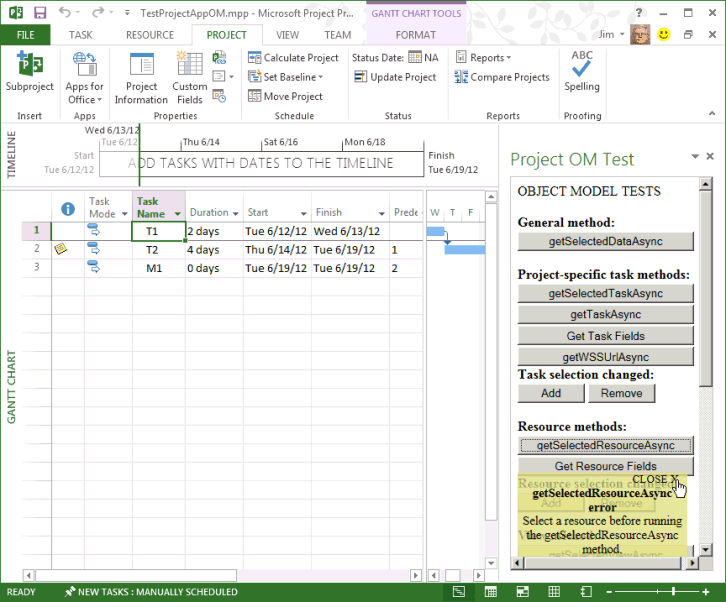

# <a name="create-your-first-task-pane-add-in-for-project-2013-by-using-a-text-editor"></a>???? ?????????? Project 2013 ????????? ????????????

Visual Studio 2015 ???????? Web ??????????????????? ?????????????? ??????????????????????Project Standard 2013??? Project Professional 2013 ????????? ??????????????????????????? HTML ????????? XML ???????????????????????????????????Project OM Test ???? ?????????????????? ????????????? JavaScript ??????????Project 2013? **?????? ????**???????????? ???????????????????????????? ????????? [ **??????**] ????????????? (????????? ?????Microsoft Corporation ? Arvind Iyer ?????? ????????????????)?

Project 2013????? Microsoft Office 2013 ????????????? ?????? ?????????JavaScript API ????????????????????????????????????Project 2013 SDK ???????  `Samples\Apps` ???????????????

Project OM Test ???? ?????????? GUID ??????????????????????????????????????? Project Professional 2013 ? SharePoint ?????????????????????????????????????? URL ???????? 

[Project 2013 SDK ???????](https://www.microsoft.com/en-us/download/details.aspx?id=30435%20)???????? ????????????Project2013SDK.msi ????? SDK ???????????????`\Samples\Apps\Copy_to_AppManifests_FileShare` ??????????????? ????????`\Samples\Apps\Copy_to_AppSource_FileShare` ???????????? ??????????????? 

????? JSOMCall.html ???????????? office.js ????? project-15.js ?????? JavaScript ??????????? ???????????????? ???? (office.debug.js ? project-15.debug.js) ????????????

Office ?????? JavaScript ?????????????[JavaScript API for Office ????](../develop/understanding-the-javascript-api-for-office.md)???????????

## <a name="procedure-1-to-create-the-add-in-manifest-file"></a>?? 1. ???? ?????? ???????????

???? ??????? XML ????????????? XML ???????**OfficeApp** ??????????????????????????[Office ????? XML ??????](../develop/add-in-manifests.md)?????????????????? XML ??? JSOM_SimpleOMCalls.xml ????????????? (**Id** ??? GUID ???????)?
    
```XML
<?xml version="1.0" encoding="utf-8"?>
   <OfficeApp xmlns="http://schemas.microsoft.com/office/appforoffice/1.1" 
              xmlns:xsi="http://www.w3.org/2001/XMLSchema-instance" 
              xsi:type="TaskPaneApp">
     <Id>93A26520-9414-492F-994B-4983A1C7A607</Id>
     <Version>15.0</Version>
     <ProviderName>Microsoft</ProviderName>
     <DefaultLocale>en-us</DefaultLocale>
     <DisplayName DefaultValue="Project OM Test">
       <Override Locale="fr-fr" Value="Le Project OM Test"/>
     </DisplayName>
     <Description DefaultValue="Test the task pane add-in object model for Project - English (US)">
       <Override Locale="fr-fr" Value="Test the task pane add-in object model for Project - French (France)"/>
     </Description>
     <Hosts>
       <Host Name="Project"/>
       <Host Name="Workbook"/>
       <Host Name="Document"/>
     </Hosts>
    <DefaultSettings>
       <SourceLocation DefaultValue="\\ServerName\AppSource\JSOMCall.html">
         <Override Locale="fr-fr" Value="\\ServerName\AppSource\JSOMCall.html"/>
       </SourceLocation>
     </DefaultSettings>
     <Permissions>ReadWriteDocument</Permissions>
     <IconUrl DefaultValue="http://officeimg.vo.msecnd.net/_layouts/images/general/office_logo.jpg">
       <Override Locale="fr-fr" Value="http://officeimg.vo.msecnd.net/_layouts/images/general/office_logo.jpg"/>
     </IconUrl>
     <AllowSnapshot>true</AllowSnapshot>
   </OfficeApp>
```

Project ?????**OfficeApp** ??? `xsi:type="TaskPaneApp"` ??????????????????**Id** ??? GUID ???**SourceLocation** ???????????????????? HTML ??? ???????????????????? Web ????????? SharePoint URL ????????????????? ???????????????????[Project ????????? ????](../project/project-add-ins.md)???????????
    
?? 2. ???JSOM_SimpleOMCalls.xml ??????? Project ??? ???????????? HTML ????????????????? HTML ?????????????????? JavaScript ??????????JavaScript ?????? HTML ?????????????? .js ????????????????

## <a name="procedure-2-to-create-the-source-files-for-the-project-om-test-add-in"></a>?? 2. Project OM Test ???????? ???????????

1. JSOM_SimpleOMCalls.xml ???????? **SourceLocation** ????????????? HTML ??????????? 

   ?????JSOMCall.html ???????? `C:\Project\AppSource` ????????????????????? ????????????? ??????????????????Visual Studio 2015 ?????????????????????????????????? ??? (HTML ? JavaScript ??) ????????????????????????[Project ????????? ????](../project/project-add-ins.md)??????? Bing Search ???????????????????? 3. ??????????????????? `\\ServerName\AppSource` ?????????????????????
    
   Microsoft Office 2013 ????????? JSOMCall.html ??????AJAX ?????????? MicrosoftAjax.js ???????????????????? Office.js ???????????

    ```HTML
    <!DOCTYPE html>
    <html>
        <head>
            <title>Project OM Sample Code</title>
            <meta http-equiv="X-UA-Compatible" content="IE=Edge" />
            <script type="text/javascript" src="MicrosoftAjax.js"></script>

            <!-- Use the CDN reference to office.js when deploying your add-in. -->
            <!-- <script src="https://appsforoffice.microsoft.com/lib/1/hosted/Office.js"></script> -->
            <script type="text/javascript" src="Office.js"></script>
            <script type="text/javascript" src="JSOM_Sample.js"></script>
        </head>
        <body>
            <div id="Common_JSOM_API">
                OBJECT MODEL TESTS
            </div>

            <textarea id="text" rows="6" cols="25">This is the text result.</textarea>
        </body>
    </html>
    ```

   **textarea** ????JavaScript ?????????????? ?????????????
    
   > [!NOTE]
   > Project OM Test ????????????Project 2013 SDK ??????????????? (Office.js?Project-15.js???? MicrosoftAjax.js) ? JSOMCall.html ?????????????????????

   ?? 2. ???Project OM Test ???? ?????????????????? JSOM Sample.js ???????????????????????JavaScript ???????????????? HTML ?????????
    
2. JSOM_Sample.js ?????? JavaScript ??????JSOMCall.html ????????????????????? 

   ????????Office.js ?????????????????????????????????????????????**text** ????????HTML ???????? **textarea** ??????? ID ???
    
   **\_projDoc** ????**ProjectDocument** ?????????????????????????????????????????????? ??????????????? ?????? ????????????????? **getContextValues** ???????????Project ? JavaScript ?????? ?????????????[JavaScript API for Office](https://dev.office.com/reference/add-ins/javascript-api-for-office)???????????

    ```javascript
    /*
    * JavaScript functions for the Project OM Test example app
    * in the Project 2013 SDK.
    */

    var _projDoc;
    var _app;
    var taskGuid;
    var resourceGuid;

    // The initialize function is required for all add-ins.
    Office.initialize = function (reason) {
        // Checks for the DOM to load using the jQuery ready function.
        $(document).ready(function () {
            // After the DOM is loaded, app-specific code can run.
            _projDoc = Office.context.document;
            _app = Office.context;
        });
    }

    function logError(errorText) {
        text.value = "Error in " + errorText;
    }

    function logEventError(erroneousEvent) {
        logError("event " + erroneousEvent);
    }

    function logMethodError(methodName, errorName, errorMessage) {
        logError(methodName + " method.\nError name: " + errorName + "\nMessage: " + errorMessage);
    }

    // . . . Add other JavaScript functions here.

    function getContextValues() {
        getDocumentUrl();
        getDocumentMode();
        getApplicationContentLanguage();
        getApplicationDisplayLanguage();
    }

    function getDocumentUrl() {
        text.value ="Document URL:\n" +_projDoc.url;
    }

    function getDocumentMode() {
        var docMode = _projDoc.mode;
        text.value = text.value + "\n\nDocument mode: " + docMode;
    }

    function getApplicationContentLanguage() {
        text.value = text.value + "\nApp language: " + _app.contentLanguage;
    }

    function getApplicationDisplayLanguage() {
        text.value = text.value + "\nDisplay language: " + _app.displayLanguage;
    }
    ```

   Office.debug.js ???????????????[JavaScript API for Office](https://dev.office.com/reference/add-ins/javascript-api-for-office)????????????????**getDocumentUrl** ????????????????? URL ??????? ?????????
    
3. Office.js ??? Project-15.js ???????????????????????????? JavaScript ?????????
    
   - ?????**getSelectedDataAsync** ?????????????????????????????????Office.js ??????????????????[AsyncResult ??????](https://dev.office.com/reference/add-ins/shared/asyncresult)???????????
    
   - Project-15.js ?? **getSelectedTaskAsync** ??????????????? GUID ???????????**getSelectedResourceAsync** ???????????????? GUID ????????????????????????????????????????????????????????
    
   - **getTaskAsync** ?????????????????????????????????????????? SharePoint ??? ?????????**getTaskAsync** ? SharePoint ???????? ID ????????????????SharePoint ??? ID ? 0 ??????
    
     > [!NOTE]
     > ???? ?????????????????????**taskGuid** ????????**getTaskAsync** ?????????????????????? GUID ?????????????????????**getTaskAsync** ????**getSelectedTaskAsync** ????????????????????????????
  
   - **getTaskFields**?**getResourceFields**???? **getProjectFields** ?????? **getTaskFieldAsync**?**getResourceFieldAsync**???? **getProjectFieldAsync** ??????????????????????????????????????????project-15.debug.js ???????????????????? **ProjectTaskFields** ???? **ProjectResourceFields** ????????????
    
   - **getSelectedViewAsync** ?????????? (project-15.debug.js ?? **ProjectViewTypes** ????????????) ??????????????
    
   - ??????? SharePoint ??? ?????????????? **getWSSUrlAsync** ???????? ???? URL ????????????????? SharePoint ??? ??????????????? **getWSSUrlAsync** ????????????????
    
     > [!NOTE]
     > ??? ???? SharePoint URL ???????????**getProjectFieldAsync** ??? [ProjectProjectFields](https://dev.office.com/reference/add-ins/shared/projectprojectfields-enumeration) ?????? **WSSUrl** ? **WSSList** ???????????????

   ????????????`function (asyncResult)` ????????????????????????????????????????????????????????????????????????????????????

    ```javascript
    // Get the data in the selected cells of the grid in the active view.
    function getSelectedDataAsync() {
        _projDoc.getSelectedDataAsync(
            Office.CoercionType.Text,
            { ValueFormat: "Formatted" },
            function (asyncResult) {
                if (asyncResult.status == Office.AsyncResultStatus.Succeeded)
                    text.value = asyncResult.value;
                else
                    logMethodError("getSelectedDataAsync", asyncResult.error.name,
                                   asyncResult.error.message);
            }
        );
    }

    // Get the GUID of the selected task.
    function getSelectedTaskAsync() {
        _projDoc.getSelectedTaskAsync(function (asyncResult) {
            if (asyncResult.status == Office.AsyncResultStatus.Succeeded) {
                text.value = asyncResult.value;
                taskGuid = asyncResult.value;
            }
            else {
                logMethodError("getSelectedTaskAsync", asyncResult.error.name,
                                   asyncResult.error.message);
            }
        });
    }

    // Get the GUID of the selected resource.
    function getSelectedResourceAsync() {
        _projDoc.getSelectedResourceAsync(function (asyncResult) {
            if (asyncResult.status == Office.AsyncResultStatus.Succeeded) {
                text.value = asyncResult.value;
                resourceGuid = asyncResult.value;
            }
            else {
                logMethodError("getSelectedResourceAsync", asyncResult.error.name,
                                   asyncResult.error.message);
            }
        });
    }

    // Get data for the specified task.
    function getTaskAsync() {
        if (taskGuid != undefined) {
            _projDoc.getTaskAsync(
                taskGuid,
                function (asyncResult) {
                    if (asyncResult.status === Office.AsyncResultStatus.Failed) {
                        logMethodError("getTaskAsync", asyncResult.error.name,
                                   asyncResult.error.message);
                    } else {
                        var taskInfo = asyncResult.value;
                        var taskOutput = "Task name: " + taskInfo.taskName +
                                         "\nGUID: " + taskGuid +
                                         "\nWSS Id: " + taskInfo.wssTaskId +
                                         "\nResourceNames: " + taskInfo.resourceNames;
                        text.value = taskOutput;
                    }
                }
            );
        } else {
            text.value = 'Task GUID not valid:\n' + taskGuid;
        } 
    }

    // Get additional data for task fields.
    function getTaskFields() {
        text.value = "";

        _projDoc. getTaskFieldAsync(taskGuid, Office.ProjectTaskFields.Name,
            function (asyncResult) {
                if (asyncResult.status == Office.AsyncResultStatus.Succeeded) {
                    text.value = text.value + "Name: "
                        + asyncResult.value.fieldValue + "\n";
                }
                else {
                    logMethodError("getTaskFieldAsync", asyncResult.error.name,
                                   asyncResult.error.message);
                }
            }
        );

        _projDoc.getTaskFieldAsync(taskGuid, Office.ProjectTaskFields.ID,
            function (asyncResult) {
                if (asyncResult.status == Office.AsyncResultStatus.Succeeded) {
                    text.value = text.value + "ID: "
                        + asyncResult.value.fieldValue + "\n";
                }
                else {
                    logMethodError("getTaskFieldAsync", asyncResult.error.name,
                                   asyncResult.error.message);
                }
            }
        );

        _projDoc.getTaskFieldAsync(taskGuid, Office.ProjectTaskFields.Start,
            function (asyncResult) {
                if (asyncResult.status == Office.AsyncResultStatus.Succeeded) {
                    text.value = text.value + "Start: "
                        + asyncResult.value.fieldValue + "\n";
                }
                else {
                    logMethodError("getTaskFieldAsync", asyncResult.error.name,
                                   asyncResult.error.message);
                }
            }
        );

        _projDoc.getTaskFieldAsync(taskGuid, Office.ProjectTaskFields.Duration,
            function (asyncResult) {
                if (asyncResult.status == Office.AsyncResultStatus.Succeeded) {
                    text.value = text.value + "Duration: "
                        + asyncResult.value.fieldValue + "\n";
                }
                else {
                    logMethodError("getTaskFieldAsync", asyncResult.error.name,
                                   asyncResult.error.message);
                }
            }
        );

        _projDoc.getTaskFieldAsync(taskGuid, Office.ProjectTaskFields.Priority,
            function (asyncResult) {
                if (asyncResult.status == Office.AsyncResultStatus.Succeeded) {
                    text.value = text.value + "Priority: "
                        + asyncResult.value.fieldValue + "\n";
                }
                else {
                    logMethodError("getTaskFieldAsync", asyncResult.error.name,
                                   asyncResult.error.message);
                }
            }
        );

        _projDoc.getTaskFieldAsync(taskGuid, Office.ProjectTaskFields.Notes,
            function (asyncResult) {
                if (asyncResult.status == Office.AsyncResultStatus.Succeeded) {
                    text.value = text.value + "Notes: "
                        + asyncResult.value.fieldValue + "\n";
                }
                else {
                    logMethodError("getTaskFieldAsync", asyncResult.error.name,
                                   asyncResult.error.message);
                }
            }
        ); 
    }

    // Get data for the specified resource fields.
    function getResourceFields() {
        text.value = "";

        _projDoc.getResourceFieldAsync(resourceGuid, Office.ProjectResourceFields.Name,
            function (asyncResult) {
                if (asyncResult.status == Office.AsyncResultStatus.Succeeded) {
                    text.value = text.value + "Resource name: " + asyncResult.value.fieldValue + "\n";
                }
                else {
                    logMethodError("getResourceFieldAsync", asyncResult.error.name,
                                   asyncResult.error.message);
                }
            }
        );

        _projDoc.getResourceFieldAsync(resourceGuid, Office.ProjectResourceFields.Cost,
            function (asyncResult) {
                if (asyncResult.status == Office.AsyncResultStatus.Succeeded) {
                    text.value = text.value + "Cost: " + asyncResult.value.fieldValue + "\n";
                }
                else {
                    logMethodError("getResourceFieldAsync", asyncResult.error.name,
                                   asyncResult.error.message);
                }
            }
        );

        _projDoc.getResourceFieldAsync(resourceGuid, Office.ProjectResourceFields.StandardRate,
            function (asyncResult) {
                if (asyncResult.status == Office.AsyncResultStatus.Succeeded) {
                    text.value = text.value + "Standard Rate: " + asyncResult.value.fieldValue + "\n";
                }
                else {
                    logMethodError("getResourceFieldAsync", asyncResult.error.name, asyncResult.error.message);
                }
            }
        );

        _projDoc.getResourceFieldAsync(resourceGuid, Office.ProjectResourceFields.ActualCost,
            function (asyncResult) {
                if (asyncResult.status == Office.AsyncResultStatus.Succeeded) {
                    text.value = text.value + "Actual Cost: " + asyncResult.value.fieldValue + "\n";
                }
                else {
                    logMethodError("getResourceFieldAsync", asyncResult.error.name, asyncResult.error.message);
                }
            }
        );

        _projDoc.getResourceFieldAsync(resourceGuid, Office.ProjectResourceFields.ActualWork,
            function (asyncResult) {
                if (asyncResult.status == Office.AsyncResultStatus.Succeeded) {
                    text.value = text.value + "Actual Work: " + asyncResult.value.fieldValue + "\n";
                }
                else {
                    logMethodError("getResourceFieldAsync", asyncResult.error.name,
                                   asyncResult.error.message);
                }
            }
        );

        _projDoc.getResourceFieldAsync(resourceGuid, Office.ProjectResourceFields.Units,
            function (asyncResult) {
                if (asyncResult.status == Office.AsyncResultStatus.Succeeded) {
                    text.value = text.value + "Units: " + asyncResult.value.fieldValue + "\n";
                }
                else {
                    logMethodError("getResourceFieldAsync", asyncResult.error.name,
                                   asyncResult.error.message);
                }
            }
        );
    }

    // Get the URL and list name of the synchronized SharePoint task list.
    // Recommended: use getProjectField instead.
    function getWSSUrlAsync() {
        _projDoc.getWSSUrlAsync(function (asyncResult) {
            if (asyncResult.status == Office.AsyncResultStatus.Succeeded) {
                text.value = "SharePoint URL:\n" + asyncResult.value.serverUrl
                    + "\nList name: " + asyncResult.value.listName;
            }
            else {
                logMethodError("getWSSUrlAsync", asyncResult.error.name, asyncResult.error.message);
            }
        });
    }

    // Get the type and name of the selected view.
    function getSelectedViewAsync() {
        _projDoc.getSelectedViewAsync(function (asyncResult) {
            text.value = "View type: " + asyncResult.value.viewType
                + "\nName: " + asyncResult.value.viewName;
        });
    }

    // Get information about the active project.
    function getProjectFields() {
        text.value = "";

        _projDoc.getProjectFieldAsync(Office.ProjectProjectFields.GUID,
            function (asyncResult) {
                if (asyncResult.status == Office.AsyncResultStatus.Succeeded) {
                    text.value = text.value + "Project GUID: " + asyncResult.value.fieldValue + "\n";
                }
                else {
                    logMethodError("getProjectFieldAsync", asyncResult.error.name, asyncResult.error.message);
                }
            }
        );

        _projDoc.getProjectFieldAsync(Office.ProjectProjectFields.Start,
            function (asyncResult) {
                if (asyncResult.status == Office.AsyncResultStatus.Succeeded) {
                    text.value = text.value + "\nStart: " + asyncResult.value.fieldValue + "\n";
                }
                else {
                    logMethodError("getProjectFieldAsync", asyncResult.error.name, asyncResult.error.message);
                }
            }
        );

        _projDoc.getProjectFieldAsync(Office.ProjectProjectFields.Finish,
            function (asyncResult) {
                if (asyncResult.status == Office.AsyncResultStatus.Succeeded) {
                    text.value = text.value + "\nFinish: " + asyncResult.value.fieldValue + "\n";
                }
                else {
                    logMethodError("getProject " + errorText);
                }
            }
        );

        _projDoc.getProjectFieldAsync(Office.ProjectProjectFields.CurrencyDigits,
            function (asyncResult) {
                if (asyncResult.status == Office.AsyncResultStatus.Succeeded) {
                    text.value = text.value + "\nCurrency digits: " + asyncResult.value.fieldValue + "\n";
                }
                else {
                    logMethodError("getProjectFieldAsync", asyncResult.error.name, asyncResult.error.message);
                }
            }
        );

        _projDoc.getProjectFieldAsync(Office.ProjectProjectFields.CurrencySymbol,
            function (asyncResult) {
                if (asyncResult.status == Office.AsyncResultStatus.Succeeded) {
                    text.value = text.value + "Currency symbol: " + asyncResult.value.fieldValue + "\n";
                }
                else {
                    logMethodError("getProjectFieldAsync", asyncResult.error.name, asyncResult.error.message);
                }
            }
        );

        _projDoc.getProjectFieldAsync(Office.ProjectProjectFields.CurrencySymbolPosition,
            function (asyncResult) {
                if (asyncResult.status == Office.AsyncResultStatus.Succeeded) {
                    text.value = text.value + "\nSymbol position: " + asyncResult.value.fieldValue + "\n";
                }
                else {
                    logMethodError("getProjectFieldAsync", asyncResult.error.name, asyncResult.error.message);
                }
            }
        );

        _projDoc.getProjectFieldAsync(Office.ProjectProjectFields.ProjectServerUrl,
            function (asyncResult) {
                if (asyncResult.status == Office.AsyncResultStatus.Succeeded) {
                    text.value = text.value + "\nProject web app URL:\n  " + asyncResult.value.fieldValue + "\n";
                }
                else {
                    logMethodError("getProjectFieldAsync", asyncResult.error.name, asyncResult.error.message);
                }
            }
        );

        _projDoc.getProjectFieldAsync(Office.ProjectProjectFields.WSSUrl,
            function (asyncResult) {
                if (asyncResult.status == Office.AsyncResultStatus.Succeeded) {
                    text.value = text.value + "\nSharePoint URL:\n  " + asyncResult.value.fieldValue + "\n";
                }
                else {
                    logMethodError("getProjectFieldAsync", asyncResult.error.name, asyncResult.error.message);
                }
            }
        );

        _projDoc.getProjectFieldAsync(Office.ProjectProjectFields.WSSList,
            function (asyncResult) {
                if (asyncResult.status == Office.AsyncResultStatus.Succeeded) {
                    text.value = text.value + "\nSharePoint list: " + asyncResult.value.fieldValue + "\n";
                }
                else {
                    logMethodError("getProjectFieldAsync", asyncResult.error.name, asyncResult.error.message);
                }
            }
        );
    }
    ```

4. JavaScript ???? ????????????????????????????????????????????????????? ???????????????????**manageEventHandlerAsync** ????_operation_ ???????????????????? ?????????????????????? **addHandlerAsync** ??? **removeHandlerAsync** ???????????
    
   **manageTaskEventHandler**?**manageResourceEventHandler**?**manageViewEventHandler** ??????_docMethod_ ?????????????????? ??????????????????

    ```javascript
    // Task selection changed event handler.
    function onTaskSelectionChanged(eventArgs) {
        text.value = "In task selection change event handler";
    }

    // Resource selection changed event handler.
    function onResourceSelectionChanged(eventArgs) {
        text.value = "In Resource selection changed event handler";
    }

    // View selection changed event handler.
    function onViewSelectionChanged(eventArgs) {
        text.value = "In View selection changed event handler";
    }

    // Add or remove the specified event handler.
    function manageEventHandlerAsync(eventType, handler, operation, onComplete) {
        _projDoc[operation]   //The operation is addHandlerAsync or removeHandlerAsync.
        (
            eventType,
            handler,
            function (asyncResult) {
                if (onComplete) {
                    onComplete(asyncResult, operation);
                } else {
                    var message = "Operation: " + operation;
                    message = message + "\nStatus: " + asyncResult.status + "\n";
                    text.value = message;
                }
            }
        );
    }

    // Write the asyncResult status from the manageEventHandlerAsync function (optional). 
    function onComplete(asyncResult, operation) {
        var message = "In onComplete function for " + operation;
        message = message + "\nStatus: " + asyncResult.status;
        text.value = message;
    }

    // Add or remove a task selection changed event handler.
    function manageTaskEventHandler(docMethod) {
        manageEventHandlerAsync(
            Office.EventType.TaskSelectionChanged,      // The task selection changed event.
            onTaskSelectionChanged,                     // The event handler.
            docMethod,                // The Office.Document method to add or remove an event handler.
            onComplete                // Manages the successful asyncResult data (optional).
        );
    }

    // Add or remove a resource selection changed event handler.
    function manageResourceEventHandler(docMethod) {
        manageEventHandlerAsync(
            Office.EventType.ResourceSelectionChanged,  // The resource selection changed event.
            onResourceSelectionChanged,                 // The event handler.
            docMethod,                // The Office.Document method to add or remove an event handler.
            onComplete                // Manages the successful asyncResult data (optional).
        );
    }

    // Add or remove a view selection changed event handler.
    function manageViewEventHandler(docMethod) {
        manageEventHandlerAsync(
            Office.EventType.ViewSelectionChanged,      // The view selection changed event.
            onViewSelectionChanged,                     // The event handler.
            docMethod,                // The Office.Document method to add or remove an event handler.
            onComplete                // Manages the successful asyncResult data (optional).
        );
    }
    ```

5. ?? HTML ?????????????????? JavaScript ????????????????????????? JSOM API ?  **div** ???????? **getSelectedDataAsync** ???????????????????
    
    ```HTML
    <body>
        <div id="Common_JSOM_API">
        OBJECT MODEL TESTS
        <br /><br />       
        <strong>General function:</strong>
        <br />
        <input id="Button5" class="button-wide" type="button" onclick="getSelectedDataAsync()" 
            value="getSelectedDataAsync" />
        </div>
        <!--  more code . . .  -->
    ```

6. ???????????????????? **TaskSelectionChanged** ????????????? **div** ????????????
    
    ```HTML
    <div id="ProjectSpecificTask">
      <br />
      <strong>Project-specific task methods:</strong><br />
      <button class="button-wide" onclick="getSelectedTaskAsync()">getSelectedTaskAsync</button><br />
      <button class="button-wide" onclick="getTaskAsync()">getTaskAsync</button><br />
      <button class="button-wide" onclick="getTaskFields()">Get Task Fields</button><br />
      <button class="button-wide" onclick="getWSSUrlAsync()">getWSSUrlAsync</button>
      <strong>Task selection changed:</strong>
      <button class="button-narrow" onclick="manageTaskEventHandler('addHandlerAsync')">Add</button>
      <button class="button-narrow" onclick="manageTaskEventHandler('removeHandlerAsync')">Remove</button>         
    </div>
    ```

7. ??????????????????????????????????????????????????????????????????????????? **div** ????????????
    
    ```HTML
    <div id="ResourceMethods">
      <br />
      <strong>Resource methods:</strong>
      <button class="button-wide" onclick="getSelectedResourceAsync()">getSelectedResourceAsync</button><br />
      <button class="button-wide" onclick="getResourceFields()">Get Resource Fields</button><br />
      <strong>Resource selection changed:</strong>
      <button class="button-narrow" onclick="manageResourceEventHandler('addHandlerAsync')">Add</button>
      <button class="button-narrow" onclick="manageResourceEventHandler('removeHandlerAsync')">Remove</button>
    </div>
    <div id="ViewMethods">
      <br />
      <strong>View method:</strong>
      <button class="button-wide" onclick="getSelectedViewAsync()">getSelectedViewAsync</button><br />
      <strong>View selection changed:</strong>
      <button class="button-narrow" onclick="manageViewEventHandler('addHandlerAsync')">Add</button>
      <button class="button-narrow" onclick="manageViewEventHandler('removeHandlerAsync')">Remove</button>         
    </div>
    <div id="ProjectMethods">
      <br />
      <strong>Project properties:</strong>
      <button class="button-wide" onclick="getProjectFields()">Get Project Fields</button><br />
    </div>
    <div id="ContextVariables">
      <br />
      <strong>Context properties:</strong>
      <button class="button-wide" onclick="getContextValues()">Get Context Values</button>
    </div>
    ```

8. ??????????????????CSS ? **style** ??????????????**head** ????????????????????
    
    ```HTML
    <style type="text/css">
        .button-wide
        {
            width: 210px;
            margin-top: 2px;
        }
        .button-narrow
        {
            width: 80px;
            margin-top: 2px;
        }
    </style>
    ```

> [!NOTE]
> Visual Studio 2015 ?**??????? ???? (??????)** ???????????????????????????? .css ??????????????? 3. ???Project OM Test ????????????????????????????

## <a name="procedure-3-to-install-and-use-the-project-om-test-add-in"></a>?? 3. Project OM Test ???????????????????

1. JSOM SimpleOMCalls.xml ???????????????????????????????????????????????? ??????????????????????????????? ?????????????????????????????????? ?????????  `C:\Project\AppManifests` ???????????????????????????
    
    `Net share AppManifests=C:\Project\AppManifests`
    
2. Project OM Test ????? HTML ??? JavaScript ????????????????????????????????????????????JSOM SimpleOMCalls.xml ??????????????????????????????????????????????? ?????????  `C:\Project\AppSource` ??????????????????????????
    
    `net share AppSource=C:\Project\AppSource`

3. Project ??**[Project ??????]** ????? ????????**[?????? ????**]?**[?????? ???????]** ?????????
    
   ???????????????????????[Project ????????? ????](../project/project-add-ins.md)???????????
    
4. **[?????? ????]** ????? ???????????????**[??????????? ????]** ???????
    
5. ?? `\\ServerName\AppManifests` ?????? Bing Search ?????????????????????????????????????????**[??????????? ????]** ?????? **[????? URL]** ???? ????? `\\ServerName\AppManifests` ???????**[???????]** ????????????????????????????????? (? 1 ???)?**[OK]** ???????
    
   *? 1. ???? ?????????????? ?????????*

   

6. ????????????????? ??????????Project ????????[ **??????**] ?????[ **Office ????**] ??????? ????? [ **?????**] ???????[ **???????**] ????? ??????[ **???????**] ???? (? 2 ???)? [ **Project OM Test**]?[ **??**] ?????????Project OM Test ????????????????????
    
   *? 2. ?????????? Project OM Test ???????*

   

7. Project ??????? 2 ??????????????????????????????????T1 ?T2 ??????????M1 ????????????????????????????? 3 ?????????????? [ **??????**] ?????????? T2 ?????????????????? [ **getSelectedDataAsync**] ??????????? 3 ?? **Project OM Test** ????????? ??????????????????????
    
   *? 3. Project OM Test ???????*

   

8. ??????? [ **??**] ???????????? **Project OM Test** ?????? [ **getSelectedDataAsync**] ?????????? **getSelectedDataAsync** ?????????? ??????? `2 days` ????????????? 
    
9. 3 ????????? [ **??**] ?? (3 ?) ??????? **getSelectedDataAsync** ???????????????????????????????????? (?: `2 days;4 days;0 days`)?
    
   **getSelectedDataAsync** ?????????????????????????????????????????? 3 ?????? T2 ????????????**getSelectedDataAsync** ??????????? ?????? "`,Auto Scheduled,T2,4 days,Thu 6/14/12,Tue 6/19/12,1,,<NA>`" ????????  `,Auto Scheduled,T2,4 days,Thu 6/14/12,Tue 6/19/12,1,,<NA>`
    
   **[???????]** ?? **[?????]** ????????????????????????????????????**[???????]** ????? [`<NA>`] ???
    
10. ??? T2 ??????????????? T2 ?????????[ **getSelectedTaskAsync**] ??????????? ????????? GUID ???????? (?:  `{25D3E03B-9A7D-E111-92FC-00155D3BA208}`)????????????????  **Project OM Test** ???????????? **taskGuid** ????????
    
11. **getTaskAsync** ???????**taskGuid** ?????? T2 ? GUID ??????????????? ???????????????????**ResourceNames** ??????
    
    2 ?????? ???? R1 ? R2 ?????????? 50% ???? T2 ???????**getTaskAsync** ????????????? ?????????????????????????????? SharePoint ??? ???????????SharePoint ???? ID ??????????
    
    - ????: `T2`
    - GUID: `{25D3E03B-9A7D-E111-92FC-00155D3BA208}`
    - WSS Id: `0`
    - ResourceNames: `R1[50%],R2[50%]`

12. **[??? ????????]** ??????????**getTaskFields** ??????**getTaskfieldAsync** ???????????????????????????????????????????? ???????????

    - ??: `T2`
    - ID: `2`
    - ??: `Thu 6/14/12`
    - ??: `4d`
    - ???: `500`
    - ???: ??????? T2 ??????? ?????? ?????? ??????????????????????

13. **[getWSSUrlAsync]** ?????????????????????????????????? ???? URL ??????????????
    
    - Project Server ????????? SharePoint ??? ???
    - Project Professional ?????????SharePoint ? (Project Server ??????) ????? SharePoint ??? ???
    
    > [!NOTE]
    > Project Professional ? Windows Server ??????????????????????????? SharePoint ??????????**???? ??????**?????**?????? ????????**??????????

    ??????????? ????????????? Project Server ?????????????????? Project Professional ???????**getWSSUrlAsync** ??????????????????

    - SharePoint URL: `http://ServerName`
    - ????: `Test task list`
    

14. **[TaskSelectionChanged ????]** ?????? **[??]** ??????????????????????**manageTaskEventHandler** ?????????????????????????????"`In onComplete function for addHandlerAsync Status: succeeded`" ????????? ????????????????????????????? ?????? "`In task selection changed event handler`" ??????????????????????????????????????????**[??]** ????????????? ???????????????
    
15. ??????????????????????? [ **???? ???**]?[ **????????**]?[ **???? ????**] ???????????????????????????????[ **getSelectedResourceAsync**] ?????  **resourceGuid** ????????[ **???? ????????**] ?????? **getResourceFieldAsync** ?????????????????????????????????????????????? ???????????????????????
    
    - ?????: `R1`
    - ??: `$800.00`
    - ????: `$50.00/h`
    - ?????: `$0.00`
    - ?????? : `0h`
    - ??: `100%`

16. **[getSelectedViewAsync]** ??????????????????????????????????????????? ????????????????????????????**[???? ????]** ????????????????**getSelectedViewAsync** ???????? ????????????????
    
    - ??????: `6`
    - ??: `Resource Form`
    
17. **[?????? ????????]** ??????**getProjectFieldAsync** ????????????????????????????????????????????????? Project Web App ?????????**getProjectFieldAsync** ??? Project Web App ???????? URL ????????
    
    - ?????? GUID: `9845922E-DAB4-E111-8AF3-00155D3BA208`
    - ??: `Tue 6/12/12`
    - ??: `Tue 6/19/12`
    - ????: `2`
    - ????: `$`
    - ?????: `0`
    - Project Web App ? URL: `http://servername/pwa`
  
18. **[??????????]** ???????????????????????????????????????????????????????**Office.Context.document** ??????? **Office.context.application** ?????????????????????????Project1.mpp ????????? ???????????????????????????? URL ? `C:\Users\UserAlias\Desktop\Project1.mpp` ???????? .mpp ????? SharePoint ????????????????????? URL ??????Project Professional 2013 ????? Project1 ????????????? Project Web App ????????????????? URL ? `<>\Project1` ??????
    
    - ??????? URL: `<>\Project1`
    - ?????? ???: `readWrite`
    - ??????: `en-US`
    - ????: `en-US`
    
19. ??? ???????????Project ???????????????????????????????????[ **??????**] ???? [ **Office ????**] ??????? ????????????????????????????
    
## <a name="example"></a>?

Project 2013 SDK ??????????JSOMCall.html ?????JSOM_Sample.js ????????? Office.js?Office.debug.js?Project-15.js???? Project-15.debug.js ?????????????????????????JSOMCall.html ??????????????

```HTML
<!DOCTYPE html>
<html>
    <head>
        <title>Project OM Sample Code</title>
        <meta http-equiv="X-UA-Compatible" content="IE=Edge"/>

        <script type="text/javascript" src="MicrosoftAjax.js"></script>

        <!-- Use the CDN reference to office.js when deploying your add-in. -->
        <!-- <script src="https://appsforoffice.microsoft.com/lib/1/hosted/Office.js"></script> -->
        <script type="text/javascript" src="Office.js"></script>
        <script type="text/javascript" src="JSOM_Sample.js"></script>

        <style type="text/css">           
            .button-wide {
                width: 210px;
                margin-top: 2px;
            }
            .button-narrow 
            {
                width: 80px;
                margin-top: 2px;
            }
        </style>
    </head>

    <body>
        <div id="Common_JSOM_API">
            OBJECT MODEL TESTS
            <br /><br />       
            <strong>General method:</strong>
            <br />
            <input id="Button5" class="button-wide" type="button" onclick="getSelectedDataAsync()" 
                value="getSelectedDataAsync" />
        </div>
        <div id="ProjectSpecificTask">
            <br />
            <strong>Project-specific task methods:</strong><br />
            <button class="button-wide" onclick="getSelectedTaskAsync()">getSelectedTaskAsync</button><br />
            <button class="button-wide" onclick="getTaskAsync()">getTaskAsync</button><br />
            <button class="button-wide" onclick="getTaskFields()">Get Task Fields</button><br />
            <button class="button-wide" onclick="getWSSUrlAsync()">getWSSUrlAsync</button>
            <strong>Task selection changed:</strong>
            <button class="button-narrow" onclick="manageTaskEventHandler('addHandlerAsync')">Add</button>
            <button class="button-narrow" onclick="manageTaskEventHandler('removeHandlerAsync')">Remove</button>         
        </div>
        <div id="ResourceMethods">
            <br />
            <strong>Resource methods:</strong>
            <button class="button-wide" onclick="getSelectedResourceAsync()">getSelectedResourceAsync</button><br />
            <button class="button-wide" onclick="getResourceFields()">Get Resource Fields</button><br />
            <strong>Resource selection changed:</strong>
            <button class="button-narrow" onclick="manageResourceEventHandler('addHandlerAsync')">Add</button>
            <button class="button-narrow" onclick="manageResourceEventHandler('removeHandlerAsync')">Remove</button>
        </div>
        <div id="ViewMethods">
            <br />
            <strong>View method:</strong>
            <button class="button-wide" onclick="getSelectedViewAsync()">getSelectedViewAsync</button><br />
            <strong>View selection changed:</strong>
            <button class="button-narrow" onclick="manageViewEventHandler('addHandlerAsync')">Add</button>
            <button class="button-narrow" onclick="manageViewEventHandler('removeHandlerAsync')">Remove</button>         
        </div>
        <div id="ProjectMethods">
            <br />
            <strong>Project properties:</strong>
            <button class="button-wide" onclick="getProjectFields()">Get Project Fields</button><br />
        </div>
        <div id="ContextVariables">
            <br />
            <strong>Context properties:</strong>
            <button class="button-wide" onclick="getContextValues()">Get Context Values</button>
        </div>
        <br />
        <textarea id="text" rows="10" cols="25">This is the text result.</textarea>
    </body>
</html
```

## <a name="robust-programming"></a>??????????

**Project OM Test** ??????Project-15.js ? Office.js ?????????? Project 2013 ??????? JavaScript ??????????????????????????????????? ????????????????????????????? **getSelectedResourceAsync** ?????????**resourceGuid** ??????????**getResourceFieldAsync** ?????????????????????????????????????????????????????????????????????????????????????????????????????????????????????

??????????????  **actionMessage** ?????????????????? **getSelectedResourceAsync** ??????????????????????????

```javascript
function logError(errorText) {
    text.value = "Error in " + errorText;
}

function logMethodError(methodName, errorName, errorMessage, actionMessage) {
    logError(methodName + " method.\nError name: " + errorName
        + "\nMessage: " + errorMessage
        + "\n\nAction: " + actionMessage);
}

// Get the GUID of the selected resource.
function getSelectedResourceAsync() {
    _projDoc.getSelectedResourceAsync(function (asyncResult) {
        if (asyncResult.status == Office.AsyncResultStatus.Succeeded) {
            text.value = asyncResult.value;
            resourceGuid = asyncResult.value;
        }
        else {
            var actionMessage = "Select a resource before running the getSelectedResourceAsync method.";
            logMethodError("getSelectedResourceAsync", asyncResult.error.name,
                               asyncResult.error.message, actionMessage);
        }
    });
}
```

Visual Studio 2015 ???????????????????? JavaScript ????????????????????????????????????????????????????????????????????????Project 2013 SDK ???????????  **HelloProject_OData** ???JQuery ???????????????? ??? ?????????? SurfaceErrors.js ?????????????? 4 ??"toast" ?????? ???????????????????????Office.js ????? Project-15.js ????? JavaScript ??? Intellisense ????? Office-vsdoc.js ?????????????

SurfaceErrors.js ?????????????? **Toast** ??????????? **throwError** ???????????

```javascript
/*
 * Show error messages in a "toast" notification.
 */

// Throws a custom defined error.
function throwError(errTitle, errMessage) {
    try {
        // Define and throw a custom error.
        var customError = { name: errTitle, message: errMessage }
        throw customError;
    }
    catch (err) {
        // Catch the error and display it to the user.
        Toast.showToast(err.name, err.message);
    }
}

// Add a dynamically-created div "toast" for displaying errors to the user.
var Toast = {

    Toast: "divToast",
    Close: "btnClose",
    Notice: "lblNotice",
    Output: "lblOutput",

    // Show the toast with the specified information.
    showToast: function (title, message) {

        if (document.getElementById(this.Toast) == null) {
            this.createToast();
        }

        document.getElementById(this.Notice).innerText = title;
        document.getElementById(this.Output).innerText = message;

        $("#" + this.Toast).hide();
        $("#" + this.Toast).show("slow");
    },

    // Create the display for the toast.
    createToast: function () {
        var divToast;
        var lblClose;
        var btnClose;
        var divOutput;
        var lblOutput;
        var lblNotice;

        // Create the container div.
        divToast = document.createElement("div");
        var toastStyle = "background-color:rgba(220, 220, 128, 0.80);" +
            "position:absolute;" +
            "bottom:0px;" +
            "width:90%;" +
            "text-align:center;" +
            "font-size:11pt;";
        divToast.setAttribute("style", toastStyle);
        divToast.setAttribute("id", this.Toast);

        // Create the close button.
        lblClose = document.createElement("div");
        lblClose.setAttribute("id", this.Close);
        var btnStyle = "text-align:right;" +
            "padding-right:10px;" +
            "font-size:10pt;" +
            "cursor:default";
        lblClose.setAttribute("style", btnStyle);
        lblClose.appendChild(document.createTextNode("CLOSE "));

        btnClose = document.createElement("span");
        btnClose.setAttribute("style", "cursor:pointer;");
        btnClose.setAttribute("onclick", "Toast.close()");
        btnClose.innerText = "X";
        lblClose.appendChild(btnClose);

        // Create the div to contain the toast title and message.
        divOutput = document.createElement("div");
        divOutput.setAttribute("id", "divOutput");
        var outputStyle = "margin-top:0px;";
        divOutput.setAttribute("style", outputStyle);

        lblNotice = document.createElement("span");
        lblNotice.setAttribute("id", this.Notice);
        var labelStyle = "font-weight:bold;margin-top:0px;";
        lblNotice.setAttribute("style", labelStyle);

        lblOutput = document.createElement("span");
        lblOutput.setAttribute("id", this.Output);

        // Add the child nodes to the toast div.
        divOutput.appendChild(lblNotice);
        divOutput.appendChild(document.createElement("br"));
        divOutput.appendChild(lblOutput);
        divToast.appendChild(lblClose);
        divToast.appendChild(divOutput);

        // Add the toast div to the document body.
        document.body.appendChild(divToast);
    },

    // Close the toast.
    close: function () {
        $("#" + this.Toast).hide("slow");
    }
}
```

**throwError** ??????????JSOMCall.html ????? JQuery ?????? SurfaceErrors.js ?????????????**logMethodError** ????? JavaScript ??? **throwError** ????????????

> [!NOTE]
> ????????????office.js ???? jQuery ????????????????? (CDN) ?????????????CDN ?????????????????????????????

```HTML
<!DOCTYPE html>
<html>
<head>
    <title>Project OM Sample Code</title>
    <meta http-equiv="X-UA-Compatible" content="IE=Edge" />

    <script type="text/javascript" src="MicrosoftAjax.js"></script>

    <!-- Use the CDN reference to Office.js and jQuery when deploying your add-in. -->
    <!-- <script src="https://appsforoffice.microsoft.com/lib/1/hosted/Office.js"></script> -->
    <script type="text/javascript" src="Office.js"></script>
    <script type="text/javascript" src="http://ajax.microsoft.com/ajax/jQuery/jquery-1.9.0.min.js"></script>

    <script type="text/javascript" src="JSOM_Sample.js"></script>
    <script type="text/javascript" src="SurfaceErrors.js"></script>

    <!-- . . . INVALID USE OF SYMBOLS . . . -->
</head>

```

<br/>


```javascript
function logMethodError(methodName, errorName, errorMessage, actionMessage) {
    logError(methodName + " method.\nError name: " + errorName
        + "\nMessage: " + errorMessage
        + "\n\nAction: " + actionMessage);

    throwError(methodName + " error", actionMessage);
}
```

<br/>

*? 4. SurfaceErrors.js ????????? "toast" ?????????*




## <a name="see-also"></a>????

- [Project ????????? ????](../project/project-add-ins.md)
- [?????? JavaScript API ????](../develop/understanding-the-javascript-api-for-office.md)
- [JavaScript API for Office ????](https://dev.office.com/reference/add-ins/javascript-api-for-office)
- [Office ???? ??????????? ?????? (v1.1)](../develop/add-in-manifests.md)     
- [Project 2013 SDK ???????](https://www.microsoft.com/en-us/download/details.aspx?id=30435%20)
    
