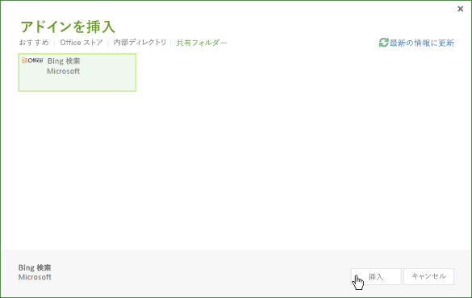

# <a name="task-pane-add-ins-for-project"></a><span data-ttu-id="14c08-102">Project 用の作業ウィンドウ アドイン</span><span class="sxs-lookup"><span data-stu-id="14c08-102">Task pane add-ins for Project</span></span>

<span data-ttu-id="14c08-p101">Project Standard 2013 と Project Professional 2013 はどちらも作業ウィンドウ アドインに対応しています。Word 2013 または Excel 2013 用に開発された一般的な作業ウィンドウ アドインを実行できます。また、カスタム アドインを開発して、Project の一部のイベントを処理し、プロジェクトのタスク、リソース、ビュー、およびその他のセルレベルのデータを、SharePoint のリスト、SharePoint アドイン、Web パーツ、Web サービス、およびエンタープライズ アプリケーションに統合することもできます。</span><span class="sxs-lookup"><span data-stu-id="14c08-p101">Project Standard 2013 and Project Professional 2013 both include support for task pane add-ins. You can run general task pane add-ins that are developed for Word 2013 or Excel 2013. You can also develop custom add-ins that handle selection events in Project and integrate task, resource, view, and other cell-level data in a project with SharePoint lists, SharePoint Add-ins, Web Parts, web services, and enterprise applications.</span></span>

> [!NOTE]
> <span data-ttu-id="14c08-p102">[Project 2013 SDK のダウンロード](https://www.microsoft.com/download/details.aspx?id=30435%20)には、Project のアドイン オブジェクト モデルの使用方法と、Project Server 2013 のレポート データ用 OData サービスの使用方法を示すサンプル アドインが含まれています。SDK を展開してインストールしたら、`\Samples\Apps\` サブディレクトリを確認します。</span><span class="sxs-lookup"><span data-stu-id="14c08-p102">The [Project 2013 SDK download](https://www.microsoft.com/download/details.aspx?id=30435%20) includes sample add-ins that show how to use the add-in object model for Project, and how to use the OData service for reporting data in Project Server 2013. When you extract and install the SDK, see the `\Samples\Apps\` subdirectory.</span></span>

<span data-ttu-id="14c08-107">Office アドインの概要については、「[Office アドイン プラットフォームの概要](../overview/office-add-ins.md)」を参照してください。</span><span class="sxs-lookup"><span data-stu-id="14c08-107">For an introduction to Office Add-ins, see [Office Add-ins platform overview](../overview/office-add-ins.md).</span></span>

## <a name="add-in-scenarios-for-project"></a><span data-ttu-id="14c08-108">Project 用のアドインのシナリオ</span><span class="sxs-lookup"><span data-stu-id="14c08-108">Add-in scenarios for Project</span></span>

<span data-ttu-id="14c08-p103">プロジェクト管理者は、Project の作業ウィンドウ アドインを使用して、プロジェクトの管理作業を円滑に進めることができます。よく使用する情報を調べるときに、Project から離れて別のアプリケーションを起動する必要がなく、Project 内で情報に直接アクセスできます。作業ウィンドウ アドインはコンテキストに応じたコンテンツを表示でき、選択中のタスク、リソース、またはビューに基づくコンテンツや、ガント チャート、タスク使用状況ビュー、またはリソース使用状況ビューのセルに含まれているその他のデータに基づくコンテンツを使用できます。</span><span class="sxs-lookup"><span data-stu-id="14c08-p103">Project managers can use Project task pane add-ins to help with project management activities. Instead of leaving Project and opening another application to search for frequently used information, project managers can directly access the information within Project. The content in a task pane add-in can be context-sensitive, based on the selected task, resource, view, or other data in a cell in a Gantt chart, task usage view, or resource usage view.</span></span>

> [!NOTE]
> <span data-ttu-id="14c08-112">Project Professional 2013 では、社内インストールの Project Server 2013、Project Online、および社内またはオンラインの SharePoint 2013 にアクセスする作業ウィンドウ アドインを開発できます。Project Standard 2013 では、Project Server データ、または Project Server と同期している SharePoint タスク リストとの直接の統合をサポートしていません。</span><span class="sxs-lookup"><span data-stu-id="14c08-112">With Project Professional 2013, you can develop task pane add-ins that access on-premises installations of Project Server 2013, Project Online, and on-premises or online SharePoint 2013.Project Standard 2013 does not support direct integration with Project Server data or SharePoint task lists that are synchronized with Project Server.</span></span>

<span data-ttu-id="14c08-113">Project 用のアドインのシナリオとして、次のようなものがあります。</span><span class="sxs-lookup"><span data-stu-id="14c08-113">Add-in scenarios for Project include the following:</span></span>

-  <span data-ttu-id="14c08-p104">**プロジェクトのスケジュール**???関連性がありスケジュールに影響するプロジェクトのデータを表示できます。作業ウィンドウ アドインでは、Project Server 2013 の他のプロジェクトから、関連するデータを統合できます。たとえば、部署ごとのプロジェクトとマイルストーンの日付の一覧を確認したり、選択したカスタム フィールドに基づいて他のプロジェクトの特定のデータを参照したりできます。</span><span class="sxs-lookup"><span data-stu-id="14c08-p104">**Project scheduling** View data from related projects that can affect scheduling. A task pane add-in can integrate relevant data from other projects in Project Server 2013. For example, you can view the departmental collection of projects and milestone dates, or view specified data from other projects that are based on a selected custom field.</span></span>
    
-  <span data-ttu-id="14c08-117">**リソース管理**???Project Server 2013のリソース共有元の全データや、特定のスキルに基づく一部のデータを、コスト データやリソースの使用可能時間を含めて確認でき、適切なリソースの選択に役立ちます。</span><span class="sxs-lookup"><span data-stu-id="14c08-117">**Resource management** View the complete resource pool in Project Server 2013 or a subset based on specified skills, including cost data and resource availability, to help select appropriate resources.</span></span>
    
-  <span data-ttu-id="14c08-p105">**状況と承認**???作業ウィンドウ アドインの Web アプリケーションを使用して、外部のエンタープライズ リソース プラニング (ERP) アプリケーション、タイムシート システム、または会計アプリケーションのデータを更新または参照できます。または、Project Web App と Project Professional 2013の両方で使用できるカスタムの状況承認 Web パーツを作成します。</span><span class="sxs-lookup"><span data-stu-id="14c08-p105">**Statusing and approvals** Use a web application in a task pane add-in to update or view data from an external enterprise resource planning (ERP) application, timesheet system, or accounting application. Or, create a custom status approval Web Part that can be used within both Project Web App and Project Professional 2013.</span></span>
    
-  <span data-ttu-id="14c08-p106">**チームのコミュニケーション**???プロジェクトのコンテキスト内で、作業ウィンドウ アドインからチームのメンバーやリソースと直接コミュニケーションを図ることができます。または、プロジェクトに従事する中で、コンテキストに応じた自分用のメモを簡単に保持できます。</span><span class="sxs-lookup"><span data-stu-id="14c08-p106">**Team communication** Communicate with team members and resources directly from a task pane add-in, within the context of a project. Or, easily maintain a set of context-sensitive notes for yourself as you work in a project.</span></span>
    
-  <span data-ttu-id="14c08-p107">**作業用のパッケージ**???SharePoint ライブラリやオンラインのテンプレート コレクションから、特別な種類のプロジェクト テンプレートを検索できます。たとえば、建設プロジェクト用のテンプレートを見つけ、自分の Project テンプレート コレクションに追加できます。</span><span class="sxs-lookup"><span data-stu-id="14c08-p107">**Work packages** Search for specified kinds of project templates within SharePoint libraries and online template collections. For example, find templates for construction projects and add them to your Project template collection.</span></span>
    
-  <span data-ttu-id="14c08-p108">**関連アイテム**???プロジェクト計画の特定のタスクに関連するメタデータ、ドキュメント、およびメッセージを参照できます。たとえば、Project Professional 2013 で SharePoint タスク リストからインポートしたプロジェクトを管理し、プロジェクトに加えた変更にタスク リストを同期できます。作業ウィンドウ アドインを使用して、SharePoint リストのタスクに関して Project がインポートしなかった追加のフィールドやメタデータを表示できます。</span><span class="sxs-lookup"><span data-stu-id="14c08-p108">**Related items** View metadata, documents, and messages that are related to specific tasks in a project plan. For example, you can use Project Professional 2013 to manage a project that was imported from a SharePoint task list, and still synchronize the task list with changes in the project. A task pane add-in can show additional fields or metadata that Project did not import for tasks in the SharePoint list.</span></span>
    
-  <span data-ttu-id="14c08-p109">**Project Server のオブジェクト モデルの使用**???選択したタスクの GUID を、Project Server Interface (PSI) または Project Server のクライアント側オブジェクト モデル (CSOM) のメソッドで使用できます。たとえば、アドインの Web アプリケーションで、選択したタスクとリソースの状況データの読み取りや更新を行ったり、外部のタイムシート アプリケーションと統合したりできます。</span><span class="sxs-lookup"><span data-stu-id="14c08-p109">**Use the Project Server object models** Use the GUID of a selected task with methods in the Project Server Interface (PSI) or the client-side object model (CSOM) of Project Server. For example, the web application for an add-in can read and update the statusing data of a selected task and resource, or integrate with an external timesheet application.</span></span>
    
-  <span data-ttu-id="14c08-p110">**レポート データの取得**???Representational State Transfer (REST)、JavaScript、または LINQ クエリを使用して、Project Web App のレポート テーブル用 OData サービスで、選択したタスクまたはリソースに関連する情報を検索します。OData サービスを使用するクエリは、Project Server 2013のオンライン インストールまたは社内インストールで実行できます。</span><span class="sxs-lookup"><span data-stu-id="14c08-p110">**Get reporting data** Use Representational State Transfer (REST), JavaScript, or LINQ queries to find related information for a selected task or resource in the OData service for reporting tables in Project Web App. Queries that use the OData service can be done with an online or an on-premises installation of Project Server 2013.</span></span>
    
    <span data-ttu-id="14c08-131">「[社内の Project Server OData サービスで REST を使用する Project アドインを作成する](../project/create-a-project-add-in-that-uses-rest-with-an-on-premises-odata-service.md)」などを参照してください。</span><span class="sxs-lookup"><span data-stu-id="14c08-131">For example, see [Create a Project add-in that uses REST with an on-premises Project Server OData  service](../project/create-a-project-add-in-that-uses-rest-with-an-on-premises-odata-service.md).</span></span>
    
## <a name="developing-project-add-ins"></a><span data-ttu-id="14c08-132">Project アドインの開発</span><span class="sxs-lookup"><span data-stu-id="14c08-132">Developing Project add-ins</span></span>

<span data-ttu-id="14c08-p111">Project アドイン の JavaScript ライブラリには、 **Office** 名前空間エイリアスの拡張機能が含まれています。開発者は、これらの拡張機能を使用して、プロジェクト内で Project アプリケーションのプロパティとタスク、リソース、およびビューにアクセスできます。Project-15.js ファイルに含まれている JavaScript ライブラリの拡張機能は、Visual Studio 2015 で作成された Project アドインで使用されます。Office.js、Office.debug.js、Project-15.js、Project-15.debug.js、および関連ファイルも、Project 2013 SDK ダウンロードで提供されます。</span><span class="sxs-lookup"><span data-stu-id="14c08-p111">The JavaScript library for Project add-ins includes extensions of the  **Office** namespace alias that enable developers to access properties of the Project application and tasks, resources, and views in a project. The JavaScript library extensions in the Project-15.js file are used in a Project add-in created with Visual Studio 2015. The Office.js, Office.debug.js, Project-15.js, Project-15.debug.js, and related files are also provided in the Project 2013 SDK download.</span></span>

<span data-ttu-id="14c08-p112">アドインを作成するには、基本的なテキスト エディターを使用して、HTML の Web ページと、関連する JavaScript ファイル、CSS ファイル、および REST クエリを作成します。アドインには、HTML ページや Web アプリケーションに加えて、構成用の XML マニフェスト ファイルも必要です。Project では、 **type** 属性に **TaskPaneExtension** を指定したマニフェスト ファイルを使用できます。同じマニフェスト ファイルを複数の Office 2013 クライアント アプリケーションで使用することも、Project 2013 専用のマニフェスト ファイルを作成することもできます。詳細については、「 _Office アドイン プラットフォームの概要_」の「 [開発の基本](../overview/office-add-ins.md) 」セクションを参照してください。</span><span class="sxs-lookup"><span data-stu-id="14c08-p112">To create an add-in, you can use a simple text editor to create an HTML webpage and related JavaScript files, CSS files, and REST queries. In addition to an HTML page or a web application, an add-in requires an XML manifest file for configuration. Project can use a manifest file that includes a  **type** attribute that is specified as **TaskPaneExtension**. The manifest file can be used by multiple Office 2013 client applications, or you can create a manifest file that is specific for Project 2013. For more information, see the  _Development basics_ section in [Office Add-ins platform overview](../overview/office-add-ins.md).</span></span>

<span data-ttu-id="14c08-p113">複雑なカスタム アプリケーションを作成する場合、デバッグを容易にするためには、Visual Studio 2015 を使用してアドイン用の Web サイトを開発することをお勧めします。Visual Studio 2015 にはアドイン プロジェクト用のテンプレートが含まれており、アドインの種類 (作業ウィンドウ、コンテンツ、またはメール) とホスト アプリケーション (Project、Word、Excel、または Outlook) を選択できます。Project Online からのデータと統合する例については、MSDN の Project プログラミングのブログの「[Project 作業ウィンドウ アドインを PWA に接続する](http://blogs.msdn.com/b/project_programmability/archive/2012/11/02/connecting-a-project-task-pane-app-to-pwa.aspx)」を参照してください。</span><span class="sxs-lookup"><span data-stu-id="14c08-p113">For complex custom applications, and for easier debugging, we recommend that you use Visual Studio 2015 to develop websites for add-ins. Visual Studio 2015 include templates for add-in projects, where you can choose the kind of add-in (task pane, content, or mail) and the host application (Project, Word, Excel, or Outlook).  For an example that integrates with data from Project Online, see [Connecting a Project task pane add-in to PWA](http://blogs.msdn.com/b/project_programmability/archive/2012/11/02/connecting-a-project-task-pane-app-to-pwa.aspx) in the Project Programmability blog on MSDN.</span></span>

<span data-ttu-id="14c08-143">Project 2013 SDK のダウンロード ファイルをインストールすると、`\Samples\Apps\` サブディレクトリに以下のサンプル アドインが置かれます。</span><span class="sxs-lookup"><span data-stu-id="14c08-143">When you install the Project 2013 SDK download, the  `\Samples\Apps\` subdirectory includes the following sample add-ins:</span></span>


-  <span data-ttu-id="14c08-p114">**Bing Search:**??BingSearch.xml マニフェスト ファイルでは、モバイル デバイス用の Bing の検索ページが指定されています。Bing の Web アドインは既にインターネット上に存在するため、Bing Search アドインでは他のソース コード ファイルや Project 用のアドイン オブジェクト モデルは使用しません。</span><span class="sxs-lookup"><span data-stu-id="14c08-p114">**Bing Search:** The BingSearch.xml manifest file points to the Bing search page for mobile devices. Because the Bing web app already exists on the Internet, the Bing Search add-in does not use other source code files or the add-in object model for Project.</span></span>
    
-  <span data-ttu-id="14c08-p115">**Project OM Test:**??JSOM_SimpleOMCalls.xml マニフェスト ファイルと JSOM_Call.html ファイルのペアは、オブジェクト モデルとアドインの機能を Project 2013でテストするサンプルです。HTML ファイルでは JSOM_Sample.js ファイルを参照しています。この中には JavaScript 関数が記述されており、Office.js ファイルと Project-15.js ファイルを使用して主な機能を実現しています。Project OM Test アドインに必要なソース コード ファイルとマニフェスト XML ファイルは SDK のダウンロード ファイルにすべて含まれています。Project OM Test サンプルの開発とインストールについては、「 [テキスト エディターを使用して Project 2013 用の作業ウィンドウ アドインを初めて作成する](../project/create-your-first-task-pane-add-in-for-project-by-using-a-text-editor.md)」で説明しています。</span><span class="sxs-lookup"><span data-stu-id="14c08-p115">**Project OM Test:** The JSOM_SimpleOMCalls.xml manifest file and the JSOM_Call.html file are, together, an example that tests the object model and add-in functionality in Project 2013. The HTML file references the JSOM_Sample.js file, which has JavaScript functions that use the Office.js file and the Project-15.js file for the primary functionality. The SDK download includes all of the necessary source code files and the manifest XML file for the Project OM Test add-in. The development and installation of the Project OM Test sample is described in [Create your first task pane add-in for Project 2013 by using a text editor](../project/create-your-first-task-pane-add-in-for-project-by-using-a-text-editor.md).</span></span>
    
-  <span data-ttu-id="14c08-p116">**HelloProject_OData:**??これは Project Professional 2013 用の Visual Studio ソリューションです。アクティブ プロジェクトのコスト、作業時間、達成率などのデータを示し、アクティブ プロジェクトが格納されている Project Web App インスタンス内のすべての発行済みプロジェクトの平均と比較します。サンプル (Project Web App の  **ProjectData** サービスと REST プロトコルを使用) の開発、インストール、およびテストについては、「 [社内の Project Server OData サービスで REST を使用する Project アドインを作成する](../project/create-a-project-add-in-that-uses-rest-with-an-on-premises-odata-service.md)」を参照してください。</span><span class="sxs-lookup"><span data-stu-id="14c08-p116">**HelloProject_OData:** This is a Visual Studio solution for Project Professional 2013 that summarizes data from the active project, such as cost, work, and percent complete, and compares that with the average for all published projects in the Project Web App instance where the active project is stored. The development, installation, and testing of the sample, which uses the REST protocol with the **ProjectData** service in Project Web App, is described in [Create a Project add-in that uses REST with an on-premises Project Server OData service](../project/create-a-project-add-in-that-uses-rest-with-an-on-premises-odata-service.md).</span></span>
    

### <a name="creating-an-add-in-manifest-file"></a><span data-ttu-id="14c08-152">アドインのマニフェスト ファイルの作成</span><span class="sxs-lookup"><span data-stu-id="14c08-152">Creating an add-in manifest file</span></span>


<span data-ttu-id="14c08-153">マニフェスト ファイルでは、アドインの Web ページまたは Web アプリケーションの URL、アドインの種類 (Project 用の作業ウィンドウ アドイン)、他の言語とロケール用のコンテンツを表すオプションの URL、およびその他のプロパティを指定します。</span><span class="sxs-lookup"><span data-stu-id="14c08-153">The manifest file specifies the URL of the add-in webpage or web application, the kind of add-in (task pane for Project), optional URLs of content for other languages and locales, and other properties.</span></span>


### <a name="procedure-1-to-create-the-add-in-manifest-file-for-bing-search"></a><span data-ttu-id="14c08-p117">手順 1. Bing Search 用のアドインのマニフェスト ファイルを作成するには</span><span class="sxs-lookup"><span data-stu-id="14c08-p117">Procedure 1. To create the add-in manifest file for Bing Search</span></span>


- <span data-ttu-id="14c08-p118">ローカル ディレクトリに XML ファイルを作成します。この XML ファイルには  **OfficeApp** 要素と子要素を記述します。詳細については「 [Office アドインの XML マニフェスト](../develop/add-in-manifests.md)」を参照してください。たとえば、以下の XML を記述したファイルを BingSearch.xml という名前で作成します。</span><span class="sxs-lookup"><span data-stu-id="14c08-p118">Create an XML file in a local directory. The XML file includes the  **OfficeApp** element and child elements, which are described in the [Office Add-ins XML manifest](../develop/add-in-manifests.md). For example, create a file named BingSearch.xml that contains the following XML.</span></span>
    
    ```XML
    <?xml version="1.0" encoding="utf-8"?>
    <OfficeApp xmlns="http://schemas.microsoft.com/office/appforoffice/1.0" 
                xmlns:xsi="http://www.w3.org/2001/XMLSchema-instance" 
              xsi:type="TaskPaneApp">
      <Id>1234-5678</Id>
      <Version>15.0</Version>
      <ProviderName>Microsoft</ProviderName>
      <DefaultLocale>en-us</DefaultLocale>
      <DisplayName DefaultValue="Bing Search">
      </DisplayName>
      <Description DefaultValue="Search selected data on Bing">
      </Description>
      <IconUrl DefaultValue="http://officeimg.vo.msecnd.net/_layouts/images/general/office_logo.jpg">
      </IconUrl>
      <Capabilities>
        <Capability Name="Project"/>
      </Capabilities>
      <DefaultSettings>
        <SourceLocation DefaultValue="http://m.bing.com">
        </SourceLocation>
      </DefaultSettings>
      <Permissions>ReadWriteDocument</Permissions>
    </OfficeApp>
    ```

- <span data-ttu-id="14c08-159">アドインのマニフェストで必要な要素を次に示します。</span><span class="sxs-lookup"><span data-stu-id="14c08-159">Following are the required elements in the add-in manifest:</span></span>
  - <span data-ttu-id="14c08-160">**OfficeApp** 要素では、アドインの種類が作業ウィンドウであることを `xsi:type="TaskPaneApp"` 属性で指定します。</span><span class="sxs-lookup"><span data-stu-id="14c08-160">In the  **OfficeApp** element, the `xsi:type="TaskPaneApp"` attribute specifies that the add-in is a task pane type.</span></span>
  - <span data-ttu-id="14c08-161">**Id** 要素は UUID で、一意である必要があります。</span><span class="sxs-lookup"><span data-stu-id="14c08-161">The  **Id** element is a UUID and must be unique.</span></span>
  - <span data-ttu-id="14c08-p119">**Version** 要素は、アドインのバージョンです。 **ProviderName** 要素は、アドインを提供する企業または開発者の名前です。 **DefaultLocale** 要素は、マニフェストで指定する文字列の既定のロケールです。</span><span class="sxs-lookup"><span data-stu-id="14c08-p119">The  **Version** element is the version of the add-in. The **ProviderName** element is the name of the company or developer who provides the add-in. The **DefaultLocale** element specifies the default locale for the strings in the manifest.</span></span>
  - <span data-ttu-id="14c08-p120">**DisplayName** 要素は、Project 2013 のリボンの [ **ビュー**] タブで [ **作業ウィンドウ アドイン**] ドロップダウン リストに表示される名前です。値は最大 32 文字です。</span><span class="sxs-lookup"><span data-stu-id="14c08-p120">The  **DisplayName** element is the name that shows in the **Task Pane Add-in** drop-down list in the **VIEW** tab of the ribbon in Project 2013. The value can contain up to 32 characters.</span></span>
  - <span data-ttu-id="14c08-p121">**Description** 要素は、既定のロケールでのアドインの説明です。値は最大 2000 文字です。</span><span class="sxs-lookup"><span data-stu-id="14c08-p121">The  **Description** element contains the add-in description for the default locale. The value can contain up to 2000 characters.</span></span>
  - <span data-ttu-id="14c08-169">**Capabilities** 要素は、1 つまたは複数の **Capability** 子要素を持ち、その中でホスト アプリケーションを指定します。</span><span class="sxs-lookup"><span data-stu-id="14c08-169">The  **Capabilities** element contains one or more **Capability** child elements that specify the host application.</span></span>
  - <span data-ttu-id="14c08-p122">**DefaultSettings** 要素には、アドインが使用するファイル共有上の HTML ファイルのパスまたは Web ページの URL を指定する **SourceLocation** 要素が含まれています。作業ウィンドウ アドインでは、 **RequestedHeight** 要素と **RequestedWidth** 要素は無視されます。</span><span class="sxs-lookup"><span data-stu-id="14c08-p122">The  **DefaultSettings** element includes the **SourceLocation** element, which specifies the path of an HTML file on a file share or the URL of a webpage that the add-in uses. A task pane add-in ignores the **RequestedHeight** element and the **RequestedWidth** element.</span></span>
  - <span data-ttu-id="14c08-p123">**IconUrl** 要素は省略可能です。ファイル共有のアイコンまたは Web アプリケーションのアイコンの URL を指定できます。</span><span class="sxs-lookup"><span data-stu-id="14c08-p123">The  **IconUrl** element is optional. It can be an icon on a file share or the URL of an icon in a web application.</span></span>
    
- <span data-ttu-id="14c08-p124">(省略可能) 他のロケール用の値を表す  **Override** 要素を追加します。たとえば、次のマニフェストでは、 **DisplayName**、 **Description**、 **IconUrl**、および  **SourceLocation** に対し、フランス語の値を表す **Override** 要素を指定しています。</span><span class="sxs-lookup"><span data-stu-id="14c08-p124">(Optional) Add  **Override** elements that have values for other locales. For example, the following manifest provides **Override** elements for French values of **DisplayName**,  **Description**,  **IconUrl**, and  **SourceLocation**.</span></span>
    
    ```XML
    <?xml version="1.0" encoding="utf-8"?>
    <OfficeApp xmlns="http://schemas.microsoft.com/office/appforoffice/1.0" 
                xmlns:xsi="http://www.w3.org/2001/XMLSchema-instance" 
              xsi:type="TaskPaneApp">
      <Id>1234-5678</Id>
      <Version>15.0</Version>
      <ProviderName>Microsoft</ProviderName>
      <DefaultLocale>en-us</DefaultLocale>
      <DisplayName DefaultValue="Bing Search">
        <Override Locale="fr-fr" Value="Bing Search"/>
      </DisplayName>
      <Description DefaultValue="Search selected data on Bing">
        <Override Locale="fr-fr" Value="Search selected data on Bing"></Override>
      </Description>
      <IconUrl DefaultValue="http://officeimg.vo.msecnd.net/_layouts/images/general/office_logo.jpg">
        <Override Locale="fr-fr" Value="http://officeimg.vo.msecnd.net/_layouts/images/general/office_logo.jpg"/>
      </IconUrl>
      <Capabilities>
        <Capability Name="Project"/>
      </Capabilities>
      <DefaultSettings>
        <SourceLocation DefaultValue="http://m.bing.com">
          <Override Locale="fr-fr" Value="http://m.bing.com"/>
        </SourceLocation>
      </DefaultSettings>
      <Permissions>ReadWriteDocument</Permissions>
    </OfficeApp>
    ```


## <a name="installing-project-add-ins"></a><span data-ttu-id="14c08-176">Project アドインのインストール</span><span class="sxs-lookup"><span data-stu-id="14c08-176">Installing Project add-ins</span></span>


<span data-ttu-id="14c08-p125">Project 2013 では、ファイル共有上のスタンドアロン ソリューションとして、またはプライベート アドイン カタログに、アドインをインストールできます。AppSource でアドインをレビューおよび購入することもできます。</span><span class="sxs-lookup"><span data-stu-id="14c08-p125">In Project 2013, you can install add-ins as stand-alone solutions on a file share, or in a private add-in catalog. You can also review and purchase add-ins in AppSource.</span></span>

<span data-ttu-id="14c08-p126">ファイル共有の中には、アドイン マニフェストの XML ファイルとサブディレクトリを複数配置することもできます。マニフェストのディレクトリの場所とカタログを追加または削除するには、Project 2013 の [ **セキュリティ センター**] ダイアログ ボックスの [ **信頼されているアドイン カタログ**] タブを使用します。Project にアドインを表示するには、マニフェスト内の  **SourceLocation** 要素で既存の Web サイトまたは HTML ソース ファイルを指定する必要があります。</span><span class="sxs-lookup"><span data-stu-id="14c08-p126">There can be multiple add-in manifest XML files and subdirectories in a file share. You can add or remove manifest directory locations and catalogs by using the  **Trusted Add-in Catalogs** tab in the **Trust Center** dialog box in Project 2013. To show an add-in in Project, the **SourceLocation** element in a manifest must point to an existing website or HTML source file.</span></span>


> [!NOTE]
> <span data-ttu-id="14c08-p127">Internet Explorer 9 以降がインストールされている必要がありますが、既定のブラウザーになっている必要はありません。Office アドインには Internet Explorer 9 のコンポーネントが必要です。既定のブラウザーとして使用できるのは、Internet Explorer 9、Safari 5.0.6、Firefox 5、Chrome 13、これらのブラウザーのいずれかの最新バージョンです。</span><span class="sxs-lookup"><span data-stu-id="14c08-p127">Internet Explorer 9 (or later) must be installed, but does not have to be the default browser. Office Add-ins require components in Internet Explorer 9. The default browser can be Internet Explorer 9, Safari 5.0.6, Firefox 5, Chrome 13, or a later version of one of these browsers.</span></span>

<span data-ttu-id="14c08-p128">手順 2. では、Project 2013 がインストールされているローカル コンピューター上に Bing Search アドインをインストールします。しかし、アドインのインフラストラクチャでは  `C:\Project\AppManifests` などのローカル ファイル パスを直接使用しないので、ローカル コンピューター上にネットワーク共有を作成できます。希望に応じて、リモート コンピューター上にファイル共有を作成することもできます。</span><span class="sxs-lookup"><span data-stu-id="14c08-p128">In Procedure 2, the Bing Search add-in is installed on the local computer where Project 2013 is installed. However, because the add-in infrastructure does not directly use local file paths such as  `C:\Project\AppManifests`, you can create a network share on the local computer. If you prefer, you can create a file share on a remote computer.</span></span>


### <a name="procedure-2-to-install-the-bing-search-add-in"></a><span data-ttu-id="14c08-p129">手順 2. Bing Search アドインをインストールするには</span><span class="sxs-lookup"><span data-stu-id="14c08-p129">Procedure 2. To install the Bing Search add-in</span></span>


1. <span data-ttu-id="14c08-p130">アドイン マニフェスト用のローカル ディレクトリを作成します。たとえば、 `C:\Project\AppManifests` ディレクトリを作成します。</span><span class="sxs-lookup"><span data-stu-id="14c08-p130">Create a local directory for add-in manifests. For example, create the  `C:\Project\AppManifests` directory.</span></span>
    
2. <span data-ttu-id="14c08-192">ディレクトリをAppManifests として共有し、ファイル共有へのネットワーク パスが `\\ServerName\AppManifests` になるようにします。`C:\Project\AppManifests`</span><span class="sxs-lookup"><span data-stu-id="14c08-192">Share the  `C:\Project\AppManifests` directory asAppManifests, so the network path to the file share becomes  `\\ServerName\AppManifests`.</span></span>
    
3. <span data-ttu-id="14c08-193">BingSearch.xml マニフェスト ファイルを  `C:\Project\AppManifests` ディレクトリにコピーします。</span><span class="sxs-lookup"><span data-stu-id="14c08-193">Copy the BingSearch.xml manifest file to the  `C:\Project\AppManifests` directory.</span></span>
    
4. <span data-ttu-id="14c08-194">Project 2013で、[ **Project のオプション**] ダイアログ ボックスを開き、[ **セキュリティ センター**]、[ **セキュリティ センターの設定**] の順に選択します。</span><span class="sxs-lookup"><span data-stu-id="14c08-194">In Project 2013, open the  **Project Options** dialog box, choose **Trust Center**, and then choose  **Trust Center Settings**.</span></span>
    
5. <span data-ttu-id="14c08-195">[ **セキュリティ センター**] ダイアログ ボックスの左側のウィンドウで、[ **信頼されているアドイン カタログ**] を選択します。</span><span class="sxs-lookup"><span data-stu-id="14c08-195">In the  **Trust Center** dialog box, in the left pane, choose **Trusted Add-in Catalogs**.</span></span>
    
6. <span data-ttu-id="14c08-196">[ **信頼されているアドイン カタログ**] ウィンドウ (図 1 を参照) で、 [ **カタログの URL**] テキスト ボックスにパス「 `\\ServerName\AppManifests`」を追加し、[ **カタログの追加**]、[ **OK**] の順に選択します。</span><span class="sxs-lookup"><span data-stu-id="14c08-196">In the  **Trusted Add-in Catalogs** pane (see Figure 1), add the `\\ServerName\AppManifests` path in the **Catalog Url** text box, choose **Add Catalog**, and then choose  **OK**.</span></span>
    
    > [!NOTE]
    > <span data-ttu-id="14c08-p131">図 1 は [**信頼できるカタログのアドレス**] リストの非公開カタログの、2 つのファイル共有と 1 つの架空の URL を示しています。既定のファイル共有に設定できるのは 1 つのファイル共有のみで、既定のカタログに設定できるのは 1 つのカタログ URL のみです。たとえば、`\\Server2\AppManifests` を既定に設定した場合、Project は `\\ServerName\AppManifests` の [**既定**] チェック ボックスをオフにします。既定の選択を変更した場合、[**クリア**] を選択すると、インストールしたアドインを削除して、Project を再起動することができます。Project が開いているときに既定のファイル共有または SharePoint カタログにアドインを追加した場合、Project を再起動する必要があります。</span><span class="sxs-lookup"><span data-stu-id="14c08-p131">Figure 1 shows two file shares and one hypothetical URL for a private catalog in the  **Trusted Catalog Address** list. Only one file share can be the default file share and only one catalog URL can be the default catalog. For example, if you set `\\Server2\AppManifests` as the default, Project clears the **Default** check box for `\\ServerName\AppManifests`.If you change the default selection, you can choose  **Clear** to remove installed add-ins, and then restart Project. If you add an add-in to the default file share or SharePoint catalog while Project is open, you should restart Project.</span></span>

    <span data-ttu-id="14c08-201">*図 1. セキュリティ センターを使用したアドインのマニフェストのカタログの追加*</span><span class="sxs-lookup"><span data-stu-id="14c08-201">*Figure 1. Using the Trust Center to add catalogs of add-in manifests*</span></span>

    

7. <span data-ttu-id="14c08-p132">[ **プロジェクト**] リボンで、[ **Office アドイン**] ドロップダウン メニューの [ **すべて表示**] を選択します。[ **アドインの挿入**] ダイアログ ボックスで、[ **共有フォルダー**] を選択します (図 2 を参照)。</span><span class="sxs-lookup"><span data-stu-id="14c08-p132">On the  **Project** ribbon, choose the **Office Add-ins** drop-down menu, and then choose **See All**. In the  **Insert Add-in** dialog box, choose **SHARED FOLDER** (see Figure 2).</span></span>
    
    <span data-ttu-id="14c08-205">*図 2. ファイル共有にあるアドインの起動*</span><span class="sxs-lookup"><span data-stu-id="14c08-205">*Figure 2. Starting an add-in that is on a file share*</span></span>

    

8. <span data-ttu-id="14c08-207">Bing Search アドインを選択し、 [ **挿入**] を選択します。</span><span class="sxs-lookup"><span data-stu-id="14c08-207">Select the Bing Search add-in, and then choose  **Insert**.</span></span>
    
    <span data-ttu-id="14c08-p133">図 3 のように、作業ウィンドウに Bing Search アドインが表示されます。作業ウィンドウのサイズを手動で変更して、Bing Search アドインを使用できます。</span><span class="sxs-lookup"><span data-stu-id="14c08-p133">The Bing Search add-in shows in a task pane, as in Figure 3. You can manually resize the task pane, and use the Bing Search add-in.</span></span>

    <span data-ttu-id="14c08-210">*図 3. Bing Search アドインの使用*</span><span class="sxs-lookup"><span data-stu-id="14c08-210">*Figure 3. Using the Bing Search add-in*</span></span>

    


## <a name="distributing-project-add-ins"></a><span data-ttu-id="14c08-212">Project 用アドインの配布</span><span class="sxs-lookup"><span data-stu-id="14c08-212">Distributing Project add-ins</span></span>


<span data-ttu-id="14c08-p134">アドインの配布は、ファイル共有、SharePoint ライブラリのアドイン カタログ、または AppSource で行えます。詳細については、「[Office アドインを発行する](../publish/publish.md)」を参照してください。</span><span class="sxs-lookup"><span data-stu-id="14c08-p134">You can distribute add-ins through a file share, an add-in catalog in a SharePoint library, or AppSource. For more information, see [Publish your Office Add-in](../publish/publish.md).</span></span>


## <a name="see-also"></a><span data-ttu-id="14c08-215">関連項目</span><span class="sxs-lookup"><span data-stu-id="14c08-215">See also</span></span>

- [<span data-ttu-id="14c08-216">Office アドイン プラットフォームの概要</span><span class="sxs-lookup"><span data-stu-id="14c08-216">Office Add-ins platform overview</span></span>](../overview/office-add-ins.md)
- [<span data-ttu-id="14c08-217">Office アドインの XML マニフェスト</span><span class="sxs-lookup"><span data-stu-id="14c08-217">Office Add-ins XML manifest</span></span>](../develop/add-in-manifests.md)
- [<span data-ttu-id="14c08-218">Office用JavaScript API</span><span class="sxs-lookup"><span data-stu-id="14c08-218">JavaScript API for Office</span></span>](https://docs.microsoft.com/javascript/office/javascript-api-for-office?view=office-js)
- [<span data-ttu-id="14c08-219">テキスト エディターを使用して Project 2013 用の作業ウィンドウ アドインを初めて作成する</span><span class="sxs-lookup"><span data-stu-id="14c08-219">Create your first task pane add-in for Project 2013 by using a text editor</span></span>](create-your-first-task-pane-add-in-for-project-by-using-a-text-editor.md)
- [<span data-ttu-id="14c08-220">社内の Project Server OData サービスで REST を使用する Project アドインを作成する</span><span class="sxs-lookup"><span data-stu-id="14c08-220">Create a Project add-in that uses REST with an on-premises Project Server OData service</span></span>](create-a-project-add-in-that-uses-rest-with-an-on-premises-odata-service.md)
- [<span data-ttu-id="14c08-221">Project 用の作業ウィンドウ アドインを PWA に接続する</span><span class="sxs-lookup"><span data-stu-id="14c08-221">Connecting a Project task pane add-in to PWA</span></span>](http://blogs.msdn.com/b/project_programmability/archive/2012/11/02/connecting-a-project-task-pane-app-to-pwa.aspx)
- [<span data-ttu-id="14c08-222">Project 2013 SDK のダウンロード</span><span class="sxs-lookup"><span data-stu-id="14c08-222">Project 2013 SDK download</span></span>](https://www.microsoft.com/download/details.aspx?id=30435%20)
    
