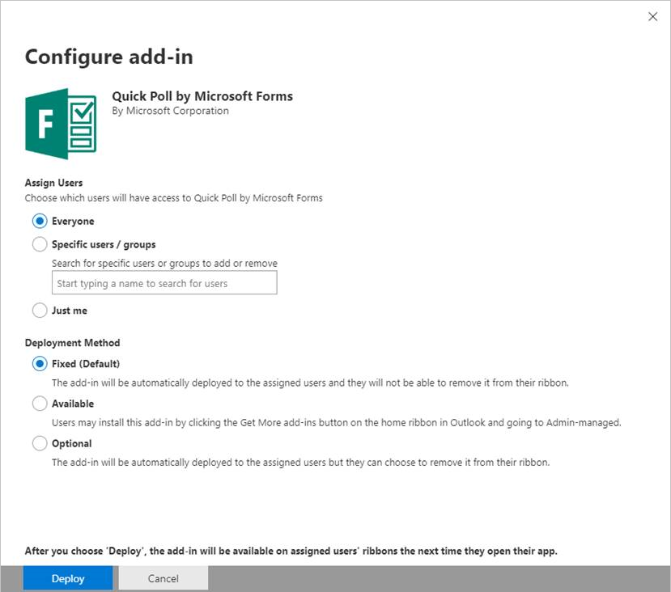

# Office 365 管理センターからの一元展開を使用した Office アドインの発行Publish Office Add-ins using Centralized Deployment via the Microsoft 365 admin center

Microsoft 365 管理センターを使用すると、管理者は組織内のユーザー Officeにアドインを簡単に展開できます。The Microsoft 365 admin center makes it easy for an administrator to deploy Office Add-ins to users and groups within their organization. 管理センター経由で展開されたアドインは、ユーザーがすぐに Office アプリケーションで利用できるようになります。クライアントの構成は必要ありません。Add-ins deployed via the admin center are available to users in their Office applications right away, with no client configuration required. 一元展開は、内部アドインの展開に使用することも、ISV が提供するアドインの展開に使用することもできます。You can use Centralized Deployment to deploy internal add-ins as well as add-ins provided by ISVs.

現在、Microsoft 365 管理センターは次のシナリオをサポートしています。The Microsoft 365 admin center currently supports the following scenarios.

- 新しいアドインおよび更新されたアドインの個人、グループ、組織への一元展開。Centralized Deployment of new and updated add-ins to individuals, groups, or an organization.
- Windows、Mac、Web を含む複数のクライアント プラットフォームへの展開。Deployment to multiple client platforms, including Windows, Mac, and the web. Outlook では、iOS および Android への展開もサポートされています。For Outlook, deployment to iOS and Android is also supported. (ただし、ユーザーによる iPad への Excel、Outlook、Word、PowerPoint アドインのインストールはサポートされている一方で、iPad への一元展開 **はサポートされていません** 。(However, while user installation of Excel, Outlook, Word, and PowerPoint add-ins on iPad is supported, Centralized Deployment to iPad is **not** supported.)
- 英語および世界各国のテナントへの展開。Deployment to English language and worldwide tenants.
- クラウド ホスト型アドインの展開。Deployment of cloud-hosted add-ins.
- ファイアウオール内でホストされているアドインの展開。Deployment of add-ins that are hosted within a firewall.
- AppSource アドインの展開。Deployment of AppSource add-ins.
- ユーザーのアドインの自動インストール (Office アプリケーション起動時)。Automatic installation of an add-in for users when they launch the Office application.
- ユーザーのアドインの自動削除 (管理者がアドインをオフにした場合や削除した場合。または、ユーザーが Azure Active Directory から削除された場合やアドインが展開されているグループから削除された場合)。Automatic removal of an add-in for users if the admin turns off or deletes the add-in, or if users are removed from Azure Active Directory or from a group to which the add-in has been deployed.

一元展開は、組織が一元展開を使用するためのすべての要件を満たしている場合に、Microsoft 365 管理者が組織内に Office アドインを展開する場合に推奨される方法です。Centralized Deployment is the recommended way for a Microsoft 365 admin to deploy Office Add-ins within an organization, provided that the organization meets all requirements for using Centralized Deployment. 組織で一元展開を使用できるかどうかを判断する方法については、「アドインの一元展開が [Microsoft 365](/office365/admin/manage/centralized-deployment-of-add-ins)組織で機能するかどうかを判断する」を参照してください。For information about how to determine if your organization can use Centralized Deployment, see [Determine if Centralized Deployment of add-ins works for your Microsoft 365 organization](/office365/admin/manage/centralized-deployment-of-add-ins).

> [!NOTE]
> Microsoft 365 に接続がないオンプレミス環境、または Office 2013 を対象とする SharePoint アドインまたは Office アドインを展開する場合は [、SharePoint](publish-task-pane-and-content-add-ins-to-an-add-in-catalog.md)アプリ カタログを使用します。In an on-premises environment with no connection to Microsoft 365, or to deploy SharePoint add-ins or Office Add-ins that target Office 2013, use a [SharePoint app catalog](publish-task-pane-and-content-add-ins-to-an-add-in-catalog.md). COM/VSTO アドインを展開する場合は、ClickOnce または Windows インストーラーを使用してください。詳細については、「[Office ソリューションの配置](/visualstudio/vsto/deploying-an-office-solution)」を参照してください。To deploy COM/VSTO add-ins, use ClickOnce or Windows Installer, as described in [Deploying an Office solution](/visualstudio/vsto/deploying-an-office-solution).

## Office アドインの展開に推奨されるアプローチRecommended approach for deploying Office Add-ins

展開がスムーズに進行するように、段階的なアプローチで Office アドインを展開することを検討してください。以下のプランをお勧めします。Consider deploying Office Add-ins in a phased approach to help ensure that the deployment goes smoothly. We recommend the following plan:

1. ビジネス関係者の少人数のグループと IT 部門のメンバーにアドインを展開します。 展開が成功した場合は、第 2 段階に進みます。Deploy the add-in to a small set of business stakeholders and members of the IT department. If the deployment is successful, move on to step 2.

2. アドインを使用することになるビジネス ユーザーの人数を増やしたグループにアドインを展開します。 展開が成功した場合は、第 3 段階に進みます。Deploy the add-in to a larger set of individuals within the business who will be using the add-in. If the deployment is successful, move on to step 3.

3. アドインを使用することになるすべてのユーザーのグループにアドインを展開します。Deploy the add-in to the full set of individuals who will be using the add-in.

対象ユーザーの規模に応じて、この手順に段階を追加するか、この手順から段階を削除してください。Depending on the size of the target audience, you may want to add steps to or remove steps from this procedure.

## 一元展開による Office アドインの発行Publish an Office Add-in via Centralized Deployment

開始する前に、「アドインの一元展開が [Microsoft 365](/microsoft-365/admin/manage/centralized-deployment-of-add-ins)組織で機能するかどうかを判断する」の説明に従って、組織が一元展開を使用する場合のすべての要件を満たしていることを確認します。Before you begin, confirm that your organization meets all requirements for using Centralized Deployment, as described in [Determine if Centralized Deployment of add-ins works for your Microsoft 365 organization](/microsoft-365/admin/manage/centralized-deployment-of-add-ins).

組織がすべての要件を満たしている場合は、次に示す手順を実行して、一元展開によって Office アドインを発行します。If your organization meets all requirements, complete the following steps to publish an Office Add-in via Centralized Deployment:

1. 仕事用または教育用のアカウントで Microsoft 365 にサインインします。Sign in to Microsoft 365 with your work or education account.
2. 左上にあるアプリ起動ツールのアイコンを選択して、**[管理]** をクリックします。Select the app launcher icon in the upper-left and choose **Admin**.
3. ナビゲーション メニューで、**[表示数を増やす]** を押し、**[設定]** > **[サービスとアドイン]** の順に選択します。In the navigation menu, press **Show more**, then choose **Settings** > **Services & add-ins**.
4. 新しい Microsoft 365 管理センターを発表するメッセージがページの上部に表示される場合は、そのメッセージを選択して管理センタープレビューに移動します [(Microsoft 365](/microsoft-365/admin/admin-overview/about-the-admin-center)管理センターについてを参照してください)。If you see a message on the top of the page announcing the new Microsoft 365 admin center, choose the message to go to the Admin Center Preview (see [About the Microsoft 365 admin center](/microsoft-365/admin/admin-overview/about-the-admin-center)).
5. ページの上部にある **[アドインの展開]** を選択します。Choose **Deploy Add-In** at the top of the page.
6. 要件の確認後、**[次へ]** を選択します。Choose **Next** after reviewing the requirements.
7. **[一元展開]** ページで、次のいずれかのオプションを選択します。Choose one of the following options on the **Centralized Deployment** page:

    - **Office ストアからアドインを追加します。****I want to add an Add-In from the Office Store.**
    - **このデバイスにマニフェスト ファイル (.xml) があります。** このオプションの場合は、**[参照]** を選択して、使用するマニフェスト ファイル (.xml) の場所を指定します。**I have the manifest file (.xml) on this device.** For this option, choose **Browse** to locate the manifest file (.xml) that you want to use.
    - **マニフェスト ファイルの URL がわかります。** このオプションの場合は、所定のフィールドにマニフェストの URL を入力します。**I have a URL for the manifest file.** For this option, type the manifest's URL in the field provided.

    ![Microsoft 365 Add-Inセンターの [新しいユーザー設定] ダイアログ](../images/new-add-in.png)

8. Office ストアからアドインを追加するオプションを選択した場合は、アドインを選択します。If you selected the option to add an add-in from the Office Store, select the add-in. 選択可能なアドインは、**[あなたへのおすすめ]**、**[評価]**、**[名前]** のカテゴリから表示できます。You can view available add-ins via categories of **Suggested for you**, **Rating**, or **Name**. Office ストアからは無料のアドインのみを追加できます。You may only add free add-ins from Office Store. 有料のアドインの追加は、現在はサポートされていません。Adding paid add-ins isn't currently supported.

    > [!NOTE]
    > Office ストアのオプションでは、管理者の操作なしで、ユーザーが自動的にアドインの更新と機能強化を利用できます。With the Office Store option, updates and enhancements to the add-in are automatically available to users without your intervention.

    

9. アドイン **の** 詳細、プライバシー ポリシー、ライセンス条項を確認した後、[続行] を選択します。Choose **Continue** after reviewing the add-in details, Privacy Policy, and License Terms.

    ![Microsoft 365 管理センターの [選択したアドイン] ページ](../images/selected-add-in-admin-center.png)

10. [ユーザーの **割り当て]** ページで、[ **すべてのユーザー**]、[ **特定のユーザー/グループ]、または**[自分のみ **] を選択します**。On the **Assign Users** page, choose **Everyone**, **Specific Users/Groups**, or **Only me**. 検索ボックスを使用して、アドインを展開するユーザーやグループを検索します。Use the search box to find the users and groups to whom you want to deploy the add-in. Outlook アドインの場合は、展開方法として [固定]、[使用可能]、または [オプション]**を選択\*\*\*\*できます**。For Outlook add-ins, you can also choose the deployment method **Fixed**, **Available**, or **Optional**.

    

    > [!NOTE]
    > シングル サインオン [(SSO)](../develop/sso-in-office-add-ins.md) を利用するアドインは、アドイン マニフェストにリストされているスコープに同意するように管理者に求めるメッセージを表示します。Add-ins that utilize [single sign-on (SSO)](../develop/sso-in-office-add-ins.md) will prompt the admin to consent to the scopes listed in the add-in manifest.  複数のアドインで同じバッキング サービスが使用されている場合 (同じ Azure アプリ ID が異なるアドインの SSO で使用される場合)、各アドインのスコープに各展開に対する同意を求めるメッセージが表示されます。If the same backing service is used across multiple add-ins (the same Azure App ID is used with SSO in different add-ins), the scopes for each add-in will be prompted for consent with each deployment. このページには、アドインに必要なアクセス許可の一覧も表示されます。This page will also display the list of permissions that the add-in requires.

11. 完了したら、[展開] を **選択します**。When finished, choose **Deploy**. このプロセスには、最大で 3 分かかる場合があります。This process may take up to three minutes. その後、**[次へ]** を押してチュートリアルを終了します。Then, finish the walkthrough by pressing **Next**. アドインが Office 365 のその他のアプリと共に表示されるようになります。You now see your add-in along with other apps in Office 365.

    > [!NOTE]
    > 管理者が [展開] を選択 **すると**、すべてのユーザーに同意が与えられる。When an administrator chooses **Deploy**, consent is given for all users.

    

> [!TIP]
> 組織内のユーザーやグループに新しいアドインを展開するときには、いつどのようにアドインを使用するかについての説明と、サポート資料 (関連するヘルプ コンテンツやよくある質問など) へのリンクを含む電子メールの送信を検討してください。When you deploy a new add-in to users and/or groups in your organization, consider sending them an email that describes when and how to use the add-in, and includes links to relevant Help content, FAQs, or other support resources.

## アドインへのアクセスを許可するときの考慮事項Considerations when granting access to an add-in

管理者は、組織内のすべてのユーザーにアドインを割り当てることも、組織内の特定のユーザーやグループにアドインを割り当てることもできます。 次のリストに、それぞれのオプションの影響を示します。Admins can assign an add-in to everyone in the organization or to specific users and/or groups within the organization. The following list describes the implications of each option:

- **すべてのユーザー**: 名前が示すように、このオプションでは、テナント内のすべてのユーザーにアドインが割り当てられます。対象のアドインが組織全体で汎用な場合にのみ、このオプションを慎重に使用します。**Everyone**: As the name implies, this option assigns the add-in to every user in the tenant. Use this option sparingly and only for add-ins that are truly universal to your organization.

- **ユーザー**: 個別のユーザーにアドインを割り当てる場合は、追加のユーザーにアドインを割り当てるたびに、アドインの一元展開の設定を更新する必要があります。 同様に、ユーザーのアドインへのアクセス権を削除するたびに、アドインの一元展開の設定を更新する必要があります。**Users**: If you assign an add-in to individual users, you'll need to update the Central Deployment settings for the add-in each time you want to assign it additional users. Likewise, you'll need to update the Central Deployment settings for the add-in each time you want to remove a user's access to the add-in.

- **グループ**: グループにアドインを割り当てると、グループに追加されたユーザーにアドインが自動的に割り当てられます。**Groups**: If you assign an add-in to a group, users who are added to the group will automatically be assigned the add-in. 同様に、ユーザーがグループから削除されると、そのユーザーはアドインへのアクセス権を自動的に失います。Likewise, when a user is removed from a group, the user automatically loses access to the add-in. どちらの場合も、Microsoft 365 管理者から追加の操作は必要ありません。In either case, no additional action is required from the Microsoft 365 admin.

一般に、保守が簡単になるように、可能な場合は常にグループを使用してアドインを割り当てるようにしてください。 ただし、アドインのアクセスをユーザーの非常に少数のメンバーに制限する場合は、具体的なユーザーにアドインを割り当てるほうが実用的です。In general, for ease of maintenance, we recommend assigning add-ins by using groups whenever possible. However, in situations where you want to restrict add-in access to a very small number of users, it may be more practical to assign the add-in to specific users.

## アドインの状態Add-in states

次の表では、様々なアドインの状態について説明しています。The following table describes the different states of an add-in.

|状態State|状態が発生する原因How the state occurs|影響Impact|
|-----|--------------------|------|
|**アクティブ****Active**|管理者がアドインをアップロードして、ユーザーやグループに割り当てた。Admin uploaded the add-in and assigned it to users and/or groups.|アドインが割り当てられたユーザーやグループは、関連する Office クライアントでアドインを表示できます。Users and/or groups assigned to the add-in see it in the relevant Office clients.|
|**オフ****Turned off**|管理者がアドインをオフにした。Admin turned off the add-in.|アドインに割り当てられたユーザーやグループは、アドインにアクセスできなくなります。 アドインの状態が **[オフ]** から **[アクティブ]** に変更されると、ユーザーやグループはアドインに再度アクセスできるようになります。Users and/or groups assigned to the add-in no longer have access to it. If the add-in state is changed from **Turned off** to **Active**, the users and groups will regain access to it.|
|**Deleted****Deleted**|管理者がアドインを削除した。Admin deleted the add-in.|アドインが割り当てられたユーザーやグループは、そのアドインにアクセスできなくなります。Users and/or groups assigned the add-in no longer have access to it.|

## 一元展開によって発行された Office アドインの更新Updating Office Add-ins that are published via Centralized Deployment

Office アドインが一元展開によって公開された後、アドインの Web アプリケーションに加えた変更は、Web アプリケーションに実装された後で、すべてのユーザーが自動的に使用できます。After an Office Add-in has been published via Centralized Deployment, any changes made to the add-in's web application will automatically be available to all users after those changes are implemented in the web application. アドインの [XML](../develop/add-in-manifests.md) マニフェスト ファイルに対する変更 (たとえば、アドインのアイコン、テキスト、アドイン コマンドの更新など) は、次のように行われます。Changes made to an add-in's [XML manifest file](../develop/add-in-manifests.md) to, for example, update the add-in's icon, text, or add-in commands, happen as follows:

- **Line-of-business アドイン**: Microsoft 365 管理センター経由で一元展開を実装するときに、管理者がマニフェスト ファイルを明示的にアップロードした場合 (デバイスまたは URL をポイントした場合)、管理者は目的の変更を含む新しいマニフェスト ファイルをアップロードする必要があります。**Line-of-business add-in**: If an admin explicitly uploaded a manifest file (either from their device or by pointing to a URL) when implementing Centralized Deployment via the Microsoft 365 admin center, the admin must upload a new manifest file that contains the desired changes. 更新したマニフェスト ファイルがアップロードされると、関連する Office アプリケーションの次回起動時にアドインが更新されます。After the updated manifest file has been uploaded, the next time the relevant Office applications start, the add-in will update.

  > [!NOTE]
  > 管理者は、更新を行う LOB アドインを削除する必要があります。An admin doesn't need to remove a LOB add-in to make an update. [アドイン] セクションでは、管理者は LOB アドインを選択し、右下隅にある [アドインの更新]ボタンを押してこの機能を呼び出すだけでできます。In the Add-ins section, the admin can simply choose the LOB add-in and invoke this functionality by pressing the **Update add-in** button present in the bottom right corner.
  >
  > ![Microsoft 365 管理センターの [アドインの更新] ダイアログを示すスクリーンショット](../images/update-add-in-admin-center.png)

- **Office ストア** アドイン : 管理者が Microsoft 365 管理センターから一元展開を実装するときに Office ストアからアドインを選択し、Office ストアでアドインの更新を行った場合、アドインは後で一元展開によって更新されます。**Office Store add-in**: If an admin selected an add-in from the Office Store when implementing Centralized Deployment via the Microsoft 365 admin center, and the add-in updates in the Office Store, the add-in will update later via Centralized Deployment. すべてのエンド ユーザーに対してストア アドインの更新が流れるまで最大 24 時間かかる場合があります。It can take up to 24 hours for the Store add-in updates to flow for all end users. この期間が経過すると、関連する Officeアプリケーションがこれらのユーザーに対して再起動すると、アドインが更新されます。After this duration, the next time the relevant Office applications restart for these users, the add-in will update. ユーザーは、[タブ アドインの挿入] の [管理されたタブ のヒット更新] を選択して、手動更新をトリガーして最新のストア アドイン バージョン  >    >    >  **を取得することもできます**。Users can also trigger a Manual Refresh to get the latest Store add-in version by selecting **Insert Tab** > **Add-ins** > **Admin Managed Tab** > **Hit Refresh**.

## アドインのエンド ユーザー エクスペリエンスEnd user experience with add-ins

一元展開によるアドインの発行が完了すると、エンド ユーザーはアドインがサポートする任意のプラットフォームでアドインの使用を開始できます。After an add-in has been published via Centralized Deployment, end users may start using it on any platform that the add-in supports.

アドインでアドイン コマンドがサポートされている場合、アドインが展開されているすべてのユーザーに対して、コマンドが Office アプリケーション リボンに表示されます。 次の例では、**[引用文献]** アドインのリボンに **[引用文献の検索]** コマンドが表示されています。If the add-in supports add-in commands, the commands will appear on the Office application ribbon for all users to whom the add-in is deployed. In the following example, the command **Search Citation** appears in the ribbon for the **Citations** add-in.

アドインがアドイン コマンドをサポートしていない場合、ユーザーは次の手順を実行することで、Office アプリケーションにアドインを追加できます。If the add-in does not support add-in commands, users can add it to their Office application by doing the following:

1. Word 2016 以降、Excel 2016 以降、または PowerPoint 2016 以降で **[挿入]** > **[個人用アドイン]** の順に選択します。In Word 2016 or later, Excel 2016 or later, or PowerPoint 2016 or later, choose **Insert** > **My Add-ins**.
2. アドイン ウィンドウで **[管理者が管理]** タブを選択します。Choose the **Admin Managed** tab in the add-in window.
3. アドインを選択して、**[追加]** を選択します。Choose the add-in, and then choose **Add**.

    ![Office アプリケーションの [Office アドイン] ページにある [管理者が管理] タブを示すスクリーンショット。 [引用文献] アドインがタブに表示されます。](../images/office-add-ins-admin-managed.png)

ただし、Outlook 2016 以降では、ユーザーは次の操作を実行できます。However, for Outlook 2016 or later, users can do the following:

1. Outlook で **[ホーム]** > **[ストア]** の順に選択します。In Outlook, choose **Home** > **Store**.
2. アドイン タブの下にある **[管理者が管理]** の項目を選択します。Choose the **Admin-managed** item under the add-in tab.
3. アドインを選択して、**[追加]** を選択します。Choose the add-in, and then choose **Add**.

    ![Outlook アプリケーションの [ストア] ページの [管理者が管理] 領域を示すスクリーンショット。](../images/outlook-add-ins-admin-managed.png)

## 関連項目See also

- [アドインの一元展開が Microsoft 365 組織で動作するかどうかを判断するDetermine if Centralized Deployment of add-ins works for your Microsoft 365 organization](/office365/admin/manage/centralized-deployment-of-add-ins)
