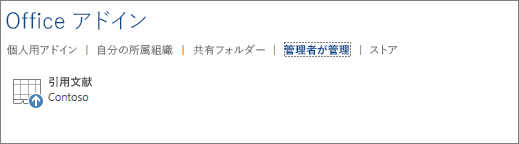

# Office 365 管理センターからの一元展開を使用した Office アドインの発行

The Office 365 admin center makes it easy for an administrator to deploy Office Add-ins to users and groups within their organization. Add-ins deployed via the admin center are available to users in their Office applications right away, with no client configuration required. You can use Centralized Deployment to deploy internal add-ins as well as add-ins provided by ISVs.

現在、Office 365 管理センターは次のシナリオをサポートしています。

- 新しいアドインおよび更新されたアドインの個人、グループ、組織への一元展開。
- Windows、Mac、web を含む複数のクライアントプラットフォームへの展開。 Outlook では、iOS および Android への展開もサポートされています。 (ただし、iPad の Excel、Outlook、Word、PowerPoint のアドインのユーザーインストールはサポートされていますが、iPad への集中展開はサポートされて**いません**)。
- 英語および世界各国のテナントへの展開。
- クラウド ホスト型アドインの展開。
- ファイアウオール内でホストされているアドインの展開。
- AppSource アドインの展開。
- ユーザーのアドインの自動インストール (Office アプリケーション起動時)。
- ユーザーのアドインの自動削除 (管理者がアドインをオフにした場合や削除した場合。または、ユーザーが Azure Active Directory から削除された場合やアドインが展開されているグループから削除された場合)。

一元展開は、一元展開を使用するためのすべての要件を組織が満たしているときに、Office 365 管理者が組織内で Office アドインを展開する場合に推奨される方法です。 組織で一元展開を使用できるかどうかを判断する方法の詳細については、「[アドインの一元展開が Office 365 組織で動作するかどうかを判断する](/office365/admin/manage/centralized-deployment-of-add-ins)」を参照してください。

> [!NOTE]
> In an on-premises environment with no connection to Office 365, or to deploy SharePoint add-ins or Office Add-ins that target Office 2013, use a [SharePoint app catalog](publish-task-pane-and-content-add-ins-to-an-add-in-catalog.md). To deploy COM/VSTO add-ins, use ClickOnce or Windows Installer, as described in [Deploying an Office solution](/visualstudio/vsto/deploying-an-office-solution).

## Office アドインの展開に推奨されるアプローチ

Consider deploying Office Add-ins in a phased approach to help ensure that the deployment goes smoothly. We recommend the following plan:

1. Deploy the add-in to a small set of business stakeholders and members of the IT department. If the deployment is successful, move on to step 2.

2. Deploy the add-in to a larger set of individuals within the business who will be using the add-in. If the deployment is successful, move on to step 3.

3. アドインを使用することになるすべてのユーザーのグループにアドインを展開します。

対象ユーザーの規模に応じて、この手順に段階を追加するか、この手順から段階を削除してください。

## 一元展開による Office アドインの発行

作業を開始する前に、組織が一元展開を使用するためのすべての要件を満たしていることを確認してください。詳細については、「[アドインの一元展開が Office 365 組織で動作するかどうかを判断する](/microsoft-365/admin/manage/centralized-deployment-of-add-ins)」を参照してください。 

組織がすべての要件を満たしている場合は、次に示す手順を実行して、一元展開によって Office アドインを発行します。

1. 職場または学校のアカウントを使用して、Office 365 にサインインします。
2. 左上にあるアプリ起動ツールのアイコンを選択して、**[管理]** をクリックします。
3. ナビゲーション メニューで、**[表示数を増やす]** を押し、**[設定]** > **[サービスとアドイン]** の順に選択します。
4. ページの上部に新しい Office 365 管理センターについて通知するメッセージが表示されている場合は、そのメッセージを選択して管理センター プレビューに移動します (「[Office 365 管理センターについて](/microsoft-365/admin/admin-overview/about-the-admin-center)」を参照)。
5. ページの上部にある **[アドインの展開]** を選択します。
6. 要件の確認後、**[次へ]** を選択します。
7. **[一元展開]** ページで、次のいずれかのオプションを選択します。

    - **Office ストアからアドインを追加します。**
    - **I have the manifest file (.xml) on this device.** For this option, choose **Browse** to locate the manifest file (.xml) that you want to use.
    - **I have a URL for the manifest file.** For this option, type the manifest's URL in the field provided.

    ![Office 365 管理センターの [新しいアドイン] ダイアログ](../images/new-add-in.png)

8. Office ストアからアドインを追加するオプションを選択した場合は、アドインを選択します。 選択可能なアドインは、**[あなたへのおすすめ]**、**[評価]**、**[名前]** のカテゴリから表示できます。 Office ストアからは無料のアドインのみを追加できます。 有料のアドインの追加は、現在はサポートされていません。

    > [!NOTE]
    > Office ストアのオプションでは、管理者の操作なしで、ユーザーが自動的にアドインの更新と機能強化を利用できます。

    

9. アドインの詳細、プライバシーポリシー、ライセンス条項を確認した後、[**続行**] を選択します。

    

10. [**ユーザーの割り当て**] ページで、[**すべて**のユーザー]、[**特定のユーザー/グループ**]、または [**自分のみ**] を選択します。 検索ボックスを使用して、アドインを展開するユーザーやグループを検索します。 Outlook アドインの場合は、展開方法として**Fixed**、 **Available**、または**Optional**を選択することもできます。

    

    > [!NOTE]
    > アドイン用の[シングル サインオン (SSO)](../develop/sso-in-office-add-ins.md) システムは現在プレビューなので、運用環境のアドインとして使用してはいけません。SSO を使用するアドインが展開されている場合、割り当てられているユーザーとグループは、同じ Azure アプリ ID を共有するアドインによっても共有されます。 ユーザーの割り当ての変更は、これらのアドインにも適用されます。関連するアドインは、このページに表示されます。 SSO アドインに限り、アドインで必要な Microsoft Graph アクセス許可のリストがこのページに表示されます。

11. 完了したら、[**展開**] を選択します。 このプロセスには、最大で 3 分かかる場合があります。 その後、**[次へ]** を押してチュートリアルを終了します。 アドインが Office 365 のその他のアプリと共に表示されるようになります。

    > [!NOTE]
    > 管理者が [**展開**] を選択すると、すべてのユーザーに同意が与えられます。

    

> [!TIP]
> 組織内のユーザーやグループに新しいアドインを展開するときには、いつどのようにアドインを使用するかについての説明と、サポート資料 (関連するヘルプ コンテンツやよくある質問など) へのリンクを含む電子メールの送信を検討してください。

## アドインへのアクセスを許可するときの考慮事項

Admins can assign an add-in to everyone in the organization or to specific users and/or groups within the organization. The following list describes the implications of each option:

- **Everyone**: As the name implies, this option assigns the add-in to every user in the tenant. Use this option sparingly and only for add-ins that are truly universal to your organization.

- **Users**: If you assign an add-in to individual users, you'll need to update the Central Deployment settings for the add-in each time you want to assign it additional users. Likewise, you'll need to update the Central Deployment settings for the add-in each time you want to remove a user's access to the add-in.

- **Groups**: If you assign an add-in to a group, users who are added to the group will automatically be assigned the add-in. Likewise, when a user is removed from a group, the user automatically loses access to the add-in. In either case, no additional action is required from the Office 365 admin.

In general, for ease of maintenance, we recommend assigning add-ins by using groups whenever possible. However, in situations where you want to restrict add-in access to a very small number of users, it may be more practical to assign the add-in to specific users.

## アドインの状態

次の表では、様々なアドインの状態について説明しています。

|状態|状態が発生する原因|影響|
|-----|--------------------|------|
|**アクティブ**|管理者がアドインをアップロードして、ユーザーやグループに割り当てた。|アドインが割り当てられたユーザーやグループは、関連する Office クライアントでアドインを表示できます。|
|**オフ**|管理者がアドインをオフにした。|Users and/or groups assigned to the add-in no longer have access to it. If the add-in state is changed from **Turned off** to **Active**, the users and groups will regain access to it.|
|**Deleted**|管理者がアドインを削除した。|アドインが割り当てられたユーザーやグループは、そのアドインにアクセスできなくなります。|

## 一元展開によって発行された Office アドインの更新

After an Office Add-in has been published via Centralized Deployment, any changes made to the add-in's web application will automatically be available to all users as soon as those changes are implemented in the web application. Changes made to an add-in's [XML manifest file](../develop/add-in-manifests.md), for example, to update the add-in's icon, text, or add-in commands, happen as follows:

- **Line-of-business add-in**: If an admin explicitly uploaded a manifest file when implementing Centralized Deployment via the Office 365 admin center, the admin must upload a new manifest file that contains the desired changes. After the updated manifest file has been uploaded, the next time the relevant Office applications start, the add-in will update.

  > [!NOTE]
  > 管理者は、更新を行うために LOB アドインを削除する必要はありません。 [アドイン] セクションでは、管理者は LOB アドインを選択し、右下隅にある [**更新アドイン**] ボタンを押してこの機能を起動することができます。
  > 
  > ![Office 365 管理センターの [アドインの更新] ダイアログを示すスクリーンショット](../images/update-add-in-admin-center.png)

- **Office ストア アドイン**: 管理者が Office 365 管理センターからの一元展開を実施するときに、Office ストアのアドインを選択した場合、アドインが Office ストアで更新されると、その後の一元展開によってアドインが更新されます。 関連する Office アプリケーションの次回起動時に、アドインが更新されます。

## アドインのエンド ユーザー エクスペリエンス

一元展開によるアドインの発行が完了すると、エンド ユーザーはアドインがサポートする任意のプラットフォームでアドインの使用を開始できます。

If the add-in supports add-in commands, the commands will appear on the Office application ribbon for all users to whom the add-in is deployed. In the following example, the command **Search Citation** appears in the ribbon for the **Citations** add-in.

![[引用文献] アドインの [引用文献の検索] コマンドが強調表示された Office リボンの部分を示すスクリーンショット](../images/search-citation.png)

アドインがアドイン コマンドをサポートしていない場合、ユーザーは次の手順を実行することで、Office アプリケーションにアドインを追加できます。

1. Word 2016 以降、Excel 2016 以降、または PowerPoint 2016 以降で **[挿入]** > **[個人用アドイン]** の順に選択します。
2. アドイン ウィンドウで **[管理者が管理]** タブを選択します。
3. アドインを選択して、**[追加]** を選択します。

    

ただし、Outlook 2016 以降では、ユーザーは次の操作を実行できます。

1. Outlook で **[ホーム]** > **[ストア]** の順に選択します。
2. アドイン タブの下にある **[管理者が管理]** の項目を選択します。
3. アドインを選択して、**[追加]** を選択します。

    ![Outlook アプリケーションの [ストア] ページの [管理者が管理] 領域を示すスクリーンショット。](../images/outlook-add-ins-admin-managed.png)

## 関連項目

- [アドインの一元展開が Office 365 組織で動作するかどうかを判断する](/office365/admin/manage/centralized-deployment-of-add-ins)
