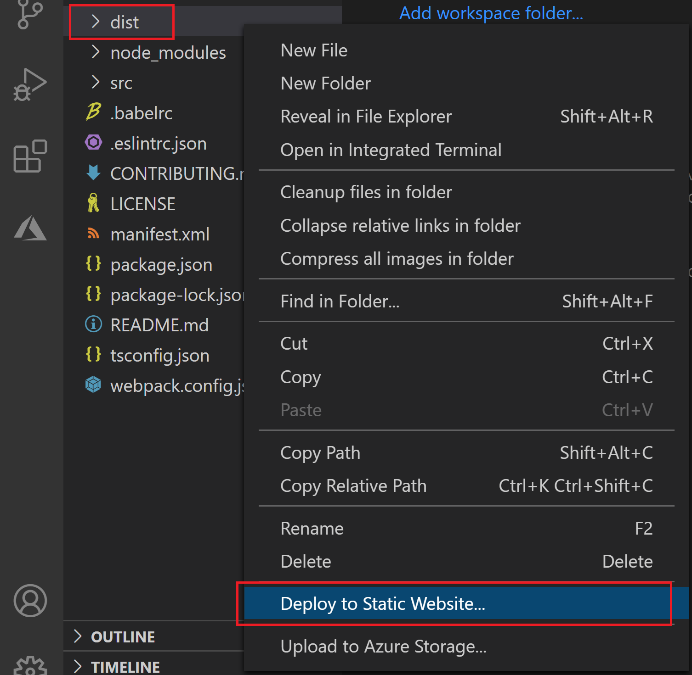

# <a name="publish-an-add-in-developed-with-visual-studio-code"></a>Visual Studio Code で開発されたアドインを発行する

この記事では、Yeoman ジェネレーターを使用して作成し、[Visual Studio Code (VS Code)](https://code.visualstudio.com) またはその他のエディターで開発した Office アドインを発行する方法について説明します。

> [!NOTE]
> Visual Studio を使用して作成した Office アドインの発行の詳細については、「[Visual Studio を使用してアドインを発行する](package-your-add-in-using-visual-studio.md)」を参照してください。

## <a name="publishing-an-add-in-for-other-users-to-access"></a>他のユーザーがアクセスできるようにアドインを発行する

Office アドインは、Web アプリケーションとマニフェスト ファイルで構成されます。Web アプリケーションはアドインのユーザー インターフェイスと機能を定義しますが、マニフェストは Web アプリケーションの場所を指定し、アドインの設定と機能を定義します。

開発中は、ローカル Web サーバー () でアドインを実行できます`localhost`。 他のユーザーがアクセスするために発行する準備ができたら、Web アプリケーションを展開し、マニフェストを更新して、展開されたアプリケーションの URL を指定する必要があります。

アドインが必要に応じて動作している場合は、拡張機能を使用してVisual Studio Code直接Azure Storageできます。

## <a name="using-visual-studio-code-to-publish"></a>発行Visual Studio Codeを使用する

>[!NOTE]
> これらの手順は、Yeoman ジェネレーターを使用して作成されたプロジェクトでのみ機能します。

1. プロジェクトのルート フォルダーからプロジェクトを開Visual Studio Code (VS Code)。
2. [拡張機能] ビューで、VS Code拡張機能を検索Azure Storageインストールします。
3. インストールが完了すると、アクティビティ バーに Azure アイコンが追加されます。 拡張機能にアクセスするには、それを選択します。 アクティビティ バーが非表示の場合は、拡張機能にアクセスできます。 [アクティビティ バーの表示] を選択して、[アクティビティ **バー>表示>を表示します**。
4. 拡張機能の場合は、[Azure にサインイン] を選択して Azure **アカウントにサインインします**。 [無料の Azure アカウントの作成] を選択して、Azure アカウントをまだ持ってない場合は、 **Azure アカウントを作成することもできます**。 提供されている手順に従ってアカウントを設定します。
5. Azure アカウントにサインインすると、拡張機能に Azure ストレージ アカウントが表示されます。 ストレージ アカウントをまだ持ってない場合は、コマンド パレットの [Storage アカウント **の作成] オプション** を使用して作成します。 'a-z' と '0-9' のみを使用して、ストレージ アカウントにグローバルに一意の名前を付け加える。 既定では、ストレージ アカウントと同じ名前のリソース グループが作成されます。 ストレージ アカウントは米国西部に自動的に設定されます。 これは、Azure アカウントを介して [オンラインで調整できます](https://portal.azure.com/)。
6. ストレージ アカウントを選択して保持 (右クリック) し、[静的 Web サイトの構成 **] を選択します**。 インデックス ドキュメント名と 404 ドキュメント名を入力する必要があります。 インデックス ドキュメント名を既定からに変更 `index.html` します **`taskpane.html`**。 また、404 ドキュメント名を変更できますが、変更する必要はありません。
7. ストレージを再度選択して保持 (右クリック) します。今回は [静的 Web サイトの参照 **] を選択します**。 開くブラウザー ウィンドウから Web サイトの URL をコピーします。
8. このVS Code、プロジェクトのマニフェスト ファイル () を開き、ローカル ホスト URL (`manifest.xml``https://localhost:3000`など) への参照をコピーした URL に変更します。 このエンドポイントは、新しく作成したストレージ アカウントの静的 Web サイト URL です。 マニフェスト ファイルに変更を保存します。
9. コマンド ライン プロンプトを開き、アドイン プロジェクトのルート ディレクトリに移動します。 次に、次のコマンドを実行して、すべてのファイルを実稼働展開用に準備します。

    ```command&nbsp;line
    npm run build
    ```

    ビルドが完了すると、アドイン プロジェクトのルート ディレクトリにある **dist** フォルダーに、以降の手順で展開するファイルが含まれます。

10. 展開するには、ファイル エクスプローラーを選択し、**dist** フォルダーを選択して保持 (右クリック) し、[サーバー経由で静的 Web サイトに展開する] **をAzure Storage**。 メッセージが表示されたら、前に作成したストレージ アカウントを選択します。

    

11. 展開が完了すると、[ **Web サイト** への参照] メッセージが表示され、展開されたアプリ コードのプライマリ エンドポイントを開く場合に選択できます。

## <a name="deploy-custom-functions-for-excel"></a>ユーザー設定の関数を展開Excel

アドインにカスタム関数がある場合は、カスタム アカウントで有効にする手順Azure Storageがあります。 まず、CORS を有効にして、Office functions.json ファイルにアクセスする必要があります。

1. Azure ストレージ アカウントを右クリックし、[ポータルで開く **] を選択します**。
1. [グループ] 設定で、[**リソース共有 (CORS)] を選択します**。 これを検索するには、検索ボックスを使用することもできます。
1. 次の設定で新しい CORS ルールを作成します。

    |プロパティ        |値                        |
    |----------------|-----------------------------|
    |許可される起点 | \*                          |
    |許可されるメソッド | GET                         |
    |許可されるヘッダー | \*                          |
    |公開されているヘッダー | Access-Control-Allow-Origin |
    |最大年齢         | 200                         |

1. **[保存]** を選択します。

> [!CAUTION]
> この CORS 構成では、サーバー上のすべてのファイルがすべてのドメインでパブリックに使用できると想定しています。  

次に、JSON ファイルの MIME の種類を追加する必要があります。

1. という名前の /src フォルダーに新しい **ファイルをweb.config**。
1. 次の XML を挿入し、ファイルを保存します。

    ```xml
    <?xml version="1.0"?>
    <configuration>
      <system.webServer>
        <staticContent>
          <mimeMap fileExtension=".json" mimeType="application/json" />
        </staticContent>
      </system.webServer>
    </configuration> 
    ```

1. **webpack.config.js** ファイルを開きます。
1. 次のコードをリストに `plugins` 追加して、ビルドの実行時にweb.configをバンドルにコピーします。

    ```javascript
    new CopyWebpackPlugin({
      patterns: [
      {
        from: "src/web.config",
        to: "src/web.config",
      },
     ],
    }),
    ```

1. コマンド ライン プロンプトを開き、アドイン プロジェクトのルート ディレクトリに移動します。 次に、次のコマンドを実行して、展開用にすべてのファイルを準備します。

    ```command&nbsp;line
    npm run build
    ```

    ビルドが完了すると、アドイン プロジェクトのルート ディレクトリにある **dist** フォルダーに、展開するファイルが含まれます。

1. 展開するには、ファイル エクスプローラーを選択し、**dist** フォルダーを選択して保持 (右クリック) し、[サーバー経由で静的 Web サイトに展開する] **をAzure Storage**。 メッセージが表示されたら、前に作成したストレージ アカウントを選択します。 **dist** フォルダーを既に展開している場合は、Azure ストレージ内のファイルを最新の変更で上書きするかどうかを確認するメッセージが表示されます。

## <a name="see-also"></a>関連項目

- [Visual Studio Code を使用して Office アドインを開発する](../develop/develop-add-ins-vscode.md)
- [Office アドインを展開し、発行する](../publish/publish.md)
- [クロスオリジン リソース共有 (CORS) のサポートAzure Storage](/rest/api/storageservices/cross-origin-resource-sharing--cors--support-for-the-azure-storage-services)
