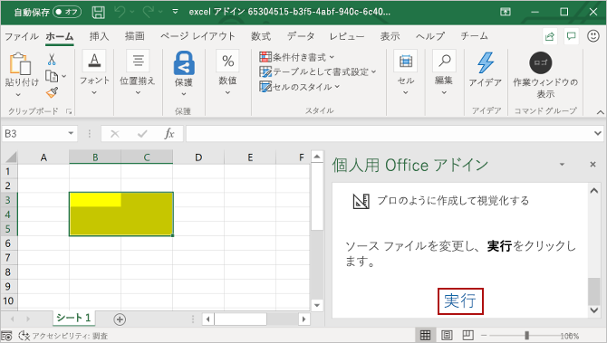

# <a name="build-an-excel-task-pane-add-in-using-angular"></a>Angular を使用して Excel 作業ウィンドウ アドインをビルドする

この記事では、Angular と Excel JavaScript API を使用して Excel 作業ウィンドウ アドインを構築するプロセスについて説明します。

## <a name="prerequisites"></a>前提条件

[!include[Set up requirements](../includes/set-up-dev-environment-beforehand.md)]
[!include[Yeoman generator prerequisites](../includes/quickstart-yo-prerequisites.md)]

## <a name="create-the-add-in-project"></a>アドイン プロジェクトの作成

[!include[Yeoman generator create project guidance](../includes/yo-office-command-guidance.md)]

- **Choose a project type: (プロジェクトの種類を選択)** `Office Add-in Task Pane project using Angular framework`
- **Choose a script type: (スクリプトの種類を選択)** `TypeScript`
- **What would you want to name your add-in?: (アドインの名前を何にしますか)** `My Office Add-in`
- **Which Office client application would you like to support?: (どの Office クライアント アプリケーションをサポートしますか)** `Excel`


ウィザードを完了すると、ジェネレーターによってプロジェクトが作成されて、サポートしているノード コンポーネントがインストールされます。

[!include[Yeoman generator next steps](../includes/yo-office-next-steps.md)]

## <a name="explore-the-project"></a>プロジェクトを確認する

Yeoman ジェネレーターで作成したアドイン プロジェクトには、とても基本的な作業ウィンドウ アドインのサンプル コードが含まれています。 アドイン プロジェクトの主要な構成要素を確認したい場合は、コード エディターでプロジェクトを開き、以下に一覧表示されているファイルを確認します。 アドインを試す準備ができたら、次のセクションに進みます。

- プロジェクトのルート ディレクトリにある **manifest.xml** ファイルで、アドインの機能と設定を定義します。
- **./src/taskpane/app/app.component.html** ファイルには、作業ウィンドウ用の HTML マークアップが含まれています。
- **./src/taskpane/taskpane.css** ファイルには、作業ウィンドウ内のコンテンツに適用される CSS が含まれています。
- **./src/taskpane/app/app.component.ts** ファイルには、作業ウィンドウと Excel の間のやり取りを容易にする Office JavaScript API コードが含まれています。

## <a name="try-it-out"></a>試してみる

1. プロジェクトのルート フォルダーに移動します。

    ```command&nbsp;line
    cd "My Office Add-in"
    ```

2. [!include[Start server section](../includes/quickstart-yo-start-server-excel.md)] 

3. Excel で、**[ホーム]** タブを選択し、リボンの **[作業ウィンドウの表示]** ボタンをクリックして、アドインの作業ウィンドウを開きます。

    

4. ワークシート内で任意のセルの範囲を選択します。

5. 作業ウィンドウの下部で、**[実行]** リンクを選択して、選択範囲の色を黄色に設定します。

    

## <a name="next-steps"></a>次の手順

おめでとうございます! これで Angular を使用して Excel 作業ウィンドウ アドインを作成できました。 次に、Excel アドインの機能の詳細について説明します。Excel アドインのチュートリアルに従って、より複雑なアドインをビルドします。

> [!div class="nextstepaction"]
> [Excel アドインのチュートリアル](../tutorials/excel-tutorial.md)

## <a name="see-also"></a>関連項目

* [Office アドイン プラットフォームの概要](../overview/office-add-ins.md)
* [Office アドインを開発する](../develop/develop-overview.md)
* [Office アドインの Excel JavaScript オブジェクト モデル](../excel/excel-add-ins-core-concepts.md)
* [Excel アドインのコード サンプル](https://developer.microsoft.com/office/gallery/?filterBy=Samples,Excel)
* [Excel JavaScript API リファレンス](../reference/overview/excel-add-ins-reference-overview.md)
