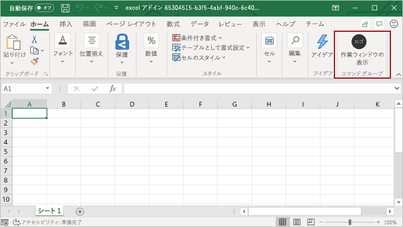

# <a name="build-an-excel-task-pane-add-in-using-angular"></a><span data-ttu-id="266d2-102">Angular を使用して Excel 作業ウィンドウ アドインをビルドする</span><span class="sxs-lookup"><span data-stu-id="266d2-102">Build an Excel add-in using Angular</span></span>

<span data-ttu-id="266d2-103">この記事では、Angular と Excel JavaScript API を使用して Excel 作業ウィンドウ アドインを構築するプロセスについて説明します。</span><span class="sxs-lookup"><span data-stu-id="266d2-103">In this article, you'll walk through the process of building an Excel add-in using Angular and the Excel JavaScript API.</span></span>

## <a name="prerequisites"></a><span data-ttu-id="266d2-104">前提条件</span><span class="sxs-lookup"><span data-stu-id="266d2-104">Prerequisites</span></span>

[!include[Yeoman generator prerequisites](../includes/quickstart-yo-prerequisites.md)]

## <a name="create-the-add-in-project"></a><span data-ttu-id="266d2-105">アドイン プロジェクトの作成</span><span class="sxs-lookup"><span data-stu-id="266d2-105">Create the add-in project</span></span>

1. <span data-ttu-id="266d2-106">Yeoman ジェネレーターを使用して、Excel アドイン プロジェクトを作成します。</span><span class="sxs-lookup"><span data-stu-id="266d2-106">Use the Yeoman generator to create an Excel add-in project.</span></span> <span data-ttu-id="266d2-107">次のコマンドを実行し、以下のプロンプトに応答します。</span><span class="sxs-lookup"><span data-stu-id="266d2-107">Run the following command and then answer the prompts as follows:</span></span>

    ```command&nbsp;line
    yo office
    ```

    - <span data-ttu-id="266d2-108">**Choose a project type: (プロジェクトの種類を選択)** `Office Add-in Task Pane project using Angular framework`</span><span class="sxs-lookup"><span data-stu-id="266d2-108">**Choose a project type:** `Office Add-in Task Pane project using Angular framework`</span></span>
    - <span data-ttu-id="266d2-109">**Choose a script type: (スクリプトの種類を選択)** `TypeScript`</span><span class="sxs-lookup"><span data-stu-id="266d2-109">**Choose a script type:** `TypeScript`</span></span>
    - <span data-ttu-id="266d2-110">**What would you want to name your add-in?: (アドインの名前を何にしますか)**</span><span class="sxs-lookup"><span data-stu-id="266d2-110">**What do you want to name your add-in?**</span></span> `My Office Add-in`
    - <span data-ttu-id="266d2-111">**Which Office client application would you like to support?: (どの Office クライアント アプリケーションをサポートしますか)**</span><span class="sxs-lookup"><span data-stu-id="266d2-111">**Which Office client application would you like to support?**</span></span> `Excel`

    

    <span data-ttu-id="266d2-113">ウィザードを完了すると、ジェネレーターによってプロジェクトが作成されて、サポートしているノード コンポーネントがインストールされます。</span><span class="sxs-lookup"><span data-stu-id="266d2-113">After you complete the wizard, the generator will create the project and install supporting Node components.</span></span>

2. <span data-ttu-id="266d2-114">プロジェクトのルート フォルダーに移動します。</span><span class="sxs-lookup"><span data-stu-id="266d2-114">Navigate to the root folder of the project.</span></span>

    ```command&nbsp;line
    cd "My Office Add-in"
    ```
## <a name="explore-the-project"></a><span data-ttu-id="266d2-115">プロジェクトを確認する</span><span class="sxs-lookup"><span data-stu-id="266d2-115">Explore the project</span></span>

<span data-ttu-id="266d2-116">Yeoman ジェネレーターで作成したアドイン プロジェクトには、とても基本的な作業ウィンドウ アドインのサンプル コードが含まれています。</span><span class="sxs-lookup"><span data-stu-id="266d2-116">The add-in project that you've created with the Yeoman generator contains sample code for a very basic task pane add-in.</span></span> <span data-ttu-id="266d2-117">アドイン プロジェクトの主要な構成要素を確認したい場合は、コード エディターでプロジェクトを開き、以下に一覧表示されているファイルを確認します。</span><span class="sxs-lookup"><span data-stu-id="266d2-117">If you'd like to explore the key components of your add-in project, open the project in your code editor and review the files listed below.</span></span> <span data-ttu-id="266d2-118">アドインを試す準備ができたら、次のセクションに進みます。</span><span class="sxs-lookup"><span data-stu-id="266d2-118">When you're ready to try out your add-in, proceed to the next section.</span></span>

- <span data-ttu-id="266d2-119">プロジェクトのルート ディレクトリにある **manifest.xml** ファイルで、アドインの機能と設定を定義します。</span><span class="sxs-lookup"><span data-stu-id="266d2-119">The **manifest.xml** file in the root directory of the project defines the settings and capabilities of the add-in.</span></span>
- <span data-ttu-id="266d2-120">**./src/taskpane/app/app.component.html** ファイルには、作業ウィンドウ用の HTML マークアップが含まれています。</span><span class="sxs-lookup"><span data-stu-id="266d2-120">The **./src/taskpane/app/app.component.html** file contains the HTML markup for the task pane.</span></span>
- <span data-ttu-id="266d2-121">**./src/taskpane/taskpane.css** ファイルには、作業ウィンドウ内のコンテンツに適用される CSS が含まれています。</span><span class="sxs-lookup"><span data-stu-id="266d2-121">The **./src/taskpane/taskpane.css** file contains the CSS that's applied to content in the task pane.</span></span>
- <span data-ttu-id="266d2-122">**./src/taskpane/app/app.component.ts** ファイルには、作業ウィンドウと Excel の間のやり取りを容易にする Office JavaScript API コードが含まれています。</span><span class="sxs-lookup"><span data-stu-id="266d2-122">The **./src/taskpane/app/app.component.ts** file contains the Office JavaScript API code that facilitates interaction between the task pane and Excel.</span></span>

## <a name="try-it-out"></a><span data-ttu-id="266d2-123">試してみる</span><span class="sxs-lookup"><span data-stu-id="266d2-123">Try it out</span></span>

1. [!include[Start server section](../includes/quickstart-yo-start-server-excel.md)] 

2. <span data-ttu-id="266d2-124">Excel で、**[ホーム]** タブを選択し、リボンの **[作業ウィンドウの表示]** ボタンをクリックして、アドインの作業ウィンドウを開きます。</span><span class="sxs-lookup"><span data-stu-id="266d2-124">In Excel, choose the **Home** tab, and then choose the **Show Taskpane** button in the ribbon to open the add-in task pane.</span></span>

    

3. <span data-ttu-id="266d2-126">ワークシート内で任意のセルの範囲を選択します。</span><span class="sxs-lookup"><span data-stu-id="266d2-126">Select any range of cells in the worksheet.</span></span>

4. <span data-ttu-id="266d2-127">作業ウィンドウの下部で、**[実行]** リンクを選択して、選択範囲の色を黄色に設定します。</span><span class="sxs-lookup"><span data-stu-id="266d2-127">At the bottom of the task pane, choose the **Run** link to set the color of the selected range to yellow.</span></span>

    

## <a name="next-steps"></a><span data-ttu-id="266d2-129">次の手順</span><span class="sxs-lookup"><span data-stu-id="266d2-129">Next steps</span></span>

<span data-ttu-id="266d2-130">おめでとうございます! これで Angular を使用して Excel 作業ウィンドウ アドインを作成できました。</span><span class="sxs-lookup"><span data-stu-id="266d2-130">Congratulations, you've successfully created an Excel add-in using Angular!</span></span> <span data-ttu-id="266d2-131">次に、Excel アドインの機能の詳細について説明します。Excel アドインのチュートリアルに従って、より複雑なアドインをビルドします。</span><span class="sxs-lookup"><span data-stu-id="266d2-131">Congratulations, you've successfully created an Excel add-in using jQuery! Next, learn more about the capabilities of an Excel add-in and build a more complex add-in by following along with the Excel add-in tutorial.</span></span>

> [!div class="nextstepaction"]
> [<span data-ttu-id="266d2-132">Excel アドインのチュートリアル</span><span class="sxs-lookup"><span data-stu-id="266d2-132">Excel add-in tutorial</span></span>](../tutorials/excel-tutorial.md)

## <a name="see-also"></a><span data-ttu-id="266d2-133">関連項目</span><span class="sxs-lookup"><span data-stu-id="266d2-133">See also</span></span>

* [<span data-ttu-id="266d2-134">Excel アドインのチュートリアル</span><span class="sxs-lookup"><span data-stu-id="266d2-134">Excel add-in tutorial</span></span>](../tutorials/excel-tutorial-create-table.md)
* [<span data-ttu-id="266d2-135">Excel JavaScript API を使用した基本的なプログラミングの概念</span><span class="sxs-lookup"><span data-stu-id="266d2-135">Fundamental programming concepts with the Excel JavaScript API</span></span>](../excel/excel-add-ins-core-concepts.md)
* [<span data-ttu-id="266d2-136">Excel アドインのコード サンプル</span><span class="sxs-lookup"><span data-stu-id="266d2-136">Excel add-in code samples</span></span>](https://developer.microsoft.com/office/gallery/?filterBy=Samples,Excel)
* [<span data-ttu-id="266d2-137">Excel JavaScript API リファレンス</span><span class="sxs-lookup"><span data-stu-id="266d2-137">Excel JavaScript API reference</span></span>](/office/dev/add-ins/reference/overview/excel-add-ins-reference-overview)
