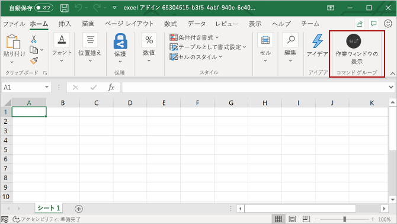

# <a name="build-an-excel-task-pane-add-in"></a>Excel 作業ウィンドウ アドインを作成する

この記事では、Excel の作業ペインアドインを作成するプロセスについて説明します。

## <a name="create-the-add-in"></a>アドインを作成する 

[!include[Choose your editor](../includes/quickstart-choose-editor.md)]
# <a name="yeoman-generator"></a>[Yeoman ジェネレーター](#tab/yeomangenerator)

[!include[Redirect to the single sign-on (SSO) quick start](../includes/sso-quickstart-reference.md)]

## <a name="prerequisites"></a>前提条件

[!include[Set up requirements](../includes/set-up-dev-environment-beforehand.md)]
[!include[Yeoman generator prerequisites](../includes/quickstart-yo-prerequisites.md)]

### <a name="create-the-add-in-project"></a>アドイン プロジェクトの作成

[!include[Yeoman generator create project guidance](../includes/yo-office-command-guidance.md)]

- **Choose a project type: (プロジェクトの種類を選択)** `Office Add-in Task Pane project`
- **Choose a script type: (スクリプトの種類を選択)** `Javascript`
- **What would you want to name your add-in?: (アドインの名前を何にしますか)** `My Office Add-in`
- **Which Office client application would you like to support?: (どの Office クライアント アプリケーションをサポートしますか)** `Excel`


ウィザードを完了すると、ジェネレーターによってプロジェクトが作成されて、サポートしているノード コンポーネントがインストールされます。

[!include[Yeoman generator next steps](../includes/yo-office-next-steps.md)]

### <a name="explore-the-project"></a>プロジェクトを確認する

[!include[Yeoman generator add-in project components](../includes/yo-task-pane-project-components-js.md)]

### <a name="try-it-out"></a>試してみる

1. プロジェクトのルート フォルダーに移動します。

    ```command&nbsp;line
    cd "My Office Add-in"
    ```

2. [!include[Start server section](../includes/quickstart-yo-start-server-excel.md)]

3. Excel で、**[ホーム]** タブを選択し、リボンの **[作業ウィンドウの表示]** ボタンをクリックして、アドインの作業ウィンドウを開きます。

    

4. ワークシート内で任意のセルの範囲を選択します。

5. 作業ウィンドウの下部で、**[実行]** リンクを選択して、選択範囲の色を黄色に設定します。

    ![[実行] ボタンがある Excel アドイン](../images/excel-quickstart-addin-3c.png)

### <a name="next-steps"></a>次の手順

おめでとうございます! これで Excel 作業ウィンドウ アドインを作成できました。 次に、Excel アドインの機能の詳細説明と、より複雑なアドインを作成する方法について、「[Excel アドインのチュートリアル](../tutorials/excel-tutorial.md)」をご覧ください。

# <a name="visual-studio"></a>[Visual Studio](#tab/visualstudio)

### <a name="prerequisites"></a>前提条件

[!include[Quick Start prerequisites](../includes/quickstart-vs-prerequisites.md)]

### <a name="create-the-add-in-project"></a>アドイン プロジェクトの作成

1. Visual Studio で、[**新しいプロジェクトの作成**] を選択します。

2. 検索ボックスを使用して、**アドイン**と入力します。 [**Excel Web アドイン**] を選択し、[**次へ**] を選択します。

3. プロジェクトに名前を付けて、[**作成**] を選択します。

4. **[Office アドインの作成]** ダイアログ ウィンドウで、**[新機能を Excel に追加する]** を選択してから、**[完了]** を選択してプロジェクトを作成します。

5. Visual Studio によってソリューションとその 2 つのプロジェクトが作成され、**ソリューション エクスプローラー**に表示されます。**Home.html** ファイルが Visual Studio で開かれます。

### <a name="explore-the-visual-studio-solution"></a>Visual Studio ソリューションについて理解する

[!include[Description of Visual Studio projects](../includes/quickstart-vs-solution.md)]

### <a name="update-the-code"></a>コードを更新する

1. **Home.html** では、アドインの作業ウィンドウにレンダリングされる HTML を指定します。 **Home.html** で、`<body>` 要素を次のマークアップに置き換えて、ファイルを保存します。

    ```html
    <body class="ms-font-m ms-welcome">
        <div id="content-header">
            <div class="padding">
                <h1>Welcome</h1>
            </div>
        </div>
        <div id="content-main">
            <div class="padding">
                <p>Choose the button below to set the color of the selected range to green.</p>
                <br />
                <h3>Try it out</h3>
                <button class="ms-Button" id="set-color">Set color</button>
            </div>
        </div>
    </body>
    ```

2. Web アプリケーション プロジェクトのルートにあるファイル **Home.js** を開きます。 このファイルは、アドイン用のスクリプトを指定します。 すべての内容を次のコードに置き換え、ファイルを保存します。

    ```js
    'use strict';

    (function () {

        Office.onReady(function() {
            // Office is ready
            $(document).ready(function () {
                // The document is ready
                $('#set-color').click(setColor);
            });
        });

        function setColor() {
            Excel.run(function (context) {
                var range = context.workbook.getSelectedRange();
                range.format.fill.color = 'green';

                return context.sync();
            }).catch(function (error) {
                console.log("Error: " + error);
                if (error instanceof OfficeExtension.Error) {
                    console.log("Debug info: " + JSON.stringify(error.debugInfo));
                }
            });
        }
    })();
    ```

3. Web アプリケーション プロジェクトのルートにあるファイル **Home.css** を開きます。 このファイルは、アドイン用のユーザー設定のスタイルを指定します。 すべての内容を次のコードに置き換え、ファイルを保存します。

    ```css
    #content-header {
        background: #2a8dd4;
        color: #fff;
        position: absolute;
        top: 0;
        left: 0;
        width: 100%;
        height: 80px;
        overflow: hidden;
    }

    #content-main {
        background: #fff;
        position: fixed;
        top: 80px;
        left: 0;
        right: 0;
        bottom: 0;
        overflow: auto;
    }

    .padding {
        padding: 15px;
    }
    ```

### <a name="update-the-manifest"></a>マニフェストを更新する

1. アドイン プロジェクト内の XML マニフェスト ファイルを開きます。 このファイルは、アドインの設定と機能を定義します。

2. `ProviderName` 要素にはプレースホルダー値が含まれています。 それを自分の名前に置き換えます。

3. `DefaultValue` 要素の `DisplayName` 属性にはプレースホルダー値が含まれています。 これは、**My Office Add-in** に置き換えてください。

4. `DefaultValue` 要素の `Description` 属性にはプレースホルダー値が含まれています。 これは、**A task pane add-in for Excel** に置き換えてください。

5. ファイルを保存します。

    ```xml
    ...
    <ProviderName>John Doe</ProviderName>
    <DefaultLocale>en-US</DefaultLocale>
    <!-- The display name of your add-in. Used on the store and various places of the Office UI such as the add-ins dialog. -->
    <DisplayName DefaultValue="My Office Add-in" />
    <Description DefaultValue="A task pane add-in for Excel"/>
    ...
    ```

### <a name="try-it-out"></a>試してみる

1. Visual Studio を使用して、新しく作成した Excel アドインをテストします。そのために、**F5** キーを押すか [**開始**] ボタンをクリックして、リボンに [**作業ウィンドウの表示**] アドイン ボタンが表示された Excel を起動します。 アドインは IIS 上でローカルにホストされます。 証明書を信頼するように求められた場合は、アドインが Office アプリケーションに接続できるように許可してください。

2. Excel で、**[ホーム]** タブを選択し、リボンの **[作業ウィンドウの表示]** ボタンをクリックして、アドインの作業ウィンドウを開きます。

    ![Excel アドインの [作業ウィンドウの表示] ボタン](../images/excel-quickstart-addin-2a.png)

3. ワークシート内で任意のセルの範囲を選択します。

4. 作業ウィンドウで、**[色の設定]** ボタンをクリックして、選択範囲の色を緑に設定します。

    

[!include[Console tool note](../includes/console-tool-note.md)]

### <a name="next-steps"></a>次の手順

おめでとうございます! これで Excel 作業ウィンドウ アドインを作成できました。 次に、「[Visual Studio を使用して Office アドインを開発する](../develop/develop-add-ins-visual-studio.md)」を参照してください。

---

## <a name="see-also"></a>関連項目

* [Office アドイン プラットフォームの概要](../overview/office-add-ins.md)
* [Office アドインを開発する](../develop/develop-overview.md)
* [Office アドインの Excel JavaScript オブジェクト モデル](../excel/excel-add-ins-core-concepts.md)
* [Excel アドインのコード サンプル](https://developer.microsoft.com/office/gallery/?filterBy=Samples,Excel)
* [Excel JavaScript API リファレンス](../reference/overview/excel-add-ins-reference-overview.md)
