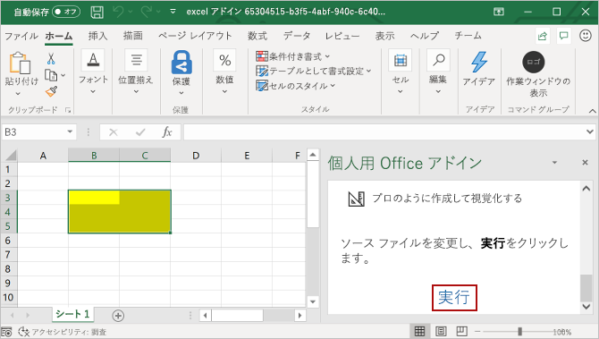

# <a name="build-an-excel-task-pane-add-in"></a><span data-ttu-id="90865-103">Excel 作業ウィンドウ アドインを作成する</span><span class="sxs-lookup"><span data-stu-id="90865-103">Build an Excel task pane add-in</span></span>

<span data-ttu-id="90865-104">この記事では、Excel の作業ペインアドインを作成するプロセスについて説明します。</span><span class="sxs-lookup"><span data-stu-id="90865-104">In this article, you'll walk through the process of building an Excel task pane add-in.</span></span>

## <a name="create-the-add-in"></a><span data-ttu-id="90865-105">アドインを作成する</span><span class="sxs-lookup"><span data-stu-id="90865-105">Create the add-in</span></span>

[!include[Choose your editor](../includes/quickstart-choose-editor.md)]

# <a name="yeoman-generator"></a>[<span data-ttu-id="90865-106">Yeoman ジェネレーター</span><span class="sxs-lookup"><span data-stu-id="90865-106">Yeoman generator</span></span>](#tab/yeomangenerator)

[!include[Redirect to the single sign-on (SSO) quick start](../includes/sso-quickstart-reference.md)]

### <a name="prerequisites"></a><span data-ttu-id="90865-107">前提条件</span><span class="sxs-lookup"><span data-stu-id="90865-107">Prerequisites</span></span>

[!include[Yeoman generator prerequisites](../includes/quickstart-yo-prerequisites.md)]

### <a name="create-the-add-in-project"></a><span data-ttu-id="90865-108">アドイン プロジェクトの作成</span><span class="sxs-lookup"><span data-stu-id="90865-108">Create the add-in project</span></span>

[!include[Yeoman generator create project guidance](../includes/yo-office-command-guidance.md)]

- <span data-ttu-id="90865-109">**Choose a project type: (プロジェクトの種類を選択)** `Office Add-in Task Pane project`</span><span class="sxs-lookup"><span data-stu-id="90865-109">**Choose a project type:** `Office Add-in Task Pane project`</span></span>
- <span data-ttu-id="90865-110">**Choose a script type: (スクリプトの種類を選択)** `Javascript`</span><span class="sxs-lookup"><span data-stu-id="90865-110">**Choose a script type:** `Javascript`</span></span>
- <span data-ttu-id="90865-111">**What would you want to name your add-in?: (アドインの名前を何にしますか)**</span><span class="sxs-lookup"><span data-stu-id="90865-111">**What do you want to name your add-in?**</span></span> `My Office Add-in`
- <span data-ttu-id="90865-112">**Which Office client application would you like to support?: (どの Office クライアント アプリケーションをサポートしますか)**</span><span class="sxs-lookup"><span data-stu-id="90865-112">**Which Office client application would you like to support?**</span></span> `Excel`


<span data-ttu-id="90865-114">ウィザードを完了すると、ジェネレーターによってプロジェクトが作成されて、サポートしているノード コンポーネントがインストールされます。</span><span class="sxs-lookup"><span data-stu-id="90865-114">After you complete the wizard, the generator creates the project and installs supporting Node components.</span></span>

[!include[Yeoman generator next steps](../includes/yo-office-next-steps.md)]

### <a name="explore-the-project"></a><span data-ttu-id="90865-115">プロジェクトを確認する</span><span class="sxs-lookup"><span data-stu-id="90865-115">Explore the project</span></span>

[!include[Yeoman generator add-in project components](../includes/yo-task-pane-project-components-js.md)]

### <a name="try-it-out"></a><span data-ttu-id="90865-116">試してみる</span><span class="sxs-lookup"><span data-stu-id="90865-116">Try it out</span></span>

1. <span data-ttu-id="90865-117">プロジェクトのルート フォルダーに移動します。</span><span class="sxs-lookup"><span data-stu-id="90865-117">Navigate to the root folder of the project.</span></span>

    ```command&nbsp;line
    cd "My Office Add-in"
    ```

2. [!include[Start server section](../includes/quickstart-yo-start-server-excel.md)]

3. <span data-ttu-id="90865-118">Excel で、**[ホーム]** タブを選択し、リボンの **[作業ウィンドウの表示]** ボタンをクリックして、アドインの作業ウィンドウを開きます。</span><span class="sxs-lookup"><span data-stu-id="90865-118">In Excel, choose the **Home** tab, and then choose the **Show Taskpane** button in the ribbon to open the add-in task pane.</span></span>

    

4. <span data-ttu-id="90865-120">ワークシート内で任意のセルの範囲を選択します。</span><span class="sxs-lookup"><span data-stu-id="90865-120">Select any range of cells in the worksheet.</span></span>

5. <span data-ttu-id="90865-121">作業ウィンドウの下部で、**[実行]** リンクを選択して、選択範囲の色を黄色に設定します。</span><span class="sxs-lookup"><span data-stu-id="90865-121">At the bottom of the task pane, choose the **Run** link to set the color of the selected range to yellow.</span></span>

    

### <a name="next-steps"></a><span data-ttu-id="90865-123">次の手順</span><span class="sxs-lookup"><span data-stu-id="90865-123">Next steps</span></span>

<span data-ttu-id="90865-124">おめでとうございます! これで Excel 作業ウィンドウ アドインを作成できました。</span><span class="sxs-lookup"><span data-stu-id="90865-124">Congratulations, you've successfully created an Excel task pane add-in!</span></span> <span data-ttu-id="90865-125">次に、Excel アドインの機能の詳細説明と、より複雑なアドインを作成する方法について、「[Excel アドインのチュートリアル](../tutorials/excel-tutorial.md)」をご覧ください。</span><span class="sxs-lookup"><span data-stu-id="90865-125">Next, learn more about the capabilities of an Excel add-in and build a more complex add-in by following along with the [Excel add-in tutorial](../tutorials/excel-tutorial.md).</span></span>

# <a name="visual-studio"></a>[<span data-ttu-id="90865-126">Visual Studio</span><span class="sxs-lookup"><span data-stu-id="90865-126">Visual Studio</span></span>](#tab/visualstudio)

### <a name="prerequisites"></a><span data-ttu-id="90865-127">前提条件</span><span class="sxs-lookup"><span data-stu-id="90865-127">Prerequisites</span></span>

[!include[Quick Start prerequisites](../includes/quickstart-vs-prerequisites.md)]

### <a name="create-the-add-in-project"></a><span data-ttu-id="90865-128">アドイン プロジェクトの作成</span><span class="sxs-lookup"><span data-stu-id="90865-128">Create the add-in project</span></span>

1. <span data-ttu-id="90865-129">Visual Studio で、[**新しいプロジェクトの作成**] を選択します。</span><span class="sxs-lookup"><span data-stu-id="90865-129">In Visual Studio, choose **Create a new project**.</span></span>

2. <span data-ttu-id="90865-130">検索ボックスを使用して、**アドイン**と入力します。</span><span class="sxs-lookup"><span data-stu-id="90865-130">Using the search box, enter **add-in**.</span></span> <span data-ttu-id="90865-131">[**Excel Web アドイン**] を選択し、[**次へ**] を選択します。</span><span class="sxs-lookup"><span data-stu-id="90865-131">Choose **Excel Web Add-in**, then select **Next**.</span></span>

3. <span data-ttu-id="90865-132">プロジェクトに名前を付けて、[**作成**] を選択します。</span><span class="sxs-lookup"><span data-stu-id="90865-132">Name your project and select **Create**.</span></span>

4. <span data-ttu-id="90865-133">**[Office アドインの作成]** ダイアログ ウィンドウで、**[新機能を Excel に追加する]** を選択してから、**[完了]** を選択してプロジェクトを作成します。</span><span class="sxs-lookup"><span data-stu-id="90865-133">In the **Create Office Add-in** dialog window, choose **Add new functionalities to Excel**, and then choose **Finish** to create the project.</span></span>

5. <span data-ttu-id="90865-p103">Visual Studio によってソリューションとその 2 つのプロジェクトが作成され、**ソリューション エクスプローラー**に表示されます。**Home.html** ファイルが Visual Studio で開かれます。</span><span class="sxs-lookup"><span data-stu-id="90865-p103">Visual Studio creates a solution and its two projects appear in **Solution Explorer**. The **Home.html** file opens in Visual Studio.</span></span>

### <a name="explore-the-visual-studio-solution"></a><span data-ttu-id="90865-136">Visual Studio ソリューションについて理解する</span><span class="sxs-lookup"><span data-stu-id="90865-136">Explore the Visual Studio solution</span></span>

[!include[Description of Visual Studio projects](../includes/quickstart-vs-solution.md)]

### <a name="update-the-code"></a><span data-ttu-id="90865-137">コードを更新する</span><span class="sxs-lookup"><span data-stu-id="90865-137">Update the code</span></span>

1. <span data-ttu-id="90865-p104">**Home.html** では、アドインの作業ウィンドウにレンダリングされる HTML を指定します。 **Home.html** で、`<body>` 要素を次のマークアップに置き換えて、ファイルを保存します。</span><span class="sxs-lookup"><span data-stu-id="90865-p104">**Home.html** specifies the HTML that will be rendered in the add-in's task pane. In **Home.html**, replace the `<body>` element with the following markup and save the file.</span></span>

    ```html
    <body class="ms-font-m ms-welcome">
        <div id="content-header">
            <div class="padding">
                <h1>Welcome</h1>
            </div>
        </div>
        <div id="content-main">
            <div class="padding">
                <p>Choose the button below to set the color of the selected range to green.</p>
                <br />
                <h3>Try it out</h3>
                <button class="ms-Button" id="set-color">Set color</button>
            </div>
        </div>
    </body>
    ```

2. <span data-ttu-id="90865-p105">Web アプリケーション プロジェクトのルートにあるファイル **Home.js** を開きます。 このファイルは、アドイン用のスクリプトを指定します。 すべての内容を次のコードに置き換え、ファイルを保存します。</span><span class="sxs-lookup"><span data-stu-id="90865-p105">Open the file **Home.js** in the root of the web application project. This file specifies the script for the add-in. Replace the entire contents with the following code and save the file.</span></span>

    ```js
    'use strict';

    (function () {

        Office.onReady(function() {
            // Office is ready
            $(document).ready(function () {
                // The document is ready
                $('#set-color').click(setColor);
            });
        });

        function setColor() {
            Excel.run(function (context) {
                var range = context.workbook.getSelectedRange();
                range.format.fill.color = 'green';

                return context.sync();
            }).catch(function (error) {
                console.log("Error: " + error);
                if (error instanceof OfficeExtension.Error) {
                    console.log("Debug info: " + JSON.stringify(error.debugInfo));
                }
            });
        }
    })();
    ```

3. <span data-ttu-id="90865-p106">Web アプリケーション プロジェクトのルートにあるファイル **Home.css** を開きます。 このファイルは、アドイン用のユーザー設定のスタイルを指定します。 すべての内容を次のコードに置き換え、ファイルを保存します。</span><span class="sxs-lookup"><span data-stu-id="90865-p106">Open the file **Home.css** in the root of the web application project. This file specifies the custom styles for the add-in. Replace the entire contents with the following code and save the file.</span></span>

    ```css
    #content-header {
        background: #2a8dd4;
        color: #fff;
        position: absolute;
        top: 0;
        left: 0;
        width: 100%;
        height: 80px;
        overflow: hidden;
    }

    #content-main {
        background: #fff;
        position: fixed;
        top: 80px;
        left: 0;
        right: 0;
        bottom: 0;
        overflow: auto;
    }

    .padding {
        padding: 15px;
    }
    ```

### <a name="update-the-manifest"></a><span data-ttu-id="90865-146">マニフェストを更新する</span><span class="sxs-lookup"><span data-stu-id="90865-146">Update the manifest</span></span>

1. <span data-ttu-id="90865-147">アドイン プロジェクト内の XML マニフェスト ファイルを開きます。</span><span class="sxs-lookup"><span data-stu-id="90865-147">Open the XML manifest file in the add-in project.</span></span> <span data-ttu-id="90865-148">このファイルは、アドインの設定と機能を定義します。</span><span class="sxs-lookup"><span data-stu-id="90865-148">This file defines the add-in's settings and capabilities.</span></span>

2. <span data-ttu-id="90865-p108">`ProviderName` 要素にはプレースホルダー値が含まれています。 それを自分の名前に置き換えます。</span><span class="sxs-lookup"><span data-stu-id="90865-p108">The `ProviderName` element has a placeholder value. Replace it with your name.</span></span>

3. <span data-ttu-id="90865-p109">`DefaultValue` 要素の `DisplayName` 属性にはプレースホルダー値が含まれています。 これは、**My Office Add-in** に置き換えてください。</span><span class="sxs-lookup"><span data-stu-id="90865-p109">The `DefaultValue` attribute of the `DisplayName` element has a placeholder. Replace it with **My Office Add-in**.</span></span>

4. <span data-ttu-id="90865-p110">`DefaultValue` 要素の `Description` 属性にはプレースホルダー値が含まれています。 これは、**A task pane add-in for Excel** に置き換えてください。</span><span class="sxs-lookup"><span data-stu-id="90865-p110">The `DefaultValue` attribute of the `Description` element has a placeholder. Replace it with **A task pane add-in for Excel**.</span></span>

5. <span data-ttu-id="90865-155">ファイルを保存します。</span><span class="sxs-lookup"><span data-stu-id="90865-155">Save the file.</span></span>

    ```xml
    ...
    <ProviderName>John Doe</ProviderName>
    <DefaultLocale>en-US</DefaultLocale>
    <!-- The display name of your add-in. Used on the store and various places of the Office UI such as the add-ins dialog. -->
    <DisplayName DefaultValue="My Office Add-in" />
    <Description DefaultValue="A task pane add-in for Excel"/>
    ...
    ```

### <a name="try-it-out"></a><span data-ttu-id="90865-156">試してみる</span><span class="sxs-lookup"><span data-stu-id="90865-156">Try it out</span></span>

1. <span data-ttu-id="90865-157">Visual Studio を使用して、新しく作成した Excel アドインをテストします。そのために、**F5** キーを押すか [**開始**] ボタンをクリックして、リボンに [**作業ウィンドウの表示**] アドイン ボタンが表示された Excel を起動します。</span><span class="sxs-lookup"><span data-stu-id="90865-157">Using Visual Studio, test the newly created Excel add-in by pressing **F5** or choosing the **Start** button to launch Excel with the **Show Taskpane** add-in button displayed in the ribbon.</span></span> <span data-ttu-id="90865-158">アドインは IIS 上でローカルにホストされます。</span><span class="sxs-lookup"><span data-stu-id="90865-158">The add-in will be hosted locally on IIS.</span></span> <span data-ttu-id="90865-159">証明書を信頼するように求められた場合は、アドインがホストに接続できるように許可してください。</span><span class="sxs-lookup"><span data-stu-id="90865-159">If you are asked to trust a certificate, do so to allow the add-in to connect to its host.</span></span>

2. <span data-ttu-id="90865-160">Excel で、**[ホーム]** タブを選択し、リボンの **[作業ウィンドウの表示]** ボタンをクリックして、アドインの作業ウィンドウを開きます。</span><span class="sxs-lookup"><span data-stu-id="90865-160">In Excel, choose the **Home** tab, and then choose the **Show Taskpane** button in the ribbon to open the add-in task pane.</span></span>

    

3. <span data-ttu-id="90865-162">ワークシート内で任意のセルの範囲を選択します。</span><span class="sxs-lookup"><span data-stu-id="90865-162">Select any range of cells in the worksheet.</span></span>

4. <span data-ttu-id="90865-163">作業ウィンドウで、**[色の設定]** ボタンをクリックして、選択範囲の色を緑に設定します。</span><span class="sxs-lookup"><span data-stu-id="90865-163">In the task pane, choose the **Set color** button to set the color of the selected range to green.</span></span>

    

[!include[Console tool note](../includes/console-tool-note.md)]

### <a name="next-steps"></a><span data-ttu-id="90865-165">次の手順</span><span class="sxs-lookup"><span data-stu-id="90865-165">Next steps</span></span>

<span data-ttu-id="90865-166">おめでとうございます! これで Excel 作業ウィンドウ アドインを作成できました。</span><span class="sxs-lookup"><span data-stu-id="90865-166">Congratulations, you've successfully created an Excel task pane add-in!</span></span> <span data-ttu-id="90865-167">次に、「[Visual Studio を使用して Office アドインを開発する](../develop/develop-add-ins-visual-studio.md)」を参照してください。</span><span class="sxs-lookup"><span data-stu-id="90865-167">Next, learn more about [developing Office Add-ins with Visual Studio](../develop/develop-add-ins-visual-studio.md).</span></span>

---

## <a name="see-also"></a><span data-ttu-id="90865-168">関連項目</span><span class="sxs-lookup"><span data-stu-id="90865-168">See also</span></span>

* [<span data-ttu-id="90865-169">Office アドイン プラットフォームの概要</span><span class="sxs-lookup"><span data-stu-id="90865-169">Office Add-ins platform overview</span></span>](../overview/office-add-ins.md)
* [<span data-ttu-id="90865-170">Office アドインを構築する</span><span class="sxs-lookup"><span data-stu-id="90865-170">Building Office Add-ins</span></span>](../overview/office-add-ins-fundamentals.md)
* [<span data-ttu-id="90865-171">Office アドインを開発する</span><span class="sxs-lookup"><span data-stu-id="90865-171">Develop Office Add-ins</span></span>](../develop/develop-overview.md)
* [<span data-ttu-id="90865-172">Excel JavaScript API を使用した基本的なプログラミングの概念</span><span class="sxs-lookup"><span data-stu-id="90865-172">Fundamental programming concepts with the Excel JavaScript API</span></span>](../excel/excel-add-ins-core-concepts.md)
* [<span data-ttu-id="90865-173">Excel アドインのコード サンプル</span><span class="sxs-lookup"><span data-stu-id="90865-173">Excel add-in code samples</span></span>](https://developer.microsoft.com/office/gallery/?filterBy=Samples,Excel)
* [<span data-ttu-id="90865-174">Excel JavaScript API リファレンス</span><span class="sxs-lookup"><span data-stu-id="90865-174">Excel JavaScript API reference</span></span>](../reference/overview/excel-add-ins-reference-overview.md)
