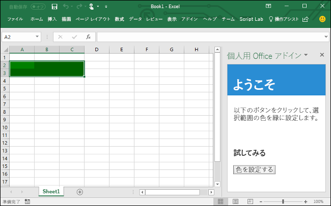

# <a name="build-an-excel-task-pane-add-in-using-vue"></a><span data-ttu-id="0391a-103">Vue を使用して Excel 作業ウィンドウ アドインを作成する</span><span class="sxs-lookup"><span data-stu-id="0391a-103">Build an Excel task pane add-in using Vue</span></span>

<span data-ttu-id="0391a-104">この記事では、Vue と Excel JavaScript API を使用して Excel 作業ウィンドウ アドインを構築するプロセスについて説明します。</span><span class="sxs-lookup"><span data-stu-id="0391a-104">In this article, you'll walk through the process of building an Excel task pane add-in using Vue and the Excel JavaScript API.</span></span>

## <a name="prerequisites"></a><span data-ttu-id="0391a-105">前提条件</span><span class="sxs-lookup"><span data-stu-id="0391a-105">Prerequisites</span></span>

[!include[Set up requirements](../includes/set-up-dev-environment-beforehand.md)]
[!include[Yeoman generator prerequisites](../includes/quickstart-yo-prerequisites.md)]

- <span data-ttu-id="0391a-106">[Vue CLI](https://cli.vuejs.org/) をグローバルにインストールします。</span><span class="sxs-lookup"><span data-stu-id="0391a-106">Install the [Vue CLI](https://cli.vuejs.org/) globally.</span></span>

  ```command&nbsp;line
  npm install -g @vue/cli
  ```

## <a name="generate-a-new-vue-app"></a><span data-ttu-id="0391a-107">新しい Vue アプリの生成</span><span class="sxs-lookup"><span data-stu-id="0391a-107">Generate a new Vue app</span></span>

<span data-ttu-id="0391a-p101">Vue CLI を使用して新しい Vue アプリを生成します。 端末から次のコマンドを実行します。</span><span class="sxs-lookup"><span data-stu-id="0391a-p101">Use the Vue CLI to generate a new Vue app. From the terminal, run the following command.</span></span>

```command&nbsp;line
vue create my-add-in
```

<span data-ttu-id="0391a-110">次に、「Vue 3」の `Default` プリセットを選択します (お好みで「Vue 2」を選択している場合があります)。</span><span class="sxs-lookup"><span data-stu-id="0391a-110">Then select the `Default` preset for "Vue 3" (you may choose to use "Vue 2" if you'd prefer).</span></span>

## <a name="generate-the-manifest-file"></a><span data-ttu-id="0391a-111">マニフェスト ファイルを生成する</span><span class="sxs-lookup"><span data-stu-id="0391a-111">Generate the manifest file</span></span>

<span data-ttu-id="0391a-112">各アドインには、設定と機能を定義するマニフェスト ファイルが必要です。</span><span class="sxs-lookup"><span data-stu-id="0391a-112">Each add-in requires a manifest file to define its settings and capabilities.</span></span>

1. <span data-ttu-id="0391a-113">アプリ フォルダーに移動します。</span><span class="sxs-lookup"><span data-stu-id="0391a-113">Navigate to your app folder.</span></span>

    ```command&nbsp;line
    cd my-add-in
    ```

2. <span data-ttu-id="0391a-114">以下のコマンドを実行し、Yeoman ジェネレーター使用してアドインのマニフェスト ファイルを生成します。</span><span class="sxs-lookup"><span data-stu-id="0391a-114">Use the Yeoman generator to generate the manifest file for your add-in by running the following command:</span></span>

    ```command&nbsp;line
    yo office
    ```

    > [!NOTE]
    > <span data-ttu-id="0391a-115">`yo office`コマンドを実行すると、Yeoman のデータ収集ポリシーと Office アドイン CLI ツールに関するプロンプトが表示される場合があります。</span><span class="sxs-lookup"><span data-stu-id="0391a-115">When you run the `yo office` command, you may receive prompts about the data collection policies of Yeoman and the Office Add-in CLI tools.</span></span> <span data-ttu-id="0391a-116">提供された情報を使用して、必要に応じてプロンプトに応答します。</span><span class="sxs-lookup"><span data-stu-id="0391a-116">Use the information that's provided to respond to the prompts as you see fit.</span></span> <span data-ttu-id="0391a-117">2 番目のプロンプトに対して [**終了**] を選択した場合、アドイン プロジェクトを作成する準備ができたら`yo office`コマンドを再度実行する必要があります。</span><span class="sxs-lookup"><span data-stu-id="0391a-117">If you choose **Exit** in response to the second prompt, you'll need to run the `yo office` command again when you're ready to create your add-in project.</span></span>

    <span data-ttu-id="0391a-118">プロンプトが表示されたら、以下の情報を入力してアドイン プロジェクトを作成します。</span><span class="sxs-lookup"><span data-stu-id="0391a-118">When prompted, provide the following information to create your add-in project:</span></span>

    - <span data-ttu-id="0391a-119">**Choose a project type: (プロジェクトの種類を選択)** `Office Add-in project containing the manifest only`</span><span class="sxs-lookup"><span data-stu-id="0391a-119">**Choose a project type:** `Office Add-in project containing the manifest only`</span></span>
    - <span data-ttu-id="0391a-120">**What would you want to name your add-in?: (アドインの名前を何にしますか)**</span><span class="sxs-lookup"><span data-stu-id="0391a-120">**What do you want to name your add-in?**</span></span> `My Office Add-in`
    - <span data-ttu-id="0391a-121">**Which Office client application would you like to support?: (どの Office クライアント アプリケーションをサポートしますか)**</span><span class="sxs-lookup"><span data-stu-id="0391a-121">**Which Office client application would you like to support?**</span></span> `Excel`

    

<span data-ttu-id="0391a-123">ウィザードを完了すると、`My Office Add-in`フォルダーが`manifest.xml`ファイルを含んで作成されます。</span><span class="sxs-lookup"><span data-stu-id="0391a-123">After you complete the wizard, it creates a `My Office Add-in` folder, which contains a `manifest.xml` file.</span></span> <span data-ttu-id="0391a-124">マニフェストを使用して、クイック スタートの最後にアドインをサイドロードおよびテストします。</span><span class="sxs-lookup"><span data-stu-id="0391a-124">You will use the manifest to sideload and test your add-in at the end of the quick start.</span></span>

> [!TIP]
> <span data-ttu-id="0391a-125">アドイン プロジェクトの作成後に Yeoman ジェネレーターが提供する *次の手順* ガイダンスは無視できます。</span><span class="sxs-lookup"><span data-stu-id="0391a-125">You can ignore the *next steps* guidance that the Yeoman generator provides after the add-in project's been created.</span></span> <span data-ttu-id="0391a-126">この記事中の詳しい手順は、このチュートリアルを完了するために必要なすべてのガイダンスを提供します。</span><span class="sxs-lookup"><span data-stu-id="0391a-126">The step-by-step instructions within this article provide all of the guidance you'll need to complete this tutorial.</span></span>

## <a name="secure-the-app"></a><span data-ttu-id="0391a-127">アプリをセキュリティ保護する</span><span class="sxs-lookup"><span data-stu-id="0391a-127">Secure the app</span></span>

[!include[HTTPS guidance](../includes/https-guidance.md)]

1. <span data-ttu-id="0391a-128">アプリで HTTPS を有効にするには、Vue プロジェクトのルート フォルダーに次の内容で `vue.config.js` ファイルを作成します。</span><span class="sxs-lookup"><span data-stu-id="0391a-128">To enable HTTPS for your app, create a `vue.config.js` file in the root folder of the Vue project with the following contents:</span></span>

    ```js
    var fs = require("fs");
    var path = require("path");
    var homedir = require('os').homedir()
  
    module.exports = {
      devServer: {
        port: 3000,
        https: true,
        key: fs.readFileSync(path.resolve(`${homedir}/.office-addin-dev-certs/localhost.key`)),
        cert: fs.readFileSync(path.resolve(`${homedir}/.office-addin-dev-certs/localhost.crt`)),
        ca: fs.readFileSync(path.resolve(`${homedir}/.office-addin-dev-certs/ca.crt`))
      }
    }
    ```

2. <span data-ttu-id="0391a-129">端末から次のコマンドを実行して、アドインの証明書をインストールします。</span><span class="sxs-lookup"><span data-stu-id="0391a-129">From the terminal, run the following command to install the add-in's certificates.</span></span>

   ```command&nbsp;line
   npx office-addin-dev-certs install
   ```

## <a name="update-the-app"></a><span data-ttu-id="0391a-130">アプリを更新する</span><span class="sxs-lookup"><span data-stu-id="0391a-130">Update the app</span></span>

1. <span data-ttu-id="0391a-131">`public/index.html` ファイルを開き、`</head>` タグの直前に次の `<script>` タグを追加します。</span><span class="sxs-lookup"><span data-stu-id="0391a-131">Open the `public/index.html` file and add the following `<script>` tag immediately before the `</head>` tag:</span></span>

   ```html
   <script src="https://appsforoffice.microsoft.com/lib/1/hosted/office.js"></script>
   ```

2. <span data-ttu-id="0391a-132">`src/main.js` を開き、内容を次のコードで置き換えます。</span><span class="sxs-lookup"><span data-stu-id="0391a-132">Open `src/main.js` and replace the contents with the following code:</span></span>

   ```js
   import { createApp } from 'vue'
   import App from './App.vue'

   window.Office.onReady(() => {
       createApp(App).mount('#app');
   });
   ```

3. <span data-ttu-id="0391a-133">`src/App.vue` を開き、ファイル内容を次のコードで置き換えます。</span><span class="sxs-lookup"><span data-stu-id="0391a-133">Open `src/App.vue` and replace the file contents with the following code:</span></span>

   ```html
   <template>
     <div id="app">
       <div class="content">
         <div class="content-header">
           <div class="padding">
             <h1>Welcome</h1>
           </div>
         </div>
         <div class="content-main">
           <div class="padding">
             <p>
               Choose the button below to set the color of the selected range to
               green.
             </p>
             <br />
             <h3>Try it out</h3>
             <button @click="onSetColor">Set color</button>
           </div>
         </div>
       </div>
     </div>
   </template>

   <script>
     export default {
       name: 'App',
       methods: {
         onSetColor() {
           window.Excel.run(async context => {
             const range = context.workbook.getSelectedRange();
             range.format.fill.color = 'green';
             await context.sync();
           });
         }
       }
     };
   </script>

   <style>
     .content-header {
       background: #2a8dd4;
       color: #fff;
       position: absolute;
       top: 0;
       left: 0;
       width: 100%;
       height: 80px;
       overflow: hidden;
     }

     .content-main {
       background: #fff;
       position: fixed;
       top: 80px;
       left: 0;
       right: 0;
       bottom: 0;
       overflow: auto;
     }

     .padding {
       padding: 15px;
     }
   </style>
   ```

## <a name="start-the-dev-server"></a><span data-ttu-id="0391a-134">開発用サーバーの起動</span><span class="sxs-lookup"><span data-stu-id="0391a-134">Start the dev server</span></span>

1. <span data-ttu-id="0391a-135">ターミナルから、次のコマンドを実行してデベロッパー サーバーを起動します。</span><span class="sxs-lookup"><span data-stu-id="0391a-135">From the terminal, run the following command to start the dev server.</span></span>

   ```command&nbsp;line
   npm run serve
   ```

2. <span data-ttu-id="0391a-136">Web ブラウザーで `https://localhost:3000` (`https` に注意) に移動します。</span><span class="sxs-lookup"><span data-stu-id="0391a-136">In a web browser, navigate to `https://localhost:3000` (notice the `https`).</span></span> <span data-ttu-id="0391a-137">`https://localhost:3000` のページが空白で、証明書エラーがない場合、それは機能していることを意味します。</span><span class="sxs-lookup"><span data-stu-id="0391a-137">If the page on `https://localhost:3000` is blank and without any certificate errors, it means that it is working.</span></span> <span data-ttu-id="0391a-138">Vue アプリは、Office の初期化後にマウントされるため、Excel 環境内のもののみを表示します。</span><span class="sxs-lookup"><span data-stu-id="0391a-138">The Vue App is mounted after Office is initialized, so it only shows things inside of an Excel environment.</span></span>

## <a name="try-it-out"></a><span data-ttu-id="0391a-139">試してみる</span><span class="sxs-lookup"><span data-stu-id="0391a-139">Try it out</span></span>

1. <span data-ttu-id="0391a-140">アドインを実行して、Excel 内のアドインをサイドロードするのに使用するプラットフォームの手順に従います。</span><span class="sxs-lookup"><span data-stu-id="0391a-140">Follow the instructions for the platform you'll be using to run your add-in and sideload the add-in within Excel.</span></span>

   - <span data-ttu-id="0391a-141">Windows: [Windows で Office アドインをサイドロードする](../testing/create-a-network-shared-folder-catalog-for-task-pane-and-content-add-ins.md)</span><span class="sxs-lookup"><span data-stu-id="0391a-141">Windows: [Sideload Office Add-ins on Windows](../testing/create-a-network-shared-folder-catalog-for-task-pane-and-content-add-ins.md)</span></span>
   - <span data-ttu-id="0391a-142">Web ブラウザー: [Office on the web で Office アドインをサイドロードする](../testing/sideload-office-add-ins-for-testing.md#sideload-an-office-add-in-in-office-on-the-web)</span><span class="sxs-lookup"><span data-stu-id="0391a-142">Web browser: [Sideload Office Add-ins in Office on the web](../testing/sideload-office-add-ins-for-testing.md#sideload-an-office-add-in-in-office-on-the-web)</span></span>
   - <span data-ttu-id="0391a-143">iPad および Mac: [iPad と Mac で Office アドインをサイドロードする](../testing/sideload-an-office-add-in-on-ipad-and-mac.md)</span><span class="sxs-lookup"><span data-stu-id="0391a-143">iPad and Mac: [Sideload Office Add-ins on iPad and Mac](../testing/sideload-an-office-add-in-on-ipad-and-mac.md)</span></span>

2. <span data-ttu-id="0391a-144">Excel で、**[ホーム]** タブを選択し、リボンの **[作業ウィンドウの表示]** ボタンをクリックして、アドインの作業ウィンドウを開きます。</span><span class="sxs-lookup"><span data-stu-id="0391a-144">In Excel, choose the **Home** tab, and then choose the **Show Taskpane** button in the ribbon to open the add-in task pane.</span></span>

   ![[作業ウィンドウの表示] ボタンが強調表示されている Excel ホームメニューのスクリーンショット](../images/excel-quickstart-addin-2a.png)

3. <span data-ttu-id="0391a-146">ワークシート内で任意のセルの範囲を選択します。</span><span class="sxs-lookup"><span data-stu-id="0391a-146">Select any range of cells in the worksheet.</span></span>

4. <span data-ttu-id="0391a-147">作業ウィンドウで、**[色の設定]** ボタンをクリックして、選択範囲の色を緑に設定します。</span><span class="sxs-lookup"><span data-stu-id="0391a-147">In the task pane, choose the **Set color** button to set the color of the selected range to green.</span></span>

   

## <a name="next-steps"></a><span data-ttu-id="0391a-149">次の手順</span><span class="sxs-lookup"><span data-stu-id="0391a-149">Next steps</span></span>

<span data-ttu-id="0391a-p106">これで完了です。Vue を使用して Excel タスク ウィンドウ アドインが正常に作成されました。次に、Excel アドインの機能の詳細について説明します。Excel アドインのチュートリアルに従って、より複雑なアドインをビルドします。</span><span class="sxs-lookup"><span data-stu-id="0391a-p106">Congratulations, you've successfully created an Excel task pane add-in using Vue! Next, learn more about the capabilities of an Excel add-in and build a more complex add-in by following along with the Excel add-in tutorial.</span></span>

> [!div class="nextstepaction"]
> [<span data-ttu-id="0391a-152">Excel アドインのチュートリアル</span><span class="sxs-lookup"><span data-stu-id="0391a-152">Excel add-in tutorial</span></span>](../tutorials/excel-tutorial.md)

## <a name="see-also"></a><span data-ttu-id="0391a-153">関連項目</span><span class="sxs-lookup"><span data-stu-id="0391a-153">See also</span></span>

* [<span data-ttu-id="0391a-154">Office アドイン プラットフォームの概要</span><span class="sxs-lookup"><span data-stu-id="0391a-154">Office Add-ins platform overview</span></span>](../overview/office-add-ins.md)
* [<span data-ttu-id="0391a-155">Office アドインを開発する</span><span class="sxs-lookup"><span data-stu-id="0391a-155">Develop Office Add-ins</span></span>](../develop/develop-overview.md)
* [<span data-ttu-id="0391a-156">Office アドインの Excel JavaScript オブジェクト モデル</span><span class="sxs-lookup"><span data-stu-id="0391a-156">Excel JavaScript object model in Office Add-ins</span></span>](../excel/excel-add-ins-core-concepts.md)
* [<span data-ttu-id="0391a-157">Excel アドインのコード サンプル</span><span class="sxs-lookup"><span data-stu-id="0391a-157">Excel add-in code samples</span></span>](https://developer.microsoft.com/office/gallery/?filterBy=Samples,Excel)
* [<span data-ttu-id="0391a-158">Excel JavaScript API リファレンス</span><span class="sxs-lookup"><span data-stu-id="0391a-158">Excel JavaScript API reference</span></span>](../reference/overview/excel-add-ins-reference-overview.md)
