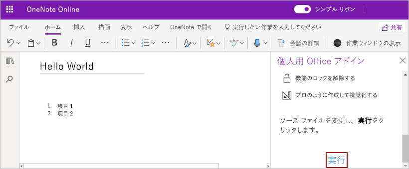

# <a name="build-your-first-onenote-task-pane-add-in"></a>最初の OneNote の作業ウィンドウ アドインを作成する

この記事では、OneNote の作業ウィンドウ アドインを作成するプロセスを紹介します。

## <a name="prerequisites"></a>必須条件

[!include[Set up requirements](../includes/set-up-dev-environment-beforehand.md)]
[!include[Yeoman generator prerequisites](../includes/quickstart-yo-prerequisites.md)]

## <a name="create-the-add-in-project"></a>アドイン プロジェクトの作成

[!include[Yeoman generator create project guidance](../includes/yo-office-command-guidance.md)]

- **Choose a project type: (プロジェクトの種類を選択)** `Office Add-in Task Pane project`
- **Choose a script type: (スクリプトの種類を選択)** `Javascript`
- **What would you want to name your add-in?: (アドインの名前を何にしますか)** `My Office Add-in`
- **Which Office client application would you like to support?: (どの Office クライアント アプリケーションをサポートしますか)** `OneNote`


ウィザードを完了すると、ジェネレーターによってプロジェクトが作成されて、サポートしているノード コンポーネントがインストールされます。

[!include[Yeoman generator next steps](../includes/yo-office-next-steps.md)]

## <a name="explore-the-project"></a>プロジェクトを確認する

Yeomanジェネレーターで作成したアドインプロジェクトには、原型となる作業ペインアドインのサンプルコードが含まれています。

- プロジェクトのルート ディレクトリにある **./manifest.xml** ファイルで、アドインの機能と設定を定義します。
- **./src/taskpane/taskpane.html** ファイルには、作業ペイン用のHTMLマークアップが含まれています。
- **./src/taskpane/taskpane.css** ファイルには、作業ペインのコンテンツに適用されるCSSが含まれています。
- **./src/taskpane/taskpane.js** ファイルには、作業ウィンドウと Office クライアント アプリケーションの間のやり取りを容易にする Office JavaScript API コードが含まれています。

## <a name="update-the-code"></a>コードを更新する

コード エディターでファイル **./src/taskpane/taskpane.js** を開き、次のコードを `run` 関数内に追加します。 このコードは、OneNote JavaScript API を使用してページ タイトルを設定し、ページの本文にアウトラインを追加します。

```js
try {
    await OneNote.run(async (context) => {

        // Get the current page.
        var page = context.application.getActivePage();

        // Queue a command to set the page title.
        page.title = "Hello World";

        // Queue a command to add an outline to the page.
        var html = "<p><ol><li>Item #1</li><li>Item #2</li></ol></p>";
        page.addOutline(40, 90, html);

        // Run the queued commands.
        await context.sync();
    });
} catch (error) {
    console.log("Error: " + error);
}
```

## <a name="try-it-out"></a>試してみる

1. プロジェクトのルート フォルダーに移動します。

    ```command&nbsp;line
    cd "My Office Add-in"
    ```

1. ローカル Web サーバーを開始します。 プロジェクトのルート ディレクトリから次のコマンドを実行します。

    ```command&nbsp;line
    npm run dev-server
    ```

    [!INCLUDE [alert use https](../includes/alert-use-https.md)]

1. [OneNote on the web](https://www.onenote.com/notebooks) でノートブックを開き、新しいページを作成します。

1. **[挿入] > [Office アドイン]** の順に選択し、[Office アドイン] ダイアログを開きます。

    - コンシューマー アカウントでサインインしている場合は、**[マイ アドイン]** タブを選択し、**[マイ アドインのアップロード]** を選択します。

    - 職場または教育用アカウントでサインインしている場合は、**[自分の所属組織]** タブを選択し、**[マイ アドインのアップロード]** を選択します。

    次の図は、コンシューマー ノートブックの **[マイ アドイン]** タブを示しています。

    ![[マイ アドイン] タブを示す [Office アドイン] ダイアログのスクリーンショット。](../images/onenote-office-add-ins-dialog.png)

1. [アドインのアップロード] ダイアログで、プロジェクト フォルダー内の **manifest.xml** を参照し、**[アップロード]** を選択します。

1. **[ホーム]** タブから、リボンの **[作業ウィンドウの表示]** ボタンをクリックします。 アドインの作業ウィンドウは、OneNote ページの横にある iFrame で開きます。

1. 作業ウィンドウの下部にある [**実行**] リンクをクリックしてページ タイトルを設定し、ページの本文にアウトラインを追加します。

    

## <a name="next-steps"></a>次の手順

おめでとうございます。OneNote の作業ウィンドウ アドインが正常に作成されました。次に、OneNote アドイン構築の中心概念の詳細について説明します。

> [!div class="nextstepaction"]
> [OneNote の JavaScript API のプログラミングの概要](../onenote/onenote-add-ins-programming-overview.md)

## <a name="see-also"></a>関連項目

- [Office アドイン プラットフォームの概要](../overview/office-add-ins.md)
- [Office アドインを開発する](../develop/develop-overview.md)
- [OneNote の JavaScript API のプログラミングの概要](../onenote/onenote-add-ins-programming-overview.md)
- [OneNote JavaScript API リファレンス](../reference/overview/onenote-add-ins-javascript-reference.md)
- [Rubric Grader のサンプル](https://github.com/OfficeDev/OneNote-Add-in-Rubric-Grader)
