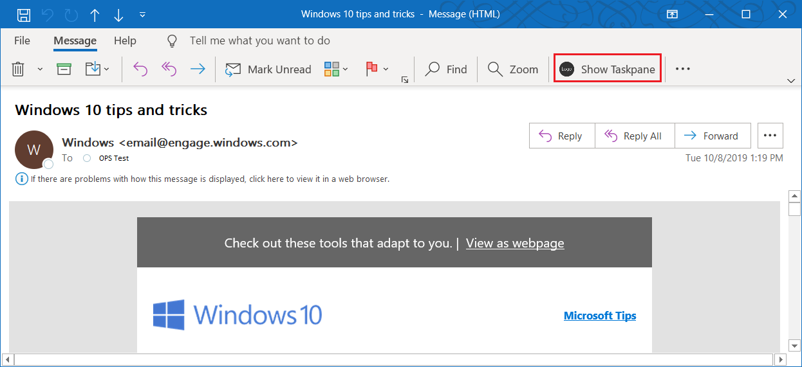
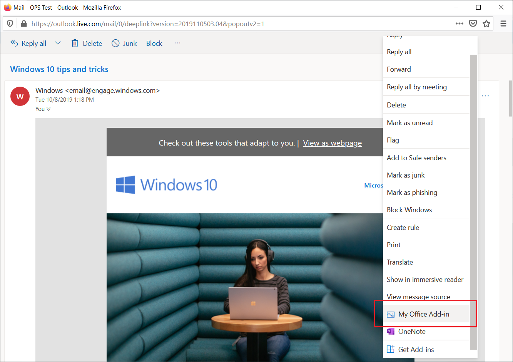

# <a name="build-your-first-outlook-add-in"></a><span data-ttu-id="b6b48-103">最初の Outlook アドインをビルドする</span><span class="sxs-lookup"><span data-stu-id="b6b48-103">Build your first Outlook add-in</span></span>

<span data-ttu-id="b6b48-104">この記事では、選択したメッセージのプロパティを、少なくとも 1 つ表示する Outlook 作業ウィンドウ アドインを作成するプロセスについて説明します。</span><span class="sxs-lookup"><span data-stu-id="b6b48-104">In this article, you'll walk through the process of building an Outlook task pane add-in that displays at least one property of a selected message.</span></span>

## <a name="create-the-add-in"></a><span data-ttu-id="b6b48-105">アドインを作成する</span><span class="sxs-lookup"><span data-stu-id="b6b48-105">Create the add-in</span></span>

<span data-ttu-id="b6b48-106">[Office アドイン用の Yeoman ジェネレーター](https://github.com/OfficeDev/generator-office) または Visual Studio を使用して Office アドインを作成することができます。</span><span class="sxs-lookup"><span data-stu-id="b6b48-106">You can create an Office Add-in by using the [Yeoman generator for Office Add-ins](https://github.com/OfficeDev/generator-office) or Visual Studio.</span></span> <span data-ttu-id="b6b48-107">Yeoman ジェネレーターでは Visual Studio Code またはその他のエディターで管理できる Node.js プロジェクトを作成します。一方、Visual Studio では Visual Studio のソリューションを作成します。</span><span class="sxs-lookup"><span data-stu-id="b6b48-107">The Yeoman generator creates a Node.js project that can be managed with Visual Studio Code or any other editor, whereas Visual Studio creates a Visual Studio solution.</span></span>  <span data-ttu-id="b6b48-108">使用する方のタブを選択し、手順に従ってアドインを作成してローカルでテストします。</span><span class="sxs-lookup"><span data-stu-id="b6b48-108">Select the tab for the one you'd like to use and then follow the instructions to create your add-in and test it locally.</span></span>

# <a name="yeoman-generator"></a>[<span data-ttu-id="b6b48-109">Yeoman ジェネレーター</span><span class="sxs-lookup"><span data-stu-id="b6b48-109">Yeoman generator</span></span>](#tab/yeomangenerator)

### <a name="prerequisites"></a><span data-ttu-id="b6b48-110">前提条件</span><span class="sxs-lookup"><span data-stu-id="b6b48-110">Prerequisites</span></span>

[!include[Set up requirements](../includes/set-up-dev-environment-beforehand.md)]

- <span data-ttu-id="b6b48-111">[Node.js](https://nodejs.org/) (最新 [LTS](https://nodejs.org/about/releases) バージョン)</span><span class="sxs-lookup"><span data-stu-id="b6b48-111">[Node.js](https://nodejs.org/) (the latest [LTS](https://nodejs.org/about/releases) version)</span></span>

- <span data-ttu-id="b6b48-112">最新バージョンの [Yeoman](https://github.com/yeoman/yo) と [Office アドイン用の Yeoman ジェネレーター](https://github.com/OfficeDev/generator-office)。これらのツールをグローバルにインストールするには、コマンド プロンプトから次のコマンドを実行します。</span><span class="sxs-lookup"><span data-stu-id="b6b48-112">The latest version of [Yeoman](https://github.com/yeoman/yo) and the [Yeoman generator for Office Add-ins](https://github.com/OfficeDev/generator-office). To install these tools globally, run the following command via the command prompt:</span></span>

    ```command&nbsp;line
    npm install -g yo generator-office
    ```

    > [!NOTE]
    > <span data-ttu-id="b6b48-113">Yeomanのジェネレーターを過去に取付けている場合でも、npmからのパッケージを最新のバージョンにすることをお勧めします。</span><span class="sxs-lookup"><span data-stu-id="b6b48-113">Even if you've previously installed the Yeoman generator, we recommend you update your package to the latest version from npm.</span></span>

### <a name="create-the-add-in-project"></a><span data-ttu-id="b6b48-114">アドイン プロジェクトの作成</span><span class="sxs-lookup"><span data-stu-id="b6b48-114">Create the add-in project</span></span>

1. [!include[Yeoman generator create project guidance](../includes/yo-office-command-guidance.md)]

    - <span data-ttu-id="b6b48-115">**Choose a project type: (プロジェクトの種類を選択)** - `Office Add-in Task Pane project`</span><span class="sxs-lookup"><span data-stu-id="b6b48-115">**Choose a project type** - `Office Add-in Task Pane project`</span></span>

    - <span data-ttu-id="b6b48-116">**Choose a script type: (スクリプトの種類を選択)** - `Javascript`</span><span class="sxs-lookup"><span data-stu-id="b6b48-116">**Choose a script type** - `Javascript`</span></span>

    - <span data-ttu-id="b6b48-117">**What would you want to name your add-in?: (アドインの名前を何にしますか)**</span><span class="sxs-lookup"><span data-stu-id="b6b48-117">**What do you want to name your add-in?**</span></span> - `My Office Add-in`

    - <span data-ttu-id="b6b48-118">**Which Office client application would you like to support?: (どの Office クライアント アプリケーションをサポートしますか)**</span><span class="sxs-lookup"><span data-stu-id="b6b48-118">**Which Office client application would you like to support?**</span></span> - `Outlook`

    
    
    <span data-ttu-id="b6b48-120">ウィザードを完了すると、ジェネレーターによってプロジェクトが作成されて、サポートしているノード コンポーネントがインストールされます。</span><span class="sxs-lookup"><span data-stu-id="b6b48-120">After you complete the wizard, the generator will create the project and install supporting Node components.</span></span>

    [!include[Yeoman generator next steps](../includes/yo-office-next-steps.md)]

1. <span data-ttu-id="b6b48-121">Web アプリケーション プロジェクトのルート フォルダーに移動します。</span><span class="sxs-lookup"><span data-stu-id="b6b48-121">Navigate to the root folder of the web application project.</span></span>

    ```command&nbsp;line
    cd "My Office Add-in"
    ```

### <a name="explore-the-project"></a><span data-ttu-id="b6b48-122">プロジェクトを探究する</span><span class="sxs-lookup"><span data-stu-id="b6b48-122">Explore the project</span></span>

<span data-ttu-id="b6b48-123">Yeomanジェネレーターで作成したアドインプロジェクトには、原型となる作業ペインアドインのサンプルコードが含まれています。</span><span class="sxs-lookup"><span data-stu-id="b6b48-123">The add-in project that you've created with the Yeoman generator contains sample code for a very basic task pane add-in.</span></span> 

- <span data-ttu-id="b6b48-124">プロジェクトのルートディレクトリにある **./ manifest.xml**ファイルは、アドインの設定と機能性を定義します。</span><span class="sxs-lookup"><span data-stu-id="b6b48-124">The **./manifest.xml** file in the root directory of the project defines the settings and capabilities of the add-in.</span></span>
- <span data-ttu-id="b6b48-125">**./src/taskpane/taskpane.html**ファイルには、作業ペイン用のHTMLマークアップが含まれています。</span><span class="sxs-lookup"><span data-stu-id="b6b48-125">The **./src/taskpane/taskpane.html** file contains the HTML markup for the task pane.</span></span>
- <span data-ttu-id="b6b48-126">**./src/taskpane/taskpane.css**ファイルには、作業ペインのコンテンツに適用されるCSSが含まれています。</span><span class="sxs-lookup"><span data-stu-id="b6b48-126">The **./src/taskpane/taskpane.css** file contains the CSS that's applied to content in the task pane.</span></span>
- <span data-ttu-id="b6b48-127">**./src/taskpane/taskpane.js**ファイルには、作業ペインとOutlookの間のやり取りを容易にするOffice JavaScript APIコードが含まれています。</span><span class="sxs-lookup"><span data-stu-id="b6b48-127">The **./src/taskpane/taskpane.js** file contains the Office JavaScript API code that facilitates interaction between the task pane and Outlook.</span></span>

### <a name="update-the-code"></a><span data-ttu-id="b6b48-128">コードを更新する</span><span class="sxs-lookup"><span data-stu-id="b6b48-128">Update the code</span></span>

1. <span data-ttu-id="b6b48-129">コードエディタで、**./src/taskpane/taskpane.html**ファイルを開き、全体の`<main>`要素（一部の`<body>`要素）を次のマークアップに置き換えます。</span><span class="sxs-lookup"><span data-stu-id="b6b48-129">In your code editor, open the file **./src/taskpane/taskpane.html** and replace the entire `<main>` element (within the `<body>` element) with the following markup.</span></span> <span data-ttu-id="b6b48-130">この新しいマークアップは、**./src/taskpane/taskpane.js**のスクリプトがデータを書き込む場所にラベルを追加します。</span><span class="sxs-lookup"><span data-stu-id="b6b48-130">This new markup adds a label where the script in **./src/taskpane/taskpane.js** will write data.</span></span>

    ```html
    <main id="app-body" class="ms-welcome__main" style="display: none;">
        <h2 class="ms-font-xl"> Discover what Office Add-ins can do for you today! </h2>
        <p><label id="item-subject"></label></p>
        <div role="button" id="run" class="ms-welcome__action ms-Button ms-Button--hero ms-font-xl">
            <span class="ms-Button-label">Run</span>
        </div>
    </main>
    ```

1. <span data-ttu-id="b6b48-131">コード エディターでファイル **./src/taskpane/taskpane.js** を開き、次のコードを `run` 関数内に追加します。</span><span class="sxs-lookup"><span data-stu-id="b6b48-131">In your code editor, open the file **./src/taskpane/taskpane.js** and add the following code within the `run` function.</span></span> <span data-ttu-id="b6b48-132">このコードはOffice JavaScript APIを使用して現在のメッセージへの参照を取得し、その`subject`プロパティ値を作業ペインに書き込みます。</span><span class="sxs-lookup"><span data-stu-id="b6b48-132">This code uses the Office JavaScript API to get a reference to the current message and write its `subject` property value to the task pane.</span></span>

    ```js
    // Get a reference to the current message
    var item = Office.context.mailbox.item;

    // Write message property value to the task pane
    document.getElementById("item-subject").innerHTML = "<b>Subject:</b> <br/>" + item.subject;
    ```

### <a name="try-it-out"></a><span data-ttu-id="b6b48-133">試してみる</span><span class="sxs-lookup"><span data-stu-id="b6b48-133">Try it out</span></span>

> [!NOTE]
> <span data-ttu-id="b6b48-134">開発の最中でも、Office アドインは HTTP ではなく HTTPS を使用する必要があります。</span><span class="sxs-lookup"><span data-stu-id="b6b48-134">Office Add-ins should use HTTPS, not HTTP, even when you are developing.</span></span> <span data-ttu-id="b6b48-135">次のコマンドを実行した後に証明書をインストールするように求められた場合は、Yeoman ジェネレーターによって提供される証明書をインストールするプロンプトを受け入れます。</span><span class="sxs-lookup"><span data-stu-id="b6b48-135">If you are prompted to install a certificate after you run the following command, accept the prompt to install the certificate that the Yeoman generator provides.</span></span>

1. <span data-ttu-id="b6b48-136">プロジェクトのルート ディレクトリから次のコマンドを実行します。</span><span class="sxs-lookup"><span data-stu-id="b6b48-136">Run the following command in the root directory of your project.</span></span> <span data-ttu-id="b6b48-137">このコマンドを実行すると、ローカル Web サーバーが起動します (まだ実行されていない場合)。</span><span class="sxs-lookup"><span data-stu-id="b6b48-137">When you run this command, the local web server will start (if it's not already running).</span></span>

    ```command&nbsp;line
    npm run dev-server
    ```

1. <span data-ttu-id="b6b48-138">「[テスト用に Outlook アドインをサイドロードする](../outlook/sideload-outlook-add-ins-for-testing.md)」の手順に従って Outlook アドインをサイドロードします。</span><span class="sxs-lookup"><span data-stu-id="b6b48-138">Follow the instructions in [Sideload Outlook add-ins for testing](../outlook/sideload-outlook-add-ins-for-testing.md) to sideload the add-in in Outlook.</span></span>

1. <span data-ttu-id="b6b48-139">Outlook で、メッセージを選択または開きます。</span><span class="sxs-lookup"><span data-stu-id="b6b48-139">In Outlook, select or open a message.</span></span>

1. <span data-ttu-id="b6b48-140">**ホーム**タブ（または新しいウィンドウでメッセージを開いた場合は**メッセージ**タブ）を選択し、リボンの**タスクパネルの表示**ボタンを選択、アドインの作業ペインを開きます。</span><span class="sxs-lookup"><span data-stu-id="b6b48-140">Choose the **Home** tab (or the **Message** tab if you opened the message in a new window), and then choose the **Show Taskpane** button in the ribbon to open the add-in task pane.</span></span>

    

1. <span data-ttu-id="b6b48-142">作業ペインの下部までスクロールし、**実行**リンクを選択してメッセージを作業ペインに書き込みます。</span><span class="sxs-lookup"><span data-stu-id="b6b48-142">Scroll to the bottom of the task pane and choose the **Run** link to write the message subject to the task pane.</span></span>

    

    

### <a name="next-steps"></a><span data-ttu-id="b6b48-145">次のステップ</span><span class="sxs-lookup"><span data-stu-id="b6b48-145">Next steps</span></span>

<span data-ttu-id="b6b48-146">おめでとうございます、最初のOutlook作業ペインアドインの作成に成功しました。</span><span class="sxs-lookup"><span data-stu-id="b6b48-146">Congratulations, you've successfully created your first Outlook task pane add-in!</span></span> <span data-ttu-id="b6b48-147">次に、Outlook アドインの機能の詳細説明と、より複雑なアドインを作成する方法について、「[Outlook アドインのチュートリアル](../tutorials/outlook-tutorial.md)」をご覧ください。</span><span class="sxs-lookup"><span data-stu-id="b6b48-147">Next, learn more about the capabilities of an Outlook add-in and build a more complex add-in by following along with the [Outlook add-in tutorial](../tutorials/outlook-tutorial.md).</span></span>

# <a name="visual-studio"></a>[<span data-ttu-id="b6b48-148">Visual Studio</span><span class="sxs-lookup"><span data-stu-id="b6b48-148">Visual Studio</span></span>](#tab/visualstudio)

### <a name="prerequisites"></a><span data-ttu-id="b6b48-149">前提条件</span><span class="sxs-lookup"><span data-stu-id="b6b48-149">Prerequisites</span></span>

- <span data-ttu-id="b6b48-150">**Office/SharePoint 開発**ワークロードがインストールされている [Visual Studio 2019](https://www.visualstudio.com/vs/)</span><span class="sxs-lookup"><span data-stu-id="b6b48-150">[Visual Studio 2019](https://www.visualstudio.com/vs/) with the **Office/SharePoint development** workload installed</span></span>

    > [!NOTE]
    > <span data-ttu-id="b6b48-151">既に Visual Studio 2019 がインストールされている場合は、[Visual Studio インストーラー](/visualstudio/install/modify-visual-studio)を使用して、**Office/SharePoint 開発**ワークロードがインストールされていることを確認してください。</span><span class="sxs-lookup"><span data-stu-id="b6b48-151">If you've previously installed Visual Studio 2019, [use the Visual Studio Installer](/visualstudio/install/modify-visual-studio) to ensure that the **Office/SharePoint development** workload is installed.</span></span>

- <span data-ttu-id="b6b48-152">Office 365</span><span class="sxs-lookup"><span data-stu-id="b6b48-152">Office 365</span></span>

    > [!NOTE]
    > <span data-ttu-id="b6b48-153">Microsoft 365 サブスクリプションをお持ちでない場合は、[Microsoft 365 開発者プログラム](https://developer.microsoft.com/office/dev-program)に新規登録すると、無料のサブスクリプションを取得できます。</span><span class="sxs-lookup"><span data-stu-id="b6b48-153">If you do not have a Microsoft 365 subscription, you can get a free one by signing up for the [Microsoft 365 developer program](https://developer.microsoft.com/office/dev-program).</span></span>

### <a name="create-the-add-in-project"></a><span data-ttu-id="b6b48-154">アドイン プロジェクトの作成</span><span class="sxs-lookup"><span data-stu-id="b6b48-154">Create the add-in project</span></span>

1. <span data-ttu-id="b6b48-155">[Visual Studio] メニュー バーで、**[ファイル]**  >  **[新規作成]**  >  **[プロジェクト]** の順に選択します。</span><span class="sxs-lookup"><span data-stu-id="b6b48-155">On the Visual Studio menu bar, choose **File** > **New** > **Project**.</span></span>

1. <span data-ttu-id="b6b48-156">**[Visual C#]** または **[Visual Basic]** の下にあるプロジェクトの種類の一覧で、**[Office/SharePoint]** を展開し、**[アドイン]** を選択し、プロジェクトの種類として **[Outlook Web アドイン]** を選択します。</span><span class="sxs-lookup"><span data-stu-id="b6b48-156">In the list of project types under **Visual C#** or **Visual Basic**, expand **Office/SharePoint**, choose **Add-ins**, and then choose **Outlook Web Add-in** as the project type.</span></span>

1. <span data-ttu-id="b6b48-157">プロジェクトに名前を付けて、**[OK]** を選択します。</span><span class="sxs-lookup"><span data-stu-id="b6b48-157">Name the project, and then choose **OK**.</span></span>

1. <span data-ttu-id="b6b48-158">ソリューションが Visual Studio によって作成され、2 つのプロジェクトが**ソリューション エクスプローラー**に表示されます。</span><span class="sxs-lookup"><span data-stu-id="b6b48-158">Visual Studio creates a solution and its two projects appear in **Solution Explorer**.</span></span> <span data-ttu-id="b6b48-159">**MessageRead.html** ファイルが Visual Studio で開きます。</span><span class="sxs-lookup"><span data-stu-id="b6b48-159">The **MessageRead.html** file opens in Visual Studio.</span></span>

### <a name="explore-the-visual-studio-solution"></a><span data-ttu-id="b6b48-160">Visual Studio ソリューションについて理解する</span><span class="sxs-lookup"><span data-stu-id="b6b48-160">Explore the Visual Studio solution</span></span>

<span data-ttu-id="b6b48-161">ウィザードの完了後、Visual Studio によって 2 つのプロジェクトを含むソリューションが作成されます。</span><span class="sxs-lookup"><span data-stu-id="b6b48-161">When you've completed the wizard, Visual Studio creates a solution that contains two projects.</span></span>

|<span data-ttu-id="b6b48-162">**プロジェクト**</span><span class="sxs-lookup"><span data-stu-id="b6b48-162">**Project**</span></span>|<span data-ttu-id="b6b48-163">**説明**</span><span class="sxs-lookup"><span data-stu-id="b6b48-163">**Description**</span></span>|
|:-----|:-----|
|<span data-ttu-id="b6b48-164">アドイン プロジェクト</span><span class="sxs-lookup"><span data-stu-id="b6b48-164">Add-in project</span></span>|<span data-ttu-id="b6b48-165">アドインを記述するすべての設定を含む XML マニフェスト ファイルのみが含まれます。</span><span class="sxs-lookup"><span data-stu-id="b6b48-165">Contains only an XML manifest file, which contains all the settings that describe your add-in.</span></span> <span data-ttu-id="b6b48-166">これらの設定は、Office ホストがアドインのアクティブ化の時期とアドインの表示場所を特定するのに役立ちます。</span><span class="sxs-lookup"><span data-stu-id="b6b48-166">These settings help the Office host determine when your add-in should be activated and where the add-in should appear.</span></span> <span data-ttu-id="b6b48-167">プロジェクトを実行してすぐにアドインを使用できるように、Visual Studio は、このファイルの内容を生成します。</span><span class="sxs-lookup"><span data-stu-id="b6b48-167">Visual Studio generates the contents of this file for you so that you can run the project and use your add-in immediately.</span></span> <span data-ttu-id="b6b48-168">XML ファイルを変更することで、これらの設定をいつでも変更できます。</span><span class="sxs-lookup"><span data-stu-id="b6b48-168">You can change these settings any time by modifying the XML file.</span></span>|
|<span data-ttu-id="b6b48-169">Web アプリケーション プロジェクト</span><span class="sxs-lookup"><span data-stu-id="b6b48-169">Web application project</span></span>|<span data-ttu-id="b6b48-170">Contains the content pages of your add-in, including all the files and file references that you need to develop Office-aware HTML and JavaScript pages.</span><span class="sxs-lookup"><span data-stu-id="b6b48-170">Contains the content pages of your add-in, including all the files and file references that you need to develop Office-aware HTML and JavaScript pages.</span></span> <span data-ttu-id="b6b48-171">While you develop your add-in, Visual Studio hosts the web application on your local IIS server.</span><span class="sxs-lookup"><span data-stu-id="b6b48-171">While you develop your add-in, Visual Studio hosts the web application on your local IIS server.</span></span> <span data-ttu-id="b6b48-172">When you're ready to publish the add-in, you'll need to deploy this web application project to a web server.</span><span class="sxs-lookup"><span data-stu-id="b6b48-172">When you're ready to publish the add-in, you'll need to deploy this web application project to a web server.</span></span>|

### <a name="update-the-code"></a><span data-ttu-id="b6b48-173">コードを更新する</span><span class="sxs-lookup"><span data-stu-id="b6b48-173">Update the code</span></span>

1. <span data-ttu-id="b6b48-174">**MessageRead.html** は、アドインの作業ウィンドウにレンダリングされる HTML を指定します。</span><span class="sxs-lookup"><span data-stu-id="b6b48-174">**MessageRead.html** specifies the HTML that will be rendered in the add-in's task pane.</span></span> <span data-ttu-id="b6b48-175">**MessageRead.html** で、`<body>` 要素を次のマークアップに置き換えて、ファイルを保存します。</span><span class="sxs-lookup"><span data-stu-id="b6b48-175">In **MessageRead.html**, replace the `<body>` element with the following markup and save the file.</span></span>
 
    ```HTML
    <body class="ms-font-m ms-welcome">
        <div class="ms-Fabric content-main">
            <h1 class="ms-font-xxl">Message properties</h1>
            <table class="ms-Table ms-Table--selectable">
                <thead>
                    <tr>
                        <th>Property</th>
                        <th>Value</th>
                    </tr>
                </thead>
                <tbody>
                    <tr>
                        <td><strong>Id</strong></td>
                        <td class="prop-val"><code><label id="item-id"></label></code></td>
                    </tr>
                    <tr>
                        <td><strong>Subject</strong></td>
                        <td class="prop-val"><code><label id="item-subject"></label></code></td>
                    </tr>
                    <tr>
                        <td><strong>Message Id</strong></td>
                        <td class="prop-val"><code><label id="item-internetMessageId"></label></code></td>
                    </tr>
                    <tr>
                        <td><strong>From</strong></td>
                        <td class="prop-val"><code><label id="item-from"></label></code></td>
                    </tr>
                </tbody>
            </table>
        </div>
    </body>
    ```

1. <span data-ttu-id="b6b48-176">Web アプリケーション プロジェクトのルートにあるファイル **MessageRead.js** を開きます。</span><span class="sxs-lookup"><span data-stu-id="b6b48-176">Open the file **MessageRead.js** in the root of the web application project.</span></span> <span data-ttu-id="b6b48-177">このファイルは、アドイン用のスクリプトを指定します。</span><span class="sxs-lookup"><span data-stu-id="b6b48-177">This file specifies the script for the add-in.</span></span> <span data-ttu-id="b6b48-178">すべての内容を次のコードに置き換え、ファイルを保存します。</span><span class="sxs-lookup"><span data-stu-id="b6b48-178">Replace the entire contents with the following code and save the file.</span></span>

    ```js
    'use strict';

    (function () {

        Office.onReady(function () {
            // Office is ready
            $(document).ready(function () {
                // The document is ready
                loadItemProps(Office.context.mailbox.item);
            });
        });

        function loadItemProps(item) {
            // Write message property values to the task pane
            $('#item-id').text(item.itemId);
            $('#item-subject').text(item.subject);
            $('#item-internetMessageId').text(item.internetMessageId);
            $('#item-from').html(item.from.displayName + " &lt;" + item.from.emailAddress + "&gt;");
        }
    })();
    ```

1. <span data-ttu-id="b6b48-179">Web アプリケーション プロジェクトのルートにあるファイル **MessageRead.css** を開きます。</span><span class="sxs-lookup"><span data-stu-id="b6b48-179">Open the file **MessageRead.css** in the root of the web application project.</span></span> <span data-ttu-id="b6b48-180">このファイルは、アドイン用のユーザー設定のスタイルを指定します。</span><span class="sxs-lookup"><span data-stu-id="b6b48-180">This file specifies the custom styles for the add-in.</span></span> <span data-ttu-id="b6b48-181">すべての内容を次のコードに置き換え、ファイルを保存します。</span><span class="sxs-lookup"><span data-stu-id="b6b48-181">Replace the entire contents with the following code and save the file.</span></span>

    ```CSS
    html,
    body {
        width: 100%;
        height: 100%;
        margin: 0;
        padding: 0;
    }

    td.prop-val {
        word-break: break-all;
    }

    .content-main {
        margin: 10px;
    }
    ```

### <a name="update-the-manifest"></a><span data-ttu-id="b6b48-182">マニフェストを更新する</span><span class="sxs-lookup"><span data-stu-id="b6b48-182">Update the manifest</span></span>

1. <span data-ttu-id="b6b48-183">Open the XML manifest file in the Add-in project.</span><span class="sxs-lookup"><span data-stu-id="b6b48-183">Open the XML manifest file in the Add-in project.</span></span> <span data-ttu-id="b6b48-184">This file defines the add-in's settings and capabilities.</span><span class="sxs-lookup"><span data-stu-id="b6b48-184">This file defines the add-in's settings and capabilities.</span></span>

1. <span data-ttu-id="b6b48-185">The `ProviderName` element has a placeholder value.</span><span class="sxs-lookup"><span data-stu-id="b6b48-185">The `ProviderName` element has a placeholder value.</span></span> <span data-ttu-id="b6b48-186">Replace it with your name.</span><span class="sxs-lookup"><span data-stu-id="b6b48-186">Replace it with your name.</span></span>

1. <span data-ttu-id="b6b48-187">`DisplayName` 要素の `DefaultValue` 属性にはプレースホルダー値が含まれています。</span><span class="sxs-lookup"><span data-stu-id="b6b48-187">The `DefaultValue` attribute of the `DisplayName` element has a placeholder.</span></span> <span data-ttu-id="b6b48-188">それを `My Office Add-in` に置き換えます。</span><span class="sxs-lookup"><span data-stu-id="b6b48-188">Replace it with `My Office Add-in`.</span></span>

1. <span data-ttu-id="b6b48-189">`Description` 要素の `DefaultValue` 属性にはプレースホルダー値が含まれています。</span><span class="sxs-lookup"><span data-stu-id="b6b48-189">The `DefaultValue` attribute of the `Description` element has a placeholder.</span></span> <span data-ttu-id="b6b48-190">それを `My First Outlook add-in` に置き換えます。</span><span class="sxs-lookup"><span data-stu-id="b6b48-190">Replace it with `My First Outlook add-in`.</span></span>

1. <span data-ttu-id="b6b48-191">ファイルを保存します。</span><span class="sxs-lookup"><span data-stu-id="b6b48-191">Save the file.</span></span>

    ```xml
    ...
    <ProviderName>John Doe</ProviderName>
    <DefaultLocale>en-US</DefaultLocale>
    <!-- The display name of your add-in. Used on the store and various places of the Office UI such as the add-ins dialog. -->
    <DisplayName DefaultValue="My Office Add-in" />
    <Description DefaultValue="My First Outlook add-in"/>
    ...
    ```

### <a name="try-it-out"></a><span data-ttu-id="b6b48-192">試してみる</span><span class="sxs-lookup"><span data-stu-id="b6b48-192">Try it out</span></span>

1. <span data-ttu-id="b6b48-193">Visual Studio を使用して、F5 キーを押すか **[スタート]** ボタンをクリックして、新しく作成された Outlook アドインをテストします。</span><span class="sxs-lookup"><span data-stu-id="b6b48-193">Using Visual Studio, test the newly created Outlook add-in by pressing F5 or choosing the **Start** button.</span></span> <span data-ttu-id="b6b48-194">アドインは IIS 上でローカルにホストされます。</span><span class="sxs-lookup"><span data-stu-id="b6b48-194">The add-in will be hosted locally on IIS.</span></span>

1. <span data-ttu-id="b6b48-195">**[Exchange 電子メールアカウントに接続する]** ダイアログ ボックスで、[Microsoft アカウント](https://account.microsoft.com/account)の電子メール アドレスとパスワードを入力し、**[接続]** を選択します。</span><span class="sxs-lookup"><span data-stu-id="b6b48-195">In the **Connect to Exchange email account** dialog box, enter the email address and password for your [Microsoft account](https://account.microsoft.com/account) and then choose **Connect**.</span></span> <span data-ttu-id="b6b48-196">Outlook.com のログイン ページがブラウザに表示されたら、前回と同じ資格情報を使用して、メール アカウントにログインします。</span><span class="sxs-lookup"><span data-stu-id="b6b48-196">When the Outlook.com login page opens in a browser, sign in to your email account with the same credentials as you entered previously.</span></span>

    > [!NOTE]
    > <span data-ttu-id="b6b48-197">**[Exchange 電子メールアカウントに接続]** ダイアログ ボックスが、繰り返しログインを要求する場合、Microsoft 365 テナントのアカウントの基本認証が無効になっている可能性があります。</span><span class="sxs-lookup"><span data-stu-id="b6b48-197">If the **Connect to Exchange email account** dialog box repeatedly prompts you to sign in, Basic Auth may be disabled for accounts on your Microsoft 365 tenant.</span></span> <span data-ttu-id="b6b48-198">その場合は、[Microsoft アカウント](https://account.microsoft.com/account) でログインし、アドインをテストしてください。</span><span class="sxs-lookup"><span data-stu-id="b6b48-198">To test this add-in, sign in using a [Microsoft account](https://account.microsoft.com/account) instead.</span></span>

1. <span data-ttu-id="b6b48-199">Outlook on the web で、メッセージを選択または開きます。</span><span class="sxs-lookup"><span data-stu-id="b6b48-199">In Outlook on the web, select or open a message.</span></span>

1. <span data-ttu-id="b6b48-200">メッセージ内で、アドインのボタンが表示されているオーバーフロー メニューの省略記号を探します。</span><span class="sxs-lookup"><span data-stu-id="b6b48-200">Within the message, locate the ellipsis for the overflow menu containing the add-in's button.</span></span>

    

1. <span data-ttu-id="b6b48-202">オーバーフロー メニュー内でアドインのボタンを探します。</span><span class="sxs-lookup"><span data-stu-id="b6b48-202">Within the overflow menu, locate the add-in's button.</span></span>

    

1. <span data-ttu-id="b6b48-204">ボタンをクリックしてアドインの作業ウィンドウを開きます。</span><span class="sxs-lookup"><span data-stu-id="b6b48-204">Click the button to open the add-in's task pane.</span></span>

    

    > [!NOTE]
    > <span data-ttu-id="b6b48-206">作業ウィンドウが読み込まれない場合、同じコンピューター上のブラウザーで作業ウィンドウを開いて確認してください。</span><span class="sxs-lookup"><span data-stu-id="b6b48-206">If the task pane doesn't load, try to verify by opening it in a browser on the same machine.</span></span>

### <a name="next-steps"></a><span data-ttu-id="b6b48-207">次の手順</span><span class="sxs-lookup"><span data-stu-id="b6b48-207">Next steps</span></span>

<span data-ttu-id="b6b48-208">おめでとうございます、最初のOutlook作業ペインアドインの作成に成功しました。</span><span class="sxs-lookup"><span data-stu-id="b6b48-208">Congratulations, you've successfully created your first Outlook task pane add-in!</span></span> <span data-ttu-id="b6b48-209">次に、「[Visual Studio を使用して Office アドインを開発する](../develop/develop-add-ins-visual-studio.md)」を参照してください。</span><span class="sxs-lookup"><span data-stu-id="b6b48-209">Next, learn more about [developing Office Add-ins with Visual Studio](../develop/develop-add-ins-visual-studio.md).</span></span>

---
