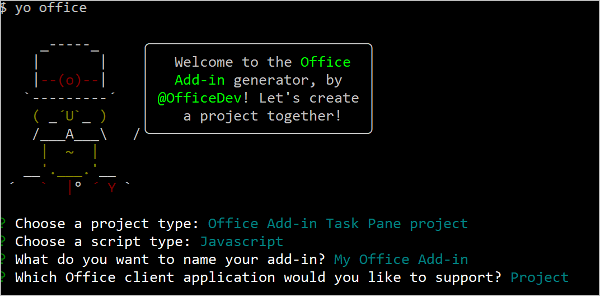
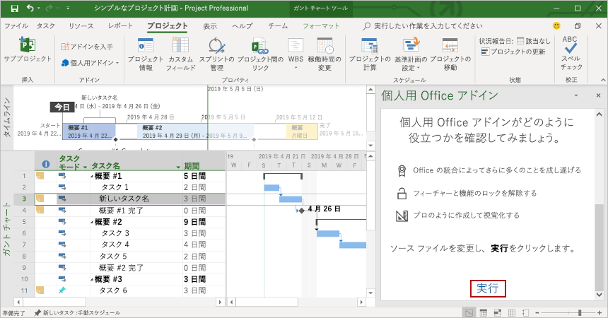

# <a name="build-your-first-project-task-pane-add-in"></a>最初の Project の作業ウィンドウ アドインを作成する

この記事では、Project の作業ウィンドウ アドインを作成するプロセスを紹介します。

## <a name="prerequisites"></a>前提条件

[!include[Yeoman generator prerequisites](../includes/quickstart-yo-prerequisites.md)]

- Windows の Project 2016 またはそれ以降

## <a name="create-the-add-in"></a>アドインを作成する

1. Yeoman ジェネレーターを使用して、Project アドイン プロジェクトを作成します。 次のコマンドを実行し、以下のプロンプトに応答します。

    ```command&nbsp;line
    yo office
    ```

    - **Choose a project type: (プロジェクトの種類を選択)** `Office Add-in Task Pane project`
    - **Choose a script type: (スクリプトの種類を選択)** `Javascript`
    - **What would you want to name your add-in?: (アドインの名前を何にしますか)** `My Office Add-in`
    - **Which Office client application would you like to support?: (どの Office クライアント アプリケーションをサポートしますか)** `Project`

    
    
    ウィザードを完了すると、ジェネレーターによってプロジェクトが作成されて、サポートしているノード コンポーネントがインストールされます。
    
2. プロジェクトのルート フォルダーに移動します。

    ```command&nbsp;line
    cd "My Office Add-in"
    ```

## <a name="explore-the-project"></a>プロジェクトを確認する

Yeomanジェネレーターで作成したアドインプロジェクトには、原型となる作業ペインアドインのサンプルコードが含まれています。 

- プロジェクトのルートディレクトリにある **./ manifest.xml**ファイルは、アドインの設定と機能性を定義します。
- **./src/taskpane/taskpane.html**ファイルには、作業ペイン用のHTMLマークアップが含まれています。
- **./src/taskpane/taskpane.css**ファイルには、作業ウィンドウ内のコンテンツに適用される CSS が含まれています。
- **./src/taskpane/taskpane.js**ファイルには、作業ウィンドウと Office のホスト アプリケーションの間のやり取りを容易にする Office JavaScript API コードが含まれています。

## <a name="update-the-code"></a>コードを更新する

コード エディターでファイル **./src/taskpane/taskpane.js** を開き、次のコードを **実行** 関数内に追加します。 このコードでは、Office JavaScript API を使用して、選択したタスクの `Name`フィールドと `Notes` フィールドを設定します。

```js
var taskGuid;

// Get the GUID of the selected task
Office.context.document.getSelectedTaskAsync(
    function (result) {
        if (result.status === Office.AsyncResultStatus.Succeeded) {
            taskGuid = result.value;

            // Set the specified fields for the selected task.
            var targetFields = [Office.ProjectTaskFields.Name, Office.ProjectTaskFields.Notes];
            var fieldValues = ['New task name', 'Notes for the task.'];

            // Set the field value. If the call is successful, set the next field.
            for (var i = 0; i < targetFields.length; i++) {
                Office.context.document.setTaskFieldAsync(
                    taskGuid,
                    targetFields[i],
                    fieldValues[i],
                    function (result) {
                        if (result.status === Office.AsyncResultStatus.Succeeded) {
                            i++;
                        }
                        else {
                            var err = result.error;
                            console.log(err.name + ' ' + err.code + ' ' + err.message);
                        }
                    }
                );
            }
        } else {
            var err = result.error;
            console.log(err.name + ' ' + err.code + ' ' + err.message);
        }
    }
);
```

## <a name="try-it-out"></a>試してみる

> [!NOTE]
> 開発の最中でも、Office アドインは HTTP ではなく HTTPS を使用する必要があります。 次のコマンドを実行した後に証明書をインストールするように求められた場合は、Yeoman ジェネレーターによって提供される証明書をインストールするプロンプトを受け入れます。

1. プロジェクトのルート ディレクトリから次のコマンドを実行します。 このコマンドを実行すると、ローカル Web サーバーが起動します。

    ```command&nbsp;line
    npm start
    ```

2. Project で、簡素なプロジェクト計画を作成します。

3. [Windows に Office アドインをサイドロードする](../testing/create-a-network-shared-folder-catalog-for-task-pane-and-content-add-ins.md) の手順に従い、Project でアドインを読み込みます。

4. プロジェクト内の単一のタスクを選択します。

5. 作業ウィンドウの下部で **Run** リンクを選択して、 選択されたタスクの名前を変更し、そのタスクにメモを追加します。

    

## <a name="next-steps"></a>次の手順

おめでとうございます。 Project の作業ウィンドウ アドインが正常に作成されました。 この後は、Project アドインの機能と一般的なシナリオについて調べます。

> [!div class="nextstepaction"]
> [Project 用アドイン](../project/project-add-ins.md)

