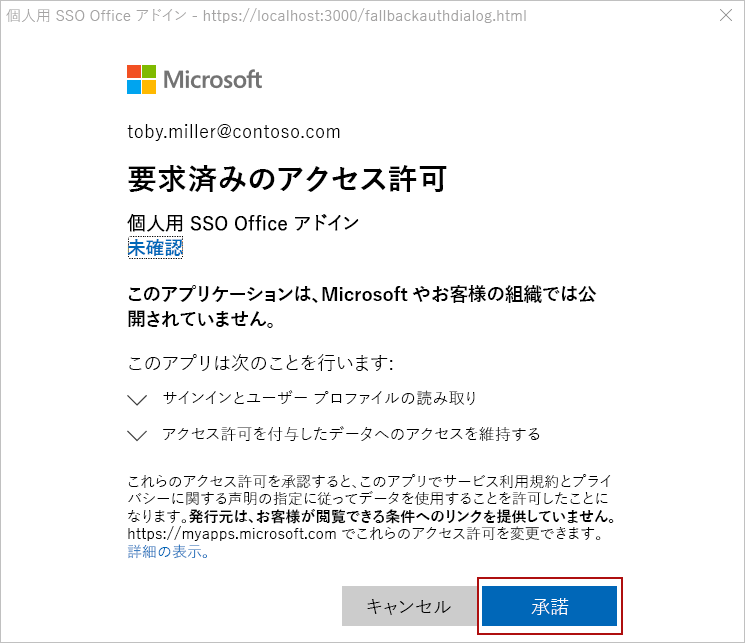
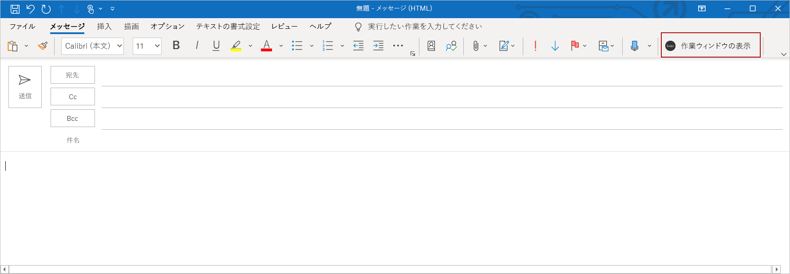

# <a name="customize-your-nodejs-sso-enabled-add-in"></a>Node.js SSO が有効なアドインをカスタマイズする

> [!IMPORTANT]
> この記事は、 [シングルサインオン (sso) のクイックスタート](sso-quickstart.md)を完了して作成された sso が有効なアドインに基づいて構築されています。 この記事を読む前に、クイックスタートを完了してください。

[Sso クイックスタート](sso-quickstart.md)では、サインインしているユーザーのプロファイル情報を取得し、それをドキュメントまたはメッセージに書き込む sso が有効なアドインを作成します。 この記事では、SSO クイックスタートで、[ごみ箱] ジェネレーターを使用して作成したアドインを更新するプロセスについて説明し、別のアクセス許可を必要とする新しい機能を追加します。

## <a name="prerequisites"></a>前提条件

* [SSO クイックスタート](sso-quickstart.md)の手順に従って作成した Office アドイン。

* 少なくとも、Microsoft 365 サブスクリプションの OneDrive for Business に格納されているファイルとフォルダーがいくつかあります。

* [Node.js](https://nodejs.org) (最新 [LTS](https://nodejs.org/about/releases) バージョン)。

[!include[additional prerequisites](../includes/sso-tutorial-prereqs.md)]

## <a name="review-contents-of-the-project"></a>プロジェクトのコンテンツをレビューする

まず、以前に [使用](sso-quickstart.md)していたアドインプロジェクトのクイックレビューから始めましょう。

> [!NOTE]
> この記事では、ファイル拡張子 **.js** を使用してスクリプトファイルを参照する場所で、プロジェクトが TypeScript を使用して作成されている場合は **、ファイル拡張子** としてを指定します。

[!include[project structure for an SSO-enabled add-in created with the Yeoman generator](../includes/sso-yeoman-project-structure.md)]

## <a name="add-new-functionality"></a>新しい機能を追加する

SSO クイックスタートを使用して作成したアドインは、Microsoft Graph を使用してサインインしているユーザーのプロファイル情報を取得し、その情報をドキュメントまたはメッセージに書き込みます。 サインインしているユーザーの OneDrive for Business から上位10個のファイルとフォルダーの名前を取得し、その情報をドキュメントまたはメッセージに書き込むようにアドインの機能を変更しましょう。 この新しい機能を有効にするには、Azure でアプリのアクセス許可を更新する必要があります。また、アドインプロジェクト内のコードを更新する必要があります。

### <a name="update-app-permissions-in-azure"></a>Azure でアプリのアクセス許可を更新する

アドインがユーザーの OneDrive for Business のコンテンツを正常に読み取る前に、Azure のアプリ登録情報を適切なアクセス許可で更新する必要があります。 次の手順を実行して、アプリに **ファイルの読み取り** アクセス許可を付与し、ユーザーを取り消し **ます。読み取り** アクセス許可は不要になりました。

1. [Azure portal](https://ms.portal.azure.com/#home)に移動し、 **Microsoft 365 管理者の資格情報を使用してサインイン**します。

2. [アプリの **登録** ] ページに移動します。
    > [!TIP]
    > これを行うには、Azure ホームページで **アプリ登録** タイルを選択するか、ホームページの検索ボックスを使用して **アプリの登録**を見つけて選択します。

3. [ **アプリの登録** ] ページで、クイックスタート時に作成したアプリを選択します。 
    > [!TIP]
    > アプリの **表示名** は、そのプロジェクトの作成時に指定したアドイン名と一致します。

4. [アプリの概要] ページで、ページの左側にある [**管理**] 見出しの下にある [ **API の権限**] を選択します。

5. [アクセス許可] テーブルの [ユーザー] の **読み取り** 行で、省略記号を選択し、表示されるメニューから [ **管理者の同意を取り消す** ] を選択します。

6. 表示されたプロンプトに対して [ **はい、削除** ] ボタンを選択します。

7. [アクセス許可] テーブルの [ユーザー] の **読み取り** 行で、省略記号を選択し、表示されるメニューから [ **アクセス許可の削除** ] を選択します。

8. 表示されたプロンプトに対して [ **はい、削除** ] ボタンを選択します。

9. **[アクセス許可の追加]** ボタンを選択します。

10. 表示されたパネルで、[ **Microsoft Graph** ] を選択し、[ **代理アクセス許可**] を選択します。

11. [ **API アクセス許可の要求** ] パネルで、次のようにします。

    a. [**ファイル**] の下で、[ファイル] を選択します **。**

    b. パネルの下部にある [ **アクセス許可の追加** ] ボタンを選択して、これらのアクセス許可の変更を保存します。

12. **[[テナント名] に対する管理者の同意を許可**する] ボタンを選択します。

13. 表示されるプロンプトに対して [ **はい** ] ボタンを選択します。

### <a name="update-code-in-the-add-in-project"></a>アドインプロジェクトでコードを更新する

サインインしているユーザーの OneDrive for Business の内容をアドインが読み取ることができるようにするには、次のことを行う必要があります。

- Microsoft Graph の URL、パラメーター、および必要なアクセススコープを参照するコードを更新します。

- 作業ウィンドウの UI を定義するコードを更新して、新しい機能を正確に記述できるようにします。 

- Microsoft Graph から応答を解析するコードを更新し、ドキュメントまたはメッセージに書き込みます。

次の手順では、これらの更新について説明します。

### <a name="changes-required-for-any-type-of-add-in"></a>任意の種類のアドインに必要な変更

アドインに対して次の手順を実行して、Microsoft Graph の URL、パラメーター、およびアクセススコープを変更し、作業ウィンドウの UI を更新します。 これらの手順は、アドインの対象となる Office アプリケーションに関係なく同じです。

1. **./.ENV**ファイル:

    a. `GRAPH_URL_SEGMENT=/me`を次のように置き換えます。`GRAPH_URL_SEGMENT=/me/drive/root/children`

    b. `QUERY_PARAM_SEGMENT=`を次のように置き換えます。`QUERY_PARAM_SEGMENT=?$select=name&$top=10`

    c. `SCOPE=User.Read`を次のように置き換えます。`SCOPE=Files.Read.All`

2. **./manifest.xml**で、 `<Scope>User.Read</Scope>` ファイルの末尾付近の行を見つけて行に置き換え `<Scope>Files.Read.All</Scope>` ます。

3. **/Src/helpers/fallbackauthdialog.js** (または TypeScript プロジェクトの **/src/helpers/fallbackauthdialog.ts** ) で、文字列を見つけて、次のように定義され `https://graph.microsoft.com/User.Read` た文字列で置き換え `https://graph.microsoft.com/Files.Read.All` `requestObj` ます。

    ```javascript
    var requestObj = {
      scopes: [`https://graph.microsoft.com/Files.Read.All`]
    };
    ```

    ```typescript
    var requestObj: Object = {
      scopes: [`https://graph.microsoft.com/Files.Read.All`]
    };
    ```

4. **/Src/taskpane/taskpane.html**で、要素を検索し、その要素内のテキストを更新して、 `<section class="ms-firstrun-instructionstep__header">` アドインの新しい機能を記述します。

    ```html
    <section class="ms-firstrun-instructionstep__header">
        <h2 class="ms-font-m">This add-in demonstrates how to use single sign-on by making a call to Microsoft
            Graph to read content from OneDrive for Business.</h2>
        <div class="ms-firstrun-instructionstep__header--image"></div>
    </section>
    ```

5. **./Src/taskpane/taskpane.html**で、文字列を検索し、文字列に置き換え `Get My User Profile Information` `Read my OneDrive for Business` ます。

    ```html
    <li class="ms-ListItem">
        <span class="ms-ListItem-primaryText">Click the <b>Read my OneDrive for Business</b>
            button.</span>
        <div class="clearfix"></div>
    </li>
    ```

    ```html
    <p align="center">
        <button id="getGraphDataButton" class="popupButton ms-Button ms-Button--primary"><span
                class="ms-Button-label">Read my OneDrive for Business</span></button>
    </p>
    ```

6. **/Src/taskpane/taskpane.html**で、文字列を検索して置換し `Your user profile information will be displayed in the document.` ます。 `The names of the top 10 files and folders in your OneDrive for Business will be displayed in the document or message.`

    ```html
    <li class="ms-ListItem">
        <span class="ms-ListItem-primaryText">The names of the top 10 files and folders in your OneDrive for Business will be displayed in the document or message.</span>
        <div class="clearfix"></div>
    </li>
    ```

7. アドインの種類に対応するセクションのガイダンスに従って、Microsoft Graph から応答を解析するコードを更新し、ドキュメントまたはメッセージに書き込みます。

    - [Excel アドインに必要な変更 (JavaScript)](#changes-required-for-an-excel-add-in-javascript)
    - [Excel アドイン (TypeScript) に必要な変更](#changes-required-for-an-excel-add-in-typescript)
    - [Outlook アドインに必要な変更 (JavaScript)](#changes-required-for-an-outlook-add-in-javascript)
    - [Outlook アドイン (TypeScript) に必要な変更](#changes-required-for-an-outlook-add-in-typescript)
    - [PowerPoint アドインに必要な変更 (JavaScript)](#changes-required-for-a-powerpoint-add-in-javascript)
    - [PowerPoint アドイン (TypeScript) に必要な変更](#changes-required-for-a-powerpoint-add-in-typescript)
    - [Word アドインに必要な変更 (JavaScript)](#changes-required-for-a-word-add-in-javascript)
    - [Word アドイン (TypeScript) に必要な変更](#changes-required-for-a-word-add-in-typescript)

### <a name="changes-required-for-an-excel-add-in-javascript"></a>Excel アドインに必要な変更 (JavaScript)

アドインが JavaScript を使用して作成された Excel アドインである場合は、 **/src/helpers/documentHelper.js**で次のように変更します。

1. 関数を検索 `writeDataToOfficeDocument` し、次の関数に置き換えます。

    ```javascript
    export function writeDataToOfficeDocument(result) {
      return new OfficeExtension.Promise(function(resolve, reject) {
        try {
          writeDataToExcel(result);
          resolve();
        } catch (error) {
          reject(Error("Unable to write data to document. " + error.toString()));
        }
      });
    }
    ```

2. 関数を検索 `filterUserProfileInfo` し、次の関数に置き換えます。

    ```javascript
    function filterOneDriveInfo(result) {
      let itemNames = [];
      let oneDriveItems = result['value'];
      for (let item of oneDriveItems) {
        itemNames.push(item['name']);
      }
      return itemNames;
    }
    ```

3. 関数を検索 `writeDataToExcel` し、次の関数に置き換えます。

    ```javascript
    function writeDataToExcel(result) {
      return Excel.run(function (context) {
        var sheet = context.workbook.worksheets.getActiveWorksheet();
        let data = [];
        let oneDriveInfo = filterOneDriveInfo(result);

        for (let i = 0; i < oneDriveInfo.length; i++) {
          if (oneDriveInfo[i] !== null) {
            let innerArray = [];
            innerArray.push(oneDriveInfo[i]);
            data.push(innerArray);
          }
        }

        const rangeAddress = `B5:B${5 + (data.length - 1)}`;
        const range = sheet.getRange(rangeAddress);
        range.values = data;
        range.format.autofitColumns();

        return context.sync();
      });
    }
    ```

4. 関数を削除 `writeDataToOutlook` します。

5. 関数を削除 `writeDataToPowerPoint` します。

6. 関数を削除 `writeDataToWord` します。

これらの変更を行った後で、この記事の「 [try a out](#try-it-out) 」セクションに進んで、更新されたアドインを試してみてください。

### <a name="changes-required-for-an-excel-add-in-typescript"></a>Excel アドイン (TypeScript) に必要な変更

アドインが TypeScript を使用して作成された Excel アドインである場合は、 **/src/taskpane/taskpane.ts**を開き、 `writeDataToOfficeDocument` 関数を見つけて、次の関数で置き換えます。

```typescript
export function writeDataToOfficeDocument(result: Object): Promise<any> {
  return Excel.run(function(context) {
    const sheet = context.workbook.worksheets.getActiveWorksheet();
    let data: string[] = [];

    let itemNames: string[] = [];
    let oneDriveItems = result["value"];
    for (let item of oneDriveItems) {
      itemNames.push(item["name"]);
    }

    for (let i = 0; i < itemNames.length; i++) {
      if (itemNames[i] !== null) {
        let innerArray = [];
        innerArray.push(itemNames[i]);
        data.push(innerArray);
      }
    }
    
    const rangeAddress = `B5:B${5 + (data.length - 1)}`;
    const range = sheet.getRange(rangeAddress);
    range.values = data;
    range.format.autofitColumns();

    return context.sync();
  });
}
```

これらの変更を行った後で、この記事の「 [try a out](#try-it-out) 」セクションに進んで、更新されたアドインを試してみてください。

### <a name="changes-required-for-an-outlook-add-in-javascript"></a>Outlook アドインに必要な変更 (JavaScript)

アドインが JavaScript を使用して作成された Outlook アドインの場合は、 **/src/helpers/documentHelper.js**で次のように変更します。

1. 関数を検索 `writeDataToOfficeDocument` し、次の関数に置き換えます。

    ```javascript
    export function writeDataToOfficeDocument(result) {
      return new OfficeExtension.Promise(function(resolve, reject) {
        try {
          writeDataToOutlook(result);
          resolve();
        } catch (error) {
          reject(Error("Unable to write data to message. " + error.toString()));
        }
      });
    }
    ```

2. 関数を検索 `filterUserProfileInfo` し、次の関数に置き換えます。

    ```javascript
    function filterOneDriveInfo(result) {
      let itemNames = [];
      let oneDriveItems = result['value'];
      for (let item of oneDriveItems) {
        itemNames.push(item['name']);
      }
      return itemNames;
    }
    ```

3. 関数を検索 `writeDataToOutlook` し、次の関数に置き換えます。

    ```javascript
    function writeDataToOutlook(result) {
      let data = [];
      let oneDriveInfo = filterOneDriveInfo(result);

      for (let i = 0; i < oneDriveInfo.length; i++) {
        if (oneDriveInfo[i] !== null) {
          data.push(oneDriveInfo[i]);
        }
      }

      let objectNames = "";
      for (let i = 0; i < data.length; i++) {
        objectNames += data[i] + "<br/>";
      }

      Office.context.mailbox.item.body.setSelectedDataAsync(objectNames, { coercionType: Office.CoercionType.Html });
    }
    ```

4. 関数を削除 `writeDataToExcel` します。

5. 関数を削除 `writeDataToPowerPoint` します。

6. 関数を削除 `writeDataToWord` します。

これらの変更を行った後で、この記事の「 [try a out](#try-it-out) 」セクションに進んで、更新されたアドインを試してみてください。

### <a name="changes-required-for-an-outlook-add-in-typescript"></a>Outlook アドイン (TypeScript) に必要な変更

アドインが TypeScript を使用して作成された Outlook アドインの場合は、 **/src/taskpane/taskpane.ts**を開き、 `writeDataToOfficeDocument` 関数を見つけて、次の関数で置き換えます。

```typescript
export function writeDataToOfficeDocument(result: Object): void {
    let data: string[] = [];

    let itemNames: string[] = [];
    let oneDriveItems = result["value"];
    for (let item of oneDriveItems) {
        itemNames.push(item["name"]);
    };

    for (let i = 0; i < itemNames.length; i++) {
        if (itemNames[i] !== null) {
        data.push(itemNames[i]);
        }
    }

    let objectNames: string = "";
    for (let i = 0; i < data.length; i++) {
        objectNames += data[i] + "<br/>";
    }
    
    Office.context.mailbox.item.body.setSelectedDataAsync(objectNames, { coercionType: Office.CoercionType.Html });
}
```

これらの変更を行った後で、この記事の「 [try a out](#try-it-out) 」セクションに進んで、更新されたアドインを試してみてください。

### <a name="changes-required-for-a-powerpoint-add-in-javascript"></a>PowerPoint アドインに必要な変更 (JavaScript)

アドインが JavaScript を使用して作成された PowerPoint アドインである場合は、 **/src/helpers/documentHelper.js**で次のように変更します。

1. 関数を検索 `writeDataToOfficeDocument` し、次の関数に置き換えます。

    ```javascript
    export function writeDataToOfficeDocument(result) {
      return new OfficeExtension.Promise(function(resolve, reject) {
        try {
          writeDataToPowerPoint(result);
          resolve();
        } catch (error) {
          reject(Error("Unable to write data to document. " + error.toString()));
        }
      });
    }
    ```

2. 関数を検索 `filterUserProfileInfo` し、次の関数に置き換えます。

    ```javascript
    function filterOneDriveInfo(result) {
      let itemNames = [];
      let oneDriveItems = result['value'];
      for (let item of oneDriveItems) {
        itemNames.push(item['name']);
      }
      return itemNames;
    }
    ```

3. 関数を検索 `writeDataToPowerPoint` し、次の関数に置き換えます。

    ```javascript
    function writeDataToPowerPoint(result) {
      let data = [];
      let oneDriveInfo = filterOneDriveInfo(result);

      for (let i = 0; i < oneDriveInfo.length; i++) {
        if (oneDriveInfo[i] !== null) {
          data.push(oneDriveInfo[i]);
        }
      }

      let objectNames = "";
      for (let i = 0; i < data.length; i++) {
        objectNames += data[i] + "\n";
      }

      Office.context.document.setSelectedDataAsync(
        objectNames, 
        function(asyncResult) {
          if (asyncResult.status === Office.AsyncResultStatus.Failed) {
            throw asyncResult.error.message;
          }
      });
    }
    ```

4. 関数を削除 `writeDataToExcel` します。

5. 関数を削除 `writeDataToOutlook` します。

6. 関数を削除 `writeDataToWord` します。

これらの変更を行った後で、この記事の「 [try a out](#try-it-out) 」セクションに進んで、更新されたアドインを試してみてください。

### <a name="changes-required-for-a-powerpoint-add-in-typescript"></a>PowerPoint アドイン (TypeScript) に必要な変更

アドインが TypeScript を使用して作成された PowerPoint アドインである場合は、 **/src/taskpane/taskpane.ts**を開き、 `writeDataToOfficeDocument` 関数を見つけて、次の関数で置き換えます。

```typescript
export function writeDataToOfficeDocument(result: Object): void {
  let data: string[] = [];

  let itemNames: string[] = [];
  let oneDriveItems = result["value"];
  for (let item of oneDriveItems) {
    itemNames.push(item["name"]);
  };

  for (let i = 0; i < itemNames.length; i++) {
    if (itemNames[i] !== null) {
      data.push(itemNames[i]);
    }
  }

  let objectNames: string = "";
  for (let i = 0; i < data.length; i++) {
    objectNames += data[i] + "\n";
  }

  Office.context.document.setSelectedDataAsync(objectNames, function(asyncResult) {
    if (asyncResult.status === Office.AsyncResultStatus.Failed) {
      throw asyncResult.error.message;
    }
  });
}
```

これらの変更を行った後で、この記事の「 [try a out](#try-it-out) 」セクションに進んで、更新されたアドインを試してみてください。

### <a name="changes-required-for-a-word-add-in-javascript"></a>Word アドインに必要な変更 (JavaScript)

アドインが JavaScript を使用して作成された Word アドインである場合は、 **/src/helpers/documentHelper.js**で次のように変更します。

1. 関数を検索 `writeDataToOfficeDocument` し、次の関数に置き換えます。

    ```javascript
    export function writeDataToOfficeDocument(result) {
      return new OfficeExtension.Promise(function(resolve, reject) {
        try {
          writeDataToWord(result);
          resolve();
        } catch (error) {
          reject(Error("Unable to write data to document. " + error.toString()));
        }
      });
    }
    ```

2. 関数を検索 `filterUserProfileInfo` し、次の関数に置き換えます。

    ```javascript
    function filterOneDriveInfo(result) {
      let itemNames = [];
      let oneDriveItems = result['value'];
      for (let item of oneDriveItems) {
        itemNames.push(item['name']);
      }
      return itemNames;
    }
    ```

3. 関数を検索 `writeDataToWord` し、次の関数に置き換えます。

    ```javascript
    function writeDataToWord(result) {
      return Word.run(function (context) {
        let data = [];
        let oneDriveInfo = filterOneDriveInfo(result);

        for (let i = 0; i < oneDriveInfo.length; i++) {
          if (oneDriveInfo[i] !== null) {
            data.push(oneDriveInfo[i]);
          }
        }

        const documentBody = context.document.body;
        for (let i = 0; i < data.length; i++) {
          if (data[i] !== null) {
            documentBody.insertParagraph(data[i], "End");
          }
        }

        return context.sync();
      });
    }
    ```

4. 関数を削除 `writeDataToExcel` します。

5. 関数を削除 `writeDataToOutlook` します。

6. 関数を削除 `writeDataToPowerPoint` します。

これらの変更を行った後で、この記事の「 [try a out](#try-it-out) 」セクションに進んで、更新されたアドインを試してみてください。

### <a name="changes-required-for-a-word-add-in-typescript"></a>Word アドイン (TypeScript) に必要な変更

アドインが TypeScript を使用して作成された Word アドインである場合は、 **/src/taskpane/taskpane.ts**を開き、 `writeDataToOfficeDocument` 関数を見つけて、次の関数で置き換えます。

```typescript
export function writeDataToOfficeDocument(result: Object): Promise<any> {
  return Word.run(function(context) {
    let data: string[] = [];

    let itemNames: string[] = [];
    let oneDriveItems = result["value"];
    for (let item of oneDriveItems) {
      itemNames.push(item["name"]);
    };

    for (let i = 0; i < itemNames.length; i++) {
      if (itemNames[i] !== null) {
        data.push(itemNames[i]);
      }
    }

    const documentBody: Word.Body = context.document.body;
    for (let i = 0; i < data.length; i++) {
      if (data[i] !== null) {
        documentBody.insertParagraph(data[i], "End");
      }
    }
    return context.sync();
  });
}
```

これらの変更を行った後で、この記事の「 [試行](#try-it-out) 」セクションに進んで、更新されたアドインを試してみてください。

## <a name="try-it-out"></a>試してみる

アドインが Excel、Word、または PowerPoint アドインである場合は、次のセクションの手順を実行してみてください。アドインが Outlook アドインの場合は、代わりに [outlook](#outlook) セクションの手順を完了します。

### <a name="excel-word-and-powerpoint"></a>Excel、Word、および PowerPoint

Excel、Word、または PowerPoint アドインを試すには、次の手順を実行します。

1. プロジェクトのルートフォルダーで、次のコマンドを実行してプロジェクトをビルドし、ローカル web サーバーを起動して、以前に選択した Office クライアントアプリケーションでアドインをサイドロードします。

    > [!NOTE]
    > 開発の最中でも、OfficeアドインはHTTPではなくHTTPSを使用する必要があります。 次のコマンドを実行した後に証明書をインストールするように求められた場合は、Yeoman ジェネレーターによって提供される証明書をインストールするプロンプトを受け入れます。

    ```command&nbsp;line
    npm start
    ```

2. 前のコマンド (つまり、Excel、Word、PowerPoint) を実行したときに開く Office クライアントアプリケーションで、アプリの [SSO の構成](sso-quickstart.md#configure-sso) 時に Azure への接続に使用した microsoft 365 管理者アカウントと同じ microsoft 365 組織のメンバーであるユーザーを使用してサインインしていることを確認します。 これにより、SSO を正常に実行するための適切な条件が確立されます。 

3. Office クライアント アプリケーションで、[**ホーム**] タブを選択し、リボンの [**作業ウィンドウの表示**] ボタンをクリックして、アドインの作業ウィンドウを開きます。 次の画像は、Excel のこのボタンを示しています。

    

4. 作業ウィンドウの下部にある [ **OneDrive For business の読み取り** ] ボタンをクリックして、SSO プロセスを開始します。 

5. アドインの代わりにアクセス許可を要求するダイアログ ウィンドウが表示される場合は、SSO はシナリオでサポートされず、代わりにアドインが別のユーザー認証方法に戻っていることを意味します。 これは、アドインが Microsoft Graph にアクセスすることに対してテナント管理者が同意を与えていない場合、または、ユーザーが有効な Microsoft アカウント、Microsoft 365 Education または職場アカウントで Office にサインインしていない場合に発生することがあります。 ダイアログ ウィンドウで [**同意する**] ボタンを選択して続行します。

    

    > [!NOTE]
    > ユーザーがこのアクセス許可の要求を受け入れると、今後再びプロンプトが表示されることはありません。

6. アドインは、サインインしているユーザーの OneDrive for Business からデータを読み取り、上位10個のファイルとフォルダーの名前をドキュメントに書き込みます。 次の図は、Excel ワークシートに書き込まれるファイル名とフォルダー名の例を示しています。

    

### <a name="outlook"></a>Outlook

Outlook アドインを試すには、次の手順を実行します。

1. プロジェクトのルートフォルダーで、次のコマンドを実行してプロジェクトをビルドし、ローカル web サーバーを開始します。

    > [!NOTE]
    > 開発の最中でも、OfficeアドインはHTTPではなくHTTPSを使用する必要があります。 次のコマンドを実行した後に証明書をインストールするように求められた場合は、Yeoman ジェネレーターによって提供される証明書をインストールするプロンプトを受け入れます。

    ```command&nbsp;line
    npm start
    ```

2. 「[テスト用に Outlook アドインをサイドロードする](/outlook/add-ins/sideload-outlook-add-ins-for-testing)」の手順に従って Outlook アドインをサイドロードします。 アプリの [SSO を構成](sso-quickstart.md#configure-sso) する際に Azure への接続に使用した microsoft 365 管理者アカウントと同じ microsoft 365 組織のメンバーであるユーザーを使用して、Outlook にサインインしていることを確認してください。 これにより、SSO を正常に実行するための適切な条件が確立されます。 

3. Outlook で新しいメッセージを作成します。

4. [メッセージ作成] ウィンドウで、リボンの [**作業ウィンドウの表示**] ボタンを選択して、アドインの作業ウィンドウを開きます。

    

5. 作業ウィンドウの下部にある [ **OneDrive For business の読み取り** ] ボタンをクリックして、SSO プロセスを開始します。 

6. アドインの代わりにアクセス許可を要求するダイアログ ウィンドウが表示される場合は、SSO はシナリオでサポートされず、代わりにアドインが別のユーザー認証方法に戻っていることを意味します。 これは、アドインが Microsoft Graph にアクセスすることに対してテナント管理者が同意を与えていない場合、または、ユーザーが有効な Microsoft アカウント、Microsoft 365 Education または職場アカウントで Office にサインインしていない場合に発生することがあります。 ダイアログ ウィンドウで [**同意する**] ボタンを選択して続行します。

    

    > [!NOTE]
    > ユーザーがこのアクセス許可の要求を受け入れると、今後再びプロンプトが表示されることはありません。

7. アドインは、サインインしているユーザーの OneDrive for Business からデータを読み取り、上位10個のファイルとフォルダーの名前を電子メールメッセージの本文に書き込みます。

    

## <a name="next-steps"></a>次の手順

これで、 [sso クイックスタート](sso-quickstart.md)で、[ごみ箱] ジェネレーターを使用して作成した sso を有効にしたアドインの機能をカスタマイズすることができました。 Yeoman ジェネレーターが自動的に完了した SSO の構成手順、および SSO プロセスを容易にするコードの詳細については、「[シングル サインオンを使用する Node.js Office アドインを作成する](../develop/create-sso-office-add-ins-nodejs.md)」を参照してください。

## <a name="see-also"></a>関連項目

- [Office アドインのシングル サインオンを有効化する](../develop/sso-in-office-add-ins.md)
- [シングル サインオン (SSO) のクイック スタート](sso-quickstart.md)
- [シングル サインオンを使用する Node.js Office アドインを作成する](../develop/create-sso-office-add-ins-nodejs.md)
- [シングル サインオン (SSO) のエラー メッセージのトラブルシューティング](../develop/troubleshoot-sso-in-office-add-ins.md)
