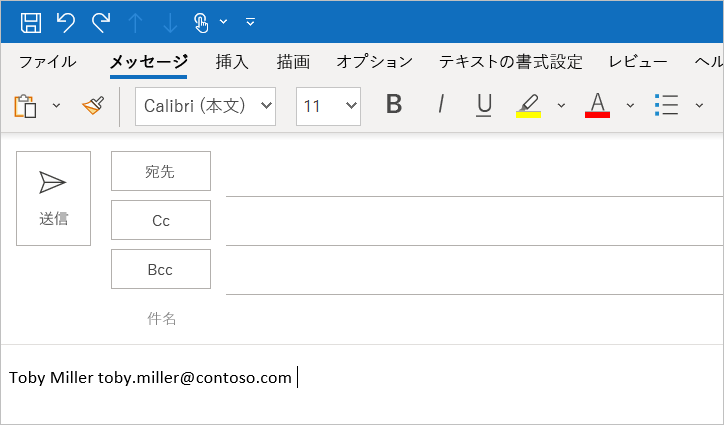

# <a name="use-the-yeoman-generator-to-create-an-office-add-in-that-uses-single-sign-on-preview"></a><span data-ttu-id="17e31-103">Yeoman ジェネレーターを使用して、シングル サインオンを使用する Office アドインを作成する (プレビュー)</span><span class="sxs-lookup"><span data-stu-id="17e31-103">Use the Yeoman generator to create an Office Add-in that uses single sign-on (preview)</span></span>

<span data-ttu-id="17e31-104">この記事では、可能な場合シングル サインオン (SSO) を使用し、SSO がサポートされていない場合は別のユーザー認証方法を使用する Excel、Outlook、Word、または PowerPoint 用の Office アドインを作成するプロセスを説明します。</span><span class="sxs-lookup"><span data-stu-id="17e31-104">In this article, you'll walk through the process of using the Yeoman generator to create an Office Add-in for Excel, Outlook, Word, or PowerPoint that uses single sign-on (SSO) when possible, and uses an alternate method of user authentication when SSO is not supported.</span></span>

> [!TIP]
> <span data-ttu-id="17e31-105">このクイック スタートを完了する前に、「[Office アドインのシングル サインオンを有効化する](../develop/sso-in-office-add-ins.md)」を参照して、Office アドインの SSO に関する基本的な概念を確認してください。</span><span class="sxs-lookup"><span data-stu-id="17e31-105">Before you attempt to complete this quick start, review [Enable single sign-on for Office Add-ins](../develop/sso-in-office-add-ins.md) to learn basic concepts about SSO in Office Add-ins.</span></span> 
 
<span data-ttu-id="17e31-106">Yeoman ジェネレーターは、Azure 内で SSO を構成するために必要な手順を自動化し、SSO を使用するために必要なコードを生成することで、SSO アドインの作成プロセスを簡素化します。</span><span class="sxs-lookup"><span data-stu-id="17e31-106">The Yeoman generator simplifies the process of creating an SSO add-in, by automating the steps required to configure SSO within Azure and generating the code that's necessary for an add-in to use SSO.</span></span> <span data-ttu-id="17e31-107">Yeoman ジェネレーターが自動化する手順を手動で完了する方法についての詳細は、「[シングル サインオンを使用する Node.js Office アドインを作成する](../develop/create-sso-office-add-ins-nodejs.md)」チュートリアルを参照してください。</span><span class="sxs-lookup"><span data-stu-id="17e31-107">For a detailed walkthrough that describes how to manually complete the steps that the Yeoman generator automates, see the [Create a Node.js Office Add-in that uses single sign-on](../develop/create-sso-office-add-ins-nodejs.md) tutorial.</span></span>

## <a name="prerequisites"></a><span data-ttu-id="17e31-108">前提条件</span><span class="sxs-lookup"><span data-stu-id="17e31-108">Prerequisites</span></span>

* <span data-ttu-id="17e31-109">[Node.js](https://nodejs.org) (最新 [LTS](https://nodejs.org/about/releases) バージョン)</span><span class="sxs-lookup"><span data-stu-id="17e31-109">[Node.js](https://nodejs.org) (the latest [LTS](https://nodejs.org/about/releases) version)</span></span>

* <span data-ttu-id="17e31-110">最新バージョンの [Yeoman](https://github.com/yeoman/yo) と [Office アドイン用の Yeoman ジェネレーター](https://github.com/OfficeDev/generator-office)。これらのツールをグローバルにインストールするには、コマンド プロンプトから次のコマンドを実行します。</span><span class="sxs-lookup"><span data-stu-id="17e31-110">The latest version of [Yeoman](https://github.com/yeoman/yo) and the [Yeoman generator for Office Add-ins](https://github.com/OfficeDev/generator-office). To install these tools globally, run the following command via the command prompt:</span></span>

    ```command&nbsp;line
    npm install -g yo generator-office
    ```

    [!include[note to update Yeoman generator](../includes/note-yeoman-generator-update.md)]

[!include[additional prerequisites](../includes/sso-tutorial-prereqs.md)]

* <span data-ttu-id="17e31-111">Mac を使用していて Azure CLI がコンピューターにインストールされていない場合は、[Homebrew](https://brew.sh/) をインストールする必要があります。</span><span class="sxs-lookup"><span data-stu-id="17e31-111">If you're using a Mac and don't have the Azure CLI installed on your machine, you must install [Homebrew](https://brew.sh/).</span></span> <span data-ttu-id="17e31-112">このクイック スタート中に実行する SSO 構成スクリプトは、Homebrew を使用して Azure CLI をインストールした後、Azure CLI を使用して Azure の SSO を構成します。</span><span class="sxs-lookup"><span data-stu-id="17e31-112">The SSO configuration script that you'll run during this quick start will use Homebrew to install the Azure CLI, and will then use the Azure CLI to configure SSO within Azure.</span></span>

## <a name="create-the-add-in-project"></a><span data-ttu-id="17e31-113">アドイン プロジェクトの作成</span><span class="sxs-lookup"><span data-stu-id="17e31-113">Create the add-in project</span></span>

> [!TIP]
> <span data-ttu-id="17e31-114">Yeoman ジェネレーターは、Excel、Outlook、Word、または PowerPoint 用の SSO が有効な Office アドインを作成でき、JavaScript または TypeScript のスクリプト タイプで作成できます。</span><span class="sxs-lookup"><span data-stu-id="17e31-114">The Yeoman generator can create an SSO-enabled Office Add-in for Excel, Outlook, Word, or PowerPoint, and can be created with script type of JavaScript or TypeScript.</span></span> <span data-ttu-id="17e31-115">次の手順では、`JavaScript` と `Excel` を指定しますが、使用しているシナリオに最適なスクリプト タイプと Office クライアント アプリケーションを選択する必要があります。</span><span class="sxs-lookup"><span data-stu-id="17e31-115">The following instructions specify `JavaScript` and `Excel`, but you should choose the script type and Office client application that best suits your scenario.</span></span>

[!include[Yeoman generator create project guidance](../includes/yo-office-command-guidance.md)]

- <span data-ttu-id="17e31-116">**Choose a project type: (プロジェクトの種類を選択)** `Office Add-in Task Pane project supporting single sign-on`</span><span class="sxs-lookup"><span data-stu-id="17e31-116">**Choose a project type:** `Office Add-in Task Pane project supporting single sign-on`</span></span>
- <span data-ttu-id="17e31-117">**Choose a script type: (スクリプトの種類を選択)** `Javascript`</span><span class="sxs-lookup"><span data-stu-id="17e31-117">**Choose a script type:** `Javascript`</span></span>
- <span data-ttu-id="17e31-118">**What would you want to name your add-in?: (アドインの名前を何にしますか)**</span><span class="sxs-lookup"><span data-stu-id="17e31-118">**What do you want to name your add-in?**</span></span> `My SSO Office Add-in`
- <span data-ttu-id="17e31-119">**Which Office client application would you like to support?: (どの Office クライアント アプリケーションをサポートしますか)**</span><span class="sxs-lookup"><span data-stu-id="17e31-119">**Which Office client application would you like to support?**</span></span> `Excel`


<span data-ttu-id="17e31-121">ウィザードを完了すると、ジェネレーターによってプロジェクトが作成されて、サポートしているノード コンポーネントがインストールされます。</span><span class="sxs-lookup"><span data-stu-id="17e31-121">After you complete the wizard, the generator creates the project and installs supporting Node components.</span></span>

[!include[Yeoman generator next steps](../includes/yo-office-next-steps.md)]

## <a name="explore-the-project"></a><span data-ttu-id="17e31-122">プロジェクトを確認する</span><span class="sxs-lookup"><span data-stu-id="17e31-122">Explore the project</span></span>

<span data-ttu-id="17e31-123">Yeoman ジェネレーターで作成したアドイン プロジェクトには、SSO が有効な作業ウィンドウ アドインのコードが含まれています。</span><span class="sxs-lookup"><span data-stu-id="17e31-123">The add-in project that you've created with the Yeoman generator contains code for an SSO-enabled task pane add-in.</span></span>

- <span data-ttu-id="17e31-124">プロジェクトのルートディレクトリにある **./ manifest.xml**ファイルは、アドインの設定と機能性を定義します。</span><span class="sxs-lookup"><span data-stu-id="17e31-124">The **./manifest.xml** file in the root directory of the project defines the settings and capabilities of the add-in.</span></span>

- <span data-ttu-id="17e31-125">**./src/taskpane/taskpane.html**ファイルには、作業ペイン用のHTMLマークアップが含まれています。</span><span class="sxs-lookup"><span data-stu-id="17e31-125">The **./src/taskpane/taskpane.html** file contains the HTML markup for the task pane.</span></span>
- <span data-ttu-id="17e31-126">**./src/taskpane/taskpane.css**ファイルには、作業ウィンドウ内のコンテンツに適用される CSS が含まれています。</span><span class="sxs-lookup"><span data-stu-id="17e31-126">The **./src/taskpane/taskpane.css** file contains the CSS that's applied to content in the task pane.</span></span>
- <span data-ttu-id="17e31-127">**./src/taskpane/taskpane.js**ファイルには、作業ウィンドウと Office のホスト アプリケーションの間のやり取りを容易にする Office JavaScript API コードが含まれています。</span><span class="sxs-lookup"><span data-stu-id="17e31-127">The **./src/taskpane/taskpane.js** file contains the Office JavaScript API code that facilitates interaction between the task pane and the Office host application.</span></span>

- <span data-ttu-id="17e31-128">**./src/helpers/documentHelper.js** ファイルは、Office JavaScript ライブラリを使用して、Microsoft Graph から Office ドキュメントにデータを追加します。</span><span class="sxs-lookup"><span data-stu-id="17e31-128">The **./src/helpers/documentHelper.js** file uses the Office JavaScript library to add the data from Microsoft Graph to the Office document.</span></span>
- <span data-ttu-id="17e31-129">**./src/helpers/fallbackauthdialog.html** ファイルは、フォールバック認証方法の JavaScript を読み込む UI を使用しないページです。</span><span class="sxs-lookup"><span data-stu-id="17e31-129">The **./src/helpers/fallbackauthdialog.html** file is the UI-less page that loads the fallback authentication method's JavaScript.</span></span>
- <span data-ttu-id="17e31-130">**./src/helpers/fallbackauthdialog.js** ファイルには、msal.js でユーザーにサインオンするフォールバック認証方法の JavaScript が含まれています。</span><span class="sxs-lookup"><span data-stu-id="17e31-130">The **./src/helpers/fallbackauthdialog.js** file contains the fallback authentication method's JavaScript that signs on the user with msal.js.</span></span>
- <span data-ttu-id="17e31-131">**./src/helpers/fallbackauthhelper.js** ファイルには、SSO 認証がサポートされていないシナリオでフォールバック認証方法を呼び出す作業ウィンドウの JavaScript が含まれています。</span><span class="sxs-lookup"><span data-stu-id="17e31-131">The **./src/helpers/fallbackauthhelper.js** file contains the task pane JavaScript that invokes the fallback authentication method in scenarios when SSO authentication is not supported.</span></span>
- <span data-ttu-id="17e31-132">**./src/helpers/ssoauthhelper.js** ファイルには、SSO API `getAccessToken` へのJavaScript 呼び出しが含まれ、ブートストラップ トークンの受信し、Microsoft Graph へのアクセス トークンのブートストラップ トークン交換の開始、データのための Microsoft Graph への呼び出しを行います。</span><span class="sxs-lookup"><span data-stu-id="17e31-132">The **./src/helpers/ssoauthhelper.js** file contains the JavaScript call to the SSO API, `getAccessToken`, receives the bootstrap token, initiates the swap of the bootstrap token for an access token to Microsoft Graph, and calls to Microsoft Graph for the data.</span></span>

- <span data-ttu-id="17e31-133">**./ENV** ファイルはプロジェクトのルート ディレクトリにあり、アドイン プロジェクトで使用される定数を定義します。</span><span class="sxs-lookup"><span data-stu-id="17e31-133">The **./ENV** file in the root directory of the project defines constants that are used by the add-in project.</span></span>
    > [!NOTE]
    > <span data-ttu-id="17e31-134">このファイルで定義されている定数の一部は、SSO プロセスを容易するために使用されます。</span><span class="sxs-lookup"><span data-stu-id="17e31-134">Some of the constants defined in this file are used to facilitate the SSO process.</span></span> <span data-ttu-id="17e31-135">このファイルの値を、特定のシナリオに合わせて更新できます。</span><span class="sxs-lookup"><span data-stu-id="17e31-135">You may want to update values in this file to match your specific scenario.</span></span> <span data-ttu-id="17e31-136">たとえば、アドインで `User.Read` 以外のものが必要な場合は、このファイルを更新して別の範囲を指定できます。</span><span class="sxs-lookup"><span data-stu-id="17e31-136">For example, you can update this file to specify a different scope, if your add-in requires something other than `User.Read`.</span></span>

## <a name="configure-sso"></a><span data-ttu-id="17e31-137">SSO を構成する</span><span class="sxs-lookup"><span data-stu-id="17e31-137">Configure SSO</span></span>

<span data-ttu-id="17e31-138">この時点では、アドイン プロジェクトが作成され、SSO プロセスを容易するために必要なコードが含まれています。</span><span class="sxs-lookup"><span data-stu-id="17e31-138">At this point, your add-in project has been created and contains the code that's necessary to facilitate the SSO process.</span></span> <span data-ttu-id="17e31-139">次の手順を完了して、アドインの SSO を構成します。</span><span class="sxs-lookup"><span data-stu-id="17e31-139">Next, complete the following steps to configure SSO for your add-in.</span></span>

1. <span data-ttu-id="17e31-140">プロジェクトのルート フォルダーに移動します。</span><span class="sxs-lookup"><span data-stu-id="17e31-140">Navigate to the root folder of the project.</span></span>

    ```command&nbsp;line
    cd "My SSO Office Add-in"
    ```

2. <span data-ttu-id="17e31-141">次のコマンドを実行して、アドインの SSO を構成します。</span><span class="sxs-lookup"><span data-stu-id="17e31-141">Run the following command to configure SSO for the add-in.</span></span>

    ```command&nbsp;line
    npm run configure-sso
    ```

    > [!WARNING]
    > <span data-ttu-id="17e31-142">このコマンドは、テナントが 2 要素認証を要求するように構成されている場合、失敗します。</span><span class="sxs-lookup"><span data-stu-id="17e31-142">This command will fail if your tenant is configured to require two-factor authentication.</span></span> <span data-ttu-id="17e31-143">このシナリオでは、「[シングル サインオンを使用する Node.js Office アドインを作成する](../develop/create-sso-office-add-ins-nodejs.md)」チュートリアルで説明されているように、Azure アプリの登録および SSO の構成手順を手動で完了する必要があります。</span><span class="sxs-lookup"><span data-stu-id="17e31-143">In this scenario, you'll need to manually complete the Azure app registration and SSO configuration steps, as described in the [Create a Node.js Office Add-in that uses single sign-on](../develop/create-sso-office-add-ins-nodejs.md) tutorial.</span></span>

3. <span data-ttu-id="17e31-144">Web ブラウザー ウィンドウが開き、Azure にサインインするように指示されます。</span><span class="sxs-lookup"><span data-stu-id="17e31-144">A web browser window will open and prompt you to sign in to Azure.</span></span> <span data-ttu-id="17e31-145">Office 365 管理者の資格情報を使用して Azure にサインインします。</span><span class="sxs-lookup"><span data-stu-id="17e31-145">Sign in to Azure using your Office 365 administrator credentials.</span></span> <span data-ttu-id="17e31-146">これらの資格情報を使用して Azure に新しいアプリケーションが登録され、SSO に必要な設定が構成されます。</span><span class="sxs-lookup"><span data-stu-id="17e31-146">These credentials will be used to register a new application in Azure and configure the settings required by SSO.</span></span>

    > [!NOTE]
    > <span data-ttu-id="17e31-147">この手順で、管理者以外の資格情報を使用して Azure にサインインした場合、`configure-sso` スクリプトは、組織内のユーザーにアドインの管理者の同意を提供しません。</span><span class="sxs-lookup"><span data-stu-id="17e31-147">If you sign in to Azure using non-administrator credentials during this step, the `configure-sso` script won't be able to provide administrator consent for the add-in to users within your organization.</span></span> <span data-ttu-id="17e31-148">そのため、SSO はアドインのユーザーは使用できず、サインインするように求められます。</span><span class="sxs-lookup"><span data-stu-id="17e31-148">SSO will therefore not be available to users of the add-in and they'll be prompted to sign-in.</span></span>

4. <span data-ttu-id="17e31-149">資格情報を入力したら、ブラウザー ウィンドウを閉じ、コマンド プロンプトに戻ります。</span><span class="sxs-lookup"><span data-stu-id="17e31-149">After you enter your credentials, close the browser window and return to the command prompt.</span></span> <span data-ttu-id="17e31-150">SSO の構成プロセスが続行されると、コンソールに書き込まれたステータス メッセージが表示されます。</span><span class="sxs-lookup"><span data-stu-id="17e31-150">As the SSO configuration process continues, you'll see status messages being written to the console.</span></span> <span data-ttu-id="17e31-151">コンソール メッセージで説明されているように、Yeoman ジェネレーターが作成したアドイン プロジェクト内のファイルは、SSO プロセスで必要なデータで自動的に更新されます。</span><span class="sxs-lookup"><span data-stu-id="17e31-151">As described in the console messages, files within the add-in project that the Yeoman generator created are automatically updated with data that's required by the SSO process.</span></span>

## <a name="try-it-out"></a><span data-ttu-id="17e31-152">試してみる</span><span class="sxs-lookup"><span data-stu-id="17e31-152">Try it out</span></span>

<span data-ttu-id="17e31-153">Excel、Word、または PowerPoint アドインを作成した場合は、次のセクションの手順を実行して試してください。 Outlook のアドインを作成した場合は、代わりに [Outlook](#outlook) セクションの手順を実行します。</span><span class="sxs-lookup"><span data-stu-id="17e31-153">If you've created an Excel, Word, or PowerPoint add-in, complete the steps in the following section to try it out. If you've created an Outlook add-in, complete the steps in the [Outlook](#outlook) section instead.</span></span>

### <a name="excel-word-and-powerpoint"></a><span data-ttu-id="17e31-154">Excel、Word、および PowerPoint</span><span class="sxs-lookup"><span data-stu-id="17e31-154">Excel, Word, and PowerPoint</span></span>

<span data-ttu-id="17e31-155">Excel、Word、または PowerPoint アドインを試すには、次の手順を実行します。</span><span class="sxs-lookup"><span data-stu-id="17e31-155">Complete the following steps to try out an Excel, Word, or PowerPoint add-in.</span></span>

1. <span data-ttu-id="17e31-156">SSO の構成プロセスが完了したら、次のコマンドを実行してプロジェクトを構築し、ローカル Web サーバーを起動して以前に選択した Office クライアント アプリケーションにアドインをサイドロードします。</span><span class="sxs-lookup"><span data-stu-id="17e31-156">When the SSO configuration process completes, run the following command to build the project, start the local web server, and sideload your add-in in the previously selected Office client application.</span></span>

    > [!NOTE]
    > <span data-ttu-id="17e31-157">開発の最中でも、OfficeアドインはHTTPではなくHTTPSを使用する必要があります。</span><span class="sxs-lookup"><span data-stu-id="17e31-157">Office Add-ins should use HTTPS, not HTTP, even when you are developing.</span></span> <span data-ttu-id="17e31-158">次のコマンドを実行した後に証明書をインストールするように求められた場合は、Yeoman ジェネレーターによって提供される証明書をインストールするプロンプトを受け入れます。</span><span class="sxs-lookup"><span data-stu-id="17e31-158">If you are prompted to install a certificate after you run the following command, accept the prompt to install the certificate that the Yeoman generator provides.</span></span>

    ```command&nbsp;line
    npm start
    ```

2. <span data-ttu-id="17e31-159">前のコマンド (Excel、Word、PowerPoint など) を実行したときに開く Office クライアント アプリケーションで、[前のセクション](#configure-sso)の手順 3 で SSO を構成している間に Azure の接続に使用した Office 365 管理者アカウントと同じ Office 365 組織のメンバーであるユーザーでサインインしていることを確認します。</span><span class="sxs-lookup"><span data-stu-id="17e31-159">In the Office client application that opens when you run the previous command (i.e., Excel, Word or PowerPoint), make sure that you're signed in with a user that's a member of the same Office 365 organization as the Office 365 administrator account that you used to connect to Azure while configuring SSO in step 3 of the [previous section](#configure-sso).</span></span> <span data-ttu-id="17e31-160">これにより、SSO を正常に実行するための適切な条件が確立されます。</span><span class="sxs-lookup"><span data-stu-id="17e31-160">Doing so establishes the appropriate conditions for SSO to succeed.</span></span> 

3. <span data-ttu-id="17e31-161">Office クライアント アプリケーションで、[**ホーム**] タブを選択し、リボンの [**作業ウィンドウの表示**] ボタンをクリックして、アドインの作業ウィンドウを開きます。</span><span class="sxs-lookup"><span data-stu-id="17e31-161">In the Office client application, choose the **Home** tab, and then choose the **Show Taskpane** button in the ribbon to open the add-in task pane.</span></span> <span data-ttu-id="17e31-162">次の画像は、Excel のこのボタンを示しています。</span><span class="sxs-lookup"><span data-stu-id="17e31-162">The following image shows this button in Excel.</span></span>

    

4. <span data-ttu-id="17e31-164">作業ウィンドウの下部にある [**マイ ユーザー プロファイルの情報を取得する**] ボタンを選択して、SSO プロセスを開始します。</span><span class="sxs-lookup"><span data-stu-id="17e31-164">At the bottom of the task pane, choose the **Get My User Profile Information** button to initiate the SSO process.</span></span> 

5. <span data-ttu-id="17e31-165">アドインの代わりにアクセス許可を要求するダイアログ ウィンドウが表示される場合は、SSO はシナリオでサポートされず、代わりにアドインが別のユーザー認証方法に戻っていることを意味します。</span><span class="sxs-lookup"><span data-stu-id="17e31-165">If a dialog window appears to request permissions on behalf of the add-in, this means that SSO is not supported for your scenario and the add-in has instead fallen back to an alternate method of user authentication.</span></span> <span data-ttu-id="17e31-166">これは、テナント管理者がアドインが Microsoft Graph にアクセスするための同意を与えていない場合、または有効な Microsoft アカウントまたは Office 365 (「職場または学校」) アカウントで Office にサインインしていない場合に発生することがあります。</span><span class="sxs-lookup"><span data-stu-id="17e31-166">This may occur when the tenant administrator hasn't granted consent for the add-in to access Microsoft Graph, or when the user isn't signed into Office with a valid Microsoft Account or Office 365 ("Work or School") account.</span></span> <span data-ttu-id="17e31-167">ダイアログ ウィンドウで [**同意する**] ボタンを選択して続行します。</span><span class="sxs-lookup"><span data-stu-id="17e31-167">Choose the **Accept** button in the dialog window to continue.</span></span>

    

    > [!NOTE]
    > <span data-ttu-id="17e31-169">ユーザーがこのアクセス許可の要求を受け入れると、今後再びプロンプトが表示されることはありません。</span><span class="sxs-lookup"><span data-stu-id="17e31-169">After a user accepts this permissions request, they won't be prompted again in the future.</span></span>

6. <span data-ttu-id="17e31-170">アドインは、サインインしたユーザーのプロファイル情報を取得し、ドキュメントに書き込みます。</span><span class="sxs-lookup"><span data-stu-id="17e31-170">The add-in retrieves profile information for the signed-in user and writes it to the document.</span></span> <span data-ttu-id="17e31-171">次の画像は、Excel ワークシートに書き込まれたプロファイル情報の例を示します。</span><span class="sxs-lookup"><span data-stu-id="17e31-171">The following image shows an example of profile information written to an Excel worksheet.</span></span>

    

### <a name="outlook"></a><span data-ttu-id="17e31-173">Outlook</span><span class="sxs-lookup"><span data-stu-id="17e31-173">Outlook</span></span>

<span data-ttu-id="17e31-174">Outlook アドインを試すには、次の手順を実行します。</span><span class="sxs-lookup"><span data-stu-id="17e31-174">Complete the following steps to try out an Outlook add-in.</span></span>

1. <span data-ttu-id="17e31-175">SSO 構成プロセスが完了したら、次のコマンドを実行してプロジェクトを構築し、ローカル Web サーバーを起動します。</span><span class="sxs-lookup"><span data-stu-id="17e31-175">When the SSO configuration process completes, run the following command to build the project and start the local web server.</span></span>

    > [!NOTE]
    > <span data-ttu-id="17e31-176">開発の最中でも、OfficeアドインはHTTPではなくHTTPSを使用する必要があります。</span><span class="sxs-lookup"><span data-stu-id="17e31-176">Office Add-ins should use HTTPS, not HTTP, even when you are developing.</span></span> <span data-ttu-id="17e31-177">次のコマンドを実行した後に証明書をインストールするように求められた場合は、Yeoman ジェネレーターによって提供される証明書をインストールするプロンプトを受け入れます。</span><span class="sxs-lookup"><span data-stu-id="17e31-177">If you are prompted to install a certificate after you run the following command, accept the prompt to install the certificate that the Yeoman generator provides.</span></span>

    ```command&nbsp;line
    npm start
    ```

2. <span data-ttu-id="17e31-178">「[テスト用に Outlook アドインをサイドロードする](/outlook/add-ins/sideload-outlook-add-ins-for-testing)」の手順に従って Outlook アドインをサイドロードします。</span><span class="sxs-lookup"><span data-stu-id="17e31-178">Follow the instructions in [Sideload Outlook add-ins for testing](/outlook/add-ins/sideload-outlook-add-ins-for-testing) to sideload the add-in in Outlook.</span></span> <span data-ttu-id="17e31-179">[前のセクション](#configure-sso)の手順 3 で SSO を構成している間に Azure の接続に使用した Office 365 管理者アカウントと同じ Office 365 組織のメンバーであるユーザーで Outlook にサインインしている必要があります。</span><span class="sxs-lookup"><span data-stu-id="17e31-179">Make sure that you're signed in to Outlook with a user that's a member of the same Office 365 organization as the Office 365 administrator account that you used to connect to Azure while configuring SSO in step 3 of the [previous section](#configure-sso).</span></span> <span data-ttu-id="17e31-180">これにより、SSO を正常に実行するための適切な条件が確立されます。</span><span class="sxs-lookup"><span data-stu-id="17e31-180">Doing so establishes the appropriate conditions for SSO to succeed.</span></span> 

3. <span data-ttu-id="17e31-181">Outlook で新しいメッセージを作成します。</span><span class="sxs-lookup"><span data-stu-id="17e31-181">In Outlook, compose a new message.</span></span>

4. <span data-ttu-id="17e31-182">[メッセージ作成] ウィンドウで、リボンの [**作業ウィンドウの表示**] ボタンを選択して、アドインの作業ウィンドウを開きます。</span><span class="sxs-lookup"><span data-stu-id="17e31-182">In the message compose window, choose the **Show Taskpane** button in the ribbon to open the add-in task pane.</span></span>

    

5. <span data-ttu-id="17e31-184">作業ウィンドウの下部にある [**マイ ユーザー プロファイルの情報を取得する**] ボタンを選択して、SSO プロセスを開始します。</span><span class="sxs-lookup"><span data-stu-id="17e31-184">At the bottom of the task pane, choose the **Get My User Profile Information** button to initiate the SSO process.</span></span> 

6. <span data-ttu-id="17e31-185">アドインの代わりにアクセス許可を要求するダイアログ ウィンドウが表示される場合は、SSO はシナリオでサポートされず、代わりにアドインが別のユーザー認証方法に戻っていることを意味します。</span><span class="sxs-lookup"><span data-stu-id="17e31-185">If a dialog window appears to request permissions on behalf of the add-in, this means that SSO is not supported for your scenario and the add-in has instead fallen back to an alternate method of user authentication.</span></span> <span data-ttu-id="17e31-186">これは、テナント管理者がアドインが Microsoft Graph にアクセスするための同意を与えていない場合、または有効な Microsoft アカウントまたは Office 365 (「職場または学校」) アカウントで Office にサインインしていない場合に発生することがあります。</span><span class="sxs-lookup"><span data-stu-id="17e31-186">This may occur when the tenant administrator hasn't granted consent for the add-in to access Microsoft Graph, or when the user isn't signed into Office with a valid Microsoft Account or Office 365 ("Work or School") account.</span></span> <span data-ttu-id="17e31-187">ダイアログ ウィンドウで [**同意する**] ボタンを選択して続行します。</span><span class="sxs-lookup"><span data-stu-id="17e31-187">Choose the **Accept** button in the dialog window to continue.</span></span>

    

    > [!NOTE]
    > <span data-ttu-id="17e31-189">ユーザーがこのアクセス許可の要求を受け入れると、今後再びプロンプトが表示されることはありません。</span><span class="sxs-lookup"><span data-stu-id="17e31-189">After a user accepts this permissions request, they won't be prompted again in the future.</span></span>

7. <span data-ttu-id="17e31-190">アドインは、サインインしたユーザーのプロファイル情報を取得し、メール メッセージの本文に書き込みます。</span><span class="sxs-lookup"><span data-stu-id="17e31-190">The add-in retrieves profile information for the signed-in user and writes it to the body of the email message.</span></span> 

    

## <a name="next-steps"></a><span data-ttu-id="17e31-192">次の手順</span><span class="sxs-lookup"><span data-stu-id="17e31-192">Next steps</span></span>

<span data-ttu-id="17e31-193">おめでとうございます。可能な場合 SSO を使用し、SSO がサポートされていない場合は別のユーザー認証方法を使用する作業ウィンドウ アドインを正常に作成しました。</span><span class="sxs-lookup"><span data-stu-id="17e31-193">Congratulations, you've successfully created a task pane add-in that uses SSO when possible, and uses an alternate method of user authentication when SSO is not supported.</span></span> <span data-ttu-id="17e31-194">Yeoman ジェネレーターが自動的に完了した SSO の構成手順、および SSO プロセスを容易にするコードの詳細については、「[シングル サインオンを使用する Node.js Office アドインを作成する](../develop/create-sso-office-add-ins-nodejs.md)」を参照してください。</span><span class="sxs-lookup"><span data-stu-id="17e31-194">To learn more about SSO configuration steps that the Yeoman generator completed automatically, and the code that facilitates the SSO process, see the [Create a Node.js Office Add-in that uses single sign-on](../develop/create-sso-office-add-ins-nodejs.md) tutorial.</span></span>

## <a name="see-also"></a><span data-ttu-id="17e31-195">関連項目</span><span class="sxs-lookup"><span data-stu-id="17e31-195">See also</span></span>

- [<span data-ttu-id="17e31-196">Office アドインのシングル サインオンを有効化する</span><span class="sxs-lookup"><span data-stu-id="17e31-196">Enable single sign-on for Office Add-ins</span></span>](../develop/sso-in-office-add-ins.md)
- [<span data-ttu-id="17e31-197">シングル サインオンを使用する Node.js Office アドインを作成する</span><span class="sxs-lookup"><span data-stu-id="17e31-197">Create a Node.js Office Add-in that uses single sign-on</span></span>](../develop/create-sso-office-add-ins-nodejs.md)
- [<span data-ttu-id="17e31-198">シングル サインオン (SSO) のエラー メッセージのトラブルシューティング</span><span class="sxs-lookup"><span data-stu-id="17e31-198">Troubleshoot error messages for single sign-on (SSO)</span></span>](../develop/troubleshoot-sso-in-office-add-ins.md)