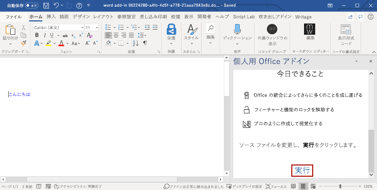

# <a name="build-your-first-word-task-pane-add-in"></a><span data-ttu-id="c935e-103">最初の Word の作業ウィンドウ アドインを作成する</span><span class="sxs-lookup"><span data-stu-id="c935e-103">Build your first Word task pane add-in</span></span>

<span data-ttu-id="c935e-104">_対象: Windows 用 Word 2016 以降、Word on iPad および Mac_</span><span class="sxs-lookup"><span data-stu-id="c935e-104">_Applies to: Word 2016 or later on Windows, Word for iPad, Word for Mac_</span></span>

<span data-ttu-id="c935e-105">この記事では、Word の作業ウィンドウ アドインを作成するプロセスを紹介します。</span><span class="sxs-lookup"><span data-stu-id="c935e-105">In this article, you'll walk through the process of building a Word task pane add-in.</span></span>

## <a name="create-the-add-in"></a><span data-ttu-id="c935e-106">アドインを作成する</span><span class="sxs-lookup"><span data-stu-id="c935e-106">Create the add-in</span></span>

[!include[Choose your editor](../includes/quickstart-choose-editor.md)]

# <a name="yeoman-generatortabyeomangenerator"></a>[<span data-ttu-id="c935e-107">Yeoman ジェネレーター</span><span class="sxs-lookup"><span data-stu-id="c935e-107">Yeoman generator</span></span>](#tab/yeomangenerator)

### <a name="prerequisites"></a><span data-ttu-id="c935e-108">前提条件</span><span class="sxs-lookup"><span data-stu-id="c935e-108">Prerequisites</span></span>

[!include[Yeoman generator prerequisites](../includes/quickstart-yo-prerequisites.md)]

### <a name="create-the-add-in-project"></a><span data-ttu-id="c935e-109">アドイン プロジェクトの作成</span><span class="sxs-lookup"><span data-stu-id="c935e-109">Create the add-in project</span></span>

[!include[note about Yeoman generator bug](../includes/note-yeoman-generator-bug-201908.md)]

<span data-ttu-id="c935e-110">Yeoman ジェネレーターを使用して、Word アドイン プロジェクトを作成します。</span><span class="sxs-lookup"><span data-stu-id="c935e-110">Use the Yeoman generator to create a Word add-in project.</span></span> <span data-ttu-id="c935e-111">次のコマンドを実行し、以下のプロンプトに応答します。</span><span class="sxs-lookup"><span data-stu-id="c935e-111">Run the following command and then answer the prompts as follows:</span></span>

```command&nbsp;line
yo office
```

- <span data-ttu-id="c935e-112">**Choose a project type: (プロジェクトの種類を選択)** `Office Add-in Task Pane project`</span><span class="sxs-lookup"><span data-stu-id="c935e-112">**Choose a project type:** `Office Add-in Task Pane project`</span></span>
- <span data-ttu-id="c935e-113">**Choose a script type: (スクリプトの種類を選択)** `Javascript`</span><span class="sxs-lookup"><span data-stu-id="c935e-113">**Choose a script type:** `Javascript`</span></span>
- <span data-ttu-id="c935e-114">**What would you want to name your add-in?: (アドインの名前を何にしますか)**</span><span class="sxs-lookup"><span data-stu-id="c935e-114">**What do you want to name your add-in?**</span></span> `my-office-add-in`
- <span data-ttu-id="c935e-115">**Which Office client application would you like to support?: (どの Office クライアント アプリケーションをサポートしますか)**</span><span class="sxs-lookup"><span data-stu-id="c935e-115">**Which Office client application would you like to support?**</span></span> `Word`

<span data-ttu-id="c935e-116">ウィザードを完了すると、ジェネレーターによってプロジェクトが作成されて、サポートしているノード コンポーネントがインストールされます。</span><span class="sxs-lookup"><span data-stu-id="c935e-116">After you complete the wizard, the generator will create the project and install supporting Node components.</span></span>

### <a name="explore-the-project"></a><span data-ttu-id="c935e-117">プロジェクトを確認する</span><span class="sxs-lookup"><span data-stu-id="c935e-117">Explore the project</span></span>

[!include[Yeoman generator add-in project components](../includes/yo-task-pane-project-components-js.md)]

### <a name="try-it-out"></a><span data-ttu-id="c935e-118">試してみる</span><span class="sxs-lookup"><span data-stu-id="c935e-118">Try it out</span></span>

1. <span data-ttu-id="c935e-119">プロジェクトのルート フォルダーに移動します。</span><span class="sxs-lookup"><span data-stu-id="c935e-119">Navigate to the root folder of the project.</span></span>

    ```command&nbsp;line
    cd "my-office-add-in"
    ```

2. <span data-ttu-id="c935e-120">以下の手順を実行し、ローカル Web サーバーを起動してアドインのサイドロードを行います。</span><span class="sxs-lookup"><span data-stu-id="c935e-120">Complete the following steps to start the local web server and sideload your add-in.</span></span>

    > [!NOTE]
    > <span data-ttu-id="c935e-121">開発の最中でも、OfficeアドインはHTTPではなくHTTPSを使用する必要があります。</span><span class="sxs-lookup"><span data-stu-id="c935e-121">Office Add-ins should use HTTPS, not HTTP, even when you are developing.</span></span> <span data-ttu-id="c935e-122">次のいずれかのコマンドを実行した後に証明書をインストールするように求められた場合は、Yeoman ジェネレーターによって提供される証明書をインストールするプロンプトを受け入れます。</span><span class="sxs-lookup"><span data-stu-id="c935e-122">If you are prompted to install a certificate after you run one of the following commands, accept the prompt to install the certificate that the Yeoman generator provides.</span></span>

    > [!TIP]
    > <span data-ttu-id="c935e-123">Mac でアドインをテストしている場合は、先に進む前に次のコマンドを実行してください。</span><span class="sxs-lookup"><span data-stu-id="c935e-123">If you're testing your add-in on Mac, run the following command before proceeding.</span></span> <span data-ttu-id="c935e-124">このコマンドを実行すると、ローカル Web サーバーが起動します。</span><span class="sxs-lookup"><span data-stu-id="c935e-124">When you run this command, the local web server will start.</span></span>
    >
    > ```command&nbsp;line
    > npm run dev-server
    > ```

    - <span data-ttu-id="c935e-125">Word でアドインをテストするには、プロジェクトのルート ディレクトリから次のコマンドを実行します。</span><span class="sxs-lookup"><span data-stu-id="c935e-125">To test your add-in in Word, run the following command in the root directory of your project.</span></span> <span data-ttu-id="c935e-126">ローカル Web サーバーが (まだ実行されていない場合) 起動し、アドインが読み込まれた Word が開きます。</span><span class="sxs-lookup"><span data-stu-id="c935e-126">This starts the local web server (if it's not already running) and opens Word with your add-in loaded.</span></span>

        ```command&nbsp;line
        npm start
        ```

    - <span data-ttu-id="c935e-127">ブラウザー上の Word でアドインをテストするには、プロジェクトのルート ディレクトリから次のコマンドを実行します。</span><span class="sxs-lookup"><span data-stu-id="c935e-127">To test your add-in in Word on a browser, run the following command in the root directory of your project.</span></span> <span data-ttu-id="c935e-128">このコマンドを実行すると、ローカル Web サーバーが起動します (まだ実行されていない場合)。</span><span class="sxs-lookup"><span data-stu-id="c935e-128">When you run this command, the local web server will start.</span></span>

        ```command&nbsp;line
        npm run start:web
        ```

        <span data-ttu-id="c935e-129">アドインを使用するには、Word on the web で新しいドキュメントを開き、「[Office on the web で Office アドインをサイドロードする](../testing/sideload-office-add-ins-for-testing.md#sideload-an-office-add-in-in-office-on-the-web)」の手順に従ってアドインをサイドロードします。</span><span class="sxs-lookup"><span data-stu-id="c935e-129">To use your add-in, open a new document in Word Online and then sideload your add-in by following the instructions in [Sideload Office Add-ins in Office Online](../testing/sideload-office-add-ins-for-testing.md#sideload-an-office-add-in-in-office-on-the-web).</span></span>

3. <span data-ttu-id="c935e-130">Word で、新規のドキュメントを開き、[**ホーム**] タブを選択し、リボンの [**作業ウィンドウの表示**] ボタンをクリックして、アドインの作業ウィンドウを開きます。</span><span class="sxs-lookup"><span data-stu-id="c935e-130">In Word, open a new document, choose the **Home** tab, and then choose the **Show Taskpane** button in the ribbon to open the add-in task pane.</span></span>

    ![[作業ウィンドウの表示] ボタンが強調表示されている Word アプリケーションのスクリーンショット](../images/word-quickstart-addin-2b.png)

4. <span data-ttu-id="c935e-132">作業ウィンドウの下部にある [**実行**] リンクを選択して、青のフォントで "Hello World" とテキストをドキュメントに追加します。</span><span class="sxs-lookup"><span data-stu-id="c935e-132">At the bottom of the task pane, choose the **Run** link to add the text "Hello World" to the document in blue font.</span></span>

    

# <a name="visual-studiotabvisualstudio"></a>[<span data-ttu-id="c935e-134">Visual Studio</span><span class="sxs-lookup"><span data-stu-id="c935e-134">Visual Studio</span></span>](#tab/visualstudio)

### <a name="prerequisites"></a><span data-ttu-id="c935e-135">前提条件</span><span class="sxs-lookup"><span data-stu-id="c935e-135">Prerequisites</span></span>

[!include[Quick Start prerequisites](../includes/quickstart-vs-prerequisites.md)]

### <a name="create-the-add-in-project"></a><span data-ttu-id="c935e-136">アドイン プロジェクトの作成</span><span class="sxs-lookup"><span data-stu-id="c935e-136">Create the add-in project</span></span>

1. <span data-ttu-id="c935e-137">[Visual Studio] メニュー バーで、**[ファイル]**  >  **[新規作成]**  >  **[プロジェクト]** の順に選択します。</span><span class="sxs-lookup"><span data-stu-id="c935e-137">On the Visual Studio menu bar, choose  **File** > **New** > **Project**.</span></span>

2. <span data-ttu-id="c935e-138">**[Visual C#]** または **[Visual Basic]** の下にあるプロジェクトの種類の一覧で、**[Office/SharePoint]** を展開して、**[アドイン]** を選択し、プロジェクトの種類として **[Word Web アドイン]** を選択します。</span><span class="sxs-lookup"><span data-stu-id="c935e-138">In the list of project types under **Visual C#** or **Visual Basic**, expand  **Office/SharePoint**, choose **Add-ins**, and then choose **Word Web Add-in** as the project type.</span></span> 

3. <span data-ttu-id="c935e-139">プロジェクトに名前を付けて、**[OK]** を選択します。</span><span class="sxs-lookup"><span data-stu-id="c935e-139">Name the project, and then choose **OK**.</span></span>

4. <span data-ttu-id="c935e-p106">Visual Studio によってソリューションとその 2 つのプロジェクトが作成され、**ソリューション エクスプローラー**に表示されます。**Home.html** ファイルが Visual Studio で開かれます。</span><span class="sxs-lookup"><span data-stu-id="c935e-p106">Visual Studio creates a solution and its two projects appear in **Solution Explorer**. The **Home.html** file opens in Visual Studio.</span></span>

### <a name="explore-the-visual-studio-solution"></a><span data-ttu-id="c935e-142">Visual Studio ソリューションについて理解する</span><span class="sxs-lookup"><span data-stu-id="c935e-142">Explore the Visual Studio solution</span></span>

[!include[Description of Visual Studio projects](../includes/quickstart-vs-solution.md)]

### <a name="update-the-code"></a><span data-ttu-id="c935e-143">コードを更新する</span><span class="sxs-lookup"><span data-stu-id="c935e-143">Update the code</span></span>

1. <span data-ttu-id="c935e-p107">**Home.html** では、アドインの作業ウィンドウにレンダリングされる HTML を指定します。 **Home.html** で、`<body>` 要素を次のマークアップに置き換えて、ファイルを保存します。</span><span class="sxs-lookup"><span data-stu-id="c935e-p107">**Home.html** specifies the HTML that will be rendered in the add-in's task pane. In **Home.html**, replace the `<body>` element with the following markup and save the file.</span></span>

    ```html
    <body>
        <div id="content-header">
            <div class="padding">
                <h1>Welcome</h1>
            </div>
        </div>
        <div id="content-main">
            <div class="padding">
                <p>Choose the buttons below to add boilerplate text to the document by using the Word JavaScript API.</p>
                <br />
                <h3>Try it out</h3>
                <button id="emerson">Add quote from Ralph Waldo Emerson</button>
                <br /><br />
                <button id="checkhov">Add quote from Anton Chekhov</button>
                <br /><br />
                <button id="proverb">Add Chinese proverb</button>
            </div>
        </div>
        <br />
        <div id="supportedVersion"/>
    </body>
    ```

2. <span data-ttu-id="c935e-p108">Web アプリケーション プロジェクトのルートにあるファイル **Home.js** を開きます。 このファイルは、アドイン用のスクリプトを指定します。 すべての内容を次のコードに置き換え、ファイルを保存します。</span><span class="sxs-lookup"><span data-stu-id="c935e-p108">Open the file **Home.js** in the root of the web application project. This file specifies the script for the add-in. Replace the entire contents with the following code and save the file.</span></span>

    ```js
    'use strict';

    (function () {

        Office.onReady(function() {
            // Office is ready
            $(document).ready(function () {
                // The document is ready
                // Use this to check whether the API is supported in the Word client.
                if (Office.context.requirements.isSetSupported('WordApi', '1.1')) {
                    // Do something that is only available via the new APIs
                    $('#emerson').click(insertEmersonQuoteAtSelection);
                    $('#checkhov').click(insertChekhovQuoteAtTheBeginning);
                    $('#proverb').click(insertChineseProverbAtTheEnd);
                    $('#supportedVersion').html('This code is using Word 2016 or later.');
                }
                else {
                    // Just letting you know that this code will not work with your version of Word.
                    $('#supportedVersion').html('This code requires Word 2016 or later.');
                }
            });
        });

        function insertEmersonQuoteAtSelection() {
            Word.run(function (context) {

                // Create a proxy object for the document.
                var thisDocument = context.document;

                // Queue a command to get the current selection.
                // Create a proxy range object for the selection.
                var range = thisDocument.getSelection();

                // Queue a command to replace the selected text.
                range.insertText('"Hitch your wagon to a star."\n', Word.InsertLocation.replace);

                // Synchronize the document state by executing the queued commands,
                // and return a promise to indicate task completion.
                return context.sync().then(function () {
                    console.log('Added a quote from Ralph Waldo Emerson.');
                });
            })
            .catch(function (error) {
                console.log('Error: ' + JSON.stringify(error));
                if (error instanceof OfficeExtension.Error) {
                    console.log('Debug info: ' + JSON.stringify(error.debugInfo));
                }
            });
        }

        function insertChekhovQuoteAtTheBeginning() {
            Word.run(function (context) {

                // Create a proxy object for the document body.
                var body = context.document.body;

                // Queue a command to insert text at the start of the document body.
                body.insertText('"Knowledge is of no value unless you put it into practice."\n', Word.InsertLocation.start);

                // Synchronize the document state by executing the queued commands,
                // and return a promise to indicate task completion.
                return context.sync().then(function () {
                    console.log('Added a quote from Anton Chekhov.');
                });
            })
            .catch(function (error) {
                console.log('Error: ' + JSON.stringify(error));
                if (error instanceof OfficeExtension.Error) {
                    console.log('Debug info: ' + JSON.stringify(error.debugInfo));
                }
            });
        }

        function insertChineseProverbAtTheEnd() {
            Word.run(function (context) {

                // Create a proxy object for the document body.
                var body = context.document.body;

                // Queue a command to insert text at the end of the document body.
                body.insertText('"To know the road ahead, ask those coming back."\n', Word.InsertLocation.end);

                // Synchronize the document state by executing the queued commands,
                // and return a promise to indicate task completion.
                return context.sync().then(function () {
                    console.log('Added a quote from a Chinese proverb.');
                });
            })
            .catch(function (error) {
                console.log('Error: ' + JSON.stringify(error));
                if (error instanceof OfficeExtension.Error) {
                    console.log('Debug info: ' + JSON.stringify(error.debugInfo));
                }
            });
        }
    })();
    ```

3. <span data-ttu-id="c935e-p109">Web アプリケーション プロジェクトのルートにあるファイル **Home.css** を開きます。 このファイルは、アドイン用のユーザー設定のスタイルを指定します。 すべての内容を次のコードに置き換え、ファイルを保存します。</span><span class="sxs-lookup"><span data-stu-id="c935e-p109">Open the file **Home.css** in the root of the web application project. This file specifies the custom styles for the add-in. Replace the entire contents with the following code and save the file.</span></span>

    ```css
    #content-header {
        background: #2a8dd4;
        color: #fff;
        position: absolute;
        top: 0;
        left: 0;
        width: 100%;
        height: 80px; 
        overflow: hidden;
    }

    #content-main {
        background: #fff;
        position: fixed;
        top: 80px;
        left: 0;
        right: 0;
        bottom: 0;
        overflow: auto;
    }

    .padding {
        padding: 15px;
    }
    ```

### <a name="update-the-manifest"></a><span data-ttu-id="c935e-152">マニフェストを更新する</span><span class="sxs-lookup"><span data-stu-id="c935e-152">Update the manifest</span></span>

1. <span data-ttu-id="c935e-153">アドイン プロジェクト内の XML マニフェスト ファイルを開きます。</span><span class="sxs-lookup"><span data-stu-id="c935e-153">Open the XML manifest file in the add-in project.</span></span> <span data-ttu-id="c935e-154">このファイルは、アドインの設定と機能を定義します。</span><span class="sxs-lookup"><span data-stu-id="c935e-154">This file defines the add-in's settings and capabilities.</span></span>

2. <span data-ttu-id="c935e-p111">`ProviderName` 要素にはプレースホルダー値が含まれています。 それを自分の名前に置き換えます。</span><span class="sxs-lookup"><span data-stu-id="c935e-p111">The `ProviderName` element has a placeholder value. Replace it with your name.</span></span>

3. <span data-ttu-id="c935e-p112">`DefaultValue` 要素の `DisplayName` 属性にはプレースホルダー値が含まれています。 これは、**My Office Add-in** に置き換えてください。</span><span class="sxs-lookup"><span data-stu-id="c935e-p112">The `DefaultValue` attribute of the `DisplayName` element has a placeholder. Replace it with **My Office Add-in**.</span></span>

4. <span data-ttu-id="c935e-p113">`DefaultValue` 要素の `Description` 属性にはプレースホルダー値が含まれています。 これは、**A task pane add-in for Word** に置き換えてください。</span><span class="sxs-lookup"><span data-stu-id="c935e-p113">The `DefaultValue` attribute of the `Description` element has a placeholder. Replace it with **A task pane add-in for Word**.</span></span>

5. <span data-ttu-id="c935e-161">ファイルを保存します。</span><span class="sxs-lookup"><span data-stu-id="c935e-161">Save the file.</span></span>

    ```xml
    ...
    <ProviderName>John Doe</ProviderName>
    <DefaultLocale>en-US</DefaultLocale>
    <!-- The display name of your add-in. Used on the store and various places of the Office UI such as the add-ins dialog. -->
    <DisplayName DefaultValue="My Office Add-in" />
    <Description DefaultValue="A task pane add-in for Word"/>
    ...
    ```

### <a name="try-it-out"></a><span data-ttu-id="c935e-162">試してみる</span><span class="sxs-lookup"><span data-stu-id="c935e-162">Try it out</span></span>

1. <span data-ttu-id="c935e-p114">Visual Studio を使用して、新しく作成した Word アドインをテストします。そのために、**F5** キーを押すか **[開始]** ボタンをクリックして、リボンに **[作業ウィンドウの表示]** アドイン ボタンが表示された Word を起動します。アドインは IIS 上でローカルにホストされます。</span><span class="sxs-lookup"><span data-stu-id="c935e-p114">Using Visual Studio, test the newly created Word add-in by pressing **F5** or choosing the **Start** button to launch Word with the **Show Taskpane** add-in button displayed in the ribbon. The add-in will be hosted locally on IIS.</span></span>

2. <span data-ttu-id="c935e-165">Word で **[ホーム]** タブを選択し、リボンの **[作業ウィンドウの表示]** ボタンをクリックして、アドインの作業ウィンドウを開きます。</span><span class="sxs-lookup"><span data-stu-id="c935e-165">In Word, choose the **Home** tab, and then choose the **Show Taskpane** button in the ribbon to open the add-in task pane.</span></span> <span data-ttu-id="c935e-166">(Office 365 バージョンではなく、パッケージ版の Office を使用している場合、カスタム ボタンはサポートされていません。</span><span class="sxs-lookup"><span data-stu-id="c935e-166">(If you are using the one-time purchase version of Office, instead of the Office 365 version, then custom buttons are not supported.</span></span> <span data-ttu-id="c935e-167">代わりに、作業ウィンドウがそのまま開きます)。</span><span class="sxs-lookup"><span data-stu-id="c935e-167">Instead, the task pane will open immediately.)</span></span>

    ![[作業ウィンドウの表示] ボタンが強調表示されている Word アプリケーションのスクリーンショット](../images/word-quickstart-addin-0.png)

3. <span data-ttu-id="c935e-169">作業ウィンドウで、いずれかのボタンを選択して文書に定型句を追加します。</span><span class="sxs-lookup"><span data-stu-id="c935e-169">In the task pane, choose any of the buttons to add boilerplate text to the document.</span></span>

    

---

## <a name="next-steps"></a><span data-ttu-id="c935e-171">次の手順</span><span class="sxs-lookup"><span data-stu-id="c935e-171">Next steps</span></span>

<span data-ttu-id="c935e-172">おめでとうございます。 Word の作業ウィンドウ アドインが正常に作成されました。</span><span class="sxs-lookup"><span data-stu-id="c935e-172">Congratulations, you've successfully created a Word task pane add-in!</span></span> <span data-ttu-id="c935e-173">次に、Word アドインの機能の詳細について説明します。Word アドインのチュートリアルに従って、より複雑なアドインをビルドします。</span><span class="sxs-lookup"><span data-stu-id="c935e-173">Next, learn more about the capabilities of a Word add-in and build a more complex add-in by following along with the Word add-in tutorial.</span></span>

> [!div class="nextstepaction"]
> [<span data-ttu-id="c935e-174">Word アドインのチュートリアル</span><span class="sxs-lookup"><span data-stu-id="c935e-174">Word add-in tutorial</span></span>](../tutorials/word-tutorial.md)

## <a name="see-also"></a><span data-ttu-id="c935e-175">関連項目</span><span class="sxs-lookup"><span data-stu-id="c935e-175">See also</span></span>

* [<span data-ttu-id="c935e-176">Word アドインの概要</span><span class="sxs-lookup"><span data-stu-id="c935e-176">Word add-ins overview</span></span>](../word/word-add-ins-programming-overview.md)
* [<span data-ttu-id="c935e-177">Word アドインのコード サンプル</span><span class="sxs-lookup"><span data-stu-id="c935e-177">Word add-in code samples</span></span>](https://developer.microsoft.com/ja-JP/office/gallery/?filterBy=Samples,Word)
* [<span data-ttu-id="c935e-178">Word JavaScript API リファレンス</span><span class="sxs-lookup"><span data-stu-id="c935e-178">Word JavaScript API reference</span></span>](/office/dev/add-ins/reference/overview/word-add-ins-reference-overview)
