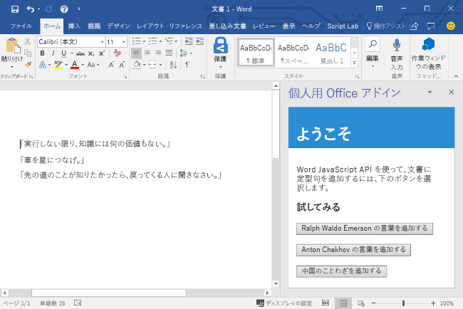
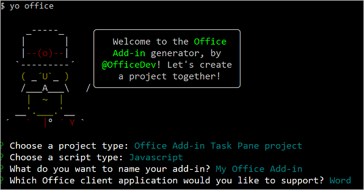

# <a name="build-your-first-word-task-pane-add-in"></a>最初の Word の作業ウィンドウ アドインを作成する

_適用対象: Windows 版 Word 2016 またはそれ以降、Word for iPad、Word for Mac_

この記事では、Word の作業ウィンドウ アドインを作成するプロセスを紹介します。

## <a name="create-the-add-in"></a>アドインを作成する

[!include[Choose your editor](../includes/quickstart-choose-editor.md)]

# <a name="visual-studiotabvisual-studio"></a>[Visual Studio](#tab/visual-studio)

### <a name="prerequisites"></a>前提条件

[!include[Quick Start prerequisites](../includes/quickstart-vs-prerequisites.md)]

### <a name="create-the-add-in-project"></a>アドイン プロジェクトの作成

1. [Visual Studio] メニュー バーで、**[ファイル]**  >  **[新規作成]**  >  **[プロジェクト]** の順に選択します。

2. **[Visual C#]** または **[Visual Basic]** の下にあるプロジェクトの種類の一覧で、**[Office/SharePoint]** を展開して、**[アドイン]** を選択し、プロジェクトの種類として **[Word Web アドイン]** を選択します。 

3. プロジェクトに名前を付けて、**[OK]** を選択します。

4. Visual Studio によってソリューションとその 2 つのプロジェクトが作成され、**ソリューション エクスプローラー**に表示されます。**Home.html** ファイルが Visual Studio で開かれます。

### <a name="explore-the-visual-studio-solution"></a>Visual Studio ソリューションについて理解する

[!include[Description of Visual Studio projects](../includes/quickstart-vs-solution.md)]

### <a name="update-the-code"></a>コードを更新する

1. **Home.html** では、アドインの作業ウィンドウにレンダリングされる HTML を指定します。 **Home.html** で、`<body>` 要素を次のマークアップに置き換えて、ファイルを保存します。

    ```html
    <body>
        <div id="content-header">
            <div class="padding">
                <h1>Welcome</h1>
            </div>
        </div>
        <div id="content-main">
            <div class="padding">
                <p>Choose the buttons below to add boilerplate text to the document by using the Word JavaScript API.</p>
                <br />
                <h3>Try it out</h3>
                <button id="emerson">Add quote from Ralph Waldo Emerson</button>
                <br /><br />
                <button id="checkhov">Add quote from Anton Chekhov</button>
                <br /><br />
                <button id="proverb">Add Chinese proverb</button>
            </div>
        </div>
        <br />
        <div id="supportedVersion"/>
    </body>
    ```

2. Web アプリケーション プロジェクトのルートにあるファイル **Home.js** を開きます。 このファイルは、アドイン用のスクリプトを指定します。 すべての内容を次のコードに置き換え、ファイルを保存します。

    ```js
    'use strict';

    (function () {

        Office.onReady(function() {
            // Office is ready
            $(document).ready(function () {
                // The document is ready
                // Use this to check whether the API is supported in the Word client.
                if (Office.context.requirements.isSetSupported('WordApi', 1.1)) {
                    // Do something that is only available via the new APIs
                    $('#emerson').click(insertEmersonQuoteAtSelection);
                    $('#checkhov').click(insertChekhovQuoteAtTheBeginning);
                    $('#proverb').click(insertChineseProverbAtTheEnd);
                    $('#supportedVersion').html('This code is using Word 2016 or later.');
                }
                else {
                    // Just letting you know that this code will not work with your version of Word.
                    $('#supportedVersion').html('This code requires Word 2016 or later.');
                }
            });
        });

        function insertEmersonQuoteAtSelection() {
            Word.run(function (context) {

                // Create a proxy object for the document.
                var thisDocument = context.document;

                // Queue a command to get the current selection.
                // Create a proxy range object for the selection.
                var range = thisDocument.getSelection();

                // Queue a command to replace the selected text.
                range.insertText('"Hitch your wagon to a star."\n', Word.InsertLocation.replace);

                // Synchronize the document state by executing the queued commands,
                // and return a promise to indicate task completion.
                return context.sync().then(function () {
                    console.log('Added a quote from Ralph Waldo Emerson.');
                });
            })
            .catch(function (error) {
                console.log('Error: ' + JSON.stringify(error));
                if (error instanceof OfficeExtension.Error) {
                    console.log('Debug info: ' + JSON.stringify(error.debugInfo));
                }
            });
        }

        function insertChekhovQuoteAtTheBeginning() {
            Word.run(function (context) {

                // Create a proxy object for the document body.
                var body = context.document.body;

                // Queue a command to insert text at the start of the document body.
                body.insertText('"Knowledge is of no value unless you put it into practice."\n', Word.InsertLocation.start);

                // Synchronize the document state by executing the queued commands,
                // and return a promise to indicate task completion.
                return context.sync().then(function () {
                    console.log('Added a quote from Anton Chekhov.');
                });
            })
            .catch(function (error) {
                console.log('Error: ' + JSON.stringify(error));
                if (error instanceof OfficeExtension.Error) {
                    console.log('Debug info: ' + JSON.stringify(error.debugInfo));
                }
            });
        }

        function insertChineseProverbAtTheEnd() {
            Word.run(function (context) {

                // Create a proxy object for the document body.
                var body = context.document.body;

                // Queue a command to insert text at the end of the document body.
                body.insertText('"To know the road ahead, ask those coming back."\n', Word.InsertLocation.end);

                // Synchronize the document state by executing the queued commands,
                // and return a promise to indicate task completion.
                return context.sync().then(function () {
                    console.log('Added a quote from a Chinese proverb.');
                });
            })
            .catch(function (error) {
                console.log('Error: ' + JSON.stringify(error));
                if (error instanceof OfficeExtension.Error) {
                    console.log('Debug info: ' + JSON.stringify(error.debugInfo));
                }
            });
        }
    })();
    ```

3. Web アプリケーション プロジェクトのルートにあるファイル **Home.css** を開きます。 このファイルは、アドイン用のユーザー設定のスタイルを指定します。 すべての内容を次のコードに置き換え、ファイルを保存します。

    ```css
    #content-header {
        background: #2a8dd4;
        color: #fff;
        position: absolute;
        top: 0;
        left: 0;
        width: 100%;
        height: 80px; 
        overflow: hidden;
    }

    #content-main {
        background: #fff;
        position: fixed;
        top: 80px;
        left: 0;
        right: 0;
        bottom: 0;
        overflow: auto;
    }

    .padding {
        padding: 15px;
    }
    ```

### <a name="update-the-manifest"></a>マニフェストを更新する

1. アドイン プロジェクト内の XML マニフェスト ファイルを開きます。 このファイルは、アドインの設定と機能を定義します。

2. `ProviderName` 要素にはプレースホルダー値が含まれています。 それを自分の名前に置き換えます。

3. `DefaultValue` 要素の `DisplayName` 属性にはプレースホルダー値が含まれています。 これは、**My Office Add-in** に置き換えてください。

4. `DefaultValue` 要素の `Description` 属性にはプレースホルダー値が含まれています。 これは、**A task pane add-in for Word** に置き換えてください。

5. ファイルを保存します。

    ```xml
    ...
    <ProviderName>John Doe</ProviderName>
    <DefaultLocale>en-US</DefaultLocale>
    <!-- The display name of your add-in. Used on the store and various places of the Office UI such as the add-ins dialog. -->
    <DisplayName DefaultValue="My Office Add-in" />
    <Description DefaultValue="A task pane add-in for Word"/>
    ...
    ```

### <a name="try-it-out"></a>試してみる

1. Visual Studio を使用して、新しく作成した Word アドインをテストします。そのために、**F5** キーを押すか **[開始]** ボタンをクリックして、リボンに **[作業ウィンドウの表示]** アドイン ボタンが表示された Word を起動します。アドインは IIS 上でローカルにホストされます。

2. Word で **[ホーム]** タブを選択し、リボンの **[作業ウィンドウの表示]** ボタンをクリックして、アドインの作業ウィンドウを開きます。 (Office 365 バージョンではなく、パッケージ版の Office を使用している場合、カスタム ボタンはサポートされていません。 代わりに、作業ウィンドウがそのまま開きます)。

    ![[作業ウィンドウの表示] ボタンが強調表示されている Word アプリケーションのスクリーンショット](../images/word-quickstart-addin-0.png)

3. 作業ウィンドウで、いずれかのボタンを選択して文書に定型句を追加します。

    

# <a name="any-editortabvisual-studio-code"></a>[任意のエディター](#tab/visual-studio-code)

### <a name="prerequisites"></a>前提条件

[!include[Yeoman generator prerequisites](../includes/quickstart-yo-prerequisites.md)]

### <a name="create-the-add-in-project"></a>アドイン プロジェクトの作成

1. Yeoman ジェネレーターを使用して、Word アドイン プロジェクトを作成します。 次のコマンドを実行し、以下のプロンプトに応答します。

    ```command&nbsp;line
    yo office
    ```

    - **Choose a project type: (プロジェクトの種類を選択)** `Office Add-in Task Pane project`
    - **Choose a script type: (スクリプトの種類を選択)** `Javascript`
    - **What would you want to name your add-in?: (アドインの名前を何にしますか)** `My Office Add-in`
    - **Which Office client application would you like to support?: (どの Office クライアント アプリケーションをサポートしますか)** `Word`

    

    ウィザードを完了すると、ジェネレーターによってプロジェクトが作成されて、サポートしているノード コンポーネントがインストールされます。

2. プロジェクトのルート フォルダーに移動します。

    ```command&nbsp;line
    cd "My Office Add-in"
    ```

### <a name="explore-the-project"></a>プロジェクトを確認する

[!include[Yeoman generator add-in project components](../includes/yo-task-pane-project-components-js.md)]

### <a name="try-it-out"></a>試してみる

1. 以下の手順を実行し、ローカル Web サーバーを起動してアドインのサイドロードを行います。

    > [!NOTE]
    > 開発の最中でも、OfficeアドインはHTTPではなくHTTPSを使用する必要があります。 次のいずれかのコマンドを実行した後に証明書をインストールするように求められた場合は、Yeoman ジェネレーターによって提供される証明書をインストールするプロンプトを受け入れます。

    > [!TIP]
    > Mac でアドインをテストしている場合は、先に進む前に次のコマンドを実行してください。 このコマンドを実行すると、ローカル Web サーバーが起動します。
    >
    > ```command&nbsp;line
    > npm run dev-server
    > ```

    - Word でアドインをテストするには、プロジェクトのルート ディレクトリから次のコマンドを実行します。 このコマンドを実行すると、ローカル Web サーバーが起動し (既に実行されていない場合)、アドインが読み込まれたときに Word が開きます。

        ```command&nbsp;line
        npm start
        ```

    - Word Online でアドインをテストするには、プロジェクトのルート ディレクトリから次のコマンドを実行します。 このコマンドを実行すると、ローカル Web サーバーが起動します (まだ実行されていない場合)。

        ```command&nbsp;line
        npm run start:web
        ```

        アドインを使用するには、Word Online で新しいドキュメントを開き、「[Office Online で Office アドインをサイドロードする](../testing/sideload-office-add-ins-for-testing.md#sideload-an-office-add-in-in-office-online)」の手順に従ってアドインをサイドロードします。

2. Word で、新規のドキュメントを開き、[**ホーム**] タブを選択し、リボンの [**作業ウィンドウの表示**] ボタンをクリックして、アドインの作業ウィンドウを開きます。

    ![[作業ウィンドウの表示] ボタンが強調表示されている Word アプリケーションのスクリーンショット](../images/word-quickstart-addin-2b.png)

3. 作業ウィンドウの下部にある [**実行**] リンクを選択して、青のフォントで "Hello World" とテキストをドキュメントに追加します。

    

---

## <a name="next-steps"></a>次の手順

おめでとうございます。 Word の作業ウィンドウ アドインが正常に作成されました。 次に、Word アドインの機能の詳細について説明します。Word アドインのチュートリアルに従って、より複雑なアドインをビルドします。

> [!div class="nextstepaction"]
> [Word アドインのチュートリアル](../tutorials/word-tutorial.md)

## <a name="see-also"></a>関連項目

* [Word アドインの概要](../word/word-add-ins-programming-overview.md)
* 
  [Word アドインのコード サンプル](https://developer.microsoft.com/ja-JP/office/gallery/?filterBy=Samples,Word)
* [Word JavaScript API リファレンス](/office/dev/add-ins/reference/overview/word-add-ins-reference-overview)
