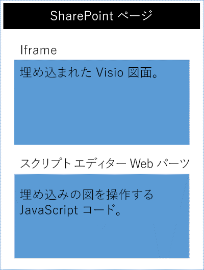

# <a name="visio-javascript-api-overview"></a><span data-ttu-id="67e2c-102">Visio JavaScript API の概要</span><span class="sxs-lookup"><span data-stu-id="67e2c-102">Visio JavaScript API overview</span></span>

<span data-ttu-id="67e2c-103">Visio JavaScript API を使うと、SharePoint Online で Visio 図面を埋め込むことができます。</span><span class="sxs-lookup"><span data-stu-id="67e2c-103">You can use the Visio JavaScript APIs to embed Visio diagrams in SharePoint Online.</span></span> <span data-ttu-id="67e2c-104">埋め込んだ Visio 図面は、SharePoint ドキュメント ライブラリに保存され、SharePoint ページに表示されます。</span><span class="sxs-lookup"><span data-stu-id="67e2c-104">An embedded Visio diagram is a diagram that is stored in a SharePoint document library and displayed on a SharePoint page.</span></span> <span data-ttu-id="67e2c-105">Visio 図面を埋め込むには、その図面を HTML の`<iframe>` 要素に表示します。</span><span class="sxs-lookup"><span data-stu-id="67e2c-105">To embed a Visio diagram, display it in an HTML `<iframe>` element.</span></span> <span data-ttu-id="67e2c-106">そうすると、Visio JavaScript API を使用して、プログラムで埋め込み済みの図面を使った作業ができるようになります。</span><span class="sxs-lookup"><span data-stu-id="67e2c-106">Then you can use Visio JavaScript APIs to programmatically work with the embedded diagram.</span></span>




<span data-ttu-id="67e2c-108">Visio JavaScript API を使用して、次のことを行えます。</span><span class="sxs-lookup"><span data-stu-id="67e2c-108">You can use the Visio JavaScript APIs to:</span></span>

* <span data-ttu-id="67e2c-109">ページや図形などの Visio 図面の要素を操作する。</span><span class="sxs-lookup"><span data-stu-id="67e2c-109">Interact with Visio diagram elements like pages and shapes.</span></span>
* <span data-ttu-id="67e2c-110">Visio 図面のキャンバスにビジュアル マークアップを作成する。</span><span class="sxs-lookup"><span data-stu-id="67e2c-110">Create visual markup on the Visio diagram canvas.</span></span>
* <span data-ttu-id="67e2c-111">図面の中でのマウス イベントのカスタム ハンドラーを記述する。</span><span class="sxs-lookup"><span data-stu-id="67e2c-111">Write custom handlers for mouse events within the drawing.</span></span>
* <span data-ttu-id="67e2c-112">図形テキスト、図形データ、およびハイパーリンクなどの図面データをソリューションに公開する。</span><span class="sxs-lookup"><span data-stu-id="67e2c-112">Expose diagram data, such as shape text, shape data, and hyperlinks, to your solution.</span></span>

<span data-ttu-id="67e2c-p102">この記事では、Visio Online で Visio JavaScript API を使って SharePoint Online のソリューションをビルドする方法について説明します。また、**EmbeddedSession**、**RequestContext**、JavaScript プロキシ オブジェクトなどの API、および **sync()**、**Visio.run()**、**load()** のメソッドを使用するために知っておくべき主な概念について紹介します。コード例により、これらの概念を適用する方法を示します。</span><span class="sxs-lookup"><span data-stu-id="67e2c-p102">This article describes how to use the Visio JavaScript APIs with Visio Online to build your solutions for SharePoint Online. It introduces key concepts that are fundamental to using the APIs, such as **EmbeddedSession**, **RequestContext**, and JavaScript proxy objects, and the **sync()**, **Visio.run()**, and **load()** methods. The code examples show you how to apply these concepts.</span></span>

## <a name="embeddedsession"></a><span data-ttu-id="67e2c-116">EmbeddedSession</span><span class="sxs-lookup"><span data-stu-id="67e2c-116">EmbeddedSession</span></span>

<span data-ttu-id="67e2c-117">EmbeddedSession オブジェクトは、開発者のフレームと Visio Online のフレーム間の通信を初期化します。</span><span class="sxs-lookup"><span data-stu-id="67e2c-117">The EmbeddedSession object initializes communication between the developer frame and the Visio Online frame.</span></span>

```js
var session = new OfficeExtension.EmbeddedSession(url, { id: "embed-iframe",container: document.getElementById("iframeHost") });
session.init().then(function () {
    window.console.log("Session successfully initialized");
});
```

## <a name="visiorunsession-functioncontext--batch-"></a><span data-ttu-id="67e2c-118">Visio.run(session, function(context) { batch })</span><span class="sxs-lookup"><span data-stu-id="67e2c-118">Visio.run(session, function(context) { batch })</span></span>

<span data-ttu-id="67e2c-119">**Visio.run()** は、Visio オブジェクト モデルに対してアクションを実行するバッチ スクリプトを実行します。</span><span class="sxs-lookup"><span data-stu-id="67e2c-119">**Visio.run()** executes a batch script that performs actions on the Visio object model.</span></span> <span data-ttu-id="67e2c-120">このバッチ コマンドには、JavaScript のローカル プロキシ オブジェクトの定義と、ローカル オブジェクトと Visio オブジェクトの間で状態を同期し、解決される約束を返す **sync()** メソッドが含まれます。</span><span class="sxs-lookup"><span data-stu-id="67e2c-120">The batch commands include definitions of local JavaScript proxy objects and **sync()** methods that synchronize the state between local and Visio objects and promise resolution.</span></span> <span data-ttu-id="67e2c-121">**Visio.run()** で要求をバッチ処理する利点は、約束が解決されるときに、実行中に割り当てられたすべての追跡ページ オブジェクトが自動的に解放されることです。</span><span class="sxs-lookup"><span data-stu-id="67e2c-121">The advantage of batching requests in **Visio.run()** is that when the promise is resolved, any tracked page objects that were allocated during the execution will be automatically released.</span></span>

<span data-ttu-id="67e2c-122">run メソッドはセッションと RequestContext オブジェクトを取り込み、promise (通常は **context.sync()** の結果) を返します。</span><span class="sxs-lookup"><span data-stu-id="67e2c-122">The run method takes in session and RequestContext object and returns a promise (typically, just the result of **context.sync()**).</span></span> <span data-ttu-id="67e2c-123">バッチ操作は **Visio.run()** の外部で実行することができます。</span><span class="sxs-lookup"><span data-stu-id="67e2c-123">It is possible to run the batch operation outside of the **Visio.run()**.</span></span> <span data-ttu-id="67e2c-124">ただし、このようなシナリオでは、ページ オブジェクトの参照は、手動で追跡および管理する必要があります。</span><span class="sxs-lookup"><span data-stu-id="67e2c-124">However, in such a scenario, any page object references needs to be manually tracked and managed.</span></span>

## <a name="requestcontext"></a><span data-ttu-id="67e2c-125">RequestContext</span><span class="sxs-lookup"><span data-stu-id="67e2c-125">RequestContext</span></span>

<span data-ttu-id="67e2c-126">RequestContext オブジェクトは、Visio アプリケーションへの要求を容易にします。</span><span class="sxs-lookup"><span data-stu-id="67e2c-126">The RequestContext object facilitates requests to the Visio application.</span></span> <span data-ttu-id="67e2c-127">開発者のフレームと Visio Online アプリケーションは、異なる 2 つの iframe で実行されるため、開発者のフレームから Visio およびページや図形などの関連するオブジェクトへのアクセスを取得する RequestContext オブジェクト (次の例の内容を含む) が必要です。</span><span class="sxs-lookup"><span data-stu-id="67e2c-127">Because the developer frame and the Visio Online application run in two different iframes, the RequestContext object (context in next example) is required to get access to Visio and related objects such as pages and shapes, from the developer frame.</span></span>

```js
function hideToolbars() {
    Visio.run(session, function(context){
        var app = context.document.application;
        app.showToolbars = false;
        return context.sync().then(function () {
            window.console.log("Toolbars Hidden");
        });
    }).catch(function(error)
    {
        window.console.log("Error: " + error);
    });
};
```

## <a name="proxy-objects"></a><span data-ttu-id="67e2c-128">プロキシ オブジェクト</span><span class="sxs-lookup"><span data-stu-id="67e2c-128">Proxy objects</span></span>

<span data-ttu-id="67e2c-p106">アドインで宣言され使用される Visio の JavaScript オブジェクトは、Visio 図面の実際のオブジェクトのプロキシ オブジェクトになります。プロキシ オブジェクトで実行されたすべてのアクションは、Visio では認識されません。また、Visio ドキュメントの状態は、ドキュメントの状態が同期されるまでプロキシ オブジェクトで認識されません。ドキュメントの状態は、`context.sync()` の実行時に同期されます。</span><span class="sxs-lookup"><span data-stu-id="67e2c-p106">The Visio JavaScript objects declared and used in an add-in are proxy objects for the real objects in a Visio document. All actions taken on proxy objects are not realized in Visio, and the state of the Visio document is not realized in the proxy objects until the document state has been synchronized. The document state is synchronized when `context.sync()` is run.</span></span>

<span data-ttu-id="67e2c-132">たとえば、ローカルの JavaScript オブジェクト getActivePage は、選択されたページを参照するように宣言されています。</span><span class="sxs-lookup"><span data-stu-id="67e2c-132">For example, the local JavaScript object getActivePage is declared to reference the selected page.</span></span> <span data-ttu-id="67e2c-133">これは、このオブジェクトのプロパティと呼び出しメソッドの設定をキューに登録するために使用できます。</span><span class="sxs-lookup"><span data-stu-id="67e2c-133">This can be used to queue the setting of its properties and invoking methods.</span></span> <span data-ttu-id="67e2c-134">**sync()** メソッドが実行されるまで、これらのオブジェクトのアクションは認識されません。</span><span class="sxs-lookup"><span data-stu-id="67e2c-134">The actions on such objects are not realized until the **sync()** method is run.</span></span>

```js
var activePage = context.document.getActivePage();
```

## <a name="sync"></a><span data-ttu-id="67e2c-135">sync()</span><span class="sxs-lookup"><span data-stu-id="67e2c-135">sync()</span></span>

<span data-ttu-id="67e2c-136">**sync()** メソッドは、Visio 内の JavaScript のプロキシ オブジェクトと実際のオブジェクトの間で状態を同期させます。これは、コンテキストでキューに入れられた指示の実行と、ユーザーのコードで使用するために読み込まれた Office オブジェクトのプロパティを取得することで同期させます。</span><span class="sxs-lookup"><span data-stu-id="67e2c-136">The **sync()** method synchronizes the state between JavaScript proxy objects and real objects in Visio by executing instructions queued on the context and retrieving properties of loaded Office objects for use in your code.</span></span> <span data-ttu-id="67e2c-137">このメソッドは、同期処理が完了したときに解決される promise を返します。</span><span class="sxs-lookup"><span data-stu-id="67e2c-137">This method returns a promise, which is resolved when synchronization is complete.</span></span> 

## <a name="load"></a><span data-ttu-id="67e2c-138">load()</span><span class="sxs-lookup"><span data-stu-id="67e2c-138">load()</span></span>

<span data-ttu-id="67e2c-p109">**load()** メソッドは、アドインの JavaScript レイヤーで作成されたプロキシ オブジェクトに設定を取り込むために使用されます。ドキュメントなどのオブジェクトを取得しようとすると、まず JavaScript レイヤーでローカル プロキシ オブジェクトが作成されます。このようなオブジェクトは、そのプロパティと呼び出しメソッドの設定をキューに登録するために使用できます。しかし、オブジェクトのプロパティや関係を読み取るためには、最初に **load()** メソッドと **sync()** メソッドを呼び出す必要があります。load() メソッドは、**sync()** メソッドが呼び出されたときに読み込まれる必要があるプロパティと関係を取り込みます。</span><span class="sxs-lookup"><span data-stu-id="67e2c-p109">The **load()** method is used to fill in the proxy objects created in the add-in JavaScript layer. When trying to retrieve an object such as a document, a local proxy object is created first in the JavaScript layer. Such an object can be used to queue the setting of its properties and invoking methods. However, for reading object properties or relations, the **load()** and **sync()** methods need to be invoked first. The load() method takes in the properties and relations that need to be loaded when the **sync()** method is called.</span></span>

<span data-ttu-id="67e2c-144">以下に示すのは **load()** メソッドの構文です。</span><span class="sxs-lookup"><span data-stu-id="67e2c-144">The following shows the syntax for the **load()** method.</span></span>

```js
object.load(string: properties); //or object.load(array: properties); //or object.load({loadOption});
```

1. <span data-ttu-id="67e2c-145">**properties** は、読み込まれるプロパティ名の一覧で、コンマ区切りの文字列または名前の配列として指定されます。</span><span class="sxs-lookup"><span data-stu-id="67e2c-145">**properties** is the list of property names to be loaded, specified as comma-delimited strings or array of names.</span></span> <span data-ttu-id="67e2c-146">詳細については、各オブジェクトの下の **.load()** メソッドを参照してください。</span><span class="sxs-lookup"><span data-stu-id="67e2c-146">See **.load()** methods under each object for details.</span></span>

2. <span data-ttu-id="67e2c-p111">**loadOption** は、selection、expansion、top、skip の各オプションについて説明するオブジェクトを指定します。詳細については、オブジェクトの読み込みの[オプション](/javascript/api/office/officeextension.loadoption)を参照してください。</span><span class="sxs-lookup"><span data-stu-id="67e2c-p111">**loadOption** specifies an object that describes the selection, expansion, top, and skip options. See object load [options](/javascript/api/office/officeextension.loadoption) for details.</span></span>

## <a name="example-printing-all-shapes-text-in-active-page"></a><span data-ttu-id="67e2c-149">例: アクティブ ページですべての図形テキストを印刷する</span><span class="sxs-lookup"><span data-stu-id="67e2c-149">Example: Printing all shapes text in active page</span></span>

<span data-ttu-id="67e2c-150">次の例では、図形の配列オブジェクトから図形テキストの値を印刷する方法を示します。</span><span class="sxs-lookup"><span data-stu-id="67e2c-150">The following example shows you how to print shape text value from an array shapes object.</span></span>
<span data-ttu-id="67e2c-151">**Visio.run()** メソッドには、命令のバッチが含まれています。</span><span class="sxs-lookup"><span data-stu-id="67e2c-151">The **Visio.run()** method contains a batch of instructions.</span></span> <span data-ttu-id="67e2c-152">このバッチの一部として、作業中のドキュメントの図形を参照するプロキシ オブジェクトが作成されます。</span><span class="sxs-lookup"><span data-stu-id="67e2c-152">As part of this batch, a proxy object is created that references shapes on the active document.</span></span>

<span data-ttu-id="67e2c-153">これらのすべてのコマンドがキューに登録され、**context.sync()** が呼び出されたときに実行されます。</span><span class="sxs-lookup"><span data-stu-id="67e2c-153">All these commands are queued and run when **context.sync()** is called.</span></span> <span data-ttu-id="67e2c-154">**sync()** メソッドが返す promise は、このメソッドを他の操作とチェーンにするために使用できます。</span><span class="sxs-lookup"><span data-stu-id="67e2c-154">The **sync()** method returns a promise that can be used to chain it with other operations.</span></span>

```js
Visio.run(session, function (context) {
    var page = context.document.getActivePage();
    var shapes = page.shapes;
    shapes.load();
    return context.sync().then(function () {
        for(var i=0; i<shapes.items.length;i++) {
            var shape = shapes.items[i];
            window.console.log("Shape Text: " + shape.text );
        }
    });
}).catch(function(error) {
    window.console.log("Error: " + error);
    if (error instanceof OfficeExtension.Error) {
        window.console.log ("Debug info: " + JSON.stringify(error.debugInfo));
    }
});
```

## <a name="error-messages"></a><span data-ttu-id="67e2c-155">エラー メッセージ</span><span class="sxs-lookup"><span data-stu-id="67e2c-155">Error messages</span></span>

<span data-ttu-id="67e2c-p114">エラーは、コードとメッセージで構成される error オブジェクトを使用して返されます。次の表は、発生する可能性があるエラー状態の一覧を示しています。</span><span class="sxs-lookup"><span data-stu-id="67e2c-p114">Errors are returned using an error object that consists of a code and a message. The following table provides a list of possible error conditions that can occur.</span></span>

| <span data-ttu-id="67e2c-158">error.code</span><span class="sxs-lookup"><span data-stu-id="67e2c-158">error.code</span></span>            | <span data-ttu-id="67e2c-159">error.message</span><span class="sxs-lookup"><span data-stu-id="67e2c-159">error.message</span></span> |
|-----------------------|----------------------------------------------------------------|
| <span data-ttu-id="67e2c-160">InvalidArgument</span><span class="sxs-lookup"><span data-stu-id="67e2c-160">InvalidArgument</span></span>       | <span data-ttu-id="67e2c-161">引数が無効であるか、存在しません。または形式が正しくありません。</span><span class="sxs-lookup"><span data-stu-id="67e2c-161">The argument is invalid or missing or has an incorrect format.</span></span> |
| <span data-ttu-id="67e2c-162">GeneralException</span><span class="sxs-lookup"><span data-stu-id="67e2c-162">GeneralException</span></span>      | <span data-ttu-id="67e2c-163">要求の処理中に内部エラーが発生しました。</span><span class="sxs-lookup"><span data-stu-id="67e2c-163">There was an internal error while processing the request.</span></span> |
| <span data-ttu-id="67e2c-164">NotImplemented</span><span class="sxs-lookup"><span data-stu-id="67e2c-164">NotImplemented</span></span>        | <span data-ttu-id="67e2c-165">要求された機能は実装されていません。</span><span class="sxs-lookup"><span data-stu-id="67e2c-165">The requested feature isn't implemented.</span></span>  |
| <span data-ttu-id="67e2c-166">UnsupportedOperation</span><span class="sxs-lookup"><span data-stu-id="67e2c-166">UnsupportedOperation</span></span>  | <span data-ttu-id="67e2c-167">試行中の操作はサポートされていません。</span><span class="sxs-lookup"><span data-stu-id="67e2c-167">The operation being attempted is not supported.</span></span> |
| <span data-ttu-id="67e2c-168">AccessDenied</span><span class="sxs-lookup"><span data-stu-id="67e2c-168">AccessDenied</span></span>          | <span data-ttu-id="67e2c-169">要求された操作を実行できません。</span><span class="sxs-lookup"><span data-stu-id="67e2c-169">You cannot perform the requested operation.</span></span> |
| <span data-ttu-id="67e2c-170">ItemNotFound</span><span class="sxs-lookup"><span data-stu-id="67e2c-170">ItemNotFound</span></span>          | <span data-ttu-id="67e2c-171">要求されたリソースは存在しません。</span><span class="sxs-lookup"><span data-stu-id="67e2c-171">The requested resource doesn't exist.</span></span> |

## <a name="get-started"></a><span data-ttu-id="67e2c-172">作業の開始</span><span class="sxs-lookup"><span data-stu-id="67e2c-172">Get started</span></span>

<span data-ttu-id="67e2c-173">このセクションの例を使用して作業を開始できます。</span><span class="sxs-lookup"><span data-stu-id="67e2c-173">You can use the example in this section to get started.</span></span> <span data-ttu-id="67e2c-174">この例では、プログラムを使用して Visio 図面で選択した形の図形のテキストを表示する方法を表示します。</span><span class="sxs-lookup"><span data-stu-id="67e2c-174">This example shows you how to programmatically display the shape text of the selected shape in a Visio diagram.</span></span> <span data-ttu-id="67e2c-175">最初に、SharePoint Online で通常のページを作成するか、既存のページを編集します。</span><span class="sxs-lookup"><span data-stu-id="67e2c-175">To begin, create a classic page in SharePoint Online or edit an existing page.</span></span> <span data-ttu-id="67e2c-176">スクリプト エディターの Web パーツをページに追加し、次のコードをコピーして貼り付けます。</span><span class="sxs-lookup"><span data-stu-id="67e2c-176">Add a script editor webpart on the page and copy-paste the following code.</span></span>

```js
<script src='https://appsforoffice.microsoft.com/embedded/1.0/visio-web-embedded.js' type='text/javascript'></script>

Enter Visio File Url:<br/>
<script language="javascript">
document.write("<input type='text' id='fileUrl' size='120'/>");
document.write("<input type='button' value='InitEmbeddedFrame' onclick='initEmbeddedFrame()' />");
document.write("<br />");
document.write("<input type='button' value='SelectedShapeText' onclick='getSelectedShapeText()' />");
document.write("<textarea id='ResultOutput' style='width:350px;height:60px'> </textarea>");
document.write("<div id='iframeHost' />");

let session; // Global variable to store the session and pass it afterwards in Visio.run()
var textArea;
// Loads the Visio application and Initializes communication between developer frame and Visio online frame
function initEmbeddedFrame() {
    textArea = document.getElementById('ResultOutput');
    var url = document.getElementById('fileUrl').value;
    if (!url) {
        window.alert("File URL should not be empty");
    }
    // APIs are enabled for EmbedView action only.
    url = url.replace("action=view","action=embedview");
    url = url.replace("action=interactivepreview","action=embedview");
    url = url.replace("action=default","action=embedview");
    url = url.replace("action=edit","action=embedview");
  
    session = new OfficeExtension.EmbeddedSession(url, { id: "embed-iframe",container: document.getElementById("iframeHost") });
    return session.init().then(function () {
        // Initialization is successful
        textArea.value  = "Initialization is successful";
    });
}

// Code for getting selected Shape Text using the shapes collection object
function getSelectedShapeText() {
    Visio.run(session, function (context) {
        var page = context.document.getActivePage();
        var shapes = page.shapes;
        shapes.load();
        return context.sync().then(function () {
            textArea.value = "Please select a Shape in the Diagram";
            for(var i=0; i<shapes.items.length;i++) {
                var shape = shapes.items[i];
                if ( shape.select == true) {
                    textArea.value = shape.text;
                    return;
                }
            }
        });
    }).catch(function(error) {
        textArea.value = "Error: ";
        if (error instanceof OfficeExtension.Error) {
            textArea.value += "Debug info: " + JSON.stringify(error.debugInfo);
        }
    });
}
</script>
```

<span data-ttu-id="67e2c-177">次に、作業する Visio 図面の URL が必要になります。</span><span class="sxs-lookup"><span data-stu-id="67e2c-177">After that, all you need is the URL of a Visio diagram that you want to work with.</span></span> <span data-ttu-id="67e2c-178">Visio 図面を SharePoint Online にアップロードし、Visio Online で開きます。</span><span class="sxs-lookup"><span data-stu-id="67e2c-178">Just upload the Visio diagram to SharePoint Online and open it in Visio Online.</span></span> <span data-ttu-id="67e2c-179">そこから [埋め込み] ダイアログ ボックスを開き、上の例の埋め込み URL を使用します。</span><span class="sxs-lookup"><span data-stu-id="67e2c-179">From there, open the Embed dialog and use the Embed URL in the above example.</span></span>

![[埋め込み] ダイアログ ボックスから Visio ファイル URL をコピーする](../images/Visio-embed-url.png)

<span data-ttu-id="67e2c-181">Visio Online を編集モードで使用している場合、**[ファイル]** > **[共有]** > **[埋め込み]** を選択し、[埋め込み] ダイアログを開きます。</span><span class="sxs-lookup"><span data-stu-id="67e2c-181">If you are using Visio Online in Edit mode, open the Embed dialog by choosing **File** > **Share** > **Embed**.</span></span> <span data-ttu-id="67e2c-182">Visio Online を表示モードで使用している場合には、[...]、**[埋め込み]** の順に選択して [埋め込み] ダイアログを開きます。</span><span class="sxs-lookup"><span data-stu-id="67e2c-182">If you are using Visio Online in View mode, open the Embed dialog by choosing '...' and then **Embed**.</span></span>

## <a name="open-api-specifications"></a><span data-ttu-id="67e2c-183">Open API の仕様</span><span class="sxs-lookup"><span data-stu-id="67e2c-183">Open API specifications</span></span>

<span data-ttu-id="67e2c-p118">新しい API の設計と開発にあたり、[Open API の仕様](../openspec.md)ページでこれらに対するフィードバックの提供が可能になります。パイプラインの新機能をご確認いただき、設計の仕様に関する情報をお寄せください。</span><span class="sxs-lookup"><span data-stu-id="67e2c-p118">As we design and develop new APIs, we'll make them available for your feedback on our [Open API specifications](../openspec.md) page. Find out what new features are in the pipeline, and provide your input on our design specifications.</span></span>

## <a name="visio-javascript-api-reference"></a><span data-ttu-id="67e2c-186">Visio JavaScript API リファレンス</span><span class="sxs-lookup"><span data-stu-id="67e2c-186">Visio JavaScript API reference</span></span>

<span data-ttu-id="67e2c-187">Visio JavaScript API の詳細については、[Visio JavaScript API リファレンス ドキュメント](/javascript/api/visio)に関するページを参照してください。</span><span class="sxs-lookup"><span data-stu-id="67e2c-187">For detailed information about Visio JavaScript API, see the [Visio JavaScript API reference documentation](/javascript/api/visio).</span></span>
