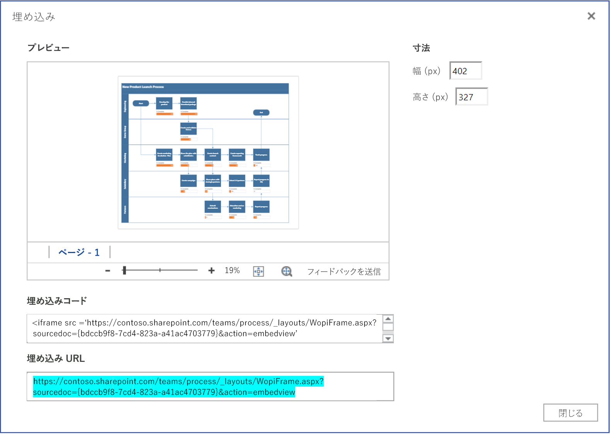

# <a name="visio-javascript-api-overview"></a>Visio JavaScript API の概要

Visio JavaScript API を使ってSharePoint オンライン で Visio のダイアグラムを埋め込むことができます。 埋め込まれた Visio のダイアグラムは、SharePoint ドキュメント ライブラリに保存され、SharePoint ページに表示されます。 Visio のダイアグラムを HTML `<iframe>` 要素に表示して埋め込みます。 そうすると、Visio JavaScript API を使用して、プログラムで埋め込まれたダイアグラムを使った作業ができるようになります。


Visio JavaScript API を使用して次のことができるようになります。

* ページや図形などの Visio ダイアグラムの要素を使って操作する。
* Visioダイアグラムのキャンバスにビジュアル マークアップを作成する。
* 図面の中でのマウス イベント用のカスタム ハンドラーを記述する。
* 図形テキスト、図形データ、およびハイパーリンクなどのダイアグラムのデータをソリューションに公開する。

ここでは、Visio オンラインで Visio JavaScript API を使って SharePoint オンライン のソリューションをビルドする方法について説明します。また、 **EmbeddedSession**、 **RequestContext**、JavaScript プロキシ オブジェクトなどの API、および **sync()**、 **Visio.run()**、 **load()** のメソッドを使用するための根本的な概念について紹介します。コード例により、これらの概念を適用する方法を示します。

## <a name="embeddedsession"></a>EmbeddedSession

EmbeddedSession オブジェクトは、開発者のフレームと Visio Online のフレームの間の通信を初期化します。

```js
var session = new OfficeExtension.EmbeddedSession(url, { id: "embed-iframe",container: document.getElementById("iframeHost") });
session.init().then(function () {
    window.console.log("Session successfully initialized");
});
```

## <a name="visiorunsession-functioncontext--batch-"></a>Visio.run(session, function(context) { batch })

**Visio.run()** は、Visio オブジェクト モデルに対して作用するバッチ スクリプトを実行します。 バッチ コマンドには、JavaScript のローカル プロキシ オブジェクトの定義と、ローカル オブジェクトと Visio オブジェクトの間で状態を同期し、promise　レゾリューションの **sync()** メソッドが含まれます。  **Visio.run()** で要求をバッチ処理する利点は、promiseが返されるときに、実行中に割り当てられた追跡ページ オブジェクトが自動的に解放されることです。

run メソッドはセッションと RequestContext オブジェクトを取り込み、promise（通常は**context.sync()** の結果)を返します。 バッチ操作は **Visio.run()** の外部で実行することができます。 ただし、この場合、ページ オブジェクトの参照は、手動で追跡および管理する必要があります。

## <a name="requestcontext"></a>RequestContext

RequestContext オブジェクトは、Visio アプリケーションへのリクエストを簡単にするものです。 開発者のフレームと Visio Online アプリケーションは、異なる 2 つの iframe で実行されるため、開発者のフレームから Visio およびページや図形などの関連するオブジェクトへのアクセスを取得する RequestContext オブジェクト (次の例の内容を含む) が必要です。

```js
function hideToolbars() {
    Visio.run(session, function(context){
        var app = context.document.application;
        app.showToolbars = false;
        return context.sync().then(function () {
            window.console.log("Toolbars Hidden");
        });
    }).catch(function(error)
    {
        window.console.log("Error: " + error);
    });
};
```

## <a name="proxy-objects"></a>プロキシ オブジェクト

アドインで申告され使用される Visio の JavaScript オブジェクトは、Visio ドキュメント内の実際のオブジェクトのためのプロキシ オブジェクトになります。プロキシ オブジェクトで実行されたすべてのアクションは、Visio では認識されません。また、Visio ドキュメントの状態は、ドキュメントの状態が同期されるまでプロキシ オブジェクトで認識されません。ドキュメントの状態は、 `context.sync()` の実行時に同期されます。

たとえば、ローカルの JavaScript オブジェクトの getActivePage は、選択したページを参照するよう表示されます。 これは、オブジェクトのプロパティの設定およびメソッドの呼び出しをキューに入れるために使用します。  **sync()** メソッドが実行されるまで、これらのオブジェクトのアクションは認識されません。

```js
var activePage = context.document.getActivePage();
```

## <a name="sync"></a>sync()

 **sync()** メソッドは、Visio内のJavaScript のプロキシ オブジェクトと 実際のオブジェクトの間で状態を同期させます。これは、コンテキストでキューに入れられた指示の実行と、ユーザーのコードで使用するために読み込まれた Office オブジェクトのプロパティを検索することで同期させます。 このメソッドは、同期処理が完了したときに解決されるpromiseを返します。 

## <a name="load"></a>load()

 **load()** メソッドは、アドインの JavaScript レイヤーで作成されたプロキシ オブジェクトに埋めるために使用します。ドキュメントなどのオブジェクトを検索する場合、まず JavaScript レイヤーでローカル プロキシ オブジェクトが作成されます。このようなオブジェクトは、そのプロパティの設定とメソッドの呼び出しをキューに登録するために使用されます。ただし、オブジェクトのプロパティや関係を読み取りには、最初に **load()** メソッドと**sync()** メソッドを呼び出す必要があります。 load() メソッドは、 **sync()** メソッドが呼び出されたときに読み込まれる必要があるプロパティと関係を取り込みます。

 **load()** メソッドの構文を以下に示します。

```js
object.load(string: properties); //or object.load(array: properties); //or object.load({loadOption});
```

1. **プロパティ** は、読み込まれるプロパティ名の一覧で、コンマ区切りの文字列または名前の配列として指定されます。 詳細については、各オブジェクトの下の **.load()** メソッドを参照してください。

2. **loadOption** は、選択、拡大、トップ、スキップ の各オプションについて説明するオブジェクトを指定します。詳細については、オブジェクトの読み込みの[オプション](/javascript/api/office/officeextension.loadoption)を参照してください。

## <a name="example-printing-all-shapes-text-in-active-page"></a>例: アクティブ ページですべての図形テキストを印刷する

次の例では、図形の配列オブジェクトから図形テキストの値を印刷する方法を説明します。
 **Visio.run()** メソッドには、指示のバッチが含まれています。 このバッチの一部として、作業中のドキュメントの図形を参照するプロキシ オブジェクトが作成されます。

すべてのコマンドはキューに登録され、 **context.sync()** が呼び出されたときに実行されます。  **sync()** メソッドが返すpromiseは、このメソッドを他の操作とリンクするために使用することができます。

```js
Visio.run(session, function (context) {
    var page = context.document.getActivePage();
    var shapes = page.shapes;
    shapes.load();
    return context.sync().then(function () {
        for(var i=0; i<shapes.items.length;i++) {
            var shape = shapes.items[i];
            window.console.log("Shape Text: " + shape.text );
        }
    });
}).catch(function(error) {
    window.console.log("Error: " + error);
    if (error instanceof OfficeExtension.Error) {
        window.console.log ("Debug info: " + JSON.stringify(error.debugInfo));
    }
});
```

## <a name="error-messages"></a>エラー メッセージ

エラーは、コードとメッセージで構成される エラー オブジェクトを使用して返されます。次の表は、発生する可能性があるエラー状態の一覧を示しています。

| error.code            | error.message |
|-----------------------|----------------------------------------------------------------|
| InvalidArgument       | 引数が無効であるか、存在しません。または形式が正しくありません。 |
| GeneralException      | リクエストの処理中に内部エラーが発生しました。 |
| NotImplemented        | リクエストされた機能は実装されていません。  |
| UnsupportedOperation  | 試行中の操作はサポートされていません。 |
| AccessDenied          | リクエストされた操作は実行されません。 |
| ItemNotFound          | 要求されたリソースは存在しません。 |

## <a name="get-started"></a>はじめてみよう

このセクションの例を使用して、実際に試してみましょう。 この例では、プログラムを使用して Visio のダイアグラムで選択した形の図形のテキストを表示する方法を表示します。 まずは、SharePoint Online で通常のページを作成するか、既存のページを編集します。 スクリプト エディターの web パーツをページに追加し、次のコードをコピー＆ペーストします。

```js
<script src='https://appsforoffice.microsoft.com/embedded/1.0/visio-web-embedded.js' type='text/javascript'></script>

Enter Visio File Url:<br/>
<script language="javascript">
document.write("<input type='text' id='fileUrl' size='120'/>");
document.write("<input type='button' value='InitEmbeddedFrame' onclick='initEmbeddedFrame()' />");
document.write("<br />");
document.write("<input type='button' value='SelectedShapeText' onclick='getSelectedShapeText()' />");
document.write("<textarea id='ResultOutput' style='width:350px;height:60px'> </textarea>");
document.write("<div id='iframeHost' />");

let session; // Global variable to store the session and pass it afterwards in Visio.run()
var textArea;
// Loads the Visio application and Initializes communication between developer frame and Visio online frame
function initEmbeddedFrame() {
    textArea = document.getElementById('ResultOutput');
    var url = document.getElementById('fileUrl').value;
    if (!url) {
        window.alert("File URL should not be empty");
    }
    // APIs are enabled for EmbedView action only.
    url = url.replace("action=view","action=embedview");
    url = url.replace("action=interactivepreview","action=embedview");
    url = url.replace("action=default","action=embedview");
    url = url.replace("action=edit","action=embedview");
  
    session = new OfficeExtension.EmbeddedSession(url, { id: "embed-iframe",container: document.getElementById("iframeHost") });
    return session.init().then(function () {
        // Initialization is successful
        textArea.value  = "Initialization is successful";
    });
}

// Code for getting selected Shape Text using the shapes collection object
function getSelectedShapeText() {
    Visio.run(session, function (context) {
        var page = context.document.getActivePage();
        var shapes = page.shapes;
        shapes.load();
        return context.sync().then(function () {
            textArea.value = "Please select a Shape in the Diagram";
            for(var i=0; i<shapes.items.length;i++) {
                var shape = shapes.items[i];
                if ( shape.select == true) {
                    textArea.value = shape.text;
                    return;
                }
            }
        });
    }).catch(function(error) {
        textArea.value = "Error: ";
        if (error instanceof OfficeExtension.Error) {
            textArea.value += "Debug info: " + JSON.stringify(error.debugInfo);
        }
    });
}
</script>
```

次に、作業する Visio ダイアグラムの URL が必要になります。 Visio ダイアグラムを SharePoint オンライン にアップロードし、 Visio Online で開きます。 そこから埋め込みダイアログ ボックスを開き、上の例の埋め込み URL を使用します。



Visio Onlineを編集モードで使用している場合は、**[File]** > **[Share]** > **[Embed]** を選択し、埋め込みダイアログを開きます。 Visio Onlineをビュー モードで使用している場合は、［...］の後 **［埋め込み］** を選択し、埋め込みダイアログを開きます。

## <a name="open-api-specifications"></a>Open API の仕様

新しい API の設計と開発にあたり、 [「Open API の仕様」](../openspec.md) ページでフィードバックが可能になります。パイプラインの新機能をご確認いただき、設計の仕様に関する情報をお寄せください。

## <a name="visio-javascript-api-reference"></a>Visio JavaScript API リファレンス

Visio JavaScript API の詳細情報については、 [「Visio JavaScript API リファレンス ドキュメント」](/javascript/api/visio) を参照してください。
