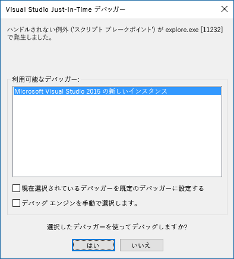

# 作業ウィンドウからデバッガーをアタッチする

Office 2016 for Windows のビルド 77xx.xxxx 以降では、作業ウィンドウからデバッガーをアタッチすることができます。デバッガーのアタッチ機能によって、デバッガーが適切な Internet Explorer プロセスに直接アタッチされます。デバッガーは、Yeoman Generator、Visual Studio Code、node.js、Angular、その他のツールのどれを使用しているかに関係なくアタッチすることができます。 

**デバッガーのアタッチ** ツールを起動するのには、作業ウィンドウの右上隅を選択して**パーソナリティ** メニューを有効にします (以下の図の赤い円で示す通り)。   

> [!NOTE]
> - 現在サポートされているデバッガー ツールは、[Update 3](https://msdn.microsoft.com/library/mt752379.aspx) 以降を適用した [Visual Studio 2015](https://www.visualstudio.com/downloads/) だけです。Visual Studio をインストールしていない場合、**デバッガーのアタッチ** オプションを選択しても何も起こりません。   
> - **[デバッガーのアタッチ]** ツールでデバッグできるのは、クライアント側の JavaScript だけです。 Node.js サーバーなど、サーバー側のコードをデバッグするには、多くのオプションがあります。 Visual Studio Code でデバッグするための詳しい方法については、「[VS Code で Node.js をデバッグする](https://code.visualstudio.com/docs/nodejs/nodejs-debugging)」を参照してください。 Visual Studio Code を使用していない場合は、「Node.js のデバッグ」または「{サーバー名} のデバッグ」で検索してください。

![[デバッガーのアタッチ] メニューのスクリーンショット](../images/attach-debugger.png)

**デバッガーのアタッチ** を選択するこれにより、次の図のように、**Visual Studio Just-in-Time デバッガー** ダイアログ ボックスが起動します。 

Visual Studio では、**ソリューション エクスプローラー**内にコード ファイルが表示されます。   Visual Studio でデバッグするコードの行にブレークポイントを設定できます。

> [!NOTE]
> [パーソナリティ] メニューが表示されない場合は、Visual Studio を使用してアドインをデバッグできます。 Office で作業ウィンドウ アドインが開いていることを確認してから、次の手順を実行します。

> 1. Visual Studio で、**[デバッグ]** > **[プロセスにアタッチ]** の順に選択します。
> 2. **[プロセスにアタッチ]** で、利用可能なすべての Iexplore.exe プロセスを選択して、**[アタッチ]** を選択します。

Visual Studio でのデバッグの詳細については、以下を参照してください。

-   DOM Explorer を Visual Studio で起動して使用するには、ブログ記事「[新しいプロジェクト テンプレートを使って見栄えの良い Office 用アプリをビルドする](https://blogs.msdn.microsoft.com/officeapps/2013/04/16/building-great-looking-apps-for-office-using-the-new-project-templates)」の[ヒントとコツ](https://blogs.msdn.microsoft.com/officeapps/2013/04/16/building-great-looking-apps-for-office-using-the-new-project-templates/#tips_tricks) セクションのヒント 4 を参照してください。
-   ブレークポイントの設定については、「[ブレークポイントの使用](https://docs.microsoft.com/visualstudio/debugger/using-breakpoints?view=vs-2015)」を参照してください。
-   F12 を使用するには、「[F12 開発者ツールの使用](https://docs.microsoft.com/previous-versions/windows/internet-explorer/ie-developer/samples/bg182326(v=vs.85))」を参照してください。

## 関連項目

- [Visual Studio での Office アドインの作成とデバッグ](../develop/create-and-debug-office-add-ins-in-visual-studio.md)
- [Office アドインを発行する](../publish/publish.md)
