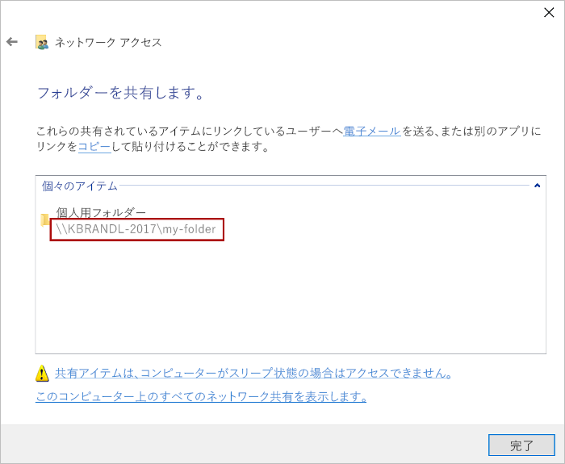

# <a name="sideload-office-add-ins-for-testing-from-a-network-share"></a>ネットワーク共有Officeテスト用にアドインをサイドロードする

マニフェストをネットワーク ファイル共有Office Windows発行することにより、Office クライアントで Office アドインをテストできます (以下の手順を参照)。 この展開オプションは、ローカル ホストでの開発とテストを完了し、ローカル 以外のサーバーまたはクラウド アカウントからアドインをテストする場合に使用することを目的とします。

> [!IMPORTANT]
> ネットワーク共有による展開は、実稼働アドインではサポートされていません。このメソッドには、次の制限があります。
> 
> - アドインは、ユーザーのコンピューターにのみWindowsできます。
> - 新しいバージョンのアドインがリボンを変更した場合、各ユーザーはアドインを再インストールする必要があります。


> [!NOTE]
> アドイン プロジェクトが十分に新しい [Office 用の Yeoman ジェネレーター](https://github.com/OfficeDev/generator-office) バージョンで作成されている場合、アドインは `npm start` を実行すると自動的に Office デスクトップ クライアントにサイドロードします。

この記事は、Word、Excel、PowerPoint、Projectアドインのテストにのみ適用され、Windows。 異なるプラットフォームでのテストまたは Outlook アドインのテストをする場合は、以下の、アドインのサイドロードに関するいずれかのトピックを参照してください。

- [テスト用に Office on the web で Office アドインをサイドロードする](sideload-office-add-ins-for-testing.md)
- [テスト用に iPad と Mac で Office アドインをサイドロードする](sideload-an-office-add-in-on-ipad-and-mac.md)
- [テスト用に Outlook アドインをサイドロードする](../outlook/sideload-outlook-add-ins-for-testing.md)

次のビデオでは、共有フォルダー カタログを使用して Office on the web またはデスクトップでアドインをサイドロードする手順について説明します。  

> [!VIDEO https://www.youtube.com/embed/XXsAw2UUiQo]

## <a name="share-a-folder"></a>フォルダーの共有

1. アドインをホストさせようとしている Windows コンピューターで、共有フォルダー カタログとして使用するつもりのフォルダーの親フォルダーまたはドライブ文字に移動します。

2. 共有フォルダー カタログとして使用するフォルダーのコンテキスト メニューを開き (フォルダーを右クリック)、[**プロパティ**] を選択します。

3. [**プロパティ**] ダイアログ ボックス内で [**共有**] タブを選択し、[**共有**] ボタンを選択します。

    ![[共有] タブと [共有] ボタンが強調表示された [フォルダーのプロパティ] ダイアログ。](../images/sideload-windows-properties-dialog.png)

4. [**ネットワーク アクセス**] ダイアログ ウィンドウで自分自身とアドインを共有する相手のユーザーまたはグループを追加します。 最低でも、フォルダーへの **読み取り/書き込み** アクセス許可が必要です。 共有する相手の選択が完了したら、[**共有**] ボタンを選択します。

5. 「**ユーザーのフォルダーは共有されています**」という確認メッセージが表示されたら、フォルダー名のすぐ後に表示される完全なネットワーク パスを書き留めます。 (この記事の次のセクションで説明する通り、[共有フォルダーを信頼できるカタログとして指定する](#specify-the-shared-folder-as-a-trusted-catalog)際に、このネットワーク パスを [**カタログの URL**] として入力する必要があります。) [**完了**] を選択して [**ネットワーク アクセス**] ダイアログ ウィンドウを閉じます。

   

6. [**閉じる**] を選択して、[**プロパティ**] ダイアログ ウィンドウを閉じます。

## <a name="specify-the-shared-folder-as-a-trusted-catalog"></a>共有フォルダーを信頼できるカタログとして指定する

### <a name="configure-the-trust-manually"></a>信頼を手動で構成する

1. Excel、Word、PowerPoint、または Project で新しいドキュメントを開きます。

2. [**ファイル**] タブを選択し、[**オプション**] を選択します。

3. [**セキュリティ センター**] を選択し、[**セキュリティ センターの設定**] ボタンを選択します。

4. [**信頼されているアドイン カタログ**] を選びます。

5. [**カタログの URL**] ボックスで、先ほど [共有](#share-a-folder)したフォルダーの完全なネットワーク パスを入力します。 フォルダーを共有した際に完全なネットワーク パスを書き留めておかなかった場合は、次のスクリーン ショットに示されるように、フォルダーの [**プロパティ**] ダイアログ ウィンドウから取得できます。

    ![[共有] タブとネットワーク パスが強調表示された [フォルダーのプロパティ] ダイアログ。](../images/sideload-windows-properties-dialog-2.png)

6. [**カタロ URL**] ボックスにフォルダーの完全なネットワーク パスを入力したら、[**カタログの追加**] を選択します。

7. 新しく追加されたアイテムの [**メニューに表示する**] チェック ボックスをオンにし、[**OK**] を選択して [**セキュリティ センター** ] ダイアログ ウィンドウを閉じます。 

    ![カタログが選択された [信頼センター] ダイアログ。](../images/sideload-windows-trust-center-dialog.png)

8. **[OK] ボタンを** 選択して、[オプション]**ダイアログ ウィンドウ** を閉じます。

9. Office アプリケーションを閉じてからもう一度開くと変更内容が有効になります。

### <a name="configure-the-trust-with-a-registry-script"></a>レジストリ スクリプトを使用して信頼を構成する

1. テキスト エディターで、TrustNetworkShareCatalog.reg という名前のファイルを作成します。

2. 次に示すコンテンツをファイルに追加します。

    ```text
    Windows Registry Editor Version 5.00

    [HKEY_CURRENT_USER\Software\Microsoft\Office\16.0\WEF\TrustedCatalogs\{-random-GUID-here-}]
    "Id"="{-random-GUID-here-}"
    "Url"="\\\\-share-\\-folder-"
    "Flags"=dword:00000001
    ```
3. [GUID ジェネレーター](https://guidgenerator.com/)など、多数のオンライン GUID 生成ツールのいずれかを使用してランダムな GUID を生成し、TrustNetworkShareCatalog.reg ファイル内で *両方の場所* の文字列「-random-GUID-here-」を GUID に置き換えます。 (引用符 `{}` 記号は残しておく必要があります)。

4. `Url` 値を、以前[共有](#share-a-folder)したフォルダーへの完全なネットワーク パスに置き換えます。 (URL の `\` 文字は 2 倍にする必要があります。) フォルダーを共有した際に完全なネットワーク パスを書き留めておかなかった場合は、次のスクリーン ショットに示されるように、フォルダーの [**プロパティ**] ダイアログ ウィンドウから取得できます。

    ![[共有] タブとネットワーク パスが強調表示された [フォルダーのプロパティ] ダイアログ。](../images/sideload-windows-properties-dialog-2.png)

5. ファイルは、次のようになります。 ファイルを保存します。

    ```text
    Windows Registry Editor Version 5.00

    [HKEY_CURRENT_USER\Software\Microsoft\Office\16.0\WEF\TrustedCatalogs\{01234567-89ab-cedf-0123-456789abcedf}]
    "Id"="{01234567-89ab-cedf-0123-456789abcedf}"
    "Url"="\\\\TestServer\\OfficeAddinManifests"
    "Flags"=dword:00000001
    ```

6. *すべて* の Office アプリケーションを閉じます。

7. ダブルクリックするなど、実行可能ファイルと同様に TrustNetworkShareCatalog.reg 実行します。

## <a name="sideload-your-add-in"></a>アドインのサイドロード

1. テストするアドインのマニフェスト XML ファイルを共有フォルダー カタログに置きます。 なお、Web アプリケーション自体を Web サーバーに展開します。 必ずマニフェスト ファイルの **SourceLocation** 要素で URL を指定してください。

    > [!IMPORTANT]
    > [!include[HTTPS guidance](../includes/https-guidance.md)]

    > [!NOTE]
    > プロジェクトVisual Studio、フォルダー内のプロジェクトによって構築されたマニフェストを使用 `{projectfolder}\bin\Debug\OfficeAppManifests` します。

2. Excel、Word、または PowerPoint で、リボンの **[挿入]** タブにある **[個人用アドイン]** を選びます。 Projectで、リボンの [**Project**]タブの [**個人用アドイン**] を選択します。

3. **[Office アドイン]** ダイアログ ボックスの上部にある **[共有フォルダー]** を選びます。

4. アドインの名前を選び、**[追加]** を選択して、アドインを挿入します。

## <a name="remove-a-sideloaded-add-in"></a>サイドロードされたアドインを削除する

以前にサイドロードされたアドインを削除するには、コンピューター上Officeキャッシュをクリアします。 キャッシュをクリアする方法の詳細については、「Windowsキャッシュをクリアする」[をOfficeしてください](clear-cache.md#clear-the-office-cache-on-windows)。

## <a name="see-also"></a>関連項目

- [Office アドインのマニフェストを検証する](troubleshoot-manifest.md)
- [Office のキャッシュをクリアする](clear-cache.md)
- [Office アドインを発行する](../publish/publish.md)
